<[Home](../README.md) | [Pitch Packet Folder](./pitch-packet/README.md) | [Quick Start](./pitch-packet/QUICK_START.md) | [Vision](./VISION.md) | [Master Plan](./MASTER_PLAN.md)>

---

# Digital Pitch Packet: $5M Raise Strategy

## The New Age Approach to Fundraising

> **Our Philosophy**: In 2024+, pitch decks are dead. Investors are inundated with PDFs that all look the same. As an experienced dev business, we have the unique ability to create an **immersive, interactive, data-driven pitch experience** that demonstrates our capabilities while presenting our vision.

---

## Executive Summary

**Raising**: $5,000,000
**Vehicle**: Seed/Series A (or SAFE Notes)
**Use of Funds**: MVP platform development, first facility buildout, initial operations
**Target Close**: [TBD]

This document outlines our strategy for creating a **100% digital pitch ecosystem** that will:
- Demonstrate our technical capabilities through the pitch itself
- Create an unforgettable investor experience
- Provide comprehensive due diligence materials on-demand
- Track investor engagement with analytics
- Scale outreach without losing personalization

---

## Part 1: The Digital Pitch Ecosystem

### 1.1 Core Components

```mermaid
flowchart TB
    subgraph FLOW["🎯 INVESTOR EXPERIENCE FLOW"]
        direction LR
        L[🏠 Landing<br/>Page] --> I[📊 Interactive<br/>Pitch] --> D[📁 Data<br/>Room] --> M[📅 Meeting<br/>Scheduler]
    end

    subgraph ANALYTICS["📈 INVESTOR ENGAGEMENT ANALYTICS"]
        direction TB
        A1[⏱️ Time on Page]
        A2[👁️ Sections Viewed]
        A3[📄 Documents Opened]
        A4[🔄 Return Visits]
        A5[❓ Questions Asked]
        A6[⭐ Interest Score]
    end

    L --> ANALYTICS
    I --> ANALYTICS
    D --> ANALYTICS
    M --> ANALYTICS

    style FLOW fill:#dbeafe,stroke:#3b82f6,color:#1e3a8a
    style ANALYTICS fill:#d1fae5,stroke:#10b981,color:#065f46
    style L fill:#fef3c7,stroke:#fbbf24,color:#92400e
    style I fill:#fef3c7,stroke:#fbbf24,color:#92400e
    style D fill:#fef3c7,stroke:#fbbf24,color:#92400e
    style M fill:#fef3c7,stroke:#fbbf24,color:#92400e
```



### 1.2 What We're Building

| Component | Description | Purpose |
|-----------|-------------|---------|
| **Investor Portal** | Password-protected web app | Centralized pitch experience |
| **Interactive Pitch** | Scroll-driven narrative | Replace static deck |
| **Live Demo Environment** | Working prototype | Show, don't tell |
| **Virtual Data Room** | Organized documents | Due diligence |
| **Financial Model (Interactive)** | Adjustable projections | Scenario planning |
| **Team Showcase** | Video intros + LinkedIn | Build trust |
| **FAQ Bot** | AI-powered Q&A | 24/7 investor support |
| **Meeting Scheduler** | Calendly integration | Reduce friction |

---

## Part 2: Essential Pitch Content

### 2.1 The Story Arc (Interactive Pitch Sections)

#### Section 1: The Hook
```
PROBLEM STATEMENT
━━━━━━━━━━━━━━━━━━━━━━━━━━━━━━━━━━━━━━━━━━━━━━━━━━━━━━━━━━━━━━━━━━━

"The mental health crisis isn't just growing—it's evolving beyond
what traditional care can address."

Key Statistics (animated reveal):
• $280B+ spent annually on mental health in US alone
• 80% of people feel traditional therapy isn't working
• Psychedelic-assisted therapy market: $2.4B → $10.75B by 2027
• 76% of Ibogaine participants report lasting transformation

The Gap: No one has built a technology-first, medically-rigorous,
luxury wellness ecosystem that scales deep healing.

Until now.
━━━━━━━━━━━━━━━━━━━━━━━━━━━━━━━━━━━━━━━━━━━━━━━━━━━━━━━━━━━━━━━━━━━
```

#### Section 2: The Solution
```
TRANSFORMATIONAL EPICENTER
━━━━━━━━━━━━━━━━━━━━━━━━━━━━━━━━━━━━━━━━━━━━━━━━━━━━━━━━━━━━━━━━━━━

A vertically-integrated wellness ecosystem combining:

[Interactive diagram showing the 8 pillars connecting]

1. Medical & Scientific Oversight
2. Plant Medicine (Iboga/Ibogaine)
3. Advanced Bio-Optimization
4. Trauma Integration & Nervous System Restoration
5. Five-Star Hospitality
6. AI-Powered Digital Ecosystem
7. Pre-Care (4-8 weeks)
8. Post-Care (3-12+ months)

Not just a retreat. A complete transformation architecture.
━━━━━━━━━━━━━━━━━━━━━━━━━━━━━━━━━━━━━━━━━━━━━━━━━━━━━━━━━━━━━━━━━━━
```

#### Section 3: Why Now
```
MARKET TIMING
━━━━━━━━━━━━━━━━━━━━━━━━━━━━━━━━━━━━━━━━━━━━━━━━━━━━━━━━━━━━━━━━━━━

[Timeline visualization]

2020: Pandemic accelerates mental health crisis
2021: FDA grants breakthrough therapy status to MDMA
2022: Oregon becomes first state to legalize psilocybin
2023: Australia approves MDMA & psilocybin for treatment
2024: Ketamine clinics proliferate; mainstream acceptance
2025: Regulatory pathways clearing globally

The Window: We're at the inflection point between
"alternative" and "standard of care"

First-mover advantage in building the infrastructure
for the next era of mental health.
━━━━━━━━━━━━━━━━━━━━━━━━━━━━━━━━━━━━━━━━━━━━━━━━━━━━━━━━━━━━━━━━━━━
```

#### Section 4: Business Model

```mermaid
flowchart TB
    subgraph REVENUE["💰 REVENUE ARCHITECTURE"]
        direction TB

        subgraph RETREATS["🏔️ RETREAT PROGRAMS — Primary Revenue"]
            R1[🌱 7-Day Reset]
            R2[⚡ 14-Day Interruption]
            R3[🔄 21-Day Recalibration]
            R4[✨ 28-Day Transformation]
        end

        subgraph BIOOPT["🧬 BIO-OPTIMIZATION ADD-ONS"]
            B1[Extended Protocols]
            B2[Longevity Packages]
            B3[Executive Assessments]
        end

        subgraph DIGITAL["📱 DIGITAL PLATFORM"]
            D1[Post-Care Subscriptions]
            D2[Community Memberships]
            D3[Corporate Partnerships]
        end

        subgraph GROWTH["🚀 GROWTH DRIVERS"]
            G1[Ambassador Network<br/>2.5-10% Referral]
            G2[Licensing & Franchise<br/>Year 3+]
        end
    end

    RETREATS --> BIOOPT
    BIOOPT --> DIGITAL
    DIGITAL --> GROWTH

    style REVENUE fill:#f8fafc,stroke:#cbd5e1,color:#334155
    style RETREATS fill:#d1fae5,stroke:#34d399,color:#065f46
    style BIOOPT fill:#dbeafe,stroke:#3b82f6,color:#1e3a8a
    style DIGITAL fill:#ede9fe,stroke:#a78bfa,color:#5b21b6
    style GROWTH fill:#fef3c7,stroke:#fbbf24,color:#92400e
```



*[Interactive: Slider to adjust occupancy rate and see revenue projections]*

#### Section 5: Traction & Validation
```
PROOF POINTS
━━━━━━━━━━━━━━━━━━━━━━━━━━━━━━━━━━━━━━━━━━━━━━━━━━━━━━━━━━━━━━━━━━━

[Metrics dashboard - live data where possible]

DEVELOPMENT PROGRESS:
✅ 8,600+ lines of documentation
✅ Complete technical architecture
✅ Design system established
✅ Technology stack defined
✅ HIPAA compliance framework
✅ 8 foundational pillars documented
✅ 4 program structures defined

MARKET VALIDATION:
• [Letters of Intent - count]
• [Waitlist signups - count]
• [Strategic partnership discussions]
• [Industry advisor commitments]

TEAM ASSEMBLED:
• [Founding team experience]
• [Advisory board credentials]
• [Key hires identified]
━━━━━━━━━━━━━━━━━━━━━━━━━━━━━━━━━━━━━━━━━━━━━━━━━━━━━━━━━━━━━━━━━━━
```

#### Section 6: Competition & Differentiation
```
COMPETITIVE LANDSCAPE
━━━━━━━━━━━━━━━━━━━━━━━━━━━━━━━━━━━━━━━━━━━━━━━━━━━━━━━━━━━━━━━━━━━

[Interactive comparison matrix]

                    Traditional  Ketamine    Plant Medicine  EPICENTER
                    Retreats     Clinics     Retreats
━━━━━━━━━━━━━━━━━━━━━━━━━━━━━━━━━━━━━━━━━━━━━━━━━━━━━━━━━━━━━━━━━━━
Medical Oversight   Limited      Clinical    Variable        ✅ Full
Pre-Care Program    ❌           ❌          Limited         ✅ 4-8 weeks
Post-Care Support   ❌           Limited     Limited         ✅ 3-12+ mo
Digital Platform    ❌           ❌          ❌              ✅ Full Suite
AI Personalization  ❌           ❌          ❌              ✅ Core
Bio-Optimization    ❌           ❌          Limited         ✅ Integrated
HIPAA Compliance    ❌           ✅          ❌              ✅ Native
Outcomes Tracking   ❌           Limited     ❌              ✅ Comprehensive
Scalable Model      ❌           Limited     ❌              ✅ 30+ locations
━━━━━━━━━━━━━━━━━━━━━━━━━━━━━━━━━━━━━━━━━━━━━━━━━━━━━━━━━━━━━━━━━━━

Our Moat: Technology + Medical Rigor + Luxury Hospitality
No one else is building all three together.
━━━━━━━━━━━━━━━━━━━━━━━━━━━━━━━━━━━━━━━━━━━━━━━━━━━━━━━━━━━━━━━━━━━
```

#### Section 7: Go-to-Market


**Acquisition Channels:**


#### Section 8: Financial Projections
```
FINANCIAL MODEL
━━━━━━━━━━━━━━━━━━━━━━━━━━━━━━━━━━━━━━━━━━━━━━━━━━━━━━━━━━━━━━━━━━━

[Interactive financial dashboard with adjustable assumptions]

UNIT ECONOMICS:
┌─────────────────────────────────────────────┐
│ Average Program Revenue:    $XX,XXX         │
│ Cost of Delivery:           $X,XXX          │
│ Gross Margin:               XX%             │
│ Customer Acquisition Cost:  $X,XXX          │
│ Lifetime Value:             $XX,XXX         │
│ LTV:CAC Ratio:             X:1             │
└─────────────────────────────────────────────┘

5-YEAR PROJECTIONS:
        Year 1    Year 2    Year 3    Year 4    Year 5
━━━━━━━━━━━━━━━━━━━━━━━━━━━━━━━━━━━━━━━━━━━━━━━━━━━━━━━━━
Guests    75       200       450       800      1,500
Revenue   $X.XM    $X.XM     $X.XM     $XX.XM   $XX.XM
EBITDA    ($X.XM)  $X.XM     $X.XM     $X.XM    $X.XM
━━━━━━━━━━━━━━━━━━━━━━━━━━━━━━━━━━━━━━━━━━━━━━━━━━━━━━━━━

[Download full financial model →]
━━━━━━━━━━━━━━━━━━━━━━━━━━━━━━━━━━━━━━━━━━━━━━━━━━━━━━━━━━━━━━━━━━━
```

#### Section 9: Team
```
THE BUILDERS
━━━━━━━━━━━━━━━━━━━━━━━━━━━━━━━━━━━━━━━━━━━━━━━━━━━━━━━━━━━━━━━━━━━

[Video intro cards - click to play 60-second personal story]

FOUNDING TEAM:
┌────────────────────────────────────────────────────────────────┐
│ [Photo]  FOUNDER / CEO                                         │
│          Background: [Experience]                              │
│          Why This: [Personal connection to mission]            │
│          [LinkedIn] [60s Video]                                │
├────────────────────────────────────────────────────────────────┤
│ [Photo]  CO-FOUNDER / CTO                                      │
│          Background: [Technical experience]                    │
│          Built: [Previous projects/companies]                  │
│          [LinkedIn] [60s Video]                                │
├────────────────────────────────────────────────────────────────┤
│ [Photo]  MEDICAL DIRECTOR                                      │
│          Credentials: [MD, specializations]                    │
│          Experience: [Relevant background]                     │
│          [LinkedIn] [60s Video]                                │
└────────────────────────────────────────────────────────────────┘

ADVISORY BOARD:
[Grid of advisors with hover cards showing credentials]

KEY HIRES PLANNED (with funding):
• Head of Operations
• Lead Facilitator
• Platform Lead
• Growth Lead
━━━━━━━━━━━━━━━━━━━━━━━━━━━━━━━━━━━━━━━━━━━━━━━━━━━━━━━━━━━━━━━━━━━
```

#### Section 10: The Ask
```
INVESTMENT OPPORTUNITY
━━━━━━━━━━━━━━━━━━━━━━━━━━━━━━━━━━━━━━━━━━━━━━━━━━━━━━━━━━━━━━━━━━━

RAISING: $5,000,000

STRUCTURE: [SAFE / Priced Round - TBD]

USE OF FUNDS:

```mermaid
pie showData
    title Use of Funds — $5M Allocation
    "Facility & Operations" : 40
    "Platform Development" : 30
    "Team Expansion" : 15
    "Marketing & Growth" : 10
    "Legal & Compliance" : 5
```



MILESTONES THIS FUNDING ENABLES:
✓ First facility operational (Mexico)
✓ Full digital platform MVP
✓ First 100 guests through programs
✓ Outcomes data for Series A
✓ Path to profitability visible

TERMS: [Details in data room]

━━━━━━━━━━━━━━━━━━━━━━━━━━━━━━━━━━━━━━━━━━━━━━━━━━━━━━━━━━━━━━━━━━━

        ┌─────────────────────────────────────┐
        │  [SCHEDULE A MEETING]               │
        │  [ACCESS DATA ROOM]                 │
        │  [WATCH FOUNDER VIDEO]              │
        └─────────────────────────────────────┘

━━━━━━━━━━━━━━━━━━━━━━━━━━━━━━━━━━━━━━━━━━━━━━━━━━━━━━━━━━━━━━━━━━━
```

---

## Part 3: Digital Assets to Develop

### 3.1 Investor Portal (Web Application)

**URL Structure**: `invest.transformationalepicenter.com`

```mermaid
flowchart TB
    subgraph PORTAL["🌐 PORTAL ARCHITECTURE"]
        direction TB

        subgraph PUBLIC["Public Pages"]
            HOME[/ Landing Page<br/>Email Capture]
            PITCH[/pitch Interactive<br/>Pitch Experience]
            DEMO[/demo Live<br/>Platform Demo]
        end

        subgraph DATAROOM["📁 Data Room"]
            DR[/data-room Repository]
            DR --> DRF[/financials]
            DR --> DRL[/legal]
            DR --> DRT[/technical]
            DR --> DRTE[/team]
        end

        subgraph TOOLS["🛠️ Interactive Tools"]
            MODEL[/model Financial<br/>Calculator]
            FAQ[/faq AI-Powered<br/>Q&A]
            SCHED[/schedule Meeting<br/>Booking]
        end

        subgraph PERSONAL["✨ Personalized"]
            INV[/investor-name Custom<br/>Experience]
        end
    end

    HOME --> PITCH --> DEMO
    DEMO --> DATAROOM
    DEMO --> TOOLS
    TOOLS --> INV

    style PORTAL fill:#f8fafc,stroke:#cbd5e1,color:#334155
    style PUBLIC fill:#dbeafe,stroke:#3b82f6,color:#1e3a8a
    style DATAROOM fill:#d1fae5,stroke:#34d399,color:#065f46
    style TOOLS fill:#fef3c7,stroke:#fbbf24,color:#92400e
    style PERSONAL fill:#ede9fe,stroke:#a78bfa,color:#5b21b6
```

**Tech Stack**:
- Next.js 14 (App Router)
- Tailwind CSS + Framer Motion
- Supabase (auth + database)
- Vercel (hosting)
- PostHog (analytics)
- Cal.com (scheduling)

### 3.2 Interactive Elements to Build

| Element | Description | Wow Factor |
|---------|-------------|------------|
| **Scroll-Driven Narrative** | Story unfolds as investor scrolls | Immersive |
| **3D Facility Walkthrough** | Three.js rendered facility tour | Tangible vision |
| **Live Financial Model** | Adjustable assumptions | Transparency |
| **Real-Time Metrics** | Live waitlist/interest data | Social proof |
| **Personalized Pages** | Custom content per investor | VIP treatment |
| **AI Q&A Bot** | Answer investor questions 24/7 | Capability demo |
| **Video Testimonials** | Founder & advisor stories | Emotional connection |
| **Document Watermarking** | Track document distribution | Professionalism |

### 3.3 Video Content Required

| Video | Length | Purpose |
|-------|--------|---------|
| **Founder Story** | 2-3 min | Why this, why now, why us |
| **Vision Sizzle Reel** | 60-90 sec | Emotional hook |
| **Platform Demo** | 3-5 min | Technical capabilities |
| **Medical Director Intro** | 2 min | Credibility |
| **Each Team Member** | 60 sec | Personal connection |
| **Advisor Endorsements** | 30-60 sec each | Social proof |
| **Market Opportunity** | 2 min | Data-driven case |

### 3.4 Document Library (Data Room)

```
DATA ROOM STRUCTURE
━━━━━━━━━━━━━━━━━━━━━━━━━━━━━━━━━━━━━━━━━━━━━━━━━━━━━━━━━━━━━━━━━━━

📁 EXECUTIVE SUMMARY
   ├── One-pager.pdf
   ├── Executive-summary.pdf
   └── Investment-highlights.pdf

📁 FINANCIALS
   ├── Financial-model.xlsx (interactive version on portal)
   ├── Unit-economics-breakdown.pdf
   ├── 5-year-projections.pdf
   ├── Use-of-funds-detail.pdf
   └── Cap-table-current.pdf

📁 MARKET RESEARCH
   ├── Market-size-analysis.pdf
   ├── Competitive-landscape.pdf
   ├── Industry-reports/
   │   ├── Psychedelic-therapy-market-2024.pdf
   │   └── Mental-health-industry-analysis.pdf
   └── Target-customer-research.pdf

📁 PRODUCT & TECHNOLOGY
   ├── Technical-architecture-overview.pdf
   ├── Platform-roadmap.pdf
   ├── HIPAA-compliance-framework.pdf
   ├── Security-audit-plan.pdf
   └── Demo-access-credentials.pdf

📁 OPERATIONS
   ├── Facility-plans.pdf
   ├── Operational-model.pdf
   ├── Regulatory-strategy.pdf
   └── Risk-mitigation-plan.pdf

📁 TEAM
   ├── Founder-bios.pdf
   ├── Org-chart-current-and-planned.pdf
   ├── Advisory-board.pdf
   ├── Key-hire-profiles.pdf
   └── Reference-contacts.pdf

📁 LEGAL
   ├── Term-sheet-draft.pdf
   ├── Corporate-structure.pdf
   ├── IP-overview.pdf
   └── Material-contracts/

📁 TRACTION
   ├── Letters-of-intent.pdf
   ├── Waitlist-metrics.pdf
   ├── Partnership-discussions.pdf
   └── Press-coverage.pdf

━━━━━━━━━━━━━━━━━━━━━━━━━━━━━━━━━━━━━━━━━━━━━━━━━━━━━━━━━━━━━━━━━━━
```

---

## Part 4: Development Roadmap

### 4.1 Phase 1: Foundation (Weeks 1-2)

**Goal**: Basic investor portal live

- [ ] Set up Next.js project with auth
- [ ] Create landing page with email capture
- [ ] Build basic pitch narrative (static)
- [ ] Implement document upload system
- [ ] Set up analytics tracking
- [ ] Configure meeting scheduler
- [ ] Deploy to production

**Deliverable**: `invest.transformationalepicenter.com` live with basic content

### 4.2 Phase 2: Content Creation (Weeks 2-4)

**Goal**: All pitch content ready

- [ ] Write all pitch copy
- [ ] Create financial model (spreadsheet + interactive)
- [ ] Record founder videos
- [ ] Gather team bios and photos
- [ ] Compile data room documents
- [ ] Design pitch visuals and graphics
- [ ] Create one-pager PDF

**Deliverable**: Complete content library ready for portal

### 4.3 Phase 3: Interactive Experience (Weeks 4-6)

**Goal**: Full interactive pitch experience

- [ ] Build scroll-driven narrative
- [ ] Implement animated data visualizations
- [ ] Create interactive financial model
- [ ] Add 3D facility visualization (if scope allows)
- [ ] Build AI FAQ bot
- [ ] Implement personalized investor pages
- [ ] Add document watermarking

**Deliverable**: Fully interactive pitch experience

### 4.4 Phase 4: Polish & Launch (Weeks 6-8)

**Goal**: Investor-ready experience

- [ ] User testing with friendly investors
- [ ] Performance optimization
- [ ] Mobile responsiveness polish
- [ ] Security audit
- [ ] Final content review
- [ ] Soft launch to first investors
- [ ] Iterate based on feedback

**Deliverable**: Production-ready investor portal

---

## Part 5: Investor Engagement Strategy

### 5.1 Outreach Flow

```mermaid
flowchart TB
    subgraph S1["📢 STAGE 1: AWARENESS"]
        direction TB
        A1[Warm intro email]
        A2[Personalized landing page]
        A3[Soft ask for thoughts]
    end

    subgraph S2["👀 STAGE 2: INTEREST"]
        direction TB
        B1[Views interactive pitch]
        B2[Analytics track engagement]
        B3[Automated follow-up]
        B4[Offer walkthrough]
    end

    subgraph S3["🔍 STAGE 3: EVALUATION"]
        direction TB
        C1[Data room access]
        C2[Deep-dive meeting]
        C3[Technical demo]
        C4[Reference calls]
    end

    subgraph S4["✅ STAGE 4: DECISION"]
        direction TB
        D1[Term sheet discussion]
        D2[Due diligence support]
        D3[Legal review]
        D4[Close]
    end

    S1 --> S2 --> S3 --> S4

    style S1 fill:#dbeafe,stroke:#3b82f6,color:#1e3a8a
    style S2 fill:#fef3c7,stroke:#fbbf24,color:#92400e
    style S3 fill:#ede9fe,stroke:#a78bfa,color:#5b21b6
    style S4 fill:#d1fae5,stroke:#34d399,color:#065f46
```



### 5.2 Personalization Strategy

For each target investor, create:

1. **Custom Landing Page** (`/invest/[investor-slug]`)
   - Personalized greeting
   - Relevant portfolio company references
   - Tailored thesis alignment messaging

2. **Engagement Tracking**
   - Time spent on each section
   - Documents downloaded
   - Return visits
   - Questions asked to FAQ bot

3. **Follow-Up Triggers**
   - High engagement → Immediate outreach
   - Data room access → Prepare for deep questions
   - Multiple team views → Expanding interest

### 5.3 Metrics to Track

| Metric | Target | Tool |
|--------|--------|------|
| Email open rate | >50% | Email tracking |
| Portal visit rate | >70% of opens | PostHog |
| Avg time on pitch | >5 minutes | PostHog |
| Data room access rate | >30% | Portal analytics |
| Meeting conversion | >20% | Cal.com |
| Term sheet rate | >10% | Manual |

---

## Part 6: The "Wow" Factors

### 6.1 What Will Make Us Stand Out

1. **The Pitch IS the Product Demo**
   - The sophistication of our investor portal demonstrates our technical capabilities
   - "If they can build this for investors, imagine what they'll build for guests"

2. **Real-Time Transparency**
   - Live metrics dashboard showing actual traction
   - Financial model investors can manipulate themselves
   - No hidden assumptions

3. **Personalization at Scale**
   - Every investor gets a custom experience
   - Shows we understand user experience deeply

4. **AI Integration**
   - FAQ bot demonstrates our AI capabilities
   - Available 24/7 for investor questions

5. **Professional Execution**
   - Watermarked documents
   - Engagement analytics
   - Seamless scheduling
   - Mobile-first design

### 6.2 Competitive Advantage in Fundraising

Most startups send:
- Static PDF deck
- Google Drive folder
- Manual scheduling

We're offering:
- Immersive digital experience
- Organized, searchable data room
- Interactive financial exploration
- AI-powered support
- Seamless booking
- Personalized journeys

**This IS our first product demo.**

---

## Part 7: Budget Estimate

### 7.1 Development Costs (Internal)

| Item | Hours | Notes |
|------|-------|-------|
| Portal development | 80-120 | Next.js, auth, analytics |
| Interactive elements | 40-60 | Animations, visualizations |
| Financial model (interactive) | 20-30 | Web-based model |
| Content integration | 20-30 | Copy, images, videos |
| Testing & polish | 20-30 | QA, performance |
| **Total** | **180-270 hours** | |

### 7.2 External Costs

| Item | Estimate | Notes |
|------|----------|-------|
| Video production | $5,000-15,000 | Founder videos, sizzle reel |
| Graphic design | $2,000-5,000 | Pitch graphics, icons |
| Copywriting | $2,000-4,000 | Professional pitch copy |
| Legal review | $3,000-5,000 | Term sheet, docs |
| Hosting/tools | $200/month | Vercel, Supabase, etc. |
| **Total** | **$12,000-29,000** | |

---

## Part 8: Success Criteria

### 8.1 Portal Launch Metrics

- [ ] Page load time <2 seconds
- [ ] Mobile Lighthouse score >90
- [ ] All interactive elements functional
- [ ] Analytics tracking verified
- [ ] Data room documents organized
- [ ] Meeting scheduler connected
- [ ] AI FAQ trained and responsive

### 8.2 Fundraise Metrics

- [ ] 50+ qualified investors contacted
- [ ] 25+ portal engagements (>5 min)
- [ ] 15+ data room accesses
- [ ] 10+ meetings scheduled
- [ ] 5+ term sheet discussions
- [ ] $5M raised

---

## Part 9: Appendix

### 9.1 Investor Target List Categories

1. **Healthcare-Focused VCs**
   - Interest in digital health, wellness tech

2. **Impact Investors**
   - Mental health, psychedelic medicine thesis

3. **Consumer/Hospitality VCs**
   - Luxury experiences, wellness travel

4. **Angels**
   - Healthcare executives, tech entrepreneurs
   - High-net-worth individuals interested in psychedelics

5. **Family Offices**
   - Long-term horizon, impact alignment

6. **Strategic Investors**
   - Complementary wellness companies

### 9.2 Key Questions to Prepare For

1. **Market**: How big is the addressable market really?
2. **Regulatory**: What's the legal risk?
3. **Medical**: How do you ensure safety?
4. **Competition**: Why can't [competitor] do this?
5. **Team**: Why are you the team to do this?
6. **Timing**: Why now?
7. **Unit Economics**: What does a profitable center look like?
8. **Scale**: How do you maintain quality at 30 locations?
9. **Exit**: What's the exit strategy?
10. **Risk**: What keeps you up at night?

### 9.3 Resources & References

- [YC Fundraising Guide](https://www.ycombinator.com/library/4A-a-guide-to-seed-fundraising)
- [Sequoia Pitch Deck Template](https://www.sequoiacap.com/article/writing-a-business-plan/)
- [a]16z Fundraising Best Practices](https://a16z.com/raising-seed-financing/)
- [DocSend Fundraising Research](https://docsend.com/index/startup-fundraising/)

---

## Quick Start Checklist

### Immediate Actions (This Week)

- [ ] Finalize investment terms (amount, structure)
- [ ] Create investor target list (50+ names)
- [ ] Write executive summary one-pager
- [ ] Record founder story video (phone is fine initially)
- [ ] Set up basic Notion/Drive data room (interim)
- [ ] Create Cal.com scheduling link

### Short-Term Actions (Next 2 Weeks)

- [ ] Begin portal development
- [ ] Complete financial model
- [ ] Write full pitch narrative
- [ ] Gather team bios and photos
- [ ] Compile all data room documents

### Medium-Term Actions (Weeks 3-6)

- [ ] Launch MVP investor portal
- [ ] Professional video production
- [ ] Build interactive elements
- [ ] Begin investor outreach
- [ ] Iterate based on feedback

---

## Conclusion

This digital pitch packet strategy represents a fundamentally different approach to fundraising—one that demonstrates our capabilities through the pitch itself. By building an immersive, interactive, data-driven investor experience, we:

1. **Stand out** from the sea of PDF decks
2. **Demonstrate** our technical capabilities
3. **Provide** unprecedented transparency
4. **Create** a scalable outreach system
5. **Track** engagement to prioritize efforts
6. **Build** lasting relationships with investors

The pitch packet becomes our first product. The investor experience previews the guest experience. The execution speaks louder than any slide.

**Let's build something that raises $5M by being undeniably impressive.**

---

*Document Version: 1.0*
*Last Updated: [Date]*
*Status: Planning*
