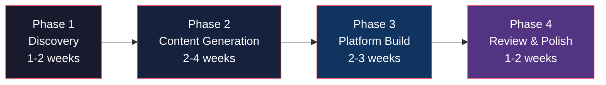

# Fundraising Infrastructure Platform: Service Pricing & Scope

> **The $3M fundraising stack -- built once, deliverable to any venture raising capital.**

---

## Table of Contents

1. [The Problem & The Offer](#the-problem--the-offer)
2. [Platform Inventory: What Gets Delivered](#platform-inventory-what-gets-delivered)
3. [Nine Service Categories](#nine-service-categories-with-market-pricing)
4. [Package Tiers](#package-tiers)
5. [The AI Advantage: Why Our Pricing Works](#the-ai-advantage-why-our-pricing-works)
6. [What Makes This Different](#what-makes-this-different)
7. [Engagement Model & Timeline](#engagement-model--timeline)
8. [Next Steps](#next-steps)

---

## The Problem & The Offer

Founders raising institutional capital face a brutal paradox: you need to spend money to raise money -- and the infrastructure required to do it right is fragmented across an entire ecosystem of vendors.

A typical $3M-$10M raise requires engaging **8+ separate firms**: a strategy consultancy for positioning, a law firm for entity structuring, tax advisors for multi-jurisdiction optimization, financial modelers for projections, market researchers for competitive intelligence, a web agency for investor-facing digital assets, a design firm for brand identity, and an investment bank for deal packaging. Assembled piecemeal, this costs **$1.5M-$3M+** and takes **6-12 months** before a single dollar is raised.

We built the entire stack -- 153+ documents, a live investor web platform, institutional-grade financial models, a 21-document data room, and a complete design system -- for a real venture raising real capital. Every deliverable is battle-tested, internally cross-referenced, and investor-ready.

**The offer:** We deliver a unified fundraising operating system, customized to your business, in **weeks, not months** -- at a fraction of the assembled cost.

---

## Platform Inventory: What Gets Delivered

| Deliverable | Scale |
|-------------|-------|
| Strategic documents | **153+ files (~561,000 words / ~1,120 pages)** |
| Interactive investor web platform | **30 pages, 20,000+ lines of code (Next.js)** |
| Financial model | **12-tab variable-driven Google Sheets model** -- fully linked front-to-back with formulas, scenario toggles, and assumption-driven flexibility |
| Investor-ready data room | **21 documents**, organized and gated |
| Design system | **Brand guidelines, color tokens, typography, component library** |
| CSV data exports | **10 structured datasets** |

> Every deliverable is customized to the client's specific business, market, and capital raise strategy. Nothing is a template fill-in.

---

## Nine Service Categories with Market Pricing

Each category includes: a description of what's built, what's included, the market comparable cost if hired separately, and our price.

### Summary Table

| # | Category | Market Value (Assembled Separately) | Our Price |
|---|----------|-------------------------------------|-----------|
| A | [Strategic Foundation](#a-strategic-foundation) | **$750K - $1.5M** | **$50K - $100K** |
| B | [Tax & Legal Architecture](#b-tax--legal-architecture) | **$400K - $750K** | **$40K - $75K** |
| C | [Financial Models & Valuation](#c-financial-models--valuation) | **$250K - $500K** | **$25K - $50K** |
| D | [Expansion Research](#d-expansion-research) | **$500K - $1.2M** | **$50K - $100K** |
| E | [Market Research & Intelligence](#e-market-research--intelligence) | **$150K - $400K** | **$20K - $40K** |
| F | [Location/Site Evaluation System](#f-locationsite-evaluation-system) | **$100K - $250K** | **$15K - $30K** |
| G | [Operational Blueprint](#g-operational-blueprint) | **$150K - $350K** | **$20K - $40K** |
| H | [Interactive Investor Platform](#h-interactive-investor-platform) | **$750K - $2M** | **$75K - $150K** |
| I | [Data Room & Investment Documents](#i-data-room--investment-documents) | **$200K - $500K** | **$25K - $50K** |
| | **Total** | **$3.25M - $7.45M** | **$320K - $635K** |

---

### A. Strategic Foundation

**What it is:** The master strategic narrative that ties your entire raise together -- vision, go-to-market strategy, executive summary, and the master plan that connects every other deliverable.

**What's included:**
- Master strategic plan with phased execution roadmap
- Vision document articulating market positioning and long-term thesis
- Go-to-market strategy with channel analysis and customer acquisition
- Executive summary calibrated for institutional investors
- Market strategy plan with competitive positioning

**Market comparable:** McKinsey/Bain/BCG strategy engagements run **$500K-$2M** per project. Boutique strategy firms charge **$200K-$400K**. This covers the same deliverables: positioning, GTM, and investor narrative.

> Sources: RocketBlocks (MBB fee benchmarks), Slideworks (consulting fee analysis), NMS Consulting (engagement pricing)

**Our price: $50K - $100K**

---

### B. Tax & Legal Architecture

**What it is:** Multi-entity, multi-jurisdiction corporate structuring optimized for asset protection, tax efficiency, and investor-ready governance -- complete with founder guides, board governance documentation, and entity-by-entity analysis.

**What's included:**
- Multi-entity master structure (e.g., holdings, operating companies, IP vehicles)
- Jurisdiction-by-jurisdiction analysis with tax optimization
- Board governance documents, committee charters, and bylaws
- Founder guides explaining personal tax implications
- Church/nonprofit structuring (where applicable)
- Entity setup guides and operational procedures

**Market comparable:** Big 4 tax structuring engagements (PwC, EY, Deloitte, KPMG) cost **$200K-$750K** for multi-jurisdiction work. Specialized international tax counsel runs **$500-$1,200/hr** with engagements totaling **$150K-$400K**.

> Sources: PwC and EY published rate cards, international tax advisory benchmarks

**Our price: $40K - $75K**

---

### C. Financial Models & Valuation

**What it is:** A **12-tab variable-driven Google Sheets financial model** where every tab is linked, all projections are driven by adjustable assumption variables, and changing a single input cascades through revenue, P&L, cash flow, unit economics, sensitivity analysis, and investment returns in real time.

**What's included:**
- 12-tab integrated Google Sheets model (revenue, expenses, P&L, cash flow, unit economics, sensitivity analysis, cap table, investment returns, scenario comparisons, assumptions dashboard, and more)
- IPEV-compliant valuation report using 9+ methodologies
- DCF analysis with multiple discount rate scenarios
- Sensitivity matrices across key variables
- Cap table modeling with dilution scenarios
- Break-even analysis and unit economics

> **This is not a collection of static CSV exports.** The deliverable is a living, institutional-grade model -- the kind a CFO or investment banker would build. Changing one assumption (occupancy rate, pricing, headcount, growth rate) cascades through every linked tab automatically. This is what separates a $10K "financial projection" from a **$75K-$150K institutional-grade model**.

**Market comparable:** Boutique investment banks and financial advisory firms charge **$50K-$150K+** for a fully linked, variable-driven multi-tab model. Big 4 transaction advisory services charge **$150K-$500K** when modeling is part of a broader engagement.

> Sources: Pivotal180 (financial modeling benchmarks), Toptal (financial modeling rates), boutique IB engagement letters

**Our price: $25K - $50K**

---

### D. Expansion Research

**What it is:** A comprehensive global expansion analysis that scores and ranks potential markets, provides deep regional dives, and delivers an actionable implementation roadmap with risk assessment.

**What's included:**
- Global location scoring matrix (30+ locations evaluated)
- Regional deep dives (Americas, Europe, Asia-Pacific, Middle East/Africa)
- Selection methodology with weighted criteria
- Market demand analysis per region
- Infrastructure requirements assessment
- Risk assessment with mitigation strategies
- Financial analysis per expansion target
- Implementation roadmap with phasing

**Market comparable:** Global site selection and expansion research from firms like Cushman & Wakefield, JLL, or MBB strategy firms runs **$500K-$1.2M** for multi-region, multi-criteria analysis.

> Sources: NMS Consulting, MBB engagement benchmarks, JLL advisory fee structures

**Our price: $50K - $100K**

---

### E. Market Research & Intelligence

**What it is:** Multi-industry competitive intelligence covering your competitive landscape, pricing benchmarks, market sizing, geographic intelligence, and trend analysis.

**What's included:**
- Competitive landscape analysis with 50+ competitor profiles
- Multi-industry market research (your sector and adjacent markets)
- Pricing analysis with tiered benchmarking
- Geographic intelligence and market accessibility scoring
- Cross-border demand and international market analysis
- Market sizing with TAM/SAM/SOM breakdown

**Market comparable:** Custom market research studies run **$25K-$65K each** (MainBrain, Drive Research). A comprehensive multi-study package covering 4+ industries with competitive profiling typically costs **$150K-$400K** through research firms or MBB.

> Sources: MainBrain (research pricing), Drive Research (study costs), IBISWorld benchmarks

**Our price: $20K - $40K**

---

### F. Location/Site Evaluation System

**What it is:** A structured property and site evaluation framework with individual property assessments, comparison matrices, and due diligence documentation.

**What's included:**
- Property evaluation framework with standardized scoring criteria
- Individual property assessments (4-8+ properties)
- Comparison summary with ranked recommendations
- Due diligence checklists per property
- Regulatory and zoning analysis
- Infrastructure and renovation cost estimates

**Market comparable:** Commercial real estate advisory and site selection consulting from firms like CBRE, JLL, or Cushman & Wakefield runs **$100K-$250K** for multi-property evaluation with due diligence support.

**Our price: $15K - $30K**

---

### G. Operational Blueprint

**What it is:** The detailed operational playbook -- standard operating procedures, program design, staffing models, and clinical/service protocols that prove to investors you know how to execute.

**What's included:**
- Standard operating procedures (SOPs) for core business segments
- Program design with guest/customer journey mapping
- Staffing models and organizational structure
- Service delivery protocols (medical, hospitality, technology, or your domain)
- Pre-service and post-service care frameworks
- Operational segment documentation (6-8 segments)

**Market comparable:** Operational consulting from Deloitte, Accenture, or boutique ops firms costs **$150K-$350K** for comprehensive SOP development, org design, and process documentation.

**Our price: $20K - $40K**

---

### H. Interactive Investor Platform

**What it is:** A fully custom Next.js web application that replaces the static pitch deck with an immersive, interactive investor experience -- complete with dashboards, gated data room, analytics, and a professional design system.

**What's included:**
- 30-page interactive investor web platform (Next.js / React)
- Password-protected investor portal with access controls
- Interactive financial dashboards with live data visualization
- Gated data room with document organization
- Design system with brand tokens, typography, color palettes, and component library
- Mobile-responsive, performance-optimized build
- Investor engagement analytics (time-on-page, section views, return visits)
- Meeting scheduler integration
- 20,000+ lines of production code

**Market comparable:** Custom SaaS/web platform development from agencies runs **$500K-$2M** (Clutch 2026, ScienceSoft benchmarks). A comparable investor portal with dashboards, gated access, and analytics from a top-tier agency would cost **$750K-$2M**.

> Sources: Clutch (2026 agency rate data), ScienceSoft (custom development pricing)

**Our price: $75K - $150K**

---

### I. Data Room & Investment Documents

**What it is:** The complete set of investor-facing legal and financial documents required to close a round -- organized, formatted, and ready for due diligence.

**What's included:**
- Private Placement Memorandum (PPM)
- Subscription agreement templates
- Investor pitch materials (narrative-driven, not slide decks)
- Due diligence document checklist and index
- Financial model guide for investors
- Investment thesis and risk factor documentation
- 21-document organized data room

**Market comparable:** PPM preparation alone costs **$15K-$75K** through securities attorneys (ContractsCounsel). Full data room assembly with investment documents through an investment bank advisory engagement runs **$200K-$500K**.

> Sources: ContractsCounsel (PPM pricing), Lazard/Evercore comparable advisory fees

**Our price: $25K - $50K**

---

## Package Tiers

### Tier 1: Launch Pad -- **$75K - $150K**

For early-stage founders raising their first institutional round.

| Included | Category |
|----------|----------|
| Strategic Foundation | A |
| Financial Models & Valuation | C |
| Data Room & Investment Documents | I |

> **Comparable cost assembled separately: $1.2M - $2.5M**
>
> You get the strategic narrative, institutional-grade financial models, and a complete data room -- everything you need to walk into an investor meeting with credibility.

---

### Tier 2: War Chest -- **$150K - $300K**

For growth-stage companies raising $5M+ who need the full research backing and a digital platform that demonstrates capability.

| Included | Category |
|----------|----------|
| Everything in Launch Pad | A, C, I |
| Market Research & Intelligence | E |
| Operational Blueprint | G |
| Interactive Investor Platform | H |

> **Comparable cost assembled separately: $2.25M - $5M**
>
> You get everything in Launch Pad plus deep market research, a detailed operational playbook, and a custom interactive web platform that replaces the pitch deck entirely.

---

### Tier 3: Full Arsenal -- **$350K - $750K**

For companies with global ambitions raising $10M+ who need the complete infrastructure across all 9 categories.

| Included | Category |
|----------|----------|
| All 9 categories, fully customized | A through I |

> **Comparable cost assembled separately: $3.25M - $7.45M**
>
> The complete fundraising operating system. Every document, every model, every platform component -- customized to your business, your market, and your raise.

---

### A La Carte

Individual modules available separately at category pricing listed above. Mix and match based on what you already have in place and where the gaps are.

---

## The AI Advantage: Why Our Pricing Works

Our pricing isn't a discount -- it's a structural cost advantage.

### The Data Behind It

We've documented the economics of our own production process:

| Metric | Traditional | Our Model |
|--------|-------------|-----------|
| **Cost reduction** | -- | **96-98%** lower production costs |
| **Delivery timeline** | 6-12 months | **6-12 weeks** |
| **Team required** | 6-8 specialists across firms | Integrated AI + senior review team |
| **Quality** | High | **High** (validated by institutional-grade output) |
| **Consistency** | Medium (multiple authors, firms) | **High** (unified system, cross-referenced) |

> Our internal cost analysis shows that AI-assisted production of institutional-grade documents achieves **96-98% cost reduction** versus traditional human-only production, while maintaining quality parity when paired with professional review. A single valuation report that costs $37K-$71K through traditional channels costs under $1,500 with our model -- and delivers in hours, not weeks.

### Why This Isn't a Compromise

- **AI handles volume and consistency**: 153+ documents that cross-reference each other perfectly
- **Senior professionals handle judgment**: Strategy, legal review, financial validation
- **The savings are structural**: We don't cut corners -- we eliminated the inefficiency of 8 separate vendor workflows, sequential handoffs, and coordination overhead
- **Speed is a feature**: Raising capital is time-sensitive. Six months of document preparation is six months of runway burned before you even start

---

## What Makes This Different

This is not a template library. This is not a pitch deck generator. This is not a form-fill service.

### An Integrated System, Not a Collection of Files

Every number in the financial model traces back to the market research. Every claim in the executive summary is supported by the operational blueprint. Every projection in the data room matches the investor platform dashboards. Change one assumption and it cascades through 153+ documents and a live web platform.

### Battle-Tested on a Real Raise

This framework was built for a real company raising real capital -- not in a classroom, not as a theoretical exercise. Every deliverable has been reviewed through the lens of "would an institutional investor write a check based on this?"

### An Interactive Platform, Not Just PDFs

Most fundraising advisory ends with a stack of documents. We deliver a **live, interactive web platform** that investors can explore -- with dashboards, gated access, analytics, and a design system that signals technical competence before you say a word.

### Living Financial Models, Not Static Spreadsheets

The 12-tab Google Sheets model isn't a snapshot -- it's an instrument. Adjust assumptions and watch projections cascade in real time. Investors can stress-test your model themselves, which builds the confidence that closes rounds.

### One Coherent Narrative Across 153+ Documents

From the 30,000-foot vision to the granular SOP, every document tells the same story in the same voice with the same numbers. This level of internal consistency is nearly impossible when 8 different vendors each write their own piece.

---

## Engagement Model & Timeline

### Phase 1: Discovery (1-2 weeks)

- Deep-dive into your business, market, and capital raise strategy
- Define scope, deliverables, and success criteria
- Audit existing materials and identify gaps
- Establish brand voice, positioning, and target investor profile

### Phase 2: Content Generation (2-4 weeks)

- Strategic documents, market research, financial models, and operational blueprints
- Tax and legal architecture design
- Data room assembly and investment document drafting
- Continuous client review checkpoints

### Phase 3: Platform Build (2-3 weeks)

- Interactive investor web platform development
- Dashboard and data visualization integration
- Design system implementation
- Data room portal with access controls

### Phase 4: Review & Polish (1-2 weeks)

- End-to-end quality assurance and cross-reference validation
- Professional review of all financial models and legal documents
- Client walkthrough and revision cycle
- Launch preparation and investor outreach strategy

**Total timeline: 6-12 weeks** (versus 6-12 months assembled traditionally)

---

## Next Steps

**Ready to build your fundraising infrastructure?**

1. **Schedule a walkthrough** -- We'll show you the live platform and actual deliverables from a completed engagement, not a sales deck.

2. **NDA available** -- We're happy to execute a mutual NDA before sharing specifics about our methodology, tooling, or client work.

3. **Custom scoping** -- Every raise is different. We'll scope a package tailored to your business, your market, and the amount you're raising.

> **Contact:** [Schedule a conversation to get started.]

---

**Document Version:** 1.0
**Date:** February 2026
**Classification:** Client-Facing / Proposal

---

*Built by a team that raised capital with this exact infrastructure -- and is now making it available to every ambitious founder who refuses to spend $3M before raising their first dollar.*
