<[README](../README.md) | [Vision](./VISION.md) | [Master Plan](./MASTER_PLAN.md) | [Pillars](./pillars/01_MEDICAL_OVERSIGHT.md) | [Programs](./programs/PROGRAM_OVERVIEW.md) | [Architecture](./architecture/SYSTEM_OVERVIEW.md)>

---

# Phase 1: Global Market Research Mandate

> *Transformational Epicenter - Medical, Bio-Optimization Clinic & AI Superintelligent System and Strategy*

---

## TL;DR — Executive Summary

```
┌─────────────────────────────────────────────────────────────────────────────┐
│                              AT A GLANCE                                     │
├─────────────────────────────────────────────────────────────────────────────┤
│                                                                              │
│  THE MARKET:        Fragmented. Medical, wellness, plant medicine, and      │
│                     longevity clinics all operate in silos. No one has      │
│                     unified them into a single transformational journey.    │
│                                                                              │
│  THE GAP:           An unoccupied summit position exists at the             │
│                     intersection of medical rigor, plant medicine,          │
│                     bio-optimization, luxury hospitality, and AI-driven     │
│                     personalization.                                        │
│                                                                              │
│  THE OPPORTUNITY:   $5.6T global wellness economy. Rising demand for        │
│                     deep transformation. Post-pandemic meaning-seeking.     │
│                     Psychedelic medicine going mainstream.                  │
│                                                                              │
│  OUR POSITION:      Category-defining, not competitive. We integrate        │
│                     what others separate, continue what others interrupt,   │
│                     and personalize what others generalize.                 │
│                                                                              │
│  KEY ADVANTAGES:    • Full integration (medical + spiritual + identity)     │
│                     • Continuity (pre-care → treatment → post-care)         │
│                     • AI Superintelligent System (dynamic personalization)  │
│                     • Outcome-anchored pricing (transformation, not days)   │
│                                                                              │
│  TARGET CLIENTS:    HNW executives, addiction sufferers, trauma survivors,  │
│                     longevity seekers, meaning seekers — willing to pay     │
│                     $15,000 – $100,000+ for lasting transformation.         │
│                                                                              │
│  THE VERDICT:       The market is ready. Demand is acute. Competition is    │
│                     fragmented. The summit is unoccupied. The time is now.  │
│                                                                              │
│  ─────────────────────────────────────────────────────────────────────────  │
│                                                                              │
│  "We are not building a better clinic. We are building THE destination."    │
│                                                                              │
└─────────────────────────────────────────────────────────────────────────────┘
```

---

## 1. Objective of the Market Research

The primary objective of this market research phase is to map, benchmark, and stress-test the current global landscape of:

- Medical retreats
- Biohacking and longevity clinics
- Plant-medicine and Ibogaine treatment centers
- Luxury wellness and transformational sanctuaries
- Integrated pre-care and post-care programs

### Strategic Goal

The ultimate goal is to engineer and position our clinic as the **undisputed global summit**:
- Not incremental
- Not competitive
- **Category-defining**

### Research Informs

This research will directly inform:

| Area | Application |
|------|-------------|
| Clinical Offerings | Service design and modality selection |
| Protocol Design | 7, 14, 21, 28+ day program structures |
| Pricing Architecture | Tiered value-based pricing strategy |
| Geographic Positioning | Optimal location selection |
| Messaging & Value Proposition | Market differentiation and communication |
| AI-Driven Personalization | System requirements and data models |


---

## 2. Reference Clinics for Initial Benchmarking

The AI system should begin by deeply analyzing the following reference archetypes—not to copy them, but to identify ceilings, gaps, and blind spots.

### Initial Benchmark Clinics

| Clinic | Primary Focus |
|--------|---------------|
| **SHA Wellness Clinic** | Medical rigor and clinical excellence |
| **Shockwave Clinic** | Performance and biohacking protocols |
| **Tulum Sanctuary** | Plant-medicine integration and setting |

### Analysis Dimensions

These serve as entry points into:
- Medical rigor and clinical credibility
- Luxury execution and hospitality standards
- Plant-medicine integration and safety protocols
- Branding and pricing psychology

---

## 3. Global Category Scan

### What Are the Best Clinics in the World Actually Offering?

The AI system should perform a global scan across the following categories:

### A. Medical & Longevity Clinics

| Offering | Description |
|----------|-------------|
| Functional Medicine Diagnostics | Root-cause analysis and systems-based medicine |
| Hormonal Optimization | Testosterone, thyroid, cortisol, and metabolic balancing |
| Peptides | BPC-157, Thymosin Alpha-1, growth hormone secretagogues |
| Anti-Aging & Regenerative Therapies | Stem cells, PRP, exosomes, NAD+ |
| Advanced Testing | Epigenetic, DNA, blood panels, microbiome analysis |

### B. Biohacking & Performance Centers

| Offering | Description |
|----------|-------------|
| Hyperbaric Oxygen Therapy | Cellular regeneration and healing acceleration |
| Red Light & Photobiomodulation | Mitochondrial function and tissue repair |
| Cryotherapy & Cold Exposure | Inflammation reduction and metabolic activation |
| Functional Fitness & Recovery | Movement protocols and performance optimization |
| Neurocognitive Optimization | Brain training, nootropics, neurofeedback |

### C. Plant Medicine & Trauma Resolution Centers

| Offering | Description |
|----------|-------------|
| Ibogaine & Iboga | Medically supervised addiction interruption |
| Psychedelic-Assisted Therapy | Legal jurisdictions: psilocybin, ketamine, MDMA |
| Addiction Interruption Protocols | Comprehensive detox and reset programs |
| Nervous System Restoration | Vagal toning, somatic release, polyvagal approaches |
| Trauma & Identity Repair | Deep psychological and spiritual integration |

### D. Luxury Wellness & Transformational Retreats

| Offering | Description |
|----------|-------------|
| High-Touch Hospitality | Personalized service and attention to detail |
| Privacy & Discretion | Ultra-private settings for high-profile clientele |
| Concierge-Level Care | Dedicated support teams and custom experiences |
| Spiritual & Emotional Integration | Meaning-making and identity transformation |

### AI Analysis Requirements

The AI should identify:
- **What is offered** — Current service landscape
- **What is missing** — Gaps in the market
- **Where outcomes fall short** — Limitations of existing approaches
- **Where experiences fragment** — Lack of integration and continuity


---

## 4. Stress-Testing Our Concept Against the Global Best

The AI system should stress-test our concept against the global benchmark across the following dimensions:

### Integration

**Most Clinics:** Specialize in ONE vertical — Medical OR Spiritual OR Performance

**Transformational Epicenter:** Integrates ALL dimensions into ONE continuum


### Continuity

**Most Clinics:** Treat an EVENT — Arrival → Treatment → Departure → *Nothing*

**Transformational Epicenter:** Delivers a JOURNEY with continuous support

```mermaid
flowchart TB
    subgraph COMPETITORS["❌ MOST CLINICS — The Event Model"]
        direction LR
        A1[Arrival] --> T1[Treatment] --> D1[Departure] --> N1[Nothing]
        style N1 fill:#7f1d1d,stroke:#991b1b,color:#fff
    end

    subgraph EPICENTER["✓ TRANSFORMATIONAL EPICENTER — The Journey Model"]
        direction LR
        P[Pre-Care] --> T[Immersive<br/>Treatment] --> PC[Post-Care] --> IE[Identity<br/>Embodiment]

        P -.->|Long-Term Integration| LTI((Continuous<br/>Support))
        T -.-> LTI
        PC -.-> LTI
        IE -.-> LTI
    end

    style COMPETITORS fill:#7f1d1d,stroke:#991b1b,color:#fff
    style EPICENTER fill:#14532d,stroke:#166534,color:#fff
    style LTI fill:#f59e0b,stroke:#d97706,color:#000
```



### Personalization

**Most Clinics:** Customize protocols MANUALLY — Static assessments → Fixed protocols

**Transformational Epicenter:** Deploys AI SUPERINTELLIGENT SYSTEM for dynamic personalization


---

## 5. Pricing & Protocol Market Analysis

The AI system should map current global pricing across all relevant categories.

### Typical Market Ranges (Observed)

| Category | Price Range | Notes |
|----------|-------------|-------|
| Medical Retreats | $7,000 – $25,000 | Functional medicine, diagnostics, protocols |
| Longevity Clinics | $15,000 – $60,000 | Advanced regenerative, stem cells, comprehensive |
| Ibogaine Programs | $6,000 – $15,000 | Medically supervised, varies by location |
| Luxury Transformational Retreats | $10,000 – $50,000+ | High-touch, comprehensive experiences |

### Our Strategic Positioning

> **We are not price-anchored. We are outcome-anchored.**

### Protocol Pricing Tiers to Evaluate

| Protocol Duration | Focus | Target Market |
|-------------------|-------|---------------|
| **7-Day Reset** | Introduction, assessment, nervous system regulation | Entry-level transformation |
| **14-Day Optimization** | Deep protocols, bio-optimization, initial integration | Performance-focused clients |
| **21-Day Transformation** | Complete treatment cycles, comprehensive healing | Serious transformation seekers |
| **28-Day Identity Restoration** | Full journey, identity-level change, lasting integration | Premium, committed individuals |
| **White-Glove Executive & Family** | Private, customized, multi-person programs | Ultra-high-net-worth individuals |

```mermaid
flowchart LR
    subgraph TIERS["📈 PROTOCOL PROGRESSION"]
        direction LR
        R[🌱 7-Day<br/>Reset] --> O[⚡ 14-Day<br/>Optimization] --> T[🔄 21-Day<br/>Transformation] --> I[✨ 28-Day<br/>Identity<br/>Restoration] --> W[👑 White-Glove<br/>Executive]
    end

    R -.- E1[Entry-Level]
    O -.- E2[Performance-Focused]
    T -.- E3[Serious Seekers]
    I -.- E4[Premium Committed]
    W -.- E5[Ultra-HNW]

    style TIERS fill:#1e3a5f,stroke:#2563eb,color:#fff
    style R fill:#059669,stroke:#047857,color:#fff
    style O fill:#0891b2,stroke:#0e7490,color:#fff
    style T fill:#7c3aed,stroke:#6d28d9,color:#fff
    style I fill:#db2777,stroke:#be185d,color:#fff
    style W fill:#f59e0b,stroke:#d97706,color:#000
```



### AI Evaluation Criteria

The AI should evaluate:
- **Willingness to pay** — What clients actually spend for transformation
- **Outcome justification** — What outcomes justify premium pricing
- **Value multipliers** — Where scarcity, privacy, and depth increase perceived value

---

## 6. Medical Tourism & Client Demand Analysis

### What Are International Clients Looking For?

| Need | Description |
|------|-------------|
| **Safety & Medical Legitimacy** | Credentialed physicians, proper facilities, proven protocols |
| **Legal Clarity & Discretion** | Clear regulatory environment, privacy protections |
| **Deep Healing** | Beyond symptom management to root-cause resolution |
| **Addiction Interruption** | Without stigma, with dignity and comprehensive support |
| **Trauma Resolution** | Efficient healing without years of traditional therapy |
| **Longevity & Vitality** | Performance optimization and healthspan extension |
| **Meaning & Purpose** | Identity restoration and life direction clarity |

### Why They Travel Internationally

| Reason | Explanation |
|--------|-------------|
| **Access** | Treatments unavailable in home country |
| **Cost Efficiency** | Better value relative to outcomes |
| **Privacy** | Distance from personal/professional networks |
| **Integration** | Comprehensive experiences not offered domestically |

```mermaid
flowchart TB
    subgraph CLIENT["🎯 CLIENT NEEDS"]
        N1[Safety & Medical<br/>Legitimacy]
        N2[Deep Healing]
        N3[Addiction<br/>Interruption]
        N4[Trauma Resolution]
        N5[Longevity & Vitality]
        N6[Meaning & Purpose]
    end

    subgraph DRIVERS["✈️ WHY TRAVEL INTERNATIONALLY"]
        D1[Access to<br/>Unavailable Treatments]
        D2[Better Value<br/>for Outcomes]
        D3[Privacy &<br/>Discretion]
        D4[Comprehensive<br/>Integration]
    end

    subgraph DESTINATION["🏔️ TRANSFORMATIONAL EPICENTER"]
        TE((The Summit<br/>Destination))
    end

    N1 & N2 & N3 --> D1
    N3 & N4 & N5 --> D2
    N1 & N3 & N6 --> D3
    N2 & N4 & N5 & N6 --> D4

    D1 & D2 & D3 & D4 --> TE

    style CLIENT fill:#1e3a5f,stroke:#2563eb,color:#fff
    style DRIVERS fill:#7c2d12,stroke:#9a3412,color:#fff
    style DESTINATION fill:#14532d,stroke:#166534,color:#fff
    style TE fill:#f59e0b,stroke:#d97706,color:#000
```



---

## 7. Geographic Intelligence Layer

The AI system should evaluate optimal geographic zones for clinic establishment.

### Evaluation Criteria

| Factor | Considerations |
|--------|----------------|
| **Ibogaine & Iboga Legality** | Legal status, regulatory framework, enforcement |
| **Medical Infrastructure** | Hospital access, emergency services, specialist availability |
| **International Accessibility** | Airport proximity, visa requirements, travel logistics |
| **Cost Efficiency** | Operating costs, labor, real estate, supplies |
| **Regulatory Flexibility** | Business-friendly environment, healthcare innovation support |
| **Cultural Compatibility** | Language, hospitality culture, healing traditions |

### Priority Regions for Analysis

| Region | Key Considerations |
|--------|-------------------|
| **Mexico (Multiple Regions)** | Legal ibogaine, medical tourism infrastructure, accessibility |
| **Central America** | Costa Rica, Guatemala, Panama — varying legal frameworks |
| **Select European Jurisdictions** | Portugal, Netherlands — progressive drug policies |
| **Offshore Jurisdictions** | Caribbean options — regulatory flexibility |

---

## 8. AI Superintelligent System — Research Execution Role

The AI Superintelligent System will execute the following research functions:

### AI Research Execution Functions

```mermaid
flowchart TB
    subgraph DC["📥 DATA COLLECTION"]
        DC1[Scrape Global<br/>Clinic Websites]
        DC2[Extract Pricing &<br/>Positioning Info]
        DC3[Catalog Service<br/>Menus & Modalities]
        DC4[Document Facility<br/>Features]
    end

    subgraph AN["🔍 ANALYSIS"]
        AN1[Analyze Pricing<br/>Patterns]
        AN2[Identify Unmet<br/>Demand & Gaps]
        AN3[Map Competitive<br/>Landscape]
        AN4[Assess Outcome<br/>Claims]
    end

    subgraph MD["🧮 MODELING"]
        MD1[Model Optimal<br/>Service Stacks]
        MD2[Recommend Pricing<br/>Architecture]
        MD3[Inform Facility<br/>Design]
        MD4[Design Data<br/>Flows]
    end

    subgraph INT["⚡ INTEGRATION"]
        INT1[Personalized<br/>Treatment Engines]
        INT2[Protocol Design<br/>& Sequencing]
        INT3[Real-Time<br/>Optimization]
    end

    DC --> AN --> MD --> INT

    style DC fill:#1e3a5f,stroke:#2563eb,color:#fff
    style AN fill:#7c2d12,stroke:#9a3412,color:#fff
    style MD fill:#4c1d95,stroke:#6d28d9,color:#fff
    style INT fill:#14532d,stroke:#166534,color:#fff
```



### Research Philosophy

> **This research phase is not academic. It is strategic intelligence.**

---

## 9. Outcome of This Market Research Phase

### Deliverables

By the end of this phase, we will have:

| Deliverable | Description |
|-------------|-------------|
| **Global Competitive Map** | Comprehensive landscape of all relevant competitors |
| **Validated Pricing Strategy** | Data-driven pricing architecture and tier structure |
| **Differentiated Clinical Offering** | Unique service stack that fills market gaps |
| **Defensible Summit-Level Position** | Clear articulation of why we are the destination |
| **AI System Foundation** | Data-driven foundation for personalization engine |
| **Absolute Clarity** | Complete understanding of how we become the destination |

### Success Criteria

```mermaid
flowchart LR
    subgraph SUCCESS["✅ RESEARCH PHASE SUCCESS CRITERIA"]
        direction TB
        S1[Every major competitor<br/>analyzed and mapped]
        S2[Pricing benchmarks<br/>established]
        S3[Market gaps identified<br/>and validated]
        S4[Geographic options<br/>evaluated]
        S5[Client demand patterns<br/>documented]
        S6[AI system requirements<br/>defined]
        S7[Summit-level positioning<br/>articulated]
    end

    S1 --> S2 --> S3 --> S4 --> S5 --> S6 --> S7 --> DONE((✓<br/>COMPLETE))

    style SUCCESS fill:#14532d,stroke:#166534,color:#fff
    style DONE fill:#f59e0b,stroke:#d97706,color:#000
```



---

## Research Execution Framework

```mermaid
flowchart LR
    subgraph P1A["📥 PHASE 1A<br/>Data Collection"]
        A1[Compile<br/>Competitor List]
        A2[Extract Offerings<br/>& Pricing]
        A3[Document<br/>Facilities]
        A4[Catalog<br/>Testimonials]
    end

    subgraph P1B["🔍 PHASE 1B<br/>Analysis"]
        B1[Identify<br/>Patterns]
        B2[Map Gaps &<br/>Unmet Needs]
        B3[Analyze Pricing<br/>Psychology]
        B4[Assess Geographic<br/>Options]
    end

    subgraph P1C["💡 PHASE 1C<br/>Recommendations"]
        C1[Define Service<br/>Stack]
        C2[Recommend<br/>Pricing]
        C3[Propose<br/>Geography]
        C4[Outline AI<br/>Requirements]
    end

    subgraph P1D["📄 PHASE 1D<br/>Integration"]
        D1[Document<br/>Findings]
        D2[Update<br/>Master Plan]
        D3[Refine<br/>Protocols]
        D4[Feed AI<br/>System]
    end

    P1A --> P1B --> P1C --> P1D

    style P1A fill:#1e3a5f,stroke:#2563eb,color:#fff
    style P1B fill:#7c2d12,stroke:#9a3412,color:#fff
    style P1C fill:#4c1d95,stroke:#6d28d9,color:#fff
    style P1D fill:#14532d,stroke:#166534,color:#fff
```



### Phase 1A: Data Collection

- Compile comprehensive list of global competitors
- Extract service offerings, pricing, and positioning
- Document facility features and locations
- Catalog testimonials and outcome claims

### Phase 1B: Analysis & Synthesis

- Identify patterns across competitor landscape
- Map gaps and unmet needs
- Analyze pricing psychology and value perception
- Assess geographic advantages and constraints

### Phase 1C: Strategic Recommendations

- Define optimal service stack
- Recommend pricing architecture
- Propose geographic positioning
- Outline AI system requirements

### Phase 1D: Documentation & Integration

- Document all findings in structured format
- Integrate recommendations into master plan
- Update protocol designs based on insights
- Feed data into AI system development

---

## 10. Strategic Conclusion: Market Position & Opportunity

### The Current Landscape — A Fragmented Industry

The global wellness, longevity, and transformational healing market is characterized by **fragmentation and specialization**. Existing players have carved out niches:

| Market Segment | Strength | Critical Gap |
|----------------|----------|--------------|
| **Medical Retreats** | Clinical credibility, diagnostic depth | Lack spiritual/identity dimensions |
| **Longevity Clinics** | Cutting-edge technology, bio-optimization | Transactional, no continuity of care |
| **Ibogaine Centers** | Powerful addiction interruption | Often lack medical rigor, no integration |
| **Luxury Wellness** | Hospitality excellence, beautiful settings | Surface-level, no lasting transformation |
| **Spiritual Retreats** | Meaning and purpose exploration | Lack medical oversight and safety |

**No single player has unified these verticals into a coherent, continuous healing journey.**

This is not an oversight—it is a structural limitation. Building such an offering requires:
- Significant capital investment
- Multi-disciplinary expertise
- Sophisticated technology infrastructure
- Regulatory navigation capability
- A fundamentally different operational philosophy

### The White Space — An Unoccupied Summit


**The Summit Position:** Transformational Epicenter occupies the uncontested upper-right quadrant—maximum medical rigor combined with maximum integration across all healing dimensions.

### The Opportunity — Category Creation, Not Competition

Transformational Epicenter is not entering an existing category to compete—it is **creating a new category** at the intersection of:

1. **Medical Excellence** — Hospital-grade safety, physician oversight, advanced diagnostics
2. **Plant Medicine Mastery** — Medically supervised Ibogaine with proper screening and monitoring
3. **Bio-Optimization Technology** — State-of-the-art modalities for recovery and performance
4. **Luxury Hospitality** — Privacy, comfort, and care that enables complete surrender
5. **Psychological Depth** — Trauma-informed, nervous system-focused integration
6. **Spiritual Dimension** — Identity restoration, meaning-making, purpose clarity
7. **Technological Intelligence** — AI-driven personalization extending beyond the stay

### Competitive Moats — Defensible Advantages

| Moat | Description | Difficulty to Replicate |
|------|-------------|------------------------|
| **Integration Architecture** | Single unified journey across all healing dimensions | Very High — requires complete operational redesign |
| **Continuity Model** | Pre-care → Treatment → Post-care → Long-term integration | High — requires technology and team alignment |
| **AI Superintelligent System** | Dynamic, learning, personalized protocol engine | Very High — significant R&D and data investment |
| **Medical-Plant Medicine Bridge** | Proper medical oversight for powerful substances | High — requires rare expertise combination |
| **Outcome Orientation** | Priced on transformation delivered, not services rendered | Medium — requires confidence and track record |


### Market Size & Demand Signals

| Indicator | Signal |
|-----------|--------|
| **Global Wellness Economy** | $5.6 trillion and growing 5-10% annually |
| **Medical Tourism** | $100+ billion, with transformation-seeking travelers increasing |
| **Longevity Market** | $27 billion projected by 2026, driven by HNW individuals |
| **Psychedelic Medicine** | Rapidly expanding legal frameworks, mainstream acceptance accelerating |
| **Addiction Crisis** | 21 million Americans affected, conventional treatment fails 90%+ |
| **Mental Health Demand** | Post-pandemic surge, waitlists measured in months |
| **Executive Burnout** | Unprecedented demand for reset and optimization among leaders |

### Client Profile — Who We Serve

**Primary Segments:**

| Segment | Need | Willingness to Pay |
|---------|------|-------------------|
| **High-Performing Executives** | Reset, optimization, clarity | $30,000 – $100,000+ |
| **Addiction Sufferers (HNW)** | Interruption without stigma | $25,000 – $75,000 |
| **Trauma Survivors** | Resolution without years of therapy | $20,000 – $60,000 |
| **Longevity Seekers** | Healthspan extension, vitality | $25,000 – $80,000 |
| **Meaning Seekers** | Purpose, identity, direction | $15,000 – $50,000 |

**Common Characteristics:**
- Have tried conventional approaches without lasting results
- Value privacy and discretion
- Willing to invest significantly in transformation
- Seek depth over superficiality
- Ready for a journey, not just an event

### Pricing Power — Outcome-Anchored Value

The market research reveals a critical insight:

> **Clients are not paying for days, services, or modalities. They are paying for transformation.**

When a 28-day program delivers:
- Freedom from 20-year addiction
- Resolution of decades-old trauma
- Restoration of vitality and energy
- Clarity of identity and purpose
- A new relationship with self and life

...the value is not comparable to hotel nights or treatment sessions. It is comparable to:
- Years of therapy avoided
- Relationships saved
- Careers preserved or elevated
- Health crises prevented
- Life itself reclaimed

**This is why we price on outcomes, not inputs.**

### Strategic Position Summary

```mermaid
flowchart TB
    subgraph POSITION["🏔️ TRANSFORMATIONAL EPICENTER — STRATEGIC POSITION"]
        direction TB

        subgraph WHATWEARE["✅ WHAT WE ARE"]
            WA[The world's first fully integrated<br/>medical, bio-optimization, plant medicine,<br/>and identity transformation clinic<br/>— powered by AI —<br/>delivering continuous care from<br/>first contact through lifelong integration]
        end

        subgraph WHATWERENOT["❌ WHAT WE ARE NOT"]
            N1[Not a medical retreat<br/>— we go beyond physical]
            N2[Not a wellness spa<br/>— we create lasting change]
            N3[Not just ibogaine<br/>— we integrate into complete journey]
            N4[Not a biohacking center<br/>— we address whole person]
            N5[Not a spiritual retreat<br/>— we ground in medical science]
        end

        subgraph OURPOSITION["⭐ OUR POSITION"]
            OP[Category-defining • Summit-level<br/>The destination for those ready<br/>for real transformation]
        end

        subgraph OPPORTUNITY["🎯 THE OPPORTUNITY"]
            O1[Massive unmet demand]
            O2[No integrated competitor]
            O3[Favorable regulatory environment]
            O4[Technology enables personalization]
            O5[Mature medical tourism infrastructure]
            O6[Post-pandemic meaning-seeking]
        end

        subgraph PATH["🛤️ THE PATH"]
            P[Execute Phase 1 research → Validate assumptions<br/>→ Build AI foundation → Design protocols<br/>→ Launch as the undisputed summit]
        end
    end

    WHATWEARE --> WHATWERENOT --> OURPOSITION --> OPPORTUNITY --> PATH

    style POSITION fill:#1e1e2e,stroke:#45475a,color:#fff
    style WHATWEARE fill:#14532d,stroke:#166534,color:#fff
    style WHATWERENOT fill:#7f1d1d,stroke:#991b1b,color:#fff
    style OURPOSITION fill:#f59e0b,stroke:#d97706,color:#000
    style OPPORTUNITY fill:#1e3a5f,stroke:#2563eb,color:#fff
    style PATH fill:#4c1d95,stroke:#6d28d9,color:#fff
```



### Final Assessment

**The market is ready. The demand is acute. The competition is fragmented. The technology is available. The opportunity is now.**

Transformational Epicenter is positioned to become not just the best clinic in its category—but to define the category itself. By integrating what others separate, continuing what others interrupt, and personalizing what others generalize, we occupy a summit position that is:

- **Defensible** — Requires capabilities most cannot assemble
- **Valuable** — Addresses pain points clients will pay premium prices to resolve
- **Scalable** — AI and protocol standardization enable replication
- **Timely** — Cultural, regulatory, and technological conditions align

This market research phase will transform strategic intuition into validated intelligence, ensuring every decision—from protocol design to pricing architecture to geographic positioning—is grounded in evidence and optimized for category dominance.

**We are not building a better clinic. We are building the destination.**

---

**Version**: 1.0.0
**Last Updated**: January 2025
**Status**: Phase 1 - Global Market Research Mandate
