<[README](../README.md) | [Master Plan](./MASTER_PLAN.md) | [Pillars](./pillars/01_MEDICAL_OVERSIGHT.md) | [Programs](./programs/PROGRAM_OVERVIEW.md) | [Architecture](./architecture/SYSTEM_OVERVIEW.md)>

---

# Transformational Epicenter - Vision & Philosophy

> *"Bringing the lost travelers home to gardens of their hearts and souls."*

---

## Foundational Vision

Transformational Epicenter is a medical-based wellness and bio-optimization clinic with a luxury retreat experience, designed to address healing at the root level: physical, neurological, emotional, and spiritual.

The first Epicenter is envisioned to be in Mexico, with an average of 10 private guest rooms.

The core intention is not detox or short-term relief, but true transformation, nervous system repair, trauma resolution, and human remembrance.

---

## The Core Truth

Modern humans are suffering from a crisis of disconnection - from their bodies, their nervous systems, their emotions, their purpose, and their essential nature.

Traditional healthcare treats symptoms. Luxury wellness offers temporary escape. Spiritual retreats can bypass the body. Plant medicine ceremonies without integration leave experiences unanchored.

**Transformational Epicenter exists to bridge these gaps.**

We bring together:
- **Medical rigor** with **sacred reverence**
- **Scientific measurement** with **embodied wisdom**
- **Luxury hospitality** with **authentic care**
- **Deep transformation** with **practical integration**
- **Individual healing** with **community support**

---

## What We Believe

### 1. Healing Happens at the Root
Surface-level interventions create surface-level change. True transformation requires addressing the root: unprocessed trauma, dysregulated nervous systems, fragmented identity, and spiritual disconnection. We go to the root.

### 2. The Body Keeps the Score
Transformation is not merely cognitive. It is somatic. Neurological. Cellular. Our protocols honor the body as the primary vessel of healing - supporting it with medical precision and nurturing it with exceptional care.

### 3. Safety Creates Surrender
The nervous system cannot heal in a state of vigilance. We create environments of profound safety - medical, physical, emotional, and spiritual - so guests can fully surrender to their process.

### 4. Medicine is a Catalyst, Not a Destination
Plant medicine can open doors that years of therapy cannot. But the medicine alone is not the transformation. The real work is the integration - anchoring insights into daily life, identity, and purpose.

### 5. Luxury is Love Made Material
We reject the false dichotomy between spiritual depth and material comfort. Luxury at Transformational Epicenter is not indulgence - it is the physical expression of care. Every thread count, every meal, every design choice says: "You are worth this attention."

### 6. Transformation Requires a Continuum
A retreat is not an event. It is a phase in a longer arc. We support guests before they arrive (preparation), during their stay (experience), and long after they leave (integration). The full arc creates lasting change.

### 7. Community Sustains Change
Individual transformation flourishes within supportive community. We build containers for ongoing connection - both digital and physical - so no one walks the integration path alone.

---

## Who We Serve

### The Transformational Epicenter Guest

Our guests are high-functioning individuals who have achieved external success but sense something is missing. They may be:

- **Executives and entrepreneurs** carrying the weight of constant performance
- **Healthcare providers and healers** who have given so much they've depleted themselves
- **Artists and creatives** seeking to unlock deeper channels of expression
- **Parents and partners** wanting to show up more fully for those they love
- **Seekers** who have tried many modalities but haven't found the breakthrough
- **Survivors of trauma** ready to finally release what they've been carrying

**Common characteristics:**
- Resourceful and self-aware
- Ready for deep change, not just relief
- Willing to do the work, not seeking a "magic pill"
- Value quality and are willing to invest in themselves
- Often have some prior experience with personal growth work
- Seeking not just healing, but remembrance of who they truly are

---

## The Transformation We Facilitate

```mermaid
flowchart LR
    subgraph FROM["❌ FROM"]
        direction TB
        F1[Nervous system<br/>dysregulation]
        F2[Unprocessed<br/>trauma]
        F3[Disconnection<br/>from body]
        F4[Chronic stress<br/>& anxiety]
        F5[Identity<br/>fragmentation]
        F6[Lost purpose]
        F7[Isolation]
        F8[Surviving]
    end

    subgraph TRANSFORM["✨ TRANSFORMATION"]
        T((Transformational<br/>Epicenter<br/>Journey))
    end

    subgraph TO["✅ TO"]
        direction TB
        T1[Nervous system<br/>coherence]
        T2[Integrated<br/>experience]
        T3[Embodied<br/>presence]
        T4[Calm, grounded<br/>resilience]
        T5[Coherent<br/>sense of self]
        T6[Aligned<br/>mission]
        T7[Connected<br/>community]
        T8[Thriving]
    end

    FROM --> TRANSFORM --> TO

    style FROM fill:#fee2e2,stroke:#f87171,color:#7f1d1d
    style TRANSFORM fill:#fef3c7,stroke:#fbbf24,color:#92400e
    style TO fill:#d1fae5,stroke:#34d399,color:#065f46
    style T fill:#fef3c7,stroke:#fbbf24,color:#92400e
```

### From → To

| From | To |
|------|-----|
| Nervous system dysregulation | Nervous system coherence |
| Unprocessed trauma | Integrated experience |
| Disconnection from body | Embodied presence |
| Chronic stress and anxiety | Calm, grounded resilience |
| Identity fragmentation | Coherent sense of self |
| Lost purpose | Aligned mission |
| Isolation | Connected community |
| Surviving | Thriving |
| Asleep | Awake |

---

## The Eight Pillars

Our approach rests on eight foundational pillars, each essential to the whole:

```mermaid
mindmap
  root((Transformational<br/>Epicenter))
    🏥 Medical & Scientific
      Evidence-based protocols
      Rigorous safety screening
      Continuous monitoring
      Measurable outcomes
    🌿 Plant Medicine
      Iboga & Ibogaine
      Trauma-informed
      Medical oversight
      Sacred reverence
    🧬 Bio-Optimization
      State-of-the-art modalities
      Nervous system restoration
      Recovery acceleration
      Long-term vitality
    💚 Trauma Integration
      Personalized support
      Somatic therapies
      Nervous system work
      Identity healing
    ✨ Five-Star Hospitality
      Luxury environment
      Therapeutic massage
      Organic cuisine
      Functional fitness
    📱 Digital Ecosystem
      AI Superintelligent System
      Medical onboarding
      Community connection
      HIPAA-compliant
    🌱 Pre-Care
      4-8 weeks preparation
      Psychological readiness
      Nervous system priming
      Intention setting
    🔄 Post-Care
      3-12+ months integration
      Coaching & community
      Lasting change
      Alumni pathways
```

### Pillar 1: Medical and Scientific Oversight
Evidence-based protocols. Rigorous safety screening. Continuous monitoring. Measurable outcomes. We honor the body's complexity with medical precision.

### Pillar 2: Plant Medicine (Iboga & Ibogaine)
Trauma-informed, ethically held plant medicine experiences with strong medical oversight. We work primarily with Iboga and Ibogaine - medicines with profound capacity for nervous system reset and trauma resolution.

### Pillar 3: Advanced Bio-Optimization and Longevity
State-of-the-art modalities that restore the nervous system, accelerate recovery, and support long-term vitality. The body is the vehicle; we ensure it's optimized for the journey.

### Pillar 4: Trauma Integration and Nervous System Restoration
The medicine opens doors; integration walks through them. Personalized support through facilitators, somatic therapies, and practices that anchor transformation in the body.

### Pillar 5: Five-Star Hospitality, Nutrition, Care, and Functional Fitness
A luxury retreat environment where every detail supports healing. Daily therapeutic massage, organic chef-prepared meals, conscious architectural and interior design, exceptional human care, and functional fitness practices designed to support nervous system regulation, structural balance, strength, mobility, and resilience.

### Pillar 6: Digital Ecosystem and Community Support
Technology that extends care beyond walls. Medical onboarding, preparation content, daily schedules, integration practices, and community connection - all in one cohesive platform powered by the AI Superintelligent System.

### Pillar 7: Pre-Care (Preparation)
The foundation of transformation. 4-8 weeks of medical preparation, psychological readiness, nervous system priming, intention setting, and practical logistics. Preparation is not overhead - it determines the depth of what's possible.

### Pillar 8: Post-Care (Integration)
Where transformation becomes embodiment. 3-12+ months of processing, understanding, anchoring, and living the changes. Coaching, community, practices, and support to ensure insights become lasting change. Optional longevity and optimization programs.

---

## The Guest Journey Arc

```mermaid
flowchart LR
    subgraph JOURNEY["🛤️ THE GUEST JOURNEY ARC"]
        direction LR

        subgraph P1["🌅 PHASE 1<br/>AWAKENING"]
            P1A[4-8 weeks<br/>before arrival]
        end

        subgraph P2["🌊 PHASE 2<br/>IMMERSION"]
            P2A[7, 14, 21, or<br/>28 days on-site]
        end

        subgraph P3["🌱 PHASE 3<br/>INTEGRATION"]
            P3A[3-12 months<br/>post-retreat]
        end

        subgraph P4["✨ PHASE 4<br/>EMBODIMENT"]
            P4A[Lifetime<br/>transformation]
        end
    end

    P1 --> P2 --> P3 --> P4

    style JOURNEY fill:#f8fafc,stroke:#cbd5e1,color:#334155
    style P1 fill:#dbeafe,stroke:#3b82f6,color:#1e3a8a
    style P2 fill:#fef3c7,stroke:#fbbf24,color:#92400e
    style P3 fill:#d1fae5,stroke:#34d399,color:#065f46
    style P4 fill:#ede9fe,stroke:#a78bfa,color:#5b21b6
```

### Phase 1: Awakening (Pre-Retreat)
*Duration: 4-8 weeks before arrival*

- Medical screening and safety clearance
- Psychological preparation and intention setting
- Nervous system preparation practices
- Dietary and lifestyle adjustments
- Digital onboarding and education
- Community connection with facilitators

### Phase 2: Immersion (Retreat)
*Duration: 7, 14, 21, or 28 days*

- Medical monitoring throughout
- Plant medicine ceremony/ceremonies
- Bio-optimization protocols
- Daily integration practices
- Therapeutic bodywork
- Personalized care plan
- Luxurious rest and nourishment

### Phase 3: Integration (Post-Retreat)
*Duration: 3-12 months*

- Structured integration program
- Weekly/monthly coaching or group calls
- Community platform engagement
- Somatic practice maintenance
- Life restructuring support
- Optional longevity programs

### Phase 4: Embodiment (Ongoing)
*Duration: Lifetime*

- Alumni community membership
- Annual or bi-annual return visits
- Continued bio-optimization access
- Mentorship opportunities
- Contribution to the community

---

## The Physical Environment

### Design Philosophy

The Transformational Epicenter is not merely a building - it is a therapeutic environment. Every design choice serves the nervous system:

- **Biophilic Design**: Nature integration, natural materials, living systems
- **Acoustic Sanctuary**: Sound design that supports regulation
- **Light as Medicine**: Circadian lighting, therapeutic color
- **Sacred Geometry**: Proportions that create coherence
- **Conscious Materials**: Non-toxic, sustainable, beautiful
- **Flow and Privacy**: Movement options with retreat spaces

### The First Location

- **Location**: Mexico (specific site TBD)
- **Land**: 0.5 to 1 hectare
- **Capacity**: 10 private guest rooms
- **Structure**: Low-density buildings integrated into nature
- **Facilities**:
  - Medical center
  - Ceremony space
  - Bio-optimization center
  - Dining pavilion
  - Movement studio
  - Gardens and nature trails
  - Private guest casitas

---

## The Long-Term Vision

```mermaid
flowchart TB
    subgraph VISION["🔭 LONG-TERM VISION"]
        direction TB

        subgraph Y12["📋 PHASE 1: FOUNDATION<br/>Year 1-2"]
            Y12A[Launch Mexico Location]
            Y12B[Establish Protocols]
            Y12C[Digital Platform MVP]
            Y12D[Staff Training]
        end

        subgraph Y23["⚡ PHASE 2: OPTIMIZATION<br/>Year 2-3"]
            Y23A[Refine Protocols]
            Y23B[Expand Platform]
            Y23C[Build Reputation]
            Y23D[Expansion Playbook]
        end

        subgraph Y310["🚀 PHASE 3: EXPANSION<br/>Year 3-10"]
            Y310A[2nd & 3rd Locations]
            Y310B[Licensing Model]
            Y310C[Training Academy]
            Y310D[Research Partnerships]
        end

        subgraph Y10["🌍 PHASE 4: NETWORK<br/>Year 10+"]
            Y10A[30+ Global Locations]
            Y10B[Unified Platform]
            Y10C[Research Institute]
            Y10D[Thought Leadership]
        end
    end

    Y12 --> Y23 --> Y310 --> Y10

    style VISION fill:#f8fafc,stroke:#cbd5e1,color:#334155
    style Y12 fill:#dbeafe,stroke:#3b82f6,color:#1e3a8a
    style Y23 fill:#fef3c7,stroke:#fbbf24,color:#92400e
    style Y310 fill:#d1fae5,stroke:#34d399,color:#065f46
    style Y10 fill:#ede9fe,stroke:#a78bfa,color:#5b21b6
```

### Phase 1: Foundation (Year 1-2)
- Launch first Transformational Epicenter in Mexico
- Establish protocols and outcomes measurement
- Build digital platform MVP
- Develop training programs for staff

### Phase 2: Optimization (Year 2-3)
- Refine all protocols based on outcomes data
- Expand digital platform features
- Build international reputation
- Prepare expansion playbook

### Phase 3: Expansion (Year 3-10)
- Launch second and third locations
- Develop licensing/franchise model
- Create training academy
- Build research partnerships

### Phase 4: Network (Year 10+)
- 30+ Transformational Epicenters globally
- Unified platform and community
- Research institute
- Thought leadership in the field

---

## Success Metrics

### Guest Outcomes
- Nervous system regulation (HRV measurement)
- Trauma symptom reduction (validated scales)
- Quality of life improvement
- Integration success at 3, 6, 12 months
- Return visit and referral rates

### Operational Excellence
- Safety record (zero serious adverse events)
- Guest satisfaction scores
- Staff retention and satisfaction
- Financial sustainability

### Mission Impact
- Lives transformed
- Community strength
- Industry influence
- Research contributions

---

## AI Superintelligent System

Transformational Epicenter is supported by a HIPAA-compliant AI Superintelligent System that functions as a centralized intelligence layer, aggregating, organizing, and analyzing all relevant individual data collected throughout pre-care, on-site care, and post-care.

This system enables:
- Highly personalized treatment and optimization protocols
- Individualized care pathways
- Adaptive protocol recommendations
- Ongoing refinement based on outcomes and follow-up data
- Data-informed, individualized care at scale

Medical rigor, safety, personalization, and accountability are embedded from pre-care through long-term post-care.

---

## Wellness-Only Programs

In addition to plant medicine–supported journeys, Transformational Epicenter also offers dedicated wellness and health-focused programs that do not include plant medicine.

These non–plant medicine programs are designed for individuals seeking:
- Nervous system regulation
- Physical and neurological optimization
- Emotional resilience
- Longevity and regenerative health
- Recovery and preventive health
- Deep recalibration without plant medicine participation

These wellness-only programs leverage the same medical, bio-optimization, hospitality, functional fitness, and integration infrastructure, offering true healing, restoration, and transformation without requiring plant medicine participation.

This approach allows Transformational Epicenter to serve a broader population while maintaining the same ethical, medical, and experiential standards.

---

## Closing

Transformational Epicenter exists because millions of people are suffering unnecessarily - disconnected from their bodies, their purpose, and their essential nature.

We exist to create environments and experiences where people can remember who they really are.

Bringing the lost travelers home to gardens of their hearts and souls.

---

**Version**: 2.0.0
**Last Updated**: January 2025
