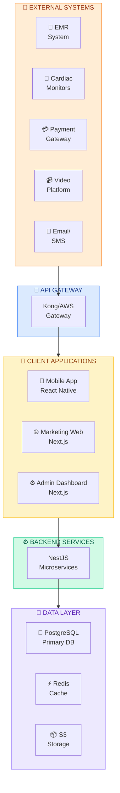
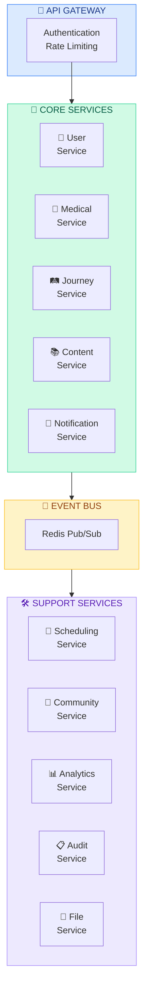
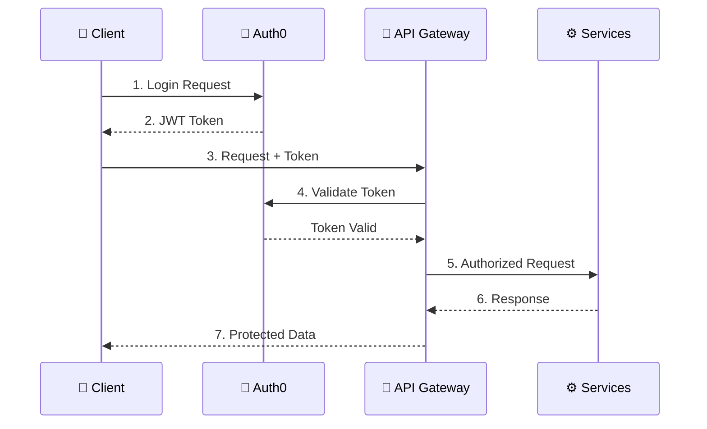

<[Home](../../README.md) | [All Architecture](../../README.md#technical-architecture) | Next: [Data](./DATA_ARCHITECTURE.md) | [Source Code](../../src/README.md)>

---

# System Architecture Overview

> *The digital nervous system of Transformational Epicenter*

---

## Architecture Vision

The Transformational Epicenter digital platform is designed to support the complete guest journey - from initial inquiry through lifelong integration. It must embody the same principles as the physical experience: safety, coherence, luxury, and transformation.

---

## Core Design Principles

### 1. Safety First
- HIPAA and GDPR compliance from day one
- Defense in depth security architecture
- Comprehensive audit logging
- Data encryption at rest and in transit

### 2. Guest-Centric
- Seamless experience across devices
- Offline-capable mobile app
- Accessibility by design
- Minimal friction in critical flows

### 3. Scalable Foundation
- Microservices architecture for independent scaling
- Cloud-native infrastructure
- Designed for 30+ locations
- Multi-tenant from the start

### 4. Integration Ready
- Open API architecture
- Standard healthcare protocols (HL7 FHIR)
- Webhook-based event system
- Third-party integration framework

---

## System Context



---

## Application Architecture

### Frontend Applications

#### 1. Guest Mobile App (React Native)
**Purpose**: Primary touchpoint for guests throughout their journey

**Key Features**:
- Medical intake and preparation
- Daily schedules and activities
- Integration practices and journaling
- Community and messaging
- Push notifications

**Technical Approach**:
- React Native with Expo for rapid development
- Offline-first with local SQLite
- Secure enclave for medical data
- Background sync for reliability

#### 2. Marketing Website (Next.js)
**Purpose**: Public-facing website for brand and acquisition

**Key Features**:
- Program information and booking
- Educational content and blog
- Application/inquiry forms
- Location and team information

**Technical Approach**:
- Static generation for performance
- Headless CMS integration
- SEO optimized
- Analytics integration

#### 3. Admin Dashboard (Next.js)
**Purpose**: Staff and operations management

**Key Features**:
- Guest management and journeys
- Medical records and monitoring
- Scheduling and assignments
- Analytics and reporting

**Technical Approach**:
- Server-side rendering for security
- Role-based access control
- Real-time updates via WebSockets
- Export and reporting tools

---

### Backend Services

#### Service Architecture (Microservices)



#### Service Descriptions

| Service | Responsibility | Key Entities |
|---------|---------------|--------------|
| User Service | Authentication, profiles, preferences | Users, Accounts, Roles |
| Medical Service | Health records, intake, screening | MedicalRecords, Screenings, Vitals |
| Journey Service | Program enrollment, stages, milestones | Journeys, Stages, Milestones |
| Content Service | Educational content, practices | Content, Practices, Resources |
| Scheduling Service | Appointments, availability | Appointments, Schedules, Staff |
| Community Service | Groups, messaging, events | Groups, Messages, Events |
| Notification Service | Push, email, SMS | Notifications, Templates |
| Analytics Service | Metrics, reporting | Events, Reports, Dashboards |
| Audit Service | Compliance logging | AuditLogs, AccessLogs |
| File Service | Document and media storage | Files, Attachments |

---

## Data Architecture

### Database Strategy

**Primary Database**: PostgreSQL
- Strong data integrity
- JSON support for flexible schemas
- Row-level security for multi-tenancy
- Excellent performance and scalability

**Caching Layer**: Redis
- Session storage
- API response caching
- Real-time pub/sub
- Rate limiting

**File Storage**: AWS S3
- Encrypted medical documents
- Media and images
- Backup storage
- CDN integration

### Data Residency

```
┌──────────────────────────────────────────────────────────────┐
│                    Data Classification                        │
├──────────────────────────────────────────────────────────────┤
│  PHI (Protected Health Information)                           │
│  - Medical records, screenings, vitals                        │
│  - Encrypted at rest (AES-256)                               │
│  - Access logged and audited                                  │
│  - Regional storage compliance                                │
├──────────────────────────────────────────────────────────────┤
│  PII (Personally Identifiable Information)                    │
│  - Names, contact info, demographics                          │
│  - Encrypted at rest                                          │
│  - Access controlled                                          │
├──────────────────────────────────────────────────────────────┤
│  Operational Data                                             │
│  - Schedules, appointments, content                           │
│  - Standard security controls                                 │
├──────────────────────────────────────────────────────────────┤
│  Analytics Data                                               │
│  - Aggregated, anonymized metrics                             │
│  - Used for improvement and research                          │
└──────────────────────────────────────────────────────────────┘
```

---

## Infrastructure

### Cloud Architecture (AWS)

```
┌──────────────────────────────────────────────────────────────────────┐
│                              AWS VPC                                   │
│  ┌────────────────────────────────────────────────────────────────┐  │
│  │                      Public Subnet                               │  │
│  │  ┌──────────────┐  ┌──────────────┐  ┌──────────────┐          │  │
│  │  │ CloudFront   │  │     ALB      │  │   NAT GW     │          │  │
│  │  │    (CDN)     │  │              │  │              │          │  │
│  │  └──────────────┘  └──────────────┘  └──────────────┘          │  │
│  └────────────────────────────────────────────────────────────────┘  │
│                                                                        │
│  ┌────────────────────────────────────────────────────────────────┐  │
│  │                     Private Subnet                               │  │
│  │  ┌──────────────┐  ┌──────────────┐  ┌──────────────┐          │  │
│  │  │   ECS/EKS    │  │  RDS Postgres │  │ ElastiCache  │          │  │
│  │  │  (Services)  │  │   (Primary)   │  │   (Redis)    │          │  │
│  │  └──────────────┘  └──────────────┘  └──────────────┘          │  │
│  │                                                                    │  │
│  │  ┌──────────────┐  ┌──────────────┐                              │  │
│  │  │     S3       │  │  Secrets Mgr │                              │  │
│  │  │  (Storage)   │  │   (Keys)     │                              │  │
│  │  └──────────────┘  └──────────────┘                              │  │
│  └────────────────────────────────────────────────────────────────┘  │
└──────────────────────────────────────────────────────────────────────┘
```

### Environment Strategy

| Environment | Purpose | Infrastructure |
|------------|---------|----------------|
| Development | Local development | Docker Compose |
| Staging | Testing and QA | Reduced AWS stack |
| Production | Live system | Full AWS stack |

---

## Security Architecture

### Authentication Flow



### Security Layers

1. **Network Security**
   - VPC isolation
   - Security groups
   - WAF (Web Application Firewall)
   - DDoS protection

2. **Application Security**
   - JWT authentication
   - Role-based access control
   - Input validation
   - Output encoding

3. **Data Security**
   - Encryption at rest (AES-256)
   - Encryption in transit (TLS 1.3)
   - Key management (AWS KMS)
   - Data masking

4. **Operational Security**
   - Audit logging
   - Intrusion detection
   - Vulnerability scanning
   - Incident response

---

## Scalability

### Horizontal Scaling

```
                    ┌─────────────┐
                    │     ALB     │
                    └──────┬──────┘
                           │
         ┌─────────────────┼─────────────────┐
         │                 │                 │
    ┌────▼────┐       ┌────▼────┐       ┌────▼────┐
    │ Service │       │ Service │       │ Service │
    │ Node 1  │       │ Node 2  │       │ Node N  │
    └─────────┘       └─────────┘       └─────────┘
         │                 │                 │
         └─────────────────┼─────────────────┘
                           │
                    ┌──────▼──────┐
                    │   RDS +     │
                    │   Replica   │
                    └─────────────┘
```

### Scaling Triggers
- CPU utilization > 70%
- Memory utilization > 80%
- Request latency > 500ms
- Queue depth > threshold

---

## Monitoring & Observability

### Observability Stack

```
┌─────────────────────────────────────────────────────────────┐
│                        DataDog                                │
│  ┌─────────────┐  ┌─────────────┐  ┌─────────────┐          │
│  │   Metrics   │  │    Logs     │  │   Traces    │          │
│  └─────────────┘  └─────────────┘  └─────────────┘          │
│                                                               │
│  ┌─────────────┐  ┌─────────────┐  ┌─────────────┐          │
│  │   Alerts    │  │ Dashboards  │  │     APM     │          │
│  └─────────────┘  └─────────────┘  └─────────────┘          │
└─────────────────────────────────────────────────────────────┘
                              │
              ┌───────────────┼───────────────┐
              │               │               │
         ┌────▼────┐     ┌────▼────┐     ┌────▼────┐
         │ Sentry  │     │CloudWatch│     │  PagerDuty │
         │ (Errors)│     │  (AWS)   │     │  (Alerts)  │
         └─────────┘     └──────────┘     └────────────┘
```

### Key Metrics

| Category | Metrics |
|----------|---------|
| Availability | Uptime, error rates, latency |
| Performance | Response time, throughput, queue depth |
| Security | Auth failures, suspicious activity |
| Business | Sign-ups, bookings, engagement |

---

## Disaster Recovery

### Backup Strategy

| Data Type | Frequency | Retention | Recovery Time |
|-----------|-----------|-----------|---------------|
| Database | Hourly | 30 days | < 1 hour |
| Files | Daily | 90 days | < 4 hours |
| Configurations | Per change | Forever | < 30 min |

### Recovery Objectives
- **RTO (Recovery Time Objective)**: 4 hours
- **RPO (Recovery Point Objective)**: 1 hour

---

## Technology Decisions

### Confirmed Stack

| Layer | Technology | Rationale |
|-------|-----------|-----------|
| Mobile | React Native + Expo | Cross-platform, fast development |
| Web | Next.js 14 | SSR, performance, React ecosystem |
| API | NestJS | TypeScript, modular, scalable |
| Database | PostgreSQL | ACID, HIPAA-friendly, mature |
| Cache | Redis | Performance, pub/sub, sessions |
| Auth | Auth0 | HIPAA compliant, enterprise-ready |
| Cloud | AWS | HIPAA BAA, comprehensive services |
| Monitoring | DataDog + Sentry | Full observability, error tracking |

---

**Version**: 1.0.0
**Last Updated**: December 2024
