<[README](../../README.md) | [Vision](../strategy/VISION.md) | [Master Plan](../strategy/MASTER_PLAN.md) | [Pillars](../pillars/01_MEDICAL_OVERSIGHT.md) | [Programs](../programs/PROGRAM_OVERVIEW.md) | [Architecture](../architecture/SYSTEM_OVERVIEW.md)>

---

# Phase 1: Global Market Research Mandate

> *Transformational Epicenter - Medical, Bio-Optimization Clinic & AI Superintelligent System and Strategy*

---

## TL;DR — Executive Summary

```
┌─────────────────────────────────────────────────────────────────────────────┐
│                              AT A GLANCE                                     │
├─────────────────────────────────────────────────────────────────────────────┤
│                                                                              │
│  THE MARKET:        Fragmented. Medical, wellness, plant medicine, and      │
│                     longevity clinics all operate in silos. No one has      │
│                     unified them into a single transformational journey.    │
│                                                                              │
│  THE GAP:           An unoccupied summit position exists at the             │
│                     intersection of medical rigor, plant medicine,          │
│                     bio-optimization, luxury hospitality, and AI-driven     │
│                     personalization.                                        │
│                                                                              │
│  THE OPPORTUNITY:   $5.6T global wellness economy. Rising demand for        │
│                     deep transformation. Post-pandemic meaning-seeking.     │
│                     Psychedelic medicine going mainstream.                  │
│                                                                              │
│  OUR POSITION:      Category-defining, not competitive. We integrate        │
│                     what others separate, continue what others interrupt,   │
│                     and personalize what others generalize.                 │
│                                                                              │
│  KEY ADVANTAGES:    • Full integration (medical + spiritual + identity)     │
│                     • Continuity (pre-care → treatment → post-care)         │
│                     • AI Superintelligent System (dynamic personalization)  │
│                     • Outcome-anchored pricing (transformation, not days)   │
│                                                                              │
│  TARGET CLIENTS:    HNW executives, addiction sufferers, trauma survivors,  │
│                     longevity seekers, meaning seekers — willing to pay     │
│                     $15,000 – $100,000+ for lasting transformation.         │
│                                                                              │
│  THE VERDICT:       The market is ready. Demand is acute. Competition is    │
│                     fragmented. The summit is unoccupied. The time is now.  │
│                                                                              │
│  ─────────────────────────────────────────────────────────────────────────  │
│                                                                              │
│  "We are not building a better clinic. We are building THE destination."    │
│                                                                              │
└─────────────────────────────────────────────────────────────────────────────┘
```

---

## 1. Objective of the Market Research

The primary objective of this market research phase is to map, benchmark, and stress-test the current global landscape of:

- Medical retreats
- Biohacking and longevity clinics
- Plant-medicine and Ibogaine treatment centers
- Luxury wellness and transformational sanctuaries
- Integrated pre-care and post-care programs

### Strategic Goal

The ultimate goal is to engineer and position our clinic as the **undisputed global summit**:
- Not incremental
- Not competitive
- **Category-defining**

### Research Informs

This research will directly inform:

| Area | Application |
|------|-------------|
| Clinical Offerings | Service design and modality selection |
| Protocol Design | 7, 14, 21, 28+ day program structures |
| Pricing Architecture | Tiered value-based pricing strategy |
| Geographic Positioning | Optimal location selection |
| Messaging & Value Proposition | Market differentiation and communication |
| AI-Driven Personalization | System requirements and data models |

```mermaid
flowchart TD
    subgraph RESEARCH["🔬 MARKET RESEARCH"]
        A[Global Competitive Scan]
        B[Pricing Analysis]
        C[Client Demand Mapping]
        D[Geographic Intelligence]
    end

    subgraph OUTPUTS["📊 STRATEGIC OUTPUTS"]
        E[Clinical Offerings]
        F[Protocol Design]
        G[Pricing Architecture]
        H[Geographic Position]
        I[Value Proposition]
        J[AI Personalization]
    end

    A --> E
    A --> I
    B --> G
    C --> E
    C --> F
    C --> I
    D --> H

    A --> J
    B --> J
    C --> J
    D --> J

    style RESEARCH fill:#dbeafe,stroke:#3b82f6,color:#1e3a8a
    style OUTPUTS fill:#d1fae5,stroke:#10b981,color:#065f46
```



---

## 2. Reference Clinics for Initial Benchmarking

The AI system should begin by deeply analyzing the following reference archetypes—not to copy them, but to identify ceilings, gaps, and blind spots.

### Initial Benchmark Clinics

| Clinic | Primary Focus |
|--------|---------------|
| **SHA Wellness Clinic** | Medical rigor and clinical excellence |
| **Shockwave Clinic** | Performance and biohacking protocols |
| **Tulum Sanctuary** | Plant-medicine integration and setting |

### Analysis Dimensions

These serve as entry points into:
- Medical rigor and clinical credibility
- Luxury execution and hospitality standards
- Plant-medicine integration and safety protocols
- Branding and pricing psychology

---

## 3. Global Category Scan

### What Are the Best Clinics in the World Actually Offering?

The AI system should perform a global scan across the following categories:

### A. Medical & Longevity Clinics

| Offering | Description |
|----------|-------------|
| Functional Medicine Diagnostics | Root-cause analysis and systems-based medicine |
| Hormonal Optimization | Testosterone, thyroid, cortisol, and metabolic balancing |
| Peptides | BPC-157, Thymosin Alpha-1, growth hormone secretagogues |
| Anti-Aging & Regenerative Therapies | Stem cells, PRP, exosomes, NAD+ |
| Advanced Testing | Epigenetic, DNA, blood panels, microbiome analysis |

### B. Biohacking & Performance Centers

| Offering | Description |
|----------|-------------|
| Hyperbaric Oxygen Therapy | Cellular regeneration and healing acceleration |
| Red Light & Photobiomodulation | Mitochondrial function and tissue repair |
| Cryotherapy & Cold Exposure | Inflammation reduction and metabolic activation |
| Functional Fitness & Recovery | Movement protocols and performance optimization |
| Neurocognitive Optimization | Brain training, nootropics, neurofeedback |

### C. Plant Medicine & Trauma Resolution Centers

| Offering | Description |
|----------|-------------|
| Ibogaine & Iboga | Medically supervised addiction interruption |
| Psychedelic-Assisted Therapy | Legal jurisdictions: psilocybin, ketamine, MDMA |
| Addiction Interruption Protocols | Comprehensive detox and reset programs |
| Nervous System Restoration | Vagal toning, somatic release, polyvagal approaches |
| Trauma & Identity Repair | Deep psychological and spiritual integration |

### D. Luxury Wellness & Transformational Retreats

| Offering | Description |
|----------|-------------|
| High-Touch Hospitality | Personalized service and attention to detail |
| Privacy & Discretion | Ultra-private settings for high-profile clientele |
| Concierge-Level Care | Dedicated support teams and custom experiences |
| Spiritual & Emotional Integration | Meaning-making and identity transformation |

### AI Analysis Requirements

The AI should identify:
- **What is offered** — Current service landscape
- **What is missing** — Gaps in the market
- **Where outcomes fall short** — Limitations of existing approaches
- **Where experiences fragment** — Lack of integration and continuity


---

## 4. Stress-Testing Our Concept Against the Global Best

The AI system should stress-test our concept against the global benchmark across the following dimensions:

### Integration

**Most Clinics:** Specialize in ONE vertical — Medical OR Spiritual OR Performance

**Transformational Epicenter:** Integrates ALL dimensions into ONE continuum

```mermaid
flowchart LR
    subgraph COMPETITORS["❌ MOST CLINICS"]
        direction TB
        C1[Medical Only]
        C2[Spiritual Only]
        C3[Performance Only]
    end

    subgraph EPICENTER["✓ TRANSFORMATIONAL EPICENTER"]
        direction TB
        M[Medical] --> U((Unified<br/>Healing<br/>Journey))
        S[Spiritual] --> U
        PS[Psychological] --> U
        PH[Physiological] --> U
        I[Identity] --> U
    end

    style COMPETITORS fill:#fee2e2,stroke:#f87171,color:#7f1d1d
    style EPICENTER fill:#d1fae5,stroke:#34d399,color:#065f46
    style U fill:#fef3c7,stroke:#fbbf24,color:#92400e
```



### Continuity

**Most Clinics:** Treat an EVENT — Arrival → Treatment → Departure → *Nothing*

**Transformational Epicenter:** Delivers a JOURNEY with continuous support

```mermaid
flowchart TB
    subgraph COMPETITORS["❌ MOST CLINICS — The Event Model"]
        direction LR
        A1[Arrival] --> T1[Treatment] --> D1[Departure] --> N1[Nothing]
        style N1 fill:#fecaca,stroke:#f87171,color:#7f1d1d
    end

    subgraph EPICENTER["✓ TRANSFORMATIONAL EPICENTER — The Journey Model"]
        direction LR
        P[Pre-Care] --> T[Immersive<br/>Treatment] --> PC[Post-Care] --> IE[Identity<br/>Embodiment]

        P -.->|Long-Term Integration| LTI((Continuous<br/>Support))
        T -.-> LTI
        PC -.-> LTI
        IE -.-> LTI
    end

    style COMPETITORS fill:#fee2e2,stroke:#f87171,color:#7f1d1d
    style EPICENTER fill:#d1fae5,stroke:#34d399,color:#065f46
    style LTI fill:#fef3c7,stroke:#fbbf24,color:#92400e
```



### Personalization

**Most Clinics:** Customize protocols MANUALLY — Static assessments → Fixed protocols

**Transformational Epicenter:** Deploys AI SUPERINTELLIGENT SYSTEM for dynamic personalization

```mermaid
flowchart TB
    subgraph COMPETITORS["❌ MOST CLINICS"]
        direction LR
        SA[Static Assessment] --> FP[Fixed Protocol]
    end

    subgraph EPICENTER["✓ TRANSFORMATIONAL EPICENTER"]
        direction TB
        subgraph AI["🤖 AI SUPERINTELLIGENT SYSTEM"]
            D[Aggregate Biometric<br/>& Diagnostic Data]
            E[Design Dynamic<br/>Evolving Protocols]
            L[Learn & Adapt<br/>in Real Time]
            G[Guide Beyond<br/>the Stay]
        end

        D --> E --> L --> G
        G -.->|Continuous Feedback| D
    end

    style COMPETITORS fill:#fee2e2,stroke:#f87171,color:#7f1d1d
    style EPICENTER fill:#d1fae5,stroke:#34d399,color:#065f46
    style AI fill:#dbeafe,stroke:#3b82f6,color:#1e3a8a
```



---

## 5. Pricing & Protocol Market Analysis

The AI system should map current global pricing across all relevant categories.

### Typical Market Ranges (Observed)

| Category | Price Range | Notes |
|----------|-------------|-------|
| Medical Retreats | $7,000 – $25,000 | Functional medicine, diagnostics, protocols |
| Longevity Clinics | $15,000 – $60,000 | Advanced regenerative, stem cells, comprehensive |
| Ibogaine Programs | $6,000 – $15,000 | Medically supervised, varies by location |
| Luxury Transformational Retreats | $10,000 – $50,000+ | High-touch, comprehensive experiences |

### Our Strategic Positioning

> **We are not price-anchored. We are outcome-anchored.**

### Protocol Pricing Tiers to Evaluate

| Protocol Duration | Focus | Target Market |
|-------------------|-------|---------------|
| **7-Day Reset** | Introduction, assessment, nervous system regulation | Entry-level transformation |
| **14-Day Optimization** | Deep protocols, bio-optimization, initial integration | Performance-focused clients |
| **21-Day Transformation** | Complete treatment cycles, comprehensive healing | Serious transformation seekers |
| **28-Day Identity Restoration** | Full journey, identity-level change, lasting integration | Premium, committed individuals |
| **White-Glove Executive & Family** | Private, customized, multi-person programs | Ultra-high-net-worth individuals |


### AI Evaluation Criteria

The AI should evaluate:
- **Willingness to pay** — What clients actually spend for transformation
- **Outcome justification** — What outcomes justify premium pricing
- **Value multipliers** — Where scarcity, privacy, and depth increase perceived value

---

## 6. Medical Tourism & Client Demand Analysis

### What Are International Clients Looking For?

| Need | Description |
|------|-------------|
| **Safety & Medical Legitimacy** | Credentialed physicians, proper facilities, proven protocols |
| **Legal Clarity & Discretion** | Clear regulatory environment, privacy protections |
| **Deep Healing** | Beyond symptom management to root-cause resolution |
| **Addiction Interruption** | Without stigma, with dignity and comprehensive support |
| **Trauma Resolution** | Efficient healing without years of traditional therapy |
| **Longevity & Vitality** | Performance optimization and healthspan extension |
| **Meaning & Purpose** | Identity restoration and life direction clarity |

### Why They Travel Internationally

| Reason | Explanation |
|--------|-------------|
| **Access** | Treatments unavailable in home country |
| **Cost Efficiency** | Better value relative to outcomes |
| **Privacy** | Distance from personal/professional networks |
| **Integration** | Comprehensive experiences not offered domestically |

```mermaid
flowchart TB
    subgraph CLIENT["🎯 CLIENT NEEDS"]
        N1[Safety & Medical<br/>Legitimacy]
        N2[Deep Healing]
        N3[Addiction<br/>Interruption]
        N4[Trauma Resolution]
        N5[Longevity & Vitality]
        N6[Meaning & Purpose]
    end

    subgraph DRIVERS["✈️ WHY TRAVEL INTERNATIONALLY"]
        D1[Access to<br/>Unavailable Treatments]
        D2[Better Value<br/>for Outcomes]
        D3[Privacy &<br/>Discretion]
        D4[Comprehensive<br/>Integration]
    end

    subgraph DESTINATION["🏔️ TRANSFORMATIONAL EPICENTER"]
        TE((The Summit<br/>Destination))
    end

    N1 & N2 & N3 --> D1
    N3 & N4 & N5 --> D2
    N1 & N3 & N6 --> D3
    N2 & N4 & N5 & N6 --> D4

    D1 & D2 & D3 & D4 --> TE

    style CLIENT fill:#dbeafe,stroke:#3b82f6,color:#1e3a8a
    style DRIVERS fill:#ffedd5,stroke:#fb923c,color:#9a3412
    style DESTINATION fill:#d1fae5,stroke:#34d399,color:#065f46
    style TE fill:#fef3c7,stroke:#fbbf24,color:#92400e
```



---

## 7. Geographic Intelligence Layer

The AI system should evaluate optimal geographic zones for clinic establishment.

### Evaluation Criteria

| Factor | Considerations |
|--------|----------------|
| **Ibogaine & Iboga Legality** | Legal status, regulatory framework, enforcement |
| **Medical Infrastructure** | Hospital access, emergency services, specialist availability |
| **International Accessibility** | Airport proximity, visa requirements, travel logistics |
| **Cost Efficiency** | Operating costs, labor, real estate, supplies |
| **Regulatory Flexibility** | Business-friendly environment, healthcare innovation support |
| **Cultural Compatibility** | Language, hospitality culture, healing traditions |

### Priority Regions for Analysis

| Region | Key Considerations |
|--------|-------------------|
| **Mexico (Multiple Regions)** | Legal ibogaine, medical tourism infrastructure, accessibility |
| **Central America** | Costa Rica, Guatemala, Panama — varying legal frameworks |
| **Select European Jurisdictions** | Portugal, Netherlands — progressive drug policies |
| **Offshore Jurisdictions** | Caribbean options — regulatory flexibility |

---

## 8. AI Superintelligent System — Research Execution Role

The AI Superintelligent System will execute the following research functions:

### AI Research Execution Functions

```mermaid
flowchart TB
    subgraph DC["📥 DATA COLLECTION"]
        DC1[Scrape Global<br/>Clinic Websites]
        DC2[Extract Pricing &<br/>Positioning Info]
        DC3[Catalog Service<br/>Menus & Modalities]
        DC4[Document Facility<br/>Features]
    end

    subgraph AN["🔍 ANALYSIS"]
        AN1[Analyze Pricing<br/>Patterns]
        AN2[Identify Unmet<br/>Demand & Gaps]
        AN3[Map Competitive<br/>Landscape]
        AN4[Assess Outcome<br/>Claims]
    end

    subgraph MD["🧮 MODELING"]
        MD1[Model Optimal<br/>Service Stacks]
        MD2[Recommend Pricing<br/>Architecture]
        MD3[Inform Facility<br/>Design]
        MD4[Design Data<br/>Flows]
    end

    subgraph INT["⚡ INTEGRATION"]
        INT1[Personalized<br/>Treatment Engines]
        INT2[Protocol Design<br/>& Sequencing]
        INT3[Real-Time<br/>Optimization]
    end

    DC --> AN --> MD --> INT

    style DC fill:#dbeafe,stroke:#3b82f6,color:#1e3a8a
    style AN fill:#ffedd5,stroke:#fb923c,color:#9a3412
    style MD fill:#ede9fe,stroke:#a78bfa,color:#5b21b6
    style INT fill:#d1fae5,stroke:#34d399,color:#065f46
```



### Research Philosophy

> **This research phase is not academic. It is strategic intelligence.**

---

## 9. Outcome of This Market Research Phase

### Deliverables

By the end of this phase, we will have:

| Deliverable | Description |
|-------------|-------------|
| **Global Competitive Map** | Comprehensive landscape of all relevant competitors |
| **Validated Pricing Strategy** | Data-driven pricing architecture and tier structure |
| **Differentiated Clinical Offering** | Unique service stack that fills market gaps |
| **Defensible Summit-Level Position** | Clear articulation of why we are the destination |
| **AI System Foundation** | Data-driven foundation for personalization engine |
| **Absolute Clarity** | Complete understanding of how we become the destination |

### Success Criteria

```mermaid
flowchart LR
    subgraph SUCCESS["✅ RESEARCH PHASE SUCCESS CRITERIA"]
        direction TB
        S1[Every major competitor<br/>analyzed and mapped]
        S2[Pricing benchmarks<br/>established]
        S3[Market gaps identified<br/>and validated]
        S4[Geographic options<br/>evaluated]
        S5[Client demand patterns<br/>documented]
        S6[AI system requirements<br/>defined]
        S7[Summit-level positioning<br/>articulated]
    end

    S1 --> S2 --> S3 --> S4 --> S5 --> S6 --> S7 --> DONE((✓<br/>COMPLETE))

    style SUCCESS fill:#d1fae5,stroke:#34d399,color:#065f46
    style DONE fill:#fef3c7,stroke:#fbbf24,color:#92400e
```



---

## Research Execution Framework

```mermaid
flowchart LR
    subgraph P1A["📥 PHASE 1A<br/>Data Collection"]
        A1[Compile<br/>Competitor List]
        A2[Extract Offerings<br/>& Pricing]
        A3[Document<br/>Facilities]
        A4[Catalog<br/>Testimonials]
    end

    subgraph P1B["🔍 PHASE 1B<br/>Analysis"]
        B1[Identify<br/>Patterns]
        B2[Map Gaps &<br/>Unmet Needs]
        B3[Analyze Pricing<br/>Psychology]
        B4[Assess Geographic<br/>Options]
    end

    subgraph P1C["💡 PHASE 1C<br/>Recommendations"]
        C1[Define Service<br/>Stack]
        C2[Recommend<br/>Pricing]
        C3[Propose<br/>Geography]
        C4[Outline AI<br/>Requirements]
    end

    subgraph P1D["📄 PHASE 1D<br/>Integration"]
        D1[Document<br/>Findings]
        D2[Update<br/>Master Plan]
        D3[Refine<br/>Protocols]
        D4[Feed AI<br/>System]
    end

    P1A --> P1B --> P1C --> P1D

    style P1A fill:#dbeafe,stroke:#3b82f6,color:#1e3a8a
    style P1B fill:#ffedd5,stroke:#fb923c,color:#9a3412
    style P1C fill:#ede9fe,stroke:#a78bfa,color:#5b21b6
    style P1D fill:#d1fae5,stroke:#34d399,color:#065f46
```



### Phase 1A: Data Collection

- Compile comprehensive list of global competitors
- Extract service offerings, pricing, and positioning
- Document facility features and locations
- Catalog testimonials and outcome claims

### Phase 1B: Analysis & Synthesis

- Identify patterns across competitor landscape
- Map gaps and unmet needs
- Analyze pricing psychology and value perception
- Assess geographic advantages and constraints

### Phase 1C: Strategic Recommendations

- Define optimal service stack
- Recommend pricing architecture
- Propose geographic positioning
- Outline AI system requirements

### Phase 1D: Documentation & Integration

- Document all findings in structured format
- Integrate recommendations into master plan
- Update protocol designs based on insights
- Feed data into AI system development

---

## 10. Strategic Conclusion: Market Position & Opportunity

### The Current Landscape — A Fragmented Industry

The global wellness, longevity, and transformational healing market is characterized by **fragmentation and specialization**. Existing players have carved out niches:

| Market Segment | Strength | Critical Gap |
|----------------|----------|--------------|
| **Medical Retreats** | Clinical credibility, diagnostic depth | Lack spiritual/identity dimensions |
| **Longevity Clinics** | Cutting-edge technology, bio-optimization | Transactional, no continuity of care |
| **Ibogaine Centers** | Powerful addiction interruption | Often lack medical rigor, no integration |
| **Luxury Wellness** | Hospitality excellence, beautiful settings | Surface-level, no lasting transformation |
| **Spiritual Retreats** | Meaning and purpose exploration | Lack medical oversight and safety |

**No single player has unified these verticals into a coherent, continuous healing journey.**

This is not an oversight—it is a structural limitation. Building such an offering requires:
- Significant capital investment
- Multi-disciplinary expertise
- Sophisticated technology infrastructure
- Regulatory navigation capability
- A fundamentally different operational philosophy

### The White Space — An Unoccupied Summit


**The Summit Position:** Transformational Epicenter occupies the uncontested upper-right quadrant—maximum medical rigor combined with maximum integration across all healing dimensions.

### The Opportunity — Category Creation, Not Competition

Transformational Epicenter is not entering an existing category to compete—it is **creating a new category** at the intersection of:

1. **Medical Excellence** — Hospital-grade safety, physician oversight, advanced diagnostics
2. **Plant Medicine Mastery** — Medically supervised Ibogaine with proper screening and monitoring
3. **Bio-Optimization Technology** — State-of-the-art modalities for recovery and performance
4. **Luxury Hospitality** — Privacy, comfort, and care that enables complete surrender
5. **Psychological Depth** — Trauma-informed, nervous system-focused integration
6. **Spiritual Dimension** — Identity restoration, meaning-making, purpose clarity
7. **Technological Intelligence** — AI-driven personalization extending beyond the stay

### Competitive Moats — Defensible Advantages

| Moat | Description | Difficulty to Replicate |
|------|-------------|------------------------|
| **Integration Architecture** | Single unified journey across all healing dimensions | Very High — requires complete operational redesign |
| **Continuity Model** | Pre-care → Treatment → Post-care → Long-term integration | High — requires technology and team alignment |
| **AI Superintelligent System** | Dynamic, learning, personalized protocol engine | Very High — significant R&D and data investment |
| **Medical-Plant Medicine Bridge** | Proper medical oversight for powerful substances | High — requires rare expertise combination |
| **Outcome Orientation** | Priced on transformation delivered, not services rendered | Medium — requires confidence and track record |


### Market Size & Demand Signals

| Indicator | Signal |
|-----------|--------|
| **Global Wellness Economy** | $5.6 trillion and growing 5-10% annually |
| **Medical Tourism** | $100+ billion, with transformation-seeking travelers increasing |
| **Longevity Market** | $27 billion projected by 2026, driven by HNW individuals |
| **Psychedelic Medicine** | Rapidly expanding legal frameworks, mainstream acceptance accelerating |
| **Addiction Crisis** | 21 million Americans affected, conventional treatment fails 90%+ |
| **Mental Health Demand** | Post-pandemic surge, waitlists measured in months |
| **Executive Burnout** | Unprecedented demand for reset and optimization among leaders |

### Client Profile — Who We Serve

**Primary Segments:**

| Segment | Need | Willingness to Pay |
|---------|------|-------------------|
| **High-Performing Executives** | Reset, optimization, clarity | $30,000 – $100,000+ |
| **Addiction Sufferers (HNW)** | Interruption without stigma | $25,000 – $75,000 |
| **Trauma Survivors** | Resolution without years of therapy | $20,000 – $60,000 |
| **Longevity Seekers** | Healthspan extension, vitality | $25,000 – $80,000 |
| **Meaning Seekers** | Purpose, identity, direction | $15,000 – $50,000 |

**Common Characteristics:**
- Have tried conventional approaches without lasting results
- Value privacy and discretion
- Willing to invest significantly in transformation
- Seek depth over superficiality
- Ready for a journey, not just an event

### Pricing Power — Outcome-Anchored Value

The market research reveals a critical insight:

> **Clients are not paying for days, services, or modalities. They are paying for transformation.**

When a 28-day program delivers:
- Freedom from 20-year addiction
- Resolution of decades-old trauma
- Restoration of vitality and energy
- Clarity of identity and purpose
- A new relationship with self and life

...the value is not comparable to hotel nights or treatment sessions. It is comparable to:
- Years of therapy avoided
- Relationships saved
- Careers preserved or elevated
- Health crises prevented
- Life itself reclaimed

**This is why we price on outcomes, not inputs.**

### Strategic Position Summary

```mermaid
flowchart TB
    subgraph POSITION["🏔️ TRANSFORMATIONAL EPICENTER — STRATEGIC POSITION"]
        direction TB

        subgraph WHATWEARE["✅ WHAT WE ARE"]
            WA[The world's first fully integrated<br/>medical, bio-optimization, plant medicine,<br/>and identity transformation clinic<br/>— powered by AI —<br/>delivering continuous care from<br/>first contact through lifelong integration]
        end

        subgraph WHATWERENOT["❌ WHAT WE ARE NOT"]
            N1[Not a medical retreat<br/>— we go beyond physical]
            N2[Not a wellness spa<br/>— we create lasting change]
            N3[Not just ibogaine<br/>— we integrate into complete journey]
            N4[Not a biohacking center<br/>— we address whole person]
            N5[Not a spiritual retreat<br/>— we ground in medical science]
        end

        subgraph OURPOSITION["⭐ OUR POSITION"]
            OP[Category-defining • Summit-level<br/>The destination for those ready<br/>for real transformation]
        end

        subgraph OPPORTUNITY["🎯 THE OPPORTUNITY"]
            O1[Massive unmet demand]
            O2[No integrated competitor]
            O3[Favorable regulatory environment]
            O4[Technology enables personalization]
            O5[Mature medical tourism infrastructure]
            O6[Post-pandemic meaning-seeking]
        end

        subgraph PATH["🛤️ THE PATH"]
            P[Execute Phase 1 research → Validate assumptions<br/>→ Build AI foundation → Design protocols<br/>→ Launch as the undisputed summit]
        end
    end

    WHATWEARE --> WHATWERENOT --> OURPOSITION --> OPPORTUNITY --> PATH

    style POSITION fill:#f8fafc,stroke:#cbd5e1,color:#334155
    style WHATWEARE fill:#d1fae5,stroke:#34d399,color:#065f46
    style WHATWERENOT fill:#fee2e2,stroke:#f87171,color:#7f1d1d
    style OURPOSITION fill:#fef3c7,stroke:#fbbf24,color:#92400e
    style OPPORTUNITY fill:#dbeafe,stroke:#3b82f6,color:#1e3a8a
    style PATH fill:#ede9fe,stroke:#a78bfa,color:#5b21b6
```



### Final Assessment

**The market is ready. The demand is acute. The competition is fragmented. The technology is available. The opportunity is now.**

Transformational Epicenter is positioned to become not just the best clinic in its category—but to define the category itself. By integrating what others separate, continuing what others interrupt, and personalizing what others generalize, we occupy a summit position that is:

- **Defensible** — Requires capabilities most cannot assemble
- **Valuable** — Addresses pain points clients will pay premium prices to resolve
- **Scalable** — AI and protocol standardization enable replication
- **Timely** — Cultural, regulatory, and technological conditions align

This market research phase will transform strategic intuition into validated intelligence, ensuring every decision—from protocol design to pricing architecture to geographic positioning—is grounded in evidence and optimized for category dominance.

**We are not building a better clinic. We are building the destination.**

---

## 11. Detailed Competitive Intelligence: Global Plant Medicine & Psychedelic Therapy Market

> *Research conducted January 2025 - Comprehensive analysis of leading treatment centers, market data, and regulatory developments*

---

### 11.1 Leading Ibogaine Treatment Centers

#### A. Beond (Cancun, Mexico) — Luxury Ibogaine Leader

| Attribute | Details |
|-----------|---------|
| **Location** | Cancun, Mexico |
| **Positioning** | Industry-leading luxury ibogaine treatment |
| **Pricing** | $12,500 - $19,500 (tiered system based on availability) |
| **Program Duration** | Average 10 days |
| **Staff Ratio** | 4:1 staff-to-client |
| **Track Record** | 3,000+ patients treated |

**Treatment Protocol — "Insight Oriented Ibogaine" 5-Phase Model:**
1. Remote preparation phase with therapeutic coach
2. Onsite pre-treatment medical assessment (Days 1-2)
3. Ibogaine treatment under physician supervision (Day 3-4)
4. Integration and recovery monitoring
5. Aftercare through proprietary app

**Medical Safety:**
- ICU-certified nurses on staff
- Licensed, credentialed physicians
- Advanced cardiac care monitoring technology
- Comprehensive pre-screening required before arrival

**Conditions Treated:**
- Fentanyl, opioids, buprenorphine, methadone addiction
- Alcohol and stimulant dependence
- Depression, anxiety, PTSD
- Behavioral disorders

**Facilities & Amenities:**
- Luxury resort-style accommodations
- Pools, indoor/outdoor lounge areas
- Large private rooms with en-suite bathrooms
- Daily massages, yoga, sound therapy, meditation, art therapy
- Chef-prepared meals

**Expansion:** Opening Austin location for education, prep, and aftercare support.

---

#### B. Experience Ibogaine (Tijuana, Mexico) — Established Mid-Tier Provider

| Attribute | Details |
|-----------|---------|
| **Location** | Playas de Tijuana, Mexico |
| **Pricing** | $5,000 - $8,000 |
| **Program Duration** | 5-12 days (average 7 days) |
| **Capacity** | 2-3 clients at a time |
| **Track Record** | 2,500+ patients over 12+ years |

**Leadership:** Founded by Aeden Aeharn, who discovered ibogaine in 2012 when he traveled to Mexico for his own treatment.

**Strengths:**
- Intimate, personalized care
- Small client-to-staff ratio
- Experienced medical team

**Limitations Noted:**
- Limited aftercare program connectivity
- Reviewers suggest need for better post-treatment support linkage

**Client Testimonial (2025):** "I went here in 2021. It is now 2025 and I am almost 3 years sober. Experience Ibogaine was exactly what I needed. The nurses were amazing. The doctor was great."

---

#### C. Tabula Rasa Retreat (Alentejo, Portugal) — Premier European Destination

| Attribute | Details |
|-----------|---------|
| **Location** | Vidigueira, Alentejo region, Portugal (~2 hours from Lisbon) |
| **Positioning** | Europe's leading ibogaine treatment center |
| **Program Duration** | 6 days (Monday morning to Saturday midday) |
| **Medical Team** | Led by Dr. Frederico Crisostomo Barreto |
| **Target Clientele** | UK, Northern Europe, UAE, USA |

**Unique Differentiators:**
- Only ibogaine center providing fully medicalized setting with in-house ACLS-certified physician
- ACLS-trained medical staff for all treatments
- Executive programs available

**Holistic Therapies Included:**
- Breathwork and bodywork
- Massage and meditation
- Kundalini yoga and Reiki
- Gong baths and drumming circles
- Equine-assisted therapy
- Personal training and nutrition advice

**Aftercare Program:**
- Video aftercare counselling
- 1:1 sessions with counsellors post-treatment
- Integration support extending beyond treatment

**2025 Review:** "I went to Tabula Rasa Retreat without much hope in myself. I had tried over the years to quit alcohol and benzodiazepines. It was only with the guidance of the wonderful, professional team, and the miraculous way that ibogaine..." — February 2025

**Contact:** Portugal: +351 965 751 649 | UK: +44 7961355530 | USA: +1 (619) 356-5944

---

#### D. Clear Sky Recovery / Transcend Clinic (Cancun, Mexico)

| Attribute | Details |
|-----------|---------|
| **Location** | Punta Sam resort area, Cancun |
| **Status** | Now operating as Transcend (formerly Clear Sky) |
| **Pricing** | $14,000 - $18,000 |
| **Program Duration** | 7 days |
| **Track Record** | 4,800 patients treated with zero ibogaine-related fatalities |

**Treatment Protocol:**
- Customized protocols for individual patients
- Opioid-dependent patients stabilized on short-acting opioids before treatment
- Minimum 3 ibogaine treatment sessions spread across several days
- Patients on buprenorphine or methadone switched to short-acting opioids first

**Medical Safety:**
- 24/7 medical staff presence
- Highest MD-to-patient ratio in the industry
- Advanced medical technology on-site
- Fully equipped to handle all emergencies

**Legacy:** Dr. Solà personally treated thousands of patients using advanced safety protocols.

---

#### E. Pangea Biomedics (Puerto Vallarta, Mexico)

| Attribute | Details |
|-----------|---------|
| **Location** | Puerto Vallarta, Mexico |
| **Experience** | 19 years in operation |
| **Program Duration** | Minimum 3 weeks recommended; some clients stay 8+ weeks |
| **Pricing** | Custom quotes based on condition and treatment needs |

**Unique Approach — Slow-Dose Ibogaine Therapy:**
Three levels and intensities using:
1. Iboga root bark powder
2. Total-spectrum alkaloid extract
3. Purified ibogaine hydrochloride

**Services Included (Inpatient):**
- Lodging and primarily organic, plant-based meals
- Ibogaine, supplements & medications
- Neurofeedback and medical care
- Acupuncture and bodywork
- Private yoga or exercise sessions
- Individual psychotherapy

**Payment:** Does not accept insurance; out-of-pocket payment required.

---

#### F. Sanctuary Tulum (Tulum, Mexico) — Ultra-Luxury Option

| Attribute | Details |
|-----------|---------|
| **Location** | Tulum Beach, Mexico |
| **Positioning** | World's most exclusive luxury plant medicine center |
| **Pricing** | ~$100,000/month (Gold Package); up to $1.5 million+ (Platinum, 3+ months) |
| **Program Duration** | 4-12 weeks |
| **Facilities** | 16 private oceanfront bungalows |

**Founder:** Johnny Tabaie, holistic healer

**Treatment Approach — Four Phases:**
1. **Reset:** Safe, supervised ibogaine or ayahuasca treatment
2. **Repair:** Cellular and neurological recovery
3. **Rewire:** Emotional and behavioral integration through personalized coaching
4. **Return:** Aftercare strategies for continued growth

**Daily Programming (9 hours/day of treatment):**
- Private sacred medicine ceremonies (Ayahuasca, Ibogaine, DMT, Psilocybin)
- Daily massage, Reiki, yoga, meditation
- Daily IV drips (NAD+, Brain Repair, Chelation, Ozone)
- HBOT therapy, float therapy, colonics, ice baths, breathwork

**Target Clientele:** Ultra-high-net-worth individuals seeking comprehensive transformation in a 7-star luxury setting.

---

#### G. MycoMeditations (Jamaica) — Psilocybin Focus

| Attribute | Details |
|-----------|---------|
| **Location** | Multiple locations: Blue Marlin, Rainbow Tree, Bluefields Bay (Jamaica) |
| **Established** | 2014 — "Gold standard in magic mushroom retreats" |
| **Positioning** | World's longest-running psilocybin-assisted therapy center |

**Pricing (2025-2026):**
| Location | Shared Occupancy | Single Occupancy |
|----------|------------------|------------------|
| Blue Marlin | $6,250 | $9,600 |
| Rainbow Tree | $6,500 | $9,600 |
| Bluefields Bay (Luxury) | $11,600 | $13,600 |

**Program Structure — 8 Days, 3 Sessions:**
- Three psilocybin sessions (higher doses than other retreats)
- ~20 hours of group preparation and integration
- Typical retreat: 10 guests with 7 facilitators
- Licensed mental health therapists form majority of facilitation team

**Dosing Protocol:**
- Mushrooms cultivated, dried, and blended in-house
- Psilocybin encapsulated into 0.5g capsules
- Lab-tested for optimal potency and consistency

**Post-Retreat Integration:**
- Three 2-hour group integration sessions over 8 weeks
- Lifetime access to bi-weekly Alumni Integration sessions

**Upcoming Dates:** October-November 2025, December 2025, January-February 2026

---

### 11.2 Ketamine & Psychedelic Therapy Centers (United States)

#### A. Field Trip Health (Multiple US Locations)

| Attribute | Details |
|-----------|---------|
| **Rebrand** | Now operating as Stella |
| **Locations** | NYC, Washington D.C., Chicago, Los Angeles, San Diego, Seattle, Toronto, Fredericton, Vancouver |
| **Program Structure** | 6 Ketamine Exploration + Integration sessions over ~6 weeks |

**Treatment Modalities:**
- In-person ketamine-assisted therapy with one-on-one support
- Hybrid program (Freedom) with community-centered approach (California/Washington only)

**Historical Pricing Reference:** "Field Trip at Home" (2022): $1,300 for six virtual ketamine experiences with group integration therapy.

**Conditions Treated:** Treatment-resistant depression, anxiety, PTSD

---

#### B. Mindbloom — At-Home Ketamine Leader

| Attribute | Details |
|-----------|---------|
| **Model** | At-home ketamine-assisted treatment platform |
| **Efficacy Claim** | 89% of clients see improvement after 4 sessions |

**Pricing (2025):**
| Program | Total Cost | Per Session | Monthly Payment |
|---------|------------|-------------|-----------------|
| 6 sessions | $1,254 | $209 | $418 (3 months) |
| 12 sessions | $2,148 | $179 | $358 (6 months) |
| 18 sessions | $2,862 | $159 | $318 (9 months) |

**Treatment Process:**
1. Clinician consultation and approval
2. "Bloombox" shipped containing: 6 ketamine tablets, eye mask, headphones, instructions
3. Sublingual administration (7 minutes) or subcutaneous injection option
4. 60-minute guided experience

**Key Statistic:** 81% of clients prefer injectable ketamine over sublingual tablets.

**Insurance:** Not accepted, but superbills provided for potential reimbursement.

**Reviews:** 4.5/5 stars. Noted as second-most expensive online ketamine provider but with strong refund policies.

---

#### C. Nushama (New York City) — Premium In-Clinic Experience

| Attribute | Details |
|-----------|---------|
| **Location** | New York City |
| **Model** | IV ketamine infusion center with psychedelic wellness focus |

**Pricing:**
| Service | Cost |
|---------|------|
| Ketamine Infusion (single) | $350 |
| KARE Program (Alcohol Use Disorder) | $500 (may be covered by insurance) |
| Booster Package (3 sessions + intake) | $2,600 (first); $2,200 (subsequent) |
| Hero's Journey (first responders, veterans) | $3,600 (25% discount) |
| Full Protocol | $4,800 |

**Treatment Protocol:**
- 6 ketamine sessions over 3 weeks (clinical research standard)
- 45-60 minute journey per session
- Effects begin 10-15 minutes post-administration
- Peak experience: 30-45 minutes
- Return to baseline: 1-2 hours

**Medical Team:** Specialists in mood disorders, eating disorders, alcohol use disorders; leading researchers in ketamine therapy.

**Scholarship Programs:** Monthly financial-based scholarships available; Hero's Journey for first responders, veterans, and spouses.

---

#### D. Legal Psilocybin Service Centers

##### Oregon Psilocybin Services (Launched 2023)

| Attribute | Details |
|-----------|---------|
| **Legal Framework** | Ballot Measure 109 (2020) |
| **Regulatory Body** | Oregon Health Authority |
| **Active Centers (2025)** | 25-27 licensed (26% closure rate from original 34) |
| **Client Eligibility** | Adults 21+, any condition, non-residents welcome |

**Pricing (2025):**
- Individual sessions: $1,200 - $3,000
- Group sessions: Starting at $750
- Initial consultation: $100 - $200
- Preparation sessions: $100 - $300
- Core psilocybin session: $500 - $2,000
- Integration sessions: $100 - $300 each

**Dosing Regulations:**
- Maximum: 50 mg psilocybin analyte per session
- Average dose Q1 2025: 24.44 mg
- Range: 5 mg - 50 mg

**Licensing Costs:** $10,000/year + security requirements (cameras, steel safes)

**2025 Rule Changes:**
- Additional 8 hours required facilitator training
- 4 hours continuing education required
- Quarterly demographic data collection and reporting

**Industry Challenges:** 26% of service centers have closed due to high operating costs and regulatory burden. No state funding allocated for 2025-27.

##### Colorado Natural Medicine Program (Launched 2025)

| Attribute | Details |
|-----------|---------|
| **Legal Framework** | Natural Medicine Health Act (SB23-290) |
| **License Applications** | Opened January 1, 2025 |
| **First Licensed Session** | June 6, 2025 (Denver) |

**Healing Center Types:**
1. **Healing Centers** — Dedicated psilocybin-assisted therapy facilities
2. **Micro-Healing Centers** — Add-on for existing mental health practitioners

**Facilitator Requirements:**
- Age 21+
- High school diploma or equivalent
- State-approved training program (150 hours didactic + practicum)
- Colorado Module (25 hours Ethics + Natural Medicine Rules)
- 40 hours consultation for full license

**Costs:**
- Training programs: $10,000 - $13,000
- Micro-healing center license: $2,000
- Standard healing center license: $5,000

**Future Expansion (June 2026):** Program may expand to include DMT, ibogaine, and mescaline. Advisory Board voted September 2025 to recommend ibogaine inclusion.

##### Netherlands Psilocybin Truffle Retreats (Legal)

| Attribute | Details |
|-----------|---------|
| **Legal Status** | Psilocybin truffles legal (mushrooms banned since 2008) |
| **Nature of Services** | Coaching/wellness (not medical therapy) |

**Representative Centers & Pricing:**

| Center | Program | Price |
|--------|---------|-------|
| Essence Institute | 3-day retreat | €1,950 - €2,150 |
| Synthesis Retreat | 7-week program (5-day retreat) | $5,797 |
| Evolute Institute | 4-day immersion | Custom (+ ~€50 for truffles) |
| Conscious Growth | 3-day retreat | Custom (+ €30 for truffles) |

**Note:** Truffle cost (€25-50) typically charged separately for legal reasons.

---

### 11.3 Ayahuasca & Traditional Medicine Centers

#### A. Rhythmia Life Advancement Center (Costa Rica)

| Attribute | Details |
|-----------|---------|
| **Location** | Hacienda Pinilla, Guanacaste, Costa Rica |
| **Positioning** | World's first medically licensed plant medicine center |
| **Track Record** | 15,000+ guests; 52,000+ ceremony experiences |

**Pricing:**
| Accommodation | Price/Person |
|---------------|--------------|
| Shared Twin (3-person) | $4,900 |
| Double Queen/King | $5,500 - $6,500 |
| Solo King Junior Executive Suite | $8,400 |

**The Rythmia Way Program (7 Days):**
- Four ayahuasca/yagé ceremonies with Colombian tradition shamans
- Daily yoga and breathwork
- Metaphysics classes
- Hydrocolonic cleanses
- Massages
- Organic farm-to-table meals (gluten-free, mostly dairy-free)

**Medical Safety:**
- Two doctors on staff
- Six nurses
- On-site clinic
- Medi-vac helicopter available

**Aftercare:** RLife app — 13-week integration program

---

#### B. Temple of the Way of Light (Peruvian Amazon)

| Attribute | Details |
|-----------|---------|
| **Location** | Amazon basin, Loreto region, Peru (near Iquitos) |
| **Tradition** | Shipibo healing lineage |
| **Experience** | 15+ years in operation |

**Pricing:** $2,000 - $4,500 (9-12 day programs)

**Program Options:**
- 12-Day Living in Alignment Retreat (+ 5-day Integration Extension)
- "Heal the Healers" retreat for healthcare professionals
- Women's retreats with female facilitators only

**Team Structure:**
- 4 Shipibo healers (2 female, 2 male)
- Female herbalist
- 3 Western facilitators
- 50+ local support staff

**Unique Elements:**
- Traditional Shipibo plant-spirit healing
- Yoga classes
- Self-inquiry methods
- Individual and group support

---

#### C. Soltara Healing Center (Costa Rica)

| Attribute | Details |
|-----------|---------|
| **Locations** | Playa Blanca (beachfront), Goddess Falls (mountains) |
| **Tradition** | Shipibo with Peruvian healers |
| **Reviews** | 763+ verified reviews, 4.98★ rating |

**Pricing:**
| Program | Playa Blanca | Goddess Falls |
|---------|--------------|---------------|
| 5-Night (3 ceremonies) | From $3,675 | From $3,650 |
| 7-Night (4 ceremonies) | From $3,975 | From $3,950 |
| 12-Night (7 ceremonies) | From $6,000 | — |

**Advisory Board:** Dr. Dennis McKenna (ethnopharmacologist), Dr. Gabor Maté (psychiatrist/author)

**Medical & Safety:**
- Costa Rican Ministry of Health permit for alternative therapies
- Psychotherapists and medical advisors
- On-site health clinic and doctor's office

**Facilities:**
- Pool, beach access, gym, yoga palapa
- Luxury rooms with A/C, king beds, ocean-view balconies
- Group shuttle from San Jose included

**Program Inclusions:** 20-22 guests per retreat, free group transfer from Wyndham Hotel San Jose.

---

#### D. Arkana Spiritual Center (Peru)

| Attribute | Details |
|-----------|---------|
| **Locations** | Amazon (near Iquitos), Sacred Valley (near Cusco/Machu Picchu) |
| **Tradition** | Authentic Shipibo lineage (40+ years experience, 100+ years family tradition) |

**Pricing:**
| Program | Price Range |
|---------|-------------|
| 7-Day Amazon (shared) | From $2,520 |
| 7-Day Sacred Valley | $2,300 - $4,000 |
| 21-Day Sacred Valley (luxury suite) | Up to $10,700 |

**Sacred Valley 7-Day Retreat Includes:**
- 3 Ayahuasca ceremonies with Shipibo Shamans
- 1 San Pedro ceremony
- 1 Rapé ceremony
- 1 Sapo (Sonoran Desert Toad) ceremony
- Yoga, sound healing, breathwork
- Excursion to Maras
- All meals and accommodations
- Shuttle from Cusco
- Lifetime 10% discount on return visits

**Integration:** "8P Method of Integration" — full final day dedicated to integration practices.

**Medical Screening:** Comprehensive review of all applications; may require medical clearance for contraindications (SSRIs, MAOIs, heart conditions, etc.).

---

### 11.4 MDMA & FDA Regulatory Status

#### MDMA-Assisted Therapy — Current Status

| Milestone | Status |
|-----------|--------|
| FDA Complete Response Letter | Issued August 2024 |
| CRL Public Release | September 2025 |
| Current Legal Status | Schedule I (federally illegal except research) |
| State Access | Colorado (research/licensed centers only) |

**FDA Rejection Reasons:**
1. Failure to collect "positive" adverse events
2. Lack of durability data
3. High rates of prior MDMA use among participants
4. Prescreening failures
5. Concerns about trial objectivity and placebo controls

**MAPS Response:** Criticized FDA for changing study design recommendations; highlighted inconsistencies between original guidance and CRL feedback.

**Company Status:** Lykos Therapeutics rebranded to Resilient Pharmaceuticals; raised $50M Series B in 2025; continuing FDA negotiations.

**2026 Outlook:** "Far from the end of the road, 2026 could, finally, be the year for psychedelic approvals—plural." — Psychedelic Alpha, December 2025

---

### 11.5 Market Size & Financial Projections

#### Global Psychedelic Drugs/Therapeutics Market

| Year | Market Size (Estimates) | CAGR |
|------|------------------------|------|
| 2025 | $2.94B - $4.78B | — |
| 2026 | $3.41B - $5.48B | — |
| 2030 | $7.75B - $9.60B | 13-14% |
| 2034 | ~$11.03B | 15.82% |
| 2035 | $12.34B - $18.63B | — |

**Market Composition (2025):**
- Ketamine: 45% market share (FDA-approved uses)
- North America: 52% of global market

#### U.S. Ketamine Clinics Market

| Year | Market Size | Notes |
|------|-------------|-------|
| 2023 | ~$3.4B | ~1,500 clinics nationwide |
| 2025 | $5.35B | Depression segment: 30.15% share |
| 2030 | ~$6.9B | 10-11% CAGR |
| 2035 | $14.71B | 10.64% CAGR |

**Growth Drivers:**
- Ketamine's rapid action (hours vs. weeks for traditional antidepressants)
- 30% of MDD patients are treatment-resistant
- Bio-K study: 52% remission after 3 infusions over 11 days

#### Global Ketamine Clinic Market

| Year | Market Size |
|------|-------------|
| 2025 | $1.44B - $1.52B |
| 2032-2034 | $3.03B - $3.35B |

**Regional Dominance:** North America 37.3% share in 2025

---

### 11.6 Corporate & Institutional Investment

#### Major 2025 Funding Rounds

| Company | Amount | Purpose |
|---------|--------|---------|
| Compass Pathways | $150M (public) | Phase 3 COMP360 trials for TRD; launch PTSD program |
| Cybin Inc. | $500M deal ($50M invested) | Accelerate psychedelic drug pipeline |
| Atai Life Sciences | $63.25M (public) + $50M (private) | Pipeline development |
| GH Research | $150M (public) | DMT research |
| Lykos Therapeutics | $50M (Series B) | Continue MDMA development |

#### Big Pharma Entry

**AbbVie + Gilgamesh Pharmaceuticals:** $1.2 billion acquisition of bretisilocin (psychedelic compound) — first traditional pharma purchase of an investigational psychedelic drug.

**Industry Sentiment:** "There's a huge amount of interest coming in suddenly from pharma... a huge uptick in the last six months of larger pharma companies engaging with the space." — Josh Hardman, Psychedelic Alpha

---

### 11.7 Clinical Trial Results & Efficacy Data

#### Psilocybin for Treatment-Resistant Depression

**COMP005 Phase 3 Trial (2025) — First Phase 3 Classic Psychedelic Results:**
- 258 participants with TRD across 32 U.S. sites
- Single 25mg COMP360 dose vs. placebo
- **Primary Endpoint:** Highly statistically significant reduction in symptom severity (P<0.001)
- **Clinical Difference:** -3.6 points on MADRS scale (95% CI [-5.7, -1.5])
- **Safety:** No unexpected findings; no clinically meaningful suicidal ideation imbalance

**Dose-Response Meta-Analysis:**
- 25mg most effective dose (SUCRA value: 92.25%)
- Day 8 reduction: -7.42 points (p < 0.001)
- Day 15 reduction: -9.55 points (p < 0.001)

**Response/Remission Rates Across Trials:**
- Response: 37% - 71%
- Remission: 20% - 57%

#### Ketamine for Depression

**IV Ketamine Efficacy:**
- 49.22% reduction in depression scores by final dose
- Bio-K study: 52% remission after 3 infusions

**Oral Ketamine Meta-Analysis (2025):**
- NNT for response: 4.89
- NNT for remission: 9.10

**IV Ketamine vs. Esketamine:** Slight numerical trend favoring IV ketamine, but not statistically significant.

#### Ibogaine for Opioid Addiction

**Observational Data:**
- Single treatment reduced withdrawal symptoms
- Achieved cessation or sustained reduced use at 12 months
- Beneficial impact on depressive and trauma-related symptoms

**Safety Concerns:**
- 19 fatalities reported 1990-2008 (15 in treatment settings)
- 6 deaths from cardiac complications
- Deaths typically in unsupervised or poorly monitored settings
- Risk factors: supra-therapeutic doses, QT-prolonging drugs, cardiovascular disease, electrolyte imbalances

**Current Status:** No rigorous RCTs completed; Schedule I in US limits research.

#### Ayahuasca for PTSD/Trauma

**Current Evidence Level:** Preliminary (retrospective case reports, qualitative surveys, small case series)

**Veteran Study Findings:** Preliminary support for clinically meaningful and lasting benefits of brief ayahuasca intervention on PTSD/mood symptoms in military veterans.

**Proposed Mechanisms:**
- Vivid reconnection with prior traumatic experiences
- Facilitated emotional processing
- Potential to target traumatic memories directly

**Research Gap:** Double-blind, placebo-controlled studies needed.

---

### 11.8 Safety Protocols & Medical Screening Requirements

#### Ibogaine Safety Protocols

**Cardiac Risk Management:**
- Pre-treatment ECG required
- Continuous electrocardiographic monitoring during and after treatment
- Baseline screening: medical evaluation, physical exam, blood chemistries, haematological workup
- Psychiatric and chemical dependency evaluations
- Extended monitoring period (noribogaine has long half-life)

**Contraindication Screening:**
- Cardiovascular disease
- QT-prolonging medications
- CYP2D6 inhibitors
- Electrolyte imbalances (Mg++, K+)
- Polydrug abuse history

**Death Prevention:** Fatalities associated with:
- Unsupervised settings
- Inadequate medical monitoring
- Pre-existing cardiac conditions
- Drug interactions

#### Psychedelic Therapy General Requirements

**Standard Medical Screening:**
- Kidney and liver function tests
- Vital signs assessment
- Urine screens for drug abuse
- Visual analog scales for effect monitoring
- 12-lead ECG (many trials)

**Exclusion Criteria:**
- Psychosis susceptibility
- Certain concomitant medications (especially SSRIs with ayahuasca)
- Structural heart disease
- Schizophrenia, bipolar disorder

**2025 ReSPCT Guidelines (Nature Medicine):**
- Developed by 89 experts from 17 countries
- Standardized reporting for psychedelic clinical trials
- Topics covered in preparation sessions documented
- Staff credentials and training recorded
- Cultural competence and safety aspects included

---

### 11.9 Facilitator Training & Credentialing

#### State Requirements

**Oregon:**
- State-approved training program completion
- Pass Oregon facilitator exam
- Non-residents can be trained and licensed

**Colorado:**
- 150 hours didactic training
- Practicum and consultation components
- 25-hour Ethics and Colorado Natural Medicine Rules course (non-waivable)
- 40 hours consultation for full license
- Experience pathway: 40+ participants over 2+ years, 200+ hours administration experience

**New Mexico (effective June 2025):**
- Medical-only approach
- Integration with traditional medicine
- Full implementation by December 2027

#### Training Program Examples

| Program | Duration/Hours | Focus |
|---------|----------------|-------|
| UC Berkeley Facilitation Certificate | 200 hours / 9 months | Professional preparation (program ended July 2025) |
| CIIS Certificate | 140-150 hours | Psychedelic-assisted therapies & research |
| Synthesis Institute | Comprehensive training | Psilocybin facilitation |
| InnerTrek | 150+ hours | Oregon & Colorado compliance |

**Educational Background:** No college degree required; robust admissions process assesses preparedness and fit. Clinicians, healthcare professionals, and relevant experience holders well-positioned.

**Curriculum Components:**
- Pharmacology of psychoactive substances
- Research design
- Therapist/facilitator competencies
- Global history of psychoactive plant use
- Cultural competencies
- Integration techniques
- Crisis management

---

### 11.10 Insurance Coverage Developments

#### Current Coverage Landscape (2025)

| Substance | Legal Status | Insurance Coverage |
|-----------|--------------|-------------------|
| Ketamine | Legal (medical use) | Some options; varies by plan |
| Spravato (esketamine) | FDA-approved for TRD | Many plans cover (supervised settings) |
| Psilocybin | Legal in OR/CO only | Generally not covered |
| MDMA | Illegal (research only) | Not covered |

#### Key Developments

**Enthea:**
- Only licensed benefits provider offering psychedelic mental health coverage
- Currently offers Ketamine-Assisted Psychotherapy (KAP) health plans
- Plans to expand to other psychedelic-assisted therapies

**Oregon First:** Bendable Therapy (Bend, OR) became first psilocybin service center to accept insurance through Enthea (April 2025).

**CPT Code Progress:**
- Psychedelic treatment codes transitioning from Category III to Category I
- Could occur as early as 2026-2027
- Depends on utilization volume, peer-reviewed evidence, clinical outcomes

#### Barriers to Coverage

1. Schedule I classification of most psychedelics
2. Categorization as "investigational" by insurers
3. Lack of FDA approval for psilocybin/MDMA
4. High estimated costs (~$12,000+ for MDMA-assisted therapy)

#### Current Workarounds

- Self-pay/cash-based models dominant
- Superbills for partial out-of-network reimbursement
- "Psychotherapy" or "integration" portions may be partially compensated
- HSA/FSA cards accepted at some centers

---

### 11.11 Regulatory Developments by Jurisdiction

#### United States — Federal Level

| Substance | DEA Schedule | FDA Status |
|-----------|--------------|------------|
| Psilocybin | Schedule I | Breakthrough Therapy designation; Phase 3 trials ongoing |
| MDMA | Schedule I | CRL issued August 2024; additional trial requested |
| Ketamine | Schedule III | Approved as anesthetic; off-label for depression |
| Esketamine (Spravato) | Schedule III | FDA-approved for TRD (2019) |
| Ibogaine | Schedule I | No clinical trials approved |
| DMT | Schedule I | Research ongoing |

**DEA Consideration:** Exploring potential rescheduling of psilocybin (as of late 2025).

#### United States — State Level

| State | Substances | Status |
|-------|------------|--------|
| Oregon | Psilocybin | Legal for supervised adult use (2023) |
| Colorado | Psilocybin, DMT, Ibogaine, Mescaline | Psilocybin operational (2025); others pending (2026) |
| New Mexico | Psilocybin | Medical use only; effective June 2025 |
| California | Pending legislation | Multiple bills proposed |

#### International

| Country | Status |
|---------|--------|
| Mexico | Ibogaine unregulated; traditional medicine protected |
| Costa Rica | Ayahuasca legal under alternative therapy permits |
| Peru | Ayahuasca legal (traditional medicine) |
| Jamaica | Psilocybin mushrooms legal |
| Netherlands | Psilocybin truffles legal; mushrooms illegal |
| Portugal | All drugs decriminalized; ibogaine centers operating |
| Canada | Ibogaine on prescription list but not prescribed; Health Canada has not authorized use |
| Brazil | Ayahuasca legal (religious/traditional use) |

---

### 11.12 Competitive Landscape Summary

#### Ibogaine Market Positioning

```
┌─────────────────────────────────────────────────────────────────────────────┐
│                    IBOGAINE CENTER MARKET POSITIONING                        │
├─────────────────────────────────────────────────────────────────────────────┤
│                                                                              │
│  ULTRA-LUXURY ($100K+)                                                      │
│  ─────────────────────                                                      │
│  • Sanctuary Tulum — Plant medicine + 7-star hospitality                    │
│                                                                              │
│  PREMIUM ($12K-$20K)                                                        │
│  ──────────────────                                                         │
│  • Beond — Luxury + medical rigor + outcomes focus                          │
│  • Clear Sky/Transcend — Established track record                           │
│                                                                              │
│  MID-TIER ($5K-$12K)                                                        │
│  ─────────────────                                                          │
│  • Experience Ibogaine — Intimate, personalized                             │
│  • Tabula Rasa (Europe) — Medical excellence + holistic                     │
│  • Pangea Biomedics — Extended slow-dose protocols                          │
│                                                                              │
│  VALUE ($5K-$8K)                                                            │
│  ──────────────                                                             │
│  • New Path Ibogaine — Transparent pricing                                  │
│  • Casa Santa Isabel — 30+ years experience                                 │
│                                                                              │
└─────────────────────────────────────────────────────────────────────────────┘
```

#### Ketamine Market Positioning

```
┌─────────────────────────────────────────────────────────────────────────────┐
│                    KETAMINE THERAPY MARKET POSITIONING                       │
├─────────────────────────────────────────────────────────────────────────────┤
│                                                                              │
│  PREMIUM IN-CLINIC                                                          │
│  ─────────────────                                                          │
│  • Nushama (NYC) — Psychedelic wellness center + IV infusions               │
│  • Field Trip/Stella — Multi-location, integration-focused                  │
│                                                                              │
│  AT-HOME PLATFORMS                                                          │
│  ─────────────────                                                          │
│  • Mindbloom — Market leader, sublingual + injectable                       │
│  • Joyous — Low-dose daily ketamine                                         │
│  • Nue Life — Virtual support model                                         │
│                                                                              │
│  MEDICAL/INSURANCE-COVERED                                                  │
│  ─────────────────────────                                                  │
│  • Spravato clinics — FDA-approved, insurance coverage                      │
│                                                                              │
└─────────────────────────────────────────────────────────────────────────────┘
```

#### Ayahuasca Market Positioning

```
┌─────────────────────────────────────────────────────────────────────────────┐
│                    AYAHUASCA CENTER MARKET POSITIONING                       │
├─────────────────────────────────────────────────────────────────────────────┤
│                                                                              │
│  LUXURY MEDICAL ($5K-$8K/week)                                              │
│  ─────────────────────────────                                              │
│  • Rhythmia — Only medically licensed; resort setting                       │
│  • Soltara — Advisory board (McKenna, Maté); luxury amenities               │
│                                                                              │
│  TRADITIONAL IMMERSIVE ($2K-$4K/week)                                       │
│  ────────────────────────────────────                                       │
│  • Temple of the Way of Light — Deep Shipibo tradition                      │
│  • Arkana — Multiple locations; multiple medicines                          │
│                                                                              │
│  ULTRA-PREMIUM ($100K+)                                                     │
│  ─────────────────────                                                      │
│  • Sanctuary Tulum — Multi-medicine; luxury hospitality                     │
│                                                                              │
└─────────────────────────────────────────────────────────────────────────────┘
```

---

### 11.13 Key Market Insights & Strategic Implications

#### 1. The Integration Gap Remains

**Finding:** No single provider integrates medical rigor, plant medicine, bio-optimization, psychological depth, and luxury hospitality into a continuous journey.

**Implication:** The Transformational Epicenter's integrated model addresses the most significant unmet need in the market.

#### 2. Safety Is the Primary Differentiator

**Finding:** Ibogaine deaths occur primarily in poorly monitored settings. The market is bifurcating between medically rigorous providers (Beond, Tabula Rasa, Rhythmia) and lower-cost alternatives with higher risk profiles.

**Implication:** Hospital-grade safety protocols and continuous cardiac monitoring are non-negotiable for premium positioning.

#### 3. Aftercare Is Universally Weak

**Finding:** Even top providers acknowledge aftercare as their weakest link. Integration support is typically limited to a few follow-up calls or app-based guidance.

**Implication:** Robust pre-care and post-care ecosystems represent a major competitive advantage.

#### 4. Pricing Is Outcome-Agnostic

**Finding:** Most centers price by day or by treatment, not by transformation delivered. This creates opportunity for outcome-anchored pricing models.

**Implication:** Value-based pricing tied to lasting change justifies premium positioning.

#### 5. Regulatory Momentum Is Building

**Finding:** Despite the MDMA setback, psilocybin Phase 3 trials are succeeding, state programs are expanding, and big pharma is entering the space.

**Implication:** Position for the coming regulatory shift while operating in favorable jurisdictions today.

#### 6. The Ketamine Market Is Commoditizing

**Finding:** At-home ketamine platforms are driving prices down and accessibility up, but in-clinic premium experiences retain value for complex cases.

**Implication:** Ketamine should be integrated as part of a broader protocol stack, not as a standalone offering.

#### 7. Traditional Wisdom + Medical Science = Trust

**Finding:** The most respected centers (Temple of the Way of Light, Arkana, Soltara) combine authentic lineage with modern safety protocols.

**Implication:** Honor traditional practices while applying contemporary medical standards.

#### 8. The $15K-$30K Sweet Spot

**Finding:** Most serious transformation seekers invest $15,000-$30,000 for comprehensive programs. Ultra-luxury ($100K+) serves a narrow segment.

**Implication:** Core offerings should be priced in the accessible premium range with ultra-luxury tiers available.

---

### 11.14 Research Sources & References

**Ibogaine Centers:**
- [Beond Ibogaine](https://beondibogaine.com/)
- [Experience Ibogaine](https://www.experienceibogaine.com/)
- [Tabula Rasa Retreat](https://www.tabularasaretreat.com/)
- [Clear Sky Recovery / Transcend](https://clearskyibogaine.com/)
- [Pangea Biomedics](https://www.pangeabiomedics.com/)
- [Sanctuary Tulum](https://www.sanctuarytulum.com/)
- [MycoMeditations](https://www.mycomeditations.com/)

**Ketamine & Psychedelic Centers:**
- [Field Trip Health / Stella](https://www.fieldtriphealth.com/)
- [Mindbloom](https://www.mindbloom.com/)
- [Nushama](https://nushama.com/)

**Ayahuasca Centers:**
- [Rhythmia Life Advancement Center](https://www.rythmia.com/)
- [Temple of the Way of Light](https://templeofthewayoflight.org/)
- [Soltara Healing Center](https://soltara.co/)
- [Arkana Spiritual Center](https://www.arkanainternational.com/)

**Regulatory & Market Data:**
- [Oregon Health Authority Psilocybin Services](https://www.oregon.gov/oha/ph/preventionwellness/pages/oregon-psilocybin-services.aspx)
- [Colorado Department of Natural Medicine](https://dnm.colorado.gov/)
- [MAPS](https://maps.org/)
- [Psychedelic Alpha](https://psychedelicalpha.com/)
- [Compass Pathways](https://ir.compasspathways.com/)

**Clinical Research:**
- [Compass Pathways Phase 3 Results](https://ir.compasspathways.com/News--Events-/news/news-details/2025/Compass-Pathways-Successfully-Achieves-Primary-Endpoint-in-First-Phase-3-Trial-Evaluating-COMP360-Psilocybin-for-Treatment-Resistant-Depression/default.aspx)
- [Nature Medicine - ReSPCT Guidelines](https://www.nature.com/articles/s41591-024-03063-x)
- [eClinicalMedicine - Ketamine Meta-Analysis](https://www.thelancet.com/journals/eclinm/article/PIIS2589-5370(23)00304-8/fulltext)

**Market Research:**
- [Mordor Intelligence - Psychedelic Drugs Market](https://www.mordorintelligence.com/industry-reports/psychedelic-drugs-market)
- [Grand View Research - U.S. Ketamine Clinics Market](https://www.grandviewresearch.com/industry-analysis/us-ketamine-clinics-market-report)
- [Precedence Research - Psychedelic Therapeutics Market](https://www.precedenceresearch.com/psychedelic-therapeutics-market)

---

## 12. Biohacking & Performance Optimization Center Market Analysis

> *Research conducted January 2025 - Comprehensive analysis of leading biohacking centers, modalities, equipment costs, and market dynamics*

---

### Executive Overview

The global biohacking market represents one of the fastest-growing segments in wellness, valued at approximately **$24-29 billion in 2024-2025** and projected to reach **$69-140 billion by 2030-2034**, growing at a CAGR of **17-19%**. North America dominates with 36-38% market share, driven by technology innovators, research institutions, and active biohacking communities.

This section provides comprehensive intelligence on leading biohacking centers, core modalities, equipment costs, efficacy evidence, pricing models, and market dynamics to inform Transformational Epicenter's bio-optimization strategy.

---

### 12.1 Leading Biohacking & Performance Centers

#### A. Upgrade Labs (Dave Asprey)

**Overview:**
Upgrade Labs, founded by Dave Asprey ("The Father of Biohacking"), is the world's first Human Upgrade Center. Originally launched as Bulletproof Labs, it evolved into a franchise model in 2021.

| Attribute | Details |
|-----------|---------|
| **Founded** | 2017 (franchising since 2021) |
| **Locations** | California, Idaho, Utah, Texas, Tennessee, Washington, Alberta, British Columbia |
| **International Expansion** | Licensed for Australia |
| **Positioning** | "10x faster improvements in cardiovascular, strength, energy metabolism, and cognitive function" |

**Services Offered:**
- Cryotherapy
- Red light therapy / photobiomodulation (6-wavelength)
- PEMF therapy
- Ozone sauna & infrared sauna
- Neurofeedback brain training
- AI Adaptive Bike & Cheat Machine (AI-guided resistance training)
- Metabolic Trainer (oxygen-rich/reduced air training)
- Virtual float tank
- Atmospheric cell trainer
- BioCharger natural energies restoration
- Lymphatic massage
- Cell health analysis scanning

**Pricing:**
| Tier | Price |
|------|-------|
| Membership | $500 - $3,500/month |
| Single session (one machine) | $75/hour |
| Session with biohacking technician | $170-175/hour |

**Franchise Investment:**
| Cost Type | Range |
|-----------|-------|
| Initial Investment | $663,000 - $1,349,640 |
| Full build-out (ground up) | $1.5 - $2 million |
| Equipment per unit | $50,000 - $100,000 each |

**Strategic Insight:** Upgrade Labs positions in the "recovery space, not sweat space" - focusing on technology-assisted optimization rather than traditional fitness.

---

#### B. Next Health

**Overview:**
Founded by Dr. Darshan Shah, MD, Next Health operates as a health optimization and longevity wellness center with a medical-forward approach.

| Attribute | Details |
|-----------|---------|
| **Locations** | West Hollywood, Century City, Studio City, NYC, Chicago, Nashville, Four Seasons Maui, UAE, Vancouver (coming) |
| **Positioning** | Medical-grade wellness with licensed providers |

**Services:**
- Custom IV therapy drips & NAD+ therapy
- Cryotherapy & infrared light therapy
- Hormone optimization programs
- Weight optimization programs
- Comprehensive biomarker testing
- Full-body MRI & chest CT scans
- Genetic testing & preventative cancer screening
- Regenerative aesthetics (fillers, biostimulators, laser)
- Executive physicals

**Membership Tiers:**
| Tier | Focus |
|------|-------|
| Medicine 4.0 Membership | Quarterly biomarker testing, consultations, custom wellness plans |
| Enhanced Medicine 4.0 | Above + monthly vitamin shot + tech credits |
| Premium Tier | Above + 2 monthly shots, 2 monthly IVs + tech credits |
| Starter Membership | 10 Next|Tech Credits for technology services |

**Pricing:**
| Service | Price |
|---------|-------|
| IV Therapy | $299/30-minute session |
| Founding Member Promotions | Up to 50% off monthly rate |

---

#### C. Restore Hyper Wellness

**Overview:**
The largest and fastest-growing hyper wellness franchise in the United States, specializing in science-backed wellness services.

| Attribute | Details |
|-----------|---------|
| **Founded** | 2014 (franchising since 2016) |
| **Locations** | 225+ studios across 39 states |
| **Annual Sales (2024)** | $200 million |
| **Members (2024)** | 57,000+ |
| **Recognition** | #1 Miscellaneous Personal-Care Businesses, Entrepreneur's 2025 Franchise 500 |

**Services:**
- Cryotherapy (whole body and local)
- IV drip therapy
- Infrared saunas
- Red light therapy
- Compression therapy
- Mild hyperbaric oxygen therapy
- Intramuscular shots
- Skincare services

**Franchise Investment:**
| Cost Type | Range |
|-----------|-------|
| Total Investment | $777,000 - $1,323,000 |
| Royalty Fee | 7% of gross sales |
| Minimum Monthly Royalty | $3,500 (starting year 2) |
| Marketing Fee | 2% of gross sales |
| Estimated Payback Period | 8.1-10.1 years |

**Training:**
- 100+ hours classroom training
- Dozens of hours on-the-job training
- Site selection support
- Proprietary software and franchisee intranet

---

#### D. Perspire Sauna Studio

**Overview:**
The nation's first and largest infrared sauna and red-light therapy franchise.

| Attribute | Details |
|-----------|---------|
| **Founded** | 2010 (franchising since 2018) |
| **Current Status** | ~100 studios open, 200+ in development |
| **Positioning** | "Naturally helping people heal from the inside out" |

**Business Model Advantages:**
- Low staffing (4-6 employees)
- No special licensing required
- Simple operations with minimal inventory
- 80% semi-absentee ownership
- Membership-based recurring revenue

**Franchise Investment:**
| Cost Type | Range |
|-----------|-------|
| Total Investment | $565,538 - $989,638 |
| Franchise Fee | $50,000 |
| Minimum Liquid Investment | $100,000 |
| Minimum Net Worth | $500,000 |
| Yearly Gross Sales (avg) | $525,644 |
| Estimated Earnings | $73,591 - $94,616 |
| Estimated Payback Period | 9.7-11.7 years |

---

#### E. True REST Float Spa

**Overview:**
Leading float therapy franchise operating since 2009.

| Attribute | Details |
|-----------|---------|
| **Founded** | 2009 (franchising since 2014) |
| **Locations** | 44+ active units |
| **Growth Target** | 250+ locations over next decade |

**Services:**
- Float therapy (sensory deprivation)
- Red light therapy
- Contrast therapy
- Digital therapeutics

**Franchise Investment:**
| Cost Type | Range |
|-----------|-------|
| Total Investment | $416,297 - $924,112 |
| Franchise Fee | $39,950 |
| Minimum Liquid Capital | $150,000 |
| Royalty Fee | 6% weekly |
| Marketing Fund | 2% weekly (0-3% variable) |
| Local Marketing Requirement | 3% monthly |
| Average Gross Sales (6-pod location) | $553,762.96 |

**Facility Profile:**
- Optimal size: 2,800 - 3,000 SF
- Capacity: 6 float pods
- Destination-driven B to B+ location on commuter routes

---

#### F. Cryotherapy Franchises (iCRYO, Icebox, US Cryotherapy)

**iCRYO:**
| Attribute | Details |
|-----------|---------|
| **Founded** | 2015 |
| **Locations** | 280+ awarded |
| **Total Investment** | $475,000 - $1,205,000 |
| **Royalty Fee** | 6% |
| **Marketing Fee** | 1% |
| **Liquidity Required** | $200,000 |
| **Status** | SBA approved |

**Icebox Cryotherapy:**
| Attribute | Details |
|-----------|---------|
| **Distinction** | First brick-and-mortar retail cryotherapy studio in US |
| **Total Investment** | $385,000 - $683,000 |
| **Franchise Fee** | $45,000 |
| **Royalty Fee** | 8% |
| **Marketing Fee** | 2% |
| **Revenue Streams** | 6 recurring revenue sources |

**US Cryotherapy:**
| Attribute | Details |
|-----------|---------|
| **Franchise Fee** | Up to $30,000 |
| **Total Investment** | $510,868 - $597,900 |
| **Locations (2019)** | 17 franchised across 9 states |
| **Distinction** | "Only True Whole Body Cryotherapy systems in the US" |

---

#### G. Elite Athletic Performance Centers

**P3 Peak Performance Project:**
- Focus: Athletic career optimization through science and data
- Technology: Gold-standard movement analysis and data science
- Clients: World's best athletes and teams
- Approach: Actionable performance and injury indicators

**Mass General Brigham Center for Sports Performance:**
- Science-based training for sport and tactical athletes
- State-of-the-art recovery suite
- Research integration: Performance, movement, cognition, and recovery
- Technologies: Cryotherapy (-220°F), dynamic air compression, hot/cold compression sleeves

**Elite Sports Recovery Centers:**
- Services: Normatec, MarcPro, cryotherapy, hot/cold tubs, infrared sauna, contrast therapy, Hyperice myofascial tools, massage therapy, injury evaluation, sports rehabilitation

---

### 12.2 Core Modalities: Equipment, Efficacy & Economics

#### A. Hyperbaric Oxygen Therapy (HBOT)

**Equipment Costs:**

| Type | Price Range | Notes |
|------|-------------|-------|
| Soft-shell chambers | $6,500 - $15,000 | Lower pressure, portable |
| Hard-shell monoplace | $30,000 - $80,000+ | Higher pressure, medical-grade |
| Multiplace chambers | $100,000+ | Multiple occupants, hospital-grade |

**Leading Manufacturers:**
- **Sechrist Industries (USA)** - 50+ years experience, used in 172+ countries, largest diameter monoplace chambers
- **HPO Tech** - Next-gen modular systems, multiplace up to 12+2 occupants
- **AHA Hyperbarics (Austria)** - Only inflatable chambers certified for 7 medical conditions, EU quality standards
- **HBOT Revolution/Oxygen Health Systems** - 28 chamber models available

**Clinical Evidence:**
| Condition | Evidence Level | Findings |
|-----------|----------------|----------|
| Decompression sickness | FDA Approved | Primary indication |
| Carbon monoxide poisoning | FDA Approved | Primary indication |
| Chronic wounds/diabetic ulcers | Strong | Improved healing, reduced amputations |
| Post-COVID syndrome | Moderate | Improved cognitive function, sleep, psychiatric symptoms (RCT) |
| Traumatic brain injury | Moderate | Improved cognitive function, decreased mortality (meta-analysis) |
| PTSD | Emerging | Notable improvement in CAPS-V scores (RCT) |
| Fibromyalgia | Moderate | Positive effects on pain, fatigue, sleep |
| Skin grafts | Moderate | Improved survival, reduced complications |

**Session Pricing:**
| Protocol | Cost Range |
|----------|------------|
| Standard session (60-90 min) | $150 - $400 |
| Package pricing | $100 - $250/session |

**Safety:** High safety profile; primary side effects are barotrauma and visual changes. Requires accredited facility.

---

#### B. Cryotherapy

**Equipment Costs:**

| Equipment | Price Range | Notes |
|-----------|-------------|-------|
| JUKA Cryosauna | $20,000 - $25,000 | Polish manufacturer, 10+ years experience, 58,000+ treatments per unit |
| Cryo Innovations XR | $25,000 - $35,000 | Cloud-based tablet, dual fingerprint authorization |
| Cryo Arctic | $20,000 - $27,000 | Proven commercial use |
| Localized cryo machines | $10,900+ | Targeted treatment |
| Used/refurbished | 50% savings | Demo or pre-owned |

**Leading Manufacturers:**
- **Cryo Innovations (USA)** - Founded 2015, Johnson & Johnson R&D background
- **JUKA (Poland)** - Since 1991, ISO 9001 and medical certifications
- **Cryomed** - CE-marked equipment catalog
- **Cryosense (Spain)** - Used by European soccer clubs, UFC, Denver Broncos
- **Vacuactivus/Cryonick** - Premium commercial equipment

**Clinical Evidence:**
| Condition | Evidence Level | Findings |
|-----------|----------------|----------|
| Muscle soreness/recovery | Moderate | Improved subjective recovery (meta-analysis of 11 RCTs) |
| Inflammation | Moderate | Reduced inflammatory markers |
| Chronic pain | Moderate | Effective for rheumatic/degenerative conditions |
| Mental health | Emerging | Large effect size for depression (Hedges' g = 2.95) |
| Functional recovery | Weak | Limited translation to functional outcomes |
| Chronic low back pain | Moderate | Significant pain reduction after 4 sessions |

**Key Limitation:** Less expensive modalities (ice packs, cold water immersion) may achieve comparable effects.

**Session Pricing:**
| Service | Price Range |
|---------|-------------|
| Whole body cryotherapy | $35 - $100/session |
| Local cryotherapy | $25 - $50/session |
| Membership pricing | $99 - $299/month |

---

#### C. Red Light Therapy / Photobiomodulation

**Equipment Costs:**

| Equipment | Price Range | Notes |
|-----------|-------------|-------|
| Consumer panels (basic) | $300 - $1,500 | Home use |
| Joovv panels | $1,200 - $6,000+ | ~$21/watt, medical-grade |
| Platinum LED BioMax | $500 - $3,000 | Better value per watt (~$10/watt) |
| Mito Red MitoPRO | $500 - $2,500 | Multiple wavelengths |
| NovoTHOR whole-body pod | ~$140,000 | Professional/clinical grade, 630nm, 660nm, 850nm |

**Leading Manufacturers:**
- **NovoTHOR** - Professional-grade full-body light pod
- **Joovv** - Medical-grade consumer/commercial
- **Platinum LED** - High power, research-grade
- **Mito Red** - Value-focused multiple wavelengths

**Clinical Evidence:**
| Condition | Evidence Level | Findings |
|-----------|----------------|----------|
| Skin rejuvenation | Moderate | Increased collagen density, reduced wrinkles |
| Hair growth (androgenetic alopecia) | Moderate | Increased hair density |
| Knee osteoarthritis | Moderate | Disability improvement |
| Fibromyalgia | Moderate | Fatigue reduction |
| Temporomandibular disorders | Moderate | Pain reduction |
| Burning mouth syndrome | Moderate | Pain reduction |
| Age-related cognitive impairment | Moderate | Cognitive improvement |
| Diabetic foot ulcers | Moderate | Healing improvement |

**Key Insights:** PBM became a Medical Subject Heading term in 2015; research publications have increased significantly since. Evidence ranges from very low to moderate certainty; no high-certainty evidence yet.

**Session Pricing:**
| Service | Price Range |
|---------|-------------|
| Full-body session | $30 - $75 |
| Facial treatment | $25 - $50 |
| Membership | $99 - $199/month |

---

#### D. Infrared Saunas

**Equipment Costs:**

| Equipment | Price Range | Notes |
|-----------|-------------|-------|
| Entry-level home units | $999 - $3,500 | Basic infrared |
| Clearlight Saunas | $5,000 - $7,000+ | 28+ years industry leader |
| Sunlighten Solo | $2,600 - $3,200 | Portable |
| Sunlighten Signature | $3,300 - $6,800 | Far-infrared only |
| Sunlighten mPulse/Amplify | $5,000+ | Full spectrum |
| Commercial pricing | Contact for quotes | Bulk discounts available |

**Leading Manufacturers:**
- **Clearlight Infrared Saunas** - 28+ years, hundreds of commercial installations worldwide
- **Sunlighten** - Full spectrum options, customized systems

**Clinical Evidence:**
| Condition | Evidence Level | Findings |
|-----------|----------------|----------|
| Cardiovascular health | Moderate | Improved endothelial function, reduced blood pressure |
| Congestive heart failure | Moderate | Symptom improvement |
| Chronic pain | Moderate | Promising for arthritis, fibromyalgia |
| Heat shock protein activation | Strong | HSP70/90 expression increases with duration and temperature |
| Growth hormone release | Moderate | Elevated with proper protocols |

**Heat Shock Protein Protocols:**
| Parameter | Recommendation |
|-----------|----------------|
| Temperature | 80-100°C (176-212°F) |
| Duration | 15-30 minutes per session |
| Frequency | 3-5x/week for optimal benefits |
| Weekly total | 1 hour minimum, split across sessions |
| Core temperature increase | 1-2°C for 15-30 min optimal |

**Key Limitation:** Most studies have small sample sizes; Finnish saunas have more robust evidence than infrared specifically.

**Session Pricing:**
| Service | Price Range |
|---------|-------------|
| Single session (30-45 min) | $25 - $50 |
| Membership | $99 - $199/month |
| Unlimited membership | $149 - $299/month |

---

#### E. Float Tanks / Sensory Deprivation

**Equipment Costs:**

| Equipment | Price Range | Notes |
|-----------|-------------|-------|
| Budget tanks (Zen Float) | $1,940+ | Basic entry |
| Dreampod Sport Float | $16,625+ | Commercial performance |
| Dreampod V2 | $20,425+ | Enhanced features |
| Dreampod Vmax | $22,325+ | Premium commercial |
| Float rooms | $25,000 - $50,000+ | Larger, more comfortable |

**Leading Manufacturers:**
- **Dreampod (Dream Water Ltd.)** - 1000+ businesses worldwide
- **Royal Spa** - Chemical-resistant resin, US manufacturing (Indianapolis)
- **Superior Float Tanks** - Industry top manufacturer, comprehensive services
- **Wave Products Corp** - Float rooms specialist

**Clinical Evidence:**
| Condition | Evidence Level | Findings |
|-----------|----------------|----------|
| Stress reduction | Strong | Consistently significant reductions (6 studies) |
| Relaxation | Strong | Largest consistent finding |
| Muscle tension | Strong | Largest reduction of all measures |
| Anxiety | Moderate | Safe, well-tolerated, positive experiences (RCT) |
| Depression | Emerging | Temporary mood improvement |
| Chronic pain | Weak | No significant differences vs placebo (RCT) |
| Athletic performance | Moderate | 8 studies with mixed results |

**Research Base:** 63 studies across pain (17.5%), athletic performance (12.7%), physiology (12.7%), stress (9.5%), and more. Clinical trials ongoing for anxiety, PTSD, anorexia, chronic pain, insomnia.

**Session Pricing:**
| Service | Price Range |
|---------|-------------|
| Single float (60-90 min) | $60 - $150 |
| Introductory | $30 - $50 |
| Membership | $79 - $199/month |

---

#### F. PEMF (Pulsed Electromagnetic Field) Therapy

**Equipment Costs:**

| Equipment | Price Range | Notes |
|-----------|-------------|-------|
| Entry-level devices | $180 - $500 | Consumer grade |
| TheraPro Multi-Therapeutic Pad | $546 - $975 | Mid-range |
| Full body solutions | $1,200 - $1,400 | Home/light commercial |
| BEMER EVO sets | $3,000 - $6,000+ | FDA Class II cleared, premium tier |
| Pulse PEMF X + Power Accessory | $10,000+ | Professional grade |
| PEMI PEMF mat | $5,000+ | Commercial |
| VEMI PEMF bed | $50,000 | High-end clinical |

**Leading Manufacturers:**
- **Pulse PEMF** - Wide range of applicators (bed, mat, pad, chair, rings, paddles)
- **BEMER** - German engineering, FDA Class II cleared, patented bio-rhythmic signal
- **Oxford Medical Instruments (OMI)** - Affordable PEMF pioneer

**Clinical Evidence:**
| Condition | Evidence Level | Findings |
|-----------|----------------|----------|
| Shoulder impingement | Strong | Significant pain reduction, improved function (meta-analysis of 4 RCTs) |
| Osteoarthritis | Moderate | Mean VAS improvement of -0.73, 26% medication reduction |
| Fibromyalgia | Emerging | Approaching significance (P=0.06) |
| Peripheral nerve injuries | Moderate | Reduced neuropathic pain, improved function |
| Postsurgical pain/edema | Moderate | Successful management in plastic surgery |
| Wound healing | Moderate | Facilitates vasodilatation and angiogenesis |

**Key Limitation:** Heterogeneous therapeutic parameters across studies; no standardized protocols established.

**Session Pricing:**
| Service | Price Range |
|---------|-------------|
| Single session | $30 - $75 |
| Package pricing | $20 - $50/session |

---

#### G. Neurofeedback / Brain Training

**Equipment Costs:**

| Equipment | Price Range | Notes |
|-----------|-------------|-------|
| Consumer devices (Muse S, FocusCalm) | $250 - $400 | EEG headbands, app-based |
| NeuroSky MindWave | $130 | Entry level |
| BrainBit headband | $499 - $750 | SDK included |
| NeurOptimal system | $8,000 - $11,000 | Complete professional kit |
| Professional systems (BrainMaster, etc.) | $10,000 - $40,000+ | Clinical grade |
| Monthly rentals | $650 - $1,000 | For home/trial use |
| qEEG brain mapping (service) | $250 - $1,000 | Initial assessment |

**Leading Manufacturers:**
- **NeurOptimal** - Complete kit with Surface Pro, all equipment and software
- **BrainMaster Technologies** - FDA-cleared, clinical and research grade
- **Muse (InteraXon)** - Most popular consumer headset, EEG + fNIRS
- **Thought Technology, Mitsar, iMediSync** - Professional equipment

**Clinical Evidence:**
| Condition | Evidence Level | Findings |
|-----------|----------------|----------|
| ADHD | Strong | Level 1 "best support" rating from American Academy of Pediatrics |
| PTSD | Moderate | High quality GRADE evidence, FDA-cleared adjunctive therapy |
| Motor performance | Moderate | Significant effects (SMD = 0.85), dose-response gradient |
| Chronic pain | Emerging | Short-term improvements in CRPS |
| Depression | Emerging | Preliminary positive results |

**Key Limitations:** Concerns about lack of appropriate control conditions, double-blind protocols, and potential for non-learners.

**Session Pricing:**
| Service | Price Range |
|---------|-------------|
| Single session | $75 - $200 |
| Brain mapping/qEEG | $250 - $600 |
| Package (10-20 sessions) | $1,500 - $3,000 |

---

#### H. Cold Plunge / Ice Bath

**Equipment Costs:**

| Equipment | Price Range | Notes |
|-----------|-------------|-------|
| Basic tubs (no chiller) | $99 - $500 | The Pod Company, etc. |
| Plunge (residential) | $5,000 - $7,000 | Integrated chiller |
| BlueCube | $7,000 - $15,000+ | Made in USA, 5-year warranty |
| Renu Therapy | $6,000 - $12,000+ | US assembled, reaches 36°F |
| Commercial units | Contact for pricing | NSF-rated, VGB-compliant |

**Leading Manufacturers:**
- **Plunge** - Most trusted by gyms, spas, recovery centers; NSF-rated, VGB-compliant
- **BlueCube** - Precision engineering, advanced filtration, River Mode (37-60°F)
- **Alpha Sauna** - High-end stainless steel, R25 insulation, B2B bulk orders
- **Renu Therapy** - Premium US assembly

**Wim Hof Method Protocol:**
| Parameter | Recommendation |
|-----------|----------------|
| Temperature | 38-59°F (3-15°C) |
| Starting duration | 1-2 minutes |
| Progressive goal | 5-10 minutes |
| Breathing | 3-4 rounds (~15 min) before plunge |
| Recovery | 10-15 min sauna/warm environment post-plunge |

**Benefits:**
- Dopamine, norepinephrine, endorphin activation
- Brown fat thermogenesis
- Immune response improvement (Radboud University study)
- Mood enhancement, metabolism improvement

**Safety:** Consult healthcare professional before starting; gradual progression essential.

---

#### I. Compression Therapy

**Equipment Costs:**

| Equipment | Price Range | Notes |
|-----------|-------------|-------|
| Normatec 3 Legs | ~$799 (£799) | Consumer/light commercial |
| Normatec Elite | $1,000+ | Cordless, 4-hour battery, 3.2 lbs/boot |
| Commercial/business pricing | Contact Hyperice | Volume discounts |

**Features:**
- 7 levels of compression with patented Pulse technology
- 5 overlapping zones with ZoneBoost
- Biomimicry of natural muscle pumps

**Session Pricing (wellness centers):**
| Service | Price Range |
|---------|-------------|
| Add-on to other services | $15 - $25 |
| Standalone session | $30 - $50 |

---

#### J. IV Therapy & Infusions

**Startup Costs:**

| Business Type | Investment Range |
|---------------|------------------|
| Mobile IV therapy (basic) | $5,000 - $50,000 |
| Mobile IV therapy (full) | $50,000 - $250,000 |
| Brick-and-mortar clinic | $100,000 - $200,000 |
| Franchise (The DripBar) | $143,300 - $338,300 (incl. $59,500 fee) |

**Equipment Requirements:**
- IV supplies (poles, pumps, bags, needles, catheters): $10,000 - $50,000
- Infusion pumps (FDA-approved, e.g., Baxter Sigma)
- Ergonomic reclining chairs
- Vital sign monitors (Welch Allyn, Omron)
- Medical refrigerator, emergency supplies, oxygen tanks
- Space: ~100 sq ft per treatment station

**Regulatory Requirements:**
- Licensed clinician oversight (RN, NP, or MD)
- State clinical services license or medical director approval
- OSHA blood-borne pathogen compliance
- Professional liability insurance: $5,000 - $15,000/year

**Economics:**
| Metric | Value |
|--------|-------|
| Session pricing | $100 - $400 |
| Supply cost per infusion | ~$10 |
| Profit margins | 30-60% |
| Annual revenue potential | $100,000 - $1,000,000+ |
| Global IV market | $11 billion (8% growth to 2028) |

---

#### K. Ozone Therapy

**Equipment Costs:**

| Equipment | Price Range | Notes |
|-----------|-------------|-------|
| Entry-level generators | $1,000 or less | Basic models |
| Mid-range medical generators | $2,000 - $4,000 | Corona discharge, quartz tube |
| High-tier professional systems | Up to $6,000 | Titanium electrodes, 10,000 hrs |

**Manufacturers:**
- **Promolife** - O3Elite, O3Arc models (Arkansas, USA)
- **MEDOZONS (Russia)** - Medozons series with accessories
- **Aquapure** - R&D focus on medical ozone equipment

**Session Pricing (what clinics charge):**
| Treatment | Price Range |
|-----------|-------------|
| Rectal/ear insufflation | $35 - $200 |
| Ozone injections (joints) | $30 - $350 |
| Major autohemotherapy (1-pass) | $200 - $250 |
| 10-Pass hyperbaric ozone | $750 - $900 |
| EBOO | $750 - $5,000 |

**Important Note:** FDA does not approve ozone therapy for medical use; considered experimental/alternative. No insurance coverage; CPT codes not standardized.

---

#### L. BioCharger

**Equipment Cost:** Starting at $16,990 (may increase with business-use bundles)

**Features:**
- Dimensions: 28" H x 18.5" W x 24" D
- Requires 6 feet from electronics, 3 feet from walls
- 20" elevation recommended
- Business bundles include 24-month updates and extended warranty

**Session Pricing:**
| Service | Price Range |
|---------|-------------|
| Single recipe session | $20 |
| Double recipe session | $30 |
| Private experience | $40 |

---

### 12.3 Pricing Models & Membership Economics

#### Session vs. Membership Comparison

| Model | Pros | Cons |
|-------|------|------|
| **Per-Session** | Lower commitment, accessibility | Unpredictable revenue, lower retention |
| **Membership** | Recurring revenue, better retention | Higher barrier to entry |
| **Credit-Based** | Flexibility, mix-and-match | Complexity, tracking requirements |
| **Tiered Packages** | Multiple price points, upsell path | Can overwhelm customers |

#### Industry Pricing Benchmarks

| Center Type | Membership Range | Session Range |
|-------------|------------------|---------------|
| Entry-level biohacking | $79 - $149/month | $30 - $75 |
| Mid-tier performance | $199 - $349/month | $50 - $125 |
| Premium optimization | $399 - $599/month | $100 - $200 |
| Executive/concierge | $500 - $3,500/month | $150 - $500 |

#### Credit System Examples

**One Agora Integrative Health:**
| Tier | Price | Credits |
|------|-------|---------|
| Longevity | $299/month | 20 credits |
| Longevity PREMIUM | $399/month | 34 credits |
| Longevity SUPREME | $599/month | 50 credits |

*Credits do not roll over; 3-month commitment required*

---

### 12.4 Target Demographics & Consumer Adoption

#### Market Segmentation

| Segment | Characteristics | Services Sought | Price Sensitivity |
|---------|-----------------|-----------------|-------------------|
| **Elite Athletes** | Professional/Olympic level | Recovery tech, performance optimization | Low |
| **Fitness Enthusiasts** | Regular gym-goers, weekend warriors | Recovery, injury prevention | Medium |
| **Executives/HNW** | Time-poor, stress-high | Comprehensive optimization | Very Low |
| **Chronic Condition Sufferers** | Seeking alternatives to pharma | Pain management, inflammation | Medium |
| **Biohacking Enthusiasts** | Self-experimenters, early adopters | Cutting-edge tech | Medium-Low |
| **Longevity Seekers** | Health-conscious 40+ | Anti-aging, prevention | Low-Medium |
| **Wellness Curious** | Mainstream consumers exploring | Entry-level modalities | High |

#### Adoption Trends (2025)

- **One-third of adults worldwide** use at least one health-related wearable or app
- **Wearables dominate** the biohacking market at 40.6% share
- Consumer wearables evolved from step counters to ECG-grade monitoring
- CRISPR education kits dropped to ~$2 (10x reduction in 3 years)
- Direct-to-consumer genetic tests analyze 70+ nutrition genes at <$150

#### Consumer Motivations

| Driver | Description |
|--------|-------------|
| Preventive healthcare | Shifting from reactive to proactive health management |
| Performance optimization | Seeking competitive edge in professional/personal life |
| Chronic disease management | Rising incidence driving alternative solutions |
| Self-quantification | Desire for data-driven health decisions |
| Social influence | Media, online communities, celebrity endorsements |

---

### 12.5 Corporate Wellness Integration

#### Market Opportunity

| Metric | Value |
|--------|-------|
| Corporate wellness program effectiveness | 25% higher productivity, 30% lower turnover |
| Projected healthcare cost increase (2026) | 10% for employers |
| AI analytics platform spending increase | 65% |
| Generic wellness program spending decrease | 40% |

#### Leading Corporate Implementations

**Google:**
- Epigenetic aging tests for executives
- Tailored longevity plans
- Leadership development integration

**BP:**
- Continuous glucose monitors for field teams
- Energy and focus optimization

**BlackRock:**
- Quarterly blood biomarker testing
- Leadership development program component

**JPMorgan Chase:**
- AI-powered "Health HQ" platform
- 28% reduction in stress-related absences
- $3.2 million annual healthcare savings

#### ROI Metrics

| Investment Level | Returns |
|------------------|---------|
| Biohacking executive programs ($800-$1,500/employee) | $4.30 per $1 invested |
| Cognitive performance improvement | 15-20% in knowledge workers |

---

### 12.6 Technology Advancements & Future Trends

#### Patent Landscape (2020-2025)

| Segment | Share | Focus Areas |
|---------|-------|-------------|
| Wearable Technology | 35% | Biometric sensors, neurostimulation |
| Nootropics/Cognitive Enhancers | 25% | Novel compounds, delivery systems |
| Neurohacking Interfaces | 18% | Brain-computer interfaces, neuromodulation |
| Gene Editing/CRISPR Kits | 12% | DIY genetic engineering, safety mechanisms |

#### Emerging Technologies

| Technology | Status | Impact |
|------------|--------|--------|
| AI-integrated biohacking | Mainstream 2025 | Personalized protocols, real-time optimization |
| Advanced wearables | Mature | Disease risk prediction, preventive care |
| Regenerative medicine | Growing | Tissue repair, cellular rejuvenation |
| Neurofeedback home systems | Democratizing | $300-$1,500 home units |
| Genetic personalization | Emerging | Nutrition, supplement, and treatment customization |

#### Key Industry Players

| Company | Focus |
|---------|-------|
| Neuralink | Brain-computer interfaces |
| Oura Health | Sleep and recovery tracking |
| WHOOP | Strain and recovery analytics |
| Cyborg Nest | Sensory augmentation |
| Muse | Meditation and neurofeedback |
| OpenBCI | Open-source brain interfaces |
| Viome | Microbiome analysis and recommendations |
| OsteoStrong | Osteogenic loading systems |

---

### 12.7 Regulatory & Medical Oversight Requirements

#### FDA Framework

| Category | Regulation Level |
|----------|------------------|
| General wellness products | Low-risk, minimal FDA oversight |
| Medical devices (Class I) | Registration, listing |
| Medical devices (Class II) | 510(k) clearance required |
| Medical devices (Class III) | Premarket approval |
| Drugs/Biologics | Full FDA approval process |

**General Wellness Criteria:**
1. Intended for only general wellness use
2. Present low risk to user safety

#### State-Level Requirements

| Requirement | Details |
|-------------|---------|
| Medical Director | MD/DO required in most states; some allow independent NPs |
| Scope of Practice | Varies by state for each professional type |
| Corporate Practice of Medicine | Some states restrict non-physician ownership |
| Supervision/Delegation | State-specific requirements for procedures |

#### Compliance Areas

| Area | Requirements |
|------|--------------|
| HIPAA | Privacy, confidentiality, security |
| OSHA | Blood-borne pathogen, workplace safety |
| State Licensing | Business, clinical services, professional |
| Insurance | Professional liability ($5,000-$15,000/year), general liability |
| Medical Spa Specific | Marketing regulations, treatment protocols |

---

### 12.8 Safety Protocols by Modality

| Modality | Key Safety Considerations |
|----------|---------------------------|
| **Cryotherapy** | Contraindications screening, session time limits, supervision required |
| **HBOT** | Accredited facility, pressure management, fire safety |
| **Float Tanks** | Sanitation/filtration, emergency access, contraindication screening |
| **Infrared Sauna** | Hydration, session limits, pregnancy contraindication |
| **Cold Plunge** | Gradual progression, cardiac screening, supervision for beginners |
| **IV Therapy** | Medical oversight, sterile technique, emergency protocols |
| **Ozone Therapy** | Medical supervision, proper ventilation, concentration monitoring |
| **PEMF** | Implant contraindications, manufacturer guidelines |
| **Neurofeedback** | Certified practitioner, seizure history screening |

---

### 12.9 Strategic Implications for Transformational Epicenter

#### Modality Prioritization Matrix

```
┌─────────────────────────────────────────────────────────────────────────────┐
│                    MODALITY PRIORITIZATION MATRIX                            │
├─────────────────────────────────────────────────────────────────────────────┤
│                                                                              │
│  HIGH EVIDENCE + HIGH VALUE                                                  │
│  ─────────────────────────                                                   │
│  ★ HBOT - Strong evidence, premium positioning, medical credibility         │
│  ★ Infrared Sauna - HSP activation, cardiovascular, accessible              │
│  ★ Cryotherapy - Recovery focus, mental health benefits emerging            │
│  ★ IV Therapy - High margin, medical legitimacy, customizable               │
│                                                                              │
│  MODERATE EVIDENCE + HIGH VALUE                                              │
│  ────────────────────────────                                                │
│  ○ Red Light/PBM - Growing evidence, multiple applications                  │
│  ○ Neurofeedback - ADHD/PTSD evidence, cognitive optimization              │
│  ○ Float Therapy - Strong stress/relaxation, experience-enhancing           │
│  ○ Cold Plunge - Cultural momentum, autonomic training                      │
│                                                                              │
│  EMERGING EVIDENCE + VALUE-ADD                                               │
│  ────────────────────────────                                                │
│  △ PEMF - Pain management focus, needs standardization                      │
│  △ Compression Therapy - Recovery support, athletic positioning             │
│  △ BioCharger - Energy optimization, needs more research                    │
│  △ Ozone Therapy - Regulatory complexity, niche applications                │
│                                                                              │
└─────────────────────────────────────────────────────────────────────────────┘
```

#### Equipment Investment Estimates (Core Bio-Optimization Suite)

| Equipment | Est. Cost | Priority |
|-----------|-----------|----------|
| Hyperbaric chamber (monoplace) | $50,000 - $80,000 | High |
| Cryotherapy chamber | $25,000 - $35,000 | High |
| Infrared sauna suite (2-4 units) | $25,000 - $40,000 | High |
| Float tanks (2-3 pods) | $45,000 - $70,000 | Medium-High |
| Red light therapy (full-body) | $15,000 - $145,000 | High |
| Cold plunge (commercial) | $8,000 - $15,000 | Medium |
| IV therapy station (per) | $5,000 - $15,000 | High |
| PEMF professional system | $10,000 - $50,000 | Medium |
| Neurofeedback system | $10,000 - $30,000 | Medium |
| Compression therapy | $2,000 - $5,000 | Medium |
| BioCharger | $17,000 - $25,000 | Low-Medium |
| **TOTAL ESTIMATED RANGE** | **$212,000 - $510,000** | — |

#### Competitive Differentiation Strategy

| Competitor Limitation | Transformational Epicenter Advantage |
|-----------------------|--------------------------------------|
| Single-modality focus | Integrated multi-modality protocols |
| Session-based transactions | Outcome-anchored continuous care |
| Technology without context | AI-personalized, medically-supervised |
| Recovery OR performance | Unified healing + optimization |
| Generic protocols | Individualized based on diagnostics |
| Treatment ends at checkout | Pre-care → Treatment → Post-care continuum |

---

### 12.10 Key Research Sources

**Market Research:**
- [The Business Research Company - Biohacking Global Market Report 2025](https://www.thebusinessresearchcompany.com/report/biohacking-global-market-report)
- [Grand View Research - Biohacking Market Analysis](https://www.grandviewresearch.com/industry-analysis/biohacking-market)
- [Straits Research - Biohacking Market 2033](https://straitsresearch.com/report/biohacking-market)

**Biohacking Centers:**
- [Upgrade Labs - Own a Franchise](https://ownanupgradelabs.com/)
- [Next Health - Wellness Centers](https://www.next-health.com)
- [Restore Hyper Wellness - Franchise](https://franchise.restore.com)
- [Perspire Sauna Studio - Franchise](https://www.perspiresaunastudio.com/franchise/)
- [True REST Float Spa - Franchising](https://www.truerestfranchising.com/)

**Clinical Evidence:**
- [PMC - Whole-body Cryotherapy Evidence](https://www.ncbi.nlm.nih.gov/pmc/articles/PMC3956737/)
- [PMC - Hyperbaric Oxygen Therapy Review](https://pmc.ncbi.nlm.nih.gov/articles/PMC8465921/)
- [PMC - Photobiomodulation Umbrella Review](https://pmc.ncbi.nlm.nih.gov/articles/PMC12326686/)
- [Stanford Medicine - Red Light Therapy](https://med.stanford.edu/news/insights/2025/02/red-light-therapy-skin-hair-medical-clinics.html)
- [PMC - Sauna and Heat Therapy](https://pmc.ncbi.nlm.nih.gov/articles/PMC8285605/)
- [PMC - Flotation REST Systematic Review](https://pmc.ncbi.nlm.nih.gov/articles/PMC12224670/)
- [PMC - PEMF Therapy Evidence](https://pmc.ncbi.nlm.nih.gov/articles/PMC11012419/)
- [PMC - Neurofeedback Comprehensive Review](https://pmc.ncbi.nlm.nih.gov/articles/PMC4892319/)

**Equipment & Manufacturers:**
- [Morelli Medical - HBOT Costs](https://morellimedical.com/blogs/news/how-much-does-a-hyperbaric-chamber-cost)
- [Cryo Innovations](https://www.cryoinnovations.com/)
- [Joovv Red Light](https://joovv.com/)
- [Clearlight Infrared Saunas](https://infraredsauna.com/)
- [Dreampod Float Tanks](https://dream-pod.com/)
- [Plunge Cold Plunge](https://plunge.com/)
- [Hyperice Normatec](https://hyperice.com/)
- [NeurOptimal Neurofeedback](https://neuroptimal.com/)
- [BEMER PEMF](https://bemergroup.com/)

**Protocols & Guidelines:**
- [Huberman Lab - Heat Exposure Protocols](https://www.hubermanlab.com/newsletter/deliberate-heat-exposure-protocols-for-health-and-performance)
- [Wim Hof Method - Cold Therapy](https://www.wimhofmethod.com/cold-therapy)

---

**Version**: 2.1.0
**Last Updated**: January 2025
**Status**: Phase 1 - Global Market Research Complete (Plant Medicine + Biohacking)
