<[Home](../../README.md) | [Pitch Packet](./README.md) | [Full Strategy](../DIGITAL_PITCH_PACKET.md) | [Quick Start](./QUICK_START.md) | [Checklist](./CONTENT_CHECKLIST.md)>

---

# Investor Portal Technical Specification

## Overview

A dedicated web application for presenting our investment opportunity in an interactive, engaging, and trackable format.

**URL**: `invest.transformationalepicenter.com`

---

## Architecture

```mermaid
flowchart TB
    subgraph PORTAL["🌐 INVESTOR PORTAL"]
        direction TB

        subgraph APP["⚛️ NEXT.JS 14 APP"]
            direction TB

            subgraph PAGES1["Core Pages"]
                LP[🏠 Landing<br/>Page]
                IP[📊 Interactive<br/>Pitch]
                DR[📁 Data<br/>Room]
                SP[📅 Schedule<br/>Page]
            end

            subgraph PAGES2["Feature Pages"]
                FM[💰 Financial<br/>Model]
                TS[👥 Team<br/>Showcase]
                FAQ[🤖 AI<br/>FAQ]
                PP[✨ Personalized<br/>Pages]
            end
        end

        subgraph SERVICES["🔧 SERVICES LAYER"]
            direction TB

            subgraph ROW1["Data & Auth"]
                SB[🔐 Supabase<br/>Auth + DB]
                PH[📈 PostHog<br/>Analytics]
                CAL[📅 Cal.com<br/>Scheduling]
            end

            subgraph ROW2["AI & Delivery"]
                OAI[🧠 OpenAI<br/>FAQ Bot]
                VER[▲ Vercel<br/>Hosting]
                RES[📧 Resend<br/>Email]
            end
        end
    end

    APP --> SERVICES

    style PORTAL fill:#f8fafc,stroke:#cbd5e1,color:#334155
    style APP fill:#dbeafe,stroke:#3b82f6,color:#1e3a8a
    style SERVICES fill:#d1fae5,stroke:#34d399,color:#065f46
    style PAGES1 fill:#fef3c7,stroke:#fbbf24,color:#92400e
    style PAGES2 fill:#ede9fe,stroke:#a78bfa,color:#5b21b6
    style ROW1 fill:#ffedd5,stroke:#fb923c,color:#9a3412
    style ROW2 fill:#fce7f3,stroke:#f472b6,color:#9d174d
```



---

## Tech Stack

| Layer | Technology | Rationale |
|-------|------------|-----------|
| Framework | Next.js 14 (App Router) | SSR, API routes, modern React |
| Styling | Tailwind CSS | Rapid development, consistency |
| Animations | Framer Motion | Scroll animations, interactions |
| 3D (optional) | Three.js / React Three Fiber | Facility visualization |
| Database | Supabase (PostgreSQL) | Auth + DB + Realtime |
| Auth | Supabase Auth | Magic links, passwordless |
| Analytics | PostHog | Open-source, self-hostable |
| Scheduling | Cal.com | Open-source, customizable |
| AI/LLM | OpenAI API | FAQ chatbot |
| Email | Resend | Transactional emails |
| Hosting | Vercel | Seamless Next.js deployment |
| CDN/Storage | Cloudflare R2 / Supabase Storage | Document hosting |

---

## Page Structure

### Public Pages

```
/                           → Landing page
/pitch                      → Interactive pitch experience (teaser)
```

### Authenticated Pages

```
/pitch/full                 → Complete interactive pitch
/data-room                  → Document repository
/data-room/[category]       → Category-specific documents
/financials                 → Interactive financial model
/team                       → Team showcase with videos
/faq                        → AI-powered FAQ
/schedule                   → Meeting booking
```

### Personalized Pages

```
/i/[investor-slug]          → Custom investor landing page
```

### Admin Pages

```
/admin                      → Analytics dashboard
/admin/investors            → Investor management
/admin/documents            → Document management
/admin/engagement           → Engagement tracking
```

---

## Database Schema

### Tables

```sql
-- Investors
CREATE TABLE investors (
  id UUID PRIMARY KEY DEFAULT gen_random_uuid(),
  email TEXT UNIQUE NOT NULL,
  name TEXT,
  firm TEXT,
  slug TEXT UNIQUE,
  status TEXT DEFAULT 'prospect', -- prospect, engaged, active, passed
  source TEXT,
  notes TEXT,
  created_at TIMESTAMPTZ DEFAULT NOW(),
  updated_at TIMESTAMPTZ DEFAULT NOW()
);

-- Sessions/Engagement
CREATE TABLE engagement_events (
  id UUID PRIMARY KEY DEFAULT gen_random_uuid(),
  investor_id UUID REFERENCES investors(id),
  session_id TEXT NOT NULL,
  event_type TEXT NOT NULL, -- page_view, scroll_depth, video_play, doc_download, etc.
  event_data JSONB,
  page TEXT,
  duration_seconds INTEGER,
  created_at TIMESTAMPTZ DEFAULT NOW()
);

-- Document Access
CREATE TABLE document_access (
  id UUID PRIMARY KEY DEFAULT gen_random_uuid(),
  investor_id UUID REFERENCES investors(id),
  document_id TEXT NOT NULL,
  document_name TEXT NOT NULL,
  accessed_at TIMESTAMPTZ DEFAULT NOW(),
  download_count INTEGER DEFAULT 0
);

-- FAQ Interactions
CREATE TABLE faq_interactions (
  id UUID PRIMARY KEY DEFAULT gen_random_uuid(),
  investor_id UUID REFERENCES investors(id),
  question TEXT NOT NULL,
  answer TEXT NOT NULL,
  helpful BOOLEAN,
  created_at TIMESTAMPTZ DEFAULT NOW()
);

-- Personalized Content
CREATE TABLE investor_content (
  id UUID PRIMARY KEY DEFAULT gen_random_uuid(),
  investor_id UUID REFERENCES investors(id),
  content_key TEXT NOT NULL,
  content_value TEXT NOT NULL,
  created_at TIMESTAMPTZ DEFAULT NOW()
);
```

---

## Feature Specifications

### 1. Landing Page (`/`)

**Purpose**: Capture investor email, create intrigue

**Components**:
- Hero section with company tagline
- Brief problem/solution teaser
- Email capture form
- Social proof (advisor logos, press mentions)
- "Request Access" CTA

**Behavior**:
- Email submission creates investor record
- Sends magic link for full access
- Tracks referral source

### 2. Interactive Pitch (`/pitch`)

**Purpose**: Immersive storytelling experience

**Sections** (scroll-driven):
1. The Problem (animated statistics)
2. The Solution (8 pillars visualization)
3. Why Now (timeline animation)
4. Business Model (interactive revenue breakdown)
5. Traction (live metrics dashboard)
6. Competition (comparison matrix)
7. Go-to-Market (growth funnel animation)
8. Financials (summary with link to full model)
9. Team (video cards)
10. The Ask (investment details + CTAs)

**Technical Implementation**:
```typescript
// Scroll-driven sections using Framer Motion
import { useScroll, useTransform, motion } from 'framer-motion'

function PitchSection({ children, index }) {
  const { scrollYProgress } = useScroll()
  const opacity = useTransform(
    scrollYProgress,
    [index * 0.1, index * 0.1 + 0.05, index * 0.1 + 0.1],
    [0, 1, 1]
  )

  return (
    <motion.section style={{ opacity }}>
      {children}
    </motion.section>
  )
}
```

**Tracking**:
- Time spent per section
- Scroll depth
- Video plays
- CTA clicks

### 3. Data Room (`/data-room`)

**Purpose**: Organized document repository

**Features**:
- Category-based navigation
- Search functionality
- Document previews
- Download tracking
- Watermarking (investor name + date on PDFs)

**Categories**:
- Executive Summary
- Financials
- Market Research
- Product & Technology
- Operations
- Team
- Legal
- Traction

**Document Watermarking**:
```typescript
// PDF watermarking using pdf-lib
import { PDFDocument, rgb, StandardFonts } from 'pdf-lib'

async function watermarkPDF(pdfBytes: Uint8Array, investorName: string) {
  const pdfDoc = await PDFDocument.load(pdfBytes)
  const pages = pdfDoc.getPages()
  const font = await pdfDoc.embedFont(StandardFonts.Helvetica)

  for (const page of pages) {
    page.drawText(`Confidential - ${investorName} - ${new Date().toISOString()}`, {
      x: 50,
      y: 30,
      size: 8,
      font,
      color: rgb(0.7, 0.7, 0.7),
    })
  }

  return pdfDoc.save()
}
```

### 4. Interactive Financial Model (`/financials`)

**Purpose**: Transparent, explorable projections

**Features**:
- Adjustable assumptions (sliders)
- Real-time calculation updates
- Multiple scenarios
- Downloadable spreadsheet
- Key metrics highlighted

**Assumptions to Expose**:
- Capacity (beds per location)
- Occupancy rate
- Average program price
- Program mix
- Cost structure
- Growth rate
- Location expansion timeline

**Visualization**:
- Revenue waterfall chart
- Unit economics breakdown
- Cash flow projection
- Sensitivity analysis

### 5. Team Showcase (`/team`)

**Purpose**: Build trust through human connection

**Features**:
- Photo cards with hover effects
- 60-second video intros
- LinkedIn integration
- Advisory board grid
- Key hires roadmap

**Video Implementation**:
```typescript
// Video player with tracking
function TeamVideo({ member, onPlay, onComplete }) {
  const videoRef = useRef<HTMLVideoElement>(null)

  useEffect(() => {
    const video = videoRef.current
    video?.addEventListener('play', () => onPlay(member.id))
    video?.addEventListener('ended', () => onComplete(member.id))
  }, [])

  return (
    <video
      ref={videoRef}
      src={member.videoUrl}
      poster={member.thumbnailUrl}
      controls
    />
  )
}
```

### 6. AI FAQ (`/faq`)

**Purpose**: 24/7 investor support

**Implementation**:
- RAG (Retrieval Augmented Generation) with pitch content
- OpenAI GPT-4 for responses
- Source citations
- Fallback to human support
- Question logging for improvement

**Technical Approach**:
```typescript
// FAQ chatbot using Vercel AI SDK
import { openai } from '@ai-sdk/openai'
import { streamText } from 'ai'

export async function POST(req: Request) {
  const { messages } = await req.json()

  // Retrieve relevant context from pitch materials
  const context = await retrieveContext(messages[messages.length - 1].content)

  const result = await streamText({
    model: openai('gpt-4-turbo'),
    system: `You are an AI assistant for Transformational Epicenter,
             answering investor questions. Use this context: ${context}
             Be helpful, accurate, and suggest scheduling a call
             for complex questions.`,
    messages,
  })

  return result.toDataStreamResponse()
}
```

### 7. Scheduling (`/schedule`)

**Purpose**: Frictionless meeting booking

**Implementation**:
- Cal.com embed
- Multiple meeting types:
  - 15-min intro call
  - 30-min deep dive
  - 45-min technical review
- Automatic timezone detection
- Calendar integration

### 8. Personalized Pages (`/i/[slug]`)

**Purpose**: VIP investor experience

**Features**:
- Custom greeting
- Relevant portfolio company mentions
- Tailored thesis alignment
- Unique tracking link

**Example**:
```
/i/sarah-at-healthcare-vc

"Hi Sarah,

We noticed [Portfolio Company A] in your portfolio—
we see natural synergies in the digital health space.

Given [Healthcare VC]'s thesis around transformative
healthcare, we believe Transformational Epicenter
aligns strongly with your investment criteria..."
```

---

## Analytics & Tracking

### Events to Track

| Event | Data Captured |
|-------|---------------|
| `page_view` | page, referrer, time |
| `scroll_depth` | page, depth %, time |
| `section_view` | section_id, time_spent |
| `video_play` | video_id, duration_watched |
| `video_complete` | video_id |
| `document_view` | doc_id, preview_time |
| `document_download` | doc_id |
| `faq_question` | question_text, answer |
| `meeting_booked` | meeting_type, datetime |
| `cta_click` | cta_id, location |

### Investor Scoring

```mermaid
flowchart LR
    subgraph EVENTS["📊 Engagement Events"]
        PV[Page View<br/>+1 pt]
        SD[Scroll Depth<br/>+0.05×depth]
        VP[Video Play<br/>+5 pts]
        VC[Video Complete<br/>+10 pts]
        DD[Doc Download<br/>+15 pts]
        FQ[FAQ Question<br/>+8 pts]
        MB[Meeting Booked<br/>+50 pts]
    end

    subgraph CALC["🧮 Score Calculation"]
        SUM[Sum All Events]
        REC[Recency Bonus<br/>×1.2 if < 7 days]
        CAP[Cap at 100]
    end

    subgraph OUTPUT["🎯 Interest Level"]
        LOW[🔵 Low 0-25]
        MED[🟡 Medium 26-50]
        HIGH[🟠 High 51-75]
        HOT[🔴 Hot 76-100]
    end

    EVENTS --> SUM --> REC --> CAP --> OUTPUT

    style EVENTS fill:#dbeafe,stroke:#3b82f6,color:#1e3a8a
    style CALC fill:#fef3c7,stroke:#fbbf24,color:#92400e
    style OUTPUT fill:#d1fae5,stroke:#34d399,color:#065f46
```



```typescript
// Engagement scoring algorithm
function calculateEngagementScore(events: Event[]): number {
  let score = 0

  for (const event of events) {
    switch (event.type) {
      case 'page_view': score += 1; break
      case 'scroll_depth': score += event.depth * 0.05; break
      case 'video_play': score += 5; break
      case 'video_complete': score += 10; break
      case 'document_download': score += 15; break
      case 'faq_question': score += 8; break
      case 'meeting_booked': score += 50; break
    }
  }

  // Recency bonus
  const daysSinceLastVisit = getDaysSince(events[events.length - 1].timestamp)
  if (daysSinceLastVisit < 7) score *= 1.2

  return Math.min(score, 100) // Cap at 100
}
```

### Alerts

- **High engagement alert**: Score jumps >20 points
- **Return visit alert**: Investor returns after >24 hours
- **Document download alert**: Any data room download
- **Meeting booked alert**: Immediate notification

---

## Security Considerations

### Authentication
- Magic link (passwordless) via Supabase
- Optional: LinkedIn OAuth for verification
- Session-based with secure cookies

### Document Security
- Signed URLs with expiration
- Watermarking with investor name
- Download logging
- No direct file URLs exposed

### Data Protection
- All data encrypted at rest
- TLS 1.3 for all connections
- Row-level security in Supabase
- GDPR-compliant data handling

---

## Deployment

### Infrastructure

```yaml
# vercel.json
{
  "framework": "nextjs",
  "regions": ["sfo1", "iad1"],
  "env": {
    "NEXT_PUBLIC_SUPABASE_URL": "@supabase-url",
    "SUPABASE_SERVICE_KEY": "@supabase-service-key",
    "OPENAI_API_KEY": "@openai-key",
    "POSTHOG_KEY": "@posthog-key"
  }
}
```

### CI/CD

```yaml
# GitHub Actions
name: Deploy
on:
  push:
    branches: [main]

jobs:
  deploy:
    runs-on: ubuntu-latest
    steps:
      - uses: actions/checkout@v4
      - uses: vercel/actions/deploy@v1
        with:
          vercel-token: ${{ secrets.VERCEL_TOKEN }}
```

### Monitoring

- Vercel Analytics (Web Vitals)
- Sentry (Error tracking)
- PostHog (Product analytics)
- Uptime monitoring (Better Uptime)

---

## Development Phases


### Phase 1: MVP (Week 1-2)
- [ ] Project setup (Next.js, Tailwind, Supabase)
- [ ] Landing page with email capture
- [ ] Basic authentication flow
- [ ] Static pitch narrative
- [ ] Simple data room (file list)
- [ ] Cal.com integration
- [ ] Basic analytics

### Phase 2: Interactive (Week 3-4)
- [ ] Scroll-driven pitch animations
- [ ] Animated data visualizations
- [ ] Interactive financial model (basic)
- [ ] Team page with video players
- [ ] Document watermarking
- [ ] Enhanced analytics

### Phase 3: Intelligence (Week 5-6)
- [ ] AI FAQ chatbot
- [ ] Personalized investor pages
- [ ] Engagement scoring
- [ ] Alert system
- [ ] Admin dashboard

### Phase 4: Polish (Week 7-8)
- [ ] 3D facility visualization (stretch)
- [ ] Mobile optimization
- [ ] Performance tuning
- [ ] Security audit
- [ ] User testing
- [ ] Launch prep

---

## Estimated Effort

| Component | Hours |
|-----------|-------|
| Project setup & infrastructure | 8 |
| Landing page | 8 |
| Authentication | 6 |
| Interactive pitch | 40 |
| Data room | 20 |
| Financial model | 24 |
| Team showcase | 12 |
| AI FAQ | 16 |
| Scheduling | 4 |
| Personalized pages | 12 |
| Admin dashboard | 24 |
| Analytics & tracking | 16 |
| Testing & polish | 20 |
| **Total** | **210 hours** |

---

## Dependencies & Costs

### Monthly Costs (Estimated)

| Service | Plan | Cost/month |
|---------|------|------------|
| Vercel | Pro | $20 |
| Supabase | Pro | $25 |
| PostHog | Cloud | $0 (free tier) |
| OpenAI | Pay-as-you-go | ~$50 |
| Cal.com | Team | $12 |
| Resend | Pro | $20 |
| Domain | - | ~$2 |
| **Total** | | **~$130/month** |

### One-Time Costs

| Item | Cost |
|------|------|
| Domain purchase | ~$15 |
| Initial OpenAI training | ~$100 |
| **Total** | **~$115** |

---

## Success Metrics

### Technical
- [ ] Page load <2s (LCP)
- [ ] Mobile Lighthouse >90
- [ ] 99.9% uptime
- [ ] Zero security incidents

### Business
- [ ] 50+ unique investor visits
- [ ] 5+ minute average session
- [ ] 30% data room access rate
- [ ] 20% meeting conversion
- [ ] Full round subscribed

---

*Document Version: 1.0*
*Last Updated: [Date]*
