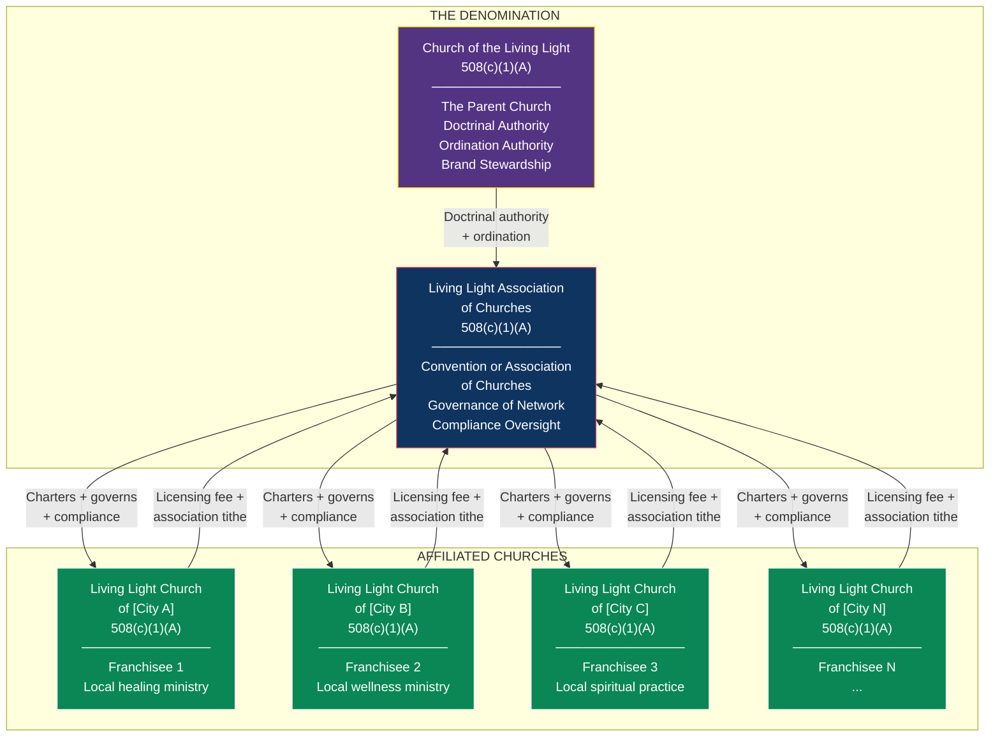
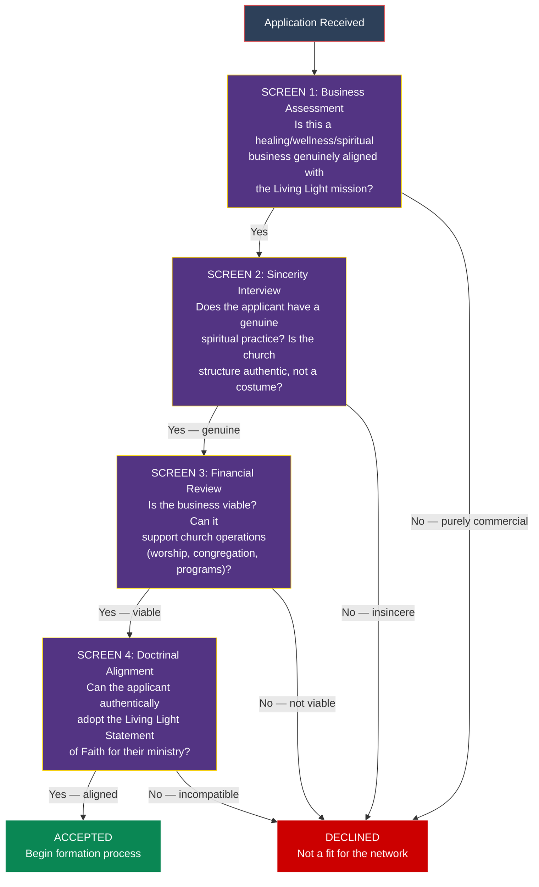
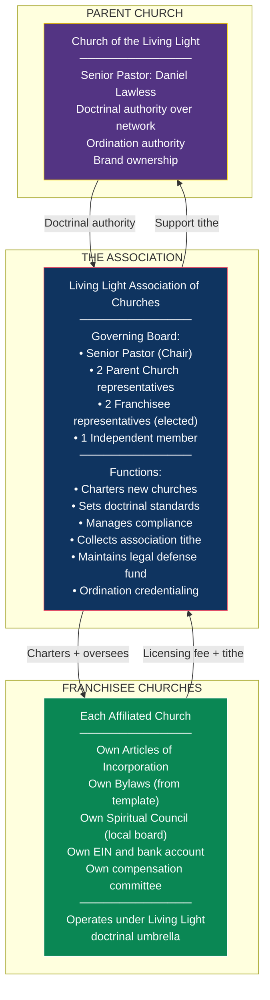
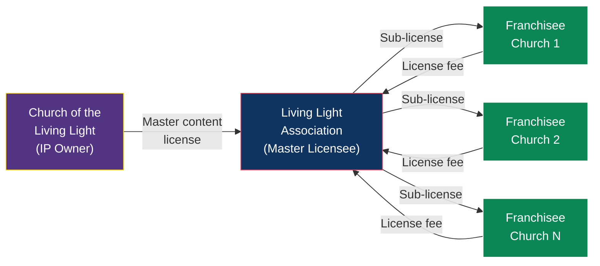
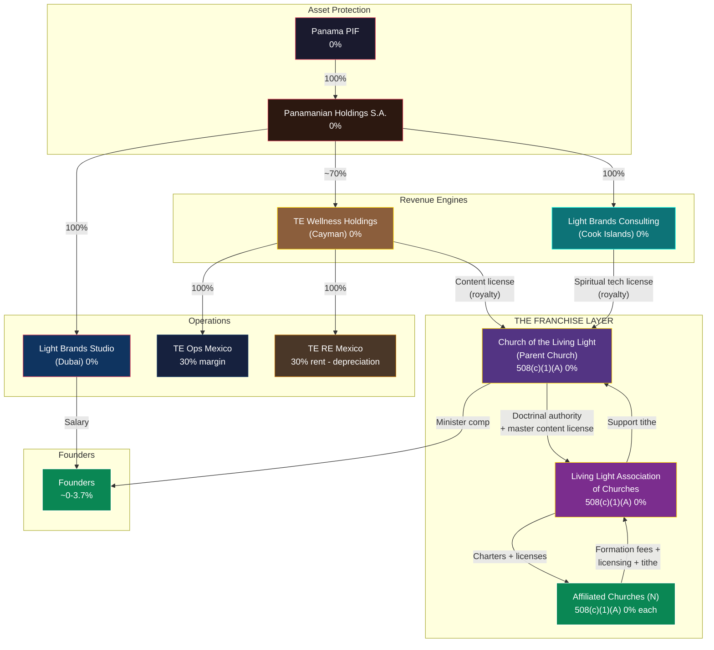

# 508(c)(1)(A) Franchise Framework: Decentralizing the Living Light

> **Status:** Strategic Framework — requires religious nonprofit counsel + franchise attorney review before implementation
> **Depends on:** [US_508C1A_RELIGIOUS_ORGANIZATION_STRATEGY.md](./US_508C1A_RELIGIOUS_ORGANIZATION_STRATEGY.md), [CHRIST_CONSCIOUSNESS_STRATEGY.md](./CHRIST_CONSCIOUSNESS_STRATEGY.md), [11-CHURCH-GOVERNANCE-STRUCTURE.md](../tax-structure/11-CHURCH-GOVERNANCE-STRUCTURE.md)
> **Last Updated:** February 2026

---

## 1. Executive Summary

### The Vision

The Church of the Living Light has built something rare: a genuine spiritual framework (Christ consciousness doctrine), a legally defensible 508(c)(1)(A) tax-exempt structure, and a complete operational playbook — 38+ formation documents covering articles of incorporation, bylaws, governance, compensation, licensing, ordination, membership, and compliance.

This knowledge took significant legal research, doctrinal development, and structural engineering to create. The framework proposes **decentralizing and distributing this model to anyone who wants to operate their healing, wellness, or spiritual business through a tax-exempt church structure** — without them needing to learn any of it from scratch.

### The Model in One Sentence

> **The Living Light becomes a denomination. Franchisees become affiliated churches. They pay a licensing fee. We set it up, manage the compliance, and transfer the knowledge. They receive the full tax-exempt benefit of the 508(c)(1)(A) structure for their business.**

### What Makes This Work

| Element | Detail |
|---|---|
| **Legal vehicle** | Convention or Association of Churches under IRC 508(c)(1)(A) — the same automatic exemption that covers individual churches also covers their associations |
| **What we sell** | Turnkey church formation + ongoing compliance management + doctrinal licensing + ordination credentialing |
| **What they get** | A fully operational 508(c)(1)(A) church with 0% federal income tax, no Form 990, Church Audit Procedures Act protection, minister housing allowance (IRC 107), and donor deductibility |
| **What we retain** | Doctrinal authority, brand standards, compliance oversight, and the licensing fee stream |
| **Revenue model** | One-time formation fee + annual licensing/compliance fee + percentage-based tithe on church revenue |

### The Bottom Line

```
FRANCHISEE'S CURRENT SITUATION          FRANCHISEE AFTER LIVING LIGHT SETUP
─────────────────────────────────       ─────────────────────────────────
Pays 21-37% tax on business income  →   0% federal income tax (exempt)
Files public tax returns             →   No Form 990 required
Subject to standard IRS audit        →   Church Audit Procedures Act protection
No housing allowance                 →   IRC 107 housing exclusion for ministers
No donor deductibility               →   Donors get full charitable deduction
Built everything from scratch        →   Turnkey: we build it, they use it
```

---

## 2. The Legal Architecture: Convention of Churches

### Why This Is Not a Traditional Franchise

A franchise (under the FTC Franchise Rule) typically involves three elements: (1) trademark licensing, (2) significant control over operations, and (3) a required fee exceeding $500. Religious organizations have important exemptions:

- **First Amendment protection** — Church governance is constitutionally protected from government regulation
- **FTC Franchise Rule exemption** — Religious organizations are generally exempt from franchise disclosure requirements
- **State franchise law exemptions** — Most states exempt religious organizations from franchise registration

However, the cleaner legal path is **not** to call this a franchise at all. Instead, the Living Light operates as a **denomination** that charters affiliated churches — a model with centuries of legal precedent.

### The Denomination Model



### IRC 508(c)(1)(A) Covers This

The statute explicitly exempts three categories:

1. **Churches** — the individual local church
2. **Integrated auxiliaries** of churches — entities controlled by and serving a church
3. **Conventions or associations of churches** — denominations, networks, and associations

The Living Light Association of Churches qualifies as a **convention or association of churches** — meaning it receives the same automatic tax exemption, no Form 1023 requirement, no Form 990 filing, and Church Audit Procedures Act protection.

### Legal Precedent: Existing Denominational Models

| Denomination | Structure | How It Works |
|---|---|---|
| **Hillsong Church** | Multi-site + church planting | Central church plants and governs satellite campuses worldwide. Each campus operates under the Hillsong brand, doctrine, and governance framework. |
| **Vineyard Churches** | Association of churches | ~1,500 churches globally. Each is independently incorporated but affiliated with Vineyard USA (the association). Doctrinal alignment required. Annual affiliation fees. |
| **Calvary Chapel** | Association of churches | ~1,800 churches worldwide. Each self-governing but affiliated. Shared doctrine (Calvary Chapel distinctives). Pastor credentialing through association. |
| **Association of Related Churches (ARC)** | Church planting network | Has launched 1,000+ churches. Provides launch coaching, financial support, and ongoing mentorship. Churches are independent but affiliated. |
| **International Church of the Foursquare Gospel** | Denomination | 90,000+ churches in 150+ countries. Centralized ordination, property ownership (some models), and doctrinal standards. |

Every one of these is a 508(c)(1)(A) organization. The model is well-established.

---

## 3. What the Franchisee Gets (The Complete Package)

### 3.1 Turnkey Church Formation

The Living Light handles all entity formation, including:

| Deliverable | Detail |
|---|---|
| **Articles of Incorporation** | Customized from A01 template, filed in optimal state for their situation |
| **Church Bylaws** | Adapted from A02 template with governance structure, pastoral protections, compensation committee |
| **Statement of Faith** | Licensed use of the Living Light Statement of Faith (A03) — adapted for their specific ministry focus while maintaining doctrinal core |
| **EIN Application** | Prepared and filed (A05 guidance applied) |
| **Organizational Meeting Minutes** | Template from A04, customized and executed |
| **Bank Account Setup** | Guidance and documentation (C04 applied) |

### 3.2 Governance Framework

| Deliverable | Detail |
|---|---|
| **Spiritual Council structure** | Board composition designed for their situation (family, independents, compensation committee) |
| **Compensation Committee Charter** | Adapted from B01 — independent members, comparable data process, IRC 4958 compliance |
| **Initial Compensation Resolutions** | From B02 — board-approved salary and housing allowance based on comparables |
| **Housing Allowance Designation** | From B03 — properly designated in advance for IRC 107 compliance |
| **Governance protections** | Adapted from B04-B09 — co-founder protections, governance pause, removal procedures |

### 3.3 Ordination and Credentialing

| Deliverable | Detail |
|---|---|
| **Ordination Program** | Franchisee pastor(s) complete the Living Light ordination curriculum (E01) |
| **Minister credentialing** | Ordination certificate issued by the Living Light, recognized denomination-wide |
| **IRC 107 qualification** | Ordained ministers qualify for housing allowance exclusion |
| **Form 4361 guidance** | SE tax opt-out filing support |

### 3.4 Operational Templates

| Deliverable | Detail |
|---|---|
| **Employment Agreement Template** | From C02 — for staff hires |
| **Audit Procedures** | From C01 — internal financial controls |
| **Retirement Plan Guidance** | From C03 — 403(b)(9), 457(b), 457(f) options |
| **Membership Covenant** | From E03 — formal membership process |
| **Board Meeting Minutes Template** | From E05 |
| **Committee Meeting Minutes Template** | From E06 |
| **Confidentiality Agreement** | From E04 — for council members |
| **Charitable Programs Documentation** | From E02 — community service framework |

### 3.5 IP and Content Licensing

| Deliverable | Detail |
|---|---|
| **Doctrinal content license** | Access to the Living Light's spiritual content library (teachings, curricula, meditation guides, ceremony frameworks) |
| **Brand license** | Right to operate under the "Living Light Church of [Location]" brand |
| **Spiritual technology license** | Proprietary healing methodologies, program structures, and ministry frameworks |
| **Ongoing content updates** | New materials as the parent church develops them |

### 3.6 Ongoing Compliance Management

| Deliverable | Detail |
|---|---|
| **Quarterly compliance check** | Governance, financial, and operational review |
| **Annual compensation review support** | Comparable data provision for IRC 4958 rebuttable presumption |
| **Housing allowance re-designation** | Annual board resolution preparation |
| **IRS correspondence support** | Guidance if the church receives IRS inquiries (Church Audit Procedures Act applies) |
| **State compliance management** | Annual filings, property tax exemptions, sales tax exemptions |
| **Transfer pricing support** | If the franchisee has intercompany arrangements |

---

## 4. What We Provide (Knowledge Transfer)

### The "We Assume All the Knowledge" Promise

```
WHAT THE FRANCHISEE DOES NOT NEED TO KNOW     WE HANDLE IT
─────────────────────────────────────────      ─────────────
How to structure a 508(c)(1)(A) church      →  Formation package
How to meet the IRS 14-point test           →  Governance design
How to set up IRC 4958 safe harbor          →  Comp committee setup
How to draft articles/bylaws                →  Legal templates
How to create a Statement of Faith          →  Doctrinal licensing
How to establish ordination programs        →  Ordination credentialing
How to designate housing allowances         →  Annual resolution prep
How to structure compensation               →  Comparable data + board process
How to handle IRS inquiries                 →  Compliance management
How to maintain church audit protections    →  Ongoing oversight
How to document religious purpose           →  Program documentation
How to separate church from commercial      →  Structural guidance
```

### The Knowledge Stack

Our expertise is organized into four layers:

**Layer 1: Legal Architecture**
- Entity formation (state selection, articles, bylaws)
- 508(c)(1)(A) compliance (14-point test, congregation requirements)
- IRC 4958 intermediate sanctions avoidance
- Church Audit Procedures Act navigation
- State tax exemption applications

**Layer 2: Doctrinal Foundation**
- Statement of Faith adaptation
- Sacred Laws framework application
- Healing ministry theological basis
- Ordination curriculum delivery
- Worship and congregation design

**Layer 3: Operational Excellence**
- Governance structures (board composition, committees)
- Compensation design (salary, housing, retirement)
- Financial controls and record-keeping
- Membership management
- Ministry programming

**Layer 4: Ongoing Compliance**
- Quarterly governance reviews
- Annual compensation benchmarking
- State filing management
- IRS correspondence handling
- Risk monitoring

---

## 5. Who This Is For: The Ideal Franchisee

### Profile

| Criterion | Description |
|---|---|
| **Business type** | Healing, wellness, spiritual practice, holistic health, transformational coaching, retreat center, meditation studio, breathwork practice, energy healing, plant medicine facilitation, yoga studio with spiritual component |
| **Revenue range** | $250K-$10M+ annual revenue |
| **Spiritual alignment** | Genuinely aligned with the Living Light's Christ consciousness framework (or willing to adopt a compatible spiritual framework within the Living Light doctrinal umbrella) |
| **Current structure** | Operating as sole proprietorship, LLC, or S-Corp — paying significant income tax on what is genuinely spiritual/healing work |
| **Commitment** | Willing to operate as a genuine church — regular worship services, congregation, ordained ministry, charitable programs |

### The Sincerity Requirement

This is the single most important qualifying criterion. The Living Light will **not** charter a church for someone who:

- Treats the spiritual framework as window dressing for tax avoidance
- Has no genuine spiritual practice or belief system
- Is unwilling to hold regular worship services and maintain a congregation
- Views the church structure purely as a commercial optimization

This is not a moral judgment. It is a **legal survival requirement.** A franchisee who operates a sham church puts the entire network at risk. One bad actor can trigger IRS scrutiny of the entire association.

### Screening Process



---

## 6. Revenue Model

### Fee Structure

| Fee | Amount | When | What It Covers |
|---|---|---|---|
| **Formation Fee** | $15,000-$35,000 | One-time, at onboarding | Complete entity formation, all legal templates customized, state filing, EIN, governance design, board setup, initial compensation resolution, bank account guidance |
| **Ordination Fee** | $3,000-$5,000 per minister | One-time, per person | Full ordination program (E01 curriculum), examination, credentialing, ordination ceremony |
| **Annual Licensing Fee** | $5,000-$15,000 | Annual | Brand license, doctrinal content license, spiritual technology license, ongoing content updates, network membership |
| **Compliance Management Fee** | $8,000-$20,000 | Annual | Quarterly compliance reviews, annual compensation benchmarking, housing allowance re-designation, state filing management, IRS correspondence support |
| **Association Tithe** | 3-5% of gross church revenue | Monthly/Quarterly | Denominational contribution — supports the parent church's mission, network development, shared resources, legal defense fund |

### Revenue Projections (Illustrative)

| Year | Affiliated Churches | Average Rev per Church | Formation Fees | Annual Licensing | Compliance Fees | Association Tithe (4%) | Total Network Revenue |
|---|---|---|---|---|---|---|---|
| **Year 1** | 5 | $500K | $125K | $50K | $70K | $100K | **$345K** |
| **Year 2** | 15 | $750K | $250K | $150K | $210K | $450K | **$1.06M** |
| **Year 3** | 35 | $1M | $500K | $350K | $490K | $1.4M | **$2.74M** |
| **Year 5** | 100 | $1.5M | $750K | $1M | $1.4M | $6M | **$9.15M** |

All revenue flowing to the Living Light Association is **tax-exempt** — it is a convention of churches under 508(c)(1)(A).

### Franchisee Economics (Example)

A wellness practitioner currently earning $500K/year as an LLC:

| | Current (LLC) | After Living Light Church |
|---|---|---|
| **Gross revenue** | $500,000 | $500,000 |
| **Federal income tax** | ~$150,000 (30% effective) | $0 (exempt) |
| **Self-employment tax** | ~$38,000 | $0 (minister SE opt-out via Form 4361) |
| **State income tax** | ~$25,000 (varies) | $0 (exempt in most states) |
| **Pastor salary** | N/A | $120,000 (taxable) |
| **Housing allowance** | N/A | $50,000 (excluded from income tax) |
| **Tax on salary** | N/A | ~$22,000 |
| **Living Light fees** | $0 | ~$43,000 (formation amortized + licensing + compliance + tithe) |
| **Net tax savings** | — | **~$148,000/year** |
| **ROI on Living Light fees** | — | **344%** |

---

## 7. The Formation Process (Franchisee Journey)

### Phase 1: Discovery and Screening (Weeks 1-3)

| Step | Detail |
|---|---|
| **Initial consultation** | Free 60-minute call. Assess business type, spiritual alignment, revenue, goals. |
| **Application submission** | Formal application with business financials, personal spiritual history, ministry vision. |
| **Sincerity interview** | In-depth conversation with Living Light senior pastor or designee. Not a test — a discernment. |
| **Acceptance decision** | Living Light accepts or declines. No appeals. Integrity of the network is paramount. |

### Phase 2: Doctrinal Foundation (Weeks 4-8)

| Step | Detail |
|---|---|
| **Statement of Faith orientation** | Franchisee studies the Living Light Statement of Faith. Discussion sessions with Living Light ministers. |
| **Ministry vision development** | Collaborative work to define how the franchisee's healing/wellness practice maps to the Living Light doctrinal framework. |
| **Worship design** | Design weekly worship services, monthly gatherings, and program-integrated spiritual activities for the franchisee's specific ministry. |
| **Ordination enrollment** | Franchisee pastor(s) enroll in the Living Light Ordination Program (E01). |

### Phase 3: Entity Formation (Weeks 6-12)

| Step | Detail |
|---|---|
| **State selection** | Living Light counsel advises on optimal state of incorporation. |
| **Articles of Incorporation** | Customized from A01 template. Filed with state. |
| **Bylaws adoption** | Adapted from A02 template. Governance structure tailored to franchisee's board composition. |
| **EIN application** | Filed with IRS. |
| **Spiritual Council appointed** | Board members identified and seated. At least 1 independent member. |
| **Compensation Committee formed** | Independent members selected. Comparable data provided. Initial compensation resolutions adopted. |
| **Bank account opened** | Separate church account established. |
| **Housing allowance designated** | Board resolution designating minister housing allowance (IRC 107). |

### Phase 4: Ordination and Credentialing (Weeks 8-24)

| Step | Detail |
|---|---|
| **Ordination curriculum** | Seven modules completed (Sacred Laws, Divine Values, Healing Ministry, Worship Leadership, Governance/Stewardship, Pastoral Care, Supervised Ministry). |
| **Examination** | Written and oral examination on doctrine and ministry. |
| **Ordination ceremony** | Formal ordination by the Living Light senior pastor (or designee). Certificate issued. |
| **IRS documentation** | Ordination records maintained for IRC 107 housing allowance qualification. |

### Phase 5: Operational Launch (Weeks 12-16)

| Step | Detail |
|---|---|
| **Membership program launched** | E03 Membership Covenant adapted and deployed. First members enrolled. |
| **Worship services begin** | Weekly services (online, in-person, or hybrid) launched. Regular congregation established. |
| **Programs transitioned** | Existing healing/wellness programs reframed within the church's doctrinal context. |
| **Revenue routing configured** | Client payments now flow to the church. Payment processing updated. |
| **Intercompany agreements** | If needed — technology licenses, service agreements, etc. |
| **State exemptions applied for** | Property tax, sales tax, and other state-level exemptions. |

### Phase 6: Ongoing Operations

| Activity | Frequency | Managed by |
|---|---|---|
| Worship services | Weekly | Franchisee |
| Quarterly compliance review | Quarterly | Living Light |
| Board meetings (documented) | Quarterly minimum | Franchisee (template from Living Light) |
| Compensation review | Annual | Living Light provides comparables; franchisee board decides |
| Housing allowance re-designation | Annual (before tax year) | Living Light prepares; franchisee board adopts |
| State filings | Annual | Living Light manages |
| Association tithe | Monthly/Quarterly | Franchisee pays |
| Network gathering | Annual | Living Light hosts |

---

## 8. Governance Framework for the Network

### The Association Structure



### Franchisee Autonomy vs. Network Control

| Domain | Franchisee Controls | Association Controls |
|---|---|---|
| **Daily operations** | Full autonomy | — |
| **Local staffing** | Hires and manages own staff | — |
| **Program pricing** | Sets own prices | — |
| **Local marketing** | Manages own marketing within brand guidelines | Brand standards |
| **Worship format** | Adapts worship to local community | Must meet minimum worship frequency |
| **Local board composition** | Selects board members | Must follow governance template |
| **Compensation levels** | Board sets based on local market | Must follow IRC 4958 process (comparables provided) |
| **Doctrine** | Teaches within Living Light framework | Cannot deviate from core Statement of Faith |
| **Ordination** | Recommends candidates | Association approves and credentials |
| **Brand usage** | Uses "Living Light Church of [Location]" | Brand guidelines enforced |
| **Financial reporting** | Maintains own books | Quarterly reports to Association |

### Charter Agreement (Key Terms)

The **Charter Agreement** is the binding document between the Association and each affiliated church. Key provisions:

| Provision | Detail |
|---|---|
| **Grant of charter** | Association charters the church as an affiliated member of the Living Light denomination |
| **Doctrinal alignment** | Church affirms and teaches the Living Light Statement of Faith |
| **Brand license** | Right to use "Living Light" name and marks, subject to guidelines |
| **Ordination recognition** | Association ordains ministers; franchisee church recognizes and deploys them |
| **Financial obligations** | Formation fee, licensing fee, compliance fee, association tithe |
| **Governance standards** | Must maintain independent Spiritual Council, compensation committee, documented meetings |
| **Worship requirements** | Minimum weekly worship service, regular congregation, charitable programs |
| **Compliance cooperation** | Quarterly reports, annual review, access to records for compliance audit |
| **Revocation** | Association may revoke charter for: doctrinal deviation, financial misconduct, failure to maintain church operations, conduct harmful to the network, non-payment of fees for 6+ months |
| **Term** | 10 years, auto-renewing for 5-year periods |
| **Termination by franchisee** | 12 months' written notice; must cease use of Living Light name and marks; retains own entity (but loses denominational affiliation and brand) |

### Revocation Process

If a franchisee church fails to meet standards:

```
WARNING (written) → 90-DAY CURE PERIOD → REVIEW BY ASSOCIATION BOARD → REVOCATION VOTE (2/3) → CHARTER REVOKED
```

Upon revocation:
- Church loses right to use "Living Light" name and marks
- Ordination credentials of ministers are suspended (not revoked — they can seek reaffiliation)
- Church retains its own corporate entity and EIN (it just loses denominational affiliation)
- Outstanding fees become immediately due
- Content and spiritual technology licenses terminate

---

## 9. Doctrinal Licensing Framework

### The Core Doctrine (Non-Negotiable)

Every affiliated church must affirm and teach:

| Doctrinal Element | Source |
|---|---|
| The Living Light (infinite conscious creative intelligence) | Statement of Faith, Section I |
| The 9 Foundational Sacred Laws | Statement of Faith, Section II |
| The 7 Divine Values | Statement of Faith, Section III |
| The 7 Divine Ethics | Statement of Faith, Section IV |
| The 7 Divine Morals (the NEVERs) | Statement of Faith, Section V |
| The Body as Temple (physical healing as spiritual practice) | Christ Consciousness Strategy, Core Belief 2 |
| Shadow precedes Light (integration work) | Christ Consciousness Strategy, Core Belief 3 |
| The Three Phases of Awakening | Christ Consciousness Strategy, Part II |

### The Flexible Layer (Customizable)

Franchisees may customize:

| Element | Flexibility |
|---|---|
| **Ministry focus** | Breathwork, yoga, meditation, plant medicine, energy healing, sound healing, nutrition, biooptimization — any healing modality that fits within "body as temple" doctrine |
| **Worship style** | Contemplative, ecstatic, meditative, musical, silent — adapted to community |
| **Cultural expression** | Language, music, art, ceremony style — localized to their community |
| **Program design** | Specific program structure, pricing, scheduling — operational autonomy |
| **Community engagement** | Local charitable focus, outreach programs — adapted to local needs |

### Content License Structure



The parent church owns all IP. The Association holds a master license. Franchisee churches receive sub-licenses through the Charter Agreement. The license covers:

1. **Statement of Faith** — right to adopt, teach, and distribute
2. **Sacred Laws content** — teaching materials, study guides, meditation scripts
3. **Ordination curriculum** — the seven-module program
4. **Healing frameworks** — proprietary methodologies for spiritual healing
5. **Worship resources** — liturgy templates, ceremony guides, music
6. **Operational templates** — all 38+ formation documents adapted for their use

---

## 10. Compliance Management System

### The Compliance Stack

The Living Light manages compliance across four dimensions for every affiliated church:

**Dimension 1: IRS Church Status Compliance**

| Requirement | How We Ensure It |
|---|---|
| 14-Point Test satisfaction | Annual checklist review — confirm 11+ points maintained |
| Regular congregation | Worship attendance records reviewed quarterly |
| Ordained ministers | Ordination records current; continuing education tracked |
| Literature of its own | Content library maintained and distributed |
| Regular religious services | Service schedule and records reviewed |

**Dimension 2: IRC 4958 Compliance (Private Inurement)**

| Requirement | How We Ensure It |
|---|---|
| Independent compensation committee | Committee composition verified annually |
| Comparable data used | Living Light provides compensation benchmarking data for each market |
| Documented decision | Board minutes template ensures proper documentation |
| Rebuttable presumption established | Checklist completed for each compensation decision |

**Dimension 3: IRC 107 Housing Allowance Compliance**

| Requirement | How We Ensure It |
|---|---|
| Advance designation | Living Light prepares resolution; board adopts before tax year |
| Amount within limits | Reviewed against actual costs, designated amount, and fair rental value |
| Minister qualification | Ordination records confirm qualification |
| Proper documentation | Annual housing allowance file maintained |

**Dimension 4: State Compliance**

| Requirement | How We Ensure It |
|---|---|
| Annual state filings | Living Light tracks deadlines and prepares filings |
| Property tax exemption | Application filed and maintained |
| Sales tax exemption | Certificates obtained and renewed |
| Charitable solicitation registration | Filed where required |

### The Quarterly Review

Every affiliated church undergoes a structured quarterly review:

```
QUARTERLY COMPLIANCE REVIEW CHECKLIST
──────────────────────────────────────
□ Worship services held regularly (attendance records)
□ Board meeting held and minutes documented
□ Compensation committee met if comp decisions made
□ Housing allowance properly designated (if applicable)
□ Financial records current and organized
□ Membership records maintained
□ Charitable programs active
□ State filings current
□ No IRS correspondence received (or handled if received)
□ Association tithe current
□ Brand guidelines followed
□ No doctrinal deviations reported
```

---

## 11. Legal Defense Fund

### Why This Matters

If the IRS challenges one affiliated church, it could trigger scrutiny of the entire network. A shared legal defense fund protects everyone.

### Structure

| Element | Detail |
|---|---|
| **Funding** | 0.5% of each affiliated church's gross revenue (included in the association tithe) |
| **Managed by** | Association Board |
| **Use** | Defense of any affiliated church facing IRS audit or challenge; proactive legal opinions; network-wide compliance improvements |
| **Minimum reserve** | $250K (built over first 2 years) |
| **Access** | Any affiliated church in good standing may request defense fund assistance |

### Proactive Legal Protection

The fund also pays for:

- Annual legal review of network compliance by qualified religious nonprofit counsel
- Transfer pricing studies and benchmarking updates
- IRS precedent monitoring (new rulings, court decisions affecting churches)
- Preemptive legal opinions on evolving regulatory issues

---

## 12. Risk Assessment

### Network-Level Risks

| Risk | Probability | Impact | Mitigation |
|---|---|---|---|
| **Bad actor franchisee** (sham church) | Medium | High — IRS scrutiny of entire network | Rigorous screening, quarterly compliance reviews, charter revocation for non-compliance |
| **IRS challenges association status** | Low | High — all affiliates affected | Meet all association-of-churches criteria, legal defense fund, proactive counsel |
| **Franchisee disputes fees** | Medium | Low-Medium | Clear Charter Agreement, tithe obligation contractual, revocation for non-payment |
| **Doctrinal deviation** | Low-Medium | Medium — brand risk | Annual doctrinal review, Charter Agreement allows revocation |
| **Negative publicity** ("church franchise" narrative) | Medium | Medium — reputational | Frame as denomination/church planting (accurate). Emphasize genuine spiritual mission. |
| **State regulatory challenge** | Low | Low-Medium — state-specific | Proactive state exemption applications, legal defense fund |
| **FTC franchise rule challenge** | Low | Medium | Structure as denomination, not franchise. Religious exemptions. First Amendment. |

### The Single Biggest Risk: Sincerity

Everything in this framework depends on **every affiliated church being genuine.** One church that is clearly a commercial operation in church clothing can:

1. Trigger IRS examination of the entire association
2. Create media stories about "tax-avoidance church franchise"
3. Result in legal precedent harmful to all 508(c)(1)(A) churches

**Mitigation:** The screening process (Section 5) is the first line of defense. Quarterly compliance reviews are the ongoing defense. Charter revocation is the nuclear option. The association must be willing to revoke charters — the integrity of the network is more important than any single member's fees.

---

## 13. Competitive Landscape

### Who Else Does This?

| Competitor | Model | Weakness |
|---|---|---|
| **Online ordination mills** (Universal Life Church, etc.) | Mass ordination, no governance support | No church formation, no compliance, IRS challenges ordination legitimacy |
| **Church formation attorneys** | One-time legal formation | No ongoing compliance, no denomination, no content, no brand |
| **Nonprofit consultants** | 501(c)(3) formation | Not church-specific, no 508(c)(1)(A) expertise, no doctrinal framework |
| **Multi-level ministry models** | Affiliate-style church planting | Often lack genuine spiritual substance, high IRS risk |

### The Living Light Advantage

None of the above provides **all of the following** in one package:

1. A genuine, developed doctrinal framework (Statement of Faith, 50 Sacred Laws, 7 Divine Values)
2. A legally defensible 508(c)(1)(A) structure with 38+ operational documents
3. An ordination program that satisfies IRS criteria
4. Ongoing compliance management
5. A denominational brand and community
6. Content and spiritual technology licensing
7. Legal defense fund protection

---

## 14. Implementation Roadmap

### Phase 1: Foundation (Months 1-3)

| Step | Detail |
|---|---|
| **Form the Association** | Incorporate Living Light Association of Churches as a 508(c)(1)(A) convention of churches |
| **Draft Charter Agreement** | Master template for franchisee affiliation |
| **Build compliance system** | Quarterly review process, checklists, reporting templates |
| **Create onboarding program** | Formation workflow, ordination program adaptation, launch playbook |
| **Engage franchise/religious nonprofit counsel** | Legal review of all documents and the model |

### Phase 2: Pilot (Months 3-9)

| Step | Detail |
|---|---|
| **Charter 3-5 pilot churches** | Hand-picked, high-alignment candidates |
| **Full formation process** | Test the entire onboarding workflow |
| **Refine based on feedback** | Identify gaps, improve templates, streamline process |
| **Document case studies** | Tax savings, operational improvements, spiritual impact |

### Phase 3: Scale (Months 9-18)

| Step | Detail |
|---|---|
| **Launch marketing** | Website, content marketing, referral program, conference presence |
| **Build sales team** | Consultants who can screen and onboard franchisees |
| **Scale compliance team** | Hire compliance specialists for quarterly reviews |
| **Develop technology platform** | Portal for franchisees (document management, compliance tracking, communication) |
| **Target: 15-25 churches** | Year 1 goal |

### Phase 4: Network Effects (Months 18+)

| Step | Detail |
|---|---|
| **Annual network conference** | Bring all affiliated pastors together |
| **Shared purchasing** | Group insurance, technology, legal services |
| **Cross-referral network** | Churches refer clients/members to each other |
| **Franchisee-led growth** | Existing franchisees refer new candidates |
| **International expansion** | Adapt model for non-US jurisdictions |

---

## 15. Integrated Structure: How the Franchise Fits into the Master Architecture



### Revenue Flow Integration

The franchise layer creates a **new tax-free revenue stream** for the Living Light:

1. **Formation fees** → Association (0% tax)
2. **Licensing fees** → Association (0% tax)
3. **Compliance fees** → Association (0% tax)
4. **Association tithe** → Association → Parent Church (0% tax both levels)
5. **Content royalties** from each franchisee → flow through the association structure

This revenue is **entirely separate** from the TE Holdings revenue (healing center guests) and the Light Brands revenue (consulting/SaaS). It is a third revenue engine — all within the tax-exempt ecosystem.

---

## 16. Document Deliverables Per Franchisee

Every franchisee receives customized versions of these documents:

### A-Series (Formation)
- [ ] A01 — Articles of Incorporation (customized for state + franchisee)
- [ ] A02 — Church Bylaws (adapted governance structure)
- [ ] A03 — Statement of Faith (core maintained, ministry focus adapted)
- [ ] A04 — Organizational Meeting Minutes (customized)
- [ ] A05 — EIN Application Guidance (specific to franchisee)

### B-Series (Governance & Compensation)
- [ ] B01 — Compensation Committee Charter
- [ ] B02 — Initial Compensation Resolutions (with local comparables)
- [ ] B03 — Housing Allowance Designation
- [ ] B04 — Co-Founder Protections Acknowledgment (adapted for franchisee's founders)
- [ ] B05 — Governance Pause Procedures (if applicable)
- [ ] B06 — For-Cause Removal Procedures

### C-Series (Compliance & Operations)
- [ ] C01 — Church Audit Procedures
- [ ] C02 — Employment Agreement Template
- [ ] C03 — Retirement Plan Guidance
- [ ] C04 — Bank Account Setup Guidance

### D-Series (IP & Agreements)
- [ ] D-NEW — Charter Agreement (Association ↔ Affiliated Church)
- [ ] D-NEW — Content Sub-License Agreement
- [ ] D-NEW — Brand License Agreement

### E-Series (Ministry & Membership)
- [ ] E01 — Ordination Program Enrollment (for franchisee ministers)
- [ ] E02 — Charitable Programs Documentation (adapted for local ministry)
- [ ] E03 — Church Membership Covenant (adapted)
- [ ] E04 — Confidentiality Agreement
- [ ] E05 — Board Meeting Minutes Template
- [ ] E06 — Committee Meeting Minutes Template

**Total: 20+ customized documents per franchisee.**

---

## 17. Open Questions for Counsel

### Religious Nonprofit Attorney

1. Is a "convention or association of churches" the correct vehicle, or should the parent church directly charter integrated auxiliaries?
2. What is the optimal state for incorporating the Association?
3. Can the Association charge both a licensing fee and an association tithe, or does the tithe need to be voluntary for 508(c)(1)(A) purposes?
4. How should the Charter Agreement be structured to maintain denominational control without creating an employer-employee or franchisor-franchisee relationship?
5. What protections should the Association have against a franchisee that goes rogue and damages the brand?

### Franchise Attorney

6. Does this model trigger FTC Franchise Rule disclosure requirements, even with religious organization exemptions?
7. Which states have franchise registration requirements that may apply despite religious exemptions?
8. Should we structure this purely as a denominational affiliation (no franchise language) to avoid franchise regulation entirely?

### Tax Attorney

9. Is the association tithe treated as a religious contribution (not UBIT) when it flows from one 508(c)(1)(A) church to the association?
10. Can the Association reinvest tithe revenue into network development, technology, and marketing without UBIT exposure?
11. Does the formation fee constitute UBIT (service income) or is it exempt as an activity substantially related to the religious mission?
12. How should the Association's financial relationship with the parent church be documented?

### IP Attorney

13. How should the Statement of Faith copyright be registered and protected?
14. Should the "Living Light" brand be trademarked, and how does this interact with religious use?
15. What is the optimal structure for the content sub-license from Association to affiliated churches?

---

## 18. Summary: The Value Proposition

### For the Franchisee

```
WHAT YOU GET                          WHAT YOU PAY
───────────────                       ────────────
0% federal income tax on church rev → One-time formation fee ($15-35K)
No Form 990 public disclosure      → Annual licensing ($5-15K)
Church Audit Procedures Act         → Annual compliance ($8-20K)
IRC 107 housing allowance           → Association tithe (3-5%)
Minister ordination + credentials   → Ordination fee ($3-5K)
20+ customized legal documents      →
Ongoing compliance management       →
Quarterly reviews                   →
Annual compensation benchmarking    →
Legal defense fund protection       →
Denominational brand + community    →
Content + spiritual tech library    →
```

### For the Living Light

```
WHAT WE GIVE                         WHAT WE RECEIVE
────────────                         ────────────────
Complete knowledge transfer        → Formation fees (tax-exempt)
Ongoing compliance management      → Licensing fees (tax-exempt)
Doctrinal content + IP             → Compliance fees (tax-exempt)
Ordination credentialing           → Association tithe (tax-exempt)
Brand stewardship                  → Growing denomination
Legal defense coordination         → Network effects
Quarterly reviews                  → Spiritual mission expansion
```

### For the World

Every person who has been doing genuine healing, wellness, and spiritual work — and paying 30-40% in taxes on income that is fundamentally *ministry* — can now operate within a structure that recognizes what they've always known: **this work is sacred, and it should be treated as such.**

The Living Light doesn't just save taxes. It creates a denomination. It builds a community. It recognizes that the wellness revolution is, at its core, a spiritual awakening — and it gives that awakening the legal, financial, and organizational structure it deserves.

---

*This document proposes a legal framework for expanding the Church of the Living Light into a denomination that charters affiliated churches. It is not legal advice. The model requires validation by qualified religious nonprofit counsel, franchise counsel, and tax counsel before any implementation steps are taken. The sincerity of the religious mission is the foundation upon which everything else rests — without it, nothing here works.*
