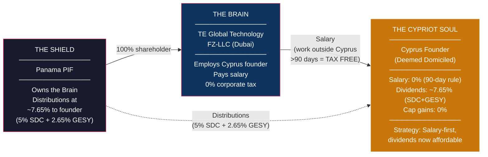
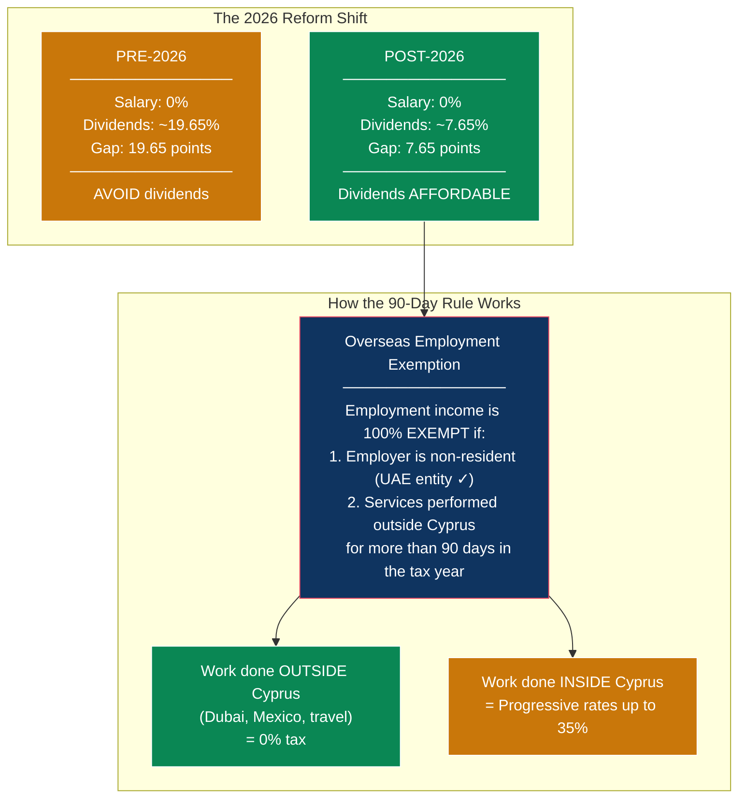
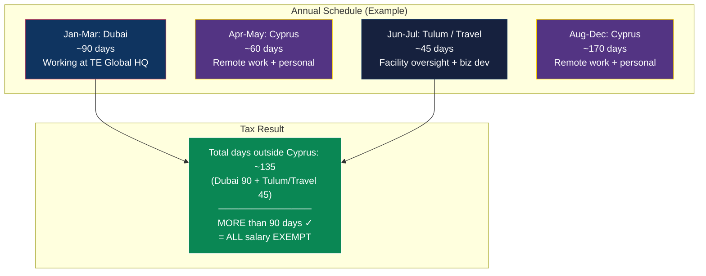
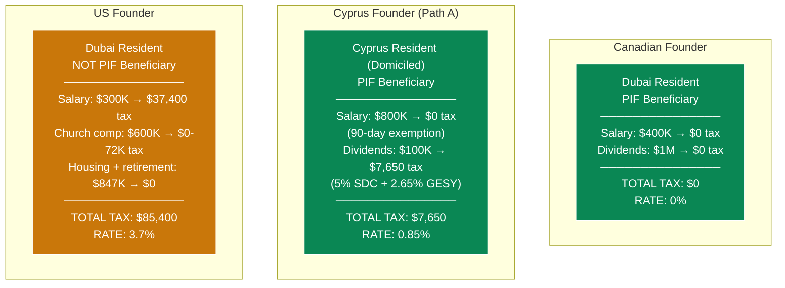
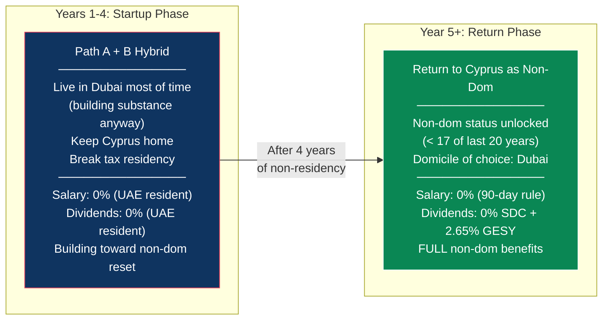

# Cyprus Founder Integration: The Domiciled Resident Strategy

> **Document Status:** Strategy document — requires Cyprus tax counsel validation
> **Applies to:** Lifelong Cyprus resident (25+ years) — deemed domiciled, non-dom regime does NOT apply
> **Non-dom reference:** For founders who are NOT lifelong residents, see [CYPRUS_NONDOM_REFERENCE.md](./CYPRUS_NONDOM_REFERENCE.md)
> **Related:** [Master Plan: The Complete TE Global Structure](./US_508C1A_REVISED_DONATION_MODEL.md), [UAE Implementation Blueprint](./UAE_IMPLEMENTATION_BLUEPRINT.md)
> **Last Updated:** February 2026
> **Tax Reform Status:** Cyprus 2026 tax reform passed 22 December 2025, effective 1 January 2026. All figures reflect enacted law.

---

## 1. TL;DR — The Problem and the Solution

A Cyprus founder who has lived in Cyprus their entire life (25+ years) is **deemed domiciled**. This means the favorable non-dom regime (0% SDC on dividends) does **not** apply.

**However — the 2026 tax reform dramatically improved the picture.** SDC on dividends dropped from 17% to **5%**. The old ~20% penalty on dividends is now ~8%.

**The strategy: salary remains the cheapest channel (0%), but dividends are no longer punitive.** The founder has real flexibility.

The **overseas employment exemption** — salary from a non-resident employer for work done outside Cyprus for more than 90 days — is **fully exempt from Cyprus income tax** regardless of domicile status. This is the lifelong resident's primary tool.

| Income Type | Tax for Lifelong Resident (2026) | Strategy |
|---|---|---|
| Salary (work outside Cyprus >90 days) | **0% — fully exempt** | **Primary channel** |
| Salary (work inside Cyprus) | Progressive rates up to 35% | Minimize this |
| Dividends / PIF distributions (post-2026 profits) | **5% SDC + 2.65% GESY = ~7.65%** | **Affordable secondary channel** |
| Capital gains on securities | **0%** | Take freely |
| Crypto asset gains (Article 20E) | **8% flat** | Not a tax optimization tool |

---

## 2. Why Lifelong Residency Changes Everything

### The Non-Dom Regime Does NOT Apply

| Requirement | Status for 25+ Year Resident |
|---|---|
| Not resident for 17 of last 20 years? | **FAILS** — resident for 20+ of last 20 years |
| Domicile of origin not Cyprus? | **FAILS** — born and raised in Cyprus |
| Acquired domicile of choice elsewhere? | **FAILS** — never permanently relocated |
| **Non-dom eligible?** | **NO** |

**Consequence:** SDC applies — **5% on dividends** (reduced from 17% under the 2026 reform)

### The 50% Employment Exemption Does NOT Apply

| Requirement | Status |
|---|---|
| Not a Cyprus tax resident for 15 consecutive years before employment? | **FAILS** — has been resident continuously |
| **Article 8(23A) eligible?** | **NO** |

### What STILL Works

| Tool | Status | Why |
|---|---|---|
| **Overseas employment exemption (90-day rule)** | **AVAILABLE** | Based on where work is performed, not domicile status |
| **Capital gains exemption on securities** | **AVAILABLE** | Applies to all residents regardless of domicile |
| **Cyprus-UAE treaty (0% WHT)** | **AVAILABLE** | Treaty applies regardless of domicile |
| **No CFC rules for individuals** | **AVAILABLE** | Cyprus CFC only applies to companies |
| **No exit tax** | **AVAILABLE** | Cyprus has no departure tax |
| **Reduced 5% SDC on dividends** | **NEW (2026)** | Dramatically lowers the cost of dividend income |

---

## 3. The Core Strategy: Salary-First, Dividends Now Affordable

For a domiciled Cyprus resident, the optimal structure remains: **take as much as possible as salary for work done outside Cyprus (0%), and use dividends as a flexible secondary channel (~7.65%).**

The 2026 reform changed the tone from "avoid dividends at all costs" to "salary is cheapest, but dividends are fine."

### The 90-Day Exemption — The Key Tool

This exemption is the single most important provision for the domiciled Cyprus founder:

| Criterion | Requirement | How to Meet It |
|---|---|---|
| Employer | Must be a **non-resident employer** (or a foreign PE of a Cyprus employer) | TE Global Technology FZ-LLC (Dubai) = non-resident employer ✓ |
| Days outside Cyprus | Must perform services **outside Cyprus for more than 90 days** in the calendar year | Work from Dubai office, attend Tulum facility, travel for business |
| Type of income | **Employment income** (salary, bonus, benefits) | Formal employment contract with the UAE entity |

**What counts as a "day outside Cyprus":**
- Day of departure = day outside Cyprus
- Day of arrival = day in Cyprus
- If in Dubai Mon-Fri = 4 days outside (depart Mon, arrive Fri)

**90 days = roughly 3 months.** A founder who spends January-March in Dubai (or split across Dubai + Mexico + business travel throughout the year) meets this threshold while still living in Cyprus ~9 months of the year.

---

## 4. Four Paths for the Domiciled Cyprus Founder

### Path A: Salary-First with Overseas Work (Recommended)

**Stay in Cyprus. Work from Dubai/Mexico/abroad for 90+ days. Take a large salary. Use dividends as needed.**

**Tax Math — Salary-Heavy Split (Year 5):**

| Income | Amount | Tax Treatment | Tax |
|---|---|---|---|
| UAE salary (work outside Cyprus >90 days) | **$800,000** | 100% exempt — overseas employment exemption | **$0** |
| PIF distributions (dividends) — kept modest | $100,000 | 5% SDC ($5,000) + 2.65% GESY ($2,650) | **~$7,650** |
| Capital gains | Variable | 0% on securities | **$0** |
| **Total on $900,000** | | | **~$7,650** |
| **Effective rate** | | | **~0.85%** |

**Tax Math — Balanced Split (Year 5):**

With the 2026 reform, a more balanced split is now reasonable:

| Income | Amount | Tax Treatment | Tax |
|---|---|---|---|
| UAE salary (work outside Cyprus >90 days) | **$500,000** | 100% exempt — overseas employment exemption | **$0** |
| PIF distributions (dividends) | $400,000 | 5% SDC ($20,000) + 2.65% GESY ($2,650 — capped) | **~$22,650** |
| **Total on $900,000** | | | **~$22,650** |
| **Effective rate** | | | **~2.5%** |

**Either split produces an excellent result.** The salary-heavy split saves ~$15K/year but requires maximizing the salary channel. The balanced split gives more flexibility with only a modest cost increase.

**Why this works:**
- The UAE entity is genuinely non-resident (Dubai-based, Dubai-licensed)
- The founder genuinely works from Dubai 90+ days per year (office in DIC, team is there)
- Employment contract is with the UAE entity, not a Cyprus company
- Salary is not artificially inflated — it's reasonable compensation for an executive/co-founder
- Cyprus home and lifestyle are fully maintained the other ~230 days

**The key insight: there is no limit on the salary amount.** Unlike the US FEIE ($130K cap), the Cyprus overseas employment exemption exempts 100% of employment income regardless of amount. A $800K salary from the UAE entity is just as exempt as a $100K salary, as long as the >90 day threshold is met.

### Path B: Move to Dubai, Reset the Clock, Return as Non-Dom

**Leave Cyprus for 4 years. Return as non-dom with 0% SDC on dividends.**

Cyprus has **no exit tax**. The founder can leave, establish UAE residency, and return later with a clean slate.

**The math:**
- 25 years resident = 20 of last 20 years ✗ (deemed domiciled)
- After 1 year away: 19 of 20 ✗
- After 2 years: 18 of 20 ✗
- After 3 years: 17 of 20 ✗ (still deemed domiciled — need <17)
- **After 4 years: 16 of 20 ✓** — eligible for non-dom status

**But** the founder also has a Cyprus **domicile of origin** (born there). To qualify as non-dom, they must acquire a **domicile of choice** in another country — meaning they must genuinely establish a new permanent home (e.g., in Dubai) and demonstrate intention to remain there indefinitely. Simply being away for 4 years and then returning may not be sufficient.

| Year | Where | Tax | Income Strategy |
|---|---|---|---|
| Years 1-4 (Dubai) | UAE resident | **0% on everything** | Take salary + full PIF distributions — all at 0% |
| Year 5+ (Return to Cyprus) | Cyprus non-dom | **0% SDC on dividends** + salary exemption | Salary + dividends both near-zero |

**Post-2026 Reform Impact on Path B:**

The benefit of the Dubai reset is now smaller. The SDC savings from non-dom status:

| Dividend Amount | SDC as Domiciled (5%) | SDC as Non-Dom (0%) | Annual Savings |
|---|---|---|---|
| $100,000 | $5,000 | $0 | **$5,000** |
| $500,000 | $25,000 | $0 | **$25,000** |
| $1,000,000 | $50,000 | $0 | **$50,000** |

**Trade-offs:**
- Must genuinely relocate to Dubai for ~4 years
- Must establish a domicile of choice (buy/rent home in Dubai, sever some Cyprus ties)
- Risk that Cyprus tax authorities challenge the domicile of choice claim upon return
- During the 4 Dubai years: 0% on everything (the golden period)
- On return: non-dom regime unlocked for up to 17 years
- The savings are meaningful only if taking large dividends ($500K+/year)

**Recommendation:** Pre-2026, this was "the strongest long-term play." Post-2026, it's still valuable for founders taking large dividends, but the 5% SDC rate means Path A alone is already excellent. Only pursue Path B if the founder genuinely wants to spend the startup years in Dubai (which may make operational sense anyway).

### Path C: Full Dubai Move (Permanent)

**Like the Canadian founder — move to Dubai permanently.**

| Income | Tax |
|---|---|
| UAE salary | **$0** |
| PIF distributions | **$0** |
| Capital gains | **$0** |
| **Everything** | **$0** |

**Trade-offs:**
- Must genuinely relocate
- Lose daily Cyprus lifestyle (can still visit freely)
- Golden Visa required (~$2,000-5,000)
- 0% vs 0.85% (Path A salary-heavy) — marginal benefit

### Path D: Stay in Cyprus Full-Time (No Travel Optimization)

**If the founder does not want to travel 90+ days per year.**

Without the overseas employment exemption, all salary for work done in Cyprus is taxed at progressive rates:

**2026 Cyprus Income Tax Rates:**

| Bracket | Rate |
|---|---|
| EUR 0 - 22,000 | 0% |
| EUR 22,001 - 32,000 | 20% |
| EUR 32,001 - 42,000 | 25% |
| EUR 42,001 - 72,000 | 30% |
| EUR 72,001+ | 35% |

**Tax Math (Year 5, Path D):**

| Income | Amount | Tax |
|---|---|---|
| UAE salary (work in Cyprus, no exemption) | EUR 300,000 (~$330K) | ~EUR 89,350 (~$98K) at blended ~29.8% |
| PIF distributions (dividends) | EUR 300,000 (~$330K) | 5% SDC (EUR 15,000) + GESY (capped EUR 4,770) = ~$21,750 |
| Capital gains | Variable | $0 |
| **Total on ~$660K** | | **~$120,000** |
| **Effective rate** | | **~18.1%** |

**The 2026 reform helped Path D too** — the old calculation was ~$168K / 25.5%. But Path D is still dramatically worse than Paths A or B.

---

## 5. Path Comparison at a Glance

| | Path A: Salary-First | Path B: Dubai Reset | Path C: Full Dubai | Path D: Stay Put |
|---|---|---|---|---|
| **Where they live** | Cyprus (~230 days) + Dubai (~90 days) + travel | Dubai (4 yrs) → Cyprus | Dubai (permanent) | Cyprus (full-time) |
| **Travel required** | 90+ days outside Cyprus/yr | 4 years abroad then return | Permanent relocation | None |
| **Salary tax** | **0%** (90-day rule) | **0%** (Dubai) → **0%** (90-day rule on return) | **0%** (Dubai) | **Up to 35%** (progressive) |
| **Dividend tax** | **~7.65%** (5% SDC + 2.65% GESY) | **0%** (Dubai) → **~2.65%** (non-dom GESY) | **0%** | **~7.65%** (5% SDC + 2.65% GESY) |
| **Capital gains** | **0%** | **0%** | **0%** | **0%** |
| **Y5 effective rate** | **~0.85%** (salary-heavy) | **0% (Dubai) → ~0.4% (Cyprus)** | **0%** | **~18.1%** |
| **Lifestyle change** | Moderate — 3 months in Dubai | Major — 4 years in Dubai | Major — permanent | None |
| **Complexity** | Low | Medium | Low | Low |
| **Recommended?** | **Yes (best balance)** | **If taking large dividends** | Only if desired | **Last resort** |

---

## 6. The PIF Question: Can a Domiciled Resident Be a Beneficiary?

**Yes — and dividends are now much cheaper.**

| | Non-Dom Beneficiary | Domiciled Beneficiary (2026) |
|---|---|---|
| SDC on PIF distributions | 0% | **5%** |
| GESY on PIF distributions | 2.65% (capped EUR 4,770) | 2.65% (capped EUR 4,770) |
| Income tax on dividends | 0% | 0% (dividends always exempt from income tax in Cyprus) |
| **Total** | **~2.65%** (capped) | **~7.65%** (5% + 2.65% capped) |

**The gap between domiciled and non-dom is now only 5 percentage points** (down from 17 points pre-reform). This makes dividends a viable channel even for the domiciled founder.

### Optimal Income Split (2026)

| Income Channel | Domiciled Strategy | Why |
|---|---|---|
| **UAE salary** | **Primary channel** — take as much as reasonable | 0% if working outside Cyprus >90 days |
| **PIF distributions** | **Viable secondary channel** — use as needed | 7.65% is affordable, especially with GESY cap |
| **Capital gains** | Take freely | Always 0% on securities |
| **Retained earnings in UAE entity** | **Retain when not needed personally** | 0% QFZP — no cost to keep it in the entity |

**Practical approach:** Pay the Cyprus founder a large salary ($500K-$800K) from the UAE entity. Take dividends as needed for expenses beyond salary — the 5% SDC is a reasonable cost, not a punitive penalty. Since the UAE entity pays 0% corporate tax, there's no cost to retaining earnings — and the money is accessible whenever needed through dividends or future salary increases.

---

## 7. Comparison: All Founders at Year 5

| | Canadian | Cyprus (Path A) | Cyprus (Path B, post-return) | US |
|---|---|---|---|---|
| **Year 5 total income** | $1,400,000 | $900,000 | $1,400,000 | $2,294,000 |
| **Year 5 tax** | **$0** | **$7,650** | **~$5,200** | **$85,400** |
| **Effective rate** | **0%** | **0.85%** | **~0.4%** | **3.7%** |
| **Structure complexity** | Simple | Simple | Medium (4-yr relocation) | Complex (church + multi-channel) |
| **Needs the church?** | No | No | No | Yes |
| **Can be PIF beneficiary?** | Yes | Yes (5% SDC) | Yes (0% SDC after reset) | No |

**Note on income difference:** The Cyprus founder (Path A) takes $900K vs $1.4M because they lean toward salary (0%) over dividends (7.65%). But the gap is now small enough that taking more in dividends is reasonable — at $1.4M with a balanced split, the effective rate would be ~2.5%, still excellent.

---

## 8. The Hybrid Play: Path A Now, Path B Later

The hybrid strategy still works but is **less critical post-reform:**

**Why this is less urgent post-reform:**

| Scenario | Year 5 Dividend Tax | When It Makes Sense |
|---|---|---|
| **Path A only** (domiciled, stay in Cyprus) | 5% SDC + 2.65% GESY = **~7.65%** | If founder prefers Cyprus lifestyle |
| **Path A→B Hybrid** (Dubai first, return as non-dom) | 0% SDC + 2.65% GESY = **~2.65%** | If founder wants to be in Dubai for startup phase anyway |
| **Savings from hybrid** | **5 percentage points on dividends** | Only significant at high dividend levels |

**Pre-reform**, the hybrid saved 17 percentage points on dividends — making it almost mandatory. **Post-reform**, it saves 5 points — still worthwhile if the founder is taking $500K+ in annual dividends, but no longer a strategic imperative.

**Year-by-year tax:**

| Year | Residence | Salary Tax | Dividend Tax | Effective Rate |
|---|---|---|---|---|
| Year 1 | Dubai | 0% | 0% | **0%** |
| Year 2 | Dubai | 0% | 0% | **0%** |
| Year 3 | Dubai | 0% | 0% | **0%** |
| Year 4 | Dubai | 0% | 0% | **0%** |
| Year 5+ | Cyprus (non-dom) | 0% (90-day rule) | 2.65% GESY (capped) | **~0.4%** |

**The recommendation:** If the founder naturally wants to spend the startup years in Dubai (which makes operational sense for building substance and the team), the hybrid play is a no-brainer bonus. But don't relocate for 4 years solely to save 5% on dividends — the lifestyle cost may not be worth it.

---

## 9. Implementation

### If Starting with Path A (Salary-First, Stay in Cyprus)

| Step | Detail | Timeline |
|---|---|---|
| 1. Employment contract with UAE entity | Formal employment as executive/co-founder of TE Global Technology FZ-LLC | 1 week |
| 2. Plan annual travel schedule | Ensure 90+ days outside Cyprus (Dubai office time, Tulum visits, business travel) | Ongoing |
| 3. Set up travel documentation | Keep detailed records of days outside Cyprus, work performed, timesheets | From day 1 |
| 4. Salary structure | Set salary at a strong level; supplement with PIF distributions as needed | With counsel |
| 5. PIF beneficiary (optional) | Can be added as beneficiary; distributions now at affordable 5% SDC | 2-3 weeks |
| 6. Annual Cyprus tax filing | Declare salary (exempt under 90-day rule) and any dividends (SDC + GESY) | Annually |

### If Starting with Path A→B Hybrid (Dubai First, Cyprus Later)

| Step | Detail | Timeline |
|---|---|---|
| 1. Establish UAE residency | Golden Visa (entrepreneur pathway) + Emirates ID | 2-4 weeks |
| 2. Notify Cyprus Tax Department | Declare non-residency for the tax year | Before year-end |
| 3. Reduce Cyprus ties (not sever completely) | Can keep the home, but don't maintain tax residency. Spend <183 days in Cyprus. | Ongoing |
| 4. Employment with UAE entity | Work from Dubai full-time during startup phase | From day 1 |
| 5. Take full salary + distributions | Everything at 0% as UAE resident | During Dubai years |
| 6. After 4 years: return to Cyprus | Re-establish tax residency via 60-day or 183-day rule; file non-dom declaration | Year 4-5 |
| 7. Confirm domicile of choice | Documentation showing genuine intent to make Dubai permanent home during the 4 years (lease, bills, social ties) | On return |

---

## 10. Critical Tax Rates Reference (2026 — Enacted)

> **Reform Status:** The Cyprus House of Representatives approved the comprehensive tax reform on 22 December 2025. Published in the Official Gazette on 31 December 2025. Effective 1 January 2026. All rates below reflect enacted law.

### Cyprus Income Tax (Progressive — on Salary Earned IN Cyprus)

| Bracket (EUR) | Rate |
|---|---|
| 0 - 22,000 | 0% |
| 22,001 - 32,000 | 20% |
| 32,001 - 42,000 | 25% |
| 42,001 - 72,000 | 30% |
| 72,001+ | 35% |

### Special Defence Contribution (SDC — Domiciled Residents)

| Income Type | SDC Rate (2026) | Previous Rate | Change |
|---|---|---|---|
| Dividends (post-2026 profits) | **5%** | 17% | **Reduced** |
| Dividends (pre-2026 profits, received by 31 Dec 2031) | **17%** | 17% | Unchanged |
| Interest | **Confirm with counsel** | 17% | May have changed |
| Rental income | **0% — abolished** | 3% on 75% gross | **Abolished** |
| **Concealed dividends** (new anti-avoidance rule) | **10%** | N/A | **New** |

**Concealed dividends:** Where value is transferred to shareholders or connected persons in a way that effectively represents a distribution of profits without formal declaration, a punitive **10% SDC** rate applies. This targets schemes designed to extract profits while avoiding formal dividend classification.

**Deemed Dividend Distribution (DDD):** Abolished for profits earned from 1 January 2026 onwards. Pre-2026 profits remain under the old DDD framework.

### GESY (Healthcare — All Residents)

| Income Type | GESY Rate | Cap |
|---|---|---|
| Employment income | 2.65% (employee) + 2.90% (employer) | EUR 180,000 |
| Dividends / interest | 2.65% | EUR 180,000 |
| Self-employment | 4.00% | EUR 180,000 |
| **Maximum annual GESY** | | **EUR 4,770** |

### Crypto-Assets (Article 20E — New for 2026)

| Detail | Treatment |
|---|---|
| **Tax rate** | **8% flat** on gains from disposal |
| **Scope** | Sale for fiat, crypto-to-crypto swaps, payment with crypto, gifting crypto |
| **Ring-fenced** | NOT aggregated with other income — doesn't push other income into higher brackets |
| **Losses** | Can ONLY offset against crypto gains in the same tax year. No carry-forward. No offset against other income. |
| **Mining** | Excluded from Article 20E — taxed as business income under normal rules |
| **Staking / yield farming** | Not a "disposal" — likely taxed as interest or business income under general rules |
| **SDC on crypto gains** | Not explicitly addressed — confirm with counsel |

### What's Always 0% (Regardless of Domicile)

| Income Type | Tax |
|---|---|
| Capital gains on disposal of shares/securities | **0%** |
| Income tax on dividends | **0%** (dividends only subject to SDC + GESY, never income tax) |

### Cyprus-UAE Double Tax Treaty Rates (Withholding Tax)

| Payment Type | WHT Cyprus → UAE | WHT UAE → Cyprus |
|---|---|---|
| Dividends | 0% | 0% |
| Interest | 0% | 0% |
| Royalties | 0% | 0% |

> **Important distinction:** WHT (withholding tax) is the tax the **source country** deducts when money crosses the border. The treaty rates above mean money flows freely between Cyprus and UAE with no deduction at source. This is **separate from** the SDC and GESY that Cyprus charges its own residents on dividend/interest income after they receive it. Both apply: 0% WHT at the border + 5% SDC + 2.65% GESY on arrival.

### Cyprus Corporate Tax (2026)

| Rate | Detail |
|---|---|
| **15%** (was 12.5%) | Increased to align with OECD Pillar Two global minimum tax |
| **Note:** | This applies to Cyprus companies only — the UAE entity is still 0% QFZP or 9% UAE CT |

---

## 11. Cryptocurrency & Token Strategies

### Can Crypto Help Avoid SDC?

**No.** The 2026 reform specifically addressed crypto with a dedicated 8% flat tax (Article 20E). The math:

| Channel | Effective Tax Rate | Notes |
|---|---|---|
| **Salary (90-day rule)** | **0%** | Still the best path |
| **Dividends (post-2026)** | **~7.65%** | 5% SDC + 2.65% GESY |
| **Crypto token gains** | **8%+** | Article 20E flat rate, possibly + GESY |
| **Concealed dividends** | **10%+** | If a token scheme is seen as disguised profit extraction |

**Crypto gains are slightly MORE expensive than dividends.** Creating a token to replace dividend distributions would cost more, not less.

### The Concealed Dividends Risk

The 2026 reform introduced a specific anti-avoidance provision for "concealed dividends." If value is transferred to shareholders in a way that effectively represents a distribution of profits:

- Normal dividends: **5% SDC**
- Concealed dividends: **10% SDC** (punitive rate)

Creating a proprietary token primarily to channel value to the founder — instead of using standard salary/dividend channels — is exactly the kind of arrangement this rule targets. The tax authority could classify token-based value transfers as concealed dividends at the punitive 10% rate, making the structure **worse than doing nothing.**

### What About Creating a Token and Selling It on the Open Market?

If the founder holds tokens that genuinely appreciate due to market forces (not a pre-arranged buyback or artificial mechanism):

- Token appreciation → disposal → 8% flat tax (Article 20E)
- This is higher than the 7.65% effective rate on dividends
- Losses cannot be carried forward or offset against other income
- Additional regulatory burden (MiCA compliance in the EU, VARA licensing in Dubai)

**The math doesn't work for tax optimization.**

### Legitimate Token Use Cases for TE (Business-Driven, Not Tax-Driven)

There ARE genuine reasons to explore a token for the TE ecosystem — but the motivation should be business value, not tax avoidance:

| Use Case | Description |
|---|---|
| **Booking & loyalty token** | Guests earn/spend tokens for healing center sessions, creating a loyalty ecosystem |
| **Governance token** | Retreat alumni vote on programming, practitioners, facility priorities |
| **Bio-optimization data token** | Patients control access to their wellness data via tokenized permissions |
| **Practitioner credentialing** | Reputation/certification system on-chain for healing practitioners |
| **Cross-facility interoperability** | If TE expands to multiple locations, tokens enable seamless cross-location access |

If such a token has genuine utility and the founder holds a founding allocation that appreciates, the 8% flat tax on eventual gains is a known, manageable cost — but it's a business decision, not a tax play.

### Regulatory Context

| Jurisdiction | Framework | Relevance |
|---|---|---|
| **EU (Cyprus)** | MiCA (Markets in Crypto-Assets Regulation) — fully effective 2025-2026 | Any token issued to EU users must comply. Utility tokens with genuine access rights have lighter requirements. |
| **Dubai** | VARA (Virtual Assets Regulatory Authority) — updated rulebook May 2025 | TE Global Technology FZ-LLC could issue a token under VARA regulation. Adds legitimacy but doesn't change Cyprus tax treatment for the founder. |
| **Panama** | Evolving framework | PIF-related token structures would need separate legal analysis |

### Bottom Line on Crypto

**Don't use crypto to solve a tax problem that the 2026 reform already mostly solved.** Dividends at 7.65% are affordable. Salary at 0% is free. Crypto adds complexity, regulatory burden, and costs 8%+ — all for no tax benefit. If you build a token, build it because it makes the TE platform better, not because you're trying to avoid 5% SDC.

---

## 12. Risk Matrix

| Risk | Probability | Impact | Mitigation |
|---|---|---|---|
| **90-day exemption challenged** | Low-Medium | High — salary becomes taxable at up to 35% | Meticulous travel records. Boarding passes, hotel receipts, work calendars, timesheets. Employment contract clearly with UAE entity. Keep a work diary showing Dubai office attendance. |
| **Salary deemed unreasonable** | Low | Medium — portion could be recharacterized as dividend (now 5% SDC, less painful) | Set salary with reference to comparable executive compensation. Document role, responsibilities, and time commitment. Get counsel sign-off. |
| **Concealed dividend classification** | Low-Medium | Medium — 10% SDC instead of 5% on affected amounts | Use standard channels (salary + formal dividends). Avoid creative value-transfer schemes. Document all distributions as proper dividends. |
| **Non-dom reset challenged (Path B)** | Medium | Medium — return to domiciled status, 5% SDC applies (less painful than the old 17%) | Establish genuine domicile of choice in Dubai during the 4 years. Don't treat it as a temporary relocation. |
| **Panama PIF / EU blacklist** | Low-Medium | Medium — DAC6 reporting, bank questions | Same as for all founders. Transparent reporting. Consider Liechtenstein foundation if counsel advises. |
| **UAE QFZP loss** | Medium | Medium — 9% UAE CT | Same mitigation as all founders. Doesn't affect personal tax strategy. |
| **Further Cyprus tax reform** | Low | Variable — reforms could go either direction | The 2026 reform was favorable (17% → 5% on dividends). Monitor for further changes. Cyprus has strong incentive to maintain competitive rates. |
| **SDC on pre-2026 profits** | N/A for TE | N/A | TE is a new company — all profits will be post-2026, so the 5% rate applies from day one. No legacy profit complications. |

---

## 13. Open Questions for Cyprus Tax Counsel

### Confirmed by 2026 Reform (No Longer Open)

1. ~~**SDC reform timeline**: When are the proposed SDC changes expected?~~ → **Enacted.** 5% SDC on dividends from post-2026 profits, effective 1 January 2026.
2. ~~**Will SDC reform change the income strategy?**~~ → **Yes.** Dividends are now affordable at ~7.65% total. The salary-first imperative is softer.

### Still Open

1. **90-day exemption for co-founder salary**: Confirm that a co-founder taking a large salary ($500K-$1M) from the UAE entity qualifies for the overseas employment exemption, given the employer is genuinely non-resident and services are performed outside Cyprus for 90+ days
2. **Salary vs. dividend recharacterization risk**: At what salary level might Cyprus tax authorities argue the salary is disguised dividend? (Less painful post-reform — recharacterization now costs 5% SDC instead of 17%)
3. **GESY on exempt salary**: Is the overseas employment exemption also exempt from GESY contributions, or is GESY still owed on the salary amount?
4. **Interest SDC rate post-reform**: Was the interest SDC rate also reduced from 17%, or does only the dividend rate change?
5. **PIF distribution classification**: Confirm distributions from Panama PIF are treated as dividends (5% SDC) and not "other income" (progressive rates) or "concealed dividends" (10% SDC)
6. **Concealed dividends scope**: How broadly will the new 10% concealed dividend rule be applied? Does it only target Cyprus company shareholders, or could PIF beneficiaries be caught?
7. **Crypto SDC**: Does SDC apply on top of the 8% Article 20E rate for crypto gains?
8. **Non-dom reset via Dubai relocation**: Confirm that 4 years of UAE residency (breaking the 17-of-20 threshold) combined with establishing a Dubai domicile of choice allows the founder to return as non-dom
9. **Panama blacklist practical impact**: Any specific compliance obligations or risks for a Cyprus individual receiving from a Panama entity?
10. **60-day rule + domiciled status**: Can a domiciled resident use the 60-day rule (relevant for Path A if they want to spend fewer days in Cyprus but maintain tax residency)?

---

## 14. The Bottom Line

| Scenario | Year 5 Income | Year 5 Tax | Effective Rate |
|---|---|---|---|
| **Path A: Salary-heavy** (90+ days abroad, minimize dividends) | $900,000 | ~$7,650 | **~0.85%** |
| **Path A: Balanced split** (90+ days abroad, take dividends freely) | $900,000 | ~$22,650 | **~2.5%** |
| **Path A→B Hybrid:** Dubai yrs 1-4, Cyprus non-dom yr 5+ | $1,400,000 | ~$5,200 | **~0.4%** |
| **Path C: Full Dubai** (permanent) | $1,400,000 | $0 | **0%** |
| **Path D: Stay put** (no travel optimization) | $660,000 | ~$120,000 | **~18.1%** |
| For comparison: **US Founder** (with church structure) | $2,294,000 | $85,400 | **3.7%** |

**The recommended play for a lifelong Cyprus resident (post-2026 reform):**

1. **Path A — Salary-first with flexibility.** Take a strong salary from the UAE entity, work from Dubai 90+ days/year. Use dividends as a secondary channel — they're affordable at ~7.65%. Effective rate: 0.85%-2.5% depending on the salary/dividend split.

2. **If naturally spending startup years in Dubai:** The hybrid play (Path A→B) is a bonus — 0% during the Dubai years, then return as non-dom for ~0.4%. But don't relocate for 4 years solely to save 5% on dividends.

3. **Don't use crypto for tax optimization.** The 8% Article 20E rate is higher than the 7.65% dividend rate. Concealed dividend rules could push it to 10%+. Build a token for business value, not tax avoidance.

4. **The 2026 reform was a gift.** Dividends went from punitive (~20%) to affordable (~8%). The domiciled founder's position improved dramatically without any structural changes needed.

**A domiciled Cyprus founder pays slightly more than the Canadian or non-dom founder, but the 2026 reform brought the effective rate under 1% for a salary-heavy approach — remarkably close to the non-dom result.**

---

*This document describes legal tax optimization for a Cyprus-domiciled resident within the TE Global structure. All mechanisms cited (overseas employment exemption, SDC rates, GESY contributions, 2026 tax brackets, non-dom regime requirements, Article 20E crypto tax) are provisions of Cyprus tax law as enacted in the December 2025 tax reform, effective 1 January 2026. The concealed dividends anti-avoidance rule is new for 2026. Implementation requires validation by qualified Cyprus tax counsel.*

*Sources: [Cyprus Tax Reform Approved by Parliament](https://www.totalserve.eu/en/media-centre/news/cyprus-tax-reform-approved-by-parliament/), [Cyprus 8% Crypto Tax Article 20E](https://www.chambersandco.com/cyprus-8-crypto-tax-new-article-20e-regime-for-gains-on-crypto-assets-from-2026/), [Cyprus Tax Reform 2026 Key Changes](https://www.chambers.law/cyprus-tax-reform-2026-key-changes-for-individuals-and-businesses/), [Philippou Law: Cyprus Tax Reform 2026](https://philippoulaw.com/articles/cyprus-tax-reform-2026/)*
