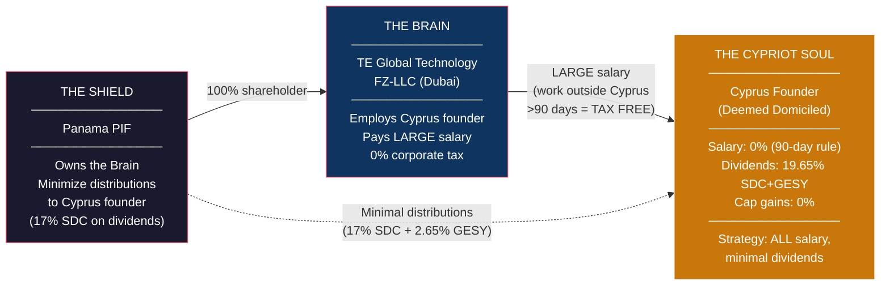
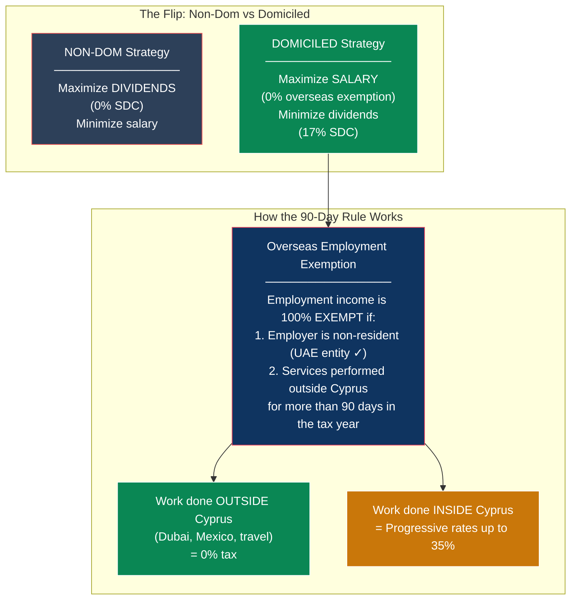
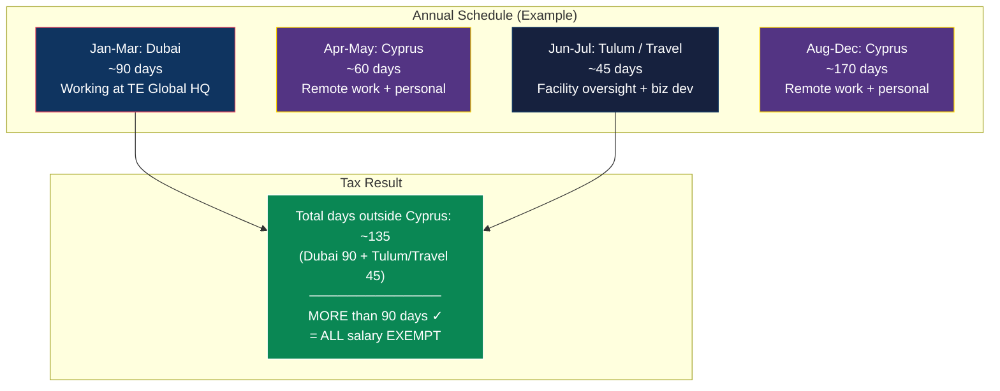
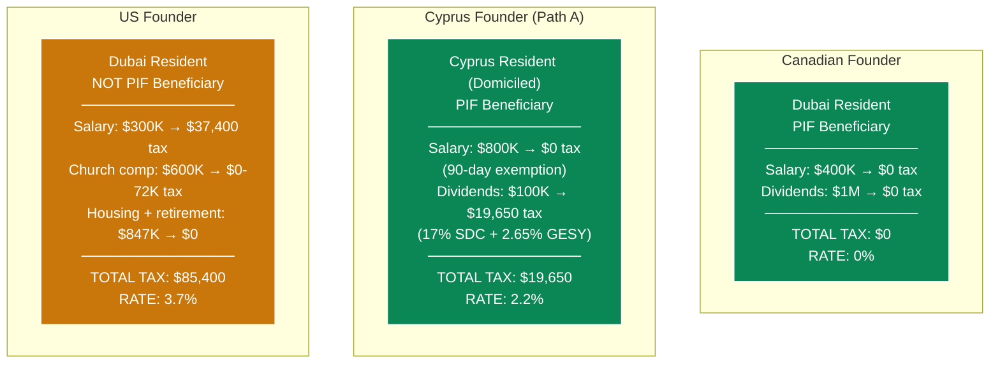
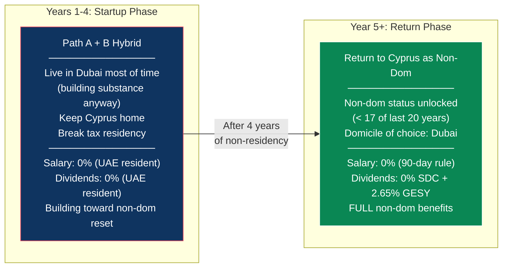

# Cyprus Founder Integration: The Domiciled Resident Strategy

> **Document Status:** Strategy document — requires Cyprus tax counsel validation
> **Applies to:** Lifelong Cyprus resident (25+ years) — deemed domiciled, non-dom regime does NOT apply
> **Non-dom reference:** For founders who are NOT lifelong residents, see [CYPRUS_NONDOM_REFERENCE.md](./CYPRUS_NONDOM_REFERENCE.md)
> **Related:** [Master Plan: The Complete TE Global Structure](./US_508C1A_REVISED_DONATION_MODEL.md), [UAE Implementation Blueprint](./UAE_IMPLEMENTATION_BLUEPRINT.md)
> **Last Updated:** February 2026

---

## 1. TL;DR — The Problem and the Solution

A Cyprus founder who has lived in Cyprus their entire life (25+ years) is **deemed domiciled**. This means the favorable non-dom regime (0% SDC on dividends) does **not** apply. Dividends hit **17% SDC + 2.65% GESY = ~19.65%**. That changes everything.

**The strategy flips: maximize salary, minimize dividends.**

The **overseas employment exemption** — salary from a non-resident employer for work done outside Cyprus for more than 90 days — is **fully exempt from Cyprus income tax** regardless of domicile status. This is the lifelong resident's primary tool.

| Income Type | Tax for Lifelong Resident | Strategy |
|---|---|---|
| Salary (work outside Cyprus >90 days) | **0% — fully exempt** | **MAXIMIZE this** |
| Salary (work inside Cyprus) | Progressive rates up to 35% | Minimize this |
| Dividends / PIF distributions | **17% SDC + 2.65% GESY = ~19.65%** | **MINIMIZE this** |
| Capital gains on securities | **0%** | No change needed |

---

## 2. Why Lifelong Residency Changes Everything

### The Non-Dom Regime Does NOT Apply

| Requirement | Status for 25+ Year Resident |
|---|---|
| Not resident for 17 of last 20 years? | **FAILS** — resident for 20+ of last 20 years |
| Domicile of origin not Cyprus? | **FAILS** — born and raised in Cyprus |
| Acquired domicile of choice elsewhere? | **FAILS** — never permanently relocated |
| **Non-dom eligible?** | **NO** |

**Consequence:** Full SDC applies — **17% on dividends, 17% on interest**

### The 50% Employment Exemption Does NOT Apply

| Requirement | Status |
|---|---|
| Not a Cyprus tax resident for 15 consecutive years before employment? | **FAILS** — has been resident continuously |
| **Article 8(23A) eligible?** | **NO** |

### What STILL Works

| Tool | Status | Why |
|---|---|---|
| **Overseas employment exemption (90-day rule)** | **AVAILABLE** | Based on where work is performed, not domicile status |
| **Capital gains exemption on securities** | **AVAILABLE** | Applies to all residents regardless of domicile |
| **Cyprus-UAE treaty (0% WHT)** | **AVAILABLE** | Treaty applies regardless of domicile |
| **No CFC rules for individuals** | **AVAILABLE** | Cyprus CFC only applies to companies |
| **No exit tax** | **AVAILABLE** | Cyprus has no departure tax |

---

## 3. The Core Strategy: Salary-First

For a domiciled Cyprus resident, the optimal structure is clear: **take as much as possible as salary for work done outside Cyprus, and as little as possible as dividends.**

### The 90-Day Exemption — The Key Tool

This exemption is the single most important provision for the domiciled Cyprus founder:

| Criterion | Requirement | How to Meet It |
|---|---|---|
| Employer | Must be a **non-resident employer** (or a foreign PE of a Cyprus employer) | TE Global Technology FZ-LLC (Dubai) = non-resident employer ✓ |
| Days outside Cyprus | Must perform services **outside Cyprus for more than 90 days** in the calendar year | Work from Dubai office, attend Tulum facility, travel for business |
| Type of income | **Employment income** (salary, bonus, benefits) | Formal employment contract with the UAE entity |

**What counts as a "day outside Cyprus":**
- Day of departure = day outside Cyprus
- Day of arrival = day in Cyprus
- If in Dubai Mon-Fri = 4 days outside (depart Mon, arrive Fri)

**90 days = roughly 3 months.** A founder who spends January-March in Dubai (or split across Dubai + Mexico + business travel throughout the year) meets this threshold while still living in Cyprus ~9 months of the year.

---

## 4. Three Paths for the Domiciled Cyprus Founder

### Path A: Salary-First with Overseas Work (Recommended)

**Stay in Cyprus. Work from Dubai/Mexico/abroad for 90+ days. Take a large salary. Minimize dividends.**

**Tax Math (Year 5):**

| Income | Amount | Tax Treatment | Tax |
|---|---|---|---|
| UAE salary (work outside Cyprus >90 days) | **$800,000** | 100% exempt — overseas employment exemption | **$0** |
| PIF distributions (dividends) — kept minimal | $100,000 | 17% SDC ($17,000) + 2.65% GESY ($2,650) | **~$19,650** |
| Capital gains | Variable | 0% on securities | **$0** |
| **Total on $900,000** | | | **~$19,650** |
| **Effective rate** | | | **~2.2%** |

**Why this works:**
- The UAE entity is genuinely non-resident (Dubai-based, Dubai-licensed)
- The founder genuinely works from Dubai 90+ days per year (office in DIC, team is there)
- Employment contract is with the UAE entity, not a Cyprus company
- Salary is not artificially inflated — it's reasonable compensation for an executive/co-founder
- Cyprus home and lifestyle are fully maintained the other ~230 days

**The key insight: there is no limit on the salary amount.** Unlike the US FEIE ($130K cap), the Cyprus overseas employment exemption exempts 100% of employment income regardless of amount. A $800K salary from the UAE entity is just as exempt as a $100K salary, as long as the >90 day threshold is met.

### Path B: Move to Dubai, Reset the Clock, Return as Non-Dom

**Leave Cyprus for 4 years. Return as non-dom with 0% SDC on dividends.**

Cyprus has **no exit tax**. The founder can leave, establish UAE residency, and return later with a clean slate.

**The math:**
- 25 years resident = 20 of last 20 years ✗ (deemed domiciled)
- After 1 year away: 19 of 20 ✗
- After 2 years: 18 of 20 ✗
- After 3 years: 17 of 20 ✗ (still deemed domiciled — need <17)
- **After 4 years: 16 of 20 ✓** — eligible for non-dom status

**But** the founder also has a Cyprus **domicile of origin** (born there). To qualify as non-dom, they must acquire a **domicile of choice** in another country — meaning they must genuinely establish a new permanent home (e.g., in Dubai) and demonstrate intention to remain there indefinitely. Simply being away for 4 years and then returning may not be sufficient.

| Year | Where | Tax | Income Strategy |
|---|---|---|---|
| Years 1-4 (Dubai) | UAE resident | **0% on everything** | Take salary + full PIF distributions — all at 0% |
| Year 5+ (Return to Cyprus) | Cyprus non-dom | **0% SDC on dividends** + salary exemption | Switch to dividend-heavy model |

**Trade-offs:**
- Must genuinely relocate to Dubai for ~4 years
- Must establish a domicile of choice (buy/rent home in Dubai, sever some Cyprus ties)
- Risk that Cyprus tax authorities challenge the domicile of choice claim upon return
- During the 4 Dubai years: 0% on everything (the golden period)
- On return: non-dom regime unlocked for up to 17 years

**Recommendation:** This path is powerful but requires genuine relocation. If the founder is willing to live in Dubai for the company's first 4 years (which aligns with the startup phase when presence in Dubai for substance is most important), they return to Cyprus with the full non-dom toolkit. **This is the strongest long-term play.**

### Path C: Full Dubai Move (Permanent)

**Like the Canadian founder — move to Dubai permanently.**

| Income | Tax |
|---|---|
| UAE salary | **$0** |
| PIF distributions | **$0** |
| Capital gains | **$0** |
| **Everything** | **$0** |

**Trade-offs:**
- Must genuinely relocate
- Lose daily Cyprus lifestyle (can still visit freely)
- Golden Visa required (~$2,000-5,000)
- 0% vs 2.2% (Path A) — small marginal benefit unless taking large dividends

### Path D: Stay in Cyprus Full-Time (No Travel Optimization)

**If the founder does not want to travel 90+ days per year.**

Without the overseas employment exemption, all salary for work done in Cyprus is taxed at progressive rates:

**2026 Cyprus Income Tax Rates:**

| Bracket | Rate |
|---|---|
| EUR 0 - 22,000 | 0% |
| EUR 22,001 - 32,000 | 20% |
| EUR 32,001 - 42,000 | 25% |
| EUR 42,001 - 72,000 | 30% |
| EUR 72,001+ | 35% |

**Tax Math (Year 5, Path D — worst case):**

| Income | Amount | Tax |
|---|---|---|
| UAE salary (work in Cyprus, no exemption) | EUR 300,000 (~$330K) | ~EUR 89,350 (~$98K) at blended ~29.8% |
| PIF distributions (dividends) | EUR 300,000 (~$330K) | ~EUR 59,000 SDC (17%) + ~EUR 4,770 GESY (capped) = ~$70K |
| Capital gains | Variable | $0 |
| **Total on ~$660K** | | **~$168,000** |
| **Effective rate** | | **~25.5%** |

**This is still better than a US founder without the church structure (~30%+), but dramatically worse than Paths A or B.**

---

## 5. Path Comparison at a Glance

| | Path A: Salary-First | Path B: Dubai Reset | Path C: Full Dubai | Path D: Stay Put |
|---|---|---|---|---|
| **Where they live** | Cyprus (~230 days) + Dubai (~90 days) + travel | Dubai (4 yrs) → Cyprus | Dubai (permanent) | Cyprus (full-time) |
| **Travel required** | 90+ days outside Cyprus/yr | 4 years abroad then return | Permanent relocation | None |
| **Salary tax** | **0%** (90-day rule) | **0%** (Dubai) → **0%** (90-day rule on return) | **0%** (Dubai) | **Up to 35%** (progressive) |
| **Dividend tax** | **~19.65%** (SDC + GESY) | **0%** (Dubai) → **2.65%** (non-dom GESY) | **0%** | **~19.65%** (SDC + GESY) |
| **Capital gains** | **0%** | **0%** | **0%** | **0%** |
| **Y5 effective rate** | **~2.2%** | **0% (Dubai) → ~0.4% (Cyprus)** | **0%** | **~25.5%** |
| **Lifestyle change** | Moderate — 3 months in Dubai | Major — 4 years in Dubai | Major — permanent | None |
| **Complexity** | Low | Medium | Low | Low |
| **Recommended?** | **Yes (immediate)** | **Yes (long-term play)** | Only if desired | **Last resort** |

---

## 6. The PIF Question: Can a Domiciled Resident Be a Beneficiary?

**Yes — but dividends hurt more.**

| | Non-Dom Beneficiary | Domiciled Beneficiary |
|---|---|---|
| SDC on PIF distributions | 0% | **17%** |
| GESY on PIF distributions | 2.65% (capped EUR 4,770) | 2.65% (capped EUR 4,770) |
| Income tax on dividends | 0% | 0% (dividends always exempt from income tax in Cyprus) |
| **Total** | **~2.65%** (capped) | **~19.65%** (17% uncapped + 2.65% capped) |

**This is why the strategy flips to salary-first.** A domiciled founder should take the minimum possible in dividends and the maximum possible in salary (which is exempt under the 90-day rule).

### Optimal Income Split

| Income Channel | Domiciled Strategy | Why |
|---|---|---|
| **UAE salary** | **MAXIMIZE** — take as much as reasonable | 0% if working outside Cyprus >90 days |
| **PIF distributions** | **MINIMIZE** — only take what's needed beyond salary | 19.65% tax on every dollar |
| **Capital gains** | Take freely | Always 0% on securities |
| **Retained earnings in UAE entity** | **Retain as much as possible** | 0% QFZP — no cost to keep it in the entity |

**Practical approach:** Pay the Cyprus founder a large salary ($500K-$1M+) from the UAE entity. Leave profits in the UAE entity or the PIF. Only distribute dividends when capital is actually needed for personal expenditure beyond salary. Since the UAE entity pays 0% corporate tax, there's no cost to retaining earnings — and the money is accessible whenever needed through future salary increases.

---

## 7. Comparison: All Founders at Year 5

| | Canadian | Cyprus (Path A) | Cyprus (Path B, post-return) | US |
|---|---|---|---|---|
| **Year 5 total income** | $1,400,000 | $900,000 | $1,400,000 | $2,294,000 |
| **Year 5 tax** | **$0** | **$19,650** | **~$5,200** | **$85,400** |
| **Effective rate** | **0%** | **2.2%** | **~0.4%** | **3.7%** |
| **Structure complexity** | Simple | Simple | Medium (4-yr relocation) | Complex (church + multi-channel) |
| **Needs the church?** | No | No | No | Yes |
| **Can be PIF beneficiary?** | Yes | Yes (but 19.65% SDC) | Yes (0% SDC after reset) | No |

**Note on income difference:** The Cyprus founder (Path A) takes $900K instead of $1.4M because they minimize dividends (which would be taxed at 19.65%). The remaining $500K stays in the UAE entity at 0% and is accessible via future salary or when/if they move to a 0% jurisdiction.

---

## 8. The Hybrid Play: Path A Now, Path B Later

The strongest strategy combines both paths:

**Why this is ideal:**

1. **Years 1-4 are the startup phase** — the founder should be in Dubai anyway (building team, establishing substance, working with the CTO and engineers)
2. **During those years they pay 0% on everything** as a UAE resident
3. **After 4 years, they've broken the 17-of-20 threshold** (only 16 of last 20 years as Cyprus resident)
4. **They've established a genuine domicile of choice in Dubai** (lived there, rented/bought a home, built a life)
5. **They return to Cyprus with non-dom status** — 0% SDC on dividends for 17 years
6. **The return is genuine** — they're coming back to Cyprus with real ties elsewhere

**Year-by-year tax:**

| Year | Residence | Salary Tax | Dividend Tax | Effective Rate |
|---|---|---|---|---|
| Year 1 | Dubai | 0% | 0% | **0%** |
| Year 2 | Dubai | 0% | 0% | **0%** |
| Year 3 | Dubai | 0% | 0% | **0%** |
| Year 4 | Dubai | 0% | 0% | **0%** |
| Year 5+ | Cyprus (non-dom) | 0% (90-day rule) | 2.65% GESY (capped) | **~0.4%** |

**This aligns perfectly with the business:** The startup phase needs everyone in Dubai for substance. The Cyprus founder being there isn't a lifestyle sacrifice — it's an operational requirement.

---

## 9. Implementation

### If Starting with Path A (Salary-First, Stay in Cyprus)

| Step | Detail | Timeline |
|---|---|---|
| 1. Employment contract with UAE entity | Formal employment as executive/co-founder of TE Global Technology FZ-LLC | 1 week |
| 2. Plan annual travel schedule | Ensure 90+ days outside Cyprus (Dubai office time, Tulum visits, business travel) | Ongoing |
| 3. Set up travel documentation | Keep detailed records of days outside Cyprus, work performed, timesheets | From day 1 |
| 4. Salary structure | Set salary at maximum reasonable level; minimize any PIF distributions | With counsel |
| 5. PIF beneficiary (optional) | Can be added as beneficiary for future use; simply don't take distributions | 2-3 weeks |
| 6. Annual Cyprus tax filing | Declare salary (exempt under 90-day rule) and any dividends (SDC + GESY) | Annually |

### If Starting with Path A→B Hybrid (Dubai First, Cyprus Later)

| Step | Detail | Timeline |
|---|---|---|
| 1. Establish UAE residency | Golden Visa (entrepreneur pathway) + Emirates ID | 2-4 weeks |
| 2. Notify Cyprus Tax Department | Declare non-residency for the tax year | Before year-end |
| 3. Reduce Cyprus ties (not sever completely) | Can keep the home, but don't maintain tax residency. Spend <183 days in Cyprus. | Ongoing |
| 4. Employment with UAE entity | Work from Dubai full-time during startup phase | From day 1 |
| 5. Take full salary + distributions | Everything at 0% as UAE resident | During Dubai years |
| 6. After 4 years: return to Cyprus | Re-establish tax residency via 60-day or 183-day rule; file non-dom declaration | Year 4-5 |
| 7. Confirm domicile of choice | Documentation showing genuine intent to make Dubai permanent home during the 4 years (lease, bills, social ties) | On return |

---

## 10. Critical Tax Rates Reference (2026)

### Cyprus Income Tax (Progressive — on Salary Earned IN Cyprus)

| Bracket (EUR) | Rate |
|---|---|
| 0 - 22,000 | 0% |
| 22,001 - 32,000 | 20% |
| 32,001 - 42,000 | 25% |
| 42,001 - 72,000 | 30% |
| 72,001+ | 35% |

### Special Defence Contribution (SDC — Domiciled Residents)

| Income Type | SDC Rate |
|---|---|
| Dividends (from any source) | **17%** |
| Interest (from any source) | **17%** |
| Rental income | 3% on 75% of gross = **2.25% effective** |

### GESY (Healthcare — All Residents)

| Income Type | GESY Rate | Cap |
|---|---|---|
| Employment income | 2.65% (employee) + 2.90% (employer) | EUR 180,000 |
| Dividends / interest | 2.65% | EUR 180,000 |
| Self-employment | 4.00% | EUR 180,000 |
| **Maximum annual GESY** | | **EUR 4,770** |

### What's Always 0% (Regardless of Domicile)

| Income Type | Tax |
|---|---|
| Capital gains on disposal of shares/securities | **0%** |
| Income tax on dividends | **0%** (dividends only subject to SDC + GESY, never income tax) |

### Cyprus-UAE Treaty Rates

| Payment Type | WHT Cyprus → UAE | WHT UAE → Cyprus |
|---|---|---|
| Dividends | 0% | 0% |
| Interest | 0% | 0% |
| Royalties | 0% | 0% |

---

## 11. Risk Matrix

| Risk | Probability | Impact | Mitigation |
|---|---|---|---|
| **90-day exemption challenged** | Low-Medium | High — salary becomes taxable at up to 35% | Meticulous travel records. Boarding passes, hotel receipts, work calendars, timesheets. Employment contract clearly with UAE entity. Keep a work diary showing Dubai office attendance. |
| **Salary deemed unreasonable** | Low | Medium — portion could be recharacterized as dividend | Set salary with reference to comparable executive compensation. Document role, responsibilities, and time commitment. Get counsel sign-off. |
| **Cyprus tax reform — SDC changes** | Medium | Positive — SDC on dividends may drop from 17% to 5% (proposed reform) | Monitor reforms. If SDC drops, the dividend penalty shrinks and income strategy can shift. |
| **Non-dom reset challenged (Path B)** | Medium | High — return to domiciled status, SDC applies | Establish genuine domicile of choice in Dubai during the 4 years. Don't treat it as a temporary relocation — buy/lease property, join community, build life. |
| **Panama PIF / EU blacklist** | Low-Medium | Medium — DAC6 reporting, bank questions | Same as for all founders. Transparent reporting. Consider Liechtenstein foundation if counsel advises. |
| **UAE QFZP loss** | Medium | Medium — 9% UAE CT | Same mitigation as all founders. Doesn't affect personal tax strategy. |

---

## 12. Open Questions for Cyprus Tax Counsel

1. **90-day exemption for co-founder salary**: Confirm that a co-founder taking a large salary ($500K-$1M) from the UAE entity qualifies for the overseas employment exemption, given the employer is genuinely non-resident and services are performed outside Cyprus for 90+ days
2. **Salary vs. dividend recharacterization risk**: At what salary level might Cyprus tax authorities argue the salary is disguised dividend? What documentation is needed to support large executive compensation?
3. **Non-dom reset via Dubai relocation**: Confirm that 4 years of UAE residency (breaking the 17-of-20 threshold) combined with establishing a Dubai domicile of choice allows the founder to return as non-dom
4. **SDC reform timeline**: When are the proposed SDC changes (17% → 5% on dividends) expected to take effect? Would this change the income strategy?
5. **GESY on exempt salary**: Is the overseas employment exemption also exempt from GESY contributions, or is GESY still owed on the salary amount?
6. **PIF distribution classification**: Confirm distributions from Panama PIF are treated as dividends (not "other income") for SDC purposes
7. **Panama blacklist practical impact**: Any specific compliance obligations or risks for a Cyprus individual receiving from a Panama entity?
8. **60-day rule + domiciled status**: Can a domiciled resident use the 60-day rule (relevant for Path A if they want to spend fewer days in Cyprus but maintain tax residency)?

---

## 13. The Bottom Line

| Scenario | Year 5 Income | Year 5 Tax | Effective Rate |
|---|---|---|---|
| **Path A: Salary-first** (stay in Cyprus, 90+ days abroad) | $900,000 | ~$19,650 | **~2.2%** |
| **Path A→B Hybrid:** Dubai yrs 1-4, Cyprus non-dom yr 5+ | $1,400,000 | ~$5,200 | **~0.4%** |
| **Path C: Full Dubai** (permanent) | $1,400,000 | $0 | **0%** |
| **Path D: Stay put** (no travel optimization) | $660,000 | ~$168,000 | **~25.5%** |
| For comparison: **US Founder** (with church structure) | $2,294,000 | $85,400 | **3.7%** |

**The recommended play for a lifelong Cyprus resident:**

1. **Immediately:** Path A — take a large salary from the UAE entity, work from Dubai 90+ days/year, minimize dividends. Effective rate: ~2.2%.

2. **Ideally:** Path A→B Hybrid — spend the startup years (1-4) primarily in Dubai building the business and team. This is operationally necessary anyway. After 4 years, return to Cyprus with non-dom status unlocked. Effective rate drops to ~0.4% for 17 years.

3. **If SDC reform passes** (17% → 5% on dividends): The dividend penalty shrinks dramatically, and the income split becomes less critical. Watch this closely.

**A domiciled Cyprus founder pays more than the Canadian or non-dom founder, but the 90-day overseas employment exemption still makes the effective rate remarkably low — especially if they're willing to spend startup years in Dubai.**

---

*This document describes legal tax optimization for a Cyprus-domiciled resident within the TE Global structure. All mechanisms cited (overseas employment exemption, SDC rates, GESY contributions, 2026 tax brackets, non-dom regime requirements) are provisions of Cyprus tax law as of February 2026. The proposed SDC reforms have been noted but are not yet enacted. Implementation requires validation by qualified Cyprus tax counsel.*
