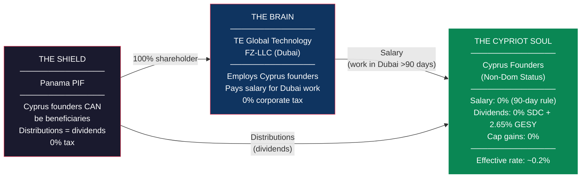
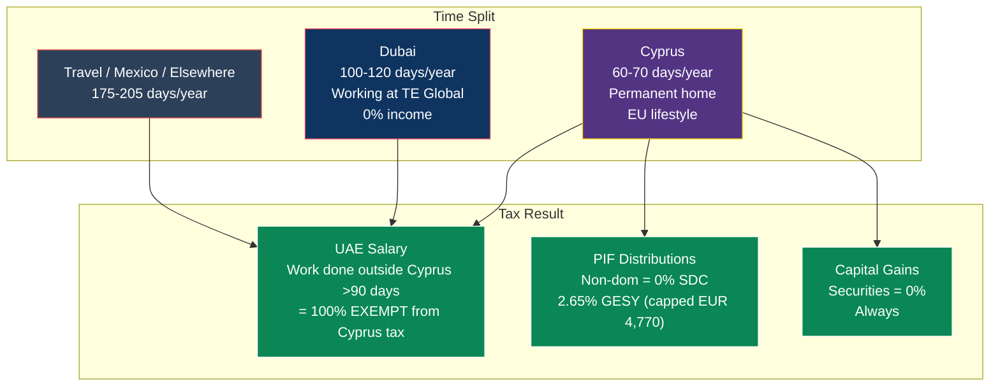
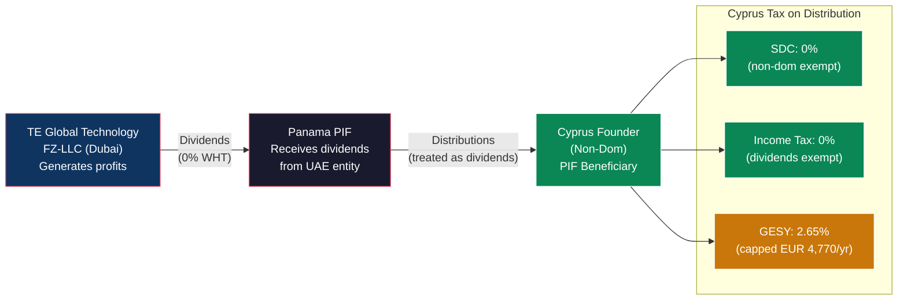
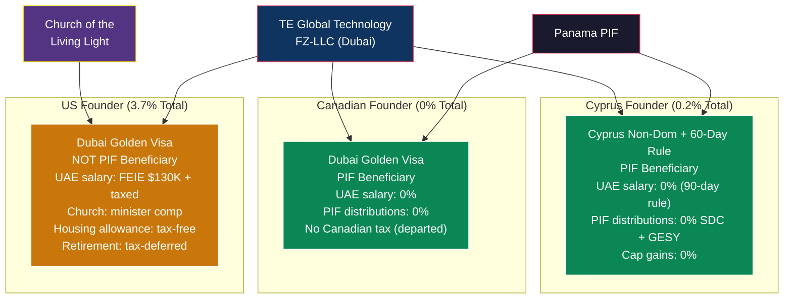

# Cyprus Non-Dom Reference: Tax Benefits for Non-Domiciled Residents

> **Document Status:** Reference document — applies to founders who are NOT lifelong Cyprus residents
> **Note:** For our Cyprus founder (lifelong resident, deemed domiciled), see [CYPRUS_FOUNDER_INTEGRATION.md](./CYPRUS_FOUNDER_INTEGRATION.md)
> **Related:** [Master Plan](./US_508C1A_REVISED_DONATION_MODEL.md), [UAE Implementation Blueprint](./UAE_IMPLEMENTATION_BLUEPRINT.md), [Cyprus Domiciled Strategy](./CYPRUS_FOUNDER_INTEGRATION.md)
> **Last Updated:** February 2026

---

## 1. TL;DR — Cyprus Founders Have It Easy

Cyprus founders don't need the church. They don't need complex wealth extraction channels. They don't need to navigate worldwide taxation. Cyprus's **non-domiciled (non-dom) regime** is one of the most generous in the world for passive income, and combined with the UAE structure, it produces a near-zero effective tax rate with minimal complexity.

| Income Type | Tax Treatment | Effective Rate |
|---|---|---|
| Employment salary (work done outside Cyprus >90 days) | **Fully exempt** from Cyprus income tax | **0%** |
| PIF distributions (dividends) | 0% SDC (non-dom) + 2.65% GESY (capped EUR 4,770/yr) | **~0.2% on large amounts** |
| Capital gains on share disposal | **Fully exempt** | **0%** |
| **Overall effective rate** | | **~0.2%** |

---

## 2. Why Cyprus Is Different from the US

The US founder needs the church structure because the US taxes citizens on **worldwide income regardless of where they live**. Even living in Dubai, a US citizen owes tax on every dollar earned anywhere on Earth.

Cyprus does the opposite:

| Factor | United States | Cyprus |
|---|---|---|
| Tax basis | **Citizenship** (worldwide, forever) | **Residency** (stop being resident = stop paying tax) |
| Dividends | Taxed at 0-23.8% (plus 3.8% NIIT) | **0% income tax + 0% SDC (non-dom) + 2.65% GESY** |
| Capital gains on shares | 0-23.8% (plus 3.8% NIIT) | **0%** |
| Foreign employment income | Taxed (FEIE covers $130K) | **0% if work done abroad >90 days** |
| CFC/GILTI rules for individuals | Yes — complex, punitive | **No CFC for individuals** (only companies) |
| Exit tax | Yes (expatriation tax > $866K) | **No exit tax** |
| Church needed? | **Yes** — to create tax-free channels | **No** — tax code already provides them |

**Bottom line:** A Cyprus founder plugged into the TE structure gets nearly everything tax-free by default. No church. No housing allowance. No retirement stacking. Just straightforward non-dom benefits.

---

## 3. The Cyprus Non-Dom Regime — How It Works

### What Is Non-Dom?

"Non-domiciled" means you're a **tax resident** of Cyprus but your **domicile** (permanent home of origin or choice) is elsewhere. If you weren't born in Cyprus and haven't lived there for 17 of the last 20 years, you qualify automatically.

### What You Get

| Benefit | Detail | Duration |
|---|---|---|
| **0% SDC on dividends** | Special Defence Contribution (normally 17%) is fully exempt for non-doms | 17 years (rolling 20-year window) |
| **0% SDC on interest** | Interest income SDC (normally 17%) fully exempt | 17 years |
| **0% capital gains on securities** | Disposal of shares, bonds, debentures — fully exempt regardless of domicile | Permanent |
| **GESY (healthcare) on passive income** | 2.65% on dividends/interest, **capped at EUR 180,000** (max EUR 4,770/yr) | Ongoing |
| **No exit tax** | Leave Cyprus whenever you want, no deemed disposition | Permanent |

### The 17-Year Clock

Non-dom status lasts until you've been a Cyprus tax resident for 17 out of the last 20 years. But this is a **rolling window** — if you break residency for a year or two, the clock pauses. Unlike the US, you're not locked in. You can leave, come back, and the benefits continue.

---

## 4. Three Paths for Cyprus Founders

### Path A: The Hybrid (Recommended)

**Live primarily between Dubai and Cyprus. Tax resident in Cyprus via the 60-day rule. Work from Dubai most of the year.**

**60-Day Rule Requirements (ALL must be met):**

| Requirement | How to Meet It |
|---|---|
| Spend at least 60 days in Cyprus | Maintain a home, spend ~2 months/year |
| NOT be tax resident in any other country | Don't apply for UAE tax residency certificate; don't spend 183+ days in any single other country |
| Not spend more than 183 days in any other single country | Split time between Dubai, Mexico, travel |
| Have business/employment in a Cyprus entity | Hold a directorship in a Cyprus company, OR maintain employment with a Cyprus-linked entity |
| Maintain a permanent residence in Cyprus | Own or rent a home in Cyprus |

**Tax Math for Path A:**

| Income | Amount | Tax Treatment | Tax |
|---|---|---|---|
| UAE salary (work done outside Cyprus >90 days) | $200,000-400,000 | **100% exempt** — non-resident employer, services outside Cyprus >90 days | **$0** |
| PIF distributions (dividends) | $200,000-1,000,000 | 0% SDC (non-dom) + 0% income tax + 2.65% GESY capped at EUR 4,770 | **~$5,200** (EUR 4,770) |
| Capital gains on any share disposal | Variable | **0%** | **$0** |
| **Total on $400K-1.4M income** | | | **~$5,200/yr** |

**Effective rate: 0.4% on $1.4M → 1.3% on $400K → always capped at EUR 4,770/yr GESY.**

**Why this path is best:**
- Maintain EU residency and lifestyle (Cyprus = EU member)
- Access to EU healthcare system
- Near-zero tax
- No need to fully relocate to Dubai
- Can still spend significant time at the Tulum facility and in Dubai for work
- Keep an apartment in Limassol or Paphos as home base

### Path B: Full Dubai Move (Like the Canadian Founder)

**Drop Cyprus residency entirely. Move to Dubai. Get a Golden Visa.**

| Income | Tax |
|---|---|
| UAE salary | **$0** (no personal income tax in UAE) |
| PIF distributions | **$0** (no personal income tax in UAE) |
| Capital gains | **$0** |
| **Everything** | **$0** |

**Trade-offs:**
- Lose EU residency (can still visit as tourist for 90/180 days)
- Must establish genuine UAE residency (Golden Visa + Emirates ID)
- 0% vs 0.2% — marginal improvement over Path A
- Lose the Cyprus lifestyle and EU access

**Recommendation:** Only choose Path B if the founder genuinely wants to live in Dubai full-time. The tax difference between Path A and Path B is EUR 4,770/year — not worth restructuring your life around.

### Path C: Full Cyprus Residency (183+ Days)

**Stay in Cyprus full-time. Use the 50% employment exemption.**

If a Cyprus founder prefers to live in Cyprus and not travel extensively:

| Income | Tax Treatment | Effective Rate |
|---|---|---|
| Employment salary (Article 8(23A) — 50% exemption) | Only 50% of salary is taxable; progressive rates up to 35% on the taxable half | **~17.5% maximum** on total salary |
| PIF distributions (dividends) | 0% SDC (non-dom) + 2.65% GESY capped | **~0.2%** |
| Capital gains on securities | 0% | **0%** |

**Article 8(23A) Details:**
- Requires first employment in Cyprus after 15+ consecutive years of non-residency
- Salary must exceed EUR 55,000/year
- Exemption lasts **17 years**
- Can change employers and keep the exemption

**Tax Math for Path C (EUR 200K salary + EUR 500K dividends):**

| Income | Amount | Calculation | Tax |
|---|---|---|---|
| Salary (50% exempt) | EUR 200,000 | 50% = EUR 100,000 taxable. Tax: ~EUR 24,050 | **~EUR 24,050** |
| Dividends | EUR 500,000 | 0% SDC + 2.65% GESY (capped EUR 4,770) | **EUR 4,770** |
| **Total** | EUR 700,000 | | **~EUR 28,820** |
| **Effective rate** | | | **~4.1%** |

**Recommendation:** Path C is still excellent but Path A is strictly better if the founder is willing to spend 90+ days working from Dubai.

---

## 5. The PIF Question: Can Cyprus Founders Be Beneficiaries?

**Yes — and this is a major advantage over the US founder.**

The US founder cannot be a PIF beneficiary because the IRS would look through the PIF and attribute CFC/GILTI income. Cyprus has no equivalent rule for individuals:

| Issue | US Founder | Cyprus Founder |
|---|---|---|
| Can be PIF beneficiary? | **No** (triggers CFC/GILTI) | **Yes** |
| PIF distributions taxable? | N/A (not a beneficiary) | As dividends: **0% SDC (non-dom) + 2.65% GESY (capped)** |
| CFC rules for individuals? | **Yes** — punitive | **No** — Cyprus CFC only applies to companies |
| Look-through rules? | IRS looks through trusts/foundations | No equivalent for individuals |

**How distributions work:**

### The Panama-EU Blacklist Consideration

Panama is on the EU list of non-cooperative tax jurisdictions. For Cyprus:

| Concern | Reality |
|---|---|
| Does the blacklist add withholding tax for individuals? | **No** — Cyprus blacklist WHT rules apply to payments FROM Cyprus companies TO Panama entities, not to individual beneficiaries receiving FROM Panama |
| DAC6 reporting? | **Possibly** — cross-border arrangements involving blacklisted jurisdictions may trigger mandatory disclosure requirements. This is a **reporting** obligation, not a tax |
| Reputational risk? | **Low-moderate** — banks and compliance officers may ask additional questions |
| Alternative to PIF? | If counsel advises, could use a Liechtenstein foundation or Netherlands BV as the holding layer instead of Panama. But PIF remains functional for individuals. |

**Recommendation:** Keep the Panama PIF for now. If Cyprus counsel flags concerns, consider restructuring the holding layer to a non-blacklisted jurisdiction (Liechtenstein, Luxembourg, Netherlands). The cost is minimal and the PIF structure translates directly.

---

## 6. Side-by-Side: All Founders Compared

### Structure Each Founder Uses

### Year 5 Comparison ($1.5M Total Personal Value Each)

| | Canadian Founder | Cyprus Founder | US Founder |
|---|---|---|---|
| **Residence** | Dubai | Cyprus (60-day) + Dubai | Dubai |
| **UAE salary** | $300K → **$0 tax** | $300K → **$0 tax** (90-day rule) | $300K → $37,400 tax (FEIE + marginal) |
| **PIF distributions** | $500K → **$0 tax** | $500K → **$5,200 tax** (GESY cap) | N/A (not a beneficiary) |
| **Church compensation** | $30K stipend → **$0 tax** | N/A (not needed) | $300K salary + $300K housing + $547K retirement → $48,000 tax |
| **Church-owned assets** | N/A | N/A | $200K lifestyle → **$0 tax** |
| **Capital gains** | **$0 tax** | **$0 tax** | Subject to US rates |
| **Total tax on ~$1.5M** | **$0** | **~$5,200** | **~$85,400** |
| **Effective rate** | **0%** | **~0.3%** | **~3.7%** (incl. deferred) |
| **Complexity** | Low | Low | High (church + multiple channels) |

---

## 7. Implementation for Cyprus Founders

### What They Need to Do

**If Already Cyprus Resident (Non-Dom):**

| Step | Detail | Timeline |
|---|---|---|
| 1. Confirm non-dom status | Verify they haven't been Cyprus tax resident for 17 of last 20 years | 1 week (with Cyprus tax advisor) |
| 2. Verify 60-day rule eligibility | Confirm no tax residency in another country; maintain Cyprus home | 1 week |
| 3. Employment with UAE entity | Execute employment agreement with TE Global Technology FZ-LLC | 1 week |
| 4. PIF beneficiary status | Panama counsel adds Cyprus founder(s) as PIF beneficiaries in private regulations | 2-3 weeks |
| 5. Plan the year | Ensure 60+ days in Cyprus, 90+ working days outside Cyprus, <183 days in any single other country | Ongoing |
| 6. Cyprus tax filing | Annual personal income tax return declaring salary (exempt) and dividends (GESY only) | Annually |

**If Becoming Cyprus Resident (New):**

| Step | Detail | Timeline |
|---|---|---|
| 1. Establish Cyprus residency | Rent or buy a home in Cyprus | 2-4 weeks |
| 2. Apply for Cyprus tax residency | Register with Cyprus Tax Department | 2-4 weeks |
| 3. Confirm non-dom status | File declaration of non-domicile status | 1-2 weeks |
| 4. Cyprus company directorship (for 60-day rule) | Appoint as director of a Cyprus holding company or advisory entity | 1-2 weeks |
| 5. Employment with UAE entity | Execute employment agreement | 1 week |
| 6. PIF beneficiary status | Add to PIF private regulations | 2-3 weeks |

**Total setup time: 4-8 weeks**

### What They DON'T Need

| Not Needed | Why |
|---|---|
| Church / 508(c)(1)(A) | That's a US-specific structure for US worldwide taxation. Cyprus doesn't tax dividends or foreign employment income. |
| Housing allowance | Cyprus doesn't have an equivalent need — housing costs aren't a tax benefit vehicle because income is already untaxed |
| Complex retirement stacking | No need — dividends are already at 0% SDC + 2.65% GESY capped |
| UAE Golden Visa | Optional — only needed if spending significant time in Dubai. Can enter UAE on visa-free entry for short stays |
| Renunciation of citizenship | Cyprus doesn't tax based on citizenship. Residency-based taxation = just move if you want to stop. |

---

## 8. CFC Considerations

Cyprus CFC rules only apply to **companies**, not individuals. But if a Cyprus founder holds shares through a Cyprus company (rather than personally or through the PIF), CFC rules could apply to that company.

### Does the UAE Entity Trigger CFC?

| Test | Result |
|---|---|
| Is the UAE entity controlled by a Cyprus company? | Only if structured that way — in the current model, **PIF owns the UAE entity, not a Cyprus company** |
| Is the UAE entity low-taxed? | Yes — 0% QFZP < 6.25% threshold (50% of Cyprus 12.5%) |
| Is there substance? | **Yes** — Dubai team of 5-6 people, real office, real IP development. Substance exemption applies. |

**For the recommended structure (PIF → UAE entity):** CFC rules don't apply because no Cyprus company is in the ownership chain. The PIF (Panama) owns the UAE entity. Cyprus founders receive distributions as PIF beneficiaries — these are taxed as dividend income at the individual level (0% SDC + 2.65% GESY).

**If for any reason a Cyprus holding company is inserted:** CFC rules would theoretically apply, but the **substantive activity exemption** would protect the UAE entity because it has genuine economic substance (employees, office, IP development, management decisions in Dubai).

---

## 9. Year-by-Year Projections (Cyprus Founder — Path A)

Assuming the Cyprus founder receives both salary from the UAE entity and distributions from the PIF, scaling with the business:

### Year 1

| Income | Amount | Tax |
|---|---|---|
| UAE salary (CTO/executive role) | $200,000 | $0 (90-day exemption) |
| PIF distribution | $100,000 | $0 SDC + ~$2,900 GESY |
| **Total** | **$300,000** | **~$2,900** |
| **Effective rate** | | **~1.0%** |

### Year 3

| Income | Amount | Tax |
|---|---|---|
| UAE salary | $300,000 | $0 (90-day exemption) |
| PIF distribution | $400,000 | $0 SDC + ~$5,200 GESY (capped) |
| **Total** | **$700,000** | **~$5,200** |
| **Effective rate** | | **~0.7%** |

### Year 5

| Income | Amount | Tax |
|---|---|---|
| UAE salary | $400,000 | $0 (90-day exemption) |
| PIF distribution | $1,000,000 | $0 SDC + ~$5,200 GESY (capped) |
| Capital gains (if any equity events) | Variable | $0 |
| **Total** | **$1,400,000** | **~$5,200** |
| **Effective rate** | | **~0.4%** |

**The GESY cap is the magic:** No matter how much dividend income flows through, the healthcare contribution maxes out at EUR 4,770/year (~$5,200). Whether you earn $500K or $5M in dividends, the tax is the same $5,200.

---

## 10. Risk Matrix

| Risk | Probability | Impact | Mitigation |
|---|---|---|---|
| **60-day rule challenged** | Low | High — lose salary exemption, face progressive rates on employment income | Keep meticulous travel records. Maintain Cyprus home. Don't accidentally become tax resident elsewhere. |
| **90-day overseas exemption challenged** | Low | High — salary becomes taxable in Cyprus | Document days worked outside Cyprus. Keep timesheets. Employment contract clearly with UAE (non-resident) entity. |
| **Non-dom status challenged** | Very Low | Critical — 17% SDC on dividends | File non-dom declaration. Maintain domicile of choice documentation. Don't establish "permanent home" in Cyprus sense of domicile (different from tax residency). |
| **Panama PIF / EU blacklist** | Low-Medium | Medium — DAC6 reporting, bank compliance questions | Transparent reporting. If counsel advises, restructure to Liechtenstein or Luxembourg foundation. |
| **Cyprus CFC (if company in chain)** | Low | Medium — CFC income attributed to Cyprus company | Keep Cyprus company OUT of the ownership chain. PIF → UAE entity directly. |
| **UAE QFZP loss** | Medium | Medium — 9% UAE CT instead of 0% | Same mitigation as for all founders. 9% still favorable. |
| **Cyprus tax reform** | Low | Medium — non-dom benefits could change | Monitor EU/OECD developments. 17-year window provides long runway. Cyprus has strong incentive to maintain regime (attracts foreign capital). |

---

## 11. Open Questions for Cyprus Tax Counsel

1. **60-day rule + Dubai work split**: Confirm that spending 90+ working days in Dubai for a UAE employer qualifies for the overseas employment exemption while maintaining 60-day tax residency
2. **PIF distributions classification**: Confirm that distributions from a Panama PIF to a Cyprus non-dom individual are treated as dividend income (0% SDC + 2.65% GESY) and not "other income" (which could be taxed at progressive rates)
3. **Panama blacklist impact on individuals**: Confirm no additional withholding or penalty for Cyprus individuals receiving income from Panama entities
4. **Non-dom + 60-day interaction**: Confirm both statuses can be held simultaneously (they should, but worth confirming)
5. **DAC6 reporting**: Determine if the PIF → UAE → Cyprus individual structure triggers mandatory disclosure and if so, what the compliance cost is
6. **Business nexus for 60-day rule**: Confirm that holding a directorship in a Cyprus advisory company (or being employed by the UAE entity) satisfies the "business/employment in Cyprus" requirement
7. **Future-proofing**: Any pending EU directives that could affect the non-dom regime or the 60-day rule?

---

## 12. The Bottom Line

| Metric | Canadian Founder | Cyprus Founder | US Founder |
|---|---|---|---|
| **Structure needed** | PIF + UAE entity | PIF + UAE entity | PIF + UAE entity + Church |
| **Complexity** | Simple | Simple | Complex |
| **Setup cost** | ~$5K | ~$5K + Cyprus home | ~$20K+ (includes church formation) |
| **Annual compliance cost** | Minimal | ~$3K (Cyprus tax filing) | ~$10-15K (US returns + church compliance) |
| **Year 5 personal income** | ~$1.5M | ~$1.4M | ~$2.3M (incl. deferred + assets) |
| **Year 5 tax** | **$0** | **~$5,200** | **~$85,400** |
| **Effective rate** | **0%** | **~0.4%** | **~3.7%** |
| **Can be PIF beneficiary?** | Yes | **Yes** | No |
| **Needs the church?** | For stipend only | **No** | Yes (critical) |

**Cyprus founders get 99.6% of the Canadian founder's tax benefit with the added advantage of EU residency, EU healthcare, and EU travel freedom.** They don't need any of the US-specific structures. They just need non-dom status, the 60-day rule, and a seat on the PIF.

The only cost: EUR 4,770/year in healthcare contributions. That's the entire tax bill on $1.4M+ of income.

---

*This document describes legal tax optimization combining Cyprus non-domiciled status with UAE free zone benefits. All mechanisms cited (Cyprus Non-Dom Regime, 60-Day Rule, Article 8(23A), SDC exemption, overseas employment exemption) are explicit provisions of Cyprus and UAE tax law. Implementation requires validation by qualified Cyprus tax counsel. Cyprus tax reforms effective January 1, 2026 have been incorporated.*
