# Market Strategy Plan: Cornering the 4-Pillar Wellness Market

> **Strategic Objective**: Establish category-defining market leadership by being the first and only destination to seamlessly integrate Medical Rigor, Luxury Hospitality, Biohacking Technology, and Medically-Supervised Plant Medicine.

---

## Executive Summary

The market research reveals a **$5.6 trillion addressable market** with a critical gap: no competitor integrates all four pillars. This white space represents a once-in-a-generation opportunity to define an entirely new category rather than compete within existing ones.

**The Strategy**: Don't build a better clinic. Build THE destination.

---

## The 4-Pillar Integration Strategy

### Why No One Occupies This Space

```mermaid
flowchart TB
    subgraph MEDICAL["🏥 MEDICAL CLINICS"]
        direction TB
        M1[Clinique La Prairie]
        M2[SHA Wellness]
        M3[Lanserhof]
    end

    subgraph LUXURY["✨ LUXURY RESORTS"]
        direction TB
        L1[Aman]
        L2[Six Senses]
        L3[Canyon Ranch]
    end

    subgraph BIOHACK["⚡ BIOHACKING"]
        direction TB
        B1[Upgrade Labs]
        B2[Restore]
        B3[Next Health]
    end

    subgraph PLANT["🌿 PLANT MEDICINE"]
        direction TB
        P1[Beond]
        P2[Rythmia]
        P3[Sanctuary Tulum]
    end

    MEDICAL -->|"Won't add plant medicine<br/>Brand & regulatory risk"| BLOCKED1((❌))
    LUXURY -->|"Lack medical depth<br/>& clinical expertise"| BLOCKED2((❌))
    BIOHACK -->|"Transactional model<br/>No luxury DNA"| BLOCKED3((❌))
    PLANT -->|"Can't achieve luxury<br/>or medical standards"| BLOCKED4((❌))

    subgraph EPICENTER["🏔️ TRANSFORMATIONAL EPICENTER"]
        EC((All Four<br/>Pillars<br/>Integrated))
    end

    style MEDICAL fill:#dbeafe,stroke:#3b82f6,color:#1e3a8a
    style LUXURY fill:#fce7f3,stroke:#f472b6,color:#9d174d
    style BIOHACK fill:#cffafe,stroke:#22d3ee,color:#155e75
    style PLANT fill:#d1fae5,stroke:#34d399,color:#065f46
    style EPICENTER fill:#fef3c7,stroke:#fbbf24,color:#92400e
    style BLOCKED1 fill:#fee2e2,stroke:#f87171,color:#7f1d1d
    style BLOCKED2 fill:#fee2e2,stroke:#f87171,color:#7f1d1d
    style BLOCKED3 fill:#fee2e2,stroke:#f87171,color:#7f1d1d
    style BLOCKED4 fill:#fee2e2,stroke:#f87171,color:#7f1d1d
    style EC fill:#fef3c7,stroke:#fbbf24,color:#92400e
```

### The Integration Advantage

```mermaid
flowchart LR
    subgraph PILLARS["The 4 Pillars"]
        direction TB
        P1["🏥 Medical Rigor<br/>$27-33B Market"]
        P2["✨ Luxury Hospitality<br/>$850B-1.1T Market"]
        P3["⚡ Biohacking Tech<br/>$24-33B Market"]
        P4["🌿 Plant Medicine<br/>$3-5B Market"]
    end

    subgraph SYNERGY["Multiplicative Effects"]
        S1["Medical oversight<br/>enables safer<br/>plant medicine"]
        S2["Luxury environment<br/>optimizes nervous<br/>system healing"]
        S3["Biohacking accelerates<br/>medical outcomes"]
        S4["Plant medicine<br/>unlocks deeper<br/>transformation"]
    end

    subgraph RESULT["Category of One"]
        R((Epic<br/>Center))
    end

    P1 & P2 & P3 & P4 --> SYNERGY
    SYNERGY --> R

    style PILLARS fill:#f1f5f9,stroke:#94a3b8,color:#334155
    style SYNERGY fill:#ede9fe,stroke:#a78bfa,color:#5b21b6
    style RESULT fill:#fef3c7,stroke:#fbbf24,color:#92400e
    style R fill:#fef3c7,stroke:#fbbf24,color:#92400e
```

---

## Pillar-by-Pillar Domination Strategy

### Pillar 1: Medical Rigor

**Market**: $27-33B | **Growth**: 12-15% CAGR | **Benchmark**: $20,000-$50,000+/week

```mermaid
flowchart TB
    subgraph TACTICS["Medical Domination Tactics"]
        direction TB
        T1["🎯 Elite Talent<br/>Recruit from CLP, SHA, Mayo"]
        T2["📊 Evidence-Based<br/>Publish peer-reviewed research"]
        T3["🔬 Deep Diagnostics<br/>MRI, genomics, metabolomics"]
        T4["📈 Outcome Tracking<br/>Biomarker-based metrics"]
        T5["🛡️ Safety Culture<br/>24/7 medical supervision"]
    end

    subgraph MOAT["Competitive Moat"]
        M1["3-5 year talent<br/>head start"]
        M2["Scientific credibility<br/>others can't replicate"]
        M3["Data depth exceeds<br/>any competitor"]
    end

    subgraph DIFF["Key Differentiator"]
        D["Medical oversight of<br/>plant medicine ceremonies"]
    end

    T1 & T2 & T3 & T4 & T5 --> MOAT
    MOAT --> DIFF

    style TACTICS fill:#dbeafe,stroke:#3b82f6,color:#1e3a8a
    style MOAT fill:#d1fae5,stroke:#34d399,color:#065f46
    style DIFF fill:#fef3c7,stroke:#fbbf24,color:#92400e
```

**Talent Strategy**:
1. Identify top 50 integrative medicine physicians globally
2. Offer equity participation + research opportunities
3. Create Medical Advisory Board with longevity pioneers
4. Establish fellowship program for next-generation practitioners

---

### Pillar 2: Luxury Hospitality

**Market**: $850B-1.1T | **Growth**: 7-10% CAGR | **Benchmark**: $50,000-$100,000+/week

```mermaid
flowchart TB
    subgraph TACTICS["Luxury Domination Tactics"]
        direction TB
        T1["👔 Hospitality DNA<br/>Hire from Aman, Four Seasons"]
        T2["🏛️ Architecture as Medicine<br/>Kengo Kuma, Studio MK27"]
        T3["🍽️ Culinary Excellence<br/>Michelin-trained, functional"]
        T4["👥 Service Ratio<br/>3:1 staff-to-guest minimum"]
        T5["🔒 Privacy & Exclusivity<br/>Max 20 guests, NDA culture"]
    end

    subgraph MOAT["Competitive Moat"]
        M1["Luxury culture<br/>embedded from day one"]
        M2["Physical environment<br/>optimizes healing"]
        M3["Personalization at scale<br/>impossible to copy"]
    end

    subgraph DIFF["Key Differentiator"]
        D["Luxury that serves<br/>transformation, not just comfort"]
    end

    T1 & T2 & T3 & T4 & T5 --> MOAT
    MOAT --> DIFF

    style TACTICS fill:#fce7f3,stroke:#f472b6,color:#9d174d
    style MOAT fill:#d1fae5,stroke:#34d399,color:#065f46
    style DIFF fill:#fef3c7,stroke:#fbbf24,color:#92400e
```

**Guest Journey Architecture**:

---

### Pillar 3: Biohacking Technology

**Market**: $24-33B | **Growth**: 18-22% CAGR (fastest growing) | **Status**: Rapidly commoditizing

**Technology Stack**:

---

### Pillar 4: Medically-Supervised Plant Medicine

**Market**: $3-5B | **Growth**: 15-20% CAGR | **Status**: Fragmented, safety concerns limit market

```mermaid
flowchart TB
    subgraph TACTICS["Plant Medicine Domination Tactics"]
        direction TB
        T1["❤️ Safety Excellence<br/>Cardiac screening, ICU capability"]
        T2["🩺 Medical Integration<br/>Physicians present in ceremonies"]
        T3["🌿 Multiple Modalities<br/>Ibogaine, 5-MeO-DMT, psilocybin"]
        T4["📋 Preparation Depth<br/>4-8 weeks pre-care"]
        T5["🔄 Integration Excellence<br/>3-12 months post-care"]
    end

    subgraph MOAT["Competitive Moat"]
        M1["Eliminate safety concerns"]
        M2["Bridge clinical<br/>and ceremonial"]
        M3["Where transformation<br/>actually happens"]
    end

    subgraph DIFF["Key Differentiator"]
        D["Unlock risk-averse UHNW market<br/>currently excluded by safety concerns"]
    end

    T1 & T2 & T3 & T4 & T5 --> MOAT
    MOAT --> DIFF

    style TACTICS fill:#d1fae5,stroke:#34d399,color:#065f46
    style MOAT fill:#d1fae5,stroke:#34d399,color:#065f46
    style DIFF fill:#fef3c7,stroke:#fbbf24,color:#92400e
```

**Safety Standard Comparison**:

---

## Market Domination Timeline

### Phase 1: Category Creation (Months 1-18)

**Objective**: Establish the integrated 4-pillar category before competitors recognize the opportunity.

| Action | Details |
|--------|---------|
| **Secure Prime Location** | Quintana Roo, Mexico: 50+ acres, ocean access, private airstrip, ibogaine legal |
| **Assemble Dream Team** | CEO (Aman/Four Seasons), CMO (academic medicine), COO (resort ops), Medical Director (plant medicine + longevity) |
| **Build Flagship Facility** | 20 private villas, medical center with ICU, biohacking center, ceremonial spaces, Michelin culinary |
| **Develop Proprietary Protocols** | Document "Transformational Epicenter Method," signature combinations, outcome framework, AI personalization |

### Phase 2: Market Capture (Months 18-36)

**Objective**: Capture 3-5% of addressable UHNW wellness market.

| Action | Details |
|--------|---------|
| **Exclusive Launch** | Invite-only first 100 guests (founders circle), $100K+ programs, privacy guarantee |
| **Thought Leadership** | Publish research, host symposiums, podcast/media presence, partner with institutions |
| **Referral Network** | Concierge physicians, family offices, Fortune 500 executive health, addiction specialists |
| **Alumni Development** | Exclusive community, quarterly gatherings, digital platform, referral incentives |

### Phase 3: Market Lock-In (Months 36-60)

**Objective**: Create switching costs and network effects that make competition irrelevant.

| Action | Details |
|--------|---------|
| **Geographic Expansion** | Portugal (Europe), Thailand/Bali (Asia-Pacific), culturally adapted, protocol-consistent |
| **Ecosystem Development** | At-home biohacking products, digital therapeutics, practitioner institute, research foundation |
| **Vertical Integration** | Testing laboratory, supplement formulation, technology investments, financing solutions |
| **Category Ownership** | Define industry standards, train next generation, own the narrative |

---

## Financial Model

### Revenue Projection

### Program Pricing Architecture

| Program | Duration | Price Range | Target Margin |
|---------|----------|-------------|---------------|
| **7-Day Reset** | 7 days | $25,000 - $35,000 | 65% |
| **14-Day Interruption** | 14 days | $45,000 - $65,000 | 68% |
| **21-Day Recalibration** | 21 days | $65,000 - $95,000 | 70% |
| **28-Day Transformation** | 28 days | $95,000 - $150,000 | 72% |
| **Custom/Extended** | 30+ days | $150,000+ | 75% |

### Revenue Mix Evolution

### Investment Requirements

| Phase | Timeline | Capital | Primary Use |
|-------|----------|---------|-------------|
| Phase 1 | 0-18 mo | $25-35M | Land, construction, team, licensing |
| Phase 2 | 18-36 mo | $15-20M | Operations, marketing, tech platform |
| Phase 3 | 36-60 mo | $40-60M | Expansion, ecosystem, R&D |
| **Total** | **5 years** | **$80-115M** | |

---

## Competitive Defense Strategy

### Moat Architecture

```mermaid
flowchart TB
    subgraph L5["LAYER 5: OPERATIONAL EXCELLENCE"]
        M5A["Proprietary protocols<br/>refined over years"]
        M5B["AI personalization<br/>learning from every guest"]
        M5C["4-pillar integration<br/>can't be bolted on"]
    end

    subgraph L4["LAYER 4: NETWORK EFFECTS"]
        M4A["Alumni community<br/>high engagement"]
        M4B["Practitioner<br/>referral network"]
        M4C["Platform<br/>personalization data"]
    end

    subgraph L3["LAYER 3: BRAND & REPUTATION"]
        M3A["Category-defining<br/>positioning"]
        M3B["UHNW word-of-mouth<br/>network"]
        M3C["Outcome data<br/>proves efficacy"]
    end

    subgraph L2["LAYER 2: TALENT & EXPERTISE"]
        M2A["Top practitioners<br/>long-term contracts"]
        M2B["Proprietary<br/>training programs"]
        M2C["Published research<br/>thought leadership"]
    end

    subgraph L1["LAYER 1: REGULATORY & LEGAL"]
        M1A["First-mover in<br/>Mexico ibogaine + luxury"]
        M1B["Established medical<br/>protocols"]
        M1C["Government<br/>relationships"]
    end

    subgraph CORE["🏔️ TRANSFORMATIONAL EPICENTER"]
        EC((Category<br/>of One))
    end

    L1 --> L2 --> L3 --> L4 --> L5 --> CORE

    style L1 fill:#dbeafe,stroke:#3b82f6,color:#1e3a8a
    style L2 fill:#cffafe,stroke:#22d3ee,color:#155e75
    style L3 fill:#d1fae5,stroke:#34d399,color:#065f46
    style L4 fill:#ede9fe,stroke:#a78bfa,color:#5b21b6
    style L5 fill:#ffedd5,stroke:#fb923c,color:#9a3412
    style CORE fill:#fef3c7,stroke:#fbbf24,color:#92400e
    style EC fill:#fef3c7,stroke:#fbbf24,color:#92400e
```

### Competitive Response Matrix

| Competitor Type | Likely Response | Why They Can't Win |
|-----------------|-----------------|-------------------|
| **Medical Clinics** (SHA, Clinique La Prairie) | Add "wellness" programming | Can't add plant medicine: brand/regulatory risk too high |
| **Luxury Resorts** (Aman, Six Senses) | Partner with wellness providers | Surface integration can't match purpose-built facility |
| **Plant Medicine Centers** (Beond, Rythmia) | Upgrade facilities | Lack hospitality DNA and medical infrastructure |
| **Biohacking Centers** (Upgrade Labs) | Add medical services | Wrong business model, no luxury, no plant medicine |
| **New Entrants** | Copy the model | 3-5 year head start, talent locked up, brand established |

---

## Risk Mitigation

```mermaid
flowchart TB
    subgraph RISKS["Key Risk Categories"]
        R1["🏛️ Regulatory<br/>Mexico restricts ibogaine"]
        R2["⚠️ Safety<br/>Adverse incident"]
        R3["👤 Talent<br/>Key person departure"]
        R4["📉 Economic<br/>Downturn"]
        R5["🏃 Competition<br/>Fast followers"]
    end

    subgraph MITIGATIONS["Mitigation Strategies"]
        M1["Multi-jurisdiction strategy<br/>Diversified modalities<br/>Government relationships"]
        M2["Hospital-grade protocols<br/>Insurance coverage<br/>Crisis communications"]
        M3["Equity vesting<br/>Team depth<br/>Documented protocols"]
        M4["UHNW less affected<br/>Flexible pricing<br/>Payment options"]
        M5["Speed to market<br/>Talent lock-up<br/>Brand establishment"]
    end

    R1 --> M1
    R2 --> M2
    R3 --> M3
    R4 --> M4
    R5 --> M5

    style RISKS fill:#fee2e2,stroke:#f87171,color:#7f1d1d
    style MITIGATIONS fill:#d1fae5,stroke:#34d399,color:#065f46
```

---

## Success Metrics

### KPI Dashboard by Year

---

## Immediate Action Plan

### 30-Day Sprint

```mermaid
flowchart LR
    W1["WEEK 1<br/>─────────<br/>Site visits<br/>Quintana Roo<br/>top 3 locations"] --> W2["WEEK 2<br/>─────────<br/>Term sheets<br/>CEO, CMO,<br/>Medical Director"] --> W3["WEEK 3<br/>─────────<br/>Architecture<br/>firm engaged<br/>concept dev"] --> W4["WEEK 4<br/>─────────<br/>Pitch deck<br/>finalized<br/>capital raise begins"]

    style W1 fill:#dbeafe,stroke:#3b82f6,color:#1e3a8a
    style W2 fill:#cffafe,stroke:#22d3ee,color:#155e75
    style W3 fill:#ede9fe,stroke:#a78bfa,color:#5b21b6
    style W4 fill:#fef3c7,stroke:#fbbf24,color:#92400e
```

### 90-Day Milestones

- [ ] Location secured (LOI signed)
- [ ] Core leadership team committed
- [ ] Architectural concept approved
- [ ] Legal structure finalized (Mexico entity)
- [ ] First $10M committed from investors
- [ ] Medical advisory board formed
- [ ] Brand identity developed
- [ ] Protocol documentation initiated

---

## Strategic Summary

```mermaid
flowchart TB
    subgraph INSIGHT["💡 THE INSIGHT"]
        I["No competitor integrates all four pillars<br/>Not because they can't, because they WON'T"]
    end

    subgraph STRATEGY["🎯 THE STRATEGY"]
        S1["Move FAST<br/>First-mover advantage"]
        S2["Hire the BEST<br/>Talent moat"]
        S3["Build PURPOSE-BUILT<br/>Can't be retrofitted"]
        S4["Document EVERYTHING<br/>Prove what works"]
        S5["Create COMMUNITY<br/>Network effects"]
    end

    subgraph OUTCOME["🏔️ THE OUTCOME"]
        O["Category of One<br/>$500M+ enterprise value<br/>The destination for transformation"]
    end

    INSIGHT --> STRATEGY --> OUTCOME

    style INSIGHT fill:#dbeafe,stroke:#3b82f6,color:#1e3a8a
    style STRATEGY fill:#ede9fe,stroke:#a78bfa,color:#5b21b6
    style OUTCOME fill:#fef3c7,stroke:#fbbf24,color:#92400e
```

**The question isn't whether this market will be served. It's who will serve it first.**

---

*Document Version: 2.0*
*Created: January 2026*
*Classification: Strategic / Confidential*
