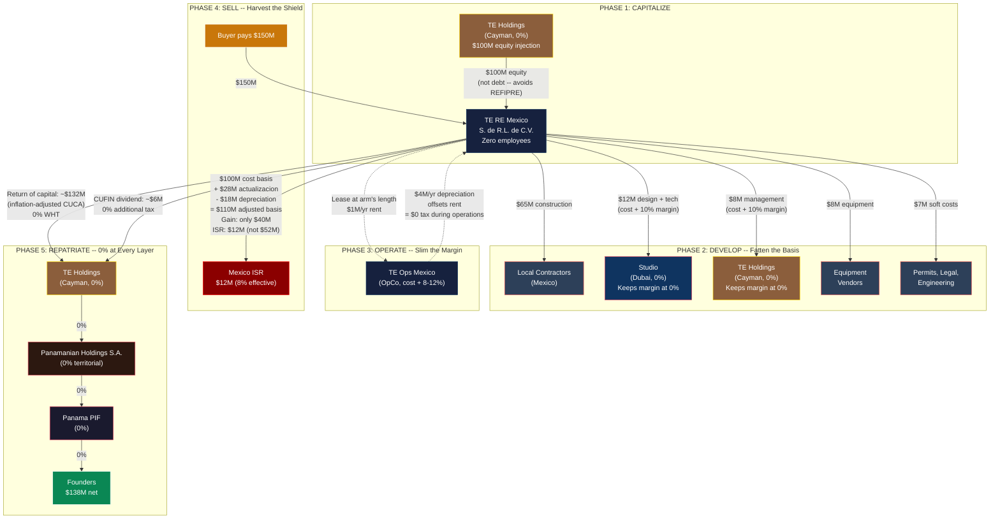

# TRANSFORMATIONAL EPICENTER

---

## Real Estate Development Tax Strategy

**Fatten the Basis, Slim the Operations -- The $100M Shield**

**Date:** February 2026
**Classification:** STRICTLY CONFIDENTIAL - Founders Only
**Version:** 0.1 DRAFT - For Strategic Discussion
**Prepared by:** AI-Assisted Strategy Analysis

---

> **DISCLAIMER**: This document is an AI-assisted strategic analysis exploring legal real estate development tax optimization within the TE Wellness / Light Brands structure. Every strategy described herein must be validated and implemented by qualified Mexican tax counsel, international structuring attorneys, and licensed professionals in each relevant jurisdiction. Nothing in this document constitutes legal or tax advice. Implementation without professional guidance could result in severe penalties or structural failure.

---

## TLDR

Real estate development is the **opposite tax game** from operations. For healing center operations, we slim Mexico down (cost + 8-12% margin, ~1.2% effective rate). For real estate, we **fatten Mexico up** -- every dollar of development cost on the Mexican RE entity's books becomes a dollar of cost basis that shields the eventual capital gain on sale.

**The numbers on a $150M sale with $100M in development costs:**

| | Without Strategy | With Strategy | Savings |
|---|---|---|---|
| Cost basis in Mexico | ~$20M | ~$110M (costs + inflation adjustment) | +$90M basis |
| Taxable gain | ~$130M | ~$40M | -$90M gain |
| Mexico ISR (30%) | ~$39M | ~$12M | **$27M saved** |
| PTU (10% employee profit sharing) | ~$13M | $0 (zero employees) | **$13M saved** |
| **Total Mexico tax** | **$52M** | **$12M** | **$40M saved** |
| **Net to TE Holdings (Cayman, 0%)** | **$98M** | **$138M** | **+$40M** |

**How it works:** TE Holdings (Cayman) capitalizes $100M into the Mexican RE entity as equity. The RE entity pays for everything -- local construction, Studio (Dubai) design services, Holdings project management -- so all costs land on its Mexican books. Studio and Holdings earn their cost-plus margins at 0% tax. Mexico's actualizacion (inflation adjustment) adds ~$28M to the basis for free over 7 years. Zero employees eliminates the 10% PTU. After Mexico's 30% on the slim gain, proceeds return to TE Holdings as return of capital (0% WHT) and CUFIN dividends (0% additional tax), then flow through the PIF to founders at 0%.



**The key insight:** For operations, slim Mexico. For real estate, fatten Mexico. They are opposite tax games played through the same structure. The $100M in development costs is not a liability -- it is the single largest tax shield in the entire TE architecture.

---

## Table of Contents

1. [The Core Insight: Real Estate Inverts the OpCo Logic](#1-the-core-insight)
2. [The Two-Game Strategy: Operations vs. Disposition](#2-the-two-game-strategy)
3. [Entity Architecture for Real Estate](#3-entity-architecture)
4. [Cost Basis Maximization: The $100M Shield](#4-cost-basis-maximization)
5. [Intercompany Development Services: Both Sides Win](#5-intercompany-development-services)
6. [Actualizacion: The Free Tax Shield](#6-actualizacion)
7. [Depreciation: The Double-Edged Sword](#7-depreciation)
8. [Operations Phase: Slim the Mexican Entities](#8-operations-phase)
9. [Disposition Phase: Harvest the Basis Shield](#9-disposition-phase)
10. [Repatriation: Getting the Money Out of Mexico](#10-repatriation)
11. [The Complete Lifecycle Model](#11-the-complete-lifecycle-model)
12. [PTU Elimination: Why Zero Employees Matters](#12-ptu-elimination)
13. [REFIPRE Routing for Real Estate Flows](#13-refipre-routing)
14. [Disposition Options: Asset Sale vs. Share Sale vs. Fideicomiso Transfer](#14-disposition-options)
15. [Risk Analysis and SAT Audit Exposure](#15-risk-analysis)
16. [Worked Example: $100M Development, $150M Sale](#16-worked-example)
17. [Comparison: With vs. Without the Strategy](#17-comparison)
18. [Implementation Roadmap](#18-implementation-roadmap)
19. [Open Questions for Counsel](#19-open-questions)

---

## 1. The Core Insight: Real Estate Inverts the OpCo Logic {#1-the-core-insight}

The TE structure is built on a simple principle for operations: **keep Mexico thin.** Guest revenue flows to TE Holdings (Cayman) at 0%. Mexico OpCo receives only a cost-plus service fee. Mexico taxes a thin margin, not the full $35M revenue stream.

Real estate development and sale is the **exact opposite game.**

When you sell property in Mexico, the sale is a Mexican-source transaction. The property is physically in Mexico. The fideicomiso is Mexican. The buyer pays the Mexican entity. There is no Stripe-to-Cayman bypass. Mexico will tax the gain at the entity that holds the property -- period.

**The question is not "how do we avoid Mexican tax on real estate?" -- it is "how do we minimize the taxable gain?"**

The answer: **maximize every legitimate development cost on the Mexican entity's books.** Every dollar of cost basis reduces the taxable gain by one dollar, saving 30 centavos in ISR.

This is the inverse of the OpCo strategy:

| Strategy | OpCo (Operations) | RE Entity (Development + Sale) |
|---|---|---|
| **Goal** | Minimize Mexican revenue | Maximize Mexican cost basis |
| **Mexico sees** | Thin margin (cost + 8-12%) | All development costs ($100M+) |
| **Profit sits in** | TE Holdings (Cayman, 0%) | TE Holdings (Cayman, 0%) -- but after Mexico taxes the gain |
| **Slim entity =** | Less Mexican tax | **MORE** Mexican tax |
| **Fat entity =** | More Mexican tax | **LESS** Mexican tax |

**Rule: For operations, slim Mexico. For real estate sale, fatten Mexico.**

---

## 2. The Two-Game Strategy {#2-the-two-game-strategy}

The TE real estate lifecycle has two distinct phases, each requiring a different tax strategy:

### Game 1: Operations (Recurring Revenue)

While the property is being operated as a healing center, the OpCo model applies:

- Guests pay TE Holdings (Cayman) directly
- OpCo receives cost + 8-12% margin
- RE entity receives arm's length rent from OpCo (offset by depreciation)
- Mexico taxes thin margins only
- **Effective Mexico tax rate: ~1.2% of total revenue**

### Game 2: Disposition (One-Time Sale)

When developed real estate is eventually sold:

- Sale proceeds are Mexican-source, taxed in Mexico
- 30% ISR on the gain (sale price minus adjusted cost basis)
- Cost basis = land + all development costs + soft costs + actualizacion - depreciation
- After-tax proceeds flow to TE Holdings at 0%
- **Effective Mexico tax rate: ~10-15% of gross sale, depending on gain**

### Why Both Games Matter

At $100M in development costs and a potential $150M+ sale, the disposition tax could be $15M+ or $40M+ depending on how the cost basis is structured. **The difference between a well-structured and poorly-structured real estate disposition is $20-25M in tax savings.**

---

## 3. Entity Architecture for Real Estate {#3-entity-architecture}

```
TE Holdings (Cayman, 0%)
  │
  ├── TE Ops Mexico S. de R.L. de C.V. (Operations)
  │     └── Operates healing center
  │     └── Employs staff
  │     └── Leases property from RE entity
  │     └── Cost + 8-12% margin to Holdings
  │
  └── TE RE Mexico S. de R.L. de C.V. (Real Estate)
        └── Holds land and developed property
        └── Zero employees (administrator appointed by Holdings)
        └── Leases to OpCo at arm's length rent
        └── Depreciation offsets rental income
        └── On sale: maximum cost basis shields gain
```

### Why Two Mexican Entities

| Reason | Detail |
|---|---|
| **Risk isolation** | Guest liability, employment claims, and program risk stay in OpCo. Land and buildings in the RE entity are unreachable by OpCo creditors. |
| **Tax optimization** | RE entity claims depreciation on buildings (5%/yr). OpCo deducts rent. Different tax profiles require different strategies. |
| **Exit flexibility** | Can sell RE entity (assets) without disrupting operations. Can sell OpCo (brand, team) without selling the land. |
| **PTU elimination** | RE entity has zero employees -- no 10% profit sharing on capital gains. OpCo's PTU applies only to its thin margin. |

---

## 4. Cost Basis Maximization: The $100M Shield {#4-cost-basis-maximization}

**Principle: Every dollar on the RE entity's books is 30 cents saved on the eventual sale.**

### What Mexico Lets You Capitalize

**Hard construction costs**
- Labor, materials, concrete, steel, wood
- MEP systems (mechanical, electrical, plumbing)
- Site preparation, grading, earthwork
- Roads, pathways, parking areas
- Water systems, drainage, sewage treatment
- Electrical infrastructure, transformers, generators
- Landscaping, pools, outdoor structures
- Security systems, fencing, gates

**Soft costs (frequently overlooked, fully capitalizable)**
- Architectural and engineering fees (including fees paid to Studio in Dubai)
- Legal fees for development (permits, contracts, environmental)
- Permit and licensing costs (SEMARNAT, COFEPRIS, municipal)
- Environmental impact assessments (MIA)
- Insurance during construction period
- Project management fees (including fees paid to TE Holdings)
- Surveying, geotechnical studies, soil testing
- Security services during construction
- Temporary utilities and site facilities

**Imported equipment and technology**
- Medical equipment procured through TE Holdings
- Bio-optimization equipment
- Technology systems (servers, networking, smart building)
- FF&E (furniture, fixtures, equipment)
- All import duties and logistics costs

**Capitalized interest**
- Interest on construction financing during the development period
- Capitalizable under LISR until the asset is placed in service
- Note: If funded by equity (recommended), this line item is zero

**Pre-operating expenses**
- Amortized at 10% annual straight-line (LISR Art. 33)
- Staff training, marketing, trial operations
- Adds to the deductible base during operations

### The Full $100M Basis Example

| Category | Amount | % of Total |
|---|---|---|
| Land acquisition | $10,000,000 | 10% |
| Hard construction (healing center, villas, infrastructure) | $65,000,000 | 65% |
| Soft costs (design, permits, legal, engineering) | $12,000,000 | 12% |
| Equipment and technology | $8,000,000 | 8% |
| Pre-operating expenses | $3,000,000 | 3% |
| Contingency / other capitalizable costs | $2,000,000 | 2% |
| **Total cost basis** | **$100,000,000** | **100%** |

Every dollar above is on the RE entity's Mexican books. Every dollar reduces the eventual capital gain by one dollar. At 30% ISR, **$100M in basis saves up to $30M in tax** compared to having zero basis.

---

## 5. Intercompany Development Services: Both Sides Win {#5-intercompany-development-services}

During development, Studio (Dubai) and TE Holdings (Cayman) provide genuine services to the RE entity. The structure ensures **costs land in Mexico (increasing basis)** while **margins stay offshore (at 0% tax).**

### How the Money Flows

```
TE RE Mexico needs architectural design for the healing center.

Step 1: RE entity contracts with Studio (Dubai) for design services.
Step 2: Studio performs the work (Dubai team, 0% QFZP).
Step 3: Studio invoices RE entity at cost + 10% margin.
        - Studio's cost: $5M (salaries, tools, overhead)
        - Studio's margin: $500K (taxed at 0% in Dubai)
        - Invoice to RE entity: $5.5M
Step 4: RE entity pays $5.5M. This is capitalized as a development cost.
Step 5: RE entity's cost basis increases by $5.5M.

Result:
- Studio earns $500K at 0% tax
- RE entity has $5.5M more in cost basis
- On eventual sale, this $5.5M reduces the taxable gain
- Tax saved on sale: $5.5M x 30% = $1.65M
```

### Service Matrix

| Service | Provider | Fee Structure | On RE Entity's Books | Margin at 0% |
|---|---|---|---|---|
| Architectural design | Studio (Dubai) | Cost + 8-12% | Full invoice amount | Studio's margin |
| Technology systems | Studio (Dubai) | Cost + 8-12% | Full invoice amount | Studio's margin |
| Interior design | Studio (Dubai) | Cost + 8-12% | Full invoice amount | Studio's margin |
| AI integration | Studio (Dubai) | Cost + 8-12% | Full invoice amount | Studio's margin |
| Development management | TE Holdings (Cayman) | Cost + 8-12% | Full invoice amount | Holdings' margin |
| Equipment procurement | TE Holdings (Cayman) | Cost + markup | Full invoice amount | Holdings' margin |
| Quality oversight | TE Holdings (Cayman) | Cost + 8-12% | Full invoice amount | Holdings' margin |
| Construction | Local Mexican contractors | Market rate | Full cost | N/A (third party) |

### Transfer Pricing Requirements

- Annual benchmarking studies for all intercompany service fees
- Detailed SOWs per development phase
- Time records and resource allocation from Studio and Holdings
- Comparable data from international design, project management, and technology firms
- Filed with SAT as part of the Informativa de Operaciones con Partes Relacionadas
- **All services must be genuine** -- SAT will audit sham service arrangements aggressively

---

## 6. Actualizacion: The Free Tax Shield {#6-actualizacion}

Mexico's actualizacion provision is one of the most powerful and underutilized tools in Mexican real estate tax planning. It allows the taxpayer to adjust the cost basis for inflation using the INPC (Indice Nacional de Precios al Consumidor), effectively increasing the basis over time without spending an additional dollar.

### How It Works

The cost basis of each asset is multiplied by a factor:

```
Factor = INPC (month of sale) / INPC (month of acquisition or improvement)
```

Each component of the cost basis (land, construction, equipment) is adjusted individually based on when the cost was incurred.

### Projected Shield at ~4% Annual INPC Inflation

| Holding Period | Factor | Original $100M Basis | Adjusted Basis | Free Shield |
|---|---|---|---|---|
| 3 years | ~1.125 | $100M | ~$112.5M | ~$12.5M |
| 5 years | ~1.217 | $100M | ~$121.7M | ~$21.7M |
| 7 years | ~1.316 | $100M | ~$131.6M | ~$31.6M |
| 10 years | ~1.480 | $100M | ~$148.0M | ~$48.0M |

### Tax Impact

| Holding Period | Additional Basis from Actualizacion | ISR Saved (30%) |
|---|---|---|
| 5 years | ~$21.7M | ~$6.5M |
| 7 years | ~$31.6M | ~$9.5M |
| 10 years | ~$48.0M | ~$14.4M |

**$14.4M in tax savings from holding for 10 years -- with zero additional investment.** This is money that is never spent, never at risk, and entirely a function of Mexican inflation law.

### Strategic Implication

Actualizacion rewards patience. The longer you hold Mexican real estate, the larger the inflation-adjusted basis becomes. Combined with the appreciation of the underlying property, this creates a favorable dynamic: the property becomes more valuable while the taxable gain grows more slowly than the gross appreciation.

---

## 7. Depreciation: The Double-Edged Sword {#7-depreciation}

Building depreciation at 5% per year provides annual tax deductions during operations but reduces the cost basis on sale. Understanding this trade-off is essential.

### During Operations (Before Sale)

| Asset | Rate | Annual Deduction on $80M Buildings | Tax Saved (30%) |
|---|---|---|---|
| Commercial buildings | 5% | $4,000,000 | $1,200,000/yr |
| FF&E | 10% | Varies | Varies |
| Technology | 30% | Varies | Varies |

Over 5 years of operations: **~$6M in tax savings** from building depreciation alone.

### On Sale (Basis Reduction)

The same $20M in cumulative depreciation (5 years x $4M/yr) reduces the cost basis by $20M, increasing the taxable gain by $20M, costing ~$6M in additional ISR on sale.

### Net Effect: It Roughly Washes

| Period | Depreciation Benefit | Basis Reduction Cost | Net |
|---|---|---|---|
| Years 1-5 (operations) | +$6M tax savings | — | +$6M |
| Year 5 (sale) | — | -$6M additional ISR | -$6M |
| **Net** | | | **~$0** |

**But there are two important advantages:**

1. **Time value of money:** The $6M in operating tax savings comes over 5 years. The $6M additional ISR on sale is paid in Year 5. The present value favors early savings.

2. **Actualizacion offsets depreciation:** The inflation adjustment increases the basis, partially or fully offsetting the depreciation reduction. After ~13-14 years, the actualizacion overtakes cumulative depreciation entirely.

### The Optimal Hold Period

```
Years 1-13:  Depreciation > Actualizacion (net basis declining)
Year ~14:    Crossover point (actualizacion catches up)
Years 15+:  Actualizacion > Depreciation (net basis INCREASING)
```

**If the property is held for 15+ years, the inflation-adjusted basis exceeds the original cost even after full depreciation.** This is a unique advantage of Mexican real estate holding.

---

## 8. Operations Phase: Slim the Mexican Entities {#8-operations-phase}

During operations (after construction, before sale), the standard OpCo model applies. Both Mexican entities stay slim.

### RE Entity During Operations

| Income | Amount | Tax Treatment |
|---|---|---|
| Rental income from OpCo | $500K-1.5M/yr (arm's length) | Taxable at 30% |
| Less: Building depreciation | ($4M/yr on $80M) | Deductible |
| Less: Property tax (predial) | ($50K-200K/yr) | Deductible |
| Less: Insurance | ($50K-100K/yr) | Deductible |
| **Net taxable income** | **Negative or near-zero** | **~$0 tax during operations** |

The depreciation deduction ($4M/yr) vastly exceeds the rental income ($500K-1.5M/yr). **The RE entity pays effectively zero Mexican tax during operations** while the depreciation runs.

### OpCo During Operations

Unchanged from current structure:
- Receives cost + 8-12% from TE Holdings
- Pays rent to RE entity (deductible)
- Rent becomes part of OpCo's cost base, passed to Holdings in cost-plus calculation
- Mexico taxes only the thin margin

---

## 9. Disposition Phase: Harvest the Basis Shield {#9-disposition-phase}

When the time comes to sell, the accumulated cost basis and actualizacion do their work.

### Pre-Sale Checklist

1. **Calculate adjusted cost basis:** Original costs + actualizacion - cumulative depreciation
2. **Verify CUFIN balance:** Ensure adequate CUFIN for tax-efficient dividend extraction
3. **Confirm zero employees:** PTU elimination depends on this
4. **Engage Mexican tax counsel:** Disposition planning, provisional withholding calculation
5. **Determine sale structure:** Asset sale vs. share sale vs. fideicomiso transfer
6. **Notify TE Holdings:** Repatriation planning (return of capital vs. dividends)

### Post-Sale Tax Flow

```
Gross sale proceeds                          $150,000,000
Less: Adjusted cost basis                   ($100,750,000)  [original - depreciation + actualizacion]
                                            ─────────────
Taxable gain                                  $49,250,000
ISR at 30%                                   ($14,775,000)
PTU (zero employees)                                   $0
                                            ─────────────
Net proceeds in RE entity                    $135,225,000

Return of capital to TE Holdings (Cayman)   ($100,000,000)  [0% WHT - not a dividend]
Dividend from CUFIN to TE Holdings            ($35,225,000)  [0% additional tax if from CUFIN]
                                            ─────────────
Total received by TE Holdings                $135,225,000    [at 0% Cayman tax]

Holdings → S.A. → PIF → Founders                     0%
```

---

## 10. Repatriation: Getting the Money Out of Mexico {#10-repatriation}

### Return of Capital vs. Dividends

This distinction is critical for tax-efficient repatriation:

| Type | What It Is | Mexico WHT | Documentation Required |
|---|---|---|---|
| **Return of capital (CUCA)** | Repayment of the original equity contribution from TE Holdings | **0%** -- not a dividend, not taxable | CUCA (Cuenta de Capital de Aportacion) balance documentation; records of every equity injection |
| **Dividend from CUFIN** | Distribution of after-tax profits | **0% additional tax** -- already taxed at 30% corporate level | CUFIN balance documentation |
| **Dividend from non-CUFIN** | Distribution exceeding the CUFIN balance | **10% additional tax** (pilon) on gross-up amount | CUFIN deficit calculation |

### Optimal Extraction Sequence

1. **First:** Return of capital (CUCA) -- up to the full $100M equity contribution. Zero additional tax.
2. **Second:** Dividends from CUFIN -- after-tax profits. Zero additional tax.
3. **Last resort only:** Dividends from non-CUFIN -- triggers 10% pilon.

### CUCA Management

The Cuenta de Capital de Aportacion (CUCA) tracks the cumulative equity contributions to the Mexican entity. Like the cost basis, the CUCA is also subject to **actualizacion** (inflation adjustment).

| Year | Equity Contributed | Cumulative CUCA | Actualizacion-Adjusted CUCA |
|---|---|---|---|
| Year 1 | $50M | $50M | $50M |
| Year 2 | $50M | $100M | ~$102M |
| Year 5 | — | $100M | ~$121.7M |
| Year 7 | — | $100M | ~$131.6M |

**At Year 7, you can repatriate ~$131.6M as "return of capital" -- $31.6M more than you actually contributed -- at 0% tax.** The inflation adjustment on the CUCA is a powerful, legal mechanism for extracting additional value from Mexico tax-free.

---

## 11. The Complete Lifecycle Model {#11-the-complete-lifecycle-model}

### Phase 1: Capitalization (Year 0)

```
TE Holdings (Cayman)  ──── $100M equity contribution ────→  TE RE Mexico
                                                              │
                                                              └── CUCA: $100M
                                                              └── Tax: $0
```

### Phase 2: Development (Years 0-3)

```
TE RE Mexico pays:
  ├── Local contractors:  $65M (construction)        → Capitalized
  ├── Studio (Dubai):     $12M (design + tech)       → Capitalized (margin at 0% in Dubai)
  ├── TE Holdings:         $8M (management + procurement) → Capitalized (margin at 0% in Cayman)
  ├── Equipment:           $8M (medical, bio-opt, tech)   → Capitalized
  ├── Permits, legal:      $4M (soft costs)          → Capitalized
  └── Pre-operating:       $3M                       → 10% amortization

Total cost basis: $100M
Tax during construction: $0 (no income yet)
```

### Phase 3: Operations (Years 3-7+)

```
TE RE Mexico:
  ├── Rental income from OpCo:    $1M/yr
  ├── Building depreciation:     ($4M/yr)
  ├── Net taxable income:        ($3M/yr) → Negative = $0 tax
  └── Cumulative depreciation:    $16M (4 years)

TE Ops Mexico:
  ├── Healing center revenue:     Flows to TE Holdings (Cayman) at 0%
  ├── Cost + 8-12% from Holdings: Thin margin
  ├── Rent paid to RE entity:     Deductible
  └── Mexico taxes margin only:   ~1.2% effective

Cost basis evolution:
  Original:        $100M
  - Depreciation:  ($16M)
  + Actualizacion: +$18M (4 years at ~4%)
  Adjusted basis:  ~$102M
```

### Phase 4: Disposition (Year 7)

```
Sale price:                    $150M
Adjusted cost basis:           ~$102M (after 4 years operations)
Taxable gain:                  ~$48M
ISR at 30%:                    ~$14.4M
PTU (zero employees):          $0

Net proceeds:                  ~$135.6M

Repatriation:
  Return of capital (CUCA):    ~$131.6M (inflation-adjusted)  → 0% WHT
  Dividend from CUFIN:         ~$4M                           → 0% additional tax
  Total to TE Holdings:        ~$135.6M at 0% Cayman tax
```

---

## 12. PTU Elimination: Why Zero Employees Matters {#12-ptu-elimination}

Mexico's Participacion de los Trabajadores en las Utilidades (PTU) requires employers to distribute **10% of taxable profits** to employees. On a $48M capital gain, PTU would be $4.8M.

The RE entity is designed with **zero employees.** The administrator is appointed by TE Holdings, not employed by the RE entity. Property management (maintenance, security, groundskeeping) stays in TE Ops Mexico.

| Design Choice | PTU Impact |
|---|---|
| RE entity has employees | 10% of profits to employees (~$4.8M on $48M gain) |
| **RE entity has zero employees** | **$0 PTU** |

**This design decision saves $4.8M on a $48M capital gain.** It is one of the most important structural features of the two-entity (RE + OpCo) architecture.

### Counsel Confirmation Required

Mexican labor law interpretations vary on whether a Mexican entity with an appointed administrator (not employee) is truly exempt from PTU. Some interpretations hold that the administrator must receive PTU. This must be confirmed with Mexican labor/tax counsel before relying on this position.

---

## 13. REFIPRE Routing for Real Estate Flows {#13-refipre-routing}

The same REFIPRE rules that apply to operations also apply to real estate. The RE entity must never pay CI IBC (Cook Islands) directly.

```
SAFE:
  TE RE Mexico → TE Holdings (Cayman) → Studio (Dubai) → CI IBC (Cook Islands)
  [parent-sub]     [existing contract]    [existing subcontract]

FORBIDDEN:
  TE RE Mexico → CI IBC (Cook Islands)
  [40% WHT + non-deductible]
```

**For real estate, this is mostly a non-issue** because the RE entity's primary flows are:
- Equity contributions FROM Holdings (inbound -- no WHT concern)
- Rent FROM OpCo (intra-Mexico -- no WHT concern)
- Dividends TO Holdings (outbound -- 0% from CUFIN)
- Return of capital TO Holdings (outbound -- not a dividend)

The RE entity has no reason to pay CI IBC directly. The REFIPRE risk is minimal but should be documented in compliance procedures.

---

## 14. Disposition Options {#14-disposition-options}

### Option A: Asset Sale (RE entity sells the property)

| Element | Detail |
|---|---|
| **Mechanism** | RE entity sells the developed property to the buyer |
| **Mexico ISR** | 30% on gain (sale price minus adjusted basis) |
| **IVA** | 16% on commercial property sales (buyer bears; may affect price negotiation) |
| **Notary withholding** | ~20% provisional ISR at closing, credited against final |
| **ISAI** | 2-4% acquisition tax paid by buyer |
| **Pros** | Standard, defensible, clean. Buyer gets a step-up in basis. |
| **Cons** | Full capital gains tax in Mexico. IVA on commercial property. |

### Option B: Share Sale (TE Holdings sells the RE entity)

| Element | Detail |
|---|---|
| **Mechanism** | TE Holdings (Cayman) sells its shares in TE RE Mexico to the buyer |
| **Mexico ISR** | Mexico asserts taxing rights on "indirect transfers" of Mexican RE under LISR Art. 161 |
| **Enforcement** | Buyer may be required to withhold; Mexico increasingly aggressive on indirect transfers |
| **Cayman tax** | 0% (no capital gains tax) |
| **Pros** | Transaction at Cayman level; potentially lower tax if indirect transfer rules don't apply or are navigable |
| **Cons** | Mexico's anti-avoidance rules are expanding; buyer may refuse structure; legal complexity |

### Option C: Fideicomiso Beneficial Interest Transfer

| Element | Detail |
|---|---|
| **Mechanism** | Transfer the fideicomiso beneficial interest to the buyer |
| **Mexico tax** | ISAI (2-4% acquisition tax) on buyer. ISR on gain for the transferring beneficiary. |
| **Pros** | Avoids full property transfer mechanics; potentially simpler |
| **Cons** | Only works if fideicomiso is in place; gain still taxed |

### Recommendation

**Option A (asset sale) is the default** -- standard, defensible, and understood by all parties. The cost basis maximization strategy described in this document is designed for Option A.

**Option B (share sale) should be explored with counsel** as a potential tax reduction path, but do not rely on it. Mexico's indirect transfer rules are a moving target and enforcement is increasing.

---

## 15. Risk Analysis and SAT Audit Exposure {#15-risk-analysis}

### What SAT Will Scrutinize

| Area | Risk Level | SAT Concern | Defense |
|---|---|---|---|
| **Intercompany service fees during development** | Medium | Inflated fees to shift profits offshore | Arm's length pricing supported by TP studies; genuine services documented with SOWs, time records, deliverables |
| **Transfer pricing on intercompany lease** | Medium | Below-market rent to reduce RE entity income | Annual CUP benchmarking against Tulum commercial rental market |
| **Zero employees (PTU avoidance)** | Medium-High | Substance challenge -- is this a real operating entity? | RE entity is a holding/development entity by design; administrator appointed by Holdings; property management in OpCo is operationally logical |
| **CUCA (return of capital) claims** | Low-Medium | Inflated capital contributions | Meticulous documentation of every equity injection; bank records, board resolutions |
| **Actualizacion calculation** | Low | Math errors or wrong INPC values | Use published SAT INPC tables; engage Mexican CPA for calculations |
| **Indirect transfer (share sale)** | High | Mexico wants to tax the gain | Only attempt with full counsel support; consider asset sale as safer default |

### Mitigation Strategy

1. **Document everything** -- TP studies, SOWs, time records, board resolutions, equity injection records
2. **Use independent Mexican CPA** as comisario (statutory auditor) for the RE entity
3. **File all informativa returns** on time -- related-party transactions, electronic bookkeeping
4. **Annual TP study updates** -- don't let benchmarking become stale
5. **Engage SAT-experienced counsel** for any dispute resolution

---

## 16. Worked Example: $100M Development, $150M Sale {#16-worked-example}

### Assumptions

- Land acquisition: $10M (Year 0)
- Development costs: $90M (Years 0-3)
- Operations: Years 3-7
- Sale: Year 7
- Sale price: $150M
- Building depreciation: 5%/yr on $80M improvements
- INPC inflation: 4%/yr average
- RE entity: zero employees

### Development Phase (Years 0-3)

| Year | Capital Invested | Cumulative Basis | Tax |
|---|---|---|---|
| 0 | $40M (land + Phase 1) | $40M | $0 |
| 1 | $35M (Phase 2) | $75M | $0 |
| 2 | $20M (Phase 3) | $95M | $0 |
| 3 | $5M (finishing) | $100M | $0 |

### Operations Phase (Years 3-7)

| Year | Rental Income | Depreciation | Taxable Income | ISR | Cumulative Dep. |
|---|---|---|---|---|---|
| 3 | $500K | ($4M) | ($3.5M) | $0 | $4M |
| 4 | $800K | ($4M) | ($3.2M) | $0 | $8M |
| 5 | $1.0M | ($4M) | ($3.0M) | $0 | $12M |
| 6 | $1.2M | ($4M) | ($2.8M) | $0 | $16M |
| 7 (pre-sale) | $600K | ($2M) | ($1.4M) | $0 | $18M |

**Total Mexico ISR during operations: $0** (depreciation exceeds rental income every year)

### Disposition (Year 7)

| Line Item | Amount |
|---|---|
| **Sale price** | $150,000,000 |
| Original cost basis | $100,000,000 |
| Cumulative depreciation | ($18,000,000) |
| Actualizacion (weighted avg ~4%/yr, 4-7 years) | +$28,000,000 |
| **Adjusted cost basis** | **$110,000,000** |
| **Taxable gain** | **$40,000,000** |
| ISR at 30% | ($12,000,000) |
| PTU (zero employees) | $0 |
| **Net proceeds** | **$138,000,000** |

### Repatriation

| Flow | Amount | Tax |
|---|---|---|
| Return of capital (CUCA, inflation-adjusted) | ~$131,600,000 | 0% |
| Dividend from CUFIN | ~$6,400,000 | 0% additional |
| **Total to TE Holdings (Cayman)** | **$138,000,000** | **0%** |
| TE Holdings → S.A. → PIF → Founders | $138,000,000 | 0% at every layer |

### Summary

| Metric | Amount |
|---|---|
| Total development investment | $100,000,000 |
| Sale price | $150,000,000 |
| Gross profit | $50,000,000 |
| **Total Mexico tax paid** | **$12,000,000** |
| **Effective rate on gross sale** | **8.0%** |
| **Effective rate on profit** | **24.0%** |
| **Net to founders (via PIF)** | **$138,000,000** |

---

## 17. Comparison: With vs. Without the Strategy {#17-comparison}

### Scenario A: Full Cost Basis Maximization (This Strategy)

| Item | Amount |
|---|---|
| Sale price | $150M |
| Adjusted basis (costs + actualizacion - depreciation) | $110M |
| Taxable gain | $40M |
| ISR (30%) | $12M |
| PTU (zero employees) | $0 |
| **Total Mexico tax** | **$12M** |
| **Effective rate on gross sale** | **8.0%** |

### Scenario B: Costs Routed Offshore ("Slim" Mexico -- WRONG Approach)

If $80M of development costs were routed through offshore entities (to earn at 0%) and only $20M hit the Mexican books:

| Item | Amount |
|---|---|
| Sale price | $150M |
| Adjusted basis ($20M + actualizacion - depreciation) | ~$20M |
| Taxable gain | ~$130M |
| ISR (30%) | ~$39M |
| PTU (if employees exist, 10%) | ~$13M |
| **Total Mexico tax** | **$39-52M** |
| **Effective rate on gross sale** | **26-35%** |

### The Difference

| Metric | Strategy A (Fatten) | Strategy B (Slim) | Savings |
|---|---|---|---|
| Mexico tax | $12M | $39-52M | **$27-40M** |
| Effective rate | 8.0% | 26-35% | -18 to -27 points |
| Net to Holdings | $138M | $98-111M | **+$27-40M** |

**The cost basis maximization strategy saves $27-40M in Mexican tax on a single $150M disposition.**

---

## 18. Implementation Roadmap {#18-implementation-roadmap}

### Phase 1: Entity and Documentation (Months 1-3)

| Step | Detail | Owner |
|---|---|---|
| Form TE RE Mexico S. de R.L. de C.V. | Notary, RFC, bank account | Mexican counsel |
| Resolve restricted zone classification | Commercial vs. residential (fideicomiso requirement) | Mexican counsel |
| Execute equity contribution from TE Holdings | Document capital injection meticulously | Finance team |
| Establish Development Management Agreement | TE Holdings <--> RE entity | Legal |
| Establish Design Services Agreement | Studio <--> RE entity | Legal |
| Commission initial TP study | Benchmark all intercompany development fees | TP advisor |
| Set up CUCA tracking | Record every equity injection with bank confirmations | Mexican CPA |

### Phase 2: Development (Years 0-3)

| Step | Detail | Owner |
|---|---|---|
| Capitalize ALL development costs on RE entity books | Hard costs, soft costs, equipment, pre-operating | Finance team |
| Monthly intercompany invoicing | Studio and Holdings invoice RE entity for services | Finance team |
| Maintain TP documentation | SOWs, time records, deliverables for all intercompany services | CTO / Finance |
| Annual TP study update | Benchmark cost-plus margins | TP advisor |
| File monthly provisional payments | Even if $0 (no income during construction) | Mexican CPA |

### Phase 3: Operations (Years 3+)

| Step | Detail | Owner |
|---|---|---|
| Execute intercompany lease | RE entity leases to OpCo at arm's length | Legal |
| Monitor depreciation vs. rental income | Confirm RE entity stays at ~$0 taxable income | Mexican CPA |
| Maintain CUFIN tracking | Track after-tax profits for future dividend eligibility | Mexican CPA |
| Update actualizacion calculations annually | Use published INPC tables | Mexican CPA |
| Annual TP study for intercompany lease | CUP method, Tulum commercial comparables | TP advisor |

### Phase 4: Pre-Disposition Planning (6-12 Months Before Sale)

| Step | Detail | Owner |
|---|---|---|
| Calculate adjusted cost basis | Original costs - depreciation + actualizacion | Mexican CPA |
| Calculate CUCA balance (inflation-adjusted) | For return-of-capital repatriation | Mexican CPA |
| Verify CUFIN balance | For tax-efficient dividend extraction | Mexican CPA |
| Evaluate asset sale vs. share sale with counsel | Tax modeling for both options | Mexican + Cayman counsel |
| Plan repatriation sequence | Return of capital first, then CUFIN dividends | Finance team |
| Engage Mexican tax counsel for disposition | Provisional withholding, ISR calculation, IVA analysis | Mexican counsel |

---

## 19. Open Questions for Counsel {#19-open-questions}

### Mexican Tax Counsel

1. **PTU on zero-employee entity:** Is a Mexican S. de R.L. de C.V. with an appointed administrator (not employee) and zero employees truly exempt from PTU on capital gains from real estate sale? What is the risk of SAT challenge?

2. **IVA on property sale:** Does 16% IVA apply to the sale of developed commercial property (healing center + villas)? Does the classification of villas as commercial hospitality (not residential) eliminate IVA on residential portions?

3. **Indirect transfer rules (LISR Art. 161):** If TE Holdings (Cayman) sells its shares in TE RE Mexico instead of the RE entity selling the property, what is Mexico's enforcement position? What is the practical risk?

4. **CUCA inflation adjustment:** Confirm that the CUCA balance is adjusted by actualizacion using INPC, and that the inflation-adjusted balance can be returned as capital (not dividend) at 0% WHT.

5. **Intercompany development services:** Will SAT accept cost + 8-12% margins for design, technology, and management services from related entities in Dubai and Cayman during the development phase? What TP documentation is required?

6. **Capitalized interest during construction:** If any portion of the development is funded by intercompany debt (despite equity being the preferred approach), can interest during the construction period be capitalized into the cost basis? Does REFIPRE apply to capitalized (not paid) interest?

7. **Depreciation recapture:** On sale, does Mexico add back cumulative depreciation to the gain calculation (depreciation recapture), or is the adjusted basis simply the original cost minus depreciation plus actualizacion?

### Cayman Counsel

8. **Capital return from Mexican subsidiary:** Confirm that TE Holdings (Cayman) receiving return of capital from TE RE Mexico has zero tax implications in Cayman.

9. **Share sale of Mexican subsidiary:** If TE Holdings sells its shares in TE RE Mexico, confirm 0% Cayman tax on the gain and no reporting obligations that could complicate the transaction.

### Cross-Border Structuring

10. **Optimal holding period:** Given the interplay of depreciation, actualizacion, and capital gains rates, what is the mathematically optimal holding period before disposition? Model specific scenarios at Year 5, 7, 10, and 15.

11. **Multiple property strategy:** If the RE entity develops multiple properties over time, should each property be held by a separate Mexican entity (for individual sale flexibility) or all in one entity (for simplicity and shared depreciation pools)?

---

*This document describes a legal real estate development tax optimization strategy within the TE Wellness / Light Brands unified structure. The strategy combines Mexican cost basis maximization, actualizacion (inflation adjustment), building depreciation, PTU elimination through zero-employee design, and CUFIN-based dividend extraction. All mechanisms are explicit provisions of Mexico's Ley del Impuesto Sobre la Renta (LISR) and related tax legislation. Implementation requires validation by qualified Mexican tax counsel, Mexican real estate counsel, and coordination with Cayman counsel for the capitalization and repatriation structure.*
