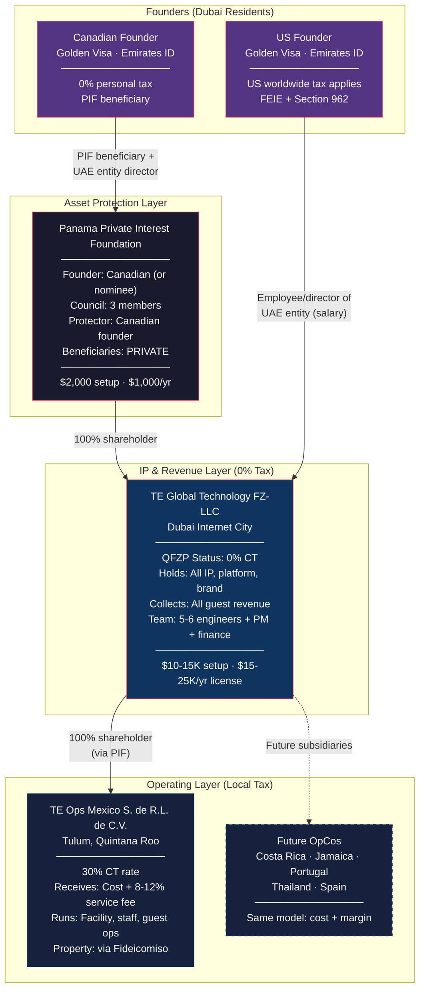
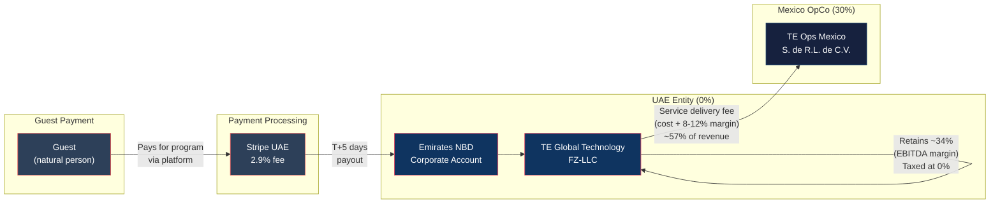
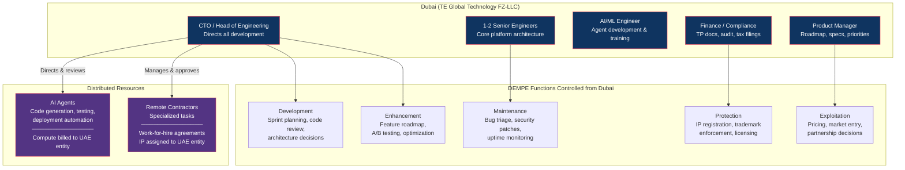
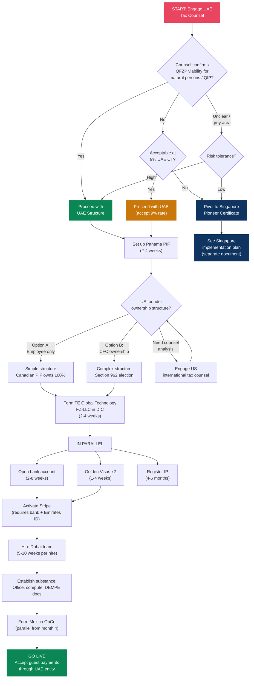

# UAE Implementation Blueprint for TE Global Technology

> **Document Status:** Actionable implementation guide
> **Depends on:** [ZERO_TAX_GLOBAL_TECH_STRUCTURE.md](./ZERO_TAX_GLOBAL_TECH_STRUCTURE.md), [UAE_VS_SINGAPORE_DEEP_DIVE.md](./UAE_VS_SINGAPORE_DEEP_DIVE.md)
> **Last Updated:** February 2026

---

## 1. TL;DR & Executive Summary

**The structure:** A Panama Private Interest Foundation (PIF) owns 100% of **TE Global Technology FZ-LLC**, registered in Dubai Internet City (DIC). The UAE entity holds all IP, collects all guest revenue via Stripe, and pays service fees to local operating companies (starting with **TE Ops Mexico S. de R.L. de C.V.** in Tulum). Two founders relocate to Dubai on Golden Visas.

**Key numbers:**
- **Year 1 setup cost:** ~$16,000-22,000 (entities + visas + IP registration)
- **Year 1 operating cost:** ~$1.2-2.2M (team, office, audit, compliance)
- **Year 1 tax saved vs. all-Mexico structure:** ~$1.5M+
- **Effective group tax rate:** ~1.2% (vs. 30% all-local)
- **Personal tax (Canadian founder):** 0% on everything after departure
- **Personal tax (US founder):** ~10.5-13% on CFC income (Section 962 election)

**The gating question:** UAE QFZP rules exclude "transactions with natural persons" from qualifying income. TE's guests are natural persons. The defense is that revenue derives from **Qualifying Intellectual Property** (copyrighted software platform), not direct service to individuals. This interpretation is untested. **UAE tax counsel must confirm viability before any entity formation spend.**

---

## 2. The Complete Corporate Structure

### 2.1 Full Entity Structure

### 2.2 Money Flow

**Key principle:** Revenue flows **into** the tech entity (Platform-as-Principal model). Service fees flow **down** to OpCos. There are no upward royalty or license payments, eliminating REFIPRE / withholding tax concerns.

### 2.3 DEMPE & IP Control

**AI-first substance model:** The Dubai team of 5-6 people directs AI agents and distributed contractors. All strategic decisions, code review authority, and IP governance sit in Dubai. This is the substance argument — the UAE entity doesn't just *own* the IP, it *controls* and *develops* the IP.

### 2.4 Founder Personal Structure

```mermaid
graph TB
    subgraph "Canadian Founder Path → 0% Tax"
        CA1["Sever Canadian<br/>residential ties"]
        CA2["File departure<br/>tax return"]
        CA3["Obtain UAE<br/>Golden Visa"]
        CA4["Get UAE Tax<br/>Residency Certificate"]
        CA5["Result: 0% on<br/>salary, dividends,<br/>capital gains"]

        CA1 --> CA2 --> CA3 --> CA4 --> CA5
    end

    subgraph "US Founder Path → ~10.5-13% on CFC Income"
        US1["Obtain UAE<br/>Golden Visa"]
        US2["FEIE excludes first<br/>$130K salary"]
        US3["GILTI inclusion on<br/>CFC income"]
        US4["Section 962 election:<br/>taxed at corporate rates"]
        US5["Result: ~10.5-13%<br/>on CFC income +<br/>marginal rate on<br/>salary above $130K"]

        US1 --> US2
        US1 --> US3 --> US4 --> US5
        US2 --> US5
    end

    subgraph "Alternative: US Founder as Employee Only"
        ALT["Canadian PIF owns 100%<br/>US founder = employee/director<br/>No CFC attribution<br/>FEIE covers $130K<br/>Remainder at marginal rate"]
    end

    style CA5 fill:#0a8754,stroke:#fff,color:#fff
    style US5 fill:#c9770a,stroke:#fff,color:#fff
    style ALT fill:#0f3460,stroke:#e94560,color:#fff
```

---

## 3. Phase 1: Foundation Layer (Months 1-2)

### Step 1: Engage UAE Tax Counsel

**This is the gating step. Do not spend money on entity formation until this is resolved.**

| Item | Detail |
|---|---|
| **Question** | Does TE's revenue from individual guests qualify for 0% under QFZP, given the "natural persons" exclusion? |
| **Argument to test** | Revenue derives from Qualifying Intellectual Property (copyrighted AI-powered software platform), not direct transactions with natural persons. Guests interact with the platform; the platform delivers the service. |
| **Fallback if no** | 9% UAE CT (still favorable) or pivot to Singapore Pioneer Certificate |
| **Recommended firms** | Al Tamimi & Company, Hadef & Partners, BSA Ahmad Bin Hezeem, or Big 4 tax practices (PwC, KPMG, Deloitte, EY) in Dubai |
| **Budget** | $5,000-15,000 for a formal opinion |
| **Timeline** | 2-4 weeks for written opinion |

**Parallel question for counsel:** Confirm that a Panama PIF can serve as sole shareholder of a DIC FZ-LLC without triggering adverse classifications.

### Step 2: Panama PIF Setup

The Canadian founder's PIF setup may already be in progress. Key parameters:

| Parameter | Value |
|---|---|
| **Foundation name** | [TBD] Foundation (or Fundacion) |
| **Founder** | Canadian founder (or nominee for privacy) |
| **Foundation Council** | 3 natural persons (can include nominee members at $450/yr) |
| **Protector** | Canadian founder (identity stays private — not in public registry) |
| **Beneficiaries** | Named in private regulations only — never publicly registered |
| **Initial capital** | US$10,000 minimum |
| **Registered agent** | Licensed Panamanian lawyer/law firm |
| **Setup cost** | $1,500-2,500 |
| **Annual cost** | $750-1,850 (franchise tax $250-400 + agent $300-500 + nominees if used) |
| **Timeline** | 2-4 weeks |

**Documents produced:**
1. **Foundation Charter** (public document, filed with Panama Public Registry) — contains: name, initial assets, purposes, council members, registered agent
2. **Private Regulations** (private, never filed) — contains: beneficiary identities, distribution conditions, governance details

**What's public vs. private:**

| Information | Visibility |
|---|---|
| Foundation name, date, council members, founder, agent | **Public** (in charter) |
| Beneficiary identities | **Private** (regulations only) |
| Protector identity | **Private** (not in registry) |
| Assets held, distributions, financials | **Private** (no filing requirement) |

### Step 3: PIF Structure Decisions for US Founder

**Critical issue:** If the US founder is a beneficiary of the PIF that owns the CFC (UAE entity), the IRS may look through the PIF as a grantor trust, triggering full GILTI/Subpart F exposure on the US founder's attributed share.

**Three options:**

| Option | Structure | Tax Result | Complexity |
|---|---|---|---|
| **A (Recommended)** | US founder is NOT a PIF beneficiary. Canadian founder's PIF owns 100%. US founder is employee/director with salary only. | FEIE covers first $130K. Remainder taxed at marginal rate (up to 37%). No CFC reporting. | Low |
| **B** | US founder has separate ownership (direct shares or own structure). | Full CFC reporting: GILTI/Subpart F inclusion. Section 962 election → ~10.5-13% effective rate. Annual Form 5471 + 8938 + FBAR. | High |
| **C** | US founder renounces US citizenship. | Eliminates worldwide taxation. Exit tax applies (deemed disposition at FMV). | Extreme |

**Recommendation:** Engage US international tax counsel to model Options A and B with actual numbers before deciding. Option A is simpler but limits US founder's equity upside to salary/bonus. Option B preserves equity participation but creates ongoing compliance burden.

---

## 4. Phase 2: UAE Entity Formation (Months 2-3)

*Proceed only after UAE counsel confirms QFZP viability (Phase 1, Step 1).*

### Step 1: Register TE Global Technology FZ-LLC in Dubai Internet City

**Process:**

1. **Trade name reservation** — Submit "TE Global Technology" (plus 2-3 alternatives) via DIC portal. Must comply with UAE naming rules.
2. **Prepare application package:**
   - Passport copies of all shareholders and directors (6+ months validity)
   - PIF Foundation Charter (notarized + apostilled)
   - PIF Foundation Council resolution authorizing incorporation
   - Certificate of Good Standing from Panama Public Registry
   - Business plan
   - Memorandum of Association (MOA)
   - Passport-sized photographs
   - UBO disclosure (natural persons behind PIF)
3. **Submit to DDA (Dubai Development Authority)** — Pre-approval review: 5-7 working days
4. **Lease office space** — Flexi desk or small office in DIC (tenancy agreement required for visa and licensing)
5. **Pay fees and receive license** — License issuance: 48 hours after all approvals

**Costs:**

| Component | AED | USD |
|---|---|---|
| Business plan approval | 2,000 | $545 |
| Registration fee | 3,510 | $955 |
| License fee (annual) | 15,000-17,000 | $4,080-$4,630 |
| Flexi desk (annual) | 12,000-20,000 | $3,265-$5,445 |
| Establishment card + one-time fees | 2,000-5,000 | $545-$1,360 |
| Security deposit | 5,000 | $1,360 |
| Legal/notary/translation | 1,000-5,000 | $270-$1,360 |
| **Total** | **~40,500-57,510** | **~$11,000-$15,650** |

**Minimum share capital:** AED 50,000 (~$13,600). Minimum share value AED 1,000.

**Timeline:** 2-4 weeks from document submission to license.

### Step 2: Obtain DIC Trade License

License category: **Service License** (IT and software services, SaaS, consultancy).

This is issued as part of the registration process above. The license will specify permitted activities — ensure it covers:
- Software development and licensing
- IT services and consultancy
- SaaS platform operation
- AI/ML development
- Digital health technology

### Step 3: Open Corporate Bank Account

**Recommended banks:** Emirates NBD, First Abu Dhabi Bank (FAB). Both have strong tech company support and faster approvals.

**Required KYC documents:**
- Trade license (original + copy)
- MOA / Articles of Association
- Passport copies for all shareholders, directors, and UBOs
- Emirates ID of at least one UAE-resident signatory (requires visa to be processed first)
- UBO Declaration form
- Business plan / company profile
- Board resolution appointing signatories
- Bank reference letter (from existing bank)
- Proof of office address (tenancy contract)
- Source of funds documentation

**Minimum balance:** AED 10,000-150,000 depending on bank and account type.

**Timeline:** 2-8 weeks. Emirates NBD tends to be faster for tech companies.

**Critical dependency:** At least one UAE-resident signatory with a valid Emirates ID and visa is required before the bank will open the account. This means founder visa processing (Phase 3) should run in parallel.

### Step 4: Set Up Stripe for UAE Entity

**Required documents for activation:**
- Valid UAE trade license
- Memorandum of Association (showing ownership/share split)
- Bank statement dated within last 6 months
- Passport copies for all owners/managers
- Emirates ID for UAE-resident representatives

**Pricing:** ~2.9% per transaction
**Payout schedule:** T+5 business days to UAE bank account

**Ongoing requirement:** Stripe requires document currency — upload updated trade license, passport, and Emirates ID upon renewal/expiry.

### Step 5: Register IP to UAE Entity

**Trademarks:**

| Step | Detail |
|---|---|
| Filed with | Ministry of Economy & Tourism (MoET) |
| Application | Online via MoET e-services portal |
| Examination period | 90 days from filing |
| Publication | 30 days after acceptance |
| Objection period | 30 days |
| Total timeline | 4-6 months |
| Cost per class | AED 6,500 (~$1,770): AED 750 (application) + AED 750 (publication) + AED 5,000 (registration) |
| SME discount | 50% fee reduction (Cabinet Resolution 102/2025) |
| Express inspection | AED 2,500 (1 working day) |

Register "Transformational Epicenter" and "TE" trademarks in relevant classes (Class 44: medical/health services; Class 42: software/technology; Class 9: software products).

**Copyrights:**
- Automatic protection under UAE Federal Law No. 38 of 2021
- Registration recommended (filed with Ministry of Economy) for enforcement purposes
- Register copyright for: platform source code, AI agent code, training materials, course content

**International protection:** UAE is party to WIPO, TRIPS, Paris Convention, Berne Convention, Madrid Protocol, PCT, and WIPO Copyright Treaty.

---

## 5. Phase 3: Founder Residency (Months 2-4, Parallel with Phase 2)

### 5A. Canadian Founder Path: Clean Exit to 0%

#### Sever Canadian Residential Ties

This is the critical step. CRA determines tax residency based on the totality of residential ties. All of the following should be addressed:

**Primary ties (must sever):**
- [ ] Sell or vacate Canadian home (do not retain a dwelling available for use)
- [ ] Move spouse/dependents out of Canada

**Secondary ties (sever as many as possible):**
- [ ] Cancel provincial health insurance (OHIP, MSP, etc.)
- [ ] Close Canadian bank accounts (or maintain one minimal account — not a dealbreaker)
- [ ] Surrender Canadian driver's license
- [ ] Cancel club memberships, professional associations
- [ ] Redirect mail, close PO boxes
- [ ] Cancel Canadian phone number / port to VoIP
- [ ] Update address with all Canadian institutions

#### File Departure Tax Return

- **Deemed disposition** of all assets at fair market value (FMV) on date of departure
- Tax on unrealized capital gains at departure
- If PIF shares have minimal cost basis, departure tax is minimal
- If assets have been recently transferred to PIF at cost, departure tax may be low
- **File by April 30 of the year following departure** (or June 15 if self-employed, with balance due April 30)

#### Optional: File NR73 (Determination of Residency Status)

- Not mandatory but recommended for certainty
- CRA confirms non-resident status in writing
- Processing: 4-6 weeks
- Provides defensible evidence against future CRA challenges

#### Establish UAE Residency

| Step | Detail |
|---|---|
| **Golden Visa** | Entrepreneur pathway: AED 500K+ project approved by UAE business incubator, OR Investor pathway: AED 2M+ investment |
| **Emirates ID** | Issued during visa process (biometric enrollment at ICP service center) |
| **Tax Residency Certificate** | Apply via EmaraTax portal. Golden Visa holders need only 90 days physical presence (not 183). Cost: AED 100. Issued in 3-7 working days. |

**Golden Visa costs:**

| Component | AED | USD |
|---|---|---|
| Application fee (in-UAE) | 2,800-3,800 | $760-$1,035 |
| Medical examination | ~500 | ~$135 |
| Emirates ID processing | ~370 | ~$100 |
| **Total** | **~3,670-4,670** | **~$1,000-$1,270** |

**Processing timeline:** 5-30 days (most cases 5-7 days; expedited available in 72 hours).

**Family sponsorship:** Golden Visa holders can sponsor spouse (same duration), children (no age limit for unmarried daughters; sons under 25), and parents. Cost: AED 3,000-5,668 per family member.

**Result: 0% personal tax on salary, dividends, and capital gains.** No UAE personal income tax exists.

### 5B. US Founder Path: Complex — Cannot Escape US Tax

#### Critical Fact

The United States taxes its citizens on worldwide income regardless of where they live. Moving to Dubai does not eliminate US tax obligations. It reduces them.

#### Establish UAE Residency

Same process as Canadian founder: Golden Visa + Emirates ID. This provides a legitimate foreign residence for FEIE qualification.

#### US Tax Obligations That Remain

| Obligation | What It Means |
|---|---|
| **FEIE (Form 2555)** | Exclude up to $130,000 of earned income (salary from UAE entity) from US tax. Must meet bona fide residence test or physical presence test (330 days outside US in 12-month period). |
| **GILTI (Section 951A)** | If US founder has CFC attribution (via PIF beneficiary status or direct ownership), tested income of the CFC is included in US gross income. |
| **Subpart F (Section 951)** | Passive income (interest, dividends, royalties) from CFC taxed currently at US rates. |
| **Form 5471** | Annual CFC information return. Heavy penalties ($10,000+) for non-filing. Required for any US person who is a 10%+ shareholder of a CFC. |
| **FBAR (FinCEN 114)** | Report all foreign financial accounts exceeding $10,000 aggregate balance. Due April 15 (auto-extension to October 15). |
| **Form 8938 (FATCA)** | Report specified foreign financial assets exceeding $200K (end of year) or $300K (at any time during year) for overseas filers. |
| **NIIT (3.8%)** | Does NOT apply to GILTI/Subpart F unless Section 1411(g) election is made. |

#### Section 962 Election (Key Optimization)

If the US founder has CFC attribution (Option B from Phase 1):

- **Without Section 962:** GILTI included in personal income → taxed up to 37%
- **With Section 962:** Elect to be taxed at corporate rates (21%) on GILTI inclusion
- **With Section 250 deduction:** 50% GILTI deduction → effective 10.5% rate
- **Foreign Tax Credit:** UAE CT is 0%, so no FTC available to offset
- **Realistic effective rate:** ~10.5-13% on CFC income attributable to US founder's ownership share

#### Strategy Options for US Founder

| Option | Mechanism | Effective Tax Rate | Annual Compliance |
|---|---|---|---|
| **A: Employee only** | Canadian PIF owns 100%. US founder is salaried employee/director. No CFC attribution. | FEIE excludes $130K. Remainder at 22-37% marginal rate. | Form 1040 + 2555 + FBAR + 8938 |
| **B: Ownership via Section 962** | US founder has CFC attribution (direct or via PIF). Section 962 election. | ~10.5-13% on CFC income + FEIE on salary | Form 1040 + 2555 + 5471 + 8938 + FBAR + 8992 + 8993 |
| **C: Citizenship renunciation** | Eliminate worldwide taxation permanently. | 0% (after exit tax) | Exit tax on deemed disposition at FMV |

**Recommended approach:** Engage US international tax counsel to model Options A and B with projected TE income. The decision depends on: (1) how much salary vs. equity upside the US founder wants, (2) the compliance cost tolerance ($5-15K/year for Option B filings), and (3) long-term exit planning.

---

## 6. Phase 4: Substance & Operations Setup (Months 3-6)

### Hire Dubai Team (5-6 People)

| Role | Count | Salary Range (USD/yr) | Function |
|---|---|---|---|
| CTO / Head of Engineering | 1 | $250,000-400,000 | Directs all development, architecture decisions, code review authority |
| Senior Engineers | 1-2 | $150,000-250,000 each | Core platform, infrastructure, deployments |
| AI/ML Engineer | 1 | $150,000-250,000 | Agent development, model training, optimization |
| Product Manager | 1 | $120,000-200,000 | Roadmap, specs, feature prioritization, A/B testing |
| Finance / Compliance | 1 | $100,000-150,000 | Transfer pricing docs, audit coordination, tax filings |
| **Total** | **5-6** | **$770,000-1,300,000** | |

**Employer overhead beyond salary:** ~15-25% (health insurance, end-of-service gratuity provision, housing allowance for expats). Budget $960,000-1,625,000 total compensation.

### Employment Visa Process (Per Hire)

1. Obtain work permit via DDA (DIC's governing authority)
2. Entry permit issued → employee enters UAE
3. Medical examination at approved health center
4. Emirates ID application + biometric enrollment
5. Visa stamped in passport

**Cost per employee:**

| Component | AED | USD |
|---|---|---|
| Work permit/visa processing | 3,280-4,910 | $895-$1,335 |
| Medical examination | 300-500 | $80-$135 |
| Emirates ID | 370 | $100 |
| Refundable deposit | 2,500 | $680 |
| **Total per employee** | **~6,450-8,280** | **~$1,755-$2,250** |

**Timeline:** 2-4 weeks per visa. Process multiple in parallel.

**Labor law basics:**
- Fixed-term contracts only (max 3 years, renewable)
- Notice period: 1-3 months (per contract)
- End-of-service gratuity: 21 days/year (years 1-5), 30 days/year (after year 5), capped at 2 years' total salary
- Annual leave: 30 calendar days/year
- Employer bears all visa costs

### Office Space

DIC options:
- **Flexi desk:** AED 12,000-20,000/year ($3,265-$5,445) — sufficient for initial setup and visa quota
- **Dedicated office:** AED 150,000+/year ($40,800+) — needed as team grows

For substance purposes, a dedicated office strengthens the DEMPE argument. Budget for a small office from month 3-4 onward.

### AI Agent Infrastructure

- Set up compute contracts (cloud GPU, API keys) under the UAE entity
- All AI agent billing flows through TE Global Technology FZ-LLC
- This creates documented substance: the UAE entity pays for and controls the compute that powers the platform

### Contractor Agreements

- All distributed contractors sign **work-for-hire agreements** with the UAE entity
- IP assignment clauses: all work product automatically assigned to TE Global Technology FZ-LLC
- Contractor payments flow from the UAE entity (not from OpCos)
- DIC offers a **GoFreelance** program for contractors who need UAE-based freelance visas: AED 7,500-15,000/year

### DEMPE Documentation

Establish from day one:
- **Decision log:** Record all strategic IP decisions made by Dubai team (architecture choices, feature priorities, technology selections)
- **Code review records:** Dubai team reviews and approves all code (from contractors and AI agents)
- **Meeting minutes:** Regular product/engineering meetings with Dubai-based leadership
- **Development metrics:** Track commits, PRs, and deployments attributed to Dubai-directed work

### Annual Audit & Transfer Pricing

| Engagement | Cost (Annual) | Notes |
|---|---|---|
| Annual audit (QFZP mandatory) | $3,000-10,000 | Big 4 or reputable UAE firm. Engage early — availability tightens near deadlines. |
| Transfer pricing study | $15,000-30,000 | Benchmarking study for cost + margin arrangement. Update annually. |
| UAE CT return filing | $2,000-5,000 | Due within 9 months of financial year-end |

---

## 7. Phase 5: Mexico OpCo Setup (Months 4-6, Parallel)

### Form TE Ops Mexico S. de R.L. de C.V.

| Item | Detail |
|---|---|
| **Entity type** | Sociedad de Responsabilidad Limitada de Capital Variable |
| **Shareholder** | UAE entity (via PIF) as sole shareholder |
| **Tax rate** | 30% corporate tax |
| **Revenue model** | Receives service delivery fee from UAE entity: cost + 8-12% arm's-length margin |
| **Property** | Fideicomiso (bank trust) for property in restricted zone (coastal Quintana Roo) |
| **SAT registration** | Register with Servicio de Administracion Tributaria for tax compliance |

### Service Delivery Agreement

The intercompany agreement between TE Global Technology FZ-LLC and TE Ops Mexico governs:
- Scope of services (facility operation, guest services, staff management)
- Compensation methodology (cost-plus 8-12%)
- Payment terms and currency
- IP usage rights (Mexico OpCo licenses platform from UAE entity — no separate royalty, bundled in service fee)
- Termination provisions

This agreement must be supported by the annual transfer pricing study.

---

## 8. Ongoing Compliance Calendar

| When | Filing / Task | Entity | Filed With |
|---|---|---|---|
| **Monthly** | WPS payroll compliance | UAE FZ-LLC | DDA/MOHRE |
| **Quarterly** | VAT return (if applicable) | UAE FZ-LLC | FTA (EmaraTax) |
| **Quarterly** | Mexico provisional tax payments | Mexico OpCo | SAT |
| **Annually** | UAE Corporate Tax return | UAE FZ-LLC | FTA (within 9 months of FY end) |
| **Annually** | Audited financial statements | UAE FZ-LLC | FTA / auditor |
| **Annually** | Transfer pricing documentation update | UAE FZ-LLC | Internal (available on request) |
| **Annually** | TPDF (if related-party transactions > AED 40M) | UAE FZ-LLC | FTA |
| **Annually** | DIC license renewal | UAE FZ-LLC | DDA |
| **Annually** | Mexico annual tax return | Mexico OpCo | SAT |
| **Annually** | PIF franchise tax ($250-400) + agent fees | Panama PIF | Panama Public Registry |
| **April 15** | US Form 1040 + 2555 (FEIE) + 8938 (FATCA) | US founder personal | IRS |
| **April 15** | Form 5471 (CFC, if applicable) + 8992/8993 (GILTI) | US founder personal | IRS |
| **April 15** | FBAR (FinCEN 114) — auto-extension to Oct 15 | US founder personal | FinCEN |
| **April 30** | Canadian non-resident confirmation (if needed) | Canadian founder | CRA |
| **Ongoing** | DEMPE documentation (decision logs, code reviews, meeting minutes) | UAE FZ-LLC | Internal |
| **Ongoing** | Stripe document currency (renew trade license, passport, Emirates ID) | UAE FZ-LLC | Stripe |

---

## 9. Cost Summary

### Year 1 Setup Costs

| Item | Low Estimate | High Estimate |
|---|---|---|
| UAE tax counsel (formal opinion on QFZP/natural persons) | $5,000 | $15,000 |
| Panama PIF formation | $1,500 | $2,500 |
| DIC FZ-LLC registration + license + office deposit | $11,000 | $15,650 |
| Golden Visas x2 (founders) | $2,000 | $2,540 |
| Corporate bank account opening | $0 | $500 |
| Trademark registration (2-3 classes) | $2,650 | $5,310 |
| Copyright registration | $500 | $1,000 |
| US international tax counsel | $5,000 | $15,000 |
| Canadian departure tax counsel | $2,000 | $5,000 |
| Mexico OpCo formation | $3,000 | $6,000 |
| Employee visas (5-6 people) | $8,775 | $13,500 |
| **Total Year 1 Setup** | **~$41,425** | **~$82,000** |

### Annual Operating Costs

| Item | Low Estimate | High Estimate |
|---|---|---|
| Team salaries + overhead (5-6 Dubai) | $960,000 | $1,625,000 |
| DIC license renewal + office | $15,000 | $46,000 |
| Panama PIF maintenance | $750 | $1,850 |
| Annual audit | $3,000 | $10,000 |
| Transfer pricing study | $15,000 | $30,000 |
| UAE CT return filing | $2,000 | $5,000 |
| US founder tax compliance | $5,000 | $15,000 |
| Cloud/compute infrastructure | $50,000 | $150,000 |
| Insurance (D&O, professional liability) | $10,000 | $25,000 |
| Travel + misc operational | $30,000 | $60,000 |
| **Total Annual Operating** | **~$1,090,750** | **~$1,967,850** |

### Total Year 1 (Setup + Operating)

| Scenario | Amount |
|---|---|
| **Low estimate** | ~$1.1M |
| **High estimate** | ~$2.0M |

**Context:** At Year 1 revenue of $10.7M with 34% EBITDA margin, the UAE structure cost ($1.1-2.0M) is a fraction of the $3.2M+ that would be paid in Mexican corporate tax alone under an all-local structure.

---

## 10. Risk Matrix & Mitigation

| Risk | Probability | Impact | Mitigation |
|---|---|---|---|
| **Natural persons exclusion invalidates QFZP** | Medium | Critical — 9% CT instead of 0%, or 5-year lockout | Resolve with counsel BEFORE formation. Fallback: restructure as B2B (corporate booking entities) or accept 9% (still favorable). |
| **QFZP lockout (fail de minimis test)** | Low | High — 9% for current year + 4 years | Strict revenue monitoring. Non-qualifying income must stay under 5% of total revenue or AED 5M. Conservative classification of all revenue streams. |
| **FTA audit on substance adequacy** | Medium | Medium — potential QFZP disqualification | Maintain 5-6 person Dubai team. Document DEMPE functions rigorously. Keep office, compute, and contractor billing under UAE entity. |
| **US founder CFC/GILTI exposure** | High (if owner) | Medium — ~10.5-13% tax on CFC income | Section 962 election. Or restructure US founder as employee-only (no CFC attribution). |
| **PE risk from Mexico SAT** | Medium | High — Mexico could tax UAE entity's profits | Robust legal separation: separate entities, separate bank accounts, no UAE personnel in Mexico. OpCo acts independently on day-to-day operations. Transfer pricing study supports arm's-length pricing. |
| **Transfer pricing challenge** | Low-Medium | Medium — reallocation of profits to higher-tax jurisdiction | Annual TP study with reputable firm. Cost + 8-12% margin is defensible range. Maintain benchmarking comparables. |
| **Canada deems founder still resident** | Low | High — full Canadian taxation on worldwide income | Sever ALL ties comprehensively. File NR73 for written confirmation. Maintain 90+ days in UAE for TRC. Do not retain Canadian dwelling. |
| **Pillar Two (15% global minimum)** | Low (near-term) | Medium — 15% floor on effective rate | Does not apply until group revenue exceeds EUR 750M (~$800M). Projected Year 11-13 at 25+ locations. Plan for transition when approaching threshold. |
| **UAE regulatory change** | Low | Medium — QFZP terms could tighten | Monitor FTA guidance and Ministerial Decisions. Maintain compliance buffer. Diversification to Singapore remains a plan B. |
| **Banking difficulties (KYC rejection)** | Low-Medium | Medium — delays operations | Prepare comprehensive KYC package. Use established banks (Emirates NBD, FAB). Have backup bank applications ready. |

---

## 11. Decision Tree

---

## 12. Open Questions for Counsel

### UAE Tax Counsel (Priority 1 — Gating)
1. Does revenue from individual guests (natural persons) paying for access to a copyrighted AI software platform qualify as income from "Qualifying Intellectual Property" under QFZP rules?
2. If not, is there a structural alternative (e.g., B2B booking entity, platform access agreement) that would qualify?
3. Can a Panama PIF serve as sole shareholder of a DIC FZ-LLC without adverse QFZP or substance implications?
4. What is the minimum substance threshold for a technology company earning $10-35M/year in DIC?

### US International Tax Counsel (Priority 2)
1. If the US founder is a beneficiary of the Panama PIF that owns the UAE CFC, does the IRS look through the PIF as a grantor trust for GILTI/Subpart F purposes?
2. Model the effective tax rate under Option A (employee-only, $130K+ salary) vs. Option B (CFC ownership with Section 962 election) given projected TE income of $4-21M EBITDA over Years 1-5.
3. Is there an optimal ownership percentage for the US founder that balances equity upside against CFC compliance burden?
4. What are the Form 5471 penalties and statute of limitations considerations?

### Canadian Tax Counsel (Priority 3)
1. Calculate departure tax liability based on current asset values and PIF structure.
2. Advise on NR73 filing strategy — file proactively or wait for CRA inquiry?
3. Confirm that PIF beneficiary status (with no Canadian-source income) eliminates ongoing Canadian filing obligations.
4. Any Canadian thin-cap or FAPI implications from the PIF owning a CFC?

### Panama Counsel (Priority 3)
1. Optimal PIF structuring for mixed US/Canadian founders — separate PIFs or one PIF with careful beneficiary designations?
2. Can the US founder serve on the Foundation Council without triggering grantor trust status?
3. PIF documentation for UAE bank KYC — what apostilled documents will be needed?

---

## Appendix: Key Reference Numbers

| Metric | Value | Source |
|---|---|---|
| Y1 Revenue (Tulum) | $10,748,000 | data.ts |
| Y5 Revenue (Tulum) | $35,461,000 | data.ts |
| 5-Year Cumulative Revenue | $125,880,000 | data.ts |
| Y1 EBITDA | $4,672,000 (34% margin) | data.ts |
| Y5 EBITDA | $21,512,217 (68% margin) | data.ts |
| HC 5-Year Net Income | $48,109,937 | data.ts |
| Consolidated 5-Year Net Income | $57,136,577 | data.ts |
| Consolidated 5-Year EBITDA | $86,239,396 | data.ts |
| Total Project Cost | $17,323,500 | data.ts |
| OpCo receives | ~57% of revenue (cost + 8-12% margin) | TP model |
| Tech entity retains | ~34% of revenue (EBITDA margin) | TP model |
| UAE CT rate (QFZP) | 0% | UAE Corporate Tax Law |
| UAE CT rate (standard) | 9% | UAE Corporate Tax Law |
| Mexico CT rate | 30% | Mexican tax law |
| QFZP lockout period | 5 years at 9% | Ministerial Decision |
| De minimis threshold | 5% of total revenue or AED 5M | QFZP rules |
| Pillar Two threshold | EUR 750M group revenue | OECD GloBE rules |

---

*This document is for strategic planning purposes and does not constitute legal or tax advice. All structural decisions should be validated with qualified counsel in the relevant jurisdictions before implementation.*
