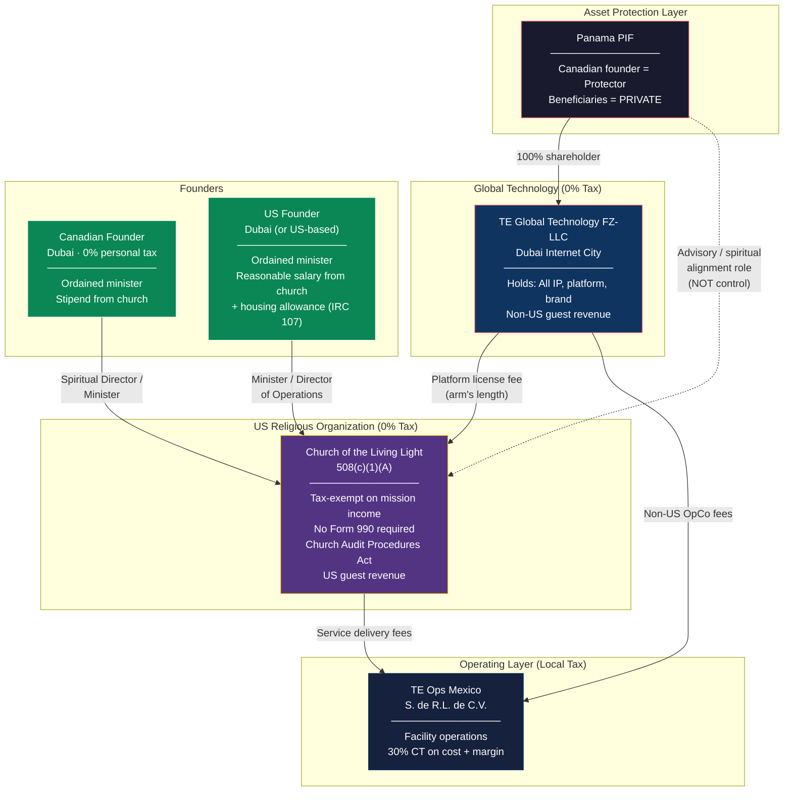
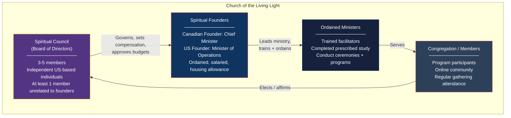
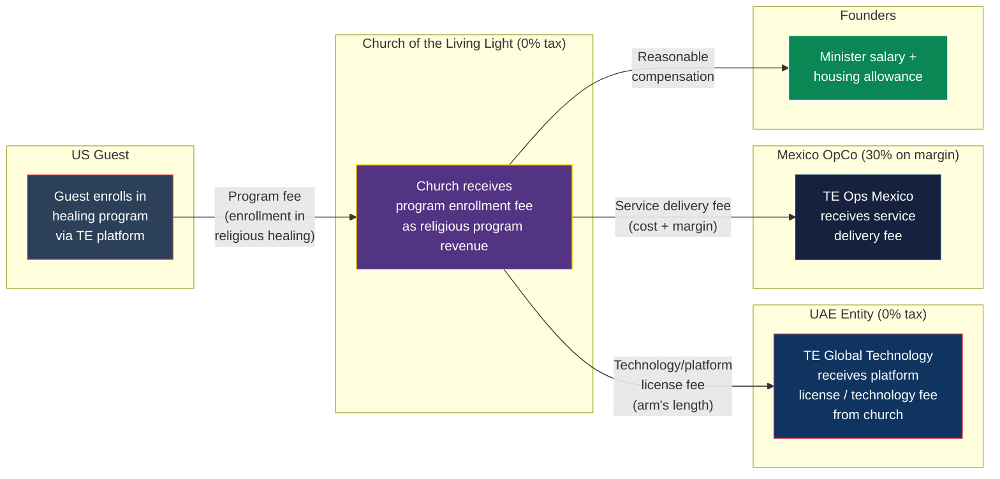
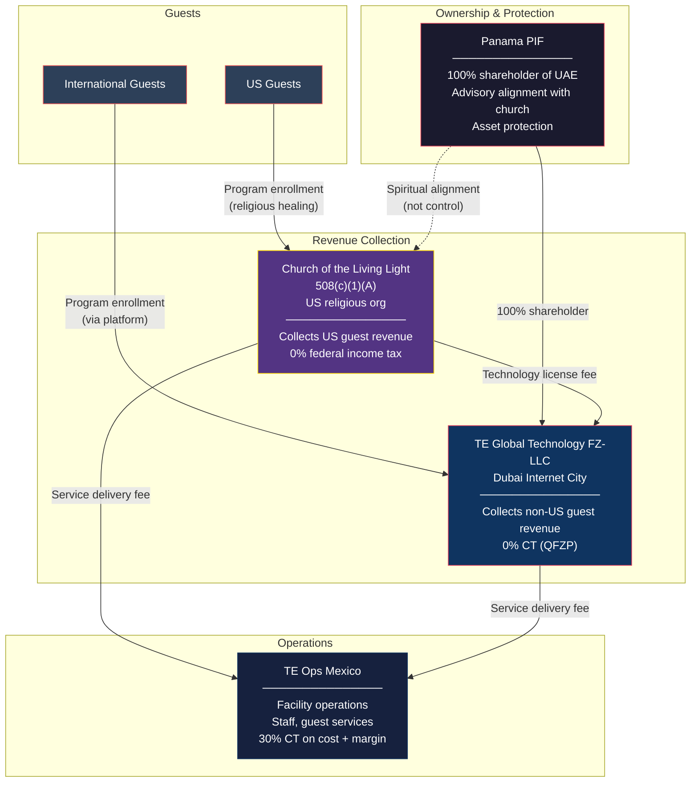
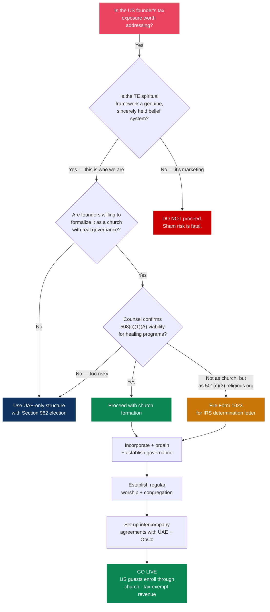

# US Strategy: 508(c)(1)(A) Religious Organization for the US Founder

> **Document Status:** Exploratory strategy — requires religious nonprofit counsel before implementation
> **Depends on:** [UAE_IMPLEMENTATION_BLUEPRINT.md](./UAE_IMPLEMENTATION_BLUEPRINT.md), [CHRIST_CONSCIOUSNESS_STRATEGY.md](./CHRIST_CONSCIOUSNESS_STRATEGY.md)
> **Last Updated:** February 2026

---

## 1. Executive Summary

### The Concept

Instead of the US founder navigating CFC/GILTI tax obligations through traditional corporate structures, establish a **508(c)(1)(A) tax-exempt church** (automatic exemption, no Form 1023 or Form 990 required) that serves as the US-facing entity for all domestic health and wellness activities. The church operates as a genuine religious organization built on TE's existing spiritual framework — Christ consciousness, healing, light work, and human transformation — and all US revenue flows through this tax-exempt entity.

The founders receive modest, reasonable compensation as ordained ministers/spiritual directors of the church. The bulk of revenue remains within the tax-exempt organization to fund its religious mission: healing, transformation, and bringing light to the planet.

### The Structure at a Glance

### Key Tax Outcomes

| Item | Tax Treatment |
|---|---|
| US guest revenue into church | **0% federal income tax** (exempt under 501(c)(3)/508(c)(1)(A)) |
| Founder salary from church | **Taxable** at ordinary income rates, but FEIE may exclude up to $130K if living abroad |
| Housing allowance (IRC 107) | **Excluded from income tax** (still subject to SE tax) |
| Church-owned property | **Exempt from property tax** (state-dependent) |
| Donations to the church | **Tax-deductible** for donors (up to 60% AGI for cash) |
| UBIT on unrelated business | **Taxable** at corporate rates if activity is not substantially related to religious mission |
| Non-US revenue (through UAE entity) | **0% CT** under QFZP (separate from church structure) |

### The Bottom Line

Under this structure, the US founder's personal tax exposure drops to a modest amount on their minister's salary — which, when combined with the housing allowance exclusion, could result in an effective personal tax rate in the single digits. The church itself pays zero federal income tax on all mission-related revenue. Even if the salary is taxed at the marginal rate, it's a moot point in the context of millions flowing tax-free through the church and the UAE entity.

---

## 2. Why This Works: The Religious Foundation Already Exists

This is not about manufacturing a religion for tax purposes. TE already has a genuine, documented spiritual framework that constitutes a sincere religious belief system. The [Christ Consciousness Strategy](./CHRIST_CONSCIOUSNESS_STRATEGY.md) document establishes:

### Existing Doctrinal Elements

| IRS Church Criteria | TE Already Has |
|---|---|
| A recognized creed | Christ consciousness as the highest expression of human awareness; unity, love, presence, surrender, service |
| A form of worship | Meditation, breathwork, plant medicine ceremony, sound healing, prayer, gratitude practice |
| A code of doctrine and discipline | Seven core beliefs (wholeness, body as temple, shadow work, daily practice, surrender, community, service) |
| Ecclesiastical government | Founder-led spiritual direction with community participation |
| A distinct religious history | Roots in perennial philosophy, Essene traditions, consciousness research, and direct mystical experience |
| Literature of its own | The Christ Consciousness Strategy, program curricula, teaching materials |
| Ordained/trained ministers | Founders + trained facilitators who complete prescribed training |

### The Theological Basis for Healing as Religious Activity

TE's core belief — "the body is the temple" and "Christ consciousness must be anchored in a regulated nervous system and a purified vessel" — makes physical healing an **inherently religious act**. This is not wellness repackaged as religion. The doctrine explicitly states that bodily purification, nervous system regulation, and shadow integration are *prerequisites for spiritual awakening*.

This is doctrinally identical to how:
- **Christian Science** treats spiritual healing as a ministerial function (IRS-recognized)
- **Optimum Health Institute** (Free Sacred Trinity Church) operates healing retreats as a religious mission, tax-free
- **Buddhist meditation centers** offer health-adjacent practices (stress reduction, mindfulness) as religious activity
- **Ayurvedic ashrams** provide dietary programs, detox, and body work as spiritual practice

The difference between a commercial wellness center and a religious healing ministry is **the intent and framework**: TE's programs exist to awaken Christ consciousness, with physical healing as a necessary step on that path, not the end goal.

---

## 3. What a 508(c)(1)(A) Actually Is (and Isn't)

### Legal Reality

508(c)(1)(A) is **not a separate type of entity**. It is a provision within IRC Section 508 that exempts churches from the requirement to file Form 1023 (application for tax exemption). A 508(c)(1)(A) church is still a 501(c)(3) organization — it simply doesn't need to ask the IRS for permission.

**Key legal citations:**
- IRC Section 501(c)(3): Establishes substantive requirements for tax exemption
- IRC Section 508(a): Requires 501(c)(3) organizations to notify the IRS (Form 1023)
- IRC Section 508(c)(1)(A): **Mandatory exception** from notification for "churches, their integrated auxiliaries, and conventions or associations of churches"
- IRC Section 170(b)(1)(A)(i): Contributions to churches qualify for highest deduction limits

### What You Get

| Benefit | Detail |
|---|---|
| **Automatic tax exemption** | No Form 1023 required. Exemption flows from meeting 501(c)(3) requirements. |
| **No Form 990** | Churches are exempt from annual information returns. Far less public financial transparency. |
| **Church Audit Procedures Act** | IRS must follow special procedures to audit. Requires high-level Treasury official sign-off, written notice, 90-day waiting periods. |
| **Donor deductibility** | Contributions are deductible even without an IRS determination letter (though donors bear burden of proof if audited). |
| **Housing allowance** | Ordained ministers can exclude housing costs from income tax (IRC Section 107). |
| **No employment tax on ministers** | Ministers are treated as self-employed for FICA purposes (can opt out via Form 4361). |

### What You Don't Get

| Myth | Reality |
|---|---|
| "508(c)(1)(A) is immune from IRS" | False. Courts have explicitly rejected this (Steeves v. IRS). All 501(c)(3) rules apply. |
| "No filing requirements at all" | False. Form 990-T required if UBIT exceeds $1,000. Employment tax returns still required for non-minister employees. State filings vary. |
| "Foreign entity can own it" | A nonprofit has no owners. A PIF cannot control the church. The church must have an independent US board. |
| "All revenue is automatically exempt" | Only revenue from activities substantially related to the religious mission is exempt. Unrelated business income is taxed. |

---

## 4. The Church: Structure and Governance

### Proposed Entity: "Church of the Living Light" (Working Name)

*(or: "The Light Ministry," "Church of Transformational Light," "The Epicenter Church" — name TBD with counsel)*

| Element | Detail |
|---|---|
| **Legal form** | Nonprofit religious corporation (incorporated in state of primary operations) |
| **Federal status** | 508(c)(1)(A) — automatic tax exemption as a church |
| **Mission statement** | To bring the light of Christ consciousness to humanity through healing of body, mind, and spirit; to awaken individuals to their divine nature through sacred ceremony, purification of the physical vessel, shadow integration, and devoted spiritual practice |
| **Core activities** | Healing retreats, spiritual programs, plant medicine ceremony, breathwork, meditation, bio-optimization as body temple purification, post-care spiritual community |

### Meeting the IRS 14-Point Church Test

The IRS evaluates these 14 criteria (no fixed minimum, but practitioners recommend meeting 11+):

| # | Criterion | How TE Satisfies It |
|---|---|---|
| 1 | Distinct legal existence | Incorporate as nonprofit religious corporation |
| 2 | Recognized creed and form of worship | Christ consciousness doctrine; meditation, ceremony, prayer, breathwork |
| 3 | Definite ecclesiastical government | Founder-led spiritual council with ordained ministers |
| 4 | Formal code of doctrine and discipline | Christ Consciousness Strategy + code of ethics + spiritual disciplines |
| 5 | Distinct religious history | Rooted in perennial wisdom traditions, Essene practices, consciousness evolution |
| 6 | Membership not associated with other church | Independent membership; guests become members upon enrollment |
| 7 | Organization of ordained ministers | Founders + trained facilitators ordained as ministers |
| 8 | Ministers selected after prescribed study | Minister training program: theology, ceremony facilitation, ethics, healing arts |
| 9 | Literature of its own | Doctrinal texts, program curricula, prayer/meditation guides, sacred texts |
| 10 | Established places of worship | Tulum healing center (and future locations) as sacred spaces |
| 11 | Regular congregations | Program participants form congregation; recurring community gatherings |
| 12 | Regular religious services | Daily meditation, weekly ceremony, program-integrated worship |
| 13 | Sunday schools / religious instruction for youth | Spiritual education programs (can include family programming) |
| 14 | Schools for preparing ministers | Minister training and ordination program for facilitators |

**Critical requirement (from case law):** The church must have a **regular congregation that assembles for communal worship**. This is the single most important factor courts examine. TE's retreat programs, where participants gather for group ceremony, meditation, and healing, satisfy this — but the church should also maintain ongoing community gatherings beyond paid programs (weekly online services, monthly in-person ceremonies, etc.).

### Governance Structure

**Key governance requirements:**
- The Spiritual Council (board) must be **genuinely independent** — not all founders/family
- Compensation for founders must be **approved by disinterested board members** using comparable data
- The PIF/UAE entity **cannot control** the church. They can have an advisory/alignment role, but the church board makes all decisions independently
- All decisions must be **documented** (meeting minutes, resolutions)

### Relationship to Panama PIF

The PIF **does not own** the church (nonprofits have no owners). However, the relationship can be structured as:

- The PIF's **charitable purpose** (stated in its charter) includes supporting the religious mission
- The PIF can make **donations** to the church (tax-deductible for the PIF if applicable; no US tax consequence for the church)
- Overlapping individuals (founders serve as PIF protector/council AND church ministers) create **alignment** without creating control
- The church maintains a **spiritual alignment covenant** with the PIF — a non-binding document expressing shared values and mission, without granting governance authority

---

## 5. Revenue Flows and Tax Treatment

### How US Revenue Flows Through the Church

### What Gets Taxed and What Doesn't

| Revenue / Expense | Tax Treatment | Rationale |
|---|---|---|
| **US guest program fees → Church** | **0% (exempt)** | Revenue from activity substantially related to religious mission (healing ministry). Analogous to Christian Science practitioner fees, Scientology auditing fees, OHI healing retreat fees. |
| **Donations to Church** | **0% (exempt)** | Standard 501(c)(3) treatment. Tax-deductible for donors. |
| **Church → UAE (platform license fee)** | **Deductible expense** for church; **0% income** for UAE entity (QFZP) | Arm's-length technology fee. Church uses the platform; UAE entity owns the IP. |
| **Church → Mexico OpCo (service delivery fee)** | **Deductible expense** for church; **30% taxed** in Mexico on cost + margin | Same intercompany model as the UAE blueprint. |
| **Church → Founders (salary)** | **Taxable** to founders as ordinary income | But see Section 5A below for housing allowance exclusion and FEIE. |
| **Church → Staff (wages)** | Standard employment tax | Non-minister employees subject to normal payroll tax. |
| **Merchandise sales (religious materials)** | **0% (exempt)** if substantially related | Books, courses, sacred items directly tied to doctrine. |
| **Merchandise sales (unrelated)** | **Taxable as UBIT** | Commercial goods not related to religious mission. Must file Form 990-T if UBIT > $1,000. |
| **Investment income (passive)** | Generally **exempt** | Dividends, interest, royalties from investments. Exception: debt-financed property income. |

### Founder Compensation: The Numbers

#### The Rebuttable Presumption of Reasonableness

To protect against IRS "excess benefit transaction" claims, founder compensation must satisfy IRC Section 4958:

1. **Approved by disinterested board members** (Spiritual Council members with no financial interest)
2. **Based on comparable data** (salaries at similar-size religious organizations)
3. **Documented contemporaneously** (board minutes recording the data reviewed and decision)

#### Comparable Compensation Ranges

For a religious organization with $5-15M annual revenue:

| Role | Comparable Range | Recommended |
|---|---|---|
| Senior Pastor / Chief Minister | $80,000-250,000 | $120,000-180,000 |
| Associate Pastor / Minister of Operations | $60,000-180,000 | $90,000-140,000 |
| Housing Allowance (per minister) | $30,000-80,000 | $40,000-60,000 |

*Comparable data should be gathered from at least three similar organizations. Sources: National Association of Church Business Administration (NACBA) salary surveys, Christianity Today compensation surveys, Leadership Network data.*

#### Tax on Founder Compensation

**Scenario: US Founder living in Dubai, serving as Minister of Operations**

| Component | Amount | Tax Treatment |
|---|---|---|
| Salary | $140,000 | Excluded under FEIE ($130K) → $10K taxable at ~22% = **$2,200** |
| Housing Allowance | $60,000 | **Excluded from income tax** (IRC 107). Subject to SE tax (~15.3%) = **$9,180** |
| **Total personal tax** | | **~$11,380** |

**Scenario: US Founder living in the US, serving as Minister of Operations**

| Component | Amount | Tax Treatment |
|---|---|---|
| Salary | $140,000 | Taxable at marginal rate (~22-24%) = **$30,800-33,600** |
| Housing Allowance | $60,000 | **Excluded from income tax** (IRC 107). Subject to SE tax (~15.3%) = **$9,180** |
| **Total personal tax** | | **~$40,000-42,800** |

**Context:** Even in the worst case (US-based, no FEIE), the founder pays ~$42K in personal tax while millions flow tax-free through the church. This is the "moot point" — the personal tax is noise relative to the overall structure.

#### Parsonage / Housing Allowance Deep Dive (IRC Section 107)

This is one of the most powerful tax benefits available to ordained ministers:

- **What it covers:** Rent/mortgage, utilities, furnishings, insurance, repairs, property taxes — essentially all costs of maintaining a home
- **How much:** The LEAST of: (1) actual housing costs, (2) amount designated in advance by the church, (3) fair rental value of the home
- **Income tax:** Fully excluded
- **Self-employment tax:** Still subject to SE tax (15.3%)
- **Net savings:** A minister with $60K housing allowance saves ~$13,200-22,200 in income tax (depending on bracket) while paying ~$9,180 in SE tax — net benefit of $4,000-13,000
- **Requirement:** Must be designated **in advance** by the church board before the start of the tax year
- **Both founders qualify** if both are ordained ministers of the church

---

## 6. What Makes This Defensible (and What Doesn't)

### The Optimum Health Institute Precedent

The strongest precedent for this structure is the **Optimum Health Institute (OHI)**, which operates as a healing mission of the Free Sacred Trinity Church:

| Element | OHI | TE Church |
|---|---|---|
| Parent organization | Free Sacred Trinity Church (non-denominational Christian) | Church of the Living Light (Christ consciousness tradition) |
| Tax status | 501(c)(3) religious corporation | 508(c)(1)(A) church |
| Activities | Raw food detox, meditation, prayer, spiritual sessions, physical healing | Healing programs, plant medicine ceremony, breathwork, bio-optimization, meditation |
| Fee model | Charges fees for programs | Charges fees for programs (as enrollment in religious healing ministry) |
| Doctrinal basis | "Promoting healing through non-medical, all-natural, holistic healing practices" rooted in Essene/Judeo-Christian doctrine | "Awakening Christ consciousness through purification of the physical vessel" rooted in perennial wisdom tradition |
| Staff | Trained in holistic healing and ministry | Ordained ministers trained in healing arts and ceremony |
| Openness | "People of all spiritual traditions welcome" | Open to all seekers regardless of background |

OHI has operated for decades as a tax-exempt religious healing mission. TE's model is directly analogous.

### Other Supporting Precedents

- **Christian Science:** IRS classifies spiritual healing practitioners as "ministers of the gospel." Healing fees are even deductible as medical expenses for patients. (IRS Publication 517, Form 4361)
- **Church of Scientology:** Charges significant fees for "auditing" (spiritual counseling). Received full IRS tax exemption in 1993 after extensive examination. 150+ affiliates exempt.
- **Rev. Rul. 77-430:** IRS approved exemption for a nonprofit conducting weekend religious retreats with prayer, lectures, meditation, and limited recreation.
- **Gonzales v. O Centro (2006):** Supreme Court unanimously upheld religious exemption for sacramental use of controlled substance in church ceremonies — relevant to TE's plant medicine ceremonies.

### What Would Make It Fail

| Risk Factor | Why It Fails | How TE Avoids It |
|---|---|---|
| **No regular congregation** | Spiritual Outreach Society (1991): denied because no regular assembly. Foundation of Human Understanding (2010): denied because broadcasting ≠ congregation. | TE has in-person programs with groups assembling for communal ceremony, meditation, and healing. Also establish weekly online services and monthly community gatherings. |
| **Commercial appearance** | If programs look like a luxury spa with a religious label. | Programs are structured around doctrinal framework. Every activity ties to theological purpose. Marketing language reflects ministry, not commerce. |
| **Private inurement** | Founders extracting excessive compensation or personal benefits. | Board-approved reasonable compensation based on comparables. No personal use of church assets. Housing allowance properly designated. |
| **Foreign control** | If PIF/UAE entity directs the church's operations. | Church has independent US board. PIF has advisory/alignment role only. All operational decisions made by Spiritual Council. |
| **Sham religious purpose** | If the religion was created primarily as a tax shelter. | The spiritual framework predates any tax planning. Christ Consciousness Strategy exists as genuine doctrine. Founders' spiritual practice is well-documented. |
| **Political activity** | Partisan advocacy. | Absolute prohibition on political activity in church bylaws. |

### The Sincerity Test

Courts evaluate whether religious beliefs are "truly and sincerely held" — they do not judge whether beliefs are correct, logical, or mainstream. TE's spiritual framework passes this test because:

1. The doctrine is **detailed and internally consistent** (not a vague claim of "spirituality")
2. The founders **practice what they preach** (personal spiritual practice predates the organization)
3. The healing methodology is **grounded in the doctrine** (body purification as prerequisite for consciousness evolution)
4. The organization **welcomes all seekers** (not a private club)
5. The belief system has **historical roots** (perennial philosophy, Essene traditions, consciousness studies)

---

## 7. Integrated Structure: Church + UAE + PIF

### How All Three Entities Work Together

### Revenue Split Logic

| Guest Origin | Collection Entity | Why |
|---|---|---|
| US-based guests | Church of the Living Light | US guests enroll in the church's religious healing program. Revenue is exempt. |
| All other guests | TE Global Technology FZ-LLC (UAE) | International guests book through the platform. Revenue taxed at 0% under QFZP. |

**The church pays the UAE entity a technology/platform license fee** for use of the software, AI agents, and booking infrastructure. This is an arm's-length expense that shifts some revenue to the UAE entity (where it's taxed at 0% anyway) and creates a defensible intercompany arrangement.

**Both entities pay the Mexico OpCo** a service delivery fee for facility operations. The OpCo doesn't need to know or care which entity is paying — it provides the same services regardless.

### Why This Is Better Than CFC/GILTI for the US Founder

| Approach | US Founder's Tax Burden | Complexity |
|---|---|---|
| **Direct UAE ownership + Section 962** | ~10.5-13% on CFC income ($490K-2.7M tax on $4.7-21.5M EBITDA over 5 years). Annual Form 5471 + 8938 + FBAR + 8992 + 8993. | High |
| **Employee-only (no ownership)** | Marginal rate on salary above $130K FEIE. No equity upside. | Low |
| **508(c)(1)(A) Church** | ~$11K-42K/year personal tax on minister salary. Church revenue exempt. | Medium (church governance + compliance) |

The church route eliminates CFC/GILTI entirely for US-source revenue. The US founder is not a shareholder of a CFC — they're an ordained minister of a US church. The church is not a CFC (it's a US tax-exempt entity). There is no foreign income to attribute.

---

## 8. Setup Roadmap

### Phase 1: Doctrinal Foundation (Months 1-2)

| Step | Detail | Timeline |
|---|---|---|
| **Engage religious nonprofit counsel** | Find an attorney specializing in church formation (not generic nonprofit counsel). Key questions: 508(c)(1)(A) vs. filing Form 1023 voluntarily, state incorporation, governance. | Immediately |
| **Formalize the doctrine** | Expand Christ Consciousness Strategy into a complete doctrinal document: statement of faith, code of ethics, spiritual disciplines, sacraments (ceremony, meditation, breathwork, plant medicine), ordained ministry requirements. | 2-4 weeks |
| **Draft church constitution and bylaws** | Governance structure, Spiritual Council composition, minister ordination process, membership requirements, financial policies, conflict of interest policy. | 2-3 weeks |
| **Establish minister ordination program** | Define prescribed course of study for ministers (theology, ceremony facilitation, ethics, healing arts). Both founders complete this program. | 2-4 weeks |

### Phase 2: Entity Formation (Months 2-3)

| Step | Detail | Timeline |
|---|---|---|
| **Incorporate** | File articles of incorporation as a nonprofit religious corporation in the chosen state. Include required 501(c)(3) language (exclusively for religious purposes, no private inurement, dissolution clause). | 1-2 weeks |
| **Obtain EIN** | Apply for Employer Identification Number from the IRS. | 1 day |
| **Appoint Spiritual Council** | Minimum 3 members. At least 1 unrelated to founders. All must understand and affirm the doctrine. | 1 week |
| **Ordain founders** | Both founders ordained as ministers through the church's own ordination process. Document the process. | 1 week |
| **Board approves compensation** | Spiritual Council reviews comparable data, documents rationale, approves founder salaries and housing allowances. | 1 meeting |
| **Open bank account** | Open church bank account (separate from personal and UAE entity accounts). | 1-2 weeks |

### Phase 3: Operational Setup (Months 3-5)

| Step | Detail | Timeline |
|---|---|---|
| **Establish regular worship** | Launch weekly online services (meditation, teaching, community prayer). Monthly in-person gatherings. This builds the congregation record. | Ongoing from day 1 |
| **Develop membership program** | Create formal membership process (statement of faith, enrollment, ongoing participation). Guests who enroll in programs become members. | 2-4 weeks |
| **Set up intercompany agreements** | Technology license agreement with UAE entity. Service delivery agreement with Mexico OpCo. All at arm's length. | 2-3 weeks (with counsel) |
| **Configure payment processing** | US guests pay the church (not the UAE entity). Separate Stripe account or payment flow for US-originating enrollments. | 1-2 weeks |
| **State tax exemptions** | Apply for property tax exemption, sales tax exemption, and any required state registrations. | Varies by state |
| **Designate housing allowances** | Board resolution designating housing allowance amounts for each minister, in advance of the tax year. | 1 board meeting |

### Phase 4: Ongoing Operations

| Activity | Frequency |
|---|---|
| Spiritual Council meetings | Quarterly minimum (document minutes) |
| Regular worship services | Weekly online, monthly in-person |
| Compensation review | Annual (with comparable data) |
| DEMPE documentation | Ongoing (church directs US ministry activities) |
| Financial record-keeping | Ongoing (even without Form 990, maintain clean books) |
| Form 990-T (if UBIT > $1,000) | Annual |
| Employment tax returns | Quarterly/annual |
| State compliance | Varies |

---

## 9. Risk Assessment

### Risk Matrix

| Risk | Probability | Impact | Mitigation |
|---|---|---|---|
| **IRS denies church status** | Low-Medium | High — all revenue becomes taxable | Meet 11+ of 14 criteria. Establish regular congregation. Consider voluntarily filing Form 1023 for determination letter. |
| **IRS challenges fee-based programs as commercial** | Medium | High — UBIT on program revenue | Frame all programs within doctrinal context. Charge below-market rates where possible. Document religious purpose of every activity. Follow OHI/Christian Science precedents. |
| **Excess benefit transaction (Section 4958)** | Low | High — 25% excise tax on excess + 200% if uncorrected + personal liability | Rebuttable presumption: independent board, comparable data, documented decision. Keep compensation conservative. |
| **Foreign control allegation** | Low-Medium | High — loss of exemption | Church board is independent. PIF has advisory role only. No shared bank accounts. Separate governance, separate decisions. |
| **State challenges** | Low | Medium — state tax obligations | Apply proactively for state exemptions. Maintain good standing in state of incorporation. |
| **Plant medicine legal issues** | Medium | Medium-High — federal controlled substance laws | Follow Gonzales v. O Centro precedent. Consult RFRA attorney. May need separate legal strategy for US-based ceremonies vs. Mexico-based ceremonies. |
| **Negative publicity** | Low-Medium | Medium — "church as tax shelter" narrative | Genuine religious activity, community service, transparent mission. The spiritual practice predates the tax strategy. |
| **Transfer pricing challenge (church ↔ UAE)** | Low | Medium — reallocation of revenue | Arm's-length technology license fee supported by benchmarking study. |

### The "Sham" Risk — How to Neutralize It

The biggest risk is the IRS arguing the church is a sham created for tax avoidance. The defense is built on **chronology and authenticity**:

1. **The spiritual framework exists independently of tax planning.** The Christ Consciousness Strategy, the healing methodology, and the founders' personal practice all predate any discussion of 508(c)(1)(A) structures.
2. **The church provides genuine religious services.** Regular worship, community gathering, spiritual education, and healing ministry — not just fee-based programs.
3. **The church serves the community.** Offer scholarships, free community programming, charitable work. A church that only serves paying customers looks commercial.
4. **Compensation is modest relative to revenue.** Founders taking $140K-200K from an organization generating millions demonstrates mission over personal enrichment.
5. **The organization operates as a real church.** Ordained ministers, regular services, formal membership, doctrinal education, ministerial training program.

---

## 10. Cost Summary

### Setup Costs

| Item | Estimate |
|---|---|
| Religious nonprofit attorney (formation + compliance) | $5,000-15,000 |
| State incorporation | $100-500 |
| Minister ordination program development | $2,000-5,000 |
| Doctrinal literature production | $1,000-3,000 |
| Initial worship space / online platform setup | $1,000-5,000 |
| **Total setup** | **$9,100-28,500** |

### Annual Costs

| Item | Estimate |
|---|---|
| Founder compensation (2 ministers: salary + housing) | $340,000-480,000 |
| Legal/compliance counsel | $3,000-10,000 |
| Transfer pricing study (church ↔ UAE) | $10,000-20,000 |
| Bookkeeping/accounting | $5,000-15,000 |
| Community programming (free/subsidized) | $10,000-30,000 |
| Worship platform/technology | $2,000-5,000 |
| **Total annual (excluding OpCo and UAE costs)** | **$370,000-560,000** |

### Tax Savings Comparison (Year 1, US Revenue Only)

Assuming $5M of the $10.7M Y1 revenue comes from US guests:

| Structure | Tax on US Revenue | Founder Personal Tax | Total Tax |
|---|---|---|---|
| **All-US C-Corp** | ~$1,050,000 (21% CT) + dividend tax | $50,000-100,000 | ~$1.1-1.15M |
| **UAE entity + US founder CFC** | ~$525,000-650,000 (GILTI 10.5-13%) | $11,000-42,000 | ~$536K-692K |
| **508(c)(1)(A) Church** | **$0** (exempt) | $11,000-42,000 | **~$11K-42K** |

---

## 11. Decision Framework

---

## 12. Open Questions for Counsel

### Religious Nonprofit Attorney (Priority 1)
1. For a healing/wellness ministry with TE's doctrinal framework, is 508(c)(1)(A) automatic status advisable, or should we voluntarily file Form 1023 for an IRS determination letter?
2. Which state of incorporation is optimal for a religious corporation that operates healing retreats in multiple countries?
3. How should the relationship between the church and the UAE entity be documented to avoid "foreign control" issues?
4. What specific language should the articles of incorporation and bylaws contain?
5. Can program fees charged by a church for healing retreats be structured to maintain tax exemption? What pricing guidelines?

### Plant Medicine / RFRA Attorney (Priority 2)
1. Can the church claim RFRA protection for sacramental use of plant medicines in US-based ceremonies?
2. Should US plant medicine ceremonies be conducted only at the Mexico facility to avoid controlled substance issues?
3. What documentation is needed to establish plant medicine as a sincere sacrament of the church?

### Tax Attorney (Priority 2)
1. How should the technology license fee between the church and UAE entity be structured and priced?
2. Does the church's tax-exempt status eliminate all CFC/GILTI concerns for the US founder, or are there residual issues?
3. What are the self-employment tax implications for ordained ministers who opt out of FICA via Form 4361?
4. Can the US founder qualify for both FEIE (if Dubai-based) and housing allowance (from church)?

---

## 13. Compliance Calendar (Church-Specific)

| When | Task |
|---|---|
| **Before each tax year** | Board designates housing allowance amounts for ministers |
| **Quarterly** | Employment tax returns (Form 941) for non-minister staff |
| **Quarterly** | Spiritual Council meeting (document minutes) |
| **Annually** | Form 990-T if UBIT > $1,000 |
| **Annually** | Compensation review with comparable data (document in minutes) |
| **Annually** | State annual report / registration renewal |
| **Annually** | Update minister ordination records |
| **Ongoing** | Maintain congregation records (attendance, membership, services) |
| **Ongoing** | Document religious purpose of all programs and activities |
| **Ongoing** | Maintain separation from UAE entity / PIF (no shared accounts, independent decisions) |

---

## Appendix: Comparison of US Founder Options

| Dimension | CFC + Section 962 | Employee Only | 508(c)(1)(A) Church |
|---|---|---|---|
| **Tax on US revenue** | 10.5-13% GILTI | N/A (no US entity) | 0% (exempt) |
| **Founder personal tax** | ~10.5-13% on CFC income | Marginal rate on salary >$130K | ~$11-42K total (salary + housing) |
| **Equity upside** | Full ownership participation | None (salary only) | Mission-driven (no equity, but church accumulates assets tax-free) |
| **Annual compliance cost** | $5-15K (Forms 5471, 8938, etc.) | Low | $3-10K (legal + accounting) |
| **Governance burden** | Minimal | Minimal | Moderate (board, minutes, worship) |
| **IRS audit risk** | Standard | Low | Medium (church audit protections apply) |
| **Scalability** | Scales with revenue | Doesn't scale (fixed salary) | Scales — all US revenue flows through church |
| **Founder compensation flexibility** | Dividends + salary | Salary only | Salary + housing allowance (tax-advantaged) |
| **Asset protection** | Via PIF | None | Church assets protected (nonprofit) |
| **Exit / liquidity** | Sell shares (capital gains) | None | No equity to sell (mission-driven model) |

**The trade-off is clear:** The church structure sacrifices personal equity accumulation in exchange for near-zero taxation on US revenue. The founders build wealth through the church's mission (which accumulates assets tax-free) and through the UAE/PIF structure (for non-US revenue). Personal wealth comes from modest-but-tax-efficient minister compensation, not from equity ownership.

---

*This document explores a legal tax strategy based on genuine religious activity. It is not a recommendation to create a fraudulent organization. The spiritual framework must be authentic, the religious activities must be real, and the governance must be independent. This requires validation by qualified religious nonprofit counsel before any implementation steps are taken.*
