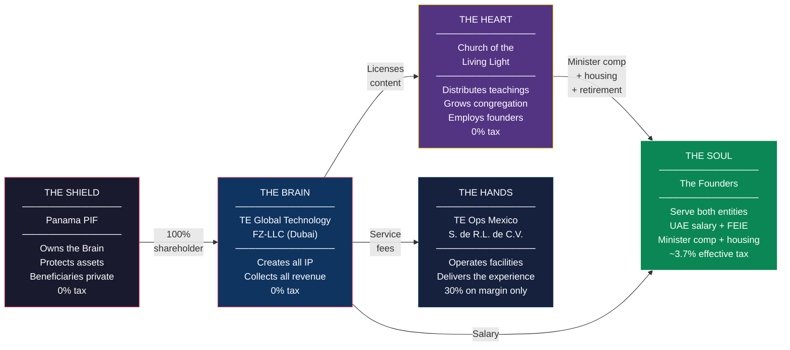
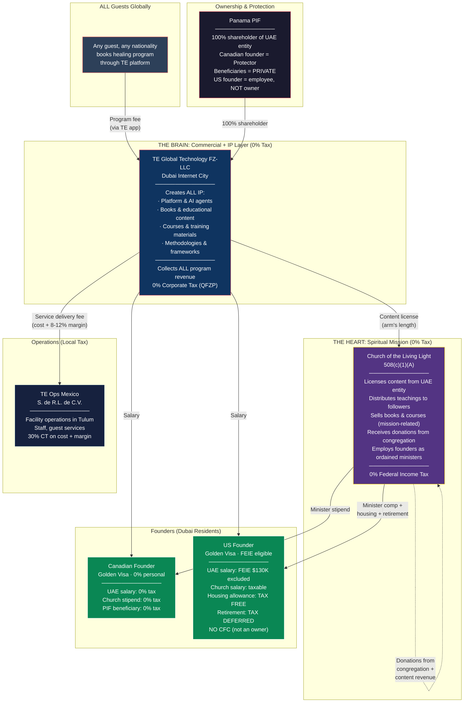
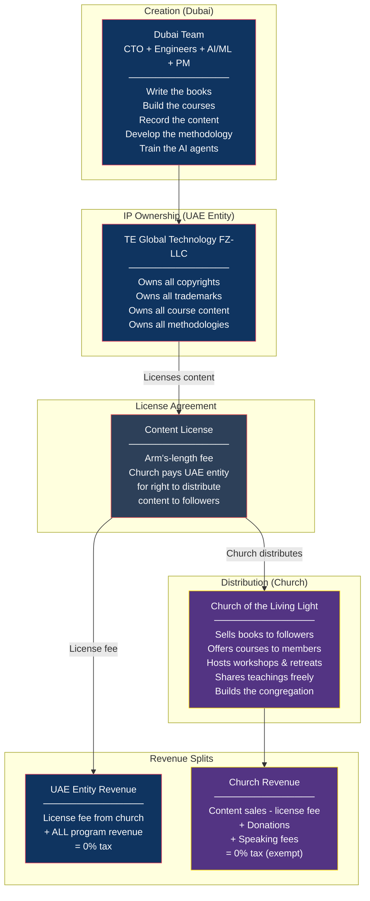
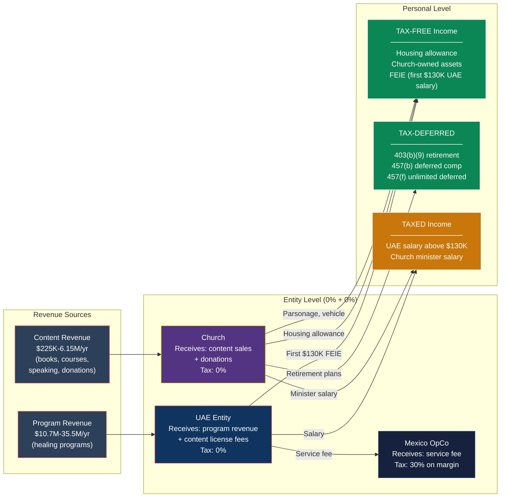
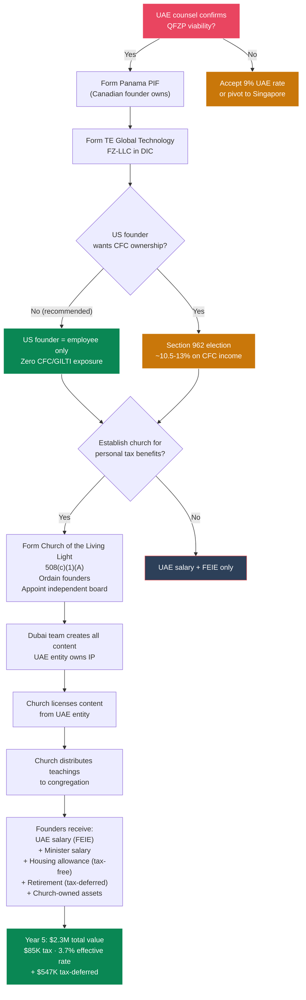

# Master Plan: The Complete TE Global Structure

> **Document Status:** Definitive structure — requires counsel validation before implementation
> **Supersedes:** Prior 508(c)(1)(A) docs (revenue-routing model, personal LLC model)
> **Related:** [UAE_IMPLEMENTATION_BLUEPRINT.md](./UAE_IMPLEMENTATION_BLUEPRINT.md), [CHRIST_CONSCIOUSNESS_STRATEGY.md](./CHRIST_CONSCIOUSNESS_STRATEGY.md)
> **Last Updated:** February 2026

---

## 1. The Structure



The **Brain** creates everything, owns all IP, and collects all commercial revenue at 0%. The **Shield** owns and protects the Brain. The **Heart** receives the teachings, distributes them to the world, and employs the founders with tax-advantaged compensation. The **Hands** deliver the guest experience on the ground. The **Soul** — the founders — serve both the Brain and the Heart, drawing compensation through channels that result in a ~3.7% effective personal tax rate.

---

## 2. Why This Works: Three Core Principles

### Principle 1: Customer Nationality Is Irrelevant to Where Revenue Lands

A US citizen booking a healing program through a UAE-based app and receiving services at a facility in Mexico creates **zero obligation** for that revenue to flow through a US entity.

```
Any Guest (US, Canadian, European, anyone) → TE Platform (UAE app) → Stripe (UAE merchant) → TE Global Technology FZ-LLC (Dubai) → 0% tax
```

**There is no US nexus** because:

| Factor | Status |
|---|---|
| US employees | None — team is in Dubai |
| US office | None — office is in DIC |
| US agents | None |
| US servers | Not required — global cloud infrastructure |
| Service delivery | Mexico (Tulum), not the US |
| US customers | Having US *customers* ≠ having a US *trade or business* |

This is how Spotify (Sweden), Shopify (Canada), and thousands of platforms collect from US customers without a US entity. The customer's passport doesn't determine where the merchant is taxed.

### Principle 2: The UAE Entity Creates Everything

All intellectual property — platform code, AI agents, books, courses, training materials, educational content, videos, methodologies — is created by the Dubai team. The UAE entity owns it all. This is real substance: real people in a real office doing real creative and technical work.

### Principle 3: The Church Distributes the Mission

The church doesn't create commercial products. It licenses teachings from the UAE entity and shares them with followers. It sells books and courses as mission-related religious activity. All content revenue flowing through the church is tax-exempt because it's substantially related to the church's religious purpose: awakening Christ consciousness through healing, education, and spiritual practice.

---

## 3. The Complete Structure



---

## 4. Every Entity and Its Exact Role

### 4A. TE Global Technology FZ-LLC (Dubai Internet City) — THE BRAIN

**What it does:**
- Owns and operates the TE platform (app, AI agents, booking system)
- Creates ALL intellectual property:
  - Platform software and AI models
  - Books, e-books, audiobooks
  - Online courses and training programs
  - Video content, documentaries, guided meditations
  - Healing methodologies and program frameworks
  - Marketing materials, brand assets
- Collects ALL commercial revenue globally (program fees from every guest, every nationality)
- Pays the Mexico OpCo a service delivery fee (cost + 8-12% margin) for facility operations
- Licenses content to the church for religious distribution
- Employs the Dubai team (5-6 engineers, PM, finance) who do the actual creative and technical work
- Employs both founders in commercial/executive roles

**Tax:** 0% under QFZP (Qualifying Free Zone Person) status

**Revenue:** $10.7M Year 1 → $35.5M Year 5 (from data.ts)

**IP it owns:** Everything. Platform code, brand, content, methodologies, AI models. All contractor work is work-for-hire assigned to this entity. All Dubai team output is owned by this entity. The church licenses from here — it never creates its own IP.

### 4B. Panama Private Interest Foundation (PIF) — THE SHIELD

**What it does:**
- 100% shareholder of the UAE entity
- Asset protection layer
- Canadian founder serves as Protector (identity is private)
- Beneficiary identities are private (in private regulations, never filed publicly)
- **US founder is NOT a beneficiary and NOT an owner** — this eliminates CFC/GILTI entirely

**Tax:** 0% (Panama does not tax foundations on foreign-source income)

**Cost:** ~$2,000 setup + $1,000/yr maintenance

### 4C. Church of the Living Light — 508(c)(1)(A) — THE HEART

**What it does:**
- Operates the spiritual mission: community, worship, teaching, charitable work
- Licenses content (books, courses, teachings) from the UAE entity
- Distributes that content to followers through:
  - Book sales (physical and digital)
  - Online courses and educational programs
  - Workshops, retreats, and community events
  - Free distribution to members and seekers
- Receives donations from congregation, supporters, and program alumni
- Employs both founders as ordained ministers
- Provides minister-specific tax benefits (housing allowance, church retirement plans)
- Maintains regular worship services (weekly online, monthly in-person)
- Runs charitable programs (scholarships, community healing, education)

**Tax:** 0% federal income tax on all revenue substantially related to the religious mission

**Why content sales are tax-exempt:** Books on Christ consciousness, courses on spiritual awakening, workshops on healing methodology — all of this is the core religious mission of the church. This is identical to how churches sell Bibles, devotionals, and religious education materials tax-free. It's identical to how Scientology sells auditing courses and the Optimum Health Institute charges for healing programs. The content is the teaching. The teaching is the mission.

**Funding sources:**

| Source | Description | Year 1 | Year 3 | Year 5 |
|---|---|---|---|---|
| Content sales (books, courses) | Church distributes UAE-created content; revenue is mission-related | $100K-200K | $500K-1.5M | $1M-4M |
| Member donations & tithes | Congregation supports the mission | $50K-100K | $200K-500K | $500K-1.5M |
| Founder tithes | Founders donate from their UAE salaries | $50K | $100K | $150K |
| Speaking / event fees | Church is hired for speaking (not the individual) | $25K-50K | $100K-300K | $200K-500K |
| **Total** | | **$225K-400K** | **$900K-2.3M** | **$1.85M-6.15M** |

### 4D. TE Ops Mexico S. de R.L. de C.V. — THE HANDS

**What it does:**
- Operates the physical healing facility in Tulum
- Employs local staff (facilitators, kitchen, maintenance, medical)
- Delivers the guest experience on the ground
- Receives a service delivery fee from the UAE entity (cost + 8-12% margin)

**Tax:** 30% Mexican corporate tax on the margin only (not the full fee)

### 4E. The Founders — THE SOUL

Both founders live in Dubai on Golden Visas. Each has two employment relationships:

**Canadian Founder:**
- UAE entity: salary (0% personal tax as Dubai resident)
- Church: minister stipend (0% personal tax as Dubai resident, non-US person)
- PIF: beneficiary (distributions at 0% personal tax)
- **Total personal tax: 0%**

**US Founder:**
- UAE entity: salary (FEIE excludes first $130K; remainder taxed at marginal rate)
- Church: minister salary + housing allowance (IRC 107, no cap, income-tax-free) + retirement plans (tax-deferred) + church-owned assets (no personal outlay)
- PIF: NOT a beneficiary, NOT an owner → **zero CFC, zero GILTI, zero Form 5471**
- **Total personal tax: ~5-8% effective (Year 1-3), scaling to ~8-12% at Year 5**

---

## 5. The Content Flow: UAE Creates, Church Distributes

This is the key innovation. Here's exactly how it works:



### How the License Fee Works

The church pays the UAE entity an arm's-length license fee for the right to distribute content. This is a standard intellectual property license — like a publisher licensing rights from an author, or a distributor licensing content from a studio.

**Example at Year 3:**
- Church sells $1M in books and courses
- Church pays UAE entity a $300K license fee (30% royalty rate — within arm's-length range for content licensing)
- Church retains $700K for operations, minister compensation, and mission work
- UAE entity receives $300K at 0% QFZP
- **Total tax on the entire $1M: $0** (church is exempt, UAE entity is at 0%)

**Why the license fee matters:**
1. It documents that the UAE entity owns the IP (strengthens DEMPE)
2. It creates a paper trail showing arm's-length dealings between the entities
3. It moves some revenue to the UAE entity (though both are at 0%, clean documentation matters)
4. It proves the church is a licensee/distributor, not the creator — reinforcing that IP substance is in Dubai

**Transfer pricing risk is minimal** because both entities are at 0%. There's no tax arbitrage — nobody saves tax by manipulating the license fee rate. The IRS cares about transfer pricing when it affects US tax revenue. Here, neither entity pays US tax.

---

## 6. The Money Map: Where Every Dollar Goes



---

## 7. US Founder Compensation: Channel by Channel

### Channel 1: UAE Salary (FEIE-Sheltered)

| Detail | Value |
|---|---|
| **What** | Salary for executive/director role at TE Global Technology FZ-LLC |
| **Amount** | $130,000-300,000 |
| **Tax** | First $130K excluded via FEIE (must live in Dubai, meet 330-day physical presence test or bona fide residence test). Remainder taxed at marginal rate (22-35%). |
| **Year 1 example** | $200K salary → $70K taxable → ~$15,400 tax |

### Channel 2: Church Minister Salary

| Detail | Value |
|---|---|
| **What** | Salary for ordained minister role at Church of the Living Light |
| **Amount** | $60,000-400,000 (scales with church budget; must be board-approved with comparables) |
| **Tax** | Taxable as ordinary income. BUT ministers are considered self-employed for FICA — can opt out entirely via Form 4361 (saves 15.3%). |
| **Year 1 example** | $80K salary → ~$17,600 tax |

### Channel 3: Housing Allowance (IRC 107) — The Crown Jewel

| Detail | Value |
|---|---|
| **What** | Church board designates a portion of minister compensation as "housing allowance" |
| **Amount** | **No dollar cap.** Limited to the least of: (1) amount designated, (2) actual housing costs, (3) fair rental value of home. |
| **Tax** | **Excluded from federal income tax.** Subject to SE tax (~15.3%), but $0 if Form 4361 is filed. |
| **What it covers** | Rent/mortgage, utilities, furnishings, insurance, repairs, maintenance, property taxes — all costs of maintaining a home |
| **Year 1 example** | $80K housing allowance → **$0 tax** |
| **Year 5 example** | $300K housing allowance → **$0 tax** |
| **Church-owned parsonage alternative** | Instead of cash, the church buys a home. You live in it as minister. Fair rental value excluded from income. Property tax exempt in most states. (Kenneth Copeland model: $7M church-owned parsonage.) |

**Why there's no cap:** Congress created IRC 107 in 1921 for ministers. It's been upheld as constitutional (Gaylor v. Mnuchin, 7th Circuit, 2019). The IRS has never successfully challenged a housing allowance solely for being "too large" on a single primary residence, as long as it doesn't exceed fair rental value.

### Channel 4: Retirement — 403(b)(9) + 457(b) + 457(f)

| Plan | Annual Amount | Tax Treatment | Special Feature |
|---|---|---|---|
| **403(b)(9)** | Up to $23,500 employee + employer match (total ~$70,000) | Tax-deferred | Distributions can be designated as **housing allowance in retirement = tax-free withdrawals.** Only plan in the US tax code where this is possible. |
| **457(b)** | Up to $23,500 | Tax-deferred | Stacks on top of 403(b) limits (separate cap) |
| **457(f)** | **Unlimited** | Tax-deferred until vesting | Subject to "substantial risk of forfeiture" (e.g., must complete X years of service). No dollar cap. |
| **Combined** | **$117,000 - unlimited** | | |

**The retirement superpower:** Over 10 years, a minister contributing $47K/year to 403(b)(9) + 457(b), plus $300K/year to 457(f), accumulates $3.47M in tax-deferred accounts. With investment returns: potentially $5-6M+. Then in retirement, 403(b)(9) distributions are designated as housing allowance = **tax-free income for life.**

### Channel 5: Church-Owned Assets

| Asset | Ministry Justification | Annual Lifestyle Value |
|---|---|---|
| **Parsonage** | Minister must be available to congregation; housing provided as condition of service | $50,000-300,000+ |
| **Vehicle** | Minister needs transportation for pastoral duties, speaking, community visits | $10,000-30,000 |
| **Technology** | Equipment for content review, worship preparation, communications | $5,000-15,000 |
| **Travel** | Ministry conferences, speaking engagements, missionary work, community events | $15,000-100,000 |

**You don't own these assets — you use them.** No personal outlay, no taxable income (if primary use is ministry-related and properly documented). The church owns the home, the car, and the equipment. You live in them and use them as part of your ministerial role.

### Channel 6: Charitable Deduction on Tithes

The founders donate a portion of their UAE salary to the church. This is a **personal charitable deduction** (up to 60% of AGI for cash donations to a church).

**Example:** US founder earns $200K from UAE entity. Donates $60K to the church. Gets a $60K deduction, saving ~$13K-22K in personal income tax (depending on bracket). The donated money funds the church's mission — and circles back as tax-advantaged minister compensation.

---

## 8. Tax Summary by Entity and Person

### Entity-Level Tax

| Entity | Revenue/Funding | Tax Rate | Tax Paid |
|---|---|---|---|
| TE Global Technology FZ-LLC | $10.7M Y1 → $35.5M Y5 (programs) + license fees from church | 0% (QFZP) | **$0** |
| Church of the Living Light | $225K Y1 → $6.15M Y5 (content + donations) | 0% (508(c)(1)(A) exempt) | **$0** |
| TE Ops Mexico | Cost + 8-12% margin | 30% on margin only | ~$126K Y1 → ~$420K Y5 |
| Panama PIF | N/A (holding entity) | 0% | **$0** |

### Founder Personal Tax

**Canadian Founder (Dubai resident, non-US person):**

| Income Source | Amount | Tax |
|---|---|---|
| UAE salary | $200,000-400,000 | **$0** (Dubai, no personal income tax) |
| Church minister stipend | $30,000-50,000 | **$0** (non-US person, Dubai resident) |
| PIF distributions | Variable | **$0** (no Canadian tax after departure; no UAE tax) |
| **Total tax** | | **$0** |

**US Founder (Dubai resident, US citizen):**

#### Year 1 (~$200K church budget)

| Channel | Amount | Tax | Rate |
|---|---|---|---|
| UAE salary ($200K; FEIE covers $130K) | $200,000 | $15,400 | 7.7% |
| Church minister salary | $80,000 | $17,600 | 22.0% |
| Church housing allowance | $80,000 | **$0** | **0%** |
| Church retirement (403b + 457b) | $47,000 | **$0** (deferred) | **0%** |
| Church-owned assets (lifestyle) | $50,000 | **$0** | **0%** |
| Charitable deduction on tithes | -$50,000 | -$11,000 savings | — |
| **Total value: $507,000** | | **$22,000** | **4.3%** |

#### Year 3 (~$1.5M church budget)

| Channel | Amount | Tax | Rate |
|---|---|---|---|
| UAE salary ($250K; FEIE covers $130K) | $250,000 | $26,400 | 10.6% |
| Church minister salary | $150,000 | $33,000 | 22.0% |
| Church housing allowance | $200,000 | **$0** | **0%** |
| Church retirement (403b + 457b) | $47,000 | **$0** | **0%** |
| 457(f) deferred comp | $300,000 | **$0** (deferred) | **0%** |
| Church-owned assets | $100,000 | **$0** | **0%** |
| Charitable deduction | -$75,000 | -$16,500 savings | — |
| **Total value: $1,097,000** | | **$42,900** | **3.9%** |

#### Year 5 (~$4M+ church budget)

| Channel | Amount | Tax | Rate |
|---|---|---|---|
| UAE salary ($300K; FEIE covers $130K) | $300,000 | $37,400 | 12.5% |
| Church minister salary | $300,000 | $72,000 | 24.0% |
| Church housing allowance | $300,000 | **$0** | **0%** |
| Church retirement (403b + 457b) | $47,000 | **$0** | **0%** |
| 457(f) deferred comp | $500,000 | **$0** (deferred) | **0%** |
| Church-owned assets | $200,000 | **$0** | **0%** |
| Charitable deduction | -$100,000 | -$24,000 savings | — |
| **Total value: $1,747,000** | | **$85,400** | **4.9%** |

**Plus $547,000 in tax-deferred retirement accounts.**

**Total personal value (Year 5): $2,294,000 — tax paid: $85,400 — effective rate: 3.7% including deferred.**

---

## 9. Comparison: This Structure vs. Alternatives

### On $35.5M Year 5 Revenue

| Structure | Entity Tax | US Founder Personal Tax | Total Tax | Effective Rate |
|---|---|---|---|---|
| **All-Mexico (no optimization)** | $10,650,000 (30%) | + personal income tax | ~$11M+ | ~31%+ |
| **UAE entity only (no church, no FEIE)** | $0 (QFZP) + ~$420K Mexico OpCo | $200K+ on salary (no church benefits) | ~$620K | ~1.7% |
| **UAE + Church (this plan)** | $0 (QFZP) + $0 (church) + ~$420K Mexico OpCo | **$85,400** on $2.3M total value | **~$505K** | **~1.4%** |

The church doesn't change the entity-level picture much — both UAE and church are at 0%. But it cuts the US founder's **personal** tax from $200K+ to $85K by converting taxable salary into tax-free housing allowance and tax-deferred retirement.

---

## 10. The Church's Independent Life

The church must be a genuine, operating religious organization — not a paper entity. Here's what that looks like:

### Religious Foundation

| Element | Detail |
|---|---|
| **Doctrine** | Christ consciousness: unity, love, presence, surrender, service. The body as temple. Shadow integration. Awakening through healing. (Already documented in [Christ Consciousness Strategy](./CHRIST_CONSCIOUSNESS_STRATEGY.md)) |
| **Creed** | Formal statement of faith derived from existing doctrinal framework |
| **Code of ethics** | Spiritual disciplines, moral principles, community standards |
| **Sacraments** | Meditation, breathwork, plant medicine ceremony, sound healing, communal prayer |
| **Literature** | All licensed from UAE entity: books, courses, guided practices, doctrinal texts |

### Regular Operations

| Activity | Frequency | Purpose |
|---|---|---|
| Online worship service | Weekly | Meditation, teaching, community prayer — builds congregation |
| In-person gathering | Monthly | Ceremony, communal healing, fellowship |
| Educational programs | Ongoing | Courses on consciousness, healing, spiritual practice |
| Charitable outreach | Ongoing | Scholarships for healing programs, community wellness, free workshops |
| Minister ordination program | Annual cohorts | Train and ordain new ministers (program facilitators) |
| Spiritual council meetings | Quarterly | Governance, compensation review, mission planning |

### Governance

| Role | Who | Independence |
|---|---|---|
| **Spiritual Council (Board)** | 3-5 members; at least 1 unrelated to founders | Approves all compensation, budgets, major decisions. Meets quarterly. Documents everything. |
| **Chief Minister** | Canadian founder | Spiritual direction, teaching, ordination |
| **Minister of Operations** | US founder | Operational leadership, content curation, community building |
| **Ordained Ministers** | Trained facilitators | Completed prescribed course of study; conduct ceremonies and programs |
| **Congregation** | Program alumni + spiritual seekers | Regular participants in worship and community |

**Critical:** The Spiritual Council (board) must be genuinely independent. It cannot be all founders and family. At least one member must be unrelated. The board sets compensation based on comparable data. The PIF/UAE entity does NOT control the church — the board does.

---

## 11. What Cannot Cross the Streams

| Rule | Why |
|---|---|
| **The church does not collect program fees** | Program revenue goes to the UAE entity. The church is not a commercial platform. |
| **The UAE entity does not control the church** | The church has its own independent board. The UAE entity is a separate commercial business. |
| **The PIF does not own the church** | Nonprofits have no owners. The PIF can donate to the church but has no governance authority. |
| **Founder compensation is board-approved** | Every dollar paid to founders is approved by disinterested Spiritual Council members using comparable data. |
| **Content IP belongs to the UAE entity** | The church licenses content — it doesn't own it. If the church dissolves, the IP stays with the UAE entity. |
| **Ministry use of assets is documented** | Church-owned home, vehicle, travel — all documented with ministry purpose. Personal use (if any) is reported as taxable income. |
| **No circular flows** | UAE entity doesn't donate large sums to the church just so the church can pay the founders. Donations must fund the mission, not disguise salary. |

---

## 12. Setup Roadmap

### Phase 1: Counsel & Doctrine (Months 1-2)

| Step | Detail | Timeline |
|---|---|---|
| Engage UAE tax counsel | Confirm QFZP viability (natural persons / Qualifying IP question) | 2-4 weeks for opinion |
| Engage religious nonprofit attorney (US) | Validate 508(c)(1)(A) structure, governance requirements, content licensing model | 2-4 weeks |
| Engage US international tax attorney | Confirm no-ownership structure eliminates CFC/GILTI; validate dual-employment (UAE + church) | 2-4 weeks |
| Formalize church doctrine | Expand Christ Consciousness Strategy into complete doctrinal framework: statement of faith, code of ethics, sacraments, ordination requirements | 2-4 weeks |
| Draft church constitution & bylaws | Governance, council composition, ordination process, financial policies, conflict of interest | 2-3 weeks |

### Phase 2: Entity Formation (Months 2-4)

| Step | Detail | Timeline |
|---|---|---|
| Panama PIF formation | Canadian founder as protector/founder; US founder NOT as beneficiary | 2-4 weeks |
| UAE FZ-LLC registration (DIC) | PIF as 100% shareholder; trade license, bank account, Stripe | 4-8 weeks |
| Church incorporation | Nonprofit religious corporation in chosen US state; EIN; appoint Spiritual Council | 2-3 weeks |
| Founder ordination | Both founders ordained as ministers through church's own program | 1-2 weeks |
| Board approves compensation | Spiritual Council reviews comparables, approves salaries, designates housing allowances (in advance of tax year) | 1 meeting |
| Open church bank account | Separate from all other entities | 1-2 weeks |
| Golden Visas x2 | UAE Golden Visa for both founders (entrepreneur or investor pathway) | 1-4 weeks |

### Phase 3: Operations (Months 3-6)

| Step | Detail | Timeline |
|---|---|---|
| Hire Dubai team | 5-6 people: CTO, engineers, AI/ML, PM, finance | 5-10 weeks per hire |
| Content creation begins | Dubai team produces books, courses, training materials — all owned by UAE entity | Ongoing |
| Content license agreement | UAE entity licenses content to church (arm's-length terms, documented) | 1 week (with counsel) |
| Launch church worship | Weekly online services, monthly in-person gatherings. Start building congregation. | From day 1 |
| Church begins distributing content | Books, courses, teachings flow to followers through the church | Month 4-5 |
| Mexico OpCo formation | Service delivery agreement with UAE entity | 4-6 weeks |
| Register IP to UAE entity | Trademarks, copyrights filed under TE Global Technology FZ-LLC | 4-6 months |
| Set up retirement plans | 403(b)(9) + 457(b) + 457(f) established by the church | 2-4 weeks |

### Phase 4: Steady State

| Activity | Frequency |
|---|---|
| All guest revenue → UAE entity | Continuous |
| Dubai team creates content → UAE entity owns IP | Continuous |
| Church licenses and distributes content | Continuous |
| Church receives donations | Continuous |
| Spiritual Council meets, reviews compensation | Quarterly |
| Housing allowance designated | Annually (before tax year) |
| UAE entity audit + QFZP filing | Annually |
| US founder tax return (1040 + 2555 + FBAR + 8938) | Annually |
| Church Form 990-T (if UBIT > $1,000) | Annually |
| PIF maintenance ($250 tax + agent fees) | Annually |

---

## 13. Risk Matrix

| Risk | Probability | Impact | Mitigation |
|---|---|---|---|
| **QFZP natural persons exclusion** | Medium | Critical — 9% UAE CT instead of 0% | Resolve with UAE counsel before formation. Fallback: 9% still favorable. |
| **IRS challenges church status** | Low | High — all church benefits lost | Meet 11+ of 14 IRS criteria. Regular congregation. Genuine doctrine predates tax planning. |
| **Excess benefit (Section 4958)** | Low | High — 25% excise + 200% penalty | Independent board. Comparable data. Documented decisions. Conservative compensation. |
| **IRS argues content sales are UBIT** | Low | Medium — tax on content revenue | Content is directly mission-related (religious education). Same as churches selling Bibles and devotionals. Precedent: OHI, Christian Science. |
| **Foreign control allegation** | Low | High — loss of exemption | Church board is independent. UAE entity has zero governance role. No shared bank accounts. Separate decisions. |
| **Mexico PE risk** | Medium | High — SAT taxes UAE entity profits | Robust legal separation. Transfer pricing study. No UAE personnel in Mexico. |
| **Transfer pricing on content license** | Very Low | Low — both sides at 0% | License fee at arm's length. No tax arbitrage (both at 0%). Minimal IRS interest. |
| **Canada challenges founder residency** | Low | High — full Canadian tax | Sever all ties. File NR73. Maintain 90+ days in UAE. |

---

## 14. Decision Tree



---

## 15. Open Questions for Counsel

### UAE Tax Counsel
1. QFZP viability given natural persons exclusion — can revenue qualify as Qualifying IP income?
2. Is a content license fee from a US church to the UAE entity treated as qualifying income?

### US Religious Nonprofit Attorney
1. Does this content licensing + distribution model maintain 508(c)(1)(A) eligibility?
2. Optimal state of incorporation for the church?
3. Required language in the content license agreement?
4. Can both founders receive housing allowances simultaneously from the same church?

### US International Tax Attorney
1. Confirm that no-ownership (employee-only) structure eliminates all CFC/GILTI exposure for the US founder
2. Can the US founder receive salary from both a UAE entity AND a US church simultaneously? Any dual-employment tax traps?
3. Confirm housing allowance applies even if the minister lives outside the US (Dubai)
4. Confirm FEIE + housing allowance can stack (different income sources)
5. Form 4361 eligibility — can the US founder opt out of SE tax as an ordained minister?

### Canadian Tax Counsel
1. Departure tax calculation for Canadian founder
2. NR73 filing strategy

### Panama Counsel
1. PIF structuring with US founder explicitly excluded as beneficiary
2. Apostilled documents needed for UAE bank KYC

---

## 16. The Bottom Line

| Metric | Value |
|---|---|
| **Group revenue (Year 5)** | $35,461,000 |
| **Entity-level tax** | ~$420,000 (Mexico OpCo margin only) |
| **Entity-level effective rate** | ~1.2% |
| **US founder personal extraction (Year 5)** | $2,294,000 (cash + deferred + lifestyle) |
| **US founder personal tax (Year 5)** | $85,400 |
| **US founder effective personal rate** | 3.7% (including deferred) |
| **Canadian founder personal tax** | $0 |
| **Combined group + personal tax** | ~$505,000 on $35.5M revenue |
| **Combined effective rate** | ~1.4% |

**The brain creates. The heart distributes. The founders serve. And almost nothing is taxed.**

---

*This document describes a legal tax optimization structure combining UAE free zone benefits with US religious organization provisions. All mechanisms cited (IRC 107, IRC 403(b)(9), IRC 457, IRC 508(c)(1)(A)) are explicit provisions of the US and UAE tax codes. Implementation requires validation by qualified counsel in each jurisdiction. The religious framework must be genuine and predate the tax strategy.*
