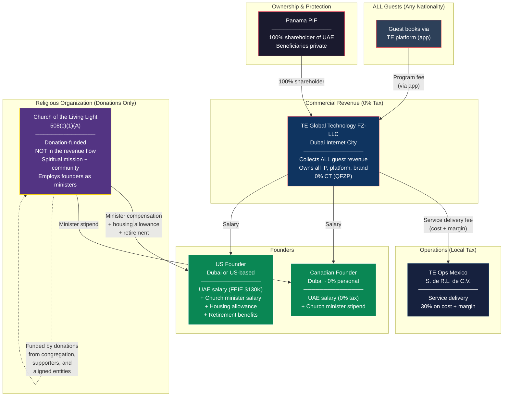
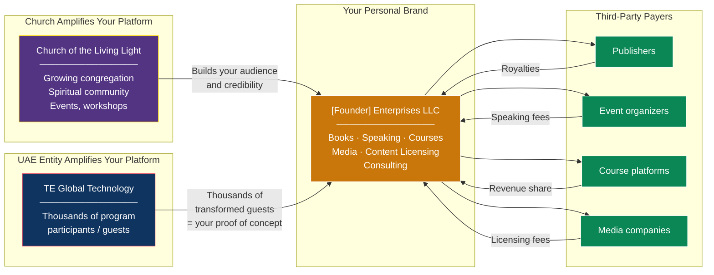
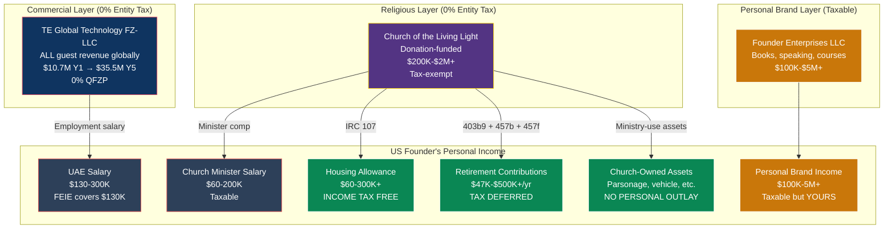
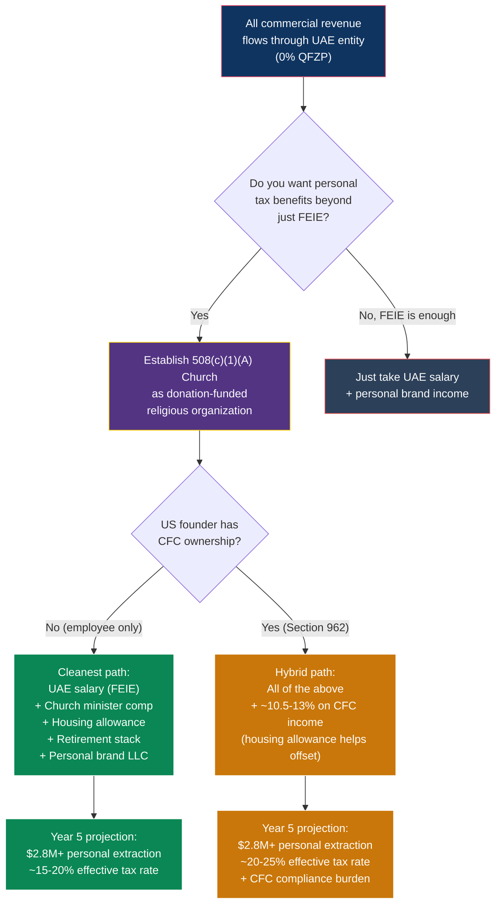

# Revised 508(c)(1)(A) Strategy: Church as Donation Entity, Not Revenue Entity

> **Document Status:** Revised model — supersedes revenue-routing approach in prior doc
> **Companion to:** [US_508C1A_RELIGIOUS_ORGANIZATION_STRATEGY.md](./US_508C1A_RELIGIOUS_ORGANIZATION_STRATEGY.md), [US_FOUNDER_WEALTH_EXTRACTION_PLAYBOOK.md](./US_FOUNDER_WEALTH_EXTRACTION_PLAYBOOK.md)
> **Last Updated:** February 2026

---

## 1. The Core Insight: Why Revenue Never Needs to Touch a US Entity

A US citizen booking a healing program through a UAE-based app and receiving services at a facility in Mexico creates **zero obligation** for that revenue to flow through a US entity.

```
US Guest → TE Platform (UAE app) → Stripe (UAE merchant) → TE Global Technology FZ-LLC (Dubai)
```

**There is no US nexus** because:

| Factor | Status |
|---|---|
| US employees | None — team is in Dubai |
| US office | None — office is in DIC |
| US agents | None — no one acts on behalf of the UAE entity in the US |
| US servers | Not required — platform can be hosted on global cloud infrastructure |
| Service delivery location | Mexico (Tulum), not the US |
| US customers | Having US *customers* does NOT create a US *trade or business* |

This is identical to how Spotify (Sweden), Shopify (Canada), Wise (UK), and thousands of SaaS companies collect from US customers without routing revenue through a US corporate entity. The customer's passport doesn't determine where the merchant is taxed.

**Bottom line:** ALL commercial revenue — from every guest, regardless of nationality — flows to the UAE entity at 0% QFZP. There is no tax reason to create a US revenue entity.

---

## 2. So What Is the Church Actually For?

The church is **not** a revenue collection vehicle. It's a genuine religious organization that:

1. **Receives donations** from supporters, congregation members, and aligned entities
2. **Operates the spiritual mission** — community gathering, worship, teaching, charitable work
3. **Employs the founders as ordained ministers** — unlocking powerful personal tax benefits
4. **Provides minister-specific tax advantages** that don't exist in any other employment structure

The church is the **personal tax optimization layer** for the US founder. The UAE entity is the **commercial revenue layer**. They serve completely different functions.

### The Revised Structure



### What Changed from the Prior Model

| Prior Model | Revised Model |
|---|---|
| US guest revenue flows through the church | **ALL revenue flows through the UAE entity** |
| Church is a revenue collection entity ($5-15M) | **Church is donation-funded ($200K-2M+)** |
| Church pays technology license fee to UAE entity | **No intercompany payments needed** |
| Complex transfer pricing between church and UAE | **No transfer pricing issues between church and UAE** |
| Risk of IRS arguing church is commercial entity | **Church is purely charitable/religious — much cleaner** |
| Church needs Stripe merchant account for programs | **Church just needs a bank account for donations** |

**The revised model is simpler, cleaner, and more defensible.** The church doesn't look like a commercial entity with a religious wrapper — it looks like what it is: a church.

---

## 3. Where Donations Come From

The church needs funding to operate and pay founders. Here are the legitimate donation sources:

### Source 1: The Founders Themselves

The founders receive salary from the UAE entity. They tithe / donate a portion to the church. This is a **personal charitable deduction** (up to 60% of AGI for cash to a church).

**Example:** US founder earns $200K from UAE entity. Donates $50K to the church. Gets a $50K charitable deduction on their personal return. The church uses this (plus other donations) to fund operations and minister compensation.

### Source 2: Program Participants / Congregation Members

Guests who go through the healing program and resonate with the mission donate to the church. This is separate from their program fee (which they paid to the UAE entity). The donation is:
- **Voluntary** (not a condition of the program)
- **Tax-deductible** for the donor (up to 60% AGI)
- **Not revenue** — it's a charitable contribution to support the mission

Many guests will naturally want to support the spiritual community that transformed their lives. A suggested donation or membership tithe is standard practice for churches.

### Source 3: The UAE Entity (Corporate Charitable Contribution)

The UAE entity can make charitable donations to the church. Under UAE tax law, qualifying charitable contributions are deductible. Under US tax law, the church receives them tax-free as a 501(c)(3)/508(c)(1)(A) organization.

**Important constraint:** This must be a genuine charitable contribution, not a disguised salary payment. If the UAE entity donates $2M to the church and the church immediately pays $1.5M to the founders, the IRS will see through it. The donation must fund the church's *mission*, and founder compensation must be a reasonable portion of the church's total spending.

### Source 4: Public Supporters and Philanthropists

As the church's mission grows (community programs, charitable healing for underserved populations, educational initiatives), it attracts donors who are not program participants. Grants from foundations, philanthropic contributions, and community support.

### Realistic Donation Scale

| Year | Founder Tithes | Congregation/Member Donations | Corporate/Other | Total Church Revenue |
|---|---|---|---|---|
| Year 1 | $50,000 | $50,000-100,000 | $50,000 | $150,000-200,000 |
| Year 3 | $100,000 | $200,000-500,000 | $100,000-200,000 | $400,000-800,000 |
| Year 5 | $150,000 | $500,000-1,500,000 | $200,000-500,000 | $850,000-2,150,000 |
| At scale | $200,000+ | $1,000,000-5,000,000+ | $500,000-2,000,000 | $1,700,000-7,200,000+ |

---

## 4. How the US Founder Gets Paid (Two Paychecks)

The US founder has **two employers**, each providing different benefits:

### Paycheck 1: UAE Entity (Commercial Salary)

| Component | Amount | Tax Treatment |
|---|---|---|
| Salary from TE Global Technology FZ-LLC | $130,000-300,000 | First $130K excluded via FEIE (if living in Dubai). Remainder taxed at marginal rate. |

This is straightforward employment income. The UAE entity pays you for your role as a director/executive. If you live in Dubai, FEIE shelters $130K. If you live in the US, it's fully taxable.

### Paycheck 2: Church (Minister Compensation)

| Component | Amount | Tax Treatment |
|---|---|---|
| Minister salary | $60,000-200,000 | Taxable as ordinary income |
| Housing allowance (IRC 107) | $60,000-300,000+ | **Excluded from income tax** (no cap). Subject to SE tax (~15.3%), or $0 if Form 4361 filed. |
| 403(b)(9) retirement | $23,500-70,000 | **Tax-deferred** (and distributions can be tax-free as housing allowance in retirement) |
| 457(b) deferred comp | $23,500 | **Tax-deferred** |
| 457(f) nonqualified deferred comp | Variable (scales with church revenue) | **Tax-deferred** until vesting (no dollar cap) |

**The housing allowance is the key.** It has no dollar cap, it's excluded from income tax, and it applies regardless of whether you also receive a UAE salary. You can receive salary from two employers AND a housing allowance from the church simultaneously.

### Combined Compensation Scenarios

**Scenario A: US Founder Living in Dubai**

| Source | Amount | Federal Income Tax | SE Tax | Total Tax |
|---|---|---|---|---|
| UAE salary | $200,000 | $0 (FEIE covers $130K) + ~$15,400 on remainder | N/A (employee) | $15,400 |
| Church minister salary | $100,000 | ~$22,000 | $0 (minister = SE, but opt out with 4361) | $22,000 |
| Church housing allowance | $120,000 | **$0** | $0 (Form 4361) | **$0** |
| 403(b)(9) + 457(b) contributions | $47,000 | **$0** (deferred) | N/A | **$0** |
| **Total income: $467,000** | | | | **$37,400 tax (8.0%)** |

**Scenario B: US Founder Living in the US**

| Source | Amount | Federal Income Tax | SE Tax | Total Tax |
|---|---|---|---|---|
| UAE salary | $200,000 | ~$38,600 (no FEIE) | N/A | $38,600 |
| Church minister salary | $100,000 | ~$24,000 | $0 (Form 4361) | $24,000 |
| Church housing allowance | $150,000 | **$0** | $0 (Form 4361) | **$0** |
| 403(b)(9) + 457(b) contributions | $47,000 | **$0** (deferred) | N/A | **$0** |
| **Total income: $497,000** | | | | **$62,600 tax (12.6%)** |

---

## 5. The Church's Spending — Why Reasonable Compensation Works

For the IRS to accept founder compensation, it must be a **reasonable proportion** of the church's total budget. Here's how that works:

### Church Budget Model (Year 3, ~$600K in donations)

| Expense | Amount | % of Budget |
|---|---|---|
| Minister compensation (US founder: salary + housing) | $200,000 | 33% |
| Minister compensation (Canadian founder: stipend) | $30,000 | 5% |
| Community programming (free workshops, meditation, outreach) | $100,000 | 17% |
| Charitable grants (scholarships for healing programs) | $80,000 | 13% |
| Retirement plan contributions | $47,000 | 8% |
| Administrative (bookkeeping, legal, insurance) | $50,000 | 8% |
| Worship platform, technology, communications | $30,000 | 5% |
| Facility costs (worship space rental, retreats) | $40,000 | 7% |
| Reserve / savings | $23,000 | 4% |
| **Total** | **$600,000** | **100%** |

**Key benchmark:** Average churches spend 49-52% of budget on all staff compensation. At 38% for both founders combined, this is well within norms. Even large churches with $50M+ budgets typically spend 30-40% on compensation.

### Scaling Compensation with Church Growth

| Church Annual Donations | Defensible Founder Total Comp (salary + housing + retirement) | Comparable Basis |
|---|---|---|
| $200K | $80,000-100,000 | Small church pastor |
| $600K | $150,000-250,000 | Mid-size church pastor |
| $2M | $300,000-500,000 | Large church senior pastor |
| $5M+ | $500,000-1,000,000 | Megachurch pastor / large nonprofit CEO |

Compensation grows as the church grows. The rebuttable presumption protects you at every stage as long as the board uses comparables, is independent, and documents the decision.

---

## 6. The Personal Brand Play (Still Works — Even Better)

The personal brand channel from the prior document is **completely independent** of whether the church collects revenue or donations. In fact, it works better in this model because there's no ambiguity about commercial vs. religious activity.



**The flywheel:** Both the church AND the UAE entity build your personal platform. Third parties pay you. This income is taxable but unlimited and entirely yours. At scale ($1M-5M+ in personal brand income), this is where the real "distribution-equivalent" money comes from.

---

## 7. The Remaining CFC/GILTI Question

The church does **not** solve the CFC/GILTI problem for the US founder. That's a separate issue tied to *ownership* of the UAE entity (via PIF), not to where revenue flows.

| Question | Answer |
|---|---|
| Does routing revenue through UAE instead of a US church avoid US tax? | **At the entity level: yes.** The UAE entity pays 0%. No US entity = no US corporate tax. |
| Does the US founder still owe personal tax on CFC income? | **If they have ownership: yes.** GILTI/Subpart F applies to the US founder's attributed share of the CFC, regardless of where customers are. |
| Does the church help with this? | **No.** The church is a separate entity. CFC rules apply to the US founder's personal ownership of the UAE entity through the PIF. |

### Options for the US Founder's CFC Exposure (Unchanged)

| Option | How It Works | US Founder's Tax on CFC Income |
|---|---|---|
| **A: No ownership** | Canadian founder's PIF owns 100% of UAE entity. US founder is employee only. | $0 CFC tax. Only salary is taxed (FEIE applies). |
| **B: Section 962 election** | US founder has ownership. Elects corporate tax rates on GILTI. | ~10.5-13% on attributed CFC income |
| **C: Church minister benefits offset the pain** | Use Option B, but the church's tax-free housing allowance and retirement benefits reduce overall personal tax burden | ~10.5-13% on CFC income, partially offset by housing exclusion + deferred comp |

**Option A + Church is the cleanest path:**
- Canadian PIF owns 100% of UAE entity → no CFC attribution to US founder
- US founder earns salary from UAE entity ($130K FEIE-excluded if in Dubai)
- US founder earns minister compensation + housing allowance from church (partially/fully tax-free)
- US founder builds personal brand through LLC (taxable but unlimited)
- **Zero CFC. Zero GILTI. Zero Subpart F. Zero Form 5471.**

---

## 8. Revised Wealth Map



---

## 9. Year-by-Year Projection (Revised)

### Year 1

| Channel | Amount | Tax | Net |
|---|---|---|---|
| UAE salary (in Dubai, FEIE) | $200,000 | $15,400 | $184,600 |
| Church minister salary | $60,000 | $13,200 | $46,800 |
| Church housing allowance | $80,000 | $0 (Form 4361) | $80,000 |
| Church retirement (403b + 457b) | $47,000 | $0 (deferred) | $47,000 deferred |
| Personal brand (books, speaking) | $50,000 | $11,000 | $39,000 |
| Church-owned assets (lifestyle value) | $50,000 | $0 | $50,000 |
| **Total** | **$487,000** | **$39,600** | **$447,400 (8.1% effective)** |

### Year 3

| Channel | Amount | Tax | Net |
|---|---|---|---|
| UAE salary | $250,000 | $26,400 | $223,600 |
| Church minister salary | $120,000 | $26,400 | $93,600 |
| Church housing allowance | $150,000 | $0 | $150,000 |
| Church retirement (403b + 457b) | $47,000 | $0 (deferred) | $47,000 deferred |
| 457(f) deferred comp | $200,000 | $0 (deferred) | $200,000 deferred |
| Personal brand | $500,000 | $150,000 | $350,000 |
| Church-owned assets | $100,000 | $0 | $100,000 |
| **Total** | **$1,367,000** | **$202,800** | **$917,200 + $247,000 deferred (14.8%)** |

### Year 5

| Channel | Amount | Tax | Net |
|---|---|---|---|
| UAE salary | $300,000 | $37,400 | $262,600 |
| Church minister salary | $200,000 | $48,000 | $152,000 |
| Church housing allowance | $250,000 | $0 | $250,000 |
| Church retirement (403b + 457b) | $47,000 | $0 (deferred) | $47,000 deferred |
| 457(f) deferred comp | $500,000 | $0 (deferred) | $500,000 deferred |
| Personal brand | $2,000,000 | $600,000 | $1,400,000 |
| Church-owned assets | $200,000 | $0 | $200,000 |
| **Total** | **$3,497,000** | **$685,400** | **$2,264,600 + $547,000 deferred (19.6%)** |

---

## 10. Why This Model Is More Defensible Than Revenue-Routing

| Risk | Revenue-Routing Model (Prior Doc) | Donation Model (This Doc) |
|---|---|---|
| IRS argues church is commercial entity | **High** — church collects $5-15M in program fees, looks like a business | **Low** — church receives donations, looks like a church |
| Transfer pricing challenges | **Medium** — church-to-UAE license fee needs benchmarking study | **None** — no intercompany transactions |
| Foreign control allegations | **Medium** — complex money flows between church and UAE entity | **Low** — church and UAE entity are financially independent |
| "Sham entity" argument | **Medium** — why does revenue need to go through a church? | **Low** — the church exists for its religious mission, period |
| Complexity | **High** — two revenue streams, intercompany agreements, split processing | **Low** — clean separation: UAE = commerce, Church = spirit |
| Founder inurement risk | **High** — church has $15M revenue, founder takes $1M+ | **Lower** — church has $600K-2M in donations, founder comp is proportional |

---

## 11. What the Church Does Do (It's Still Powerful)

Even without routing revenue through it, the church provides:

| Benefit | Value | Mechanism |
|---|---|---|
| **Tax-free housing** | $60,000-300,000+/year | IRC 107 housing allowance (no cap) |
| **Tax-deferred retirement** | $47,000-500,000+/year | 403(b)(9) + 457(b) + 457(f) |
| **Tax-free retirement distributions** | Potentially millions over lifetime | 403(b)(9) distributions designated as housing allowance |
| **SE tax opt-out** | Saves 15.3% on all minister compensation | Form 4361 |
| **Church-owned lifestyle assets** | $50,000-200,000+/year in value | Parsonage, vehicles, equipment (ministry use) |
| **Charitable deduction for donations** | Up to 60% of AGI | Founders' tithes to the church are deductible |
| **Platform for personal brand** | Indirect but enormous | Audience, credibility, community |
| **No Form 990 transparency** | Privacy | Church finances are not publicly disclosed |
| **Church Audit Procedures Act** | Protection | IRS faces extraordinary barriers to audit |

**The church isn't the revenue engine — it's the personal tax shield.** It takes what would otherwise be fully-taxable income (salary from UAE entity) and converts a significant portion into tax-free (housing allowance) and tax-deferred (retirement) benefits.

---

## 12. Updated Decision Tree



---

## 13. Summary: The Clean Model

| Entity | Role | Revenue/Funding | Tax |
|---|---|---|---|
| **TE Global Technology FZ-LLC** | Commercial platform. Collects ALL guest revenue globally. | $10.7M Y1 → $35.5M Y5 | 0% (QFZP) |
| **Panama PIF** | Owns UAE entity. Asset protection. | N/A (holding entity) | 0% |
| **TE Ops Mexico** | Facility operations in Tulum. | Cost + 8-12% margin | 30% on margin |
| **Church of the Living Light** | Religious mission. Donation-funded. Employs founders as ministers. | $200K-2M+ in donations | 0% (exempt) |
| **Founder Enterprises LLC** | Personal brand monetization. Books, speaking, courses. | $100K-5M+ | Ordinary income rates |

**The church never touches commercial revenue. The UAE entity never touches donations. Clean separation. Clean defense.**

---

*This document refines the prior 508(c)(1)(A) strategy to reflect the correct insight: commercial revenue belongs in the UAE entity regardless of customer nationality. The church serves as a genuine religious organization and personal tax optimization vehicle for the founders, funded by donations rather than program fees.*
