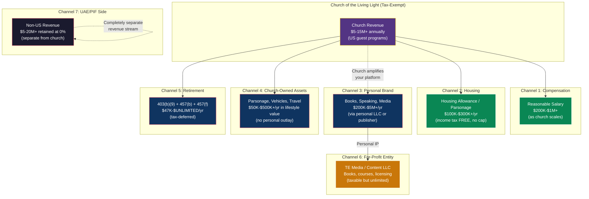
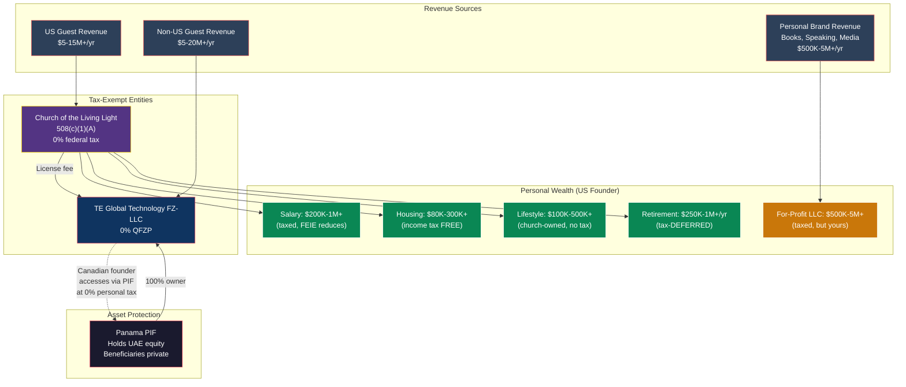

# US Founder Wealth Extraction Playbook

> **Document Status:** Exploratory — requires religious nonprofit counsel + tax counsel
> **Companion to:** [US_508C1A_RELIGIOUS_ORGANIZATION_STRATEGY.md](./US_508C1A_RELIGIOUS_ORGANIZATION_STRATEGY.md)
> **Last Updated:** February 2026

---

## 1. The Hard Truth First

**There is no such thing as a "distribution" from a nonprofit.** The word doesn't exist in nonprofit law. You cannot write yourself a dividend check from a 508(c)(1)(A) church. If you try, it's called **private inurement**, and it's an absolute prohibition — any amount, no matter how small, can trigger loss of tax-exempt status plus a 25% excise tax (escalating to 200% if not corrected).

**But here's what the data shows:** Kenneth Copeland is worth $300-750M. Joel Osteen is worth $100M+. T.D. Jakes built a $500M+ media empire alongside his church. Steven Furtick built a 16,000 sq. ft. home on undisclosed compensation from a $108M/year church. None of them have lost their tax-exempt status.

**They don't take "distributions." They use seven parallel mechanisms that are each individually legal, and in combination, generate personal wealth in the millions annually.** This document maps every one of those mechanisms to TE's structure, with real numbers.

---

## 2. The Seven Wealth Channels

---

## 3. Channel 1: Reasonable Compensation (Salary)

### How It Works

The church pays you a salary for your role as an ordained minister and director. This is **taxable** as ordinary income — but it's the only part that is.

### What "Reasonable" Actually Means at Scale

The IRS doesn't define a dollar cap on reasonable compensation. It's determined by **comparables** — what leaders of similarly sized organizations earn. Here's what the data shows:

| Church/Org Annual Revenue | Comparable Senior Leader Salary | Source |
|---|---|---|
| $10-20M | $200,000-500,000 | NACBA, Barna surveys |
| $20-50M | $350,000-800,000 | Form 990 data from large nonprofits |
| $50-100M | $500,000-1,500,000 | Megachurch comparables, university presidents |
| $100M+ | $800,000-2,000,000+ | Furtick (est. $545K+), Meyer ($900K pre-reform), hospital system CEOs |

**Steven Furtick's model:** Elevation Church ($108M revenue) pays Furtick an undisclosed salary set by a Board of Overseers composed of other megachurch pastors, using an outside compensation study. No one has successfully challenged it.

**The rebuttable presumption:** If your Spiritual Council (1) has no conflicts of interest, (2) reviews comparable data from 3+ similar organizations, and (3) documents the decision in writing — the IRS bears the burden of proving compensation is unreasonable. In practice, this is an extremely difficult burden for the IRS to meet.

### TE Projection

| TE Church Revenue | Defensible Founder Salary (Each) | Taxable Amount (FEIE applies if Dubai-based) |
|---|---|---|
| Year 1: ~$5M | $150,000-250,000 | $20K-$120K (after $130K FEIE) |
| Year 3: ~$10M | $250,000-500,000 | $120K-$370K |
| Year 5: ~$15M+ | $400,000-800,000 | $270K-$670K |

**Key point:** As the church grows, your "reasonable" compensation grows with it. At $50M+ church revenue (multi-location), $1M+ salary is within the comparable range.

**Tax on this channel:** Ordinary income rates (22-37%), reduced by FEIE ($130K exclusion if living in Dubai). This is the one channel that gets taxed — and it's the smallest piece of the puzzle.

---

## 4. Channel 2: Housing Allowance (IRC 107) — The Crown Jewel

### How It Works

As an ordained minister, the church designates a portion of your compensation as a "housing allowance." This amount is **completely excluded from federal income tax.** There is no dollar cap.

### The Three-Prong Limit

The exclusion is limited to the **least** of:
1. The amount **officially designated** by the church board (in advance of the tax year)
2. The amount **actually spent** on housing (mortgage/rent, utilities, furnishings, insurance, repairs, maintenance, property tax)
3. The **fair rental value** of the home (furnished, including utilities)

### What This Looks Like in Practice

| Home Value | Fair Rental Value (Annual) | Housing Costs (Annual) | Tax-Free Exclusion |
|---|---|---|---|
| $500,000 | $30,000-40,000 | $35,000-50,000 | $30,000-40,000 |
| $1,000,000 | $60,000-80,000 | $70,000-100,000 | $60,000-80,000 |
| $2,000,000 | $120,000-160,000 | $130,000-200,000 | $120,000-160,000 |
| $3,000,000+ | $180,000-250,000+ | $200,000-300,000+ | $180,000-250,000+ |

**The Dubai angle:** If you live in Dubai, your housing costs could be substantial (luxury apartments run $60,000-150,000+/year). If living in the US, the exclusion scales with the home you choose.

**Church-owned parsonage alternative (IRC 107(1)):** Instead of a cash housing allowance, the church buys the home outright. You live in it as part of your ministerial duties. The fair rental value is excluded from your income AND the property is exempt from property tax in most states. This is the Kenneth Copeland model — his $7M church-owned parsonage saves him ~$150K/year in property taxes alone.

### The One Catch

The housing allowance is still subject to **self-employment tax** (~15.3%). So on a $150K housing allowance, you'd pay ~$23K in SE tax. But you save $33K-55K in income tax (depending on bracket). Net savings: $10K-32K.

### Can You Opt Out of SE Tax?

Yes. Ministers can file **Form 4361** to opt out of self-employment tax entirely if they are "conscientiously opposed to the acceptance of public insurance benefits." This eliminates the 15.3% SE tax on both salary and housing allowance. The trade-off: you lose Social Security and Medicare eligibility. For a founder with substantial wealth, this may be an acceptable trade.

---

## 5. Channel 3: Personal Brand Monetization — The Joel Osteen Model

### How It Works

You are a spiritual leader with a growing platform. You write books, give talks, create courses, produce media content. The church amplifies your personal brand through its audience and platform — but **you own the IP personally** (or through your own LLC), and third parties pay you directly.

This is how Joel Osteen built a $100M+ net worth while taking **zero salary** from Lakewood Church.

### The Key Mechanisms

| Income Source | How It Works | Tax Treatment |
|---|---|---|
| **Book royalties** | Publisher pays YOU (or your LLC) for rights to your spiritual teachings, methodology, personal story. Church has no claim on these funds. | Taxable as ordinary income or self-employment income |
| **Speaking fees** | External organizations pay YOU $10K-200K per appearance. Church may facilitate introductions but doesn't collect the fee. | Taxable as self-employment income |
| **Online courses** | You create digital courses on your methodology, sold through your personal LLC or through a platform (Teachable, etc.) | Taxable as business income |
| **Media / podcast** | Advertising, sponsorships, licensing deals for your personal media content. | Taxable as business income |
| **Content licensing** | Your personal LLC licenses your methodology, frameworks, brand to third parties. | Taxable as royalty or business income |

### Critical Legal Structure

The church and your personal brand must be **legally separated:**

1. **Written agreement:** A compensation agreement or creative license agreement stating that content you create (books, courses, media) belongs to YOU, not the church. Without this, the Copyright Act's "work for hire" doctrine means the church owns everything you create as an employee.

2. **No church resources for personal IP:** Don't use church staff, office space, or equipment to produce your personal content (or if you do, pay the church fair market value for those resources).

3. **Personal LLC:** Establish a for-profit LLC that holds your personal IP, manages book deals, collects speaking fees, and handles media contracts. This is the T.D. Jakes Enterprises model.

### TE Projection

| Year | Book Income | Speaking/Events | Courses/Media | Total Personal Brand |
|---|---|---|---|---|
| Year 1-2 | $50,000-100,000 | $25,000-50,000 | $10,000-25,000 | $85,000-175,000 |
| Year 3-4 | $200,000-500,000 | $100,000-300,000 | $50,000-150,000 | $350,000-950,000 |
| Year 5+ | $500,000-2,000,000 | $200,000-1,000,000 | $100,000-500,000 | $800,000-3,500,000 |

**This is all taxable income.** But it's income earned through your personal platform, not extracted from the church. The church's role is to build the audience and credibility that makes your personal brand valuable.

---

## 6. Channel 4: Church-Owned Assets — The Copeland Model

### How It Works

The church owns assets that you use in your ministerial capacity. You don't own them personally — you can't sell them — but you have full use of them as part of your role. This creates significant **lifestyle value** without taxable income (if properly structured for ministry use).

### What the Church Can Own

| Asset | Ministry Justification | Value |
|---|---|---|
| **Parsonage** (primary home) | Minister must be available to congregation; housing provided as condition of service | $1M-7M+ (Copeland: $7M) |
| **Retreat property** | Minister needs private retreat space for prayer, preparation, spiritual development | $500K-3M+ |
| **Vehicles** | Minister needs reliable transportation for pastoral duties, hospital visits, speaking engagements | $50K-150K |
| **Technology / office** | Minister requires equipment for sermon preparation, content creation, communication | $10K-50K |
| **Travel** | Ministry-related conferences, speaking engagements, missionary work, pastor retreats | $25K-200K/year |

### The Rules

- **Ministry use must be primary.** If an asset is used 80%+ for ministry purposes, it's defensible as church property. If it's used primarily for personal recreation, it's a taxable fringe benefit.
- **Personal use must be reported.** Any personal use of church-owned assets (e.g., personal flights on a church aircraft) must be reported as taxable compensation. The IRS values personal flights at $52.35 terminal charge + $0.28/mile.
- **The Form 990 gap.** Churches don't file Form 990, which means there's no public disclosure of church-owned assets or personal use by insiders. This creates an information asymmetry that benefits churches — the IRS simply doesn't have the data to investigate in most cases.
- **The Senate investigation lesson.** The Grassley investigation flagged personal use of church aircraft for ski trips and game ranches. The key: if you use church assets, keep it ministry-related and document the ministry purpose.

### The Practical Play for TE

The church acquires a property in Tulum (or wherever you establish primary operations) as a minister's residence. You live there as part of your role. The church also owns or leases vehicles, covers travel for ministry purposes, and provides technology/equipment.

**Annual lifestyle value:** $100K-500K+ in housing, transportation, travel, and equipment — none of which requires personal outlay.

**This isn't income.** You don't receive cash. You receive the *use* of assets in connection with your ministry. The church owns everything. If you leave the ministry, you leave the assets. But while you serve, you live in them.

---

## 7. Channel 5: Retirement Vehicles — The Hidden Powerhouse

### How It Works

Churches can offer retirement plans with features unavailable to secular employers. When combined, these create massive tax-deferred wealth accumulation.

### The Stack

| Vehicle | Annual Contribution | Tax Treatment | Notes |
|---|---|---|---|
| **403(b)(9)** Church Retirement Plan | Up to $23,500 employee + employer match (total limit ~$70,000) | Tax-deferred. AND distributions can be designated as housing allowance (tax-free under IRC 107!) | Only available to church employees |
| **457(b)** Deferred Comp | Up to $23,500 | Tax-deferred | Stacks on TOP of 403(b) limits |
| **457(f)** Nonqualified Deferred Comp | **Unlimited** | Tax-deferred until vesting | Subject to "substantial risk of forfeiture" |

### The 457(f) — Unlimited Deferred Compensation

This is the most powerful tool. The church establishes a nonqualified deferred compensation plan with **no dollar limit on annual deferrals.** The catch: the amount must be subject to a "substantial risk of forfeiture" — meaning you lose it if you leave before a certain date or fail to meet performance conditions.

**Example:** The church establishes a 457(f) plan that vests $500,000/year for the senior minister, contingent on completing 5 years of service. If you stay 5 years, $2.5M vests and becomes taxable income in the year of vesting. Until then, it's not taxed.

**Why this matters for TE:** In early years, you take modest salary. The church simultaneously funds a 457(f) plan with large deferred amounts. In year 5 or 10, when the plan vests, you receive a multi-million dollar payout. You pay tax on it then — but you've deferred taxation for years, and the church has been accumulating assets tax-free the entire time.

### The Retirement Housing Allowance Superpower

Here's the rarely-discussed benefit: when you retire and take distributions from a **403(b)(9) church retirement plan**, you can designate a portion of those distributions as **housing allowance** — making them **tax-free** under IRC 107. This is the only retirement plan in the US tax code where distributions can be received income-tax-free (without being a Roth).

**Example:** You accumulate $3M in a 403(b)(9) over 20 years. In retirement, you designate $100K/year as housing allowance. That $100K comes out **tax-free** (income tax, not SE tax — and in retirement, SE tax doesn't apply to 403(b)(9) distributions). This is an extraordinary benefit unique to clergy.

### Combined Annual Tax Shelter

| Plan | Annual Amount |
|---|---|
| 403(b)(9) employee + employer | $70,000 |
| 457(b) | $23,500 |
| 457(f) | $500,000+ (your choice) |
| **Total deferred annually** | **$593,500+** |

Over 10 years: $5.9M+ in tax-deferred wealth accumulation. With investment returns, potentially $8-10M+.

---

## 8. Channel 6: For-Profit Hybrid Entity — The T.D. Jakes Model

### How It Works

You own a **separate for-profit LLC** that operates alongside the church. The church builds your platform and audience. Your LLC monetizes your personal brand, IP, and business ventures.

### T.D. Jakes' Blueprint

| Entity | Function | Revenue |
|---|---|---|
| The Potter's House of Dallas Inc. | 501(c)(3) megachurch, 30,000 members | Church revenue (exempt) |
| T.D. Jakes Enterprises LLC | For-profit: books, plays, record label, films | $500M+ lifetime gross |
| T.D. Jakes Real Estate Ventures | For-profit: property development | $150M+ projects |

Jakes maintains a "carefully constructed firewall" between church and business. The church doesn't fund his businesses. His businesses don't fund the church (beyond voluntary donations). But they share the same personal brand — T.D. Jakes.

### How This Applies to TE

| Entity | Function | Revenue |
|---|---|---|
| **Church of the Living Light** | 508(c)(1)(A) church. US healing programs. | Exempt |
| **[Founder's Name] Enterprises LLC** | For-profit. Books, courses, speaking, content licensing, consulting. | Taxable (but owned by you) |
| **TE Global Technology FZ-LLC** | UAE entity. Platform IP, non-US revenue. | 0% QFZP |

**The flywheel:** The church grows → your personal platform grows → your LLC monetizes the platform → you build personal wealth. The church doesn't pay the LLC (that would be inurement). Third parties pay the LLC because your platform (amplified by the church) makes your personal brand valuable.

### Revenue Potential

At scale (5+ years, multiple locations, strong personal brand):

| LLC Revenue Source | Annual Potential |
|---|---|
| Book royalties (published by major publisher) | $500K-5M+ |
| Online courses and digital products | $200K-2M+ |
| Speaking and consulting | $200K-1M+ |
| Media licensing and content deals | $100K-1M+ |
| **Total LLC revenue** | **$1M-9M+** |

**This is taxable income.** But it's YOUR money in YOUR LLC. No nonprofit restrictions. No board approval. No "reasonable compensation" test. You're a business owner earning income from your personal IP and brand.

**The trade-off:** You pay tax on this income (at ordinary or capital gains rates, depending on structure). But you also have full control and ownership.

---

## 9. Channel 7: The UAE/PIF Side — Non-US Revenue

### How It Works

The church handles US-source revenue. The UAE entity handles everything else. The UAE entity is owned by the Panama PIF, which accumulates wealth at 0% corporate tax. The Canadian founder accesses PIF distributions at 0% personal tax (as a Dubai resident with no home country taxation).

### The US Founder's Position

The US founder's relationship to the UAE/PIF structure is a separate question from the church. Options:

| Approach | How US Founder Benefits | Tax on Non-US Revenue |
|---|---|---|
| **No ownership (employee only)** | Salary from UAE entity (FEIE excludes $130K). No equity upside. | 0% on entity level. Marginal rate on salary above $130K. |
| **PIF beneficiary + Section 962** | CFC income inclusion at ~10.5-13% effective rate. | ~10.5-13% personal tax on attributed income |
| **Indirect benefit through church** | UAE entity pays technology license fee to church (exempt). Church uses funds for mission (tax-free). Founder benefits through church compensation channels. | 0% on church level. Only founder salary/benefits taxed. |

**The third option is the most interesting:** If the UAE entity pays an arm's-length technology license fee to the church (for use of the platform to serve US guests), that money enters the tax-exempt church and is used for the religious mission. The US founder benefits through the compensation channels described above. No CFC/GILTI. No Subpart F. The money transitions from a 0% foreign entity to a 0% domestic entity.

---

## 10. Putting It All Together: Annual Wealth Extraction Model

### Year 1 (Church Revenue: ~$5M)

| Channel | Gross Amount | Tax Paid | Net to Founder |
|---|---|---|---|
| Salary | $200,000 | $15,400 (after FEIE if in Dubai) | $184,600 |
| Housing Allowance | $80,000 | $12,240 (SE tax only) | $67,760 |
| Personal Brand (books, speaking) | $85,000 | $18,700 (SE + income) | $66,300 |
| Church-Owned Assets (lifestyle value) | $100,000 | $0 (ministry use) | $100,000 |
| Retirement (403b + 457b) | $47,000 | $0 (deferred) | $47,000 deferred |
| 457(f) Deferred Comp | $200,000 | $0 (deferred) | $200,000 deferred |
| **Total** | **$712,000** | **$46,340** | **$665,660 current + $247,000 deferred** |

**Effective tax rate on total wealth extraction: 6.5%**

### Year 5 (Church Revenue: ~$15M+)

| Channel | Gross Amount | Tax Paid | Net to Founder |
|---|---|---|---|
| Salary | $600,000 | $173,600 (after FEIE if in Dubai) | $426,400 |
| Housing Allowance | $200,000 | $30,600 (SE tax only, or $0 with Form 4361) | $169,400-200,000 |
| Personal Brand (books, speaking, courses) | $1,500,000 | $450,000 | $1,050,000 |
| Church-Owned Assets (lifestyle value) | $300,000 | $0 (ministry use) | $300,000 |
| Retirement (403b + 457b) | $47,000 | $0 (deferred) | $47,000 deferred |
| 457(f) Deferred Comp | $1,000,000 | $0 (deferred) | $1,000,000 deferred |
| For-Profit LLC (media/content) | $2,000,000 | $600,000 | $1,400,000 |
| **Total** | **$5,647,000** | **$1,254,200** | **$3,345,800 current + $1,047,000 deferred** |

**Effective tax rate on total wealth extraction: 22.2%**

But consider: without the church structure, the $15M in US revenue would be taxed at 21% corporate + dividend tax, or flow through as GILTI at 10.5-13%. The church eliminates the first layer entirely. You're only taxed on what you personally extract.

### Year 5 Comparison: Church Structure vs. Alternatives

| Structure | Tax on $15M US Revenue | Tax on Founder Extraction | Total Tax | Effective Rate |
|---|---|---|---|---|
| **All-US C-Corp** | $3,150,000 (21% CT) | + dividend tax on distributions | ~$4.2M+ | ~28%+ of revenue |
| **UAE + GILTI (Section 962)** | $1,575,000-1,950,000 | + income tax on salary | ~$1.8-2.2M | ~12-15% of revenue |
| **508(c)(1)(A) Church** | **$0** | $1,254,200 on personal extraction | **$1.25M** | **~8.4% of revenue** |

---

## 11. What You Absolutely Cannot Do

These will destroy the structure:

| Action | Why It Fails | Consequence |
|---|---|---|
| **Write yourself a "distribution" or "dividend" from the church** | Private inurement. Absolute prohibition. | Loss of tax-exempt status. 25% excise tax + 200% if uncorrected. |
| **Have the church "donate" to you personally** | Private inurement. A church cannot make charitable donations to its own insiders. | Same as above. |
| **Pay yourself compensation not approved by independent board** | Automatic excess benefit transaction. | 25% excise tax + 200% penalty. |
| **Use church assets primarily for personal purposes without reporting** | Taxable fringe benefit at minimum. Inurement if egregious. | Back taxes + penalties. Potential loss of exemption. |
| **Let the PIF/UAE entity control church decisions** | Foreign control → loss of independent tax-exempt status. | Loss of exemption. |
| **Make the church a conduit (pass revenue through to personal accounts)** | Sham entity / substance-over-form. | Loss of exemption. Potential fraud charges. |
| **Pay your personal LLC from church funds at above-market rates** | Related-party excess benefit transaction. | 25% excise tax + 200% penalty. |

### The Bright Lines

1. **All compensation must be approved by disinterested board members** with comparable data and documented rationale
2. **All related-party transactions must be at arm's length** (if your LLC provides services to the church, it charges market rates — no more, no less)
3. **The church must operate for its religious mission, not for your personal enrichment.** The test: would the church still make sense if you were hit by a bus tomorrow? If the answer is no, it's a personal vehicle disguised as a church.
4. **Church assets stay with the church.** If you leave, the parsonage stays. The retirement plan vests on its schedule. The church continues its mission.

---

## 12. How Other Churches Actually Get Away With It

### The Structural Advantages Churches Have

| Advantage | What It Means |
|---|---|
| **No Form 990** | The public has zero visibility into church finances. No one knows what you earn unless you disclose it. |
| **Church Audit Procedures Act (Section 7611)** | IRS cannot audit a church without high-level Treasury official approval, written notice, 90-day waiting periods, and a 2-year time limit. This makes audits rare and difficult. |
| **No routine monitoring** | Without Form 990 data, the IRS has no baseline to flag anomalies. They don't know your compensation, your assets, or your transactions. |
| **Rebuttable presumption** | If the board follows the three-step process, the IRS must prove you WRONG — not the other way around. |
| **Self-regulatory environment** | ECFA membership is voluntary. No mandatory external oversight of church finances. |
| **Political protection** | Churches have enormous political constituency. Congress has shown zero appetite for increasing church oversight (see: Grassley investigation producing zero legislation). |

### The Grassley Investigation Lesson

In 2007, Senator Grassley investigated six televangelists for potential abuses. What happened?

- **Two cooperated** (Joyce Meyer, Benny Hinn) and reformed voluntarily. No penalties.
- **Four refused** to provide information. No subpoenas were issued. No penalties.
- **Zero legislation** resulted. Churches remain exempt from Form 990.
- **The investigation ended** with a report and a recommendation for voluntary self-regulation.

**The takeaway:** Even when Congress directly investigated the most extreme cases of church wealth, nothing happened. The structural protections are robust.

### What TE Should Learn From This

1. **Voluntary transparency is your best protection.** Joyce Meyer cooperated, reformed, and emerged stronger. Defiance creates risk; transparency creates trust.
2. **Join ECFA** (Evangelical Council for Financial Accountability) or equivalent. Voluntary audits and governance standards provide a shield against accusations.
3. **Keep compensation defensible.** You don't need to be at the extreme end. A $600K salary from a $15M church is conservative by megachurch standards. Furtick takes $545K+ from a $108M church.
4. **Separate personal brand income from church income.** This is the single most important structural decision. If Osteen took $10M from Lakewood Church, that would be inurement. But $10M from Simon & Schuster for book royalties? That's personal income from a third party.

---

## 13. The Complete Wealth Map

---

## 14. Answers to Your Specific Questions

### "Could it be a donation on the church's behalf to me as the individual?"

**No.** A church cannot make charitable donations to its own insiders. That's textbook private inurement. However, the church CAN:
- Pay you **reasonable compensation** for services rendered
- Provide you **housing** (allowance or parsonage)
- Fund your **retirement** (403(b)(9), 457(b), 457(f))
- Own **assets** you use in ministry
- **Reimburse** documented ministry expenses under an accountable plan

### "How could we find a loophole for this?"

There is no loophole needed. The mechanisms above are **explicit provisions of the tax code** — IRC 107 (housing), IRC 403(b)(9) (church retirement), IRC 457(f) (unlimited deferred comp), IRC 508(c)(1)(A) (automatic exemption). These are features, not bugs. Congress created them intentionally for religious organizations.

### "How do the other churches get away with this?"

They don't "get away with" anything. They use the legal framework as designed:
- Reasonable compensation (approved by independent board with comparables)
- Housing allowance (IRC 107, no cap, upheld as constitutional in Gaylor v. Mnuchin)
- Personal brand monetization (separate from church, third-party income)
- Church-owned assets (ministry use documented)
- Retirement stacking (403(b)(9) + 457(b) + 457(f))
- No Form 990 disclosure + Church Audit Procedures Act protections

### "Would we just buy assets on the church's behalf?"

**Yes — that's exactly the model.** The church acquires assets used in its mission: property (parsonage, retreat centers), vehicles, equipment. You use these assets as part of your ministerial role. You don't own them, but you have full use. When the church owns a $3M home that you live in as minister, that's $3M in lifestyle value with zero personal income tax.

### "Can I legally take in millions in partner distributions?"

Not as "distributions" — that word is fatal in nonprofit law. But through the seven channels combined, you can legally extract **$700K-5.6M+ annually** (Year 1 to Year 5), with effective tax rates of **6.5-22%** depending on the mix. The mechanisms are salary, housing exclusion, personal brand income, church-owned assets, tax-deferred retirement, for-profit LLC, and the UAE/PIF side for non-US revenue.

---

## 15. Implementation Priorities

| Priority | Action | Why |
|---|---|---|
| 1 | **Engage religious nonprofit attorney** | Validate the entire structure before spending a dollar |
| 2 | **Formalize doctrine + ordination** | The sincerity of the religious framework is your foundational defense |
| 3 | **Establish independent Spiritual Council** | Board independence is the #1 structural protection against inurement claims |
| 4 | **Separate personal brand IP from church** | Written agreement from day one that personal content belongs to you |
| 5 | **Set up 457(f) plan early** | Start deferred comp accumulation immediately; the earlier you start, the more that compounds tax-free |
| 6 | **Designate housing allowance in advance** | Must be done BEFORE the tax year begins — retroactive designation is invalid |
| 7 | **Document everything** | Board minutes, compensation comparables, ministry-use logs, DEMPE records |

---

*This document explores legal tax optimization mechanisms available to ordained ministers of tax-exempt religious organizations. All mechanisms described are explicit provisions of the Internal Revenue Code, upheld by courts, and widely used by established religious organizations. Implementation requires validation by qualified religious nonprofit counsel and tax counsel. The spiritual framework and religious purpose must be genuine — using these structures without sincere religious activity constitutes fraud.*
