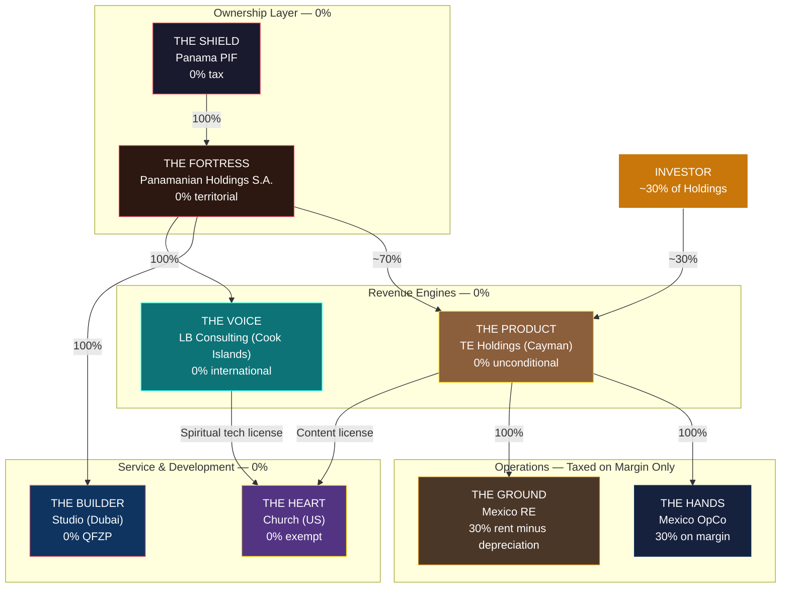
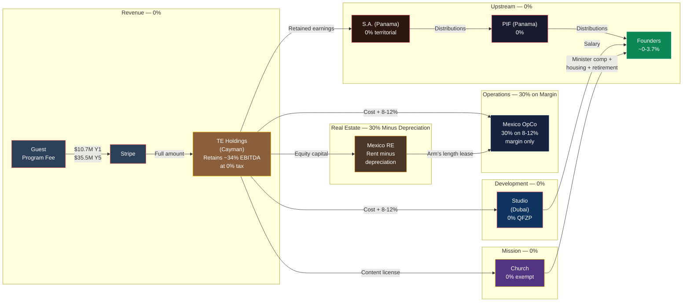
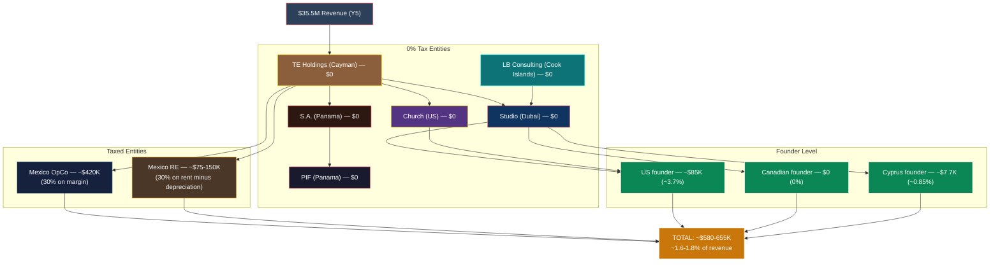
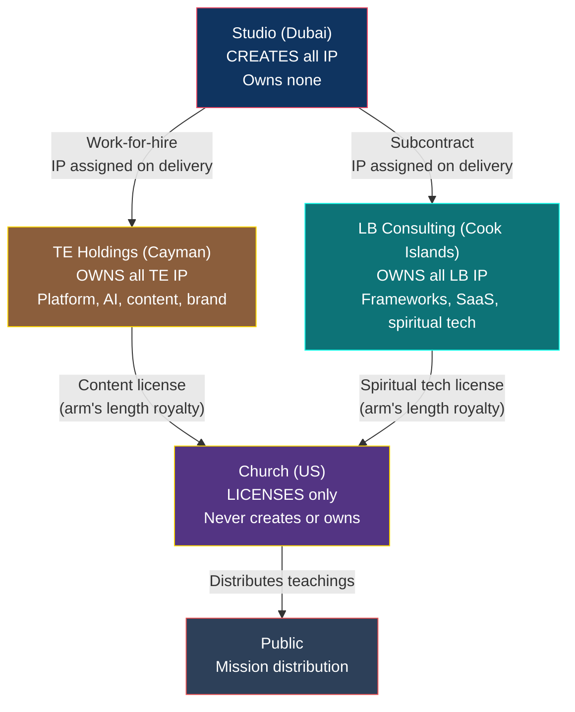
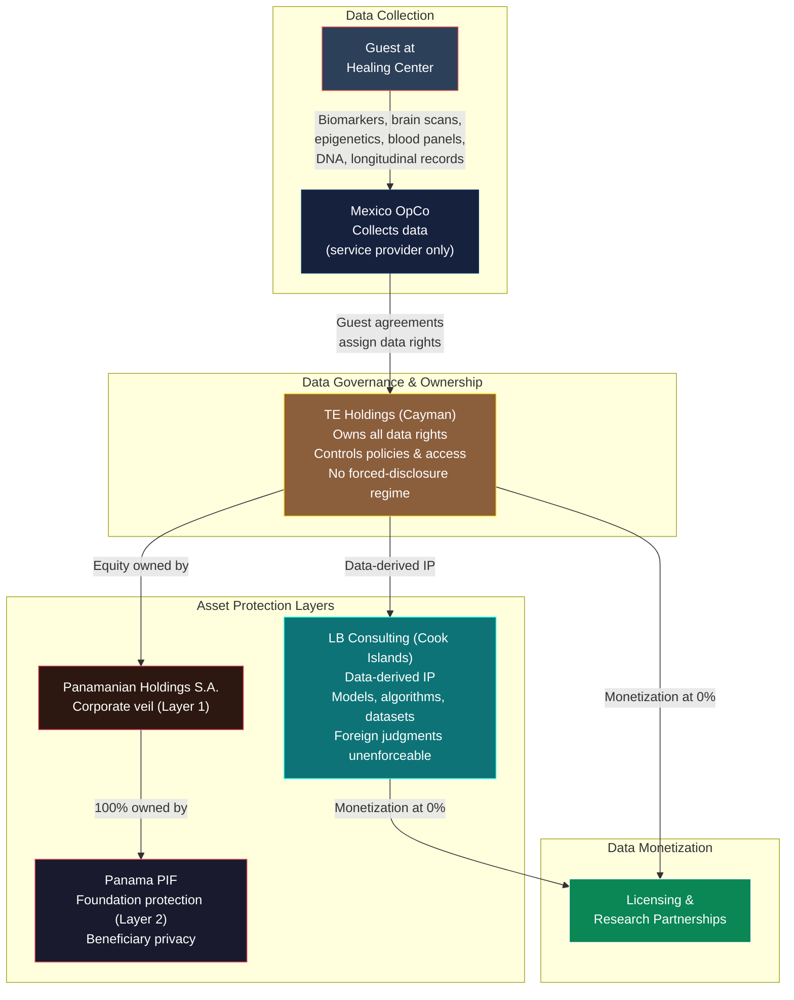

# Executive Strategy: TE + Light Brands Global Architecture

> **Status:** Executive briefing — synthesized from definitive structure documents
> **Audience:** Founders, investors, and counsel
> **Read time:** Under 5 minutes
> **Last Updated:** February 2026

---

## 1. Executive Summary

Transformational Epicenter and Light Brands operate through eight entities across five jurisdictions, designed to achieve three things simultaneously: minimize global tax exposure to ~1.6-1.8% of group revenue, protect founders, investors, IP, and high-value health data behind multiple legal barriers, and create a structure that scales cleanly from $10M to $100M+ without restructuring.

The architecture places revenue collection and IP ownership in zero-tax jurisdictions (Cayman Islands, UAE, Cook Islands), isolates the only taxable operations to a thin service margin in Mexico, and channels the spiritual mission through a US tax-exempt church. A Panama Private Interest Foundation provides ultimate asset protection and beneficiary privacy, with a Panamanian holding company adding a second corporate layer between the foundation and all operating entities.

The combined effective tax rate at Year 5 ($35.5M revenue): approximately $580-655K in total tax, or **~1.6-1.8% of group revenue**. A conventional single-jurisdiction structure would pay $7-10M+ in taxes on the same revenue.

Every mechanism used is an explicit provision of the relevant tax code. Nothing is novel, grey-area, or untested.

---

## 2. Entity Stack Overview

| Entity | Role | Jurisdiction | Tax Rate |
|---|---|---|---|
| **Panama PIF** ("The Shield") | Ultimate ownership layer. Independent legal person with no "owner." Holds 100% of the holding company. Beneficiary identities are private. | Panama | 0% |
| **Panamanian Holdings S.A.** ("The Fortress") | Intermediate holding company. Holds equity in all operating entities. Creates a double layer of asset protection between the foundation and operations. | Panama | 0% (territorial) |
| **TE Wellness Holdings** ("The Product") | The investable vehicle. Owns all TE intellectual property, collects all healing center revenue, controls both Mexican subsidiaries. ~30% investor equity. | Cayman Islands | 0% (unconditional, 20-year guarantee) |
| **Light Brands Studio** ("The Builder") | Shared service center. Employs the Dubai tech team. Builds all technology for both TE and Light Brands under cost-plus contracts. Creates IP but owns none of it. | Dubai, UAE | 0% (Qualifying Free Zone) |
| **Light Brands Consulting** ("The Voice") | Client-facing consulting and SaaS entity. Signs external contracts, collects Light Brands revenue, owns LB-specific IP. Zero employees by design. | Cook Islands | 0% (international income) |
| **Church of the Living Light** ("The Heart") | Spiritual mission. Employs founders as ministers. Receives royalty streams from TE Holdings and LB Consulting. Distributes teachings to the public. | United States | 0% (tax-exempt) |
| **TE Ops Mexico** ("The Hands") | Operates the healing center. Employs local staff. Delivers the guest experience. Receives only a cost-plus service fee. | Tulum, Mexico | 30% on margin only |
| **TE RE Mexico** ("The Ground") | Acquires land, develops villas and facilities, leases property to OpCo. Building depreciation offsets rental income. | Tulum, Mexico | 30% on rent minus depreciation |

**Ownership chain:** Panama PIF (100%) --> Panamanian Holdings S.A. (~70%) --> TE Wellness Holdings. Investor holds ~30% of TE Holdings directly. The S.A. also owns 100% of Studio and 100% of LB Consulting. The Church has no owner -- it is governed by an independent Spiritual Council.

---

## 3. Tax Optimization Logic

**The core principle:** Revenue is collected where tax is zero. Costs are incurred where tax is unavoidable. The gap between the two is the tax savings.

**How value flows:**

1. **Guest pays program fee** --> TE Wellness Holdings (Cayman, 0% tax) collects all revenue
2. **Holdings pays Studio** (Dubai, 0% tax) a cost-plus fee for technology development
3. **Holdings pays Mexico OpCo** (30% tax) a cost-plus fee for facility operations -- tax applies only to the 8-12% service margin, not total revenue
4. **Holdings licenses content to the Church** (0% tax) at arm's length royalty rates
5. **Holdings capitalizes the RE entity** via equity for land acquisition -- RE entity leases property to OpCo, paying 30% on rental income minus building depreciation
6. **Retained earnings flow upstream:** Holdings --> S.A. (0%) --> PIF (0%) --> Founders at personal rates (~0-3.7%)

**Why it works legally:**

- Every intercompany payment is priced at arm's length with annual transfer pricing studies
- Each entity has a genuine, independent business purpose beyond tax savings
- The US founder holds zero ownership in any foreign entity, eliminating all CFC/GILTI exposure
- Revenue flows INTO the Cayman entity from customers -- not out of Mexico to a tax haven
- Mexico only taxes the thin margin it is entitled to under standard multinational operating models

**Year 5 tax waterfall:**

| Level | Tax Paid |
|---|---|
| Mexico operations (OpCo margin) | ~$420,000 |
| Mexico real estate (rent minus depreciation) | ~$75-150,000 |
| US founder personal | ~$85,400 |
| Canadian founder personal | $0 |
| Cyprus founder personal | ~$7,650 |
| **Total on $35.5M revenue** | **~$580-655K (~1.6-1.8%)** |

---

## 4. IP & Data Protection Strategy

### Intellectual Property

IP is created in one place and owned in another -- by design.

- **Studio (Dubai) creates everything** -- every line of code, AI model, course, and design
- **TE Holdings (Cayman) owns all TE IP** -- platform, AI agents, spiritual content, brand, trademarks. Assigned from Studio under work-for-hire contracts on delivery.
- **LB Consulting (Cook Islands) owns all Light Brands IP** -- consulting frameworks, SaaS products, spiritual technology tools. Assigned from Studio under subcontract on delivery.
- **The Church licenses and distributes** -- it never creates or owns IP

This separation means: if Mexico OpCo faces a lawsuit, the IP is untouchable (held in Cayman). If a consulting client disputes a project, TE's healing center IP is in a different entity, different jurisdiction. Studio creates value but holds no product IP -- it cannot be targeted for the assets it builds.

### Health & Biometric Data

The business generates extraordinarily sensitive data: biomarker profiles, brain scans and mapping, epigenetic testing results, blood and metabolic panels, DNA-related data (where legally permitted), and longitudinal health and performance records.

**How the structure protects this data:**

- **Data governance sits in TE Holdings (Cayman)** -- the IP-owning entity controls data policies, access, and monetization rights. Cayman has no forced-disclosure regime equivalent to a US subpoena for corporate records.
- **Operational data collection happens in Mexico OpCo** -- but OpCo is a service provider, not the data owner. Guest agreements assign data rights to Holdings.
- **Cook Islands asset protection** shields any data-derived IP (models, algorithms, anonymized datasets) held by LB Consulting from foreign court orders -- Cook Islands courts do not recognize or enforce foreign judgments.
- **Panama PIF privacy** ensures the ultimate beneficial ownership of data-holding entities remains confidential. No public registry of beneficiaries.
- **Double-layer protection (PIF + S.A.)** means a litigant must pierce two separate Panamanian legal entities -- under two separate bodies of law, in Panamanian courts -- before reaching any operating entity that touches data.

**Long-term data value:** As longitudinal datasets grow (thousands of guests over multiple years), the data becomes an increasingly valuable enterprise asset. The IP/data separation ensures this value accrues to Holdings at 0% tax, is protected by multiple jurisdictional barriers, and can be monetized (licensing, partnerships, research collaborations) through Holdings or LB Consulting without restructuring.

---

## 5. Benefits

### For Founders
- **~1.6-1.8% combined tax rate** vs. 30-50% under a conventional structure
- **Double-layer asset protection** -- creditors must breach both a Panama corporation and a Panama foundation to reach any operating entity equity
- **100% ownership of Studio and Light Brands** retained via PIF -- investor dilution isolated to TE Holdings only
- **Three independent revenue sources** (TE, Studio service fees, Light Brands consulting) all flowing through 0% entities
- **Flexible compensation** -- Dubai salary (tax-free for Canadian/Cyprus founders), church minister salary, tax-free housing, tax-deferred retirement

### For Investors
- **VC-standard Cayman vehicle** -- the same structure used by Sequoia, a16z, and the majority of institutional VC investments globally
- **Clean economics** -- equity in TE revenue and IP only, no exposure to Studio costs or LB operations
- **0% entity-level tax** -- investor returns are not eroded by corporate tax
- **Easy follow-on** -- standard Cayman SHA supports Series A without restructuring

### For the Enterprise
- **Scales without restructuring** -- new locations become new OpCos under Holdings; new products become new entities contracted with Studio
- **Risk isolation** -- a guest injury claim in Mexico cannot reach IP in Cayman, data assets in the Cook Islands, or real estate in a separate Mexican entity
- **Regulatory flexibility** -- health data regulations vary by jurisdiction; the structure allows data governance to be managed from the most favorable jurisdiction
- **Exit optionality** -- can sell TE Holdings (operations + IP), sell real estate separately, sell Light Brands independently, or sell the full portfolio

---

## 6. Risks & Trade-Offs

| Risk | Severity | Mitigation |
|---|---|---|
| **Complexity and compliance cost** | Medium | Eight entities across five jurisdictions require ~$100-130K/year in maintenance, audits, and transfer pricing studies. At $10M+ revenue, this is <1.3% overhead -- a fraction of the tax saved. |
| **Transfer pricing challenge** | Medium | All intercompany payments use standard cost-plus methodology with annual benchmarking studies. Comparable to how Marriott, Hilton, and Four Seasons operate in Mexico. |
| **QFZP rule change (UAE)** | Low | Impact is limited -- Studio's QFZP only covers B2B service fees ($1-5M), not the $35M TE revenue. Worst case: 9% on Studio's margin, not on total revenue. |
| **Mexico REFIPRE enforcement** | Low | Mexico OpCo never pays the Cook Islands entity directly. All flows route through Holdings and Studio. No REFIPRE trigger exists in the structure as designed. |
| **Church scrutiny** | Low | Doctrine predates tax planning. Independent Spiritual Council governs. Regular worship services, charitable programs, and ordained ministers all predate entity formation. IRS opened only 14 church examinations in a recent 2-year period across 300,000+ US churches. |
| **Canadian departure tax** | Time-sensitive | Canadian founder must depart Canada before the seed round closes. Pre-revenue valuation minimizes deemed disposition tax. Delay is the primary risk -- this has a hard deadline. |
| **Regulatory changes** | Low-Medium | The structure uses sovereign law provisions (Cayman 0%, Panama territorial taxation, Cook Islands IBC regime) -- not temporary incentives. These are structural features of each jurisdiction's tax system, not promotional programs that expire. |
| **Key-person concentration** | Medium | Both founders serve across multiple entities. Succession planning and documentation of all intercompany relationships mitigate this risk over time. |

---

## Guiding Principles

This structure is built on five pillars that cannot be compromised:

1. **Legal compliance** -- every mechanism is an explicit provision of the relevant tax code, documented and defensible
2. **Minimal tax leakage** -- value stays in 0% jurisdictions; only unavoidable local margins are taxed
3. **Maximum protection** -- double-layer Panamanian asset protection, Cook Islands enforcement immunity, entity-by-entity liability isolation
4. **Long-term scalability** -- the architecture supports $10M to $100M+ without restructuring
5. **Clean governance** -- independent boards, arm's length pricing, no circular flows, no commingling, full transparency where required

---

*This document synthesizes the definitive structure described in [01-MASTER-STRUCTURE.md](./01-MASTER-STRUCTURE.md), [07-ECOSYSTEM-ARCHITECTURE.md](./07-ECOSYSTEM-ARCHITECTURE.md), and supporting entity-level documents. It is a communication tool for executive alignment -- not a replacement for the detailed technical documents or qualified legal counsel in each jurisdiction.*
