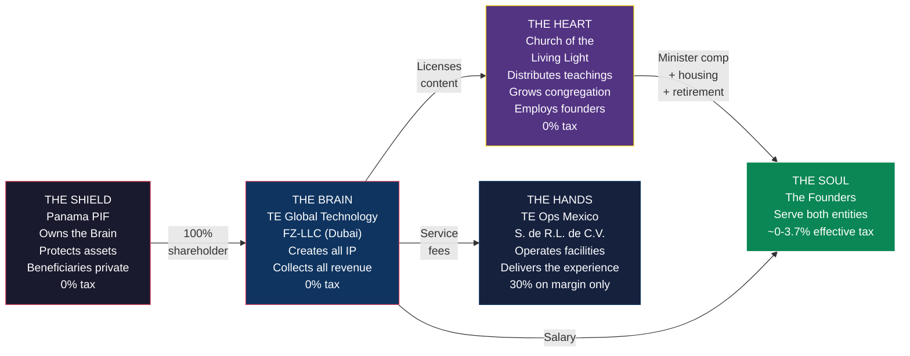
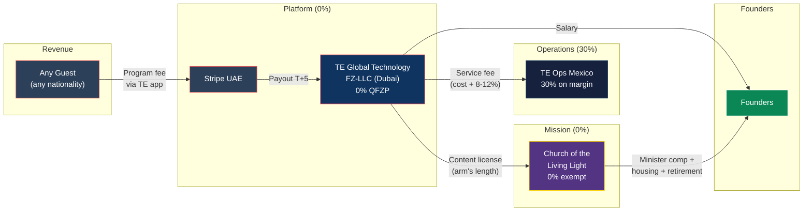

# Master Structure: The Complete TE Global Architecture

> **Status:** Definitive structure — requires counsel validation before implementation
> **Last Updated:** February 2026

---

## 1. Summary

Transformational Epicenter operates through four entities across three jurisdictions, owned by a Panama Private Interest Foundation. All commercial revenue flows into a UAE free zone company at 0% corporate tax. A US church distributes the spiritual mission at 0% federal tax. A Mexican operating company delivers the guest experience at 30% on margin only. The US founder has no ownership stake in the foreign entity, eliminating all CFC/GILTI exposure. The Canadian founder departs Canada before the seed round and pays 0% personal tax. The entity-level effective tax rate is ~1.2%.

---

## 2. Architecture

**The Brain** creates all IP, owns the platform, and collects all commercial revenue at 0%. **The Shield** owns the Brain and protects assets. **The Heart** receives teachings, distributes them to the world, and employs the founders with tax-advantaged compensation. **The Hands** deliver the guest experience on the ground. **The Soul** — the founders — serve both the Brain and the Heart.

---

## 3. Entity Table

| Entity | Jurisdiction | Legal Form | Role | Tax Rate | Ownership | Setup Cost |
|---|---|---|---|---|---|---|
| **TE Global Technology FZ-LLC** | Dubai Internet City, UAE | Free Zone LLC | Creates all IP, collects all revenue, employs Dubai team + founders | 0% (QFZP) | 100% owned by Panama PIF | ~$11-16K |
| **Panama PIF** | Panama | Private Interest Foundation (Law 25/1995) | Owns UAE entity, asset protection, beneficiary privacy | 0% (foreign income) | No owner — independent legal person | ~$2K setup + $1K/yr |
| **Church of the Living Light** | US (state TBD) | 508(c)(1)(A) nonprofit religious corporation | Distributes teachings, employs founders as ministers, runs worship and charitable programs | 0% (tax-exempt) | No owner — nonprofit governance by Spiritual Council | ~$2-5K |
| **TE Ops Mexico S. de R.L. de C.V.** | Tulum, Quintana Roo | S. de R.L. de C.V. | Operates healing facility, employs local staff, delivers guest experience | 30% on margin only | Owned by UAE entity (via PIF) | ~$3-6K |

---

## 4. Money Flow

**Revenue path:** Guest pays via TE app (Stripe UAE) → TE Global Technology FZ-LLC → retains ~43% (EBITDA margin at 0% tax) + pays service fee to Mexico OpCo (cost + 8-12% margin, taxed at 30% on the margin) + pays content license fee to Church (arm's length, 0% on both sides).

**Founder compensation path:** UAE entity pays salary (FEIE shelters first $130K for US founder; 0% for all others). Church pays minister salary + housing allowance (tax-free under IRC 107) + retirement (tax-deferred under IRC 403(b)(9), 457(b), 457(f)).

---

## 5. Tax Summary

### Entity-Level

| Entity | Y1 Revenue/Funding | Tax Rate | Y1 Tax | Y5 Tax |
|---|---|---|---|---|
| TE Global Technology FZ-LLC | $10.7M (programs) + license fees | 0% (QFZP) | $0 | $0 |
| Church of the Living Light | $225K-400K (content + donations) | 0% (exempt) | $0 | $0 |
| TE Ops Mexico | Cost + 8-12% margin | 30% on margin | ~$126K | ~$420K |
| Panama PIF | N/A (holding) | 0% | $0 | $0 |
| **Total entity-level tax** | | | **~$126K** | **~$420K** |
| **Effective rate on $10.7M / $35.5M revenue** | | | **~1.2%** | **~1.2%** |

### Personal-Level (Year 5)

| Founder | Total Income | Tax Paid | Effective Rate |
|---|---|---|---|
| **Canadian** (Dubai resident, PIF beneficiary) | ~$1,400,000 | $0 | **0%** |
| **US** (Dubai resident, church minister, not PIF owner) | ~$2,294,000 | $85,400 | **~3.7%** |
| **Cyprus** (deemed domiciled, Path A salary-first) | ~$900,000 | $7,650 | **~0.85%** |

### Combined (Year 5)

| Metric | Value |
|---|---|
| Group revenue | $35,461,000 |
| Entity-level tax | ~$420,000 |
| US founder personal tax | $85,400 |
| Canadian founder personal tax | $0 |
| **Combined tax** | **~$505,000** |
| **Combined effective rate** | **~1.4%** |

---

## 6. Substance Requirements

Each entity must be genuinely operational. A shell entity will not survive scrutiny.

| Entity | What Makes It Real | Minimum Requirements |
|---|---|---|
| **UAE FZ-LLC** | Creates all IP; employs the team that builds the platform and content | Office in DIC, 5-6 employees (CTO, engineers, AI/ML, PM, finance), all IP registered to this entity, annual audit, DEMPE documentation |
| **Panama PIF** | Holds ownership; independent governance | Foundation Council of 3 members (at least 1 independent), separate bank account, private regulations naming beneficiaries, Protector appointed |
| **Church** | Genuine religious organization with regular congregation | Independent Spiritual Council (3-5 members, 1+ unrelated to founders), weekly worship services, ordained ministers, doctrinal framework, charitable programs, separate bank account and EIN |
| **Mexico OpCo** | Operates the physical facility; employs local staff | Local employees (facilitators, kitchen, medical, maintenance), own RFC/tax ID, own bank account, service delivery agreement with UAE entity, transfer pricing study |

---

## 7. Year 1-5 Projections

| Metric | Year 1 | Year 2 | Year 3 | Year 4 | Year 5 |
|---|---|---|---|---|---|
| **HC Revenue** | $10,748,000 | $18,152,000 | $25,904,000 | $31,715,000 | $35,461,000 |
| **EBITDA Margin** | 43% | 57% | 60% | 60% | 61% |
| **EBITDA** | $4,672,000 | $10,347,000 | $15,542,000 | $19,029,000 | $21,512,217 |
| **Mexico OpCo Tax (~30% on margin)** | ~$126K | ~$200K | ~$300K | ~$360K | ~$420K |
| **UAE Entity Tax** | $0 | $0 | $0 | $0 | $0 |
| **Church Tax** | $0 | $0 | $0 | $0 | $0 |
| **Entity Effective Rate** | ~1.2% | ~1.1% | ~1.2% | ~1.1% | ~1.2% |
| **5-Year Cumulative Revenue** | | | | | **$125,880,000** |
| **Y5 Enterprise Value (SOTP)** | | | | | **~$147,000,000** |

*All revenue figures from data.ts. Mexico OpCo tax estimated at 30% on an 8-12% service margin.*

---

## 8. Key Constraints

These are the walls that cannot be moved. The structure is designed around them.

| Constraint | Impact | How the Structure Handles It |
|---|---|---|
| **Mexico 30% corporate tax** | Every peso of Mexican-source profit is taxed at 30% | OpCo receives only cost + 8-12% margin; the vast majority of profit stays in the UAE entity at 0% |
| **REFIPRE (Mexico anti-avoidance)** | Payments from Mexico to preferential tax regimes (<22.5% effective) trigger 40% WHT + non-deductibility | Revenue flows INTO the UAE entity (Platform-as-Principal model). No upward royalty or license payments from Mexico to UAE. The Mexico OpCo pays nothing to the PIF or any zero-tax jurisdiction. |
| **US worldwide taxation** | US citizens owe tax on worldwide income regardless of residence | US founder structured as employee (not owner) → no CFC/GILTI. FEIE shelters $130K salary. Church channels convert taxable salary into tax-free housing and tax-deferred retirement. |
| **Canadian departure tax** | CRA deems all assets disposed at FMV on departure date | Depart BEFORE the seed round closes (pre-revenue = minimal FMV = minimal tax). This is time-sensitive. |
| **Cyprus deemed domicile** | 25+ year resident pays 5% SDC on dividends (was 17%) | Use salary (0% via 90-day overseas employment exemption) as primary channel. Dividends as affordable secondary channel (~7.65%). |
| **QFZP natural persons exclusion** | UAE QFZP rules exclude "transactions with natural persons" from qualifying income | Defense: revenue derives from Qualifying Intellectual Property (copyrighted software platform), not direct service to individuals. Gating question — resolve with UAE counsel before formation. |

---

## 9. Rules That Cannot Be Broken

| Rule | Why |
|---|---|
| **The church does not collect program fees** | Program revenue goes to the UAE entity. The church is a spiritual mission, not a commercial platform. |
| **The UAE entity does not control the church** | The church has its own independent Spiritual Council. No entity governance overlap. |
| **The PIF does not own the church** | Nonprofits have no owners. The PIF can donate but has zero governance authority. |
| **All founder compensation is board-approved** | Every dollar paid to founders is approved by disinterested Spiritual Council members using comparable data. |
| **Content IP belongs to the UAE entity** | The church licenses content — it never creates or owns IP. |
| **No circular flows** | UAE entity does not donate to the church so the church can pay the founders. Donations must fund the mission. |
| **No commingling** | Every entity has its own bank account. No shared accounts, no cross-entity spending. |
| **Ministry use of assets is documented** | Church-owned home, vehicle, travel — all documented with ministry purpose. Personal use reported as taxable income. |
| **The US founder is NOT a PIF beneficiary or owner** | This eliminates CFC, GILTI, Subpart F, Form 5471 entirely. Non-negotiable for the US founder's position. |
| **Transfer pricing is arm's length** | Mexico service fee and church content license both supported by TP documentation. |

---

## 10. Setup Roadmap

### Phase 1: Counsel & Doctrine (Months 1-2)

| Step | Detail | Timeline |
|---|---|---|
| Engage UAE tax counsel | Confirm QFZP viability (natural persons / Qualifying IP question). **Gating step.** | 2-4 weeks |
| Engage religious nonprofit attorney (US) | Validate 508(c)(1)(A) structure, governance, content licensing model | 2-4 weeks |
| Engage US international tax attorney | Confirm no-ownership eliminates CFC/GILTI; validate dual employment | 2-4 weeks |
| Engage Canadian emigration tax counsel | Departure tax calculation, NR73 strategy, PIF look-through analysis. **TIME-SENSITIVE.** | 2-4 weeks |
| Formalize church doctrine | Statement of faith, code of ethics, sacraments, ordination requirements | 2-4 weeks |
| Draft church constitution & bylaws | Governance, council composition, financial policies, conflict of interest | 2-3 weeks |

**Estimated counsel cost (Phase 1):** $25,000-60,000

### Phase 2: Entity Formation (Months 2-4)

| Step | Detail | Timeline |
|---|---|---|
| Panama PIF formation | Canadian founder as Protector; US founder NOT as beneficiary | 2-4 weeks |
| UAE FZ-LLC registration (DIC) | PIF as 100% shareholder; trade license, bank account, Stripe | 4-8 weeks |
| Church incorporation | Nonprofit religious corporation; EIN; appoint Spiritual Council | 2-3 weeks |
| Founder ordination | Both founders ordained as ministers through church's program | 1-2 weeks |
| Board approves compensation | Spiritual Council reviews comparables, approves salaries, designates housing allowances | 1 meeting |
| Golden Visas x2 | UAE Golden Visa for both founders (entrepreneur pathway) | 1-4 weeks |

**Estimated formation cost (Phase 2):** $15,000-30,000

### Phase 3: Operations (Months 3-6)

| Step | Detail | Timeline |
|---|---|---|
| Hire Dubai team | 5-6 people: CTO, engineers, AI/ML, PM, finance | 5-10 weeks per hire |
| Content creation begins | Dubai team produces all IP — books, courses, platform code, AI agents | Ongoing |
| Content license agreement | UAE entity licenses content to church (arm's length, documented) | 1 week |
| Launch church worship | Weekly online services, monthly in-person gatherings | From day 1 |
| Mexico OpCo formation | Service delivery agreement with UAE entity; transfer pricing study | 4-6 weeks |
| Set up retirement plans | 403(b)(9) + 457(b) + 457(f) established by the church | 2-4 weeks |

**Estimated Year 1 operating cost (Dubai team + office + compliance):** $1.1-2.0M

### Phase 4: Steady State

| Activity | Frequency |
|---|---|
| All guest revenue → UAE entity | Continuous |
| Dubai team creates IP → UAE entity owns it | Continuous |
| Church licenses and distributes content | Continuous |
| Spiritual Council meets, reviews compensation | Quarterly |
| Housing allowance designated | Annually (before tax year) |
| UAE entity audit + QFZP filing | Annually |
| US founder tax return (1040 + 2555 + FBAR + 8938) | Annually |
| Transfer pricing study update | Annually |
| PIF maintenance ($250 tax + agent) | Annually |

**Total Year 1 cost (setup + operations):** ~$1.1-2.1M
**Context:** At $10.7M Y1 revenue with 43% EBITDA, the structure cost is a fraction of the ~$3.2M+ that would be paid in Mexican corporate tax alone under an all-local structure.

---

## Cross-References

- **Legal defense:** [02-LEGAL-DEFENSE.md](./02-LEGAL-DEFENSE.md)
- **US founder playbook:** [03-FOUNDER-GUIDE-US.md](./03-FOUNDER-GUIDE-US.md)
- **Canadian founder playbook:** [04-FOUNDER-GUIDE-CANADA.md](./04-FOUNDER-GUIDE-CANADA.md)
- **Cyprus founder playbook:** [05-FOUNDER-GUIDE-CYPRUS.md](./05-FOUNDER-GUIDE-CYPRUS.md)
- **Questions for counsel:** [06-COUNSEL-QUESTIONS.md](./06-COUNSEL-QUESTIONS.md)

---

*This document describes a legal tax optimization structure combining UAE free zone benefits, US religious organization provisions, Panamanian asset protection, and Mexican corporate tax law. All mechanisms cited are explicit provisions of the relevant tax codes. Implementation requires validation by qualified counsel in each jurisdiction. The religious framework must be genuine and predate the tax strategy.*
