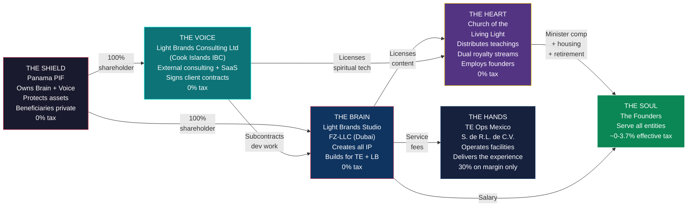

# Master Structure: The Complete Light Brands Global Architecture

> **Status:** Definitive structure — requires counsel validation before implementation
> **Last Updated:** February 2026

---

## 1. Summary

Transformational Epicenter operates through five entities across four jurisdictions, owned by a single Panama Private Interest Foundation. **Light Brands Studio FZ-LLC** (Dubai) creates all IP and collects healing center revenue at 0% corporate tax. **Light Brands Consulting Ltd** (Cook Islands IBC) faces external consulting and SaaS clients, collects Light Brands revenue at 0%, and subcontracts all development to the UAE entity. A US church distributes the spiritual mission at 0% federal tax and receives dual royalty streams from both operating entities. A Mexican operating company delivers the guest experience at 30% on margin only. The US founder has no ownership stake in any foreign entity, eliminating all CFC/GILTI exposure. The Canadian founder departs Canada before the seed round and pays 0% personal tax. The entity-level effective tax rate is ~1.2%.

---

## 2. Architecture

**The Brain** creates all IP, owns the TE platform, collects healing center revenue, and builds everything the Voice sells — at 0%. **The Voice** faces external clients, signs consulting and SaaS contracts, collects Light Brands revenue, and subcontracts all development to the Brain — at 0%. **The Shield** owns both the Brain and the Voice and protects assets. **The Heart** receives royalties from both the Brain (content) and the Voice (spiritual tech), distributes teachings, and employs the founders with tax-advantaged compensation. **The Hands** deliver the guest experience on the ground. **The Soul** — the founders — serve across all entities.

---

## 3. Entity Table

| Entity | Jurisdiction | Legal Form | Role | Tax Rate | Ownership | Setup Cost |
|---|---|---|---|---|---|---|
| **Light Brands Studio FZ-LLC** | Dubai Internet City, UAE | Free Zone LLC | Creates all IP (TE + LB), collects TE revenue, employs Dubai team + founders, builds what LB sells | 0% (QFZP) | 100% owned by Panama PIF | ~$11-16K |
| **Light Brands Consulting Ltd** | Cook Islands | International Business Company | External consulting, SaaS, product sales. Signs client contracts. Owns LB-specific IP. Subcontracts dev to UAE. | 0% (international income) | 100% owned by Panama PIF | ~$4-7K |
| **Panama PIF** | Panama | Private Interest Foundation (Law 25/1995) | Owns both UAE entity and CI IBC, asset protection, beneficiary privacy | 0% (foreign income) | No owner — independent legal person | ~$2K setup + $1K/yr |
| **Church of the Living Light** | US (state TBD) | 508(c)(1)(A) nonprofit religious corporation | Distributes teachings, employs founders as ministers, receives dual royalty streams (UAE content + CI IBC spiritual tech), runs worship and charitable programs | 0% (tax-exempt) | No owner — nonprofit governance by Spiritual Council | ~$2-5K |
| **TE Ops Mexico S. de R.L. de C.V.** | Tulum, Quintana Roo | S. de R.L. de C.V. | Operates healing facility, employs local staff, delivers guest experience | 30% on margin only | Owned by UAE entity (via PIF) | ~$3-6K |

---

## 4. Money Flows

### Flow 1: TE Healing Center Revenue

**Revenue path:** Guest pays via TE app (Stripe UAE) → Light Brands Studio FZ-LLC → retains ~43% (EBITDA margin at 0% tax) + pays service fee to Mexico OpCo (cost + 8-12% margin, taxed at 30% on the margin) + pays content license fee to Church (arm's length, 0% on both sides).

### Flow 2: Light Brands External Client Revenue (NEW)

**Revenue path:** External client pays CI IBC (0%) → CI IBC subcontracts dev to UAE entity (0%) → CI IBC licenses spiritual tech to Church (0% UBIT-exempt royalty) → CI IBC distributes profits to PIF (0% WHT) → PIF to beneficiaries at personal rates.

### Flow 3: REFIPRE Routing (Light Brands → TE Ecosystem)

If TE needs Light Brands technology: Mexico OpCo → service fee to UAE entity (existing arrangement) → UAE subcontracts to CI IBC (arm's length). Mexico NEVER pays CI IBC directly — this avoids REFIPRE's 40% WHT on payments to preferential tax regimes.

**Founder compensation path:** UAE entity pays salary (FEIE shelters first $130K for US founder; 0% for all others). Church pays minister salary + housing allowance (tax-free under IRC 107) + retirement (tax-deferred under IRC 403(b)(9), 457(b), 457(f)). Church now receives dual royalty streams — content from UAE entity + spiritual tech from CI IBC — funding expanded compensation capacity.

---

## 5. Tax Summary

### Entity-Level

| Entity | Y1 Revenue/Funding | Tax Rate | Y1 Tax | Y5 Tax |
|---|---|---|---|---|
| Light Brands Studio FZ-LLC | $10.7M (programs) + LB subcontract fees | 0% (QFZP) | $0 | $0 |
| Light Brands Consulting Ltd (CI IBC) | LB consulting + SaaS revenue | 0% (international income) | $0 | $0 |
| Church of the Living Light | Dual royalties + donations | 0% (exempt) | $0 | $0 |
| TE Ops Mexico | Cost + 8-12% margin | 30% on margin | ~$126K | ~$420K |
| Panama PIF | N/A (holding) | 0% | $0 | $0 |
| **Total entity-level tax** | | | **~$126K** | **~$420K** |
| **Effective rate on $10.7M+ / $35.5M+ TE revenue** | | | **~1.2%** | **~1.2%** |

*Light Brands revenue is additive. All LB income flows through 0% entities (CI IBC + UAE), so LB revenue does not increase the entity-level tax.*

### Personal-Level (Year 5)

| Founder | Total Income | Tax Paid | Effective Rate |
|---|---|---|---|
| **Canadian** (Dubai resident, PIF beneficiary) | ~$1,400,000 | $0 | **0%** |
| **US** (Dubai resident, church minister, not PIF owner) | ~$2,294,000 | $85,400 | **~3.7%** |
| **Cyprus** (deemed domiciled, Path A salary-first) | ~$900,000 | $7,650 | **~0.85%** |

### Combined (Year 5)

| Metric | Value |
|---|---|
| Group revenue | $35,461,000 |
| Entity-level tax | ~$420,000 |
| US founder personal tax | $85,400 |
| Canadian founder personal tax | $0 |
| **Combined tax** | **~$505,000** |
| **Combined effective rate** | **~1.4%** |

---

## 6. Substance Requirements

Each entity must be genuinely operational. A shell entity will not survive scrutiny.

| Entity | What Makes It Real | Minimum Requirements |
|---|---|---|
| **UAE FZ-LLC** | Creates all IP; employs the team that builds the platform, content, and all LB deliverables | Office in DIC, 5-6 employees (CTO, engineers, AI/ML, PM, finance), all TE IP registered to this entity, annual audit, DEMPE documentation |
| **CI IBC (Light Brands)** | Client-facing entity that signs contracts, collects revenue, owns LB-specific IP | Registered agent in Cook Islands, nominee director, Singapore bank account, intercompany subcontract with UAE entity, TP documentation. **Intentionally thin — zero employees, zero office.** |
| **Panama PIF** | Holds ownership of both UAE entity and CI IBC; independent governance | Foundation Council of 3 members (at least 1 independent), separate bank account, private regulations naming beneficiaries, Protector appointed |
| **Church** | Genuine religious organization with regular congregation | Independent Spiritual Council (3-5 members, 1+ unrelated to founders), weekly worship services, ordained ministers, doctrinal framework, charitable programs, separate bank account and EIN |
| **Mexico OpCo** | Operates the physical facility; employs local staff | Local employees (facilitators, kitchen, medical, maintenance), own RFC/tax ID, own bank account, service delivery agreement with UAE entity, transfer pricing study |

---

## 7. Year 1-5 Projections

### TE Healing Center (from data.ts)

| Metric | Year 1 | Year 2 | Year 3 | Year 4 | Year 5 |
|---|---|---|---|---|---|
| **HC Revenue** | $10,748,000 | $18,152,000 | $25,904,000 | $31,715,000 | $35,461,000 |
| **EBITDA Margin** | 43% | 57% | 60% | 60% | 61% |
| **EBITDA** | $4,672,000 | $10,347,000 | $15,542,000 | $19,029,000 | $21,512,217 |
| **Mexico OpCo Tax (~30% on margin)** | ~$126K | ~$200K | ~$300K | ~$360K | ~$420K |
| **UAE Entity Tax** | $0 | $0 | $0 | $0 | $0 |
| **Church Tax** | $0 | $0 | $0 | $0 | $0 |
| **Entity Effective Rate** | ~1.2% | ~1.1% | ~1.2% | ~1.1% | ~1.2% |
| **5-Year Cumulative Revenue** | | | | | **$125,880,000** |
| **Y5 Enterprise Value (SOTP)** | | | | | **~$147,000,000** |

### Light Brands (estimates — pre-revenue, scale TBD)

| Metric | Year 1 | Year 2 | Year 3 | Year 4 | Year 5 |
|---|---|---|---|---|---|
| **LB Revenue (CI IBC)** | TBD | TBD | TBD | TBD | TBD |
| **CI IBC Tax** | $0 | $0 | $0 | $0 | $0 |
| **Tax on LB Revenue** | 0% | 0% | 0% | 0% | 0% |

*Light Brands revenue projections will be added when the product roadmap is finalized. Regardless of revenue scale, LB revenue flows through 0% entities (CI IBC + UAE) and does not increase the entity-level tax burden. All TE HC revenue figures from data.ts. Mexico OpCo tax estimated at 30% on an 8-12% service margin.*

---

## 8. Key Constraints

These are the walls that cannot be moved. The structure is designed around them.

| Constraint | Impact | How the Structure Handles It |
|---|---|---|
| **Mexico 30% corporate tax** | Every peso of Mexican-source profit is taxed at 30% | OpCo receives only cost + 8-12% margin; the vast majority of profit stays in the UAE entity at 0% |
| **REFIPRE (Mexico anti-avoidance)** | Payments from Mexico to preferential tax regimes (<22.5% effective) trigger 40% WHT + non-deductibility | Revenue flows INTO the UAE entity (Platform-as-Principal model). No upward royalty or license payments from Mexico to UAE. Mexico OpCo NEVER pays CI IBC directly — all intercompany services route through the UAE entity. |
| **US worldwide taxation** | US citizens owe tax on worldwide income regardless of residence | US founder structured as employee (not owner) → no CFC/GILTI. FEIE shelters $130K salary. Church channels convert taxable salary into tax-free housing and tax-deferred retirement. |
| **Canadian departure tax** | CRA deems all assets disposed at FMV on departure date | Depart BEFORE the seed round closes (pre-revenue = minimal FMV = minimal tax). This is time-sensitive. |
| **Cyprus deemed domicile** | 25+ year resident pays 5% SDC on dividends (was 17%) | Use salary (0% via 90-day overseas employment exemption) as primary channel. Dividends as affordable secondary channel (~7.65%). |
| **QFZP natural persons exclusion** | UAE QFZP rules exclude "transactions with natural persons" from qualifying income | Defense: revenue derives from Qualifying Intellectual Property (copyrighted software platform), not direct service to individuals. Gating question — resolve with UAE counsel before formation. |
| **CI IBC zero-employee requirement** | Employees in any country create permanent establishment, potentially subjecting the CI IBC to that country's tax | CI IBC has ZERO employees. All development is subcontracted to the UAE entity under arm's length arrangements. The CI IBC is intentionally "thin." |

---

## 9. Rules That Cannot Be Broken

| Rule | Why |
|---|---|
| **The church does not collect program fees** | Program revenue goes to the UAE entity. The church is a spiritual mission, not a commercial platform. |
| **The UAE entity does not control the church** | The church has its own independent Spiritual Council. No entity governance overlap. |
| **The PIF does not own the church** | Nonprofits have no owners. The PIF can donate but has zero governance authority. |
| **All founder compensation is board-approved** | Every dollar paid to founders is approved by disinterested Spiritual Council members using comparable data. |
| **Content IP belongs to the UAE entity; LB IP belongs to CI IBC** | The church licenses — it never creates or owns IP. UAE owns TE IP. CI IBC owns LB IP. |
| **No circular flows** | UAE entity does not donate to the church so the church can pay the founders. Donations must fund the mission. |
| **No commingling** | Every entity has its own bank account. No shared accounts, no cross-entity spending. |
| **Ministry use of assets is documented** | Church-owned home, vehicle, travel — all documented with ministry purpose. Personal use reported as taxable income. |
| **The US founder is NOT a PIF beneficiary or owner** | This eliminates CFC, GILTI, Subpart F, Form 5471 entirely. Non-negotiable for the US founder's position. |
| **Transfer pricing is arm's length** | Mexico service fee, church content license, CI IBC→UAE subcontract, and CI IBC→Church spiritual tech license all supported by TP documentation. |
| **The CI IBC has ZERO employees** | Employees create PE. The CI IBC's 0% rate depends on having no physical presence anywhere. Non-negotiable. |
| **Mexico OpCo NEVER pays CI IBC directly** | REFIPRE triggers 40% WHT. All TE ecosystem services from LB route through the UAE entity. |
| **CI IBC subcontracts ALL development to UAE** | The CI IBC sells; the UAE entity builds. Preserves UAE substance and CI IBC's thin profile. |

---

## 10. Setup Roadmap

### Phase 1: Counsel & Doctrine (Months 1-2)

| Step | Detail | Timeline |
|---|---|---|
| Engage UAE tax counsel | Confirm QFZP viability (natural persons / Qualifying IP question). **Gating step.** | 2-4 weeks |
| Engage religious nonprofit attorney (US) | Validate 508(c)(1)(A) structure, governance, dual royalty licensing model | 2-4 weeks |
| Engage US international tax attorney | Confirm no-ownership eliminates CFC/GILTI; validate dual employment | 2-4 weeks |
| Engage Canadian emigration tax counsel | Departure tax calculation, NR73 strategy, PIF look-through analysis. **TIME-SENSITIVE.** | 2-4 weeks |
| Engage Cook Islands registered agent | Confirm CI IBC structure, director requirements, banking path | 1-2 weeks |
| Formalize church doctrine | Statement of faith, code of ethics, sacraments, ordination requirements | 2-4 weeks |
| Draft church constitution & bylaws | Governance, council composition, financial policies, conflict of interest | 2-3 weeks |

**Estimated counsel cost (Phase 1):** $30,000-70,000

### Phase 2: Entity Formation (Months 2-4)

| Step | Detail | Timeline |
|---|---|---|
| Panama PIF formation | Canadian founder as Protector; US founder NOT as beneficiary | 2-4 weeks |
| UAE FZ-LLC registration (DIC) | PIF as 100% shareholder; trade license, bank account, Stripe | 4-8 weeks |
| Cook Islands IBC formation | Light Brands Consulting Ltd; PIF as sole shareholder; nominee director; Singapore bank account | 2-5 weeks |
| Church incorporation | Nonprofit religious corporation; EIN; appoint Spiritual Council | 2-3 weeks |
| Founder ordination | Both founders ordained as ministers through church's program | 1-2 weeks |
| Board approves compensation | Spiritual Council reviews comparables, approves salaries, designates housing allowances | 1 meeting |
| Golden Visas x2 | UAE Golden Visa for both founders (entrepreneur pathway) | 1-4 weeks |

**Estimated formation cost (Phase 2):** $20,000-37,000

### Phase 3: Operations (Months 3-6)

| Step | Detail | Timeline |
|---|---|---|
| Hire Dubai team | 5-6 people: CTO, engineers, AI/ML, PM, finance | 5-10 weeks per hire |
| Content creation begins | Dubai team produces all IP — books, courses, platform code, AI agents, LB deliverables | Ongoing |
| Content license agreement | UAE entity licenses content to church (arm's length, documented) | 1 week |
| Spiritual tech license agreement | CI IBC licenses spiritual tech to church (arm's length, documented) | 1 week |
| Development subcontract | CI IBC → UAE entity subcontracting agreement (IP assignment, pricing, SOW template) | 1 week |
| Launch church worship | Weekly online services, monthly in-person gatherings | From day 1 |
| Mexico OpCo formation | Service delivery agreement with UAE entity; transfer pricing study | 4-6 weeks |
| Set up retirement plans | 403(b)(9) + 457(b) + 457(f) established by the church | 2-4 weeks |
| Begin LB client contracting | CI IBC signs first external consulting/SaaS contracts | Month 3+ |

**Estimated Year 1 operating cost (Dubai team + office + compliance):** $1.1-2.0M

### Phase 4: Steady State

| Activity | Frequency |
|---|---|
| All guest revenue → UAE entity | Continuous |
| All LB client revenue → CI IBC | Continuous |
| Dubai team creates IP → UAE entity owns TE IP; CI IBC owns LB IP | Continuous |
| Church licenses and distributes content + spiritual tech | Continuous |
| Intercompany invoicing (CI→UAE subcontract, UAE→Mexico) | Monthly |
| Spiritual Council meets, reviews compensation | Quarterly |
| Housing allowance designated | Annually (before tax year) |
| UAE entity audit + QFZP filing | Annually |
| CI IBC annual return + registered agent fee | Annually |
| US founder tax return (1040 + 2555 + FBAR + 8938) | Annually |
| Transfer pricing study update (UAE↔Mexico, CI↔UAE, CI↔Church) | Annually |
| PIF maintenance ($250 tax + agent) | Annually |

**Total Year 1 cost (setup + operations):** ~$1.2-2.2M
**Context:** At $10.7M Y1 revenue with 43% EBITDA, the structure cost is a fraction of the ~$3.2M+ that would be paid in Mexican corporate tax alone under an all-local structure. Light Brands revenue is additive with negligible incremental cost.

---

## Cross-References

- **Ecosystem architecture (5-entity view):** [07-ECOSYSTEM-ARCHITECTURE.md](./07-ECOSYSTEM-ARCHITECTURE.md)
- **Cook Islands IBC detail:** [08-COOK-ISLANDS-IBC-DETAIL.md](./08-COOK-ISLANDS-IBC-DETAIL.md)
- **Legal defense:** [02-LEGAL-DEFENSE.md](./02-LEGAL-DEFENSE.md)
- **US founder playbook:** [03-FOUNDER-GUIDE-US.md](./03-FOUNDER-GUIDE-US.md)
- **Canadian founder playbook:** [04-FOUNDER-GUIDE-CANADA.md](./04-FOUNDER-GUIDE-CANADA.md)
- **Cyprus founder playbook:** [05-FOUNDER-GUIDE-CYPRUS.md](./05-FOUNDER-GUIDE-CYPRUS.md)
- **Questions for counsel:** [06-COUNSEL-QUESTIONS.md](./06-COUNSEL-QUESTIONS.md)

---

*This document describes a legal tax optimization structure combining UAE free zone benefits, Cook Islands IBC tax neutrality, US religious organization provisions, Panamanian asset protection, and Mexican corporate tax law. All mechanisms cited are explicit provisions of the relevant tax codes. Implementation requires validation by qualified counsel in each jurisdiction. The religious framework must be genuine and predate the tax strategy.*
