# Master Structure: The Complete TE + Light Brands Global Architecture

> **Status:** Definitive structure — requires counsel validation before implementation
> **Last Updated:** February 2026

---

## 1. Summary

Transformational Epicenter operates through six entities across five jurisdictions, owned by a single Panama Private Interest Foundation (with one entity accepting outside investment). **TE Wellness Holdings** (Cayman) is the investable vehicle — it owns all TE IP, collects all TE revenue at 0% corporate tax, controls the Mexico OpCo, and licenses content to the Church. **Light Brands Studio FZ-LLC** (Dubai) is the shared service center — it builds for both TE Holdings and Light Brands under cost-plus contracts at 0% (QFZP). **Light Brands Consulting Ltd** (Cook Islands IBC) faces external consulting and SaaS clients, collects Light Brands revenue at 0%, and subcontracts all development to Studio. A US church distributes the spiritual mission at 0% federal tax and receives dual royalty streams from both TE Holdings and CI IBC. A Mexican operating company delivers the guest experience at 30% on margin only. The US founder has no ownership stake in any foreign entity, eliminating all CFC/GILTI exposure. The Canadian founder departs Canada before the seed round and pays 0% personal tax. The entity-level effective tax rate is ~1.2%.

---

## 2. The Six Entities

Six entities. Five jurisdictions. One architecture. Meet them one at a time.

### THE PRODUCT — TE Wellness Holdings (Cayman)

```mermaid
graph TB
    PRODUCT["🏛 THE PRODUCT<br/>TE Wellness Holdings<br/>(Cayman Exempted Co.)<br/>0% tax — unconditional"]

    PRODUCT --- owns["Owns all TE IP"]
    PRODUCT --- collects["Collects $10.7M → $35.5M revenue"]
    PRODUCT --- controls["Controls Mexico OpCo (100%)"]
    PRODUCT --- licenses["Licenses content to Church"]
    PRODUCT --- contracts["Contracts dev to Studio"]
    PRODUCT --- investable["~30% investor equity"]

    style PRODUCT fill:#8b5e3c,stroke:#ffd700,color:#fff
```

The investable vehicle. Every dollar of TE healing center revenue flows here first. It owns the IP, holds the Stripe merchant account, controls the Mexican operations, and licenses spiritual content to the Church. Cayman Exempted Company with 20-year tax undertaking — 0% is unconditional, no substance requirements. This is where the investor buys ~30% equity using VC-standard mechanics (SHA, liquidation preference, board seat).

### THE BUILDER — Light Brands Studio FZ-LLC (Dubai)

The shared service center. Every line of code, every AI model, every design is built here. Studio employs the Dubai tech team (CTO, engineers, AI/ML, PM, finance) and both founders. It creates IP under work-for-hire contracts but owns none of the product-specific IP — TE IP goes to Holdings, LB IP goes to CI IBC. Pure B2B service company earning cost-plus margins at 0% under QFZP.

### THE VOICE — Light Brands Consulting Ltd (Cook Islands IBC)

The client-facing consulting and SaaS entity. CI IBC signs the contracts, collects the revenue, owns LB-specific IP, and licenses spiritual technology to the Church. It has **zero employees** — intentionally thin to avoid creating permanent establishment anywhere. All development is subcontracted to Studio at arm's length. 0% on international income with asset protection under Cook Islands law.

### THE SHIELD — Panama PIF

```mermaid
graph TB
    SHIELD["🛡 THE SHIELD<br/>Panama Private Interest Foundation<br/>(Law 25/1995)<br/>0% tax — foreign income"]

    SHIELD --- holds_te["Owns ~70% of Holdings"]
    SHIELD --- holds_studio["Owns 100% of Studio"]
    SHIELD --- holds_ci["Owns 100% of CI IBC"]
    SHIELD --- privacy["Beneficiary identities private"]
    SHIELD --- protection["Asset protection"]

    style SHIELD fill:#1a1a2e,stroke:#e94560,color:#fff
```

The ownership layer. The PIF is an independent legal person — it has no "owner." It holds ~70% of Holdings, 100% of Studio, and 100% of CI IBC, keeping beneficiary identities private. The Canadian founder serves as Protector. The US founder is **not** a beneficiary (eliminating CFC/GILTI). A Foundation Council of 3+ members (at least 1 independent) governs. Private regulations name beneficiaries. 0% on foreign-source income.

### THE HEART — Church of the Living Light

The spiritual mission. The Church receives dual royalty streams — content from Holdings and spiritual tech from CI IBC — both UBIT-exempt under IRC 512(b)(2). It distributes teachings, runs worship services (weekly online, monthly in-person), and employs both founders as ordained ministers. Compensation channels include salary, tax-free housing allowance (IRC 107), and tax-deferred retirement (403(b)(9), 457(b), 457(f)). Governed by an independent Spiritual Council (3-5 members, 1+ unrelated to founders).

### THE HANDS — TE Ops Mexico S. de R.L. de C.V.

The boots on the ground. Mexico OpCo operates the physical facility, employs local staff (facilitators, kitchen, medical, maintenance), and delivers the guest experience. Owned 100% by TE Holdings. It receives only a cost-plus service fee — the vast majority of profit stays in Holdings at 0%. Mexico's 30% corporate tax applies only to the 8-12% margin, keeping total Mexico tax to ~$126K (Y1) → ~$420K (Y5).

---

## 3. Who Owns What

Ownership only — no money flows, no services. Just the lines of control.

Key points:
- **One PIF owns everything** (except investor's share and the Church)
- **Investor equity isolated** to TE Holdings only — no exposure to Studio, LB, or Church
- **Church has no owner** — nonprofit governed by independent Spiritual Council
- **Mexico OpCo owned by Holdings** (not by Studio) — Holdings controls all TE operations

---

## 4. Entity Table

| Entity | Jurisdiction | Legal Form | Role | Tax Rate | Ownership | Setup Cost |
|---|---|---|---|---|---|---|
| **TE Wellness Holdings** | Cayman Islands | Exempted Company | Owns all TE IP, collects all TE revenue ($10.7M→$35.5M), controls Mexico OpCo, licenses content to Church. Investable vehicle. | 0% (unconditional, 20-year exemption) | ~70% Panama PIF + ~30% investor | ~$8-14K |
| **Light Brands Studio FZ-LLC** | Dubai Internet City, UAE | Free Zone LLC | Shared service center — builds for both TE Holdings and LB. Employs Dubai team + founders. Pure B2B service company. | 0% (QFZP) | 100% owned by Panama PIF | ~$11-16K |
| **Light Brands Consulting Ltd** | Cook Islands | International Business Company | External consulting, SaaS, product sales. Signs client contracts. Owns LB-specific IP. Subcontracts dev to Studio. | 0% (international income) | 100% owned by Panama PIF | ~$4-7K |
| **Panama PIF** | Panama | Private Interest Foundation (Law 25/1995) | Owns ~70% of Holdings + 100% of Studio + 100% of CI IBC. Asset protection, beneficiary privacy. | 0% (foreign income) | No owner — independent legal person | ~$2K setup + $1K/yr |
| **Church of the Living Light** | US (state TBD) | 508(c)(1)(A) nonprofit religious corporation | Distributes teachings, employs founders as ministers, receives dual royalty streams (content from Holdings + spiritual tech from CI IBC), runs worship and charitable programs | 0% (tax-exempt) | No owner — nonprofit governance by Spiritual Council | ~$2-5K |
| **TE Ops Mexico S. de R.L. de C.V.** | Tulum, Quintana Roo | S. de R.L. de C.V. | Operates healing facility, employs local staff, delivers guest experience | 30% on margin only | Owned by TE Holdings (Cayman) | ~$3-6K |

---

## 5. How Money Flows — TE Revenue

**Revenue path:** Guest pays via TE app (Stripe) → TE Wellness Holdings (Cayman) → retains ~43% EBITDA at 0% tax + pays dev services fee to Studio (cost + 8-12% margin, 0% QFZP) + pays service fee to Mexico OpCo (cost + 8-12% margin, taxed at 30% on the margin) + pays content license fee to Church (arm's length, 0% on both sides).

---

## 6. How Money Flows — Light Brands Revenue

**Revenue path:** External client pays CI IBC (0%) → CI IBC subcontracts dev to Studio (0%) → CI IBC licenses spiritual tech to Church (0% UBIT-exempt royalty) → CI IBC distributes profits to PIF (0% WHT) → PIF to beneficiaries at personal rates.

---

## 7. How Money Flows — REFIPRE Safe Route

Mexico's REFIPRE rules impose **40% WHT** on payments to preferential tax regimes (<22.5% effective). The Cook Islands qualifies. This diagram shows the safe routing path — and the forbidden shortcut.

```mermaid
graph LR
    MEX["TE Ops Mexico<br/>(30% on margin)"]
    HOLDINGS["TE Holdings<br/>(Cayman — 0%)"]
    STUDIO["Studio<br/>(Dubai — 0%)"]
    CI["CI IBC<br/>(Cook Islands — 0%)"]

    MEX -->|"Service fee<br/>(parent-subsidiary)"| HOLDINGS
    HOLDINGS -->|"Dev services<br/>(existing contract)"| STUDIO
    STUDIO -->|"Subcontract<br/>(arm's length)"| CI

    MEX -.-x|"FORBIDDEN<br/>40% WHT + non-deductible"| CI

    style MEX fill:#16213e,stroke:#0f3460,color:#fff
    style HOLDINGS fill:#8b5e3c,stroke:#ffd700,color:#fff
    style STUDIO fill:#0f3460,stroke:#e94560,color:#fff
    style CI fill:#0d7377,stroke:#14ffec,color:#fff

    linkStyle 3 stroke:#ff0000,stroke-width:3px
```

**Why this works:** Mexico → Holdings is a standard parent-subsidiary payment (not REFIPRE-triggering). Holdings → Studio is the existing dev services contract. Studio → CI IBC is the existing development subcontract. All three intermediate entities are at 0%, so the routing costs **$0 in additional tax**. The only thing that matters is Mexico never pays CI IBC directly.

---

## 8. How IP Is Created and Owned

```mermaid
graph TB
    STUDIO_IP["Light Brands Studio<br/>(Dubai)<br/>Creates ALL IP"]

    TE_IP["TE Wellness Holdings<br/>(Cayman)<br/>Owns TE IP"]
    LB_IP["CI IBC<br/>(Cook Islands)<br/>Owns LB IP"]
    CHURCH_IP["Church of the Living Light<br/>(US)<br/>Licenses only — never owns"]

    STUDIO_IP -->|"Work-for-hire<br/>(Dev Services Agreement)<br/>IP assigned on delivery"| TE_IP
    STUDIO_IP -->|"Work-for-hire<br/>(Dev Subcontract)<br/>IP assigned on delivery"| LB_IP

    TE_IP -->|"Content license<br/>(arm's length royalty)"| CHURCH_IP
    LB_IP -->|"Spiritual tech license<br/>(arm's length royalty)"| CHURCH_IP

    CHURCH_IP -->|"Distributes to public<br/>(mission)"| PUBLIC["Public"]

    style STUDIO_IP fill:#0f3460,stroke:#e94560,color:#fff
    style TE_IP fill:#8b5e3c,stroke:#ffd700,color:#fff
    style LB_IP fill:#0d7377,stroke:#14ffec,color:#fff
    style CHURCH_IP fill:#533483,stroke:#ffd700,color:#fff
    style PUBLIC fill:#2d4059,stroke:#ea5455,color:#fff
```

**Key rules:**
- **Studio creates everything, owns nothing** (product-specific). It retains only internal dev methodologies and tools.
- **TE IP** (platform, AI agents, courses, brand) → assigned to Holdings under the Dev Services Agreement
- **LB IP** (consulting frameworks, SaaS, spiritual tech) → assigned to CI IBC under the Dev Subcontract
- **Church licenses and distributes** — it never creates or owns IP
- All licenses priced at arm's length with transfer pricing documentation

---

## 9. How Founders Get Paid

```mermaid
graph TB
    STUDIO_PAY["Light Brands Studio<br/>(Dubai)"]
    CHURCH_PAY["Church of the Living Light<br/>(US)"]
    PIF_PAY["Panama PIF"]

    US["US Founder<br/>~3.7% effective"]
    CA["Canadian Founder<br/>0% effective"]
    CY["Cyprus Founder<br/>~0.85% effective"]

    STUDIO_PAY -->|"Salary<br/>(FEIE shelters $130K)"| US
    STUDIO_PAY -->|"Salary<br/>(0% — Dubai resident)"| CA
    STUDIO_PAY -->|"Salary<br/>(0% — 90-day overseas exemption)"| CY

    CHURCH_PAY -->|"Minister salary"| US
    CHURCH_PAY -->|"Housing allowance<br/>(tax-free, IRC 107)"| US
    CHURCH_PAY -->|"Retirement<br/>(403b/457b/457f, deferred)"| US
    CHURCH_PAY -->|"Church-owned assets<br/>(ministry use)"| US
    CHURCH_PAY -->|"Minister salary"| CA
    CHURCH_PAY -->|"Minister salary"| CY

    PIF_PAY -->|"Distributions<br/>(0% — no Canadian tax)"| CA
    PIF_PAY -->|"Distributions<br/>(~7.65% — SDC + health)"| CY

    style STUDIO_PAY fill:#0f3460,stroke:#e94560,color:#fff
    style CHURCH_PAY fill:#533483,stroke:#ffd700,color:#fff
    style PIF_PAY fill:#1a1a2e,stroke:#e94560,color:#fff
    style US fill:#0a8754,stroke:#fff,color:#fff
    style CA fill:#0a8754,stroke:#fff,color:#fff
    style CY fill:#0a8754,stroke:#fff,color:#fff
```

**Three pay channels, three founders:**

| Channel | US Founder | Canadian Founder | Cyprus Founder |
|---|---|---|---|
| **Studio salary** | FEIE shelters first $130K | 0% (Dubai resident, no Canadian tax post-departure) | 0% (90-day overseas employment exemption) |
| **Church minister salary** | Taxable (SE opt-out available) | Taxable at personal rate | Taxable at personal rate |
| **Church housing allowance** | Tax-free under IRC 107 | N/A | N/A |
| **Church retirement** | Tax-deferred (403b/457b/457f) | N/A | N/A |
| **Church-owned assets** | Ministry use (documented) | N/A | N/A |
| **PIF distributions** | NOT a beneficiary (no CFC/GILTI) | 0% | ~7.65% (5% SDC + GHS) |

**Critical:** The US founder is **not** a PIF beneficiary or owner. This eliminates CFC, GILTI, Subpart F, and Form 5471 entirely.

---

## 10. Tax Waterfall

Where tax is paid at every level — from revenue to founders.

**Year 5 tax summary:**

| Level | Tax Paid | Rate |
|---|---|---|
| Entity level (all entities) | ~$420,000 | ~1.2% of $35.5M |
| US founder personal | ~$85,400 | ~3.7% of ~$2.3M |
| Canadian founder personal | $0 | 0% |
| Cyprus founder personal | ~$7,650 | ~0.85% of ~$900K |
| **Combined** | **~$505,000** | **~1.4% of group revenue** |

---

## 11. Tax Summary Tables

### Entity-Level

| Entity | Y1 Revenue/Funding | Tax Rate | Y1 Tax | Y5 Tax |
|---|---|---|---|---|
| TE Wellness Holdings (Cayman) | $10.7M (TE revenue) | 0% (unconditional) | $0 | $0 |
| Light Brands Studio FZ-LLC | Dev service fees from Holdings + LB subcontract fees | 0% (QFZP) | $0 | $0 |
| Light Brands Consulting Ltd (CI IBC) | LB consulting + SaaS revenue | 0% (international income) | $0 | $0 |
| Church of the Living Light | Dual royalties + donations | 0% (exempt) | $0 | $0 |
| TE Ops Mexico | Cost + 8-12% margin | 30% on margin | ~$126K | ~$420K |
| Panama PIF | N/A (holding) | 0% | $0 | $0 |
| **Total entity-level tax** | | | **~$126K** | **~$420K** |
| **Effective rate on $10.7M+ / $35.5M+ TE revenue** | | | **~1.2%** | **~1.2%** |

*Light Brands revenue is additive. All LB income flows through 0% entities (CI IBC + Studio), so LB revenue does not increase the entity-level tax.*

### Personal-Level (Year 5)

| Founder | Total Income | Tax Paid | Effective Rate |
|---|---|---|---|
| **Canadian** (Dubai resident, PIF beneficiary) | ~$1,400,000 | $0 | **0%** |
| **US** (Dubai resident, church minister, not PIF owner) | ~$2,294,000 | $85,400 | **~3.7%** |
| **Cyprus** (deemed domiciled, Path A salary-first) | ~$900,000 | $7,650 | **~0.85%** |

### Combined (Year 5)

| Metric | Value |
|---|---|
| Group revenue | $35,461,000 |
| Entity-level tax | ~$420,000 |
| US founder personal tax | $85,400 |
| Canadian founder personal tax | $0 |
| **Combined tax** | **~$505,000** |
| **Combined effective rate** | **~1.4%** |

---

## 12. The Full Picture

All entities, all flows, all connections — simplified from the spotlights above into one view.

---

## 13. Substance Requirements

Each entity must be genuinely operational. A shell entity will not survive scrutiny.

| Entity | What Makes It Real | Minimum Requirements |
|---|---|---|
| **TE Holdings (Cayman)** | Owns TE IP, collects $10-35M revenue, controls Mexico OpCo, has investor shareholders and independent board | Board meetings, annual audit (investor requirement), Stripe payment processing, intercompany agreements, Economic Substance Notification filing. **Zero local substance required** — Exempted Companies exempt from ESA for IP/revenue holding. |
| **Studio FZ-LLC (Dubai)** | Shared service center — employs the team that builds for TE Holdings and LB | Office in DIC, 5-6 employees (CTO, engineers, AI/ML, PM, finance), all development performed here, annual audit, QFZP filing, DEMPE documentation |
| **CI IBC (Light Brands)** | Client-facing entity that signs contracts, collects LB revenue, owns LB-specific IP | Registered agent in Cook Islands, nominee director, Singapore bank account, intercompany subcontract with Studio, TP documentation. **Intentionally thin — zero employees, zero office.** |
| **Panama PIF** | Holds ownership of Holdings (~70%), Studio (100%), and CI IBC (100%); independent governance | Foundation Council of 3 members (at least 1 independent), separate bank account, private regulations naming beneficiaries, Protector appointed |
| **Church** | Genuine religious organization with regular congregation | Independent Spiritual Council (3-5 members, 1+ unrelated to founders), weekly worship services, ordained ministers, doctrinal framework, charitable programs, separate bank account and EIN |
| **Mexico OpCo** | Operates the physical facility; employs local staff | Local employees (facilitators, kitchen, medical, maintenance), own RFC/tax ID, own bank account, service delivery agreement with TE Holdings, transfer pricing study |

---

## 14. Year 1-5 Projections

### TE Healing Center (from data.ts)

| Metric | Year 1 | Year 2 | Year 3 | Year 4 | Year 5 |
|---|---|---|---|---|---|
| **HC Revenue** | $10,748,000 | $18,152,000 | $25,904,000 | $31,715,000 | $35,461,000 |
| **EBITDA Margin** | 43% | 57% | 60% | 60% | 61% |
| **EBITDA** | $4,672,000 | $10,347,000 | $15,542,000 | $19,029,000 | $21,512,217 |
| **Mexico OpCo Tax (~30% on margin)** | ~$126K | ~$200K | ~$300K | ~$360K | ~$420K |
| **TE Holdings Tax** | $0 | $0 | $0 | $0 | $0 |
| **Studio Tax** | $0 | $0 | $0 | $0 | $0 |
| **Church Tax** | $0 | $0 | $0 | $0 | $0 |
| **Entity Effective Rate** | ~1.2% | ~1.1% | ~1.2% | ~1.1% | ~1.2% |
| **5-Year Cumulative Revenue** | | | | | **$125,880,000** |
| **Y5 Enterprise Value (SOTP)** | | | | | **~$147,000,000** |

### Light Brands (estimates — pre-revenue, scale TBD)

| Metric | Year 1 | Year 2 | Year 3 | Year 4 | Year 5 |
|---|---|---|---|---|---|
| **LB Revenue (CI IBC)** | TBD | TBD | TBD | TBD | TBD |
| **CI IBC Tax** | $0 | $0 | $0 | $0 | $0 |
| **Tax on LB Revenue** | 0% | 0% | 0% | 0% | 0% |

*Light Brands revenue projections will be added when the product roadmap is finalized. Regardless of revenue scale, LB revenue flows through 0% entities (CI IBC + Studio) and does not increase the entity-level tax burden. All TE HC revenue figures from data.ts. Mexico OpCo tax estimated at 30% on an 8-12% service margin.*

---

## 15. Key Constraints

These are the walls that cannot be moved. The structure is designed around them.

| Constraint | Impact | How the Structure Handles It |
|---|---|---|
| **Mexico 30% corporate tax** | Every peso of Mexican-source profit is taxed at 30% | OpCo receives only cost + 8-12% margin; the vast majority of profit stays in TE Holdings at 0% |
| **REFIPRE (Mexico anti-avoidance)** | Payments from Mexico to preferential tax regimes (<22.5% effective) trigger 40% WHT + non-deductibility | Revenue flows INTO TE Holdings from guests (Platform-as-Principal model). Mexico OpCo is a subsidiary of Holdings — standard parent-subsidiary arrangements. Mexico OpCo NEVER pays CI IBC directly — all intercompany services route through Holdings and Studio. |
| **US worldwide taxation** | US citizens owe tax on worldwide income regardless of residence | US founder structured as employee (not owner) → no CFC/GILTI. FEIE shelters $130K salary. Church channels convert taxable salary into tax-free housing and tax-deferred retirement. |
| **Canadian departure tax** | CRA deems all assets disposed at FMV on departure date | Depart BEFORE the seed round closes (pre-revenue = minimal FMV = minimal tax). This is time-sensitive. |
| **Cyprus deemed domicile** | 25+ year resident pays 5% SDC on dividends (was 17%) | Use salary (0% via 90-day overseas employment exemption) as primary channel. Dividends as affordable secondary channel (~7.65%). |
| **QFZP natural persons exclusion** | UAE QFZP rules exclude "transactions with natural persons" from qualifying income | **Eliminated as concern for TE revenue.** Studio earns B2B service fees from Holdings (a company), not from individual guests. QFZP risk isolated to Studio's service fees only. |
| **Investor wants TE equity only** | Investor requires standard VC mechanics (SHA, liquidation pref, board seat) in a clean TE vehicle | TE Holdings (Cayman Exempted Company) is the VC-standard investable vehicle. Investor buys ~30% of Holdings. No exposure to Studio, LB, or Church. |
| **CI IBC zero-employee requirement** | Employees in any country create permanent establishment, potentially subjecting the CI IBC to that country's tax | CI IBC has ZERO employees. All development is subcontracted to Studio under arm's length arrangements. The CI IBC is intentionally "thin." |

---

## 16. Rules That Cannot Be Broken

| Rule | Why |
|---|---|
| **The church does not collect program fees** | Program revenue goes to TE Holdings. The church is a spiritual mission, not a commercial platform. |
| **The UAE entity does not control the church** | The church has its own independent Spiritual Council. No entity governance overlap. |
| **The PIF does not own the church** | Nonprofits have no owners. The PIF can donate but has zero governance authority. |
| **All founder compensation is board-approved** | Every dollar paid to founders is approved by disinterested Spiritual Council members using comparable data. |
| **TE IP belongs to TE Holdings; LB IP belongs to CI IBC** | The church licenses — it never creates or owns IP. Studio creates IP under contract but owns none of the product-specific IP. |
| **No circular flows** | No entity donates to the church so the church can pay the founders. Donations must fund the mission. |
| **No commingling** | Every entity has its own bank account. No shared accounts, no cross-entity spending. |
| **Ministry use of assets is documented** | Church-owned home, vehicle, travel — all documented with ministry purpose. Personal use reported as taxable income. |
| **The US founder is NOT a PIF beneficiary or owner** | This eliminates CFC, GILTI, Subpart F, Form 5471 entirely. Non-negotiable for the US founder's position. |
| **Transfer pricing is arm's length** | All intercompany agreements (Holdings↔Studio, Holdings↔Mexico, CI↔Studio, content license, spiritual tech license) supported by TP documentation. |
| **The CI IBC has ZERO employees** | Employees create PE. The CI IBC's 0% rate depends on having no physical presence anywhere. Non-negotiable. |
| **Mexico OpCo NEVER pays CI IBC directly** | REFIPRE triggers 40% WHT. All TE ecosystem services from LB route through Holdings and Studio. |
| **CI IBC subcontracts ALL development to Studio** | The CI IBC sells; Studio builds. Preserves Studio substance and CI IBC's thin profile. |
| **TE Holdings contracts with Studio (not employs)** | Holdings has zero employees. All development performed by Studio under Development Services Agreement. |
| **Investor equity in TE Holdings only** | Investor has no claim on Studio, CI IBC, Church, or PIF. Dilution isolated to TE. |
| **Mexico OpCo owned by TE Holdings** | Holdings controls all TE operations. Studio has no ownership of operating entities. |

---

## 17. Setup Roadmap

### Phase 1: Counsel & Doctrine (Months 1-2)

| Step | Detail | Timeline |
|---|---|---|
| Engage UAE tax counsel | Confirm QFZP viability for Studio B2B service fees. | 2-4 weeks |
| Engage Cayman corporate counsel | TE Holdings formation, SHA drafting, Tax Undertaking | 2-4 weeks |
| Engage religious nonprofit attorney (US) | Validate 508(c)(1)(A) structure, governance, dual royalty licensing model | 2-4 weeks |
| Engage US international tax attorney | Confirm no-ownership eliminates CFC/GILTI; validate dual employment | 2-4 weeks |
| Engage Canadian emigration tax counsel | Departure tax calculation, NR73 strategy, PIF look-through analysis. **TIME-SENSITIVE.** | 2-4 weeks |
| Engage Cook Islands registered agent | Confirm CI IBC structure, director requirements, banking path | 1-2 weeks |
| Formalize church doctrine | Statement of faith, code of ethics, sacraments, ordination requirements | 2-4 weeks |
| Draft church constitution & bylaws | Governance, council composition, financial policies, conflict of interest | 2-3 weeks |

**Estimated counsel cost (Phase 1):** $40,000-85,000

### Phase 2: Entity Formation (Months 2-4)

| Step | Detail | Timeline |
|---|---|---|
| Panama PIF formation | Canadian founder as Protector; US founder NOT as beneficiary | 2-4 weeks |
| TE Wellness Holdings formation (Cayman) | PIF as ~70% shareholder; register Exempted Company; obtain Tax Undertaking | 1-3 weeks |
| UAE FZ-LLC registration (DIC) | PIF as 100% shareholder; trade license, bank account | 4-8 weeks |
| Cook Islands IBC formation | Light Brands Consulting Ltd; PIF as sole shareholder; nominee director; Singapore bank account | 2-5 weeks |
| Church incorporation | Nonprofit religious corporation; EIN; appoint Spiritual Council | 2-3 weeks |
| Founder ordination | Both founders ordained as ministers through church's program | 1-2 weeks |
| Board approves compensation | Spiritual Council reviews comparables, approves salaries, designates housing allowances | 1 meeting |
| Golden Visas x2 | UAE Golden Visa for both founders (entrepreneur pathway) | 1-4 weeks |

**Estimated formation cost (Phase 2):** $30,000-50,000

### Phase 3: Agreements & Operations (Months 3-6)

| Step | Detail | Timeline |
|---|---|---|
| Hire Dubai team | 5-6 people: CTO, engineers, AI/ML, PM, finance | 5-10 weeks per hire |
| Execute Development Services Agreement | TE Holdings ↔ Studio (cost-plus, IP assignment) | 1 week |
| Execute Development Subcontract | CI IBC ↔ Studio (IP assignment, pricing, SOW template) | 1 week |
| Content license agreement | TE Holdings licenses content to church (arm's length, documented) | 1 week |
| Spiritual tech license agreement | CI IBC licenses spiritual tech to church (arm's length, documented) | 1 week |
| Transfer Mexico OpCo ownership | From Studio to TE Holdings | 2-4 weeks |
| Mexico OpCo service delivery agreement | TE Holdings ↔ Mexico OpCo; transfer pricing study | 4-6 weeks |
| Set up Stripe for TE Holdings | Payment processing for guest revenue | 2-3 weeks |
| Launch church worship | Weekly online services, monthly in-person gatherings | From day 1 |
| Set up retirement plans | 403(b)(9) + 457(b) + 457(f) established by the church | 2-4 weeks |
| Begin LB client contracting | CI IBC signs first external consulting/SaaS contracts | Month 3+ |

**Estimated Year 1 operating cost (Dubai team + office + compliance):** $1.1-2.0M

### Phase 4: Investment & Steady State

| Step | Detail | Timeline |
|---|---|---|
| Close seed round | Investor funds TE Holdings; issue Series Seed Preferred shares | Per investor timeline |
| Investor board observer appointed | Per SHA terms | With closing |

| Activity | Frequency |
|---|---|
| All guest revenue → TE Holdings | Continuous |
| All LB client revenue → CI IBC | Continuous |
| Studio creates IP → assigned to Holdings (TE) or CI IBC (LB) | Continuous |
| Church licenses and distributes content + spiritual tech | Continuous |
| Intercompany invoicing (Holdings↔Studio, Holdings↔Mexico, CI→Studio) | Monthly |
| Spiritual Council meets, reviews compensation | Quarterly |
| Housing allowance designated | Annually (before tax year) |
| Studio audit + QFZP filing | Annually |
| TE Holdings audit + Economic Substance Notification | Annually |
| CI IBC annual return + registered agent fee | Annually |
| US founder tax return (1040 + 2555 + FBAR + 8938) | Annually |
| Transfer pricing study update (Holdings↔Studio, Holdings↔Mexico, CI↔Studio, licenses) | Annually |
| PIF maintenance ($250 tax + agent) | Annually |

**Total Year 1 cost (setup + operations):** ~$1.3-2.4M
**Context:** At $10.7M Y1 revenue with 43% EBITDA, the structure cost is a fraction of the ~$3.2M+ that would be paid in Mexican corporate tax alone under an all-local structure. Light Brands revenue is additive with negligible incremental cost.

---

## 18. Cross-References

- **Ecosystem architecture (6-entity view):** [07-ECOSYSTEM-ARCHITECTURE.md](./07-ECOSYSTEM-ARCHITECTURE.md)
- **Cayman TE Holdings detail:** [09-CAYMAN-TE-HOLDINGS-DETAIL.md](./09-CAYMAN-TE-HOLDINGS-DETAIL.md)
- **Cook Islands IBC detail:** [08-COOK-ISLANDS-IBC-DETAIL.md](./08-COOK-ISLANDS-IBC-DETAIL.md)
- **Legal defense:** [02-LEGAL-DEFENSE.md](./02-LEGAL-DEFENSE.md)
- **US founder playbook:** [03-FOUNDER-GUIDE-US.md](./03-FOUNDER-GUIDE-US.md)
- **Canadian founder playbook:** [04-FOUNDER-GUIDE-CANADA.md](./04-FOUNDER-GUIDE-CANADA.md)
- **Cyprus founder playbook:** [05-FOUNDER-GUIDE-CYPRUS.md](./05-FOUNDER-GUIDE-CYPRUS.md)
- **Questions for counsel:** [06-COUNSEL-QUESTIONS.md](./06-COUNSEL-QUESTIONS.md)
- **LB Profit Participation Framework:** [10-LB-PROFIT-PARTICIPATION-FRAMEWORK.md](./10-LB-PROFIT-PARTICIPATION-FRAMEWORK.md)

---

*This document describes a legal tax optimization structure combining Cayman tax exemption, UAE free zone benefits, Cook Islands IBC tax neutrality, US religious organization provisions, Panamanian asset protection, and Mexican corporate tax law. All mechanisms cited are explicit provisions of the relevant tax codes. Implementation requires validation by qualified counsel in each jurisdiction. The religious framework must be genuine and predate the tax strategy.*
