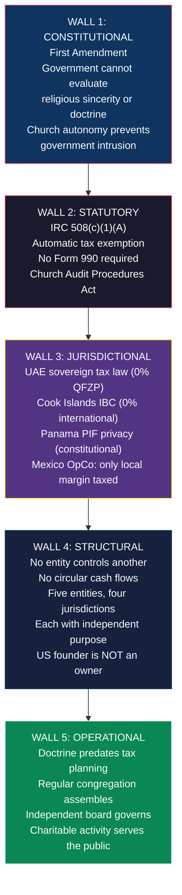

# Legal Defense: Why This Structure Is Defensible

> **Status:** Strategic defense reference — requires counsel validation
> **Last Updated:** February 2026

---

## 1. Thesis

The TE Global Structure is not built on loopholes, grey areas, or untested theories. Every component is an explicit provision of the US Internal Revenue Code, UAE Federal Tax Law, Cook Islands International Companies Act, Panamanian Foundation Law, or Mexican Corporate Tax Law — each tested in court, upheld on appeal, and defended by constitutional protections that have stood for over a century.

An adversary (IRS, state authority, or litigant) would need to breach all five defensive walls simultaneously to cause meaningful damage. No case in US tax history has achieved this against a properly operated multi-jurisdictional religious organization.

---

## 2. The Five Walls of Defense

---

## 3. Wall by Wall

### Wall 1: Constitutional Protection (First Amendment)

The Free Exercise and Establishment Clauses create protections no other entity type enjoys. Courts have held the government **cannot**:

- Evaluate whether religious beliefs are "correct" or "reasonable" (*United States v. Ballard*, 1944)
- Intrude into church governance or internal decision-making (*Serbian Eastern Orthodox Diocese v. Milivojevich*, 1976)
- Interfere with a church's choice of ministers (*Hosanna-Tabor v. EEOC*, 2012 — **unanimous**)
- Override compensation decisions made by religious bodies

Tax exemption for churches is constitutionally **preferred** over taxation. In *Walz v. Tax Commission* (1970), the Supreme Court held that taxing churches would create **more** government entanglement than exempting them.

**What this means for TE:** No court can rule that Christ consciousness is "not a real religion" or that healing programs are "not genuinely religious." The only permissible inquiry is whether beliefs are sincerely held — and TE's doctrinal framework predates any tax planning.

### Wall 2: Statutory Protection (IRC 508(c)(1)(A))

Congress mandated that churches are **automatically exempt** from applying to the IRS for tax-exempt status. The Church of the Living Light does not need IRS permission — it is exempt by operation of law.

**Key protections:**
- **No Form 990.** The public and the IRS have zero visibility into church finances.
- **Church Audit Procedures Act (IRC 7611).** A high-level Treasury official must personally approve any church examination. Written notice. 90-day conference period. 2-year time limit. 5-year cooldown between examinations.
- **Rebuttable presumption (26 CFR 53.4958-6).** Compensation approved by an independent board using comparable data is presumed reasonable — the IRS bears the burden of proving otherwise.

**Audit statistics:** Between October 2020 and September 2022, the IRS opened only **14 church tax examinations** out of ~300,000+ churches. The IRS suspended all new church examinations entirely from 2009 to January 2013 after *Living Word Christian Center* (2009) found the designated official didn't meet statutory requirements.

### Wall 3: Jurisdictional Protection (Multi-Sovereign)

**UAE Free Zone:** TE Global Technology FZ-LLC operates under UAE Federal Decree-Law No. 47 of 2022 at 0% QFZP. The IRS has no authority over UAE sovereign tax policy. The entity has no US nexus — no US employees, no US office, no US agents. Having US *customers* does not create a US trade or business (*Piedras Negras Broadcasting*, 1941). This is identical to how Apple, Google, and thousands of platforms hold IP and collect global revenue through favorable foreign jurisdictions.

**Cook Islands IBC:** Light Brands AI Ltd operates under the Cook Islands International Companies Act 1981-82 at 0% on all international income. This is not a loophole — it is the express statutory regime for IBCs. The Cook Islands is not on any EU blacklist or FATF greylist. It participates in CRS/AEOI (full transparency). The CI IBC has no employees and no physical presence in any country — it is a pure contracting and IP-holding entity. It subcontracts all development to the UAE entity (real substance) and licenses spiritual technology to the Church (arm's length royalty). The Cook Islands is globally recognized as the #1 asset protection jurisdiction: foreign court judgments are not recognized or enforceable, fraudulent transfer claims face a 2-year statute of limitations with a beyond-reasonable-doubt burden of proof.

**Panama PIF:** Beneficiary names are recorded in private regulations — never filed with any government. The US founder is NOT a beneficiary, eliminating CFC/GILTI/Subpart F/Form 5471 entirely. The PIF owns both the UAE entity and the CI IBC, providing a single ownership chain with maximum asset protection.

**Mexico OpCo:** Receives cost + 8-12% margin via arm's-length service delivery agreement. No UAE personnel in Mexico eliminates permanent establishment risk. Transfer pricing study supports the arrangement.

### Wall 4: Structural Protection (Entity Separation)

The IRS's primary attack on multi-entity structures is "substance over form" — arguing separate entities are really one. This doctrine **fails** when each entity has:

1. Genuine business purpose independent of tax savings
2. Real employees, offices, and operations
3. Arm's-length transactions between entities
4. No single person controlling all entities

TE satisfies all four with all five entities. The UAE entity exists to create IP and operate a technology platform. The CI IBC exists to serve external consulting and SaaS clients under the Light Brands brand — a genuinely separate business line from the TE healing center. The church exists to pursue a religious mission. The Mexico OpCo exists to deliver services. The PIF exists for asset protection. None is pretextual.

**Why the CI IBC is not redundant to the UAE entity:** Light Brands serves different clients (external businesses, not healing center guests), offers different services (consulting, SaaS, AI tools, not retreat programs), and carries different risk (consulting liability vs. wellness operations). The CI IBC also provides risk isolation — if QFZP eligibility is challenged for the UAE entity, LB revenue in the CI IBC is unaffected (and vice versa). Finally, the Cook Islands provides asset protection that the UAE does not — foreign judgments against the CI IBC's assets are unenforceable.

**The no-ownership structure** is the most elegant feature. The US founder is an employee of the UAE entity, not an owner. With 0% US ownership: no CFC (IRC 957), no GILTI (IRC 951A), no Subpart F (IRC 952), no Form 5471. The IRS cannot attribute ownership that does not exist.

### Wall 5: Operational Defense (Genuine Religious Activity)

Courts evaluate religious sincerity under a framework established in *Ballard* (1944) and *Africa v. Pennsylvania* (1981). They examine whether beliefs are:

- Truly and sincerely held (not manufactured for tax purposes)
- Part of a comprehensive belief system (not a single-issue position)
- Reflected in the person's conduct

TE satisfies all three. Christ consciousness doctrine predates tax planning, addresses fundamental questions of existence, and the founders maintain personal spiritual practices and regular worship.

---

## 4. Anti-Avoidance Analysis

### REFIPRE Compliance (Mexico)

**Risk:** Mexico's REFIPRE rules impose 40% WHT + non-deductibility on payments from Mexican entities to related parties in preferential tax regimes (<22.5% effective rate).

**Why TE is safe:** Revenue flows INTO the UAE entity from guests (Platform-as-Principal model). The Mexico OpCo receives a service fee FROM the UAE entity — not the other direction. There are no upward royalty or license payments from Mexico to any zero-tax jurisdiction. REFIPRE does not apply to inbound payments.

### REFIPRE Compliance for CI IBC (Mexico)

**Risk:** The Cook Islands IBC is clearly a preferential tax regime (0% < 22.5%). Any direct payment from TE Ops Mexico to Light Brands AI Ltd would trigger REFIPRE's 40% WHT + non-deductibility.

**Why TE is safe:** Mexico OpCo NEVER pays the CI IBC directly. If the TE ecosystem needs Light Brands services, the routing is: Mexico OpCo → service fee to UAE entity (existing arrangement, inbound payment to Mexico) → UAE entity subcontracts to CI IBC (both at 0%, no REFIPRE nexus). Mexico only transacts with the UAE entity. The CI IBC is invisible to the Mexican tax authority in terms of direct payments.

### CFC Elimination (US Founder)

**Risk:** If the US founder owned the UAE entity, CFC rules would force inclusion of all untaxed foreign income on the US personal return.

**Why TE is safe:** The US founder has zero ownership. The Panama PIF (owned by no one — it is an independent legal person) holds 100% of both the UAE entity and the CI IBC. The Canadian founder is the PIF Protector. The US founder is not a beneficiary, has no signatory authority, cannot direct distributions, and has no contractual right to PIF assets. The same no-ownership analysis applies identically to the CI IBC — the US founder has zero relationship with either foreign operating entity.

### Transfer Pricing

**Risk:** SAT could challenge the margin allocated to Mexico OpCo.

**Why TE is defensible:** Cost + 8-12% margin is a standard intercompany service arrangement. Supported by an annual transfer pricing benchmarking study. Comparable to how every multinational hotel chain (Marriott, Hilton, Four Seasons) operates in Mexico.

### Concealed Dividends (Cyprus 2026)

**Risk:** Cyprus introduced a 10% SDC on "concealed dividends" — value transferred to shareholders without formal declaration.

**Why TE is safe:** Use standard channels only — formal salary (0% via 90-day rule) and declared dividends (5% SDC). No creative value-transfer schemes. All distributions properly documented.

### Church Foreign Control

**Risk:** If the UAE entity or PIF controlled the church, it could lose its exempt status.

**Why TE is safe:** The church has its own independent Spiritual Council. The UAE entity has zero governance role. No shared bank accounts. No overlapping board members who could create control allegations.

---

## 5. Key Case Law Reference

| Case | Year | Court | Principle |
|---|---|---|---|
| *Watson v. Jones* | 1872 | SCOTUS | Courts cannot resolve internal church disputes on matters of faith or governance |
| *United States v. Ballard* | 1944 | SCOTUS | Courts cannot evaluate truth or falsity of religious beliefs |
| *Walz v. Tax Commission* | 1970 | SCOTUS (7-1) | Church tax exemption is constitutionally preferred over taxation |
| *Serbian Eastern Orthodox Diocese v. Milivojevich* | 1976 | SCOTUS (7-2) | Civil courts must accept church's own governance determinations |
| *Larson v. Valente* | 1982 | SCOTUS | Laws discriminating among religions face strict scrutiny |
| *Piedras Negras Broadcasting v. Commissioner* | 1941 | BTA | US customers ≠ US trade or business for foreign entities |
| *United Cancer Council v. Commissioner* | 1999 | 7th Cir. (Posner) | Private inurement requires an insider relationship; arm's-length transactions with third parties are not inurement |
| *Branch Ministries v. Rossotti* | 2000 | D.C. Cir. | Only known church to lose exemption — for running anti-candidate political ads. Not for compensation, finances, or programs |
| *Gonzales v. O Centro* | 2006 | SCOTUS (8-0) | RFRA protects sacramental use of controlled substances in religious ceremonies |
| *United States v. Church of World Peace* | 1989 | 10th Cir. | IRS must strictly comply with Section 7611 church audit procedures |
| *Living Word Christian Center* | 2009 | D. Minn. | IRS church audit suspended — designated official didn't meet statutory requirements |
| *Hosanna-Tabor v. EEOC* | 2012 | SCOTUS (9-0) | Ministerial exception: government cannot interfere with church's choice of ministers |
| *Advocate Health Care v. Stapleton* | 2017 | SCOTUS (8-0) | Church retirement plans exempt from ERISA regardless of who established them |
| *Gaylor v. Mnuchin* | 2019 | 7th Cir. | Housing allowance (IRC 107) is constitutional — survived most aggressive challenge |
| *Our Lady of Guadalupe v. Morrissey-Berru* | 2020 | SCOTUS (7-2) | Ministerial exception extends to anyone performing vital religious duties |
| *Tanzin v. Tanvir* | 2020 | SCOTUS (8-0) | RFRA permits monetary damages against federal officials who violate religious freedom |
| *FTC v. Affordable Media* | 1999 | 9th Cir. / Cook Islands | US court held settlor in contempt; Cook Islands trustee legally refused to comply — assets protected under CI law |
| *In re Huber* | 2013 | Bankr. W.D. Wash. | US bankruptcy court attempted to reach Cook Islands trust assets — CI protections held; assets unreachable |
| *Fulton v. City of Philadelphia* | 2021 | SCOTUS (9-0) | Non-generally-applicable laws burdening religion face strict scrutiny |

---

## 6. Comparable Organizations

| Organization | Model | Tax Status | Years Operating |
|---|---|---|---|
| **Optimum Health Institute** (Free Sacred Trinity Church) | Healing retreat as church ministry; charges $2-4K/week for programs | 501(c)(3) tax-exempt | 50+ years |
| **Church of Scientology** | Charges $500K+ for "auditing" (spiritual counseling) | 508(c)(1)(A) tax-exempt (153 entities) | 70+ years |
| **Christian Science** | Spiritual healing fees; practitioners recognized as ministers | IRS-recognized | 140+ years |
| **Kenneth Copeland Ministries** | $7M church-owned parsonage; private jets; refused Congressional investigation | Tax-exempt (no penalties) | 50+ years |

If these organizations maintain exemption under far more aggressive models, a genuine healing ministry with proper governance and conservative compensation has nothing to fear.

---

## 7. Risk Matrix

| Risk | Probability | Impact | Mitigation |
|---|---|---|---|
| **IRS challenges church status** | Low | High | Meet 14/14 IRS criteria. Regular congregation. Doctrine predates tax planning. Independent board. |
| **IRS challenges housing allowance** | Very Low | Medium | Gaylor v. Mnuchin (2019) upheld constitutionality. Designate amounts in advance. Stay within FRV. |
| **Excess benefit (Section 4958)** | Low | High | Rebuttable presumption: independent board + comparables + documentation. |
| **Foreign control allegation** | Low | High | Church board is independent. UAE entity has zero governance role. |
| **QFZP natural persons exclusion** | Medium | Critical | Resolve with UAE counsel before formation. Fallback: 9% still favorable. |
| **IRS argues US founder is constructive PIF owner** | Low | High | Formally excluded as beneficiary. No signatory authority. No control rights. |
| **Mexico PE risk** | Medium | High | No UAE personnel in Mexico. Transfer pricing study. Independent OpCo management. |
| **Content sales classified as UBIT** | Low | Medium | Content is directly mission-related religious education. Same as churches selling Bibles. |
| **Canada challenges founder residency** | Low | High | Sever all ties. File NR73. Maintain 90+ days in UAE. |
| **CI IBC reclassified as having PE** | Very Low | High | Zero employees, zero office, zero physical presence. All development subcontracted to UAE entity. No activity in any country that could create PE. |
| **CI IBC banking difficulties** | Low-Medium | Medium | Use Singapore bank (established CI IBC banking relationships). Full CRS/AEOI compliance. Clean FATF/EU standing. |
| **Cook Islands changes IBC regime** | Very Low | Medium | CI economy depends on financial services sector. IBC regime stable since 1981. Even if changed, grandfather clauses typical. |
| **CI IBC → Church royalty challenged as non-arm's-length** | Low | Medium | Annual TP study. Comparable software/tech licensing rates (5-15%). Church uses the licensed tech for genuine ministry purposes. |
| **Cyprus 90-day exemption challenged** | Low-Medium | High | Meticulous travel records. Boarding passes. Work calendars. Employment contract with UAE entity. |

---

## 8. The Compound Effect

Each wall independently provides significant protection. Together they create compounding defensibility:

1. **Cost of attack exceeds recovery.** The IRS would need UAE tax counsel, Panamanian foundation specialists, Mexican tax experts, First Amendment litigation counsel, and church tax specialists — simultaneously.

2. **Success against one wall does not compromise others.** If the church loses exemption, the UAE entity is unaffected. If the UAE entity faces audit, the church is unaffected.

3. **The structure improves with age.** The longer the church operates with genuine worship, the stronger the sincerity defense. The longer the UAE entity operates with real employees, the stronger the substance defense.

4. **Political barriers prevent systematic attacks.** Any IRS campaign against churches triggers First Amendment concerns and political backlash. The Grassley investigation (2007-2011) targeted the six most extreme cases of potential church abuse and produced zero penalties, zero legislation, zero enforcement.

---

*This document analyzes the legal defensibility of a multi-jurisdictional structure combining US religious organization provisions with UAE free zone benefits and Panamanian asset protection. All legal citations are to real statutes, cases, and rulings. This analysis is for strategic planning purposes and does not constitute legal advice. Implementation requires validation by qualified counsel in each jurisdiction.*
