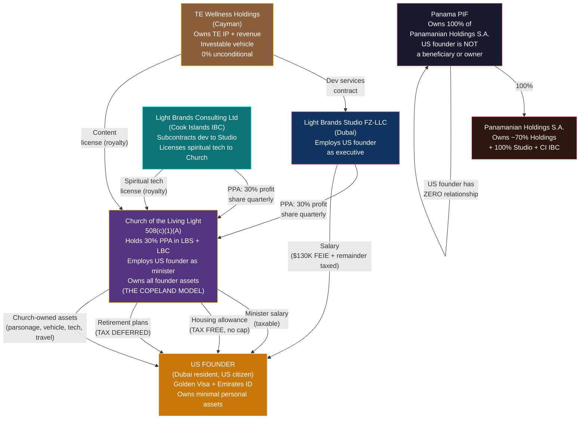
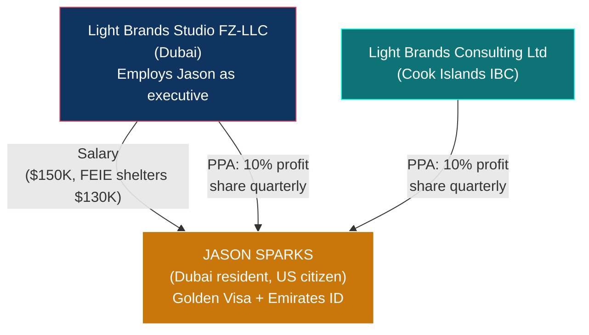
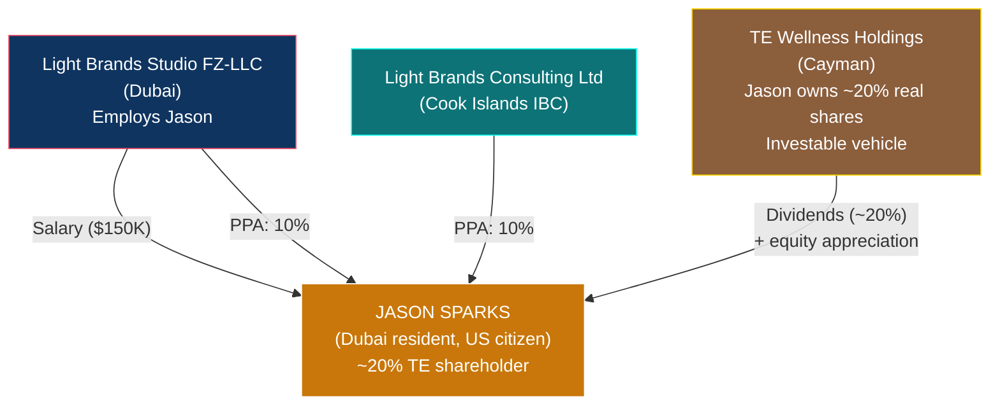
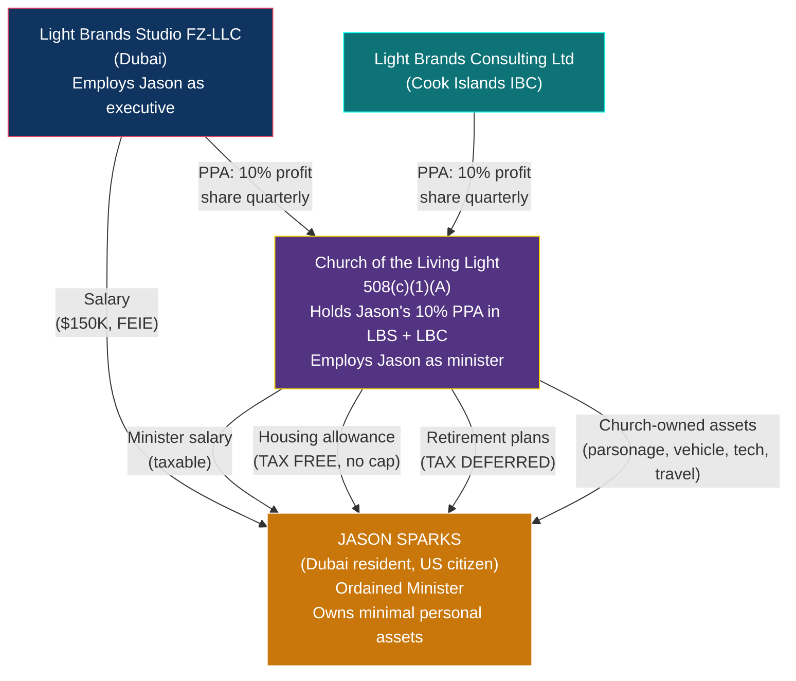
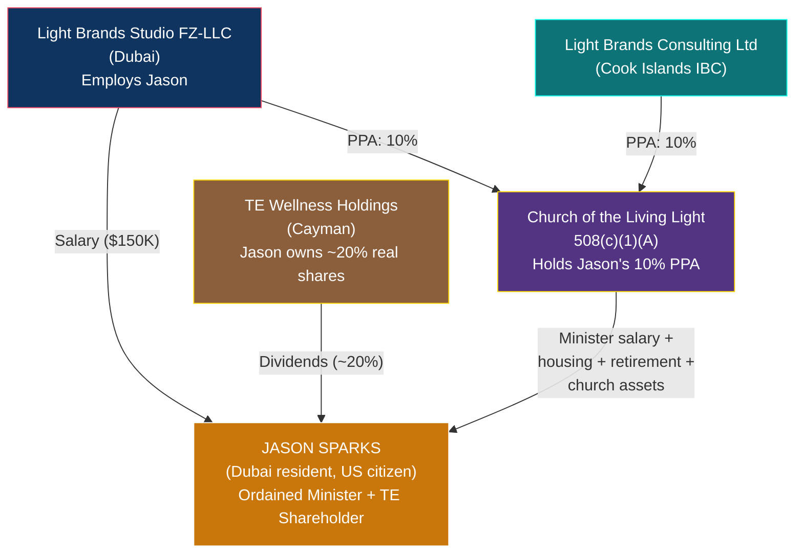

# US Founder Playbook

> **Status:** Personal tax strategy — requires US international tax counsel + religious nonprofit attorney
> **Last Updated:** February 2026
> **Founders Covered:** Daniel Lawless (Copeland model) + Jason Sparks (options assessment)

---

This playbook covers both US founders — Daniel Lawless and Jason Sparks — who are both US citizens living in Dubai on Golden Visas. Their strategies differ based on church involvement:

- **Part I (Sections 1-10):** Daniel Lawless — The Copeland Model (finalized)
- **Part II (Sections 11-17):** Jason Sparks — Options Assessment (four paths, Jason to choose)

---

# PART I — DANIEL LAWLESS: THE COPELAND MODEL

## 1. TL;DR

**~2.5% effective rate on $2.8M+ total value at Year 5.** Daniel lives in Dubai on a Golden Visa, works as an executive at the UAE entity and as an ordained minister at the Church of the Living Light. The church holds Daniel's 30% Profit Participation Agreements in LBS and LBC — making the church (not Daniel) the economic beneficiary of Light Brands profits. All assets are church-owned; Daniel lives the Copeland model as the church's minister.

Six parallel compensation channels — each individually legal, well-precedented, and explicitly provided for in the Internal Revenue Code — combine to produce a personal tax bill of ~$85,400 on $2,844,000+ in total compensation, deferred savings, lifestyle value, and church-held PPA revenue.

Daniel is NOT an owner of any entity. The church holds the PPAs. This eliminates CFC, GILTI, Subpart F, and Form 5471 entirely.

---

## 2. Structure (US Founder Connections Only)

---

## 3. Six Wealth Channels (The Copeland Model)

### Channel 1: UAE Salary (FEIE-Sheltered)

| Detail | Value |
|---|---|
| **What** | Salary for executive/director role at Light Brands Studio FZ-LLC |
| **Y1 / Y3 / Y5** | $200,000 / $250,000 / $300,000 |
| **Tax treatment** | First $130K excluded via FEIE (Form 2555). Remainder at marginal rate (22-35%). Must meet 330-day physical presence test or bona fide residence test (Dubai). |
| **Key constraint** | Must live in Dubai and meet FEIE qualifying days. Cannot spend >35 days in the US. |

### Channel 2: Church Minister Salary

| Detail | Value |
|---|---|
| **What** | Salary for ordained minister role at Church of the Living Light |
| **Y1 / Y3 / Y5** | $80,000 / $150,000 / $300,000 |
| **Tax treatment** | Taxable as ordinary income. Ministers are self-employed for FICA — can opt out entirely via Form 4361 (saves 15.3%). |
| **Key constraint** | Must be board-approved with comparable data. Scales with church budget. |
| **Church revenue base** | Church receives **three revenue streams**: (1) content license royalty from TE Holdings (Cayman), (2) spiritual tech license royalty from CI IBC (Light Brands), (3) **30% PPA distributions from LBS and LBC** (Daniel's assigned PPA interest). All three are UBIT-exempt under IRC 512(b)(2). This gives the church a substantial, growing revenue base that supports board-approved compensation scaling with the ministry. |

### Channel 3: Housing Allowance (IRC 107)

| Detail | Value |
|---|---|
| **What** | Church board designates a portion of minister compensation as "housing allowance" |
| **Y1 / Y3 / Y5** | $80,000 / $200,000 / $300,000 |
| **Tax treatment** | **Excluded from federal income tax. No dollar cap.** Limited to the least of: amount designated, actual housing costs, fair rental value. Subject to SE tax unless Form 4361 filed. |
| **Key constraint** | Must be designated BEFORE the tax year. Covers rent/mortgage, utilities, furnishings, insurance, repairs, maintenance. |

**Why there's no cap:** IRC 107 has been in the code since 1921. Constitutional challenge failed in *Gaylor v. Mnuchin* (7th Cir., 2019). The IRS has never successfully challenged a housing allowance solely for being "too large" on a primary residence, as long as it doesn't exceed fair rental value.

### Channel 4: Retirement (403(b)(9) + 457(b) + 457(f))

| Plan | Annual Amount | Tax Treatment |
|---|---|---|
| **403(b)(9)** | Up to $70,000 (employee + employer) | Tax-deferred. Distributions can be designated as housing allowance in retirement = **tax-free withdrawals for life.** |
| **457(b)** | Up to $23,500 | Tax-deferred. Stacks on top of 403(b). |
| **457(f)** | **Unlimited** | Tax-deferred until vesting. Subject to substantial risk of forfeiture. |
| **Y1 / Y3 / Y5 total** | $47,000 / $347,000 / $547,000 | |

**Key constraint:** 457(f) requires a genuine risk of forfeiture (e.g., must complete X years of service). Church plans are exempt from ERISA (*Advocate Health Care v. Stapleton*, 2017 — unanimous SCOTUS).

### Channel 5: Church-Owned Assets (The Copeland Model)

The US founder owns minimal personal assets. The church purchases and owns all major assets used in ministry. This is the model used by Kenneth Copeland Ministries for 50+ years: $7M church-owned parsonage, private jets for ministry travel, survived Congressional investigation with zero penalties.

| Asset | Ministry Justification | Annual Value |
|---|---|---|
| Parsonage / residence | Minister available to congregation. Church-owned property. | $100,000-500,000+ |
| Vehicle(s) | Transportation for pastoral duties, ministry events | $15,000-50,000 |
| Technology & equipment | Content creation, worship preparation, ministry platform | $10,000-30,000 |
| Travel | Ministry conferences, speaking, community, international mission | $25,000-150,000 |
| **Y1 / Y3 / Y5 total** | | **$100,000 / $200,000 / $400,000** |

**Key constraint:** Ministry use must be primary and documented. Personal use (if any) reported as taxable income. The church's PPA revenue (Channel 6) funds these purchases — the church can afford to own significant assets because it has substantial independent revenue.

**Why this works:** The church is a genuine 508(c)(1)(A) organization with independent governance. The Spiritual Council (not the founder) decides what assets to purchase. All assets serve the ministry. The IRS cannot evaluate whether a church "needs" a particular asset — that is a doctrinal question protected by the First Amendment (*Serbian Eastern Orthodox Diocese*, 1976).

### Channel 6: Church-Held PPA Distributions (LBS + LBC Profits → Church)

| Detail | Value |
|---|---|
| **What** | The US founder's 30% Profit Participation Agreement in LBS and LBC is **irrevocably assigned to the Church of the Living Light**. The church — not the founder — receives quarterly profit distributions from both entities. |
| **Y1 / Y3 / Y5** | ~$60,000 / ~$150,000 / ~$300,000+ (30% of LBS + LBC distributable profits) |
| **Tax treatment** | **$0 personal tax.** The church is a 508(c)(1)(A) tax-exempt organization. PPA distributions are received by the church as UBIT-exempt investment income under IRC 512(b)(2). The founder never receives this money personally — it is church revenue. |
| **Key constraint** | PPA assignment must be irrevocable. The church Spiritual Council (independent board) controls how PPA revenue is used. The founder cannot reclaim the PPA or direct the church's spending. |
| **What it funds** | This revenue, combined with the church's royalty income (Channels 2-5), supports the church's total budget: minister compensation, church-owned assets, charitable programs, and mission work. As LB entities grow, the church's revenue grows — supporting proportionally larger minister compensation and church-owned asset purchases. |
| **CFC/GILTI** | Even if the IRS argued PPAs constitute "ownership" (they don't — PPAs are contractual, not equity), the "owner" is a tax-exempt church. CFC/GILTI has no tax consequence for an exempt entity. This is the strongest possible position. |

**Why this is better than holding PPAs personally:** If Daniel held the PPAs directly, distributions would be taxed at 24-37% federal rate. By assigning PPAs to the church, those same dollars become church revenue (tax-exempt) and flow to Daniel through tax-free and tax-deferred channels (housing allowance, retirement, church-owned assets). The tax savings are dramatic.

**The Copeland precedent:** Kenneth Copeland Ministries has operated this model for 50+ years. The church owns a $7M lakeside parsonage, private jets, and extensive ministry assets. Copeland survived a four-year Congressional investigation (Grassley, 2007-2011) with zero penalties, zero legislation, and zero enforcement action. The Church of the Living Light operates a more conservative version of this model.

### Charitable Deduction on Tithes

The US founder may still donate a portion of his UAE salary to the church as a genuine charitable contribution. This provides a personal deduction (up to 60% of AGI for cash to a church), saving $11,000-$24,000/year. However, this is now a smaller channel — the church's primary revenue comes from PPA distributions and royalties, not from founder donations.

### Retained in TE Holdings + Studio + CI IBC (Not Personal Income)

The vast majority of TE revenue ($10.7M Y1 → $35.5M Y5) stays in TE Holdings (Cayman) at 0% corporate tax. Studio retains a small cost-plus service margin at 0% (QFZP). The 70% of LB profits not allocated to PPAs (Nicholas 30%, Andreas 30%, Jason 10%) stays in the CI IBC at 0%. All three operating entities are held by the Panamanian Holdings S.A. (~70% of Holdings, 100% of Studio and CI IBC), which is 100% owned by the PIF. The US founder does not own or benefit from any entity — this money compounds tax-free and funds business growth, expansion, the Dubai team, and Light Brands operations.

---

## 4. Year-by-Year Projection

### Year 1

| Channel | Amount | Tax to Daniel | Rate |
|---|---|---|---|
| UAE salary ($200K; FEIE covers $130K) | $200,000 | $15,400 | 7.7% |
| Church minister salary | $80,000 | $17,600 | 22.0% |
| Church housing allowance (IRC 107) | $80,000 | **$0** | **0%** |
| Church retirement (403b + 457b) | $47,000 | **$0** (deferred) | **0%** |
| Church-owned assets (parsonage, vehicle, tech, travel) | $100,000 | **$0** | **0%** |
| Church-held PPA distributions (LBS + LBC → church) | ~$60,000 | **$0** (church revenue) | **0%** |
| Charitable deduction on tithes | -$50,000 | -$11,000 savings | — |
| **Total value: $617,000** | | **$22,000** | **3.6%** |

### Year 3

| Channel | Amount | Tax to Daniel | Rate |
|---|---|---|---|
| UAE salary ($250K; FEIE covers $130K) | $250,000 | $26,400 | 10.6% |
| Church minister salary | $150,000 | $33,000 | 22.0% |
| Church housing allowance (IRC 107) | $250,000 | **$0** | **0%** |
| Church retirement (403b + 457b) | $47,000 | **$0** (deferred) | **0%** |
| 457(f) deferred comp | $300,000 | **$0** (deferred) | **0%** |
| Church-owned assets | $200,000 | **$0** | **0%** |
| Church-held PPA distributions (LBS + LBC → church) | ~$150,000 | **$0** (church revenue) | **0%** |
| Charitable deduction | -$75,000 | -$16,500 savings | — |
| **Total value: $1,397,000** | | **$42,900** | **3.1%** |

### Year 5

| Channel | Amount | Tax to Daniel | Rate |
|---|---|---|---|
| UAE salary ($300K; FEIE covers $130K) | $300,000 | $37,400 | 12.5% |
| Church minister salary | $300,000 | $72,000 | 24.0% |
| Church housing allowance (IRC 107) | $400,000 | **$0** | **0%** |
| Church retirement (403b + 457b) | $47,000 | **$0** (deferred) | **0%** |
| 457(f) deferred comp | $500,000 | **$0** (deferred) | **0%** |
| Church-owned assets | $400,000 | **$0** | **0%** |
| Church-held PPA distributions (LBS + LBC → church) | ~$300,000 | **$0** (church revenue) | **0%** |
| Charitable deduction | -$100,000 | -$24,000 savings | — |
| **Total value: $2,844,000** | | **$85,400** | **~2.5%** (on total value including church-held PPA) |

**Plus $547,000 in tax-deferred retirement accounts at Year 5.**

**Note:** PPA distributions to the church are shown as value because they fund the church's budget (which supports housing, assets, retirement, and charitable programs), but they never appear on Daniel's personal tax return. The church's growing PPA revenue justifies the scaling compensation — the board has comparable data (Copeland model) and a growing revenue base to support it.

---

## 5. CFC/GILTI Position

The US founder has **zero** Controlled Foreign Corporation exposure because the US founder has **zero** ownership of TE Holdings, Studio, or the CI IBC. The church holds the PPAs, not the founder.

| CFC Requirement | TE Holdings (Cayman) | Studio (UAE) | CI IBC |
|---|---|---|---|
| US person owns >10% of foreign corporation? | **No** — 0% ownership | **No** — 0% ownership | **No** — 0% ownership |
| US person holds PPA interest? | **No** — assigned to church | **No** — assigned to church | N/A (LBC PPA assigned to church) |
| US person is beneficiary of PIF that owns the CFC? | **No** — formally excluded | **No** — formally excluded | **No** — formally excluded |
| US person has signatory authority over PIF accounts? | **No** | **No** | **No** |
| US person can direct PIF distributions? | **No** | **No** | **No** |
| **CFC/GILTI/Subpart F applies?** | **No** | **No** | **No** |
| **Form 5471 required?** | **No** | **No** | **No** |

The PIF is an independent legal person under Panamanian Law 25 of 1995. It has no "owner." The PIF holds 100% of Panamanian Holdings S.A., which in turn holds ~70% of TE Holdings, 100% of Studio, and 100% of CI IBC. Adding the S.A. as an intermediary does not create any new ownership attribution. The Canadian founder serves as Protector. The US founder is an employee of Studio — no different from a US citizen working for Toyota, Nestle, or Samsung. The same no-ownership analysis applies identically to the S.A. and all three S.A.-owned operating entities: the US founder has zero ownership, zero beneficiary status, and zero control rights over any foreign entity.

**The church-held PPA provides an additional layer of CFC protection.** Even if the IRS argued that PPAs constitute "ownership" (they do not — PPAs are contractual rights, not equity), the "owner" would be a 508(c)(1)(A) tax-exempt church. CFC/GILTI inclusions have no tax consequence for an exempt entity because the church pays no income tax. This makes the church-held PPA the strongest possible CFC defense: (1) PPAs aren't ownership, and (2) even if they were, the holder is exempt.

---

## 6. Bright Lines You Cannot Cross

| Action | Consequence |
|---|---|
| Take a "distribution" or "dividend" from the church | Private inurement. 25% excise + 200% penalty. Loss of exemption. |
| Approve your own compensation without independent board | Automatic excess benefit transaction. |
| Use church assets primarily for personal purposes without documenting ministry use | Taxable fringe benefit or inurement. |
| Let the PIF/UAE entity control church decisions | Foreign control allegation. Loss of exemption. |
| Attempt to reclaim or redirect the assigned PPA | Assignment must be irrevocable. Any retained right to reclaim the PPA destroys the tax benefit and may constitute constructive receipt. |
| Allow church spending on founder to exceed a proportionate share of church revenue | Invites IRS scrutiny. The church must maintain substantial charitable activity (mission work, congregation services, community programs) proportional to its total revenue. |
| Control the Spiritual Council as a de facto majority | Board must be genuinely independent. Founder should not be a voting majority. Comparable compensation data must be used. |
| Create circular cash flows (UAE donates to church → church pays you) | Sham transaction. IRS will recharacterize. |
| Sign PIF documents or PIF bank accounts | Creates evidence of beneficial interest. Triggers CFC/GILTI risk. |
| Backdate housing allowance designation | Invalid. Must be prospective (before the tax year). |
| Commingle funds between entities | Destroys entity separation. |

---

## 7. Annual Compliance Checklist

| Filing | Due Date | What |
|---|---|---|
| **Form 1040** | April 15 (auto-extension to Oct 15 for overseas filers) | US personal income tax return |
| **Form 2555** | With 1040 | Foreign Earned Income Exclusion (FEIE) for UAE salary |
| **FBAR (FinCEN 114)** | April 15 (auto-extension to Oct 15) | Report all foreign accounts >$10K aggregate |
| **Form 8938** | With 1040 | Report foreign financial assets >$200K (end of year) or $300K (any time) for overseas filers |
| **Form 4361** | One-time | Opt out of SE tax as ordained minister (if elected) |
| **Housing allowance designation** | Before each tax year | Board resolution designating amount |
| **Church governance** | Quarterly | Spiritual Council meetings, compensation review, minutes |
| **UAE Golden Visa** | Renewal per schedule | Maintain valid status |
| **330-day test** | Ongoing | Track days inside/outside the US for FEIE qualification |

---

## 8. Action Items

See Section 10 below (updated for Copeland model with church-held PPA).

---

## 9. Risks Specific to US Founder

| Risk | Probability | Impact | Mitigation |
|---|---|---|---|
| **IRS argues constructive ownership of TE Holdings via PIF** | Very Low | Critical | US founder has zero PIF relationship and zero S.A. relationship. TE Holdings is ~70% owned by Panamanian Holdings S.A. (a Panama corporation) + ~30% by investor. The S.A. is 100% owned by the PIF (an independent legal person with no "owner"). No attribution path exists — two separate Panamanian legal persons (S.A. + PIF) stand between the US founder and TE Holdings. Investor as independent shareholder further validates arm's length structure. |
| **IRS argues constructive ownership of Studio via PIF** | Low | High | Formal exclusion from PIF. No signatory authority. No control rights. Canadian founder is sole Protector. Studio is 100% owned by Panamanian Holdings S.A., which is 100% owned by the PIF — two corporate layers separate the US founder from any ownership claim. |
| **IRS challenges church status** | Low | Critical | Under Copeland model, church holds the PPA and provides all assets. If church status is lost, PPA distributions become taxable to the church, and church-owned assets may be recharacterized. UAE salary + FEIE still works as fallback. Mitigation: meet 14/14 IRS criteria, genuine congregation, doctrine predates tax planning, independent board. |
| **FEIE disqualification (too many US days)** | Low | High | Track days rigorously. Stay under 35 US days. Bona fide residence test as fallback. |
| **Housing allowance exceeds FRV** | Low | Medium | Get annual FRV appraisal. Designate conservatively. |
| **Excess benefit transaction** | Low | High | Independent board. Comparable data. Documented decisions. |
| **GILTI/Subpart F inclusion** | Very Low (if no-ownership) | Critical | No-ownership structure must be watertight. No PIF beneficiary status. |
| **IRS argues constructive ownership of CI IBC via PIF** | Very Low | Critical | US founder has zero PIF relationship and zero S.A. relationship. CI IBC is 100% owned by Panamanian Holdings S.A. (a Panama corporation), which is 100% owned by the PIF. No attribution path exists — two separate Panamanian legal persons (S.A. + PIF) stand between the US founder and the CI IBC. |
| **CI IBC royalty to Church challenged** | Low | Medium | Arm's length pricing via TP study. Comparable software licensing rates. Church uses tech for genuine ministry purposes. Even if challenged, church exemption is independent of royalty source. |
| **PPA assignment to church challenged as sham** | Low | High | Assignment is irrevocable, documented, and genuine. Daniel retains no right to reclaim the PPA. Church Spiritual Council independently controls the PPA-derived revenue. The church has genuine charitable activity and independent governance. The Copeland model (church owns assets, minister uses them) has operated for 50+ years without successful challenge. |
| **Church PPA distributions classified as UBIT** | Low | Medium | PPA distributions are investment/royalty-type income, likely exempt under IRC 512(b)(2). If classified as UBIT, church pays tax on distributions — but at the church's rate, not Daniel's rate. Written UBIT opinion from counsel required before PPA assignment. |
| **Total minister compensation deemed excessive (excess benefit)** | Low-Medium | High | Rebuttable presumption: independent board + comparable data + documented decisions. The Copeland precedent ($7M parsonage, private jets) demonstrates that very large packages have survived scrutiny. Start conservatively and scale with church revenue. Key: the ratio of founder benefit to total church activity must remain reasonable. |
| **Constructive receipt of PPA distributions** | Very Low | Critical | Daniel does not receive, control, or have access to PPA distributions. The church's Spiritual Council decides how funds are used. No constructive receipt doctrine applies because Daniel has irrevocably surrendered the PPA interest. |

---

## 10. Action Items

| # | Action | Timeline | Priority |
|---|---|---|---|
| 1 | Engage US international tax attorney — confirm church-held PPA eliminates CFC/GILTI and no adverse assignment consequences | Weeks 1-2 | **Critical** |
| 2 | Engage religious nonprofit attorney — validate 508(c)(1)(A) structure and PPA assignment | Weeks 1-2 | **Critical** |
| 3 | Obtain UBIT opinion on PPA distributions received by church | Weeks 1-2 | **Critical** |
| 4 | Obtain UAE Golden Visa (entrepreneur pathway) | Weeks 2-4 | High |
| 5 | Complete ordination through Church of the Living Light program | Weeks 3-5 | High |
| 6 | Spiritual Council approves compensation and designates housing allowance | Before first tax year | High |
| 7 | Execute PPA assignment agreement (Daniel → Church, irrevocable) | With PPA execution | **Critical** |
| 8 | Execute employment contract with UAE entity | With entity formation | High |
| 9 | Establish 403(b)(9) + 457(b) + 457(f) plans | Months 3-4 | High |
| 10 | File Form 4361 (SE tax opt-out) if electing | First year of ministry | Medium |
| 11 | Separate personal brand IP from church (written agreement) | Day 1 | High |
| 12 | Set up compliance calendar and engage US expat tax preparer | Month 1 | High |
| 13 | Church begins asset acquisition program (parsonage, vehicle, tech) with board approval | Months 3-6 | High |

---

---

# PART II — JASON SPARKS: US FOUNDER OPTIONS ASSESSMENT

> Jason has the same US tax exposure as Daniel — US citizen, Dubai resident, Golden Visa. The key difference: Jason's involvement in the Church of the Living Light may range from zero to full Copeland commitment. This section lays out **four distinct paths** so Jason can assess the trade-offs and choose his route. **Jason has full access to the church channels if he wants them.**

---

## 11. Jason's Profile

| Attribute | Detail |
|---|---|
| **Citizenship** | US citizen |
| **Residence** | Dubai, UAE (Golden Visa) |
| **LBS Economic Interest** | 10% PPA (Profit Participation Agreement) |
| **LBC Economic Interest** | 10% PPA |
| **TE Holdings Equity** | ~20% real shares (under discussion) |
| **Church Involvement** | TBD — Options A-D below range from zero to full Copeland |
| **FEIE Eligibility** | Yes — Dubai resident, 330-day physical presence test |
| **Current Church Role** | None — options below detail what's required |

**Jason's key question:** How deeply does he want to be involved with the Church of the Living Light? The answer determines his tax rate, compliance burden, and lifestyle structure.

---

## 12. The Four Options

### Option A: Personal PPAs + No TE Equity (Simplest Path)

**What it is:** Jason holds 10% PPAs in LBS and LBC personally. No real equity in any entity. No church involvement. Simplest compliance.

**Year-by-Year Projection:**

| Channel | Y1 | Y3 | Y5 |
|---|---|---|---|
| UAE salary (FEIE covers $130K) | $150,000 | $175,000 | $200,000 |
| PPA distributions (10% LBS + LBC) | ~$20,000 | ~$50,000 | ~$100,000 |
| **Total income** | **$170,000** | **$225,000** | **$300,000** |
| Federal tax | ~$8,400 | ~$17,900 | ~$33,400 |
| **Effective rate** | **~4.9%** | **~8.0%** | **~11.1%** |

**Compliance:** Form 1040, Form 2555 (FEIE), FBAR, Form 8938. No Form 5471. No PFIC risk. No church filings.

**Pros:** Simplest. Lowest compliance (~$2-3K/yr tax prep). No church commitment. No Form 5471. No irrevocable decisions.

**Cons:** PPA distributions taxed at full federal rate (24-37%). No tax-free housing. No retirement acceleration. No church-owned assets. Highest effective tax rate of all options.

---

### Option B: Personal PPAs + TE Holdings Equity (Maximum Ownership)

**What it is:** Jason holds 10% PPAs in LBS/LBC personally AND ~20% real equity in TE Wellness Holdings (Cayman). No church involvement. Maximum ownership position with real equity upside.

**Year-by-Year Projection:**

| Channel | Y1 | Y3 | Y5 |
|---|---|---|---|
| UAE salary (FEIE covers $130K) | $150,000 | $175,000 | $200,000 |
| PPA distributions (10% LBS + LBC) | ~$20,000 | ~$50,000 | ~$100,000 |
| TE Holdings dividends (~20%) | ~$0 | ~$25,000 | ~$75,000 |
| TE Holdings unrealized appreciation | *(not taxed until sale)* | | |
| **Total cash income** | **$170,000** | **$250,000** | **$375,000** |
| Federal tax | ~$8,400 | ~$23,700 | ~$48,100 |
| **Effective rate** | **~4.9%** | **~9.5%** | **~12.8%** |

**Form 5471 (mandatory):** Jason owns ~20% of a foreign corporation → Category 4 filer. Must file Form 5471 annually. **$10,000 penalty per form per year for non-filing.** Costs ~$3-5K/yr in professional prep fees.

**PFIC risk:** TE Holdings is a holding company that owns IP and earns royalty/license revenue. If >75% of income is passive (royalties, dividends, investment income) OR >50% of assets are passive, TE Holdings may be classified as a PFIC (Passive Foreign Investment Company). PFIC triggers punitive "excess distribution" taxation on dividends and gain. Mitigation: QEF election (requires TE to provide annual PFIC statements), or structure TE to maximize active business income.

**CFC analysis:** Jason owns ~20%. CFC requires US persons owning 10%+ to collectively hold >50%. If Daniel holds 0% (excluded via PIF/church) and no other US persons hold 10%+, TE Holdings is NOT a CFC. But monitor this — every new US investor moves the needle.

**Pros:** Real equity in TE Holdings (appreciation + exit upside). Voting rights as shareholder. PPA income without real equity triggers. Maximum ownership position.

**Cons:** Form 5471 compliance ($3-5K/yr). PFIC risk. Higher effective rate. More complexity. PPA income still taxed at full federal rate.

---

### Option C: Church-Held PPAs — The Full Copeland Model

**What it is:** Jason joins the Church of the Living Light as an ordained minister. His 10% PPAs in LBS and LBC are **irrevocably assigned to the church**. The church compensates Jason through tax-efficient minister channels: salary, tax-free housing allowance, tax-deferred retirement, church-owned assets. **This is the same model Daniel is using.** No TE equity.

**Year-by-Year Projection:**

| Channel | Y1 | Y3 | Y5 |
|---|---|---|---|
| UAE salary (FEIE covers $130K) | $150,000 | $175,000 | $200,000 |
| Church minister salary | $30,000 | $50,000 | $80,000 |
| Church housing allowance (IRC 107, **tax-free**) | $30,000 | $60,000 | $100,000 |
| Church retirement (403b/457b/457f, **deferred**) | $23,500 | $93,500 | $193,500 |
| Church-owned assets (parsonage, vehicle, tech, travel) | $30,000 | $60,000 | $100,000 |
| Church-held PPA distributions (10% LBS + LBC → church) | ~$20,000 | ~$50,000 | ~$100,000 |
| **Total value** | **$283,500** | **$488,500** | **$773,500** |
| Federal tax | ~$11,000 | ~$17,900 | ~$25,400 |
| **Effective rate** | **~3.9%** | **~3.7%** | **~3.3%** |

**How the church affords this:** With Daniel's 30% AND Jason's 10%, the church receives **40% of LBS + LBC distributable profits** plus royalty income from TE Holdings and CI IBC. This gives the church a substantial, growing revenue base that supports two minister compensation packages. Jason's compensation is proportionally smaller than Daniel's (10% vs 30% PPA), which the Spiritual Council uses as the basis for board-approved compensation scaling.

**Church involvement required:**
- Ordination through Church of the Living Light program
- Genuine, ongoing ministry activity (preaching, pastoral care, community programs, mission work)
- Cannot control the Spiritual Council (independent board)
- Irrevocable PPA assignment — cannot reclaim
- Church-owned assets must have documented ministry purpose

**Tax channels (same as Daniel, scaled to Jason's role):**
- **Housing allowance (IRC 107):** Tax-free, no dollar cap, covers rent/mortgage + utilities + furnishings. Constitutional (*Gaylor v. Mnuchin*, 2019).
- **Retirement (403(b)(9) + 457(b) + 457(f)):** Tax-deferred. 457(f) is unlimited. Church plans exempt from ERISA.
- **Church-owned assets:** Parsonage, vehicles, tech, travel — all ministry use. Same Copeland precedent ($7M parsonage, private jets, survived Congressional investigation).
- **SE tax opt-out (Form 4361):** Ministers can opt out of self-employment tax entirely (saves 15.3%).

**Pros:** Dramatic tax savings (~3.3% vs ~11.1% at Y5). Tax-free housing. Unlimited tax-deferred retirement. Church-owned assets. No CFC/GILTI/Form 5471. Strongest possible tax position.

**Cons:** Requires genuine, deep church commitment. Irrevocable PPA assignment. Church board controls PPA revenue. Must be ordained. Subject to excess benefit rules. No TE equity upside.

---

### Option D: Hybrid — TE Equity + Church-Held PPAs (Best of Both Worlds)

**What it is:** Jason holds ~20% real equity in TE Holdings AND assigns his 10% LBS/LBC PPAs to the church. Gets TE appreciation/exit upside **plus** church tax efficiency on Light Brands profits. Most complex, but potentially the optimal balance.

**Year-by-Year Projection:**

| Channel | Y1 | Y3 | Y5 |
|---|---|---|---|
| UAE salary (FEIE covers $130K) | $150,000 | $175,000 | $200,000 |
| TE Holdings dividends (~20%) | ~$0 | ~$25,000 | ~$75,000 |
| Church minister salary | $30,000 | $50,000 | $80,000 |
| Church housing allowance (IRC 107, **tax-free**) | $30,000 | $60,000 | $100,000 |
| Church retirement (403b/457b/457f, **deferred**) | $23,500 | $93,500 | $193,500 |
| Church-owned assets | $30,000 | $60,000 | $100,000 |
| Church-held PPA distributions (10% → church) | ~$20,000 | ~$50,000 | ~$100,000 |
| **Total value** | **$283,500** | **$513,500** | **$848,500** |
| Federal tax | ~$11,000 | ~$23,600 | ~$40,700 |
| **Effective rate** | **~3.9%** | **~4.6%** | **~4.8%** |

**Why this might be the best option:** Jason gets real equity upside in TE Holdings (the investable vehicle that will attract outside capital) while routing his Light Brands profits through the tax-efficient church channels. TE dividends are taxed, but the LB profit share (the majority of his recurring income) flows through the church at effectively 0%. On exit, Jason participates in TE's sale directly as a shareholder.

**Compliance:** Everything from Option C (church filings) PLUS Form 5471 for TE Holdings PLUS PFIC analysis. Most complex of all options (~$7-10K/yr in compliance costs).

**Pros:** Real equity in TE + church tax efficiency on LB. Best of both worlds. TE exit upside. Lower effective rate than Option B. Church-owned assets + housing + retirement.

**Cons:** Most complex. Form 5471 + PFIC risk on TE. Church commitment required. Highest compliance cost.

---

## 13. Side-by-Side Comparison

| | **Option A** | **Option B** | **Option C** | **Option D** |
|---|---|---|---|---|
| **Description** | PPAs only, personal | PPAs + TE equity | Full Copeland | TE equity + church PPAs |
| **Church involvement** | None | None | Full | Full |
| **TE Holdings equity** | No | ~20% real shares | No | ~20% real shares |
| **LBS/LBC PPAs** | Personal | Personal | Church-held | Church-held |
| **Y1 total value** | $170,000 | $170,000 | $283,500 | $283,500 |
| **Y3 total value** | $225,000 | $250,000 | $488,500 | $513,500 |
| **Y5 total value** | $300,000 | $375,000 | $773,500 | $848,500 |
| **Y5 federal tax** | ~$33,400 | ~$48,100 | ~$25,400 | ~$40,700 |
| **Y5 effective rate** | **~11.1%** | **~12.8%** | **~3.3%** | **~4.8%** |
| **Form 5471** | No | Yes (1 filing) | No | Yes (1 filing) |
| **PFIC risk** | No | Yes | No | Yes |
| **CFC risk** | No | No (if US ≤50%) | No | No (if US ≤50%) |
| **Annual compliance cost** | ~$2-3K | ~$5-8K | ~$3-5K | ~$7-10K |
| **Irrevocable commitment** | None | None | PPA to church | PPA to church |
| **Ordination required** | No | No | Yes | Yes |
| **Exit upside (TE sale)** | None | ~20% of TE | None | ~20% of TE |
| **Complexity** | Low | Medium | Medium | High |

**The numbers are stark:** At Year 5, Option C saves Jason ~$8,000/yr in tax over Option A AND delivers $473,500 more in total value (through church channels). Option D adds TE equity on top. The church options aren't just tax savings — they're wealth-building accelerators through retirement plans and church-owned assets.

---

## 14. Decision Matrix: Which Option Is Right for Jason?

| If Jason wants... | Best option |
|---|---|
| Maximum simplicity, minimum compliance | **Option A** |
| Real equity ownership + TE exit upside, no church | **Option B** |
| Maximum tax efficiency + genuine church commitment | **Option C** |
| TE equity upside + tax efficiency on LB profits | **Option D** |
| No church involvement at all | **Option A or B** |
| Church involvement + no equity complexity | **Option C** |
| Everything — equity + church + maximum value | **Option D** |

### The Church Question

The church route (Options C and D) requires **genuine commitment**. Daniel is building the Church of the Living Light as a life mission — his entire lifestyle, assets, and ministry will flow through the church. Jason is welcome to join. The church can support multiple ministers, and having two ordained ministers actually strengthens the church's legitimacy.

**But the IRS will scrutinize any minister whose only connection to the church is receiving tax-efficient compensation.**

**What "genuine" means for Jason:**

- **Ordained** through the Church of the Living Light's program
- **Active in ministry** — preaching, pastoral care, community programs, mission work, content creation for the church's spiritual platform
- Cannot just "sign up" to receive tax benefits — the involvement must be real, documented, and ongoing
- The Spiritual Council (independent board) approves compensation based on Jason's ministry role + comparable data
- Jason's compensation should be **proportionate to his involvement** — if Jason's ministry activity is 1/3 of Daniel's, his church compensation should reflect that ratio

**Jason can absolutely join the church.** The question is whether his involvement will be deep and genuine enough to withstand IRS scrutiny. Daniel's involvement will be extensive. Jason should have an honest conversation with himself about whether he's prepared to make the church a real part of his life — not just a tax vehicle.

**If the answer is yes:** Options C or D deliver dramatically better outcomes. If the answer is "maybe later," Jason can start with Option A or B and transition to the church route later (with a new PPA assignment at that time — though the tax benefit only begins from the assignment date forward).

---

## 15. CFC/GILTI Analysis by Option

| | Option A | Option B | Option C | Option D |
|---|---|---|---|---|
| **Owns foreign corp shares?** | No | Yes (~20% TE) | No | Yes (~20% TE) |
| **Form 5471 required?** | No | Yes (Cat. 4) | No | Yes (Cat. 4) |
| **CFC?** | N/A | No (if US ≤50% of TE) | N/A | No (if US ≤50% of TE) |
| **GILTI inclusion?** | No | No (not CFC) | No | No (not CFC) |
| **Subpart F inclusion?** | No | No (not CFC) | No | No (not CFC) |
| **PFIC risk?** | No | Yes | No | Yes |
| **PPA = "ownership" risk?** | PPAs contractual, not equity | PPAs + real shares | PPAs held by exempt church | PPAs held by exempt church + real shares |

**Critical guardrail for Options B and D:** TE Holdings must NOT become a CFC. If Jason owns ~20%, the structure has room for up to ~30% more US ownership (by 10%+ shareholders) before triggering CFC. This means: if Daniel holds 0% (confirmed — excluded via PIF/church), and Jason holds ~20%, you need additional US persons holding 10%+ to collectively exceed 30% before CFC triggers. **Monitor this with every new investor round.** Build a structural safeguard into the TE Holdings shareholder agreement: no issuance of shares that would cause total US 10%+ shareholder ownership to exceed 49.9%.

---

## 16. Risks Specific to Jason

| Risk | Applies to | Probability | Impact | Mitigation |
|---|---|---|---|---|
| **PPA distributions taxed at high marginal rate** | A, B | Certain | Medium | Structure timing of distributions to manage bracket. No mitigation without church route. |
| **Form 5471 non-filing penalty ($10K/form/year)** | B, D | Medium (if missed) | High | Engage US expat tax preparer with Form 5471 experience. Calendar reminders. Budget $3-5K/yr for prep. |
| **PFIC classification of TE Holdings** | B, D | Medium | High | QEF election (requires TE to provide annual PFIC statements). Structure TE to maximize active business income. Active business test: ensure >50% of assets are active, >25% of income is active. |
| **TE Holdings becomes CFC (future US investors)** | B, D | Low | Critical | Cap US 10%+ shareholder ownership at 49.9% in SHA. Monitor investor composition every round. If triggered: GILTI inclusion on Jason's share of TE undistributed earnings (~10.5-13.125%). |
| **IRS challenges church minister status** | C, D | Low | Critical | Genuine involvement. Independent board. Meet 14/14 IRS church criteria. Documented ministry activity. Multiple ministers (Daniel + Jason) strengthen the case. |
| **Excess benefit transaction (church compensation)** | C, D | Low | High | Board-approved compensation with comparable data. Jason's package proportionate to his ministry role (smaller than Daniel's 30% share). Rebuttable presumption: independent board + comparables + documentation. |
| **PPA assignment to church challenged as sham** | C, D | Low | High | Irrevocable assignment. Independent governance. Church has genuine charitable mission. Two ministers (not just one founder extracting value). |
| **Constructive receipt of PPA distributions** | C, D | Very Low | Critical | Same protections as Daniel: irrevocable assignment, no access to PPA funds, Spiritual Council controls spending independently. |
| **FEIE disqualification (>35 US days)** | All | Low | High | Track days rigorously. Stay under 35 US days/year. Bona fide residence test as fallback. |
| **IRS argues constructive ownership via PIF** | All | Very Low | Critical | Jason has zero PIF relationship — not a beneficiary, not a signatory, not a controller. Two Panamanian legal persons (S.A. + PIF) between Jason and all entities. |
| **Church PPA distributions classified as UBIT** | C, D | Low | Medium | Written UBIT opinion from counsel. PPA distributions likely UBIT-exempt under IRC 512(b)(2). Even if UBIT applies, church pays tax (not Jason personally). |

---

## 17. Action Items by Option

### If Jason Chooses Option A (PPAs Only — Simplest):

| # | Action | Timeline | Priority |
|---|---|---|---|
| 1 | Engage US expat tax preparer | Month 1 | High |
| 2 | Obtain UAE Golden Visa (entrepreneur pathway) | Weeks 2-4 | High |
| 3 | Execute PPA agreements (10% LBS + 10% LBC) | With entity formation | **Critical** |
| 4 | Set up FBAR/Form 8938 compliance calendar | Month 1 | High |
| 5 | Begin tracking FEIE qualifying days (330-day test) | Day 1 | High |

### If Jason Chooses Option B (PPAs + TE Equity):

| # | Action | Timeline | Priority |
|---|---|---|---|
| 1-5 | All Option A items | Same | Same |
| 6 | Engage US international tax attorney — Form 5471 + PFIC analysis for TE Holdings | Week 1 | **Critical** |
| 7 | Obtain PFIC classification analysis for TE Holdings | Weeks 2-4 | **Critical** |
| 8 | File QEF election if PFIC applies | With first tax return | Critical |
| 9 | Execute TE Holdings share subscription (~20%) | With investment | High |
| 10 | Set up annual Form 5471 compliance process | Year 1 | High |
| 11 | Build CFC monitoring clause into TE Holdings SHA | With formation | High |

### If Jason Chooses Option C (Full Copeland — Church-Held PPAs):

| # | Action | Timeline | Priority |
|---|---|---|---|
| 1 | Have honest conversation with Daniel about church involvement and commitment level | Week 1 | **Critical** |
| 2 | Engage US international tax attorney — confirm church-held PPA eliminates CFC/GILTI | Weeks 1-2 | **Critical** |
| 3 | Engage religious nonprofit attorney — validate second minister role | Weeks 1-2 | **Critical** |
| 4 | Obtain UBIT opinion on PPA distributions received by church | Weeks 1-2 | **Critical** |
| 5 | Complete ordination through Church of the Living Light program | Weeks 3-6 | High |
| 6 | Execute PPA assignment agreement (Jason → Church, irrevocable) | With PPA execution | **Critical** |
| 7 | Spiritual Council approves Jason's compensation package | Before first tax year | High |
| 8 | File Form 4361 (SE tax opt-out, if elected) | First year of ministry | Medium |
| 9 | Set up housing allowance designation (board resolution, before tax year) | Before first tax year | High |
| 10 | Establish retirement plans — 403(b)(9) + 457(b), with 457(f) as church revenue grows | Months 3-4 | High |
| 11 | Church begins asset acquisition for Jason's ministry use (with board approval) | Months 3-6 | High |

### If Jason Chooses Option D (Hybrid — TE Equity + Church PPAs):

| # | Action | Timeline | Priority |
|---|---|---|---|
| 1-11 | All Option C items | Same | Same |
| 12 | Engage US international tax attorney — add Form 5471 + PFIC analysis for TE Holdings | Week 1 | **Critical** |
| 13 | Execute TE Holdings share subscription (~20%) | With investment | High |
| 14 | File QEF election if PFIC applies | With first tax return | Critical |
| 15 | Set up annual Form 5471 compliance process | Year 1 | High |
| 16 | Build CFC monitoring clause into TE Holdings SHA | With formation | High |

---

## 18. Jason's Compliance Summary by Option

| Filing | Option A | Option B | Option C | Option D |
|---|---|---|---|---|
| **Form 1040** | Yes | Yes | Yes | Yes |
| **Form 2555 (FEIE)** | Yes | Yes | Yes | Yes |
| **FBAR (FinCEN 114)** | Yes | Yes | Yes | Yes |
| **Form 8938** | Yes | Yes | Yes | Yes |
| **Form 5471** | No | **Yes** | No | **Yes** |
| **PFIC (QEF/MTM)** | No | **Maybe** | No | **Maybe** |
| **Form 4361 (SE opt-out)** | No | No | Optional | Optional |
| **Housing allowance designation** | No | No | **Yes (annual)** | **Yes (annual)** |
| **Church governance participation** | No | No | **Yes (quarterly)** | **Yes (quarterly)** |
| **330-day tracking** | Yes | Yes | Yes | Yes |
| **Est. annual compliance cost** | **$2-3K** | **$5-8K** | **$3-5K** | **$7-10K** |

---

*This document describes legal tax optimization mechanisms available to US citizens who are employees of a UAE entity. Daniel Lawless additionally operates as an ordained minister of the Church of the Living Light under the Copeland model (church-held PPA, church-owned assets). Jason Sparks has four options ranging from simple PPA-only to full Copeland, detailed in Part II. All mechanisms (IRC 107, IRC 403(b)(9), IRC 457, IRC 508(c)(1)(A), IRC 911, IRC 512(b)(2)) are explicit provisions of the US tax code, upheld by courts, and widely used by established religious organizations. The church-held PPA model is patterned after Kenneth Copeland Ministries, which has operated for 50+ years without losing exempt status. Implementation requires validation by qualified US international tax counsel, religious nonprofit attorney, and written UBIT opinion.*
