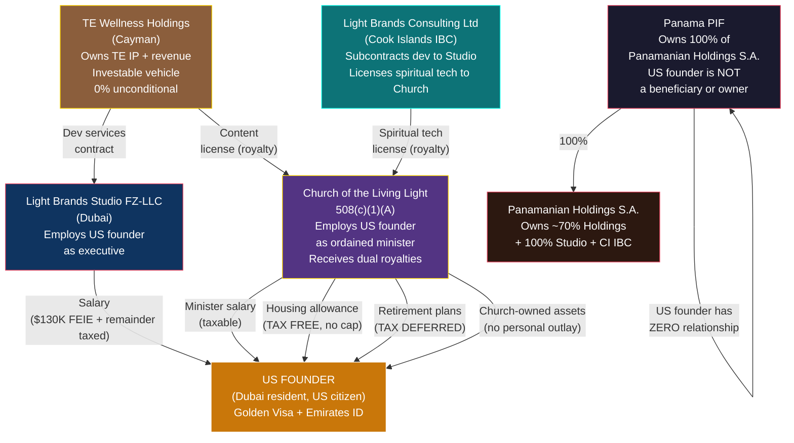

# US Founder Playbook

> **Status:** Personal tax strategy — requires US international tax counsel + religious nonprofit attorney
> **Last Updated:** February 2026

---

## 1. TL;DR

**~3.7% effective rate on $2.3M total value at Year 5.** The US founder lives in Dubai on a Golden Visa, works as an executive at the UAE entity and as an ordained minister at the Church of the Living Light. Seven parallel compensation channels — each individually legal, well-precedented, and explicitly provided for in the Internal Revenue Code — combine to produce a personal tax bill of ~$85,400 on $2,294,000 in total compensation, deferred savings, and lifestyle value.

The US founder is NOT an owner of the UAE entity. This eliminates CFC, GILTI, Subpart F, and Form 5471 entirely.

---

## 2. Structure (US Founder Connections Only)

---

## 3. Seven Wealth Channels

### Channel 1: UAE Salary (FEIE-Sheltered)

| Detail | Value |
|---|---|
| **What** | Salary for executive/director role at Light Brands Studio FZ-LLC |
| **Y1 / Y3 / Y5** | $200,000 / $250,000 / $300,000 |
| **Tax treatment** | First $130K excluded via FEIE (Form 2555). Remainder at marginal rate (22-35%). Must meet 330-day physical presence test or bona fide residence test (Dubai). |
| **Key constraint** | Must live in Dubai and meet FEIE qualifying days. Cannot spend >35 days in the US. |

### Channel 2: Church Minister Salary

| Detail | Value |
|---|---|
| **What** | Salary for ordained minister role at Church of the Living Light |
| **Y1 / Y3 / Y5** | $80,000 / $150,000 / $300,000 |
| **Tax treatment** | Taxable as ordinary income. Ministers are self-employed for FICA — can opt out entirely via Form 4361 (saves 15.3%). |
| **Key constraint** | Must be board-approved with comparable data. Scales with church budget. |
| **Light Brands effect** | Church now receives **dual royalty streams** — content license from TE Holdings (Cayman) (TE spiritual content) + spiritual tech license from CI IBC (Light Brands tools/platforms). Both are UBIT-exempt under IRC 512(b)(2). This expands the church's revenue base, supporting higher board-approved compensation as the ministry grows. |

### Channel 3: Housing Allowance (IRC 107)

| Detail | Value |
|---|---|
| **What** | Church board designates a portion of minister compensation as "housing allowance" |
| **Y1 / Y3 / Y5** | $80,000 / $200,000 / $300,000 |
| **Tax treatment** | **Excluded from federal income tax. No dollar cap.** Limited to the least of: amount designated, actual housing costs, fair rental value. Subject to SE tax unless Form 4361 filed. |
| **Key constraint** | Must be designated BEFORE the tax year. Covers rent/mortgage, utilities, furnishings, insurance, repairs, maintenance. |

**Why there's no cap:** IRC 107 has been in the code since 1921. Constitutional challenge failed in *Gaylor v. Mnuchin* (7th Cir., 2019). The IRS has never successfully challenged a housing allowance solely for being "too large" on a primary residence, as long as it doesn't exceed fair rental value.

### Channel 4: Retirement (403(b)(9) + 457(b) + 457(f))

| Plan | Annual Amount | Tax Treatment |
|---|---|---|
| **403(b)(9)** | Up to $70,000 (employee + employer) | Tax-deferred. Distributions can be designated as housing allowance in retirement = **tax-free withdrawals for life.** |
| **457(b)** | Up to $23,500 | Tax-deferred. Stacks on top of 403(b). |
| **457(f)** | **Unlimited** | Tax-deferred until vesting. Subject to substantial risk of forfeiture. |
| **Y1 / Y3 / Y5 total** | $47,000 / $347,000 / $547,000 | |

**Key constraint:** 457(f) requires a genuine risk of forfeiture (e.g., must complete X years of service). Church plans are exempt from ERISA (*Advocate Health Care v. Stapleton*, 2017 — unanimous SCOTUS).

### Channel 5: Church-Owned Assets

| Asset | Ministry Justification | Annual Value |
|---|---|---|
| Parsonage / residence | Minister available to congregation | $50,000-300,000+ |
| Vehicle | Transportation for pastoral duties | $10,000-30,000 |
| Technology | Content review, worship preparation | $5,000-15,000 |
| Travel | Ministry conferences, speaking, community | $15,000-100,000 |
| **Y1 / Y3 / Y5 total** | | **$50,000 / $100,000 / $200,000** |

**Key constraint:** Ministry use must be primary and documented. Personal use (if any) reported as taxable income.

### Channel 6: Charitable Deduction on Tithes

| Detail | Value |
|---|---|
| **What** | Founder donates portion of UAE salary to the church |
| **Y1 / Y3 / Y5** | $50,000 / $75,000 / $100,000 deduction |
| **Tax treatment** | Personal charitable deduction (up to 60% of AGI for cash to a church). Saves $11,000-$24,000 in personal tax. |
| **Key constraint** | Genuine charitable donation. Funded church mission, not disguised salary return. |

### Channel 7: Retained in TE Holdings + Studio + CI IBC (Not Personal Income)

The vast majority of TE revenue ($10.7M Y1 → $35.5M Y5) stays in TE Holdings (Cayman) at 0% corporate tax. Studio retains a small cost-plus service margin at 0% (QFZP). All Light Brands revenue stays in the CI IBC at 0%. All three operating entities are held by the Panamanian Holdings S.A. (~70% of Holdings, 100% of Studio and CI IBC), which is 100% owned by the PIF. The US founder does not own or benefit from any entity — this money compounds tax-free and funds business growth, expansion, the Dubai team, and Light Brands operations. As LB scales, this retained capital pool grows with zero additional tax impact.

---

## 4. Year-by-Year Projection

### Year 1

| Channel | Amount | Tax | Rate |
|---|---|---|---|
| UAE salary ($200K; FEIE covers $130K) | $200,000 | $15,400 | 7.7% |
| Church minister salary | $80,000 | $17,600 | 22.0% |
| Church housing allowance | $80,000 | **$0** | **0%** |
| Church retirement (403b + 457b) | $47,000 | **$0** (deferred) | **0%** |
| Church-owned assets (lifestyle) | $50,000 | **$0** | **0%** |
| Charitable deduction on tithes | -$50,000 | -$11,000 savings | — |
| **Total: $507,000** | | **$22,000** | **4.3%** |

### Year 3

| Channel | Amount | Tax | Rate |
|---|---|---|---|
| UAE salary ($250K; FEIE covers $130K) | $250,000 | $26,400 | 10.6% |
| Church minister salary | $150,000 | $33,000 | 22.0% |
| Church housing allowance | $200,000 | **$0** | **0%** |
| Church retirement (403b + 457b) | $47,000 | **$0** (deferred) | **0%** |
| 457(f) deferred comp | $300,000 | **$0** (deferred) | **0%** |
| Church-owned assets | $100,000 | **$0** | **0%** |
| Charitable deduction | -$75,000 | -$16,500 savings | — |
| **Total: $1,097,000** | | **$42,900** | **3.9%** |

### Year 5

| Channel | Amount | Tax | Rate |
|---|---|---|---|
| UAE salary ($300K; FEIE covers $130K) | $300,000 | $37,400 | 12.5% |
| Church minister salary | $300,000 | $72,000 | 24.0% |
| Church housing allowance | $300,000 | **$0** | **0%** |
| Church retirement (403b + 457b) | $47,000 | **$0** (deferred) | **0%** |
| 457(f) deferred comp | $500,000 | **$0** (deferred) | **0%** |
| Church-owned assets | $200,000 | **$0** | **0%** |
| Charitable deduction | -$100,000 | -$24,000 savings | — |
| **Total: $2,294,000** | | **$85,400** | **3.7%** |

**Plus $547,000 in tax-deferred retirement accounts at Year 5.**

---

## 5. CFC/GILTI Position

The US founder has **zero** Controlled Foreign Corporation exposure because the US founder has **zero** ownership of TE Holdings, Studio, or the CI IBC.

| CFC Requirement | TE Holdings (Cayman) | Studio (UAE) | CI IBC |
|---|---|---|---|
| US person owns >10% of foreign corporation? | **No** — 0% ownership | **No** — 0% ownership | **No** — 0% ownership |
| US person is beneficiary of PIF that owns the CFC? | **No** — formally excluded | **No** — formally excluded | **No** — formally excluded |
| US person has signatory authority over PIF accounts? | **No** | **No** | **No** |
| US person can direct PIF distributions? | **No** | **No** | **No** |
| **CFC/GILTI/Subpart F applies?** | **No** | **No** | **No** |
| **Form 5471 required?** | **No** | **No** | **No** |

The PIF is an independent legal person under Panamanian Law 25 of 1995. It has no "owner." The PIF holds 100% of Panamanian Holdings S.A., which in turn holds ~70% of TE Holdings, 100% of Studio, and 100% of CI IBC. Adding the S.A. as an intermediary does not create any new ownership attribution. The Canadian founder serves as Protector. The US founder is an employee of Studio — no different from a US citizen working for Toyota, Nestle, or Samsung. The same no-ownership analysis applies identically to the S.A. and all three S.A.-owned operating entities: the US founder has zero ownership, zero beneficiary status, and zero control rights over any foreign entity.

---

## 6. Bright Lines You Cannot Cross

| Action | Consequence |
|---|---|
| Take a "distribution" or "dividend" from the church | Private inurement. 25% excise + 200% penalty. Loss of exemption. |
| Approve your own compensation without independent board | Automatic excess benefit transaction. |
| Use church assets primarily for personal purposes without documenting ministry use | Taxable fringe benefit or inurement. |
| Let the PIF/UAE entity control church decisions | Foreign control allegation. Loss of exemption. |
| Create circular cash flows (UAE donates to church → church pays you) | Sham transaction. IRS will recharacterize. |
| Sign PIF documents or PIF bank accounts | Creates evidence of beneficial interest. Triggers CFC/GILTI risk. |
| Backdate housing allowance designation | Invalid. Must be prospective (before the tax year). |
| Commingle funds between entities | Destroys entity separation. |

---

## 7. Annual Compliance Checklist

| Filing | Due Date | What |
|---|---|---|
| **Form 1040** | April 15 (auto-extension to Oct 15 for overseas filers) | US personal income tax return |
| **Form 2555** | With 1040 | Foreign Earned Income Exclusion (FEIE) for UAE salary |
| **FBAR (FinCEN 114)** | April 15 (auto-extension to Oct 15) | Report all foreign accounts >$10K aggregate |
| **Form 8938** | With 1040 | Report foreign financial assets >$200K (end of year) or $300K (any time) for overseas filers |
| **Form 4361** | One-time | Opt out of SE tax as ordained minister (if elected) |
| **Housing allowance designation** | Before each tax year | Board resolution designating amount |
| **Church governance** | Quarterly | Spiritual Council meetings, compensation review, minutes |
| **UAE Golden Visa** | Renewal per schedule | Maintain valid status |
| **330-day test** | Ongoing | Track days inside/outside the US for FEIE qualification |

---

## 8. Action Items

| # | Action | Timeline | Priority |
|---|---|---|---|
| 1 | Engage US international tax attorney — confirm no-ownership eliminates CFC/GILTI | Weeks 1-2 | **Critical** |
| 2 | Engage religious nonprofit attorney — validate 508(c)(1)(A) structure | Weeks 1-2 | **Critical** |
| 3 | Obtain UAE Golden Visa (entrepreneur pathway) | Weeks 2-4 | High |
| 4 | Complete ordination through Church of the Living Light program | Weeks 3-5 | High |
| 5 | Spiritual Council approves compensation and designates housing allowance | Before first tax year | High |
| 6 | Execute employment contract with UAE entity | With entity formation | High |
| 7 | Establish 403(b)(9) + 457(b) + 457(f) plans | Months 3-4 | High |
| 8 | File Form 4361 (SE tax opt-out) if electing | First year of ministry | Medium |
| 9 | Separate personal brand IP from church (written agreement) | Day 1 | High |
| 10 | Set up compliance calendar and engage US expat tax preparer | Month 1 | High |

---

## 9. Risks Specific to US Founder

| Risk | Probability | Impact | Mitigation |
|---|---|---|---|
| **IRS argues constructive ownership of TE Holdings via PIF** | Very Low | Critical | Same analysis as Studio. US founder has zero PIF relationship. Holdings owned ~70% by PIF (via S.A.) + ~30% by investor. No attribution path exists. Investor as independent shareholder further validates arm's length structure. Additional S.A. corporate layer between PIF and Holdings further separates the US founder. |
| **IRS argues constructive ownership of Studio via PIF** | Low | High | Formal exclusion from PIF. No signatory authority. No control rights. Canadian founder is sole Protector. |
| **IRS challenges church status** | Low | High | Only impacts church channels. UAE salary + FEIE still works. 14/14 IRS criteria met. |
| **FEIE disqualification (too many US days)** | Low | High | Track days rigorously. Stay under 35 US days. Bona fide residence test as fallback. |
| **Housing allowance exceeds FRV** | Low | Medium | Get annual FRV appraisal. Designate conservatively. |
| **Excess benefit transaction** | Low | High | Independent board. Comparable data. Documented decisions. |
| **GILTI/Subpart F inclusion** | Very Low (if no-ownership) | Critical | No-ownership structure must be watertight. No PIF beneficiary status. |
| **IRS argues constructive ownership of CI IBC via PIF** | Very Low | Critical | Same analysis as UAE entity. US founder has zero PIF relationship. CI IBC owned 100% by PIF (via S.A.). No attribution path exists. Additional S.A. corporate layer between PIF and CI IBC further separates the US founder. |
| **CI IBC royalty to Church challenged** | Low | Medium | Arm's length pricing via TP study. Comparable software licensing rates. Church uses tech for genuine ministry purposes. Even if challenged, church exemption is independent of royalty source. |

---

*This document describes legal tax optimization mechanisms available to a US citizen who is an ordained minister and employee of both a UAE entity and a US church. All mechanisms (IRC 107, IRC 403(b)(9), IRC 457, IRC 508(c)(1)(A), IRC 911) are explicit provisions of the US tax code, upheld by courts, and widely used by established religious organizations. Implementation requires validation by qualified US international tax counsel and religious nonprofit attorney.*
