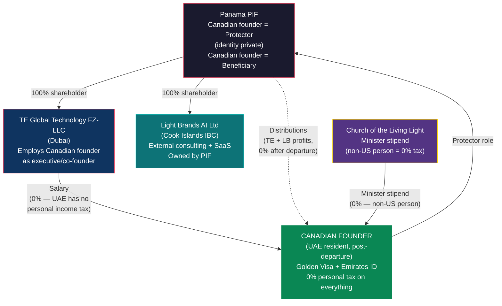

# Canadian Founder Playbook

> **Status:** Personal tax strategy — requires Canadian emigration tax counsel + Panama counsel
> **Last Updated:** February 2026

---

## 1. TL;DR

**0% personal tax after departing Canada.** The Canadian founder departs Canada, establishes UAE residency (Golden Visa), and receives all income — salary, PIF distributions, capital gains — at 0% personal tax for life (or until returning to a taxing jurisdiction). Canada taxes residents on worldwide income, but non-residents only on Canadian-source income. Once departed, there is no Canadian tax on UAE salary or Panama PIF distributions.

**This must happen before the seed round closes.** Departure tax is based on fair market value of assets at the departure date. Pre-revenue, pre-raise = minimal FMV = minimal departure tax. After the seed round establishes a $29.35M post-money valuation, the departure tax bill becomes significant.

---

## 2. Structure (Canadian Founder Connections Only)

---

## 3. Why This Works

Canada uses a **residency-based** taxation system. Tax residents pay on worldwide income. Non-residents pay only on Canadian-source income (employment in Canada, Canadian business income, disposition of Canadian real property).

Once the Canadian founder:

1. Severs residential ties with Canada
2. Establishes genuine residency elsewhere (UAE)
3. Files a departure return

...they are no longer a Canadian tax resident. All future income from UAE salary, PIF distributions, and capital gains on foreign assets is taxed at **0%** because:

- UAE has no personal income tax
- Panama has no tax on PIF distributions to non-residents
- Canada has no claim on non-residents earning non-Canadian income
- No CFC rules apply because there is no Canadian residency to trigger them

---

## 4. Departure Process

### Primary Ties (Must Sever)

These are the factors CRA weighs most heavily:

- [ ] **Sell or vacate Canadian home** — Do not retain a dwelling available for your use. Renting it out can be problematic; selling is cleanest.
- [ ] **Move spouse/dependents out of Canada** — If a spouse or common-law partner remains in Canada, CRA will likely deem you still resident.

### Secondary Ties (Sever as Many as Possible)

- [ ] Cancel provincial health insurance (OHIP, MSP, etc.)
- [ ] Close Canadian bank accounts (or reduce to one minimal account)
- [ ] Surrender Canadian driver's license
- [ ] Cancel club memberships, professional associations
- [ ] Redirect mail, close PO boxes
- [ ] Cancel Canadian phone number (or port to VoIP)
- [ ] Update address with all Canadian institutions

### What You Keep

- Canadian citizenship and passport (no impact on tax status)
- RRSPs and TFSAs (continue to hold — no new contributions)
- Some investments (may remain, but monitor Canadian-source income)

---

## 5. Departure Tax

When a Canadian resident departs, the CRA treats all assets as **deemed disposed** at fair market value on the departure date. Capital gains tax applies immediately.

### How It Works

| Element | Detail |
|---|---|
| **What's deemed disposed** | All assets worldwide (shares, investments, options, crypto) |
| **Tax rate** | 50% inclusion on first $250K of gains, 66.67% above that, at marginal rates |
| **What's exempt** | Canadian real property, RRSPs, TFSAs, RRIFs |
| **Payment** | Can be deferred (with security posted) until actual disposition |

### Why Timing Is Critical

| Departure Timing | Estimated FMV of Founder's Equity | Departure Tax |
|---|---|---|
| **NOW (pre-revenue, pre-raise)** | Near cost basis (~$0) | **Minimal to zero** |
| After seed round ($29.35M post-money) | Pro-rata share of valuation | **Significant** |
| After Year 1 ($10.7M revenue) | Higher | **Substantial** |
| After Year 5 (~$147M enterprise value) | Pro-rata of $147M | **Enormous** |

**Every month of value creation increases the departure tax.** The window is NOW — before the seed round closes and establishes a formal valuation.

---

## 6. Filing Requirements

| Filing | When | What |
|---|---|---|
| **Departure tax return** | By April 30 of the year following departure (June 15 if self-employed; balance due April 30) | Report deemed disposition of all assets at FMV |
| **NR73 (Determination of Residency Status)** | Optional but recommended — file proactively | CRA confirms non-resident status in writing. Processing: 4-6 weeks. Provides defensible evidence. |
| **Final Canadian return** | Year of departure | Report all Canadian-source income up to departure date |
| **Post-departure** | Only if Canadian-source income exists | NR4 slips for Canadian pension/RRSP withdrawals. Section 116 clearance for Canadian real property dispositions. |

---

## 7. Establishing UAE Residency

| Step | Detail | Timeline |
|---|---|---|
| **Golden Visa** | Entrepreneur pathway: AED 500K+ project approved by UAE business incubator, OR Investor pathway: AED 2M+ investment | Application: 5-30 days |
| **Emirates ID** | Issued during visa process (biometric enrollment at ICP service center) | With visa |
| **Tax Residency Certificate** | Apply via EmaraTax portal. Golden Visa holders need only 90 days physical presence (not 183). Cost: AED 100. | 3-7 working days |

**Costs:**

| Component | USD |
|---|---|
| Golden Visa application + medical + Emirates ID | ~$1,000-1,300 |
| Family sponsorship (per member) | ~$800-1,500 |

**Result:** 0% personal income tax on all income worldwide. UAE has no personal income tax.

---

## 8. Income Channels Post-Departure

| Channel | Source | Amount (Y1 / Y3 / Y5) | Tax |
|---|---|---|---|
| **UAE salary** | TE Global Technology FZ-LLC | $200K / $300K / $400K | **$0** — UAE has no personal income tax |
| **Church stipend** | Church of the Living Light | $30K / $40K / $50K | **$0** — non-US person, non-resident of any taxing jurisdiction |
| **PIF distributions (TE profits)** | Panama PIF (from UAE entity) | Variable / $150K / $700K+ | **$0** — Panama 0% WHT on distributions to non-residents; UAE 0% on receipt |
| **PIF distributions (LB profits)** | Panama PIF (from CI IBC) | Variable / $50K / $300K+ | **$0** — CI 0% WHT; Panama 0%; UAE 0% on receipt |
| **Capital gains** | Any source | Variable | **$0** — no jurisdiction is taxing |
| **Total tax** | | | **$0** |

**Light Brands effect:** The CI IBC generates additional profit that flows to the PIF at 0% and can be distributed to the Canadian founder at 0% (post-departure from Canada, residing in UAE). LB revenue is purely additive to the founder's income with zero tax increment.

---

## 9. Year 1-5 Projection

| Year | UAE Salary | Church Stipend | PIF Distributions (TE) | PIF Distributions (LB) | Total Income | Tax Paid | Rate |
|---|---|---|---|---|---|---|---|
| 1 | $200,000 | $30,000 | — | — | $230,000 | $0 | **0%** |
| 2 | $250,000 | $35,000 | $75,000 | $25,000 | $385,000 | $0 | **0%** |
| 3 | $300,000 | $40,000 | $200,000 | $100,000 | $640,000 | $0 | **0%** |
| 4 | $350,000 | $45,000 | $350,000 | $150,000 | $895,000 | $0 | **0%** |
| 5 | $400,000 | $50,000 | $700,000 | $300,000 | $1,450,000 | $0 | **0%** |

PIF distributions scale as both the UAE entity and CI IBC generate retained earnings. Since both entities pay 0% corporate tax, nearly all EBITDA is available for retention or distribution. Light Brands distributions grow as LB's external consulting and SaaS revenue matures.

---

## 10. PIF Protector Role

The Canadian founder serves as **Protector** of the Panama PIF. This is a governance oversight role — not an ownership position.

| Aspect | Detail |
|---|---|
| **What it is** | A supervisory role with veto power over Foundation Council decisions |
| **What it is NOT** | Ownership. The PIF has no owner. The Protector does not own PIF assets. |
| **Identity** | Private — the Protector's name does not appear in any public registry |
| **Powers** | Veto Council decisions, remove and appoint Council members, approve distributions |
| **Oversight scope** | Both the UAE entity and the CI IBC (both owned 100% by the PIF) |
| **Tax implication** | Being Protector does not trigger CFC or tax on PIF income in any jurisdiction (especially after departing Canada) |
| **Why Canadian founder** | The US founder cannot be Protector (creates CFC risk). The Canadian founder, as a UAE resident with no home-country tax, is the ideal Protector. |

---

## 11. Ongoing Compliance Calendar

| When | What |
|---|---|
| **Annually** | Renew UAE Tax Residency Certificate (if needed for treaty purposes) |
| **Annually** | PIF maintenance ($250 Panama franchise tax + agent fees) |
| **Annually** | Review PIF beneficiary designations and Foundation Council composition |
| **Annually** | Confirm no inadvertent Canadian ties created (property, health insurance, extended stays) |
| **If Canadian-source income** | File NR4/NR6 for Canadian pension, RRSP withdrawals, or rental income |
| **Ongoing** | Maintain records proving UAE residence (lease, utilities, bank statements, travel logs) |
| **Ongoing** | Keep time in Canada under 183 days per year (ideally much less) |

---

## 12. Risks and Mitigations

| Risk | Probability | Impact | Mitigation |
|---|---|---|---|
| **CRA challenges non-resident status** | Low | High — full Canadian tax on worldwide income | Sever ALL ties comprehensively. File NR73 for written confirmation. Maintain 90+ days in UAE for TRC. Do not retain Canadian dwelling. |
| **Accidental Canadian ties** | Low-Medium | High | Do not rent or own a home in Canada. Do not keep provincial health insurance. Minimize days in Canada. Annual review with counsel. |
| **PIF look-through** | Low | High — CRA attributes PIF income to founder | PIF has no owner under Panamanian law. After departing Canada, CFC rules no longer apply (not a Canadian resident). Foundation Council is independent. |
| **Departure tax higher than expected** | Medium | Medium | Depart BEFORE the seed round closes. Get a formal valuation at departure date. Cost basis at pre-revenue stage should be near zero. |
| **Canada changes departure tax rules** | Low | Variable | Lock in current rules by departing now. Future changes typically don't apply retroactively to completed departures. |
| **UAE residency challenge** | Very Low | Medium | Maintain Golden Visa, Emirates ID, UAE bank account, and physical presence (90+ days for TRC). |

---

## 13. Action Items

| # | Action | Timeline | Priority |
|---|---|---|---|
| 1 | **Engage Canadian emigration tax counsel** — departure tax calculation, NR73 strategy, PIF look-through analysis | **IMMEDIATELY** | **Critical** |
| 2 | **Calculate departure tax** based on current asset values | Week 1-2 | **Critical** |
| 3 | **Begin severing Canadian ties** — sell/vacate home, cancel health insurance, close accounts | Weeks 1-4 | **Critical** |
| 4 | **Obtain UAE Golden Visa** (entrepreneur pathway) | Weeks 2-4 | **Critical** |
| 5 | **File NR73** (Determination of Residency Status) with CRA | Weeks 3-6 | High |
| 6 | **Complete departure BEFORE seed round closes** | Before seed close | **CRITICAL** |
| 7 | **File departure tax return** | By April 30 of following year | High |
| 8 | Establish UAE bank account, Emirates ID, lease | Weeks 3-6 | High |
| 9 | Execute employment contract with UAE entity | With entity formation | High |
| 10 | Confirm PIF Protector appointment (with Panama counsel) | Weeks 4-8 | High |

**The urgency cannot be overstated.** Steps 1-6 should be completed before the seed round closes. Every day of delay increases the departure tax liability.

---

*This document describes legal tax optimization for a Canadian citizen departing Canada to establish UAE residency within the TE Global structure. All mechanisms cited (Canadian departure tax, NR73 filing, CRA residency tests, Panama PIF law, UAE 0% personal tax) are provisions of Canadian, Panamanian, and UAE law. Implementation requires validation by qualified Canadian emigration tax counsel and Panama foundation counsel.*
