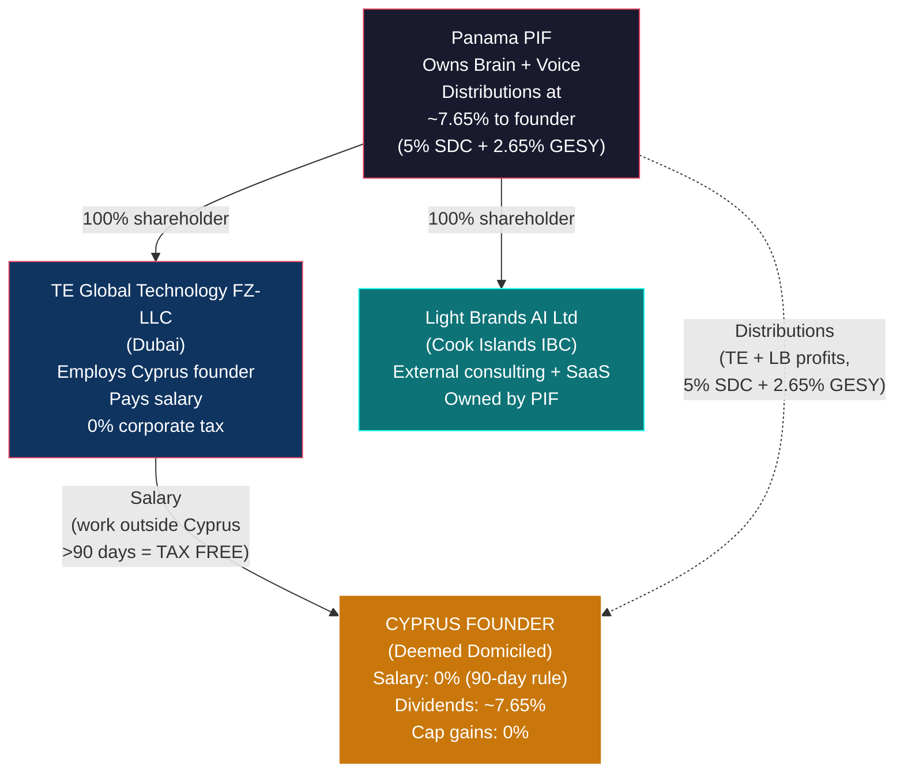

# Cyprus Founder Playbook

> **Status:** Personal tax strategy — requires Cyprus tax counsel validation
> **Tax Reform Status:** 2026 reform enacted January 1, 2026. All figures reflect enacted law.
> **Last Updated:** February 2026

---

## 1. TL;DR

**0.85-2.5% effective rate** via salary-first plus affordable dividends. A lifelong Cyprus resident (25+ years) is deemed domiciled — the favorable non-dom regime (0% SDC on dividends) does NOT apply. However, the 2026 reform dropped SDC on dividends from 17% to **5%**, making dividends affordable rather than punitive.

The **overseas employment exemption** — salary from a non-resident employer for work done outside Cyprus for more than 90 days — is **fully exempt from Cyprus income tax** regardless of domicile status. This is the primary tool.

---

## 2. Structure (Cyprus Founder Connections Only)

---

## 3. Why Deemed Domiciled

The non-dom regime requires meeting ALL three tests. A 25+ year resident fails all of them:

| Test | Requirement | Status |
|---|---|---|
| Not resident for 17 of last 20 years? | Must have been non-resident for 4+ of last 20 years | **Fails** — resident for 20+ of 20 |
| Domicile of origin not Cyprus? | Must have been born/raised elsewhere | **Fails** — born in Cyprus |
| Acquired domicile of choice elsewhere? | Must have permanently relocated | **Fails** — never relocated |
| **Non-dom eligible?** | | **No** |

**Consequence:** SDC applies on dividends — now **5%** (was 17% pre-2026).

---

## 4. Four Paths Comparison

| | Path A: Salary-First | Path B: Dubai Reset | Path C: Full Dubai | Path D: Stay Put |
|---|---|---|---|---|
| **Where they live** | Cyprus (~230 days) + Dubai (~90 days) + travel | Dubai 4 years → Cyprus | Dubai (permanent) | Cyprus (full-time) |
| **Travel required** | 90+ days outside Cyprus/yr | 4 years abroad | Permanent relocation | None |
| **Salary tax** | **0%** (90-day rule) | **0%** (Dubai) → **0%** (90-day on return) | **0%** (Dubai) | **Up to 35%** (progressive) |
| **Dividend tax** | **~7.65%** (5% SDC + 2.65% GESY) | **0%** (Dubai) → **~2.65%** (non-dom) | **0%** | **~7.65%** |
| **Capital gains** | **0%** | **0%** | **0%** | **0%** |
| **Y5 effective rate** | **~0.85%** (salary-heavy) to **~2.5%** (balanced) | **0% → ~0.4%** | **0%** | **~18.1%** |
| **Lifestyle change** | Moderate — 3 months abroad | Major — 4 years in Dubai | Major — permanent | None |
| **Recommended?** | **Yes (best balance)** | If taking large dividends | Only if desired | Last resort |

---

## 5. Year 5 Tax Projections

### Salary-Heavy Split (Recommended)

| Income | Amount | Tax Treatment | Tax |
|---|---|---|---|
| UAE salary (work outside Cyprus >90 days) | $800,000 | 100% exempt — overseas employment exemption | **$0** |
| PIF distributions (kept modest) | $100,000 | 5% SDC ($5,000) + 2.65% GESY ($2,650) | **$7,650** |
| Capital gains | Variable | 0% on securities | **$0** |
| **Total on $900,000** | | | **$7,650 (0.85%)** |

### Balanced Split

| Income | Amount | Tax Treatment | Tax |
|---|---|---|---|
| UAE salary (work outside Cyprus >90 days) | $500,000 | 100% exempt | **$0** |
| PIF distributions | $400,000 | 5% SDC ($20,000) + 2.65% GESY ($2,650 — capped) | **$22,650** |
| **Total on $900,000** | | | **$22,650 (2.5%)** |

**Either split produces an excellent result.** The salary-heavy split saves ~$15K/year but requires maximizing the salary channel.

---

## 6. 2026 Reform Rates Reference

### SDC (Special Defence Contribution) — Domiciled Residents

| Income Type | 2026 Rate | Previous Rate | Change |
|---|---|---|---|
| Dividends (post-2026 profits) | **5%** | 17% | **Reduced** |
| Dividends (pre-2026 profits, until Dec 31 2031) | **17%** | 17% | Unchanged |
| Rental income | **0% — abolished** | 3% on 75% gross | **Abolished** |
| Concealed dividends (new anti-avoidance) | **10%** | N/A | **New** |
| Interest | **Confirm with counsel** | 17% | May have changed |

### Other Key Rates

| Item | Rate |
|---|---|
| GESY (healthcare) on dividends | 2.65% (capped at EUR 180,000 income = EUR 4,770 max) |
| Cyprus corporate tax | **15%** (was 12.5% — OECD Pillar Two alignment) |
| Crypto-asset gains (Article 20E) | **8% flat** (ring-fenced, no carry-forward of losses) |
| Capital gains on securities | **0%** |
| Income tax on dividends | **0%** (dividends only subject to SDC + GESY, never income tax) |

### Cyprus-UAE Treaty WHT

| Payment | WHT Rate |
|---|---|
| Dividends (both directions) | **0%** |
| Interest | **0%** |
| Royalties | **0%** |

WHT is the border tax (0% treaty rate). SDC is the domestic tax on the resident's income after receipt. Both apply: 0% at the border + 5% SDC + 2.65% GESY on arrival.

---

## 7. Crypto: Doesn't Help

The 2026 reform introduced an 8% flat tax on crypto gains (Article 20E). The math:

| Channel | Effective Rate |
|---|---|
| Salary (90-day rule) | **0%** |
| Dividends (post-2026) | **~7.65%** |
| Crypto gains | **8%+** (possibly + GESY) |
| Concealed dividends (if crypto scheme used to extract value) | **10%+** |

Crypto is slightly MORE expensive than dividends. Creating tokens to replace dividend distributions adds cost, regulatory burden (MiCA), and risk of being classified as concealed dividends at 10% SDC. Build tokens for business value, not tax avoidance.

---

## 8. Implementation Checklist (Path A)

| Step | Detail | Timeline |
|---|---|---|
| 1. Employment contract with UAE entity | Formal employment as executive/co-founder of TE Global Technology FZ-LLC | 1 week |
| 2. Plan annual travel schedule | 90+ days outside Cyprus: Dubai office time + Tulum visits + business travel | Ongoing |
| 3. Set up travel documentation | Boarding passes, hotel receipts, work calendars, timesheets. Keep a work diary. | From day 1 |
| 4. Set salary level | Strong salary ($500K-$800K) from UAE entity. Get counsel sign-off on reasonableness. | With counsel |
| 5. PIF beneficiary status (optional) | Can be added as PIF beneficiary. Distributions now affordable at 5% SDC. | 2-3 weeks |
| 6. Annual Cyprus tax filing | Declare salary (exempt under 90-day rule) and any dividends (SDC + GESY) | Annually |
| 7. Confirm 90-day exemption details with counsel | Does GESY apply to exempt salary? Interest SDC rate? PIF distribution classification? | Month 1 |

---

## 9. Risks and Mitigations

| Risk | Probability | Impact | Mitigation |
|---|---|---|---|
| **90-day exemption challenged** | Low-Medium | High — salary taxable at up to 35% | Meticulous travel records. Boarding passes, hotel receipts, work calendars. Employment contract clearly with UAE entity. |
| **Salary deemed unreasonable** | Low | Medium — portion recharacterized as dividend (now 5% SDC, less painful than before) | Set salary with reference to comparable executive compensation. Document role and time commitment. |
| **Concealed dividend classification** | Low-Medium | Medium — 10% SDC instead of 5% | Use standard channels (salary + formal dividends). No creative schemes. |
| **Non-dom reset challenged (Path B)** | Medium | Medium — 5% SDC applies (less painful than old 17%) | Establish genuine domicile of choice in Dubai. Buy/rent home. Sever some Cyprus ties. |
| **Further Cyprus tax reform** | Low | Variable | The 2026 reform was favorable. Cyprus has strong incentive to maintain competitive rates. |
| **UAE QFZP loss** | Medium | Medium — 9% UAE CT | Doesn't affect personal tax strategy directly. |

---

## 10. Action Items

| # | Action | Timeline | Priority |
|---|---|---|---|
| 1 | Engage Cyprus tax counsel — confirm 90-day exemption for co-founder salary | Week 1-2 | **Critical** |
| 2 | Execute employment contract with TE Global Technology FZ-LLC | With entity formation | High |
| 3 | Plan Year 1 travel schedule (90+ days outside Cyprus) | Month 1 | High |
| 4 | Set up travel documentation system | Day 1 | High |
| 5 | Confirm PIF distribution classification (dividends vs. other income) | With counsel | High |
| 6 | Confirm GESY on exempt salary and interest SDC rate | With counsel | Medium |
| 7 | Annual travel log review — ensure >90 days maintained | End of each year | Ongoing |

---

*This document describes legal tax optimization for a Cyprus-domiciled resident within the TE Global structure. All mechanisms cited (overseas employment exemption, SDC rates, GESY contributions, Article 20E, concealed dividends) are provisions of Cyprus tax law as enacted in the December 2025 reform, effective January 1, 2026. Implementation requires validation by qualified Cyprus tax counsel.*
