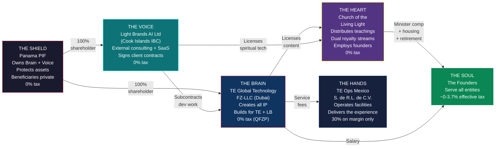
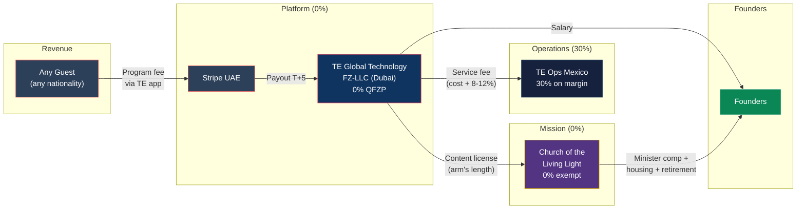
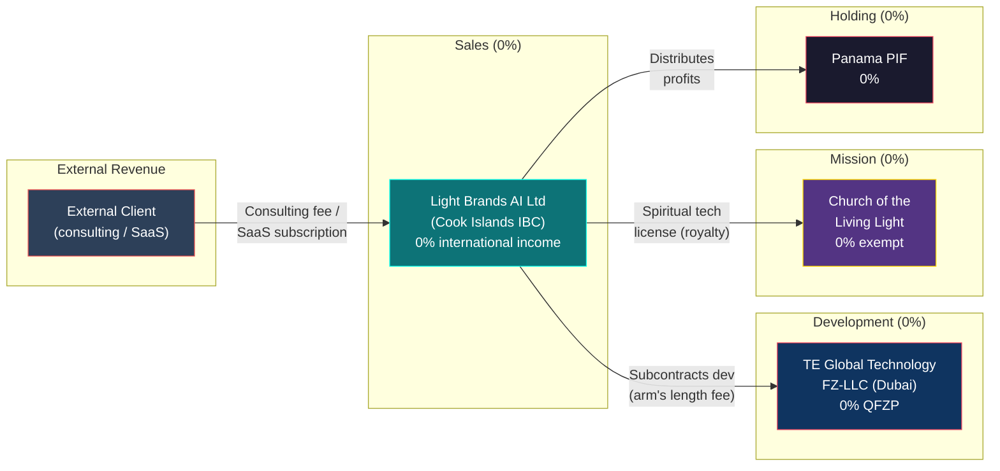
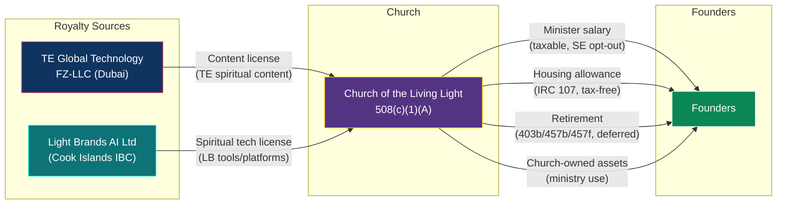
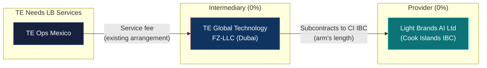

# Ecosystem Architecture: The Unified TE + Light Brands Structure

> **Status:** Definitive architecture — requires counsel validation before implementation
> **Last Updated:** February 2026

---

## 1. Summary

Five entities across four jurisdictions, owned by a single Panama Private Interest Foundation. **TE Global Technology FZ-LLC** (Dubai) creates all IP, operates the healing center platform, and serves as the development shop for both TE and Light Brands. **Light Brands AI Ltd** (Cook Islands IBC) is the client-facing consulting and SaaS entity — it signs external contracts, collects revenue, and owns LB-specific IP. **Church of the Living Light** distributes the spiritual mission, employs all founders as ministers, and receives royalty streams from both entities. **TE Ops Mexico** delivers the guest experience on the ground. The combined entity-level effective tax rate is ~1.2%.

---

## 2. Five-Entity Architecture

**The Brain** creates all IP and builds everything — for TE healing center AND for Light Brands clients. **The Voice** faces the external market, signs consulting and SaaS contracts, collects Light Brands revenue, and subcontracts all development to the Brain. **The Shield** owns both the Brain and the Voice, protects assets, and keeps beneficiary identities private. **The Heart** receives royalties from both entities (content from the Brain, spiritual tech from the Voice) and channels all mission-aligned value to founders. **The Hands** deliver the healing center guest experience. **The Soul** — the founders — serve across all entities.

---

## 3. Entity Table

| Entity | Jurisdiction | Legal Form | Role | Tax Rate | Ownership | Annual Cost |
|---|---|---|---|---|---|---|
| **TE Global Technology FZ-LLC** | Dubai Internet City, UAE | Free Zone LLC | Creates all IP (TE + LB), collects TE revenue, employs Dubai team + founders, builds what LB sells | 0% (QFZP) | 100% owned by Panama PIF | ~$50-80K (office + compliance) |
| **Light Brands AI Ltd** | Cook Islands | International Business Company | External consulting, SaaS, product sales. Signs client contracts. Owns LB-specific IP. | 0% (international income) | 100% owned by Panama PIF | ~$3-5K (registered agent + annual fee) |
| **Panama PIF** | Panama | Private Interest Foundation (Law 25/1995) | Owns both operating entities. Asset protection. Beneficiary privacy. | 0% (foreign income) | No owner — independent legal person | ~$1-2K (tax + agent) |
| **Church of the Living Light** | US (state TBD) | 508(c)(1)(A) nonprofit religious corporation | Distributes teachings, employs founders as ministers, receives dual royalty streams, runs worship and charitable programs | 0% (tax-exempt) | No owner — nonprofit governance by Spiritual Council | ~$5-15K (operations) |
| **TE Ops Mexico S. de R.L. de C.V.** | Tulum, Quintana Roo | S. de R.L. de C.V. | Operates healing facility, employs local staff, delivers guest experience | 30% on margin only | Owned by UAE entity (via PIF) | ~$10-20K (compliance) |

---

## 4. Money Flows

### Flow 1: TE Healing Center Revenue (existing)

**Tax at each step:** Guest payment → 0% (Stripe UAE). UAE entity retains → 0% (QFZP). Service fee to Mexico → 30% on 8-12% margin only. Content license to Church → 0% (UBIT-exempt royalty on receiving end). Salary to founders → personal rates (see founder guides).

### Flow 2: Light Brands External Client Revenue (NEW)

**Tax at each step:** Client payment → 0% (CI IBC, international income). Subcontract to UAE → 0% (QFZP on receipt). Spiritual tech license to Church → 0% (UBIT-exempt royalty). Distribution to PIF → 0% (no CI WHT, no Panama tax). PIF to beneficiaries → personal rates (0% Canadian, ~3.7% US via church, ~7.65% Cyprus).

### Flow 3: Church Royalty Channels (expanded)

**Both royalty streams are UBIT-exempt** under IRC 512(b)(2). Content license from UAE = royalty for use of copyrighted spiritual teachings. Spiritual tech license from CI IBC = royalty for use of consciousness tools and platforms. The church performs no development — it licenses and distributes.

### Flow 4: Light Brands → TE Ecosystem (REFIPRE routing)

**Why this routing exists:** Mexico's REFIPRE rules impose 40% WHT on payments to preferential tax regimes. If Mexico OpCo paid CI IBC directly → 40% WHT + non-deductible. By routing through the UAE entity (which already has a service fee arrangement with Mexico): Mexico pays UAE (existing, not REFIPRE-triggering because direction is inbound to UAE). UAE subcontracts to CI IBC (0% on both sides). Net additional tax: $0.

---

## 5. IP Ownership Map

| IP Asset | Owner | Why It Lives There | Licensed To |
|---|---|---|---|
| TE healing center platform (app, AI agents, algorithms) | UAE FZ-LLC | Created by Dubai team (DEMPE substance) | Church (content distribution) |
| TE spiritual content (courses, books, protocols) | UAE FZ-LLC | Created by Dubai team | Church (teaching distribution) |
| Light Brands consulting frameworks | CI IBC | Owned by the contracting entity that sells them | Church (spiritual tech license) |
| Light Brands SaaS products | CI IBC | Owned by the contracting entity; built by UAE under work-for-hire | — |
| Light Brands spiritual tech tools | CI IBC | Owned by CI IBC; developed under subcontract | Church (spiritual tech license) |
| Church teaching materials | Church | Derivative works from licensed content | Public (mission distribution) |

**IP ownership follows creation:** TE platform IP stays in UAE because the Dubai team creates it (DEMPE: Development, Enhancement, Maintenance, Protection, Exploitation all happen in Dubai). LB IP stays in CI IBC because it is the commissioning entity — the UAE team builds under work-for-hire/subcontract arrangements where IP ownership transfers to CI IBC upon delivery.

---

## 6. Intercompany Agreement Matrix

| Agreement | Party A | Party B | Type | Pricing | Frequency |
|---|---|---|---|---|---|
| **Service Delivery Agreement** | UAE FZ-LLC | TE Ops Mexico | Services (facility operations) | Cost + 8-12% margin | Ongoing |
| **Content License Agreement** | UAE FZ-LLC | Church | License (royalty) | Arm's length, market rate | Annual renewal |
| **Development Subcontract** | CI IBC | UAE FZ-LLC | Services (software dev, consulting delivery) | Arm's length fee (TP study) | Per project / retainer |
| **Spiritual Tech License** | CI IBC | Church | License (royalty) | Arm's length, market rate | Annual renewal |
| **IP Assignment (work-for-hire)** | UAE FZ-LLC | CI IBC | IP transfer | Per deliverable (cost + margin) | Per project |
| **Employment Agreements** | UAE FZ-LLC | Founders | Employment | Market salary + benefits | Ongoing |
| **Minister Employment** | Church | Founders | Employment | Board-approved comp + housing + retirement | Annual designation |

**Transfer pricing requirement:** The Development Subcontract (CI IBC ↔ UAE) and Service Delivery Agreement (UAE ↔ Mexico) must both be supported by annual transfer pricing benchmarking studies.

---

## 7. Tax Summary: Combined Ecosystem

### Entity-Level (Year 5)

| Entity | Revenue / Activity | Tax Rate | Tax Paid |
|---|---|---|---|
| TE Global Technology FZ-LLC | $35.5M (TE programs) + LB subcontract fees | 0% (QFZP) | $0 |
| Light Brands AI Ltd | LB consulting + SaaS revenue | 0% (CI international income) | $0 |
| Church of the Living Light | Royalties + donations | 0% (exempt) | $0 |
| TE Ops Mexico | Cost + 8-12% margin | 30% on margin | ~$420K |
| Panama PIF | Holding (no operating income) | 0% | $0 |
| **Total entity-level tax** | | | **~$420K** |

### Personal-Level (Year 5)

| Founder | Total Income | Tax Paid | Effective Rate |
|---|---|---|---|
| **Canadian** (Dubai resident, PIF beneficiary) | ~$1,400,000+ | $0 | **0%** |
| **US** (Dubai resident, church minister, not PIF owner) | ~$2,294,000 | $85,400 | **~3.7%** |
| **Cyprus** (deemed domiciled, salary-first) | ~$900,000 | $7,650 | **~0.85%** |

### Combined (Year 5, TE revenue only)

| Metric | Value |
|---|---|
| TE group revenue | $35,461,000 |
| Entity-level tax | ~$420,000 |
| Combined personal tax | ~$93,050 |
| **Combined effective rate** | **~1.4%** |

*Light Brands revenue is additive. As LB revenue scales, the combined effective rate stays ~1.2-1.4% because all LB income flows through 0% entities.*

---

## 8. Rules That Cannot Be Broken

### Existing Rules (unchanged)

| Rule | Why |
|---|---|
| The church does not collect program fees | Program revenue goes to the UAE entity. The church is a spiritual mission, not a commercial platform. |
| The UAE entity does not control the church | The church has its own independent Spiritual Council. No entity governance overlap. |
| The PIF does not own the church | Nonprofits have no owners. The PIF can donate but has zero governance authority. |
| All founder compensation is board-approved | Every dollar paid to founders is approved by disinterested Spiritual Council members using comparable data. |
| Content IP belongs to the UAE entity | The church licenses content — it never creates or owns IP. |
| No circular flows | UAE entity does not donate to the church so the church can pay the founders. Donations must fund the mission. |
| No commingling | Every entity has its own bank account. No shared accounts, no cross-entity spending. |
| Ministry use of assets is documented | Church-owned home, vehicle, travel — all documented with ministry purpose. Personal use reported as taxable income. |
| The US founder is NOT a PIF beneficiary or owner | Eliminates CFC, GILTI, Subpart F, Form 5471 entirely. Non-negotiable. |
| Transfer pricing is arm's length | Mexico service fee and church content license both supported by TP documentation. |

### New Rules (Light Brands / Cook Islands)

| Rule | Why |
|---|---|
| **The CI IBC has ZERO employees** | Employees create permanent establishment in whatever country they sit. The CI IBC's 0% rate depends on having no physical presence anywhere. |
| **Mexico OpCo NEVER pays CI IBC directly** | REFIPRE triggers 40% WHT on payments to preferential tax regimes. All TE ecosystem services route through the UAE entity. |
| **CI IBC subcontracts ALL development to UAE** | The CI IBC sells; the UAE entity builds. This preserves UAE substance (DEMPE) and CI IBC's thin profile. |
| **LB-specific IP ownership stays in CI IBC** | CI IBC commissions the work. UAE builds under work-for-hire. IP transfers to CI IBC upon delivery. |
| **Spiritual tech license to Church is arm's length** | Must be priced at market rate. TP documentation required. UBIT exclusion depends on genuine royalty classification. |
| **One PIF owns everything** | Both UAE entity and CI IBC under the same Panama PIF. Simplifies governance. No cross-ownership complications. |

---

## 9. REFIPRE Routing: Detailed Explanation

Mexico's REFIPRE (Regimen Fiscal Preferente) provisions under Article 176-178 of the Mexican Income Tax Law (LISR) impose:

- **40% WHT** on payments from Mexican entities to related parties in jurisdictions with effective tax rates below 22.5%
- **Non-deductibility** of those payments for the Mexican entity

The Cook Islands (0% on international income) is clearly a preferential regime. Any direct payment from TE Ops Mexico to Light Brands AI Ltd would trigger both penalties.

**The routing solution:**

1. TE Ops Mexico already pays a service fee to the UAE entity under the existing Service Delivery Agreement
2. If TE needs Light Brands technology or services, the UAE entity subcontracts to CI IBC
3. Mexico never transacts directly with CI IBC
4. The UAE entity (0% QFZP) is the intermediary — and the existing Mexico→UAE payment is structured as an inbound service fee that doesn't trigger REFIPRE (revenue flows into Mexico as services, not out as royalties)

**Net cost of routing:** $0 additional tax. Both UAE and CI are at 0%.

---

## 10. Combined Compliance Calendar

| When | What | Entity | Responsible |
|---|---|---|---|
| **Continuous** | TE guest revenue → UAE entity via Stripe | UAE FZ-LLC | Finance team |
| **Continuous** | LB client revenue → CI IBC | CI IBC | Finance team |
| **Continuous** | Dubai team creates IP → UAE entity owns it | UAE FZ-LLC | CTO |
| **Continuous** | Church licenses and distributes content | Church | Spiritual Council |
| **Monthly** | Intercompany invoicing (CI→UAE subcontract, UAE→Mexico service fee) | All | Finance team |
| **Quarterly** | Spiritual Council meets, reviews compensation | Church | Council Secretary |
| **Annually** | Housing allowance designated (before tax year) | Church | Spiritual Council |
| **Annually** | UAE entity audit + QFZP filing | UAE FZ-LLC | Auditors |
| **Annually** | CI IBC annual return + registered agent fee | CI IBC | CI registered agent |
| **Annually** | Transfer pricing study update (UAE↔Mexico, CI↔UAE, CI↔Church) | All | TP advisor |
| **Annually** | US founder tax return (1040 + 2555 + FBAR + 8938) | Personal | US tax preparer |
| **Annually** | Cyprus founder tax filing | Personal | Cyprus tax advisor |
| **Annually** | PIF maintenance ($250 tax + agent) | PIF | Panama agent |
| **Annually** | Mexico OpCo tax filing + TP documentation | Mexico OpCo | Mexican accountant |
| **Every 5 years** | PIF Foundation Council review | PIF | Protector |

---

## 11. Why This Architecture (Not Alternatives)

| Alternative | Why It Doesn't Work |
|---|---|
| **Drop UAE, put everything in CI IBC** | REFIPRE unsolved for Mexico (40% WHT). Dubai team creates UAE PE (9% not 0%). Loses Golden Visas. Loses QFZP. |
| **Drop CI IBC, put everything in UAE** | All revenue depends on QFZP. If QFZP fails → 9% on ALL revenue. No risk isolation. No Cook Islands asset protection. No separate LB brand. |
| **Employ everyone in CI IBC** | Creates PE in whatever country employees sit. Dubai employees → UAE PE (9% on PE profits, worse than QFZP). |
| **CI IBC with distributed contractors only** | Works for LB alone, but TE still needs UAE for REFIPRE routing. You end up with both entities anyway. |
| **Separate PIF for each entity** | Adds cost, complexity, governance overhead. No tax benefit — both PIFs would be 0% anyway. |
| **Put LB revenue in UAE directly** | No risk isolation. QFZP failure would hit both TE and LB. CI IBC provides a firewall. |

**The five-entity structure is the minimum viable architecture that solves all constraints simultaneously.**

---

## Cross-References

- **Master structure (4-entity view):** [01-MASTER-STRUCTURE.md](./01-MASTER-STRUCTURE.md)
- **Cook Islands IBC detail:** [08-COOK-ISLANDS-IBC-DETAIL.md](./08-COOK-ISLANDS-IBC-DETAIL.md)
- **Legal defense:** [02-LEGAL-DEFENSE.md](./02-LEGAL-DEFENSE.md)
- **US founder playbook:** [03-FOUNDER-GUIDE-US.md](./03-FOUNDER-GUIDE-US.md)
- **Canadian founder playbook:** [04-FOUNDER-GUIDE-CANADA.md](./04-FOUNDER-GUIDE-CANADA.md)
- **Cyprus founder playbook:** [05-FOUNDER-GUIDE-CYPRUS.md](./05-FOUNDER-GUIDE-CYPRUS.md)
- **Questions for counsel:** [06-COUNSEL-QUESTIONS.md](./06-COUNSEL-QUESTIONS.md)

---

*This document describes the unified ecosystem architecture combining UAE free zone benefits, Cook Islands IBC tax neutrality, US religious organization provisions, Panamanian asset protection, and Mexican corporate tax law. All mechanisms are explicit provisions of the relevant tax codes and international frameworks. Implementation requires validation by qualified counsel in each jurisdiction.*
