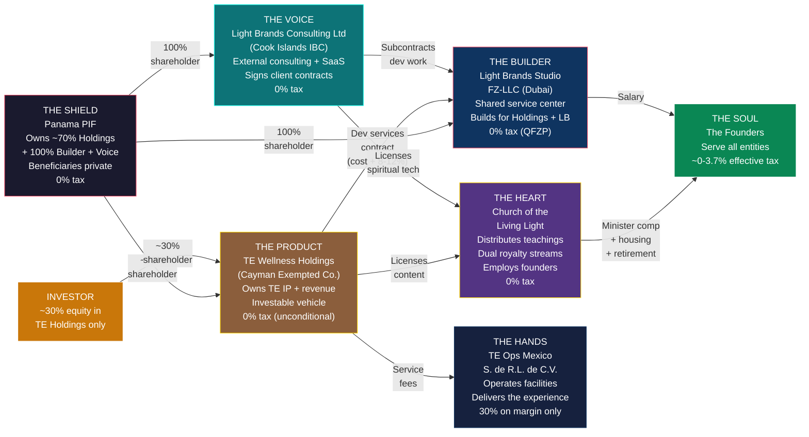
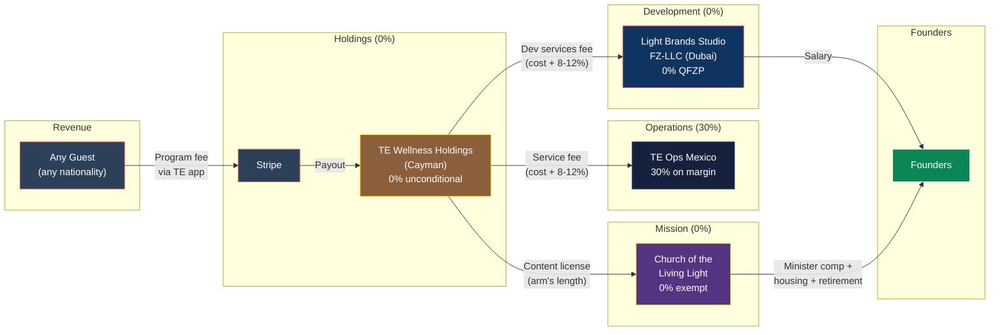
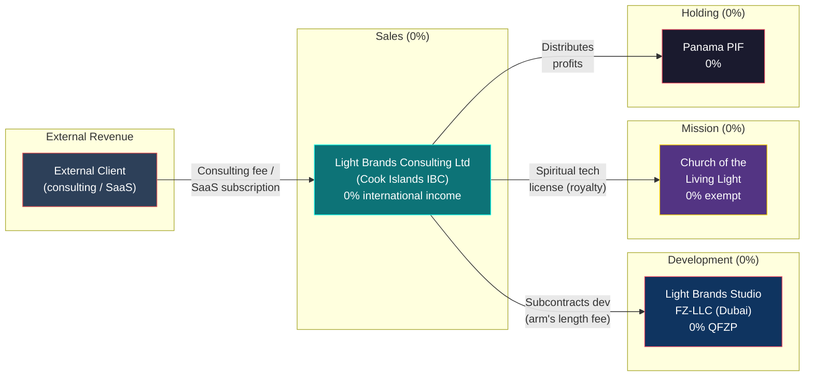
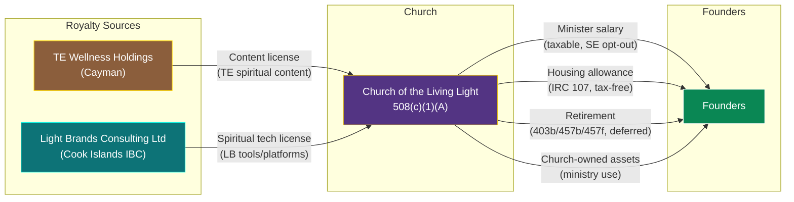
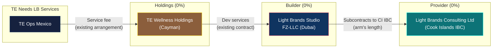

# Ecosystem Architecture: The Unified TE + Light Brands Structure

> **Status:** Definitive architecture — requires counsel validation before implementation
> **Last Updated:** February 2026

---

## 1. Summary

Six entities across five jurisdictions, owned by a single Panama Private Interest Foundation (with one entity accepting outside investment). **TE Wellness Holdings** (Cayman) is the investable vehicle — it owns all TE IP, collects all TE revenue, controls the Mexico OpCo, and licenses content to the Church. **Light Brands Studio FZ-LLC** (Dubai) is the shared service center — it builds for both TE Holdings and Light Brands under cost-plus contracts, employing the Dubai tech team. **Light Brands Consulting Ltd** (Cook Islands IBC) is the client-facing consulting and SaaS entity — it signs external contracts, collects LB revenue, and owns LB-specific IP. **Church of the Living Light** distributes the spiritual mission, employs all founders as ministers, and receives royalty streams from both TE Holdings and CI IBC. **TE Ops Mexico** delivers the guest experience on the ground. The combined entity-level effective tax rate is ~1.2%.

---

## 2. Six-Entity Architecture

**The Product** (TE Holdings) owns all TE IP, collects all TE revenue, and controls the Mexico OpCo — it is the single investable vehicle for the TE healing center business. **The Builder** (Studio) is a pure service company — it builds for both TE Holdings and Light Brands under cost-plus contracts, employing the Dubai tech team. **The Voice** (CI IBC) faces the external market, signs consulting and SaaS contracts, collects Light Brands revenue, and subcontracts all development to the Builder. **The Shield** (PIF) owns ~70% of the Product, 100% of the Builder, and 100% of the Voice, protecting assets and keeping beneficiary identities private. **The Heart** (Church) receives royalties from the Product (content) and the Voice (spiritual tech), distributes teachings, and channels all mission-aligned value to founders. **The Hands** (Mexico OpCo) deliver the healing center guest experience, owned by the Product. **The Soul** — the founders — serve across all entities. **The Investor** holds ~30% equity in the Product only.

---

## 3. Entity Table

| Entity | Jurisdiction | Legal Form | Role | Tax Rate | Ownership | Annual Cost |
|---|---|---|---|---|---|---|
| **TE Wellness Holdings** | Cayman Islands | Exempted Company | Owns all TE IP, collects all TE revenue ($10.7M→$35.5M), controls Mexico OpCo, licenses content to Church. Investable vehicle. | 0% (unconditional, 20-year exemption) | ~70% Panama PIF + ~30% investor | ~$16-27K (agent + audit + TP) |
| **Light Brands Studio FZ-LLC** | Dubai Internet City, UAE | Free Zone LLC | Shared service center — builds for both TE Holdings and LB. Employs Dubai team + founders. Pure B2B service company. | 0% (QFZP) | 100% owned by Panama PIF | ~$50-80K (office + compliance) |
| **Light Brands Consulting Ltd** | Cook Islands | International Business Company | External consulting, SaaS, product sales. Signs client contracts. Owns LB-specific IP. | 0% (international income) | 100% owned by Panama PIF | ~$3-5K (registered agent + annual fee) |
| **Panama PIF** | Panama | Private Interest Foundation (Law 25/1995) | Owns ~70% of Holdings + 100% of Studio + 100% of CI IBC. Asset protection. Beneficiary privacy. | 0% (foreign income) | No owner — independent legal person | ~$1-2K (tax + agent) |
| **Church of the Living Light** | US (state TBD) | 508(c)(1)(A) nonprofit religious corporation | Distributes teachings, employs founders as ministers, receives dual royalty streams (content from Holdings + spiritual tech from CI IBC), runs worship and charitable programs | 0% (tax-exempt) | No owner — nonprofit governance by Spiritual Council | ~$5-15K (operations) |
| **TE Ops Mexico S. de R.L. de C.V.** | Tulum, Quintana Roo | S. de R.L. de C.V. | Operates healing facility, employs local staff, delivers guest experience | 30% on margin only | Owned by TE Holdings (Cayman) | ~$10-20K (compliance) |

---

## 4. Money Flows

### Flow 1: TE Healing Center Revenue

**Tax at each step:** Guest payment → 0% (Stripe). TE Holdings retains → 0% (Cayman, unconditional). Dev services fee to Studio → 0% (QFZP on B2B service income). Service fee to Mexico → 30% on 8-12% margin only. Content license to Church → 0% (UBIT-exempt royalty on receiving end). Salary from Studio to founders → personal rates (see founder guides).

### Flow 2: Light Brands External Client Revenue (unchanged)

**Tax at each step:** Client payment → 0% (CI IBC, international income). Subcontract to Studio → 0% (QFZP on receipt). Spiritual tech license to Church → 0% (UBIT-exempt royalty). Distribution to PIF → 0% (no CI WHT, no Panama tax). PIF to beneficiaries → personal rates (0% Canadian, ~3.7% US via church, ~7.65% Cyprus).

### Flow 3: Church Royalty Channels (updated source)

**Both royalty streams are UBIT-exempt** under IRC 512(b)(2). Content license from TE Holdings = royalty for use of copyrighted spiritual teachings. Spiritual tech license from CI IBC = royalty for use of consciousness tools and platforms. The church performs no development — it licenses and distributes.

### Flow 4: Light Brands → TE Ecosystem (REFIPRE routing)

**Why this routing exists:** Mexico's REFIPRE rules impose 40% WHT on payments to preferential tax regimes. If Mexico OpCo paid CI IBC directly → 40% WHT + non-deductible. By routing through TE Holdings (which owns Mexico OpCo and has an existing service arrangement) and Studio (which has the development subcontract with CI IBC): Mexico pays Holdings (parent→subsidiary, not REFIPRE-triggering). Holdings pays Studio (existing dev services contract). Studio subcontracts to CI IBC (0% on both sides). Net additional tax: $0.

---

## 5. IP Ownership Map

| IP Asset | Owner | Why It Lives There | Licensed To |
|---|---|---|---|
| TE healing center platform (app, AI agents, algorithms) | TE Holdings (Cayman) | Created by Studio under contract; IP assigned to Holdings on delivery | Church (content distribution) |
| TE spiritual content (courses, books, protocols) | TE Holdings (Cayman) | Created by Studio under contract; IP assigned to Holdings on delivery | Church (teaching distribution) |
| TE brand and trademarks | TE Holdings (Cayman) | Owned by the investable vehicle that monetizes them | — |
| Light Brands consulting frameworks | CI IBC | Owned by the contracting entity that sells them | Church (spiritual tech license) |
| Light Brands SaaS products | CI IBC | Owned by the contracting entity; built by Studio under work-for-hire | — |
| Light Brands spiritual tech tools | CI IBC | Owned by CI IBC; developed under subcontract | Church (spiritual tech license) |
| Church teaching materials | Church | Derivative works from licensed content | Public (mission distribution) |

**IP ownership follows contractual assignment:** TE platform IP is created by Studio under the Development Services Agreement with Holdings — IP is assigned to Holdings upon delivery. LB IP is created by Studio under the Development Subcontract with CI IBC — IP is assigned to CI IBC upon delivery. Studio creates all IP but owns none of the product-specific IP. Studio retains only its internal development methodologies and tools.

---

## 6. Intercompany Agreement Matrix

| Agreement | Party A | Party B | Type | Pricing | Frequency |
|---|---|---|---|---|---|
| **Development Services Agreement** | TE Holdings (Cayman) | Light Brands Studio (Dubai) | Services (IP creation, platform dev, maintenance) | Cost + 8-12% margin | Ongoing |
| **Service Delivery Agreement** | TE Holdings (Cayman) | TE Ops Mexico | Services (facility operations) | Cost + 8-12% margin | Ongoing |
| **Content License Agreement** | TE Holdings (Cayman) | Church | License (royalty) | Arm's length, market rate | Annual renewal |
| **Development Subcontract** | CI IBC | Light Brands Studio (Dubai) | Services (software dev, consulting delivery) | Arm's length fee (TP study) | Per project / retainer |
| **Spiritual Tech License** | CI IBC | Church | License (royalty) | Arm's length, market rate | Annual renewal |
| **IP Assignment (work-for-hire)** | Light Brands Studio (Dubai) | CI IBC | IP transfer | Per deliverable (cost + margin) | Per project |
| **IP Assignment (TE work-for-hire)** | Light Brands Studio (Dubai) | TE Holdings (Cayman) | IP transfer | Included in Dev Services fee | Per deliverable |
| **Employment Agreements** | Light Brands Studio (Dubai) | Founders | Employment | Market salary + benefits | Ongoing |
| **Minister Employment** | Church | Founders | Employment | Board-approved comp + housing + retirement | Annual designation |

**Transfer pricing requirement:** The Development Services Agreement (Holdings ↔ Studio), Development Subcontract (CI IBC ↔ Studio), Service Delivery Agreement (Holdings ↔ Mexico), and all license agreements must be supported by annual transfer pricing benchmarking studies.

---

## 7. Tax Summary: Combined Ecosystem

### Entity-Level (Year 5)

| Entity | Revenue / Activity | Tax Rate | Tax Paid |
|---|---|---|---|
| TE Wellness Holdings (Cayman) | $35.5M (TE revenue) | 0% (unconditional) | $0 |
| Light Brands Studio FZ-LLC | Dev service fees from Holdings + LB subcontract fees | 0% (QFZP) | $0 |
| Light Brands Consulting Ltd | LB consulting + SaaS revenue | 0% (CI international income) | $0 |
| Church of the Living Light | Royalties + donations | 0% (exempt) | $0 |
| TE Ops Mexico | Cost + 8-12% margin | 30% on margin | ~$420K |
| Panama PIF | Holding (no operating income) | 0% | $0 |
| **Total entity-level tax** | | | **~$420K** |

### Personal-Level (Year 5)

| Founder | Total Income | Tax Paid | Effective Rate |
|---|---|---|---|
| **Canadian** (Dubai resident, PIF beneficiary) | ~$1,400,000+ | $0 | **0%** |
| **US** (Dubai resident, church minister, not PIF owner) | ~$2,294,000 | $85,400 | **~3.7%** |
| **Cyprus** (deemed domiciled, salary-first) | ~$900,000 | $7,650 | **~0.85%** |

### Combined (Year 5, TE revenue only)

| Metric | Value |
|---|---|
| TE group revenue | $35,461,000 |
| Entity-level tax | ~$420,000 |
| Combined personal tax | ~$93,050 |
| **Combined effective rate** | **~1.4%** |

*Light Brands revenue is additive. As LB revenue scales, the combined effective rate stays ~1.2-1.4% because all LB income flows through 0% entities.*

---

## 8. Rules That Cannot Be Broken

### Core Rules

| Rule | Why |
|---|---|
| The church does not collect program fees | Program revenue goes to TE Holdings. The church is a spiritual mission, not a commercial platform. |
| The UAE entity does not control the church | The church has its own independent Spiritual Council. No entity governance overlap. |
| The PIF does not own the church | Nonprofits have no owners. The PIF can donate but has zero governance authority. |
| All founder compensation is board-approved | Every dollar paid to founders is approved by disinterested Spiritual Council members using comparable data. |
| TE IP belongs to TE Holdings; LB IP belongs to CI IBC | The church licenses content — it never creates or owns IP. Studio creates IP under contract but owns none of the product-specific IP. |
| No circular flows | No entity donates to the church so the church can pay the founders. Donations must fund the mission. |
| No commingling | Every entity has its own bank account. No shared accounts, no cross-entity spending. |
| Ministry use of assets is documented | Church-owned home, vehicle, travel — all documented with ministry purpose. Personal use reported as taxable income. |
| The US founder is NOT a PIF beneficiary or owner | Eliminates CFC, GILTI, Subpart F, Form 5471 entirely. Non-negotiable. |
| Transfer pricing is arm's length | All intercompany agreements (Holdings↔Studio, Holdings↔Mexico, CI↔Studio, content license, spiritual tech license) supported by TP documentation. |

### Entity Separation Rules

| Rule | Why |
|---|---|
| **The CI IBC has ZERO employees** | Employees create permanent establishment in whatever country they sit. The CI IBC's 0% rate depends on having no physical presence anywhere. |
| **Mexico OpCo NEVER pays CI IBC directly** | REFIPRE triggers 40% WHT on payments to preferential tax regimes. All TE ecosystem services route through Holdings and Studio. |
| **CI IBC subcontracts ALL development to Studio** | The CI IBC sells; Studio builds. This preserves Studio substance (DEMPE) and CI IBC's thin profile. |
| **LB-specific IP ownership stays in CI IBC** | CI IBC commissions the work. Studio builds under work-for-hire. IP transfers to CI IBC upon delivery. |
| **Spiritual tech license to Church is arm's length** | Must be priced at market rate. TP documentation required. UBIT exclusion depends on genuine royalty classification. |

### TE Holdings Rules

| Rule | Why |
|---|---|
| **TE Holdings contracts with Studio (not employs)** | Holdings has zero employees. All development is performed by Studio under the Development Services Agreement. Maintains Studio's substance and Holdings' clean structure. |
| **Investor equity in TE Holdings only** | Investor has no claim on Studio, CI IBC, Church, or PIF. Dilution isolated to TE. |
| **Mexico OpCo owned by TE Holdings** | Holdings controls all TE operations. Studio has no ownership of operating entities. |
| **Studio service fee is arm's length** | Cost + 8-12% margin, benchmarked annually. Both parties at 0% tax, but TP documentation still required for defensibility. |
| **One PIF owns everything (except investor's share)** | PIF holds ~70% of Holdings + 100% of Studio + 100% of CI IBC. Simplifies governance. |

---

## 9. REFIPRE Routing: Detailed Explanation

Mexico's REFIPRE (Regimen Fiscal Preferente) provisions under Article 176-178 of the Mexican Income Tax Law (LISR) impose:

- **40% WHT** on payments from Mexican entities to related parties in jurisdictions with effective tax rates below 22.5%
- **Non-deductibility** of those payments for the Mexican entity

The Cook Islands (0% on international income) is clearly a preferential regime. Any direct payment from TE Ops Mexico to Light Brands Consulting Ltd would trigger both penalties.

**The routing solution:**

1. TE Ops Mexico is owned by TE Holdings (Cayman) and pays service fees to Holdings under the existing Service Delivery Agreement
2. TE Holdings pays Studio under the Development Services Agreement for platform development and maintenance
3. If TE needs Light Brands technology or services, Studio subcontracts to CI IBC under the existing Development Subcontract
4. Mexico never transacts directly with CI IBC
5. TE Holdings (Cayman 0%) is the parent company of Mexico OpCo — parent-subsidiary payments are standard corporate arrangements

**Net cost of routing:** $0 additional tax. Holdings, Studio, and CI are all at 0%.

---

## 10. Combined Compliance Calendar

| When | What | Entity | Responsible |
|---|---|---|---|
| **Continuous** | TE guest revenue → TE Holdings via Stripe | TE Holdings | Finance team |
| **Continuous** | LB client revenue → CI IBC | CI IBC | Finance team |
| **Continuous** | Studio creates IP → assigned to Holdings (TE) or CI IBC (LB) | Studio | CTO |
| **Continuous** | Church licenses and distributes content | Church | Spiritual Council |
| **Monthly** | Intercompany invoicing (Holdings↔Studio dev services, Holdings↔Mexico, CI→Studio subcontract) | All | Finance team |
| **Quarterly** | Spiritual Council meets, reviews compensation | Church | Council Secretary |
| **Annually** | Housing allowance designated (before tax year) | Church | Spiritual Council |
| **Annually** | Studio audit + QFZP filing | Studio | Auditors |
| **Annually** | TE Holdings annual filing + Economic Substance Notification | TE Holdings | Cayman registered office |
| **Annually** | TE Holdings audit (investor requirement) | TE Holdings | Auditors |
| **Annually** | CI IBC annual return + registered agent fee | CI IBC | CI registered agent |
| **Annually** | Transfer pricing study update (Holdings↔Studio, Holdings↔Mexico, CI↔Studio, licenses) | All | TP advisor |
| **Annually** | US founder tax return (1040 + 2555 + FBAR + 8938) | Personal | US tax preparer |
| **Annually** | Cyprus founder tax filing | Personal | Cyprus tax advisor |
| **Annually** | PIF maintenance ($250 tax + agent) | PIF | Panama agent |
| **Annually** | Mexico OpCo tax filing + TP documentation | Mexico OpCo | Mexican accountant |
| **Every 5 years** | PIF Foundation Council review | PIF | Protector |

---

## 11. Why This Architecture (Not Alternatives)

| Alternative | Why It Doesn't Work |
|---|---|
| **Put investor in PIF** | PIF has no "shares" — it is not an investable vehicle. Investor needs standard equity mechanics (liquidation preference, anti-dilution, drag-along, board seat). PIF cannot provide these. |
| **Keep TE IP in Studio** | All $10-35M TE revenue depends on QFZP. If QFZP fails → 9% on everything. Moving IP to Holdings isolates QFZP risk to Studio's service fees only ($1-5M). |
| **Use Delaware for Holdings** | 21% federal corporate tax on all TE revenue. At $35M Y5 = ~$7.4M in tax. Cayman = $0. |
| **Drop Studio, have Holdings employ directly** | Holdings needs zero substance (Cayman). Employing a Dubai team in Holdings creates UAE PE for Holdings (9% UAE CT). Studio as separate service company preserves clean separation. |
| **Drop CI IBC, put everything in Studio** | All revenue (TE + LB) depends on QFZP. No risk isolation. No Cook Islands asset protection. No separate LB brand. |
| **Drop Studio, put everything in CI IBC** | REFIPRE unsolved for Mexico (40% WHT). Dubai team creates UAE PE for CI IBC (9% not 0%). Loses Golden Visas. Loses QFZP. |
| **Employ everyone in CI IBC** | Creates PE in whatever country employees sit. Dubai employees → UAE PE (9% on PE profits, worse than QFZP). |
| **Separate PIF for each entity** | Adds cost, complexity, governance overhead. No tax benefit — both PIFs would be 0% anyway. |
| **Investor buys Studio equity instead** | Investor gets exposure to Studio costs (office, salaries) but not clean TE revenue. Investor wants TE healing center economics, not a service company. |

**The six-entity structure is the minimum viable architecture that solves all constraints simultaneously.**

---

## 12. Why This Architecture: Advantages for All Parties

### Investors
- **VC-standard vehicle** — Cayman Exempted Company, the same structure used by the majority of institutional VC investments
- **Clean TE economics** — equity in TE revenue and IP only, no exposure to Studio overhead or LB Consulting
- **0% tax efficiency** — all TE revenue retained at 0%, no entity-level tax erosion
- **Risk isolation** — Holdings is structurally separated from Studio, LB, and Church
- **Easy Series A** — standard Cayman SHA, next-round investors require no restructuring

### Founders
- **Dilution isolated to TE only** — investor gets ~30% of Holdings; founders retain 100% of Studio and 100% of LB Consulting via PIF
- **Three profit sources** — TE Holdings profits + Studio service margins + LB Consulting profits all flow to PIF
- **Flexible exits** — can sell Holdings, Studio, or LB independently

### Tax Defense
- **QFZP risk isolated** — Studio's QFZP only needs to cover B2B service fees ($1-5M), not $35M TE revenue
- **Cayman globally accepted** — no tax authority treats Cayman holding companies as inherently suspect
- **Investor as independent validator** — a sophisticated arms-length investor validates the entity's business purpose, defeating "sham entity" arguments
- **Natural persons concern eliminated** — Studio earns B2B service fees from Holdings (a company), not from individual guests

### Church
- **Greater independence** — content license from TE Holdings (investor-backed entity with independent board), not from 100% founder-controlled Studio
- **Dual royalty sources** — content from Holdings + spiritual tech from CI IBC

### Operations
- **Single dev budget** — Studio carries all substance; Holdings and LB both contract with Studio
- **Future products = new entities** — architecture supports adding new product entities contracted with Studio
- **Clean expansion** — new locations → new OpCos under Holdings

---

## Cross-References

- **Master structure:** [01-MASTER-STRUCTURE.md](./01-MASTER-STRUCTURE.md)
- **Cayman TE Holdings detail:** [09-CAYMAN-TE-HOLDINGS-DETAIL.md](./09-CAYMAN-TE-HOLDINGS-DETAIL.md)
- **Cook Islands IBC detail:** [08-COOK-ISLANDS-IBC-DETAIL.md](./08-COOK-ISLANDS-IBC-DETAIL.md)
- **Legal defense:** [02-LEGAL-DEFENSE.md](./02-LEGAL-DEFENSE.md)
- **US founder playbook:** [03-FOUNDER-GUIDE-US.md](./03-FOUNDER-GUIDE-US.md)
- **Canadian founder playbook:** [04-FOUNDER-GUIDE-CANADA.md](./04-FOUNDER-GUIDE-CANADA.md)
- **Cyprus founder playbook:** [05-FOUNDER-GUIDE-CYPRUS.md](./05-FOUNDER-GUIDE-CYPRUS.md)
- **Questions for counsel:** [06-COUNSEL-QUESTIONS.md](./06-COUNSEL-QUESTIONS.md)

---

*This document describes the unified ecosystem architecture combining Cayman tax exemption, UAE free zone benefits, Cook Islands IBC tax neutrality, US religious organization provisions, Panamanian asset protection, and Mexican corporate tax law. All mechanisms are explicit provisions of the relevant tax codes and international frameworks. Implementation requires validation by qualified counsel in each jurisdiction.*
