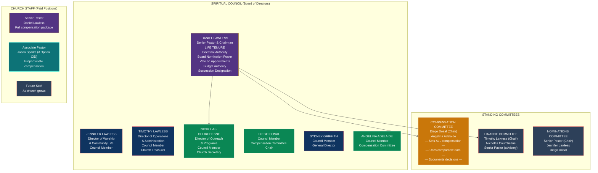
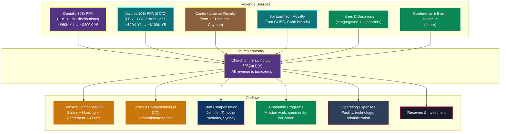
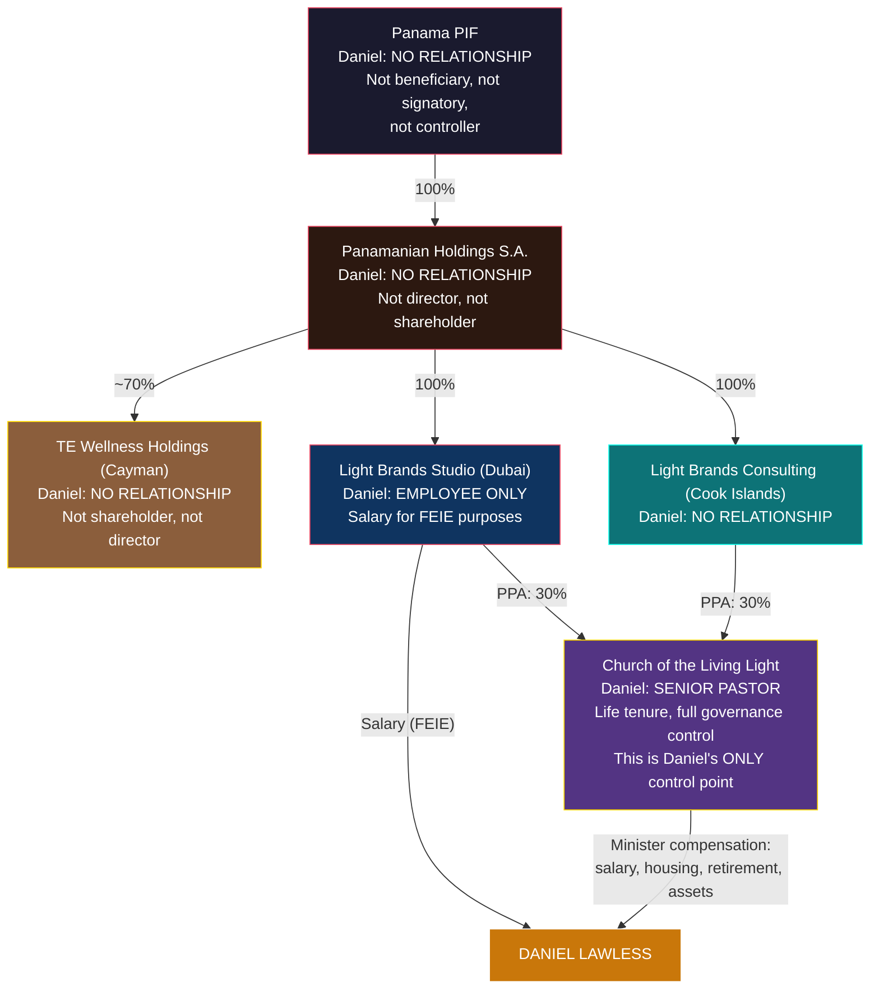

# Church of the Living Light — Governance & Bylaws Framework

> **Status:** Draft — requires religious nonprofit attorney review before formation
> **Last Updated:** February 2026
> **Entity Type:** 508(c)(1)(A) Church (automatic tax exemption, no IRS application required)
> **Model:** Kenneth Copeland Ministries governance structure

---

## 1. TL;DR

The Church of the Living Light is structured so that **Daniel Lawless is the irremovable founding Senior Pastor with life tenure, doctrinal authority over all ministry decisions, board nomination power, budget authority, and succession rights.** The Spiritual Council (board) includes four family members (majority) plus three independent members. Family controls all governance decisions; independents control all compensation decisions (for IRS compliance). Daniel's bylaws protections cannot be amended without his consent.

Daniel is **invisible** to the entire corporate structure except as an employee of LBS (Dubai) for FEIE purposes. The church is the only entity Daniel controls — and through the bylaws, he controls it absolutely.

---

## 2. Legal Foundation

| Attribute | Detail |
|---|---|
| **Entity Name** | Church of the Living Light |
| **Legal Basis** | IRC 508(c)(1)(A) — automatic tax exemption for churches |
| **State Formation** | [TBD — counsel to advise on optimal state: Texas, Wyoming, Nevada] |
| **IRS Application** | **None required.** Churches are automatically exempt. No Form 1023 needed. |
| **Form 990** | **Not required.** Churches are specifically exempt from Form 990 filing (IRC 6033(a)(3)(A)(i)). No public financial disclosure. |
| **IRS Audit** | Protected by Church Audit Procedures Act (IRC 7611). IRS must follow heightened procedures: Treasury-level approval, written notice, limited scope, time restrictions. |
| **14-Point Test** | Church must meet IRS 14-point criteria for church status (see Section 14 below). |
| **Annual Cost** | ~$500-2,000 (state filing + registered agent). No federal filing fees. |

### Why 508(c)(1)(A) Instead of 501(c)(3)

| | 508(c)(1)(A) Church | 501(c)(3) Nonprofit |
|---|---|---|
| **IRS application** | None — automatic | Must apply (Form 1023) |
| **Form 990** | Not required | Required annually (public) |
| **Financial disclosure** | None | Public |
| **IRS audit** | Church Audit Procedures Act protections | Standard audit rules |
| **Donor deductions** | Yes — same as 501(c)(3) | Yes |
| **UBIT** | Same exemptions (IRC 512(b)) | Same |
| **Governance scrutiny** | Minimal (First Amendment) | Standard nonprofit rules |
| **Board independence** | No specific requirements | State-specific requirements |

**The church structure gives maximum privacy, minimum disclosure, and maximum governance flexibility.**

---

## 3. Organizational Architecture

---

## 4. The Spiritual Council (Board of Directors)

### 4.1 Composition: 7 Members

| Seat | Person | Role | Category | Voting |
|---|---|---|---|---|
| **1 — Chairman** | **Daniel Lawless** | Senior Pastor, Chairman of the Board | Family (Founder) | Yes on all matters EXCEPT own compensation |
| **2** | **Jennifer Lawless** | Director of Worship & Community Life | Family (Wife) | Yes on all matters EXCEPT Daniel's compensation (shared household) |
| **3** | **Timothy Lawless** | Director of Operations & Administration, Church Treasurer | Family (Brother) | Yes on all matters |
| **4** | **Nicholas Courchesne** | Director of Outreach & Programs, Church Secretary | Non-Family (LB Co-Founder) | Yes on all matters |
| **5** | **Diego Dosal** | Council Member, Compensation Committee Chair | Independent | Yes on all matters |
| **6** | **Sydney Griffith** | Council Member, General Director | Family (Sister-in-Law) | Yes on all matters |
| **7** | **Angelina Adelaide** | Council Member, Compensation Committee | Independent | Yes on all matters |

### 4.2 Why This Composition Works

**Family majority (4 of 7):** Daniel + Jennifer + Timothy + Sydney control all governance decisions — ministry direction, budget approval, property acquisition, hiring, strategic decisions. On any non-compensation vote, family has a 4-3 majority.

**Nicholas Courchesne as Director / Secretary (Seat 4):** Nicholas is a co-founder of Light Brands and holds 30% PPAs in LBS and LBC. He serves as Director of Outreach & Programs and Church Secretary — an active operational role with record-keeping duties. He is deliberately NOT on the Compensation Committee, which eliminates any independence question around his co-founder status. Having a non-family member as Church Secretary actually strengthens governance credibility — official records are maintained by someone outside the Lawless family.

**Independent compensation committee (2 of 2):** Diego Dosal (Chair) and Angelina Adelaide set all compensation. Both are genuinely independent — no family ties to Daniel, no financial interest in Light Brands or TE entities. Two independent members following the 26 CFR 53.4958-6 process (comparable data + independent deliberation + documentation) satisfies the rebuttable presumption.

**The Copeland precedent:** KCM's board includes Kenneth Copeland (founder/chairman), Gloria Copeland (wife), George Pearsons (son-in-law), and additional members. This structure has operated for 50+ years without IRS challenge to governance.

### 4.3 Council Terms and Appointment

| Provision | Detail |
|---|---|
| **Senior Pastor** | Life tenure (see Section 5) |
| **Family members** | Appointed by Senior Pastor. No term limit. Serve at Senior Pastor's discretion. |
| **Independent members** | Nominated by Senior Pastor via Nominations Committee. Confirmed by majority council vote. 3-year renewable terms. |
| **Removal — Family** | Senior Pastor may remove and replace at any time for any reason. |
| **Removal — Independent** | Senior Pastor may recommend removal for "doctrinal misalignment" or by 2/3 council vote for cause. |
| **Vacancies** | Filled by Senior Pastor nomination + majority council vote. |
| **Quorum** | 4 of 7 members (Senior Pastor counts toward quorum). |

### 4.4 What "Independent" Means for IRS Purposes

Independent council members must satisfy ALL of the following:

- Not a family member of Daniel Lawless (spouse, sibling, child, parent, or their spouses)
- Not an employee of the church (council service is voluntary or has nominal stipend only)
- Not a business partner or financial counterparty of Daniel
- Not receiving compensation from any entity in the Light Brands / TE structure
- No financial interest that would be affected by Daniel's compensation

**Compensation Committee (must be independent):**
- **Diego Dosal** — Compensation Committee Chair. No family or financial ties to Daniel.
- **Angelina Adelaide** — Compensation Committee. No family or financial ties to Daniel.

**Not on Compensation Committee:**
- **Nicholas Courchesne** — serves as Director/Secretary. Excluded from Compensation Committee due to co-founder status in Light Brands (eliminates any independence question).

**Key insight:** Diego and Angelina are chosen BY Daniel (he controls the Nominations Committee). He selects people he trusts and who share his vision. They must be genuinely independent for IRS purposes — no family ties, no financial entanglement.

---

## 5. Senior Pastor Protections (The Copeland Shield)

These provisions are embedded in the church bylaws and **cannot be amended without the Senior Pastor's written consent**.

### 5.1 Life Tenure

> *"The Senior Pastor shall serve for life or until voluntary resignation. The Senior Pastor may only be removed by unanimous vote of ALL Spiritual Council members (excluding the Senior Pastor) upon a documented finding of: (a) felony conviction in a court of law, (b) proven moral turpitude as determined by the Spiritual Council, or (c) permanent physical or mental incapacity certified by two licensed physicians."*

**What this means:** Daniel cannot be fired. Period. The only paths to removal require unanimity (all 6 other members — including 3 family members — must agree) plus an extreme triggering event. Family members would never vote to remove Daniel, making removal practically impossible.

### 5.2 Doctrinal Authority

> *"The Senior Pastor is the sole and final authority on all matters of doctrine, theology, spiritual direction, ministry vision, and the interpretation of the church's Statement of Faith. No Spiritual Council resolution, committee decision, or congregational vote may override the Senior Pastor's doctrinal determinations. The Senior Pastor's doctrinal authority extends to all ministry programs, content, partnerships, and activities of the church."*

**What this means:** Since everything the church does relates to its spiritual mission, doctrinal authority = operational authority. Want to buy a parsonage? Doctrinal decision (housing the minister is a spiritual function). Want to fund a mission trip? Doctrinal. Want to license spiritual content? Doctrinal. Courts cannot review doctrinal decisions — First Amendment, *Serbian Eastern Orthodox Diocese v. Milivojevich* (1976, SCOTUS).

### 5.3 Board Nomination Power

> *"All nominations to the Spiritual Council shall originate from the Nominations Committee, which is chaired by the Senior Pastor. No person may be appointed to the Spiritual Council without the Senior Pastor's affirmative nomination. The Senior Pastor may veto any proposed appointment."*

**What this means:** Nobody gets on the board without Daniel's approval. He controls who sits in every seat.

### 5.4 Board Removal Power

> *"The Senior Pastor may recommend the removal of any Spiritual Council member whose service no longer aligns with the church's doctrinal vision as determined by the Senior Pastor. Upon the Senior Pastor's recommendation, the council shall vote on removal within 30 days. Removal requires a majority vote of the remaining council members."*

**What this means:** If any board member becomes problematic, Daniel recommends removal. With family holding 4 of 7 seats (including Daniel), the vote passes automatically.

### 5.5 Budget Authority

> *"The Senior Pastor shall propose the annual ministry budget to the Spiritual Council for approval. The Senior Pastor is authorized to approve expenditures up to $[50,000] per transaction without prior council approval, provided such expenditures are within the approved annual budget and consistent with the church's ministry mission."*

**What this means:** Day-to-day spending decisions are Daniel's. The council approves the overall budget (which Daniel proposes and family majority approves).

### 5.6 Succession

> *"The Senior Pastor shall have the right to designate a successor Senior Pastor by written instrument filed with the Spiritual Council. Upon the Senior Pastor's death, resignation, or incapacity, the designated successor shall assume the role of Senior Pastor subject to ratification by majority council vote. If no designation exists, the Spiritual Council shall select a successor by 2/3 vote from among the church's ordained ministers."*

**What this means:** Daniel decides who leads the church after him. The council ratifies (family majority ensures this).

### 5.7 Amendment Protection (The Master Lock)

> *"No amendment to Article [X] (Senior Pastor), Article [Y] (Doctrinal Authority), or Article [Z] (Succession) of these bylaws shall be valid without the prior written consent of the Senior Pastor. This provision itself may not be amended without the Senior Pastor's consent."*

**What this means:** The rules that protect Daniel cannot be changed without Daniel's agreement. This is the ultimate safeguard — even if the entire board turned against him (impossible with family majority), they cannot strip his protections without his consent.

---

## 6. Family Roles — Detailed

Each family member holds a genuine ministry role with real responsibilities. These are not ceremonial titles.

### 6.1 Jennifer Lawless — Director of Worship & Community Life

| Attribute | Detail |
|---|---|
| **Council Seat** | Seat 2 |
| **Relationship** | Daniel's wife |
| **Ministry Role** | Leads worship services, manages congregation community, oversees women's ministry, plans community events |
| **Responsibilities** | Weekly worship planning, congregational pastoral care, community outreach coordination, small group ministry |
| **Compensation** | Set by Compensation Committee (Diego, Nicholas, Angelina). Reasonable for role. Separate from Daniel's package. |
| **Recusal** | Recuses from votes on Daniel's compensation (shared household benefit). Votes on all other matters. |

### 6.2 Timothy Lawless — Director of Operations & Administration / Church Treasurer

| Attribute | Detail |
|---|---|
| **Council Seat** | Seat 3 |
| **Relationship** | Daniel's brother |
| **Ministry Role** | Manages church operations, finances, facilities, administration. Serves as Church Treasurer. |
| **Responsibilities** | Financial oversight, vendor management, facility maintenance, compliance calendar, banking relationships, bookkeeping oversight |
| **Compensation** | Set by Compensation Committee. Reasonable for role. |
| **Special Authority** | Co-signatory on church bank accounts (with Diego Dosal or Nicholas Courchesne). Chairs Finance Committee. |
| **Recusal** | Recuses from votes on own compensation. Votes on all other matters including Daniel's compensation (separate household). |

**Note on Timothy's compensation vote for Daniel:** Timothy is a "disqualified person" under IRC 4958 (sibling of person with substantial influence). However, the Compensation Committee (Diego, Nicholas, Angelina) makes the compensation determination. Timothy does NOT sit on the Compensation Committee. Timothy votes on general council matters only. This preserves the rebuttable presumption.

### 6.3 Nicholas Courchesne — Director of Outreach & Programs / Church Secretary

| Attribute | Detail |
|---|---|
| **Council Seat** | Seat 4 |
| **Relationship** | Light Brands co-founder (non-family) |
| **Ministry Role** | Manages outreach programs, strategic partnerships, external mission work. Serves as Church Secretary (official record-keeper). |
| **Responsibilities** | Program development, mission trip coordination, strategic partnerships, community outreach, council meeting minutes, record-keeping, maintaining bylaws and resolutions |
| **Compensation** | None (council service is voluntary — Nicholas is compensated through his own 30% PPAs from LBS/LBC, not by the church). If compensated in future, set by Compensation Committee. |
| **Special Authority** | Official record-keeper. Maintains council minutes, resolutions, and bylaws. Co-signatory on PPA Distribution Account (with Timothy). |
| **Comp Committee** | **NOT on Compensation Committee** — excluded due to co-founder status. Votes on all other matters. |

**Why Nicholas as Secretary strengthens governance:** Having a non-family member maintain official church records adds credibility. The IRS sees that meeting minutes, compensation resolutions, and financial decisions are documented by someone outside the Lawless family — reducing any appearance that records are self-serving.

### 6.4 Sydney Griffith — Council Member, General Director

| Attribute | Detail |
|---|---|
| **Council Seat** | Seat 6 |
| **Relationship** | Daniel's sister-in-law |
| **Ministry Role** | General governance and oversight. Supports outreach, education, and charitable programs. |
| **Responsibilities** | Council participation, committee support, program review, community liaison |
| **Compensation** | Set by Compensation Committee. Reasonable for role (may be nominal/voluntary initially, scaling as church grows). |
| **Recusal** | Recuses from votes on own compensation. |

### 6.4 Jason Sparks — Associate Pastor (If Options C/D)

| Attribute | Detail |
|---|---|
| **Council Seat** | None initially — can be added as Seat 8 if council expands. Advisory role. |
| **Ministry Role** | Associate Pastor. Assists Senior Pastor in ministry. Focuses on [specific ministry area TBD]. |
| **Responsibilities** | Preaching rotation, ministry content creation, community engagement, [specific programs] |
| **Compensation** | Set by Compensation Committee. Proportionate to ministry role (~1/3 of Daniel's, reflecting 10% vs 30% PPA). |
| **PPA** | 10% PPA in LBS + LBC irrevocably assigned to church (same as Daniel's 30%). |

---

## 7. The Compensation Committee — IRS Compliance Engine

This is the most critical governance body for tax purposes. It must operate flawlessly.

### 7.1 Composition

| Member | Role | Independence |
|---|---|---|
| **Diego Dosal (Chair)** | Leads compensation deliberations, presents comparable data | No family ties to Daniel. No Light Brands / TE financial interest. Genuinely independent. |
| **Angelina Adelaide** | Reviews compensation for reasonableness | No family ties to Daniel. No Light Brands / TE financial interest. Genuinely independent. |

**Two members, both genuinely independent.** No family members. No church employees. No co-founders. No one with any financial interest affected by compensation decisions. Nicholas Courchesne is deliberately excluded from this committee due to his co-founder status — he serves the church as Director/Secretary instead.

### 7.2 Process (26 CFR 53.4958-6 Rebuttable Presumption)

The Compensation Committee must follow this exact process for every compensation decision:

| Step | Action | Documentation |
|---|---|---|
| **1. Comparable Data** | Committee obtains compensation data from comparable organizations (churches of similar size, revenue, and mission) | Written summary of data sources: Copeland Ministries, Lakewood Church, other megachurch compensation surveys, ERI Nonprofit Salary Database |
| **2. Independent Deliberation** | Committee meets without the Senior Pastor (or any person whose compensation is being reviewed) present | Meeting minutes documenting who was present, who was excluded, and the deliberation |
| **3. Decision** | Committee determines compensation amount based on comparables | Written resolution stating the amount, the comparable data relied upon, and the rationale |
| **4. Documentation** | All of the above is documented in contemporaneous meeting minutes | Minutes filed with Church Secretary within 60 days |

**If this process is followed, there is a REBUTTABLE PRESUMPTION that the compensation is reasonable.** The IRS must prove it's unreasonable — the burden shifts to them.

### 7.3 What Compensation Covers

The Compensation Committee reviews and approves ALL of the following for each minister:

| Component | Notes |
|---|---|
| **Minister salary** | Cash salary, taxable as ordinary income |
| **Housing allowance designation (IRC 107)** | Amount designated as housing — must be prospective (before the tax year). Tax-free. |
| **Retirement plan contributions** | 403(b)(9) employer contributions, 457(b), 457(f) deferred comp |
| **Church-owned assets used by minister** | Parsonage, vehicles, technology, travel — committee approves each asset acquisition |
| **Discretionary spending authority** | Any church funds used for minister's benefit |
| **Total package value** | Sum of all above. Committee reviews total against comparables. |

### 7.4 Comparable Data Sources

| Source | What It Shows |
|---|---|
| Kenneth Copeland Ministries | $7M church-owned parsonage, private jets, extensive minister compensation. Survived Congressional investigation. |
| Joel Osteen / Lakewood Church | $10.5M residence, $200K+ salary, book revenue channeled through church |
| Creflo Dollar / World Changers | $2.5M residence, $69M Gulfstream (donor-funded) |
| National Association of Church Business Administration (NACBA) | Annual compensation survey by church size/revenue |
| Evangelical Council for Financial Accountability (ECFA) | Compensation benchmarks |
| ERI Nonprofit Compensation Database | Searchable salary data by role, org size, location |

**The comparable data justifies large packages.** If Copeland's church provides a $7M parsonage, Daniel's church providing a $500K-1M parsonage is conservative by comparison.

---

## 8. Financial Controls

### 8.1 Bank Accounts

| Account | Signatories | Purpose |
|---|---|---|
| **Operating Account** | Timothy Lawless (Treasurer) + Diego Dosal (dual signature above $[10,000]) | Day-to-day ministry expenses |
| **PPA Distribution Account** | Timothy Lawless (Treasurer) + Nicholas Courchesne (Secretary, dual signature) | Receives PPA distributions from LBS and LBC. Segregated from operating funds. |
| **Reserve / Investment Account** | Timothy Lawless (Treasurer) + Daniel Lawless + Diego Dosal (any two of three) | Long-term reserves, investment of surplus funds |

### 8.2 Spending Authority

| Amount | Authorization Required |
|---|---|
| Under $5,000 | Senior Pastor alone |
| $5,000 - $50,000 | Senior Pastor + Timothy Lawless (Treasurer) |
| $50,000 - $250,000 | Spiritual Council majority vote |
| Over $250,000 | Spiritual Council supermajority (5 of 7) |

### 8.3 Asset Acquisition Process

For church-owned assets used by ministers (parsonage, vehicles, technology):

1. Senior Pastor proposes acquisition to Spiritual Council (doctrinal justification: ministry use)
2. Finance Committee reviews affordability and funding source
3. Compensation Committee reviews whether the asset constitutes part of minister compensation (it does — include in total package comparables analysis)
4. Spiritual Council votes to approve (family majority)
5. Asset titled in church name
6. Minister use documented (ministry purpose log)

---

## 9. Church Revenue Streams

### Revenue Projections

| Revenue Source | Y1 | Y3 | Y5 | UBIT Status |
|---|---|---|---|---|
| Daniel's PPA distributions (30% LBS + LBC) | ~$60,000 | ~$150,000 | ~$300,000 | Exempt — IRC 512(b)(2) |
| Jason's PPA distributions (10% LBS + LBC) | ~$20,000 | ~$50,000 | ~$100,000 | Exempt — IRC 512(b)(2) |
| Content license royalty (TE Holdings) | ~$10,000 | ~$30,000 | ~$75,000 | Exempt — IRC 512(b)(2) |
| Spiritual tech royalty (CI IBC) | ~$10,000 | ~$25,000 | ~$50,000 | Exempt — IRC 512(b)(2) |
| Tithes & donations | ~$10,000 | ~$50,000 | ~$100,000 | Exempt — donations |
| Conference/event revenue | ~$0 | ~$10,000 | ~$50,000 | Exempt if related to mission |
| **Total church revenue** | **~$110,000** | **~$315,000** | **~$675,000** | **100% tax-exempt** |

**This revenue base supports the minister compensation packages.** The Compensation Committee uses total church revenue as context when setting compensation — as revenue grows, compensation can grow proportionally.

---

## 10. Daniel's Visibility Across the Full Structure

The "invisible founder" model — Daniel's connections to the entire corporate ecosystem:

| Entity | Daniel's Role | Visible? | Control? |
|---|---|---|---|
| Panama PIF | None — excluded as beneficiary | Invisible | None |
| Panamanian Holdings S.A. | None | Invisible | None |
| TE Wellness Holdings (Cayman) | None | Invisible | None |
| Light Brands Studio (Dubai) | Employee (executive role, salary) | **Visible as employee only** | None (no ownership, no directorship) |
| Light Brands Consulting (Cook Islands) | None | Invisible | None |
| **Church of the Living Light** | **Senior Pastor, Chairman, Founder** | **Visible — this is Daniel's entity** | **Total control via bylaws** |

**The church is Daniel's sole control point.** It is the only entity where Daniel has authority. All economic flows to Daniel come either from LBS (salary, for FEIE) or from the church (minister compensation). The church itself receives revenue from PPAs and royalties — contractual flows from entities Daniel does not own, direct, or control.

---

## 11. Bylaws Framework — Key Articles

The following provisions must be drafted by the religious nonprofit attorney and incorporated into the church's founding bylaws. These are the structural protections.

### Article I: Name and Purpose

- Church of the Living Light
- Purpose: spiritual wellness, healing ministry, community service, education, charitable work
- Statement of Faith: [to be drafted — defines the church's theology and spiritual mission]

### Article II: Senior Pastor

- **Section 1 — Appointment:** Daniel Lawless is the founding Senior Pastor.
- **Section 2 — Tenure:** Life tenure. Serves until voluntary resignation, death, or incapacity.
- **Section 3 — Removal:** Only by unanimous vote of all Spiritual Council members (excluding Senior Pastor) upon documented finding of felony conviction, proven moral turpitude, or permanent incapacity certified by two physicians.
- **Section 4 — Doctrinal Authority:** Senior Pastor is sole and final authority on all matters of doctrine, theology, spiritual direction, ministry vision, and interpretation of the Statement of Faith. No council resolution, committee decision, or congregational vote may override.
- **Section 5 — Nomination Power:** All nominations to the Spiritual Council originate from the Senior Pastor. Senior Pastor has veto on all appointments.
- **Section 6 — Budget Authority:** Senior Pastor proposes annual budget. Authorized to approve expenditures within budget up to $[50,000] per transaction.
- **Section 7 — Succession:** Senior Pastor designates successor by written instrument. Council ratifies by majority vote.

### Article III: Spiritual Council

- **Section 1 — Composition:** Seven (7) members including the Senior Pastor.
- **Section 2 — Family Members:** Appointed by Senior Pastor. No term limit. Serve at Senior Pastor's discretion.
- **Section 3 — Independent Members:** Nominated by Senior Pastor via Nominations Committee. Confirmed by majority council vote. Three-year renewable terms.
- **Section 4 — Removal:** Family members: Senior Pastor may remove at any time. Independent members: by Senior Pastor recommendation + majority council vote, or by 2/3 council vote for cause.
- **Section 5 — Quorum:** Four (4) of seven (7) members.
- **Section 6 — Voting:** Simple majority for ordinary business. Supermajority (5 of 7) for: sale of property valued over $[250,000], incurrence of debt over $[100,000], amendments to bylaws.

### Article IV: Compensation Committee

- **Section 1 — Composition:** Two (2) independent council members (Diego Dosal, Chair; Angelina Adelaide). No family members. No church employees. No co-founders or PPA holders.
- **Section 2 — Authority:** Sole authority to set compensation for all church staff, including Senior Pastor, Associate Pastor, and family staff members.
- **Section 3 — Process:** Must follow 26 CFR 53.4958-6 rebuttable presumption process: (a) obtain comparable data, (b) deliberate without the affected person present, (c) document decision in contemporaneous meeting minutes.
- **Section 4 — Annual Review:** Reviews all compensation packages annually before the start of each fiscal year.
- **Section 5 — Housing Allowance:** Designates housing allowance amounts annually, prospectively, before the tax year.

### Article V: Financial Management

- **Section 1 — Fiscal Year:** Calendar year (January 1 - December 31).
- **Section 2 — Treasurer:** Timothy Lawless (Director of Operations) serves as Treasurer.
- **Section 3 — Bank Accounts:** Dual signature required above $[10,000].
- **Section 4 — Annual Budget:** Proposed by Senior Pastor, approved by council majority.
- **Section 5 — Audit:** Internal financial review annually. Independent audit when annual revenue exceeds $[500,000].

### Article VI: Property and Assets

- **Section 1 — Church-Owned Assets:** All property acquired by the church is titled in the church's name.
- **Section 2 — Minister Use:** Church-owned assets may be provided to ministers for ministry use. Ministry use must be documented.
- **Section 3 — Asset Acquisition:** See Section 8.3 above (council approval process).
- **Section 4 — Dissolution:** Upon dissolution, all assets distributed to one or more 501(c)(3) or 508(c)(1)(A) organizations as determined by the Spiritual Council. No assets may be distributed to any individual.

### Article VII: Amendments

- **Section 1 — General Amendments:** Require 2/3 council vote.
- **Section 2 — Protected Articles:** No amendment to Article II (Senior Pastor), Article IV Section 4 (Doctrinal Authority), or Article VII Section 2 (this provision) shall be valid without the prior written consent of the Senior Pastor.

---

## 12. Who Daniel Needs to Appoint — Summary Checklist

### Immediate Appointments (Formation)

| # | Position | Person | Action Required |
|---|---|---|---|
| 1 | **Senior Pastor & Chairman** | **Daniel Lawless** | Named in founding bylaws |
| 2 | **Director of Worship & Community Life** | **Jennifer Lawless** | Named in founding bylaws as council member |
| 3 | **Director of Operations & Treasurer** | **Timothy Lawless** | Named in founding bylaws as council member |
| 4 | **Director of Outreach & Secretary** | **Nicholas Courchesne** | Named in founding bylaws as council member. NOT on Compensation Committee (co-founder status). |
| 5 | **Compensation Committee Chair** | **Diego Dosal** | Confirm availability and willingness to serve. Independence verified. |
| 6 | **Council Member, General Director** | **Sydney Griffith** | Named in founding bylaws as council member. |
| 7 | **Compensation Committee Member** | **Angelina Adelaide** | Confirm availability and willingness to serve. Independence verified. |

### Independence Requirements for Compensation Committee (Diego + Angelina)

Both Compensation Committee members must satisfy ALL of the following:

| Requirement | Diego Dosal | Angelina Adelaide |
|---|---|---|
| **Not a family member of Daniel** | ✓ | ✓ |
| **Not an employee of the church** | ✓ | ✓ |
| **No financial interest in Light Brands / TE entities** | ✓ | ✓ |
| **No financial interest affected by Daniel's compensation** | ✓ | ✓ |
| **Willingness to serve genuinely** | Confirm | Confirm |
| **Comfortable approving Copeland-scale compensation when supported by comparables** | Confirm | Confirm |

**Nicholas Courchesne** is NOT on the Compensation Committee. As a Light Brands co-founder with 30% PPAs in LBS/LBC, he serves the church in an operational role (Director of Outreach / Secretary) where his business knowledge is valuable without creating any independence concerns.

### Formation Documents Needed

| # | Document | Prepared By | Priority |
|---|---|---|---|
| 1 | **Articles of Incorporation** | Religious nonprofit attorney | Critical |
| 2 | **Bylaws (with all protections from Section 11)** | Religious nonprofit attorney | Critical |
| 3 | **Statement of Faith** | Daniel + counsel | Critical |
| 4 | **Organizational Meeting Minutes** | Nicholas Courchesne (Secretary) | Critical |
| 5 | **EIN Application (Form SS-4)** | Attorney or Daniel | Critical |
| 6 | **Compensation Committee Charter** | Attorney | Critical |
| 7 | **Initial Compensation Resolutions** | Compensation Committee | Before first tax year |
| 8 | **Housing Allowance Designation** | Compensation Committee | Before first tax year |
| 9 | **PPA Assignment Agreement (Daniel → Church)** | Attorney | With PPA execution |
| 10 | **PPA Assignment Agreement (Jason → Church)** | Attorney | If Jason chooses Option C/D |
| 11 | **Bank Account Opening Documents** | Timothy Lawless (Treasurer) | Within 30 days of EIN |
| 12 | **Church Audit Procedures Manual** | Internal | Month 2 |

---

## 13. Family Compensation — What's Defensible

Each family member receives compensation for their church role. The Compensation Committee (independents only) sets all compensation. Comparable data from churches of similar size supports the following ranges:

| Role | Y1 Range | Y3 Range | Y5 Range | Basis |
|---|---|---|---|---|
| **Jennifer Lawless** — Director of Worship & Community Life | $30,000-50,000 | $50,000-80,000 | $80,000-120,000 | Part-time→full-time as church grows. Comparable to worship directors at mid-size churches. |
| **Timothy Lawless** — Director of Operations & Treasurer | $40,000-60,000 | $60,000-100,000 | $100,000-150,000 | Operations/finance role. Comparable to church administrators. |
| **Nicholas Courchesne** — Director of Outreach & Secretary | Voluntary / nominal | $30,000-50,000 | $50,000-80,000 | Non-family director. Compensated primarily through own 30% PPAs. Church compensation optional, set by Comp Committee. |
| **Sydney Griffith** — General Director | Voluntary / nominal | $25,000-40,000 | $40,000-60,000 | General governance role. Scales as church grows. |

**Key rules:**
- Each family member's compensation is set by the Compensation Committee (independents)
- Each must have genuine, documented ministry responsibilities
- Compensation must be reasonable for the role and church size
- Each family member recuses from votes on their own compensation
- Comparable data from NACBA salary surveys supports the ranges above

**Family members can also receive housing allowance (IRC 107) if ordained.** If Jennifer, Timothy, or Sydney become ordained ministers of the church, they qualify for tax-free housing allowance on the same basis as Daniel. This is a significant additional tax benefit. Counsel to advise on ordination requirements and timing.

---

## 14. IRS 14-Point Church Test

The IRS uses these 14 characteristics to determine church status. The Church of the Living Light must satisfy a majority (not all) of these:

| # | Characteristic | Church of the Living Light |
|---|---|---|
| 1 | Distinct legal existence | Yes — incorporated with articles, bylaws, EIN |
| 2 | Recognized creed and statement of faith | Yes — Statement of Faith (spiritual wellness, healing, community) |
| 3 | Definite and distinct ecclesiastical government | Yes — Senior Pastor + Spiritual Council + committees |
| 4 | Formal code of doctrine and discipline | Yes — Statement of Faith + member covenant |
| 5 | Distinct religious history | Building from formation — document origin story and doctrinal development |
| 6 | Membership not associated with any other church | Yes — distinct membership |
| 7 | Organization of ordained ministers | Yes — Senior Pastor (Daniel) + Associate Pastor (Jason, if applicable) |
| 8 | Ordained ministers selected after completing prescribed studies | Yes — ordination program with curriculum |
| 9 | Literature of its own | Yes — spiritual wellness content, devotionals, educational materials |
| 10 | Established places of worship | Yes — can be home church, rented space, or digital ministry initially |
| 11 | Regular congregations | Yes — weekly services (in-person or digital) |
| 12 | Regular religious services | Yes — weekly worship, prayer, teaching |
| 13 | Sunday schools or equivalent for young | Future — educational programs as church grows |
| 14 | Schools for preparation of ministers | Future — training programs for ministry leaders |

**Meeting 10+ of 14 is generally sufficient.** The church satisfies at least 12 from formation.

---

## 15. Bright Lines — Church Governance Rules

| Rule | Consequence of Violation |
|---|---|
| **Compensation Committee must be 100% independent** | Loss of rebuttable presumption. Excess benefit risk. |
| **Compensation must be set BEFORE services rendered** | IRS can recharacterize retroactive pay as distributions. |
| **Housing allowance must be designated BEFORE the tax year** | Invalid designation = fully taxable. |
| **Church must maintain genuine charitable activity** | Cannot exist solely to benefit the founder. Must have programs, community service, charitable giving proportional to revenue. |
| **Council meeting minutes must be contemporaneous** | Minutes after-the-fact lose evidentiary value. Document in real-time. |
| **No private inurement** | Church revenue cannot be distributed to individuals as "profit." All compensation must be for services rendered. |
| **No circular cash flows** | Daniel donates to church → church pays Daniel back ≠ allowed. Church revenue from PPAs/royalties → church compensates Daniel for ministry ✓ allowed. The distinction: PPA revenue is the church's independent income, not recycled personal income. |
| **Church-owned assets must have ministry purpose documented** | Annual log of ministry use for each asset (parsonage, vehicles, tech, travel). |
| **Daniel must recuse from own compensation votes** | Cannot vote on or approve own compensation package. |
| **No Form 990 required — but keep records as if one were** | Internal financial records should be audit-ready even though no public filing is required. If the IRS ever invokes Church Audit Procedures Act, records must be available. |

---

## 16. Integration with Tax Structure

This is how the church connects to the rest of the Transformational Epicenter structure:

| Connection | Mechanism | Document Reference |
|---|---|---|
| Church receives 30% LBS profits | PPA assigned from Daniel → Church | [10-LB-PROFIT-PARTICIPATION-FRAMEWORK.md](./10-LB-PROFIT-PARTICIPATION-FRAMEWORK.md) |
| Church receives 30% LBC profits | PPA assigned from Daniel → Church | Same |
| Church receives 10% LBS profits (if Jason C/D) | PPA assigned from Jason → Church | Same |
| Church receives 10% LBC profits (if Jason C/D) | PPA assigned from Jason → Church | Same |
| Church receives content royalty | License agreement with TE Holdings | [01-MASTER-STRUCTURE.md](./01-MASTER-STRUCTURE.md) |
| Church receives spiritual tech royalty | License agreement with CI IBC | [08-COOK-ISLANDS-IBC-DETAIL.md](./08-COOK-ISLANDS-IBC-DETAIL.md) |
| Church compensates Daniel | Minister salary, housing, retirement, assets | [03-FOUNDER-GUIDE-US.md](./03-FOUNDER-GUIDE-US.md) Part I |
| Church compensates Jason (if C/D) | Same channels, proportionate | [03-FOUNDER-GUIDE-US.md](./03-FOUNDER-GUIDE-US.md) Part II |
| Daniel employed by LBS | Separate from church — for FEIE only | [03-FOUNDER-GUIDE-US.md](./03-FOUNDER-GUIDE-US.md) Section 3 |
| Legal defense of church structure | Copeland model precedent | [02-LEGAL-DEFENSE.md](./02-LEGAL-DEFENSE.md) |
| Counsel questions for church | Q6, Q45, Q61-Q70 | [06-COUNSEL-QUESTIONS.md](./06-COUNSEL-QUESTIONS.md) |

---

## 17. Action Items — Church Formation

| # | Action | Owner | Timeline | Priority |
|---|---|---|---|---|
| 1 | **Engage religious nonprofit attorney** — experienced with 508(c)(1)(A) churches and megachurch governance | Daniel | Week 1 | **Critical** |
| 2 | **Draft Statement of Faith** — define the church's theology, spiritual wellness mission, and doctrinal foundation | Daniel + counsel | Weeks 1-2 | **Critical** |
| 3 | **Confirm independent council members** — Diego Dosal (Comp Committee Chair), Angelina Adelaide (Comp Committee), Nicholas Courchesne (Director/Secretary, not on Comp Committee) | Daniel | Weeks 1-3 | **Critical** |
| 4 | **Draft bylaws** with all Senior Pastor protections from Section 11 | Attorney | Weeks 2-4 | **Critical** |
| 5 | **Draft Articles of Incorporation** — file in optimal state | Attorney | Weeks 2-4 | **Critical** |
| 6 | **Hold organizational meeting** — adopt bylaws, elect officers, approve initial resolutions | All council members | Week 4-5 | **Critical** |
| 7 | **Obtain EIN** (Form SS-4) | Attorney or Treasurer | Week 5 | **Critical** |
| 8 | **Open church bank accounts** — operating + PPA distribution + reserve | Timothy Lawless (Treasurer) | Weeks 5-6 | High |
| 9 | **Compensation Committee holds first meeting** — Diego + Angelina set Y1 compensation for all staff using comparable data | Compensation Committee | Before first tax year | **Critical** |
| 10 | **Housing allowance designation** — board resolution for Daniel (and Jason if applicable) | Compensation Committee | Before first tax year | **Critical** |
| 11 | **Begin ordination program** — Daniel + Jason (if joining) + family members (if pursuing ordained status) | Daniel | Weeks 3-8 | High |
| 12 | **Execute PPA Assignment Agreement (Daniel → Church)** | Attorney | With PPA execution | **Critical** |
| 13 | **Execute PPA Assignment Agreement (Jason → Church)** — if Option C/D | Attorney | With PPA execution | Critical (if applicable) |
| 14 | **Draft church employment agreements** — for all compensated staff | Attorney | Weeks 4-6 | High |
| 15 | **Establish retirement plans** — 403(b)(9) + 457(b) for ministers, potentially 457(f) as revenue grows | Attorney + plan administrator | Months 2-4 | High |
| 16 | **Begin regular worship services** — weekly, documented, genuine | Daniel + family | Month 1 | **Critical** |
| 17 | **Launch charitable programs** — at least one charitable initiative beyond minister compensation | Nicholas Courchesne (Outreach Director) | Months 2-3 | High |
| 18 | **Document everything** — meeting minutes, resolutions, ministry logs, asset use, charitable activity | Nicholas Courchesne (Secretary) | Ongoing | **Critical** |

---

## 18. Questions for Counsel (Church-Specific)

| # | Question | Priority |
|---|---|---|
| 1 | Optimal state of incorporation for a 508(c)(1)(A) church with these governance protections? (Texas, Wyoming, Nevada, other?) | Critical |
| 2 | Can the Senior Pastor irremovability clause survive a state attorney general challenge? What language is strongest? | Critical |
| 3 | Can family members be ordained as ministers of the church and receive IRC 107 housing allowance? What ordination process is sufficient? | Important |
| 4 | Is there a maximum ratio of minister/family compensation to total church revenue that triggers IRS scrutiny? | Important |
| 5 | Should the church engage an independent auditor from Year 1, even though not required, to strengthen defense? | Important |
| 6 | Can the church hold real estate in multiple jurisdictions (US parsonage + Dubai property for international ministry)? | Forward |
| 7 | If the church receives PPA exit proceeds (entity sale), can those proceeds fund minister retirement plans or must they be retained as church assets? | Important |
| 8 | Review draft bylaws for compliance with state nonprofit corporation act and IRS requirements. | Critical |
| 9 | Nicholas Courchesne serves as Director/Secretary but is NOT on the Compensation Committee (co-founder of Light Brands, holds 30% PPAs). Confirm this structure eliminates any independence concern. Does his role as Secretary (record-keeper for compensation decisions he doesn't vote on) create any issues? | Important |

---

## Cross-References

- **Master structure:** [01-MASTER-STRUCTURE.md](./01-MASTER-STRUCTURE.md)
- **Legal defense (Copeland model):** [02-LEGAL-DEFENSE.md](./02-LEGAL-DEFENSE.md)
- **US founder playbook — Daniel (Part I) + Jason (Part II):** [03-FOUNDER-GUIDE-US.md](./03-FOUNDER-GUIDE-US.md)
- **PPA framework:** [10-LB-PROFIT-PARTICIPATION-FRAMEWORK.md](./10-LB-PROFIT-PARTICIPATION-FRAMEWORK.md)
- **Counsel questions (church):** [06-COUNSEL-QUESTIONS.md](./06-COUNSEL-QUESTIONS.md) — Q6, Q45, Q61-Q70

---

*This document outlines a proposed governance structure for the Church of the Living Light modeled on Kenneth Copeland Ministries' 50+ year precedent. The bylaws framework provides maximum founder protection within the legal boundaries available to churches under the First Amendment and IRC 508(c)(1)(A). All governance provisions, bylaws, and compensation structures must be reviewed and finalized by a qualified religious nonprofit attorney before formation. Nothing in this document constitutes legal advice.*
