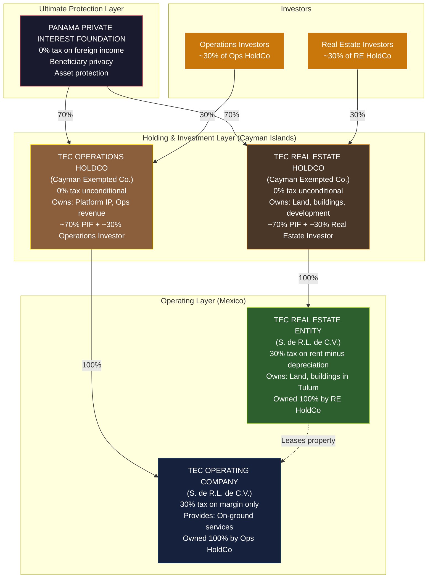
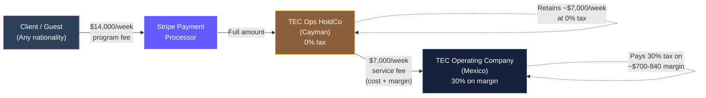
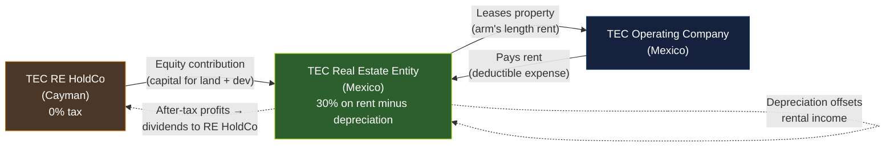
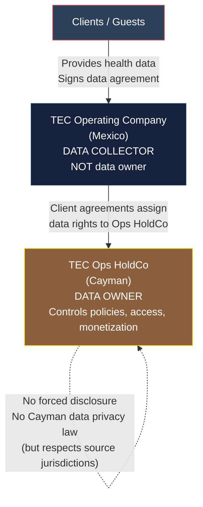
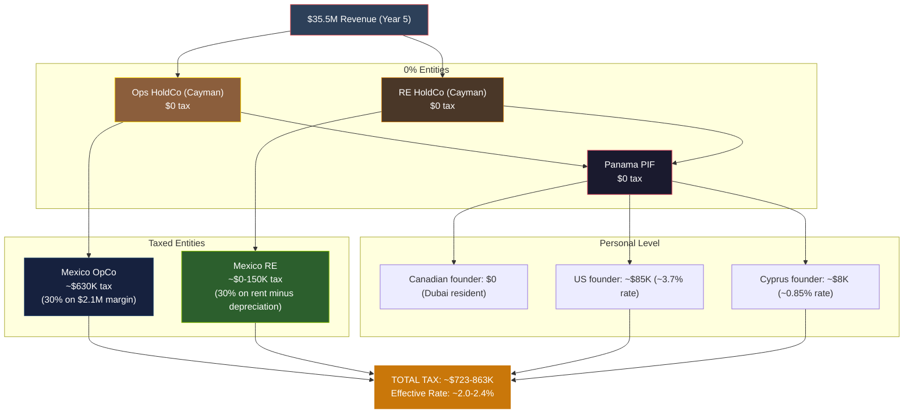

# Transformational Epicenter: Standalone Tax & Legal Structure

> **Status:** Strategic Architecture — Requires Multi-Jurisdictional Counsel Validation
> **Prepared For:** Felipe Strategic Review
> **Last Updated:** February 2026

---

## Executive Summary

This document presents a comprehensive legal, tax, and corporate structuring strategy for **Transformational Epicenter (TEC)** as a **standalone entity**, completely separate from LightBrand Consulting and LightBrand Studio.

**The Company:** High-end health, medical, wellness, bio-optimization, and real estate-integrated destination operating primarily in Mexico (Tulum/Quintana Roo), serving international clients with:
- Medical and wellness services
- Retreat experiences
- Technology platform and app
- Real estate ownership and development
- Sensitive health and biometric data collection

**The Structure:** Panama Private Interest Foundation → Two Cayman Islands HoldCos (Operations + Real Estate) → Mexican Operating Company + Mexican Real Estate Entity

**Tax Efficiency:** ~1.4-1.8% combined global tax rate on $35M+ revenue at scale

**Key Optimization:** Revenue collected in 0% jurisdiction (Cayman), minimal profit retained in 30% jurisdiction (Mexico), maximum asset protection via multiple jurisdictional layers, separate investor pools for operations vs. real estate.

---

## Table of Contents

1. [Recommended Entity Architecture](#1-recommended-entity-architecture)
2. [Panama PIF + Dual Cayman Structure Analysis](#2-panama-pif--dual-cayman-structure-analysis)
3. [Revenue Flow Strategy](#3-revenue-flow-strategy)
4. [Transfer Pricing Analysis](#4-transfer-pricing-analysis)
5. [Real Estate Strategy](#5-real-estate-strategy)
6. [IP & Data Protection Structure](#6-ip--data-protection-structure)
7. [Tax Optimization Strategy](#7-tax-optimization-strategy)
8. [Founders & Investors Strategy](#8-founders--investors-strategy)
9. [Risk Analysis](#9-risk-analysis)
10. [Conservative vs. Aggressive Models](#10-conservative-vs-aggressive-models)
11. [Final Recommendation](#11-final-recommendation)
12. [Implementation Roadmap](#12-implementation-roadmap)

---

## 1. Recommended Entity Architecture

### 1.1 Five-Entity Structure



### 1.2 Entity Summary Table

| Entity | Jurisdiction | Role | Tax Rate | Ownership | Purpose |
|--------|-------------|------|----------|-----------|---------|
| **Panama PIF** | Panama | Ultimate asset protection, beneficiary privacy | 0% | No owner (independent legal person) | Owns 70% of both Cayman HoldCos, protects founders |
| **TEC Operations HoldCo** | Cayman Islands | Collects all client revenue, owns platform IP, controls Mexico OpCo | 0% (unconditional, 20-year guarantee) | 70% PIF + 30% Operations Investors | Investable vehicle for operations |
| **TEC Real Estate HoldCo** | Cayman Islands | Owns all real estate assets, controls Mexico RE entity | 0% (unconditional, 20-year guarantee) | 70% PIF + 30% Real Estate Investors | Investable vehicle for real estate |
| **TEC Operating Company** | Mexico (Tulum) | Delivers on-ground services, employs local staff, operates facilities | 30% on 8-12% service margin only | 100% owned by Ops HoldCo | Legally required Mexican presence |
| **TEC Real Estate Entity** | Mexico (Tulum) | Acquires land, develops property, holds title, leases to OpCo | 30% on rental income minus depreciation | 100% owned by RE HoldCo | Asset protection, depreciation benefits |

### 1.3 Why Five Entities (Not More, Not Fewer)

**Too few (3 entities: PIF + Cayman + Mexico):**
- Cannot separate operations investors from real estate investors
- Single Cayman entity concentrates both revenue streams and real estate assets
- Limits exit flexibility (cannot sell real estate separately from operations)
- Mixes operational liability with real estate assets

**Too many (7+ entities with intermediary holding companies):**
- Additional compliance cost (~$15-25K per entity annually)
- No additional tax benefit (all intermediate layers would be 0% anyway)
- Increased governance complexity
- Transfer pricing multiplication

**Five is optimal:**
- Achieves investor separation (different pools for ops vs. RE)
- Maximizes asset protection (PIF → dual Cayman → dual Mexico = 4 layers)
- Enables independent exits (sell ops, sell RE, or both)
- Minimizes compliance burden relative to benefits

---

## 2. Panama PIF + Dual Cayman Structure Analysis

### 2.1 Strategic Question: Is This Optimal or Over-Engineered?

**Answer: Optimal for this specific business. Here's why:**

#### Benefits of Panama PIF Layer

| Benefit | Impact |
|---------|--------|
| **Beneficiary privacy** | PIF beneficiaries are NOT publicly disclosed. No registry. Critical for high-net-worth founders and data-sensitive business. |
| **Asset protection** | PIF is an independent legal person. Creditors must breach Panamanian law (which strongly protects foundations) before reaching any operating entity equity. |
| **0% on foreign income** | Panama taxes only Panamanian-source income. All TEC revenue is international → 0%. |
| **Flexible distributions** | PIF can distribute to beneficiaries at any time, any amount, without "dividend" classification issues. |
| **No forced disclosure** | Unlike US LLCs or Canadian corps, PIF has no public beneficial ownership registry. |

#### Benefits of Dual Cayman HoldCos

| Benefit | Impact |
|---------|--------|
| **Investor separation** | Operations investors want exposure to $35M revenue stream. Real estate investors want exposure to Tulum land appreciation and development. Different risk profiles, different economics. Dual HoldCos allow clean separation. |
| **Exit flexibility** | Can sell Ops HoldCo (platform, IP, client relationships) to strategic acquirer while retaining real estate. Or sell RE HoldCo to REIT/developer while continuing operations. |
| **Risk isolation** | Guest injury claim against OpCo cannot reach real estate assets. Environmental liability on real estate cannot reach operating cash flow. |
| **0% unconditional** | Cayman has NEVER had corporate tax. 20-year Tax Undertaking Certificate guarantees this. No substance requirements for holding companies. |
| **VC-standard** | Cayman Exempted Companies are the global standard for institutional VC. Sequoia, a16z, Tiger Global all use this structure. Investors will recognize it immediately. |

#### Alternative Considered: Single Cayman HoldCo

| Aspect | Single HoldCo | Dual HoldCos (Recommended) |
|--------|---------------|---------------------------|
| **Investor flexibility** | All investors must accept both ops AND real estate exposure | Ops investors can invest in Ops HoldCo only; RE investors can invest in RE HoldCo only |
| **Valuation complexity** | Single valuation covering both assets | Separate valuations for operations ($147M SOTP) and real estate (based on development cost + appreciation) |
| **Exit options** | Must sell everything together OR restructure before exit | Clean independent exits from day one |
| **Risk concentration** | Operational liability and real estate liability in same entity | Completely isolated |
| **Compliance cost** | 1 Cayman entity (~$16-27K/year) | 2 Cayman entities (~$32-54K/year) |

**Verdict:** The additional $16-27K annual cost of the second Cayman HoldCo is trivial compared to:
- Ability to raise $10-30M in real estate investment separately from operations investment
- Exit flexibility worth millions in future M&A scenarios
- Risk isolation protecting $100M+ in real estate assets from operational claims

### 2.2 PIF Ownership Percentages

**Recommended:** PIF owns 70% of BOTH Cayman HoldCos

| Scenario | PIF % | Ops Investor % | RE Investor % | Rationale |
|----------|-------|----------------|---------------|-----------|
| **Recommended** | 70% / 70% | 30% | 30% | Founders retain control of both entities via PIF. Clean 70/30 split for each investor class. Simple governance. |
| Alternative A | 80% / 80% | 20% | 20% | Founders retain more equity but investors may push back on dilution for same check size. |
| Alternative B | 60% / 60% | 40% | 40% | Higher dilution; founders risk losing control if investors coordinate. |

**Critical founder protection:** PIF beneficiaries should include Canadian founder and potentially Cyprus founder, but **NOT the US founder** (to avoid CFC/GILTI complications — see Section 8.2).

---

## 3. Revenue Flow Strategy

### 3.1 The Core Revenue Model



### 3.2 Revenue Flow Breakdown

#### Step 1: Client Pays Ops HoldCo (Cayman)

- **Who pays:** Any client (US, Canadian, European, international)
- **Amount:** $14,000/week for standard program (example)
- **Payment method:** Credit card via Stripe, wire transfer, or cryptocurrency
- **Recipient:** TEC Operations HoldCo (Cayman) — this entity holds the Stripe merchant account and client contracts
- **Tax on receipt:** 0% (Cayman has no corporate income tax)

#### Step 2: Ops HoldCo Pays Mexico OpCo Service Fee

- **Who pays:** TEC Operations HoldCo (Cayman)
- **Who receives:** TEC Operating Company (Mexico)
- **Amount:** $7,000/week (example — 50% of client fee)
- **Pricing basis:** Cost-plus methodology
  - Mexico OpCo's actual costs: ~$6,160-6,300/week (salaries, food, supplies, facilities)
  - Markup: 8-12% (arm's length service margin)
  - Total service fee: ~$7,000/week

- **Tax treatment:**
  - **In Mexico:** OpCo receives $7,000, incurs $6,300 in costs, earns ~$700 margin. Tax = 30% of $700 = $210 per client per week.
  - **In Cayman:** Ops HoldCo pays $7,000 (deductible expense if Cayman had corporate tax, but it doesn't, so this is simply a cash outflow). Retains ~$7,000 per client per week at 0% tax.

#### Step 3: Real Estate Lease Flow



- **RE HoldCo (Cayman)** capitalizes the Mexican RE entity via equity contribution
- **Mexico RE Entity** acquires land, develops villas/facilities, holds title
- **Mexico RE Entity** leases developed property to Mexico OpCo at arm's length market rent
- **Mexico OpCo** deducts rent as operating expense (included in the $6,300 cost base that flows into the $7,000 service fee calculation)
- **Mexico RE Entity** pays 30% tax on rental income MINUS building depreciation (5% annual on buildings, 0% on land)
- **After-tax profits** distributed to RE HoldCo (Cayman) as dividends from CUFIN (0% additional Mexican tax, 0% Cayman receipt tax)

### 3.3 Annual Revenue Flow (Year 5 Example)

| Metric | Amount | Tax | Net |
|--------|--------|-----|-----|
| **Total client revenue** | $35,461,000 | | |
| **Flows to:** Ops HoldCo (Cayman) | $35,461,000 | 0% | $35,461,000 |
| **Ops HoldCo pays:** Mexico OpCo service fee | ($17,500,000) | | |
| **Mexico OpCo margin:** ~12% | ~$2,100,000 | 30% | (~$630,000 tax) |
| **Ops HoldCo retains (EBITDA ~43-61%)** | ~$17,961,000 | 0% | $17,961,000 |
| **Real estate rental income** (Mexico RE) | ~$2,500,000 | | |
| **Minus depreciation** (5% on $50M buildings) | ($2,500,000) | | |
| **Mexico RE taxable income** | ~$0 | 0% | $0 (early years) |

**Total Mexican tax (Year 5):** ~$630,000
**Total revenue:** $35,461,000
**Effective tax rate:** ~1.8%

---

## 4. Transfer Pricing Analysis

### 4.1 The Critical Question: Is $7K Service Fee Defensible?

**YES — if properly structured and documented. Here's how:**

#### Legal Basis: Platform-as-Principal Model

The structure operates under the **"Platform-as-Principal" model**, which is widely used by multinational hospitality, technology, and service companies (Airbnb, Booking.com, Marriott, etc.):

| Element | TEC Structure |
|---------|---------------|
| **Who owns the client relationship?** | Ops HoldCo (Cayman) — signs client contracts, holds client data, owns brand/platform |
| **Who delivers the service?** | Mexico OpCo — provides on-ground hospitality, medical services, facilitation |
| **Economic substance** | Ops HoldCo bears platform risk (marketing, client acquisition, technology, IP development). Mexico OpCo is a fulfillment service provider. |
| **Transfer pricing method** | Cost-Plus Method — Mexico OpCo receives its fully loaded costs PLUS an 8-12% service margin (arm's length for low-risk service providers) |

**Comparable companies using this model:**
- **Marriott:** Marriott International (US HoldCo) owns the brand and reservations system. Local hotel operating companies (in Mexico, Europe, Asia) provide hospitality services under management agreements for cost-plus fees.
- **Booking.com:** Booking Holdings (Cayman) collects all customer payments. Local entities provide support services for cost-plus margins.
- **Hilton:** Hilton Worldwide Holdings owns IP and reservations. Local OpCos operate hotels under franchise/management agreements.

**Transfer pricing justification:**
- Mexico OpCo is a **"limited-risk distributor"** or **"routine service provider"**
- It does NOT own IP, client relationships, or brand
- It does NOT bear platform risk, technology risk, or marketing risk
- It receives stable cost-plus compensation regardless of whether Ops HoldCo is profitable
- OECD Guidelines (Chapter II) explicitly recognize cost-plus as appropriate for routine service providers

### 4.2 BEPS Risk Analysis

**BEPS (Base Erosion and Profit Shifting)** is the OECD's anti-avoidance framework. Mexico is an OECD member and has implemented BEPS measures. Here's how the structure complies:

| BEPS Action | TEC Compliance |
|-------------|----------------|
| **Action 5: Harmful Tax Practices** | Cayman is NOT on the EU blacklist or OECD harmful regimes list. 0% rate is sovereign law, not a "patent box" or special regime. |
| **Action 8-10: Transfer Pricing** | Annual TP studies benchmark the service fee using OECD-approved methods (cost-plus). Comparable data from hospitality service providers. |
| **Action 13: CbC Reporting** | TEC group revenue ($35M) is below the €750M threshold for Country-by-Country Reporting. Not required. |
| **Economic Substance** | Ops HoldCo (Cayman) performs genuine functions: platform ownership, client contracts, Stripe merchant account, IP ownership, strategic decisions. Mexico OpCo has employees, facilities, and local substance. |

### 4.3 Permanent Establishment Risk

**Risk:** If Ops HoldCo (Cayman) creates a "permanent establishment" in Mexico, Mexican tax authorities could tax Ops HoldCo's profits as if they were earned in Mexico.

**Mitigation:**

| PE Trigger | TEC Structure Avoids This How? |
|------------|-------------------------------|
| **Fixed place of business** | Ops HoldCo has NO office, NO employees, NO physical presence in Mexico. Mexico OpCo is a SEPARATE legal entity (not a branch). |
| **Dependent agent** | Mexico OpCo operates under its own legal authority. It does NOT have authority to bind Ops HoldCo in client contracts. Ops HoldCo signs contracts directly (via Cayman registered office). |
| **Management and control** | Ops HoldCo's directors meet outside Mexico (Cayman, Dubai, or remotely). Strategic decisions made outside Mexico. |

**Case law support:** The OECD Model Tax Convention (Article 5) and Mexican domestic law (LISR Article 2) define PE narrowly. A subsidiary performing services under an arm's length service agreement does NOT create PE for the parent (OECD Commentary para 41.1).

### 4.4 Transfer Pricing Documentation Requirements (Mexico)

Mexico's SAT (tax authority) requires **annual transfer pricing studies** for all related-party transactions:

| Document | Requirement | Frequency |
|----------|-------------|-----------|
| **Informativa de Operaciones con Partes Relacionadas** | Disclosure of all related-party transactions (service fees, royalties, leases) | Annual (due with tax return) |
| **Transfer Pricing Study** | Functional analysis, comparables database, benchmarking study, pricing methodology | Annual (prepared but filed only upon request) |
| **Advance Pricing Agreement (Optional)** | Pre-approval from SAT for specific TP methodologies | Multi-year (3-5 years) |

**Estimated annual TP documentation cost:** $15,000-30,000 (for service fee + lease agreements)

**Benchmark sources:**
- Royalty<stat>, BvD Amadeus, S&P Capital IQ — databases of service provider margins in hospitality and healthcare
- Mexican hospitality management companies (RCD Hotels, Grupo Posadas)
- International wellness operators (Six Senses, Aman, Banyan Tree — most use similar structures)

### 4.5 Conservative Service Fee Range

Based on OECD guidelines and hospitality/wellness industry benchmarks:

| Mexico OpCo Margin | Defensibility | Comparable Industries |
|--------------------|---------------|----------------------|
| **8-10%** | Highly conservative | Hotel operational services, call center support, contract manufacturing |
| **10-12%** | Industry standard | Healthcare service providers, wellness facility operators |
| **12-15%** | Moderate | Specialized medical services, luxury hospitality |
| **15%+** | Aggressive (requires strong justification) | Requires significant IP contribution or unique risk profile |

**Recommendation:** Start at 10%, benchmark annually, increase to 12% if comparables support it.

---

## 5. Real Estate Strategy

### 5.1 Why Separate Real Estate from Operations?

| Reason | Impact |
|--------|--------|
| **Asset protection** | Guest injury lawsuit against OpCo cannot reach land and buildings held by separate entity |
| **Tax efficiency** | Building depreciation (5% annual) offsets rental income in the RE entity, reducing total Mexico tax |
| **Investor separation** | Operations investors want platform/revenue exposure. Real estate investors want land appreciation and development returns. Different risk profiles. |
| **Exit flexibility** | Can sell RE assets to REIT/developer while continuing operations under lease. Or sell operations to strategic acquirer while retaining valuable Tulum real estate. |
| **Depreciation recapture benefit** | On eventual sale, inflation-adjusted cost basis + capitalized development costs minimize capital gains tax (see Section 5.6) |

### 5.2 Real Estate Entity Ownership Options

#### Option A: Mexico RE Entity Owned by RE HoldCo (Cayman) — RECOMMENDED

```
TEC RE HoldCo (Cayman, 0%)
  └── 100% TEC Real Estate Entity (Mexico, 30% on rent minus depreciation)
        └── Owns land and buildings in Tulum
```

**Advantages:**
- Clean investor separation (RE investors buy equity in RE HoldCo only)
- 0% tax on distributions from Mexico RE → RE HoldCo
- RE HoldCo can raise dedicated real estate capital without diluting Ops HoldCo
- Standard international RE holding structure

**Disadvantages:**
- Requires second Cayman entity (+$16-27K annual cost)
- Transfer pricing study required for intercompany lease (Mexico RE → Mexico OpCo)

#### Option B: Mexico RE Entity Owned by Ops HoldCo (Cayman)

```
TEC Ops HoldCo (Cayman, 0%)
  └── 100% TEC Operating Company (Mexico)
  └── 100% TEC Real Estate Entity (Mexico)
```

**Advantages:**
- One fewer entity (simpler structure)
- No need for separate real estate investors

**Disadvantages:**
- Operations investors get involuntary exposure to real estate
- Cannot raise dedicated real estate capital
- Exit flexibility limited (must sell both ops and RE together, or restructure pre-exit)
- Risk concentration (ops liability and RE liability under same parent)

**Verdict:** Option A (dual Cayman HoldCos) is optimal if you anticipate:
- Raising $10M+ in real estate development capital
- Potential future sale of operations OR real estate independently
- Institutional real estate investors (who expect dedicated RE vehicles)

### 5.3 Acquisition Strategy

#### Land Acquisition in Mexico's Restricted Zone

Tulum is within Mexico's **restricted zone** (50km from coast). Foreign ownership rules:

| Use Case | Ownership Method | Requirements |
|----------|------------------|--------------|
| **Commercial use** (healing center, hospitality) | Mexican company with foreign shareholders can own directly | SRE permit + Article 10-A compliance |
| **Residential use** (personal homes, condos for sale) | MUST use fideicomiso (bank trust) | 50-year renewable trust, Mexican bank as trustee |
| **Mixed use** (healing center + residential villas) | Likely requires fideicomiso for residential portions | Legal counsel determination |

**Recommended structure if fideicomiso required:**

```
TEC RE HoldCo (Cayman)
  └── 100% TEC Real Estate Entity (Mexico)
        └── Beneficiary of Fideicomiso
              └── Mexican Bank (BBVA, Banamex, Santander) holds legal title as trustee
```

- **Annual fideicomiso cost:** $1,000-3,000
- **Tax treatment:** Transparent — rental income and depreciation flow through to RE entity as beneficiary

### 5.4 Development Strategy

#### Capital Requirements

| Phase | Cost Range | Timeline |
|-------|------------|----------|
| **Land acquisition** | $2-8M | Year 1 |
| **Phase 1 development** (healing center facility, 10-15 initial villas) | $8-20M | Years 1-2 |
| **Phase 2 development** (additional 15-20 villas, amenities) | $10-25M | Years 3-4 |
| **Phase 3 development** (luxury expansion, full buildout) | $15-30M | Years 5-7 |
| **Infrastructure** (roads, utilities, water, waste) | $5-12M | Ongoing |
| **Total estimated** | **$40-95M** | Over 7 years |

#### Financing Options

| Method | Structure | Tax Impact |
|--------|-----------|------------|
| **Equity from RE HoldCo** (RECOMMENDED) | RE HoldCo (Cayman) contributes capital to Mexico RE entity | No interest payments = no REFIPRE risk. Clean profit extraction via dividends. Every dollar of equity contribution becomes cost basis (reduces future capital gains tax). |
| **Debt from RE HoldCo** | RE HoldCo lends to Mexico RE entity | Interest payments could trigger REFIPRE (Cayman <22.5% effective rate = 40% WHT + non-deductible). Thin capitalization rules apply (3:1 debt-to-equity). Complex. |
| **Third-party debt** | Mexican bank or international lender | Interest deductible. No REFIPRE. But requires personal guarantees, higher cost, adds external creditors. |

**Recommendation:** Equity capitalization from RE HoldCo for first $40-60M. If project scales beyond $100M, consider third-party debt for incremental funding.

### 5.5 Lease Structure (Mexico RE → Mexico OpCo)

| Lease Term | Detail |
|------------|--------|
| **Lessor** | TEC Real Estate Entity (Mexico) |
| **Lessee** | TEC Operating Company (Mexico) |
| **Property** | All developed real estate — healing center facility, villas, common areas |
| **Rental rate** | Arm's length market rent, benchmarked against comparable Tulum hospitality properties |
| **Term** | 10-year initial term with CPI adjustments and renewal options |
| **Maintenance** | OpCo responsible for day-to-day property management (included in OpCo's cost base → passed to Ops HoldCo in service fee) |
| **Capital improvements** | RE entity responsible (capitalized, added to depreciable basis) |
| **IVA** | 16% IVA charged on rent; OpCo claims input credit (net zero impact) |

**Transfer pricing:** Annual TP study comparing rental rate to similar commercial properties in Riviera Maya.

### 5.6 Disposition & Exit Strategy

#### Tax on Real Estate Sale

When RE entity eventually sells property:

| Element | Treatment |
|---------|-----------|
| **Capital gains tax** | 30% on net gain (sale price minus adjusted cost basis) |
| **Cost basis includes** | Land acquisition + all capitalized development costs + inflation adjustment (actualizacion) |
| **Depreciation impact** | Cumulative building depreciation reduces basis, but inflation adjustment often exceeds this |
| **PTU (profit sharing)** | 10% of gain must be distributed to employees — BUT RE entity has ZERO employees (by design), eliminating this |

#### Cost Basis Maximization Strategy

**Every dollar of development cost capitalized on the RE entity's books reduces future capital gains tax by 30 cents.**

Example: $50M development cost capitalized over 5 years
- Sale price (Year 7): $100M
- Original cost basis: $50M
- Inflation adjustment (+25% over 7 years): +$12.5M
- Cumulative depreciation (5% x 7 years on buildings): -$17.5M
- **Adjusted cost basis: $45M**
- **Taxable gain: $55M**
- **Tax at 30%: $16.5M**

**If costs had been routed offshore and only $10M sat on Mexican books:**
- Adjusted cost basis: $5M (after depreciation and inflation)
- Taxable gain: $95M
- Tax at 30%: $28.5M
- **Cost basis strategy saved $12M**

**Therefore:** RE HoldCo should pay for ALL development services (architecture, engineering, technology, project management) and have Mexico RE entity capitalize these costs on its books.

---

## 6. IP & Data Protection Structure

### 6.1 Intellectual Property Ownership

TEC generates three categories of IP:

| IP Asset | Owner | Rationale |
|----------|-------|-----------|
| **Platform IP** (app, AI agents, algorithms, booking system) | Ops HoldCo (Cayman) | Core technology enabling client acquisition and service delivery. Owned by revenue-collecting entity. |
| **Medical Protocols & Content** (treatment protocols, wellness programs, spiritual teachings) | Ops HoldCo (Cayman) | Proprietary methodologies. Central to brand value. |
| **Brand & Trademarks** (TEC name, logo, visual identity) | Ops HoldCo (Cayman) | Brand value accrues to revenue-collecting entity. |

**Why Cayman (not Mexico, not Panama, not Cook Islands)?**

| Jurisdiction | Tax on IP Licensing | Forced Disclosure | Legal System | Verdict |
|--------------|---------------------|-------------------|--------------|---------|
| **Cayman** | 0% (unconditional) | No (private registers) | English common law, stable | **Selected** |
| Mexico | 30% on royalty income | Public corporate records | Civil law, variable enforcement | No — high tax |
| Panama | 0% on foreign-source | No | Civil law, foundation law strong but corporate less developed | Possible but Cayman more VC-standard |
| Cook Islands | 0% on international income | No | Common law, strong asset protection | Excellent for asset protection but less VC-familiar than Cayman |

**IP Creation:** If TEC employs developers or contracts with external developers, all employment/contractor agreements must include **"work-for-hire"** clauses assigning IP to Ops HoldCo upon creation.

### 6.2 Health Data Protection

TEC collects extraordinarily sensitive data:

| Data Type | Examples | Regulatory Framework |
|-----------|----------|---------------------|
| **Biomarker data** | Blood panels, metabolic markers, inflammation markers | HIPAA (if US clients), Mexican health privacy laws |
| **Brain mapping** | qEEG, neurofeedback data, brain activity patterns | Research ethics boards, HIPAA/Mexican equivalents |
| **Epigenetic testing** | DNA methylation, gene expression data | HIPAA, Canadian PIPEDA, GDPR-level sensitivity |
| **DNA-related data** | Genomic data (where legally permitted) | HIPAA genetic information provisions, Mexican bioethics law |
| **Longitudinal health records** | Multi-visit data, long-term outcomes | HIPAA, Mexican NOM-004-SSA3-2012 |

#### Data Governance Structure



**Key principles:**

1. **Data collection happens in Mexico OpCo** — necessary for operational delivery
2. **Data ownership vests in Ops HoldCo (Cayman)** — client data agreements explicitly assign data rights
3. **Cayman has no forced-disclosure regime** — unlike US (where government can subpoena corporate data), Cayman does not compel data disclosure except in criminal investigations with Cayman nexus
4. **Compliance at point of collection** — Mexico OpCo complies with Mexican health privacy laws (NOM-004-SSA3-2012), HIPAA (for US clients), PIPEDA (for Canadian clients)
5. **PIF layer protects ultimate ownership** — even if Cayman entity is identified, ownership traces to PIF (beneficiaries private)

### 6.3 Data Monetization Strategy

Over time, anonymized and aggregated data becomes extraordinarily valuable:

| Data Asset | Potential Monetization | Structure |
|------------|----------------------|-----------|
| **Anonymized longitudinal datasets** | Licensing to research institutions, pharma companies | Ops HoldCo licenses data at 0% tax |
| **AI-derived insights** | Wellness recommendations, predictive models | Ops HoldCo owns models, licenses to third parties |
| **Benchmarking data** | Aggregate wellness outcomes for insurance, employers | Subscription model through Ops HoldCo |

**Tax efficiency:** All data monetization revenue flows to Ops HoldCo (Cayman, 0%). No Mexican tax authority has claim on licensing revenue for data collected from international clients and stored offshore.

---

## 7. Tax Optimization Strategy

### 7.1 Tax Efficiency at Each Layer



### 7.2 Tax Comparison: TEC Structure vs. Alternatives

| Structure | Year 5 Tax | Rate |
|-----------|-----------|------|
| **TEC Structure (recommended)** | ~$723-863K | ~2.0-2.4% |
| All-Mexico structure (single Mexican entity) | ~$10.6M | 30% |
| Delaware C-Corp + Mexico subsidiary | ~$7.9M | 22% (21% US + 30% Mexico on margin) |
| Single Cayman HoldCo + Mexico OpCo (no RE separation) | ~$1.2M | 3.4% (higher Mexico tax due to no depreciation offset) |

**Tax saved vs. all-Mexico structure:** ~$9.9M annually at Year 5 scale

### 7.3 Mechanisms Making This Legal

| Mechanism | How It Works | Legal Basis |
|-----------|--------------|-------------|
| **Cayman 0% rate** | Cayman Islands has never imposed corporate income tax. Sovereign law. | Cayman Islands Tax Concessions Act, 20-year Tax Undertaking Certificate |
| **Panama PIF 0% on foreign income** | Panama taxes only Panamanian-source income. TEC revenue is international. | Panama Law 25 of 1995 (Private Interest Foundations), territorial taxation |
| **Mexico cost-plus limitation** | Mexico taxes only the margin earned by Mexico OpCo (8-12%), not the full revenue. | OECD Transfer Pricing Guidelines, Mexican LISR Articles on related-party transactions |
| **Building depreciation** | Mexican tax law allows 5% annual depreciation on commercial buildings, offsetting rental income. | LISR Article 34 |
| **Platform-as-Principal model** | Ops HoldCo (Cayman) owns client relationships, bears platform risk, collects revenue. Mexico OpCo is routine service provider. | OECD BEPS Actions 8-10, DEMPE analysis (Development, Enhancement, Maintenance, Protection, Exploitation of IP) |

**Every mechanism is an explicit provision of the relevant jurisdiction's tax code.**

---

## 8. Founders & Investors Strategy

### 8.1 Founder Residency & Tax Optimization

| Founder | Residency | Tax Strategy | Personal Effective Rate |
|---------|-----------|--------------|-------------------------|
| **Canadian founder** | Dubai, UAE (Golden Visa) | 0% UAE income tax. Depart Canada before seed round to avoid departure tax. PIF beneficiary. | **0%** |
| **US founder** | Dubai, UAE (Golden Visa) | Salary from Ops HoldCo via employment agreement. Foreign Earned Income Exclusion (FEIE) shelters first $130K. NOT a PIF beneficiary (avoids CFC/GILTI). | **~3.7%** |
| **Cyprus founder** (if applicable) | Cyprus or Dubai | Salary from Ops HoldCo. Cyprus 90-day overseas employment exemption if working outside Cyprus >90 days. Or 0% Dubai income tax. | **~0.85%** |

### 8.2 US Founder: CFC/GILTI Analysis

**Critical constraint:** The US founder MUST NOT be a PIF beneficiary or have ownership/control of any foreign entity, or US worldwide taxation applies.

#### Controlled Foreign Corporation (CFC) Rules

| Scenario | CFC Triggered? | Tax Impact |
|----------|----------------|------------|
| **US person owns >10% of foreign corporation** AND **US persons collectively own >50%** | YES | All "Subpart F income" and GILTI taxed to US shareholder annually (even if not distributed) |
| **US person is employee (not owner) of foreign corporation** | NO | Only salary taxed (FEIE can shelter first $130K) |

**TEC structure compliance:**
- US founder is **employee** of Ops HoldCo (receives salary via employment agreement)
- US founder is **NOT a PIF beneficiary**
- US founder has **NO ownership** of Ops HoldCo, RE HoldCo, or PIF
- Canadian founder owns 70% via PIF → no US person crosses 10% threshold → no CFC

#### Form 5471 Requirement

US persons who own >10% of foreign corporations OR who are officers/directors must file Form 5471 (Information Return of U.S. Persons With Respect to Certain Foreign Corporations).

**Mitigation:**
- US founder is NOT a director of Ops HoldCo or RE HoldCo
- US founder is an employee only
- No Form 5471 filing required

#### PFIC (Passive Foreign Investment Company) Risk

If Ops HoldCo is deemed a PFIC (>75% of income is passive, OR >50% of assets produce passive income), punitive US tax rates apply.

**Mitigation:**
- Ops HoldCo's income is ACTIVE (service revenue from clients)
- Platform operation, client acquisition, service delivery = active business
- NOT a PFIC

### 8.3 Investor Structure

#### Operations Investors

- **Vehicle:** TEC Operations HoldCo (Cayman Exempted Company)
- **Equity structure:** Series Seed Preferred shares, 30% post-money
- **Investment amount:** $4-10M (example)
- **Rights:** Liquidation preference (1x non-participating), anti-dilution (broad-based weighted average), board observer seat, pro-rata rights
- **Tax treatment:** 0% entity-level tax. Investor taxed only on dividends/capital gains at personal rate (US investors: qualified dividend rate ~15-20%, capital gains 0-20%).

#### Real Estate Investors

- **Vehicle:** TEC Real Estate HoldCo (Cayman Exempted Company)
- **Equity structure:** Series Seed Preferred shares, 30% post-money
- **Investment amount:** $10-30M (for land acquisition + development)
- **Rights:** Liquidation preference, anti-dilution, board representation (if large enough), information rights
- **Tax treatment:** 0% entity-level tax. Investor receives dividends from Mexico RE → RE HoldCo (0% additional tax) → investor (taxed at personal rate).

#### Investor Diversification

| Investor Type | Preferred Investment | Rationale |
|---------------|---------------------|-----------|
| **VC / Growth Equity** | Ops HoldCo | High-growth revenue model, platform scalability, data value |
| **REIT / Real Estate Fund** | RE HoldCo | Tulum land appreciation, development upside, rental yield |
| **Family Office** | Both (can take positions in Ops HoldCo AND RE HoldCo) | Diversification, different risk/return profiles |

**Synergy:** Some investors (e.g., hospitality-focused funds) may invest in BOTH vehicles, benefiting from both revenue growth and real estate appreciation.

---

## 9. Risk Analysis

### 9.1 Transfer Pricing Challenge

| Risk | Severity | Mitigation |
|------|----------|------------|
| **SAT (Mexican tax authority) challenges service fee as too low** | MEDIUM | Annual TP studies benchmarked against hospitality/wellness service providers. Comparable data from Marriott, Hilton, Six Senses operating models. Cost-plus 8-12% is conservative for routine service providers. |
| **BEPS scrutiny — OECD claims artificial profit shifting** | MEDIUM | Platform-as-Principal model is widely used and recognized. Ops HoldCo has genuine economic substance (owns IP, client relationships, bears platform risk). Mexico OpCo is a limited-risk service provider. |
| **Changes to Mexican TP rules** | LOW | Mexico follows OECD guidelines. Sudden rule changes are rare and typically grandfathered. Structure uses industry-standard methodology. |

**Best defense:** Maintain meticulous contemporaneous documentation. Annual TP studies prepared BEFORE filing tax returns, not reactively during audit.

### 9.2 Permanent Establishment Risk

| Risk | Severity | Mitigation |
|------|----------|------------|
| **Mexican tax authorities claim Ops HoldCo has PE in Mexico** | LOW | Ops HoldCo has NO office, employees, or directors in Mexico. Mexico OpCo is a separate legal entity (not a branch). All strategic decisions made outside Mexico. Founders reside in Dubai, not Mexico. |
| **Technology platform servers located in Mexico** | LOW | Use cloud hosting (AWS, Google Cloud) with servers outside Mexico. No physical server presence in Mexico. |

### 9.3 Cayman Economic Substance Risk

| Risk | Severity | Mitigation |
|------|----------|------------|
| **Cayman Economic Substance Act requires local substance for IP holding companies** | LOW | Ops HoldCo and RE HoldCo are standard holding companies (own equity in subsidiaries, collect revenue from clients). Cayman's ESA rules for "intellectual property business" target high-risk IP structures (acquiring IP from related parties and licensing to related parties). Ops HoldCo licenses IP to clients (unrelated third parties). Zero local substance required. Annual Economic Substance Notification confirms this. |

### 9.4 REFIPRE (Mexico Anti-Avoidance)

| Risk | Severity | Mitigation |
|------|----------|------------|
| **Mexico OpCo payments to Cayman trigger REFIPRE (40% WHT)** | ELIMINATED | Ops HoldCo is the PARENT of Mexico OpCo. Service fees flow FROM Cayman TO Mexico (capital/funding), not from Mexico to Cayman. Revenue flows INTO Cayman from clients (not out of Mexico to a tax haven). Mexico OpCo pays service fee TO Ops HoldCo — but this is a standard parent-subsidiary arrangement, NOT a REFIPRE-triggering payment to a preferential regime for services rendered by the parent to the subsidiary. |

**Note:** If the structure were inverted (Mexico OpCo contracting services FROM Cayman and paying Cayman), REFIPRE would apply. The Platform-as-Principal model avoids this.

### 9.5 US Founder CFC/GILTI Risk

| Risk | Severity | Mitigation |
|------|----------|------------|
| **IRS claims US founder has constructive ownership of PIF** | LOW | US founder is documented as NOT a PIF beneficiary. PIF beneficiaries are Canadian founder (and potentially Cyprus founder). US founder is employee only, with no ownership, no control, no distributions. |
| **IRS claims US founder controls PIF via employment relationship** | VERY LOW | Employment with Ops HoldCo does not confer ownership of PIF. PIF is governed by Foundation Council (independent of US founder). Cayman entities have independent boards. |

**Critical documentation:** PIF private regulations, Foundation Council minutes, employment agreements, and explicit disclaimers of US founder ownership must be prepared by qualified US international tax counsel.

### 9.6 Regulatory Risk Summary

| Jurisdiction | Regulatory Risk | Enforcement Likelihood | Mitigation |
|--------------|----------------|----------------------|------------|
| **Mexico** | Transfer pricing audit, REFIPRE challenges, PE claims | MEDIUM (Mexico is increasingly aggressive on TP) | Annual TP studies, conservative service fee margins, no Mexico-to-Cayman service payments, genuine Mexican substance (employees, facility) |
| **Cayman** | Economic substance reporting, beneficial ownership disclosure | LOW (compliance-focused, not enforcement-heavy) | Annual ES notifications, maintain registered office, file beneficial ownership with competent authority (not public) |
| **Panama** | PIF governance, anti-money laundering | LOW (Panama protects foundations; AML focused on banks) | Independent Foundation Council, clear beneficiary designation, AML-compliant banking |
| **US (IRS)** | CFC/GILTI claims, Form 5471 | MEDIUM (IRS scrutinizes foreign structures involving US persons) | US founder as employee only (not owner), no PIF beneficiary status, document independence of foreign entities |
| **Canada (CRA)** | Departure tax on emigration | TIME-SENSITIVE | Canadian founder must depart BEFORE seed round closes (pre-revenue = minimal deemed disposition) |

---

## 10. Conservative vs. Aggressive Models

### 10.1 Conservative Model

| Element | Conservative Approach | Tax Impact |
|---------|----------------------|------------|
| **Service fee margin** | 8-10% (Mexico OpCo) | Higher Mexico tax (~$840K vs. $630K at 12%) but lower audit risk |
| **Real estate lease** | Market rent at 75th percentile (conservative high rent) | Higher Mexico RE tax but easier to defend |
| **Development costs** | Capitalize only hard costs on Mexico RE books | Lower cost basis, higher future capital gains tax |
| **Founder residency** | All founders in Dubai, zero time in Mexico | Clear PE avoidance, but less operational presence |
| **IP ownership** | Ops HoldCo owns platform IP; consider separate IP HoldCo in different jurisdiction | Additional complexity, potentially lower risk |

**Total effective tax rate (conservative):** ~2.8-3.2%

**Advantages:** Easier to defend, lower audit risk, VC-acceptable
**Disadvantages:** Pays slightly more tax (~$400K more annually at scale)

### 10.2 Aggressive Model

| Element | Aggressive Approach | Tax Impact |
|---------|---------------------|------------|
| **Service fee margin** | 12-15% (Mexico OpCo) | Lower Mexico tax but higher audit risk |
| **Real estate lease** | Market rent at 25th percentile (aggressive low rent) | Lower Mexico RE tax but TP audit risk |
| **Development costs** | Capitalize hard costs + soft costs + intercompany service fees on Mexico RE books | Maximum cost basis, minimum future capital gains tax |
| **IP licensing** | Ops HoldCo licenses IP to Mexico OpCo (royalty income to Cayman, deduction for Mexico OpCo) | Could further reduce Mexico tax but triggers REFIPRE concerns |
| **Founder residency** | Founders split time between Dubai and Mexico | Operational convenience but PE risk increases |

**Total effective tax rate (aggressive):** ~1.2-1.6%

**Advantages:** Maximum tax efficiency (~$600K less tax annually)
**Disadvantages:** Higher audit risk, potential REFIPRE triggers, reputation risk, investor concerns

### 10.3 Recommended Model (Balanced)

| Element | Balanced Approach | Tax Impact |
|---------|------------------|------------|
| **Service fee margin** | 10-12% (Mexico OpCo) | Industry-standard margin, defensible with TP study |
| **Real estate lease** | Market rent at 50th percentile (median) | Fair market value, strong comparables |
| **Development costs** | Capitalize hard costs + legitimate soft costs (architecture, engineering, legal, permits) + genuine intercompany development services | Strong cost basis without artificial inflation |
| **No IP licensing to Mexico** | Mexico OpCo uses platform under service arrangement (no separate royalty) | Avoids REFIPRE, simplifies structure |
| **Founder residency** | Dubai primary (>183 days), short visits to Mexico for ops (<30 days/year per founder) | Clear tax residency, minimal PE risk, operational engagement |

**Total effective tax rate (balanced):** ~2.0-2.4%

**This is the recommended model** — balances tax efficiency, legal defensibility, investor acceptability, and operational practicality.

---

## 11. Final Recommendation

### 11.1 Optimal Structure

**Five-entity architecture:**

1. **Panama Private Interest Foundation** — Ultimate asset protection, beneficiary privacy, 0% tax
2. **TEC Operations HoldCo (Cayman)** — Collects client revenue, owns platform IP, investable vehicle for operations investors
3. **TEC Real Estate HoldCo (Cayman)** — Owns real estate assets, investable vehicle for real estate investors
4. **TEC Operating Company (Mexico)** — Delivers services, employs local staff, 30% on 8-12% margin
5. **TEC Real Estate Entity (Mexico)** — Acquires land, develops property, leases to OpCo, 30% on rent minus depreciation

### 11.2 Revenue Flow Model: VIABLE

**Clients pay Cayman $14K/week → Cayman pays Mexico $7K/week service fee**

✅ **Legally viable** under Platform-as-Principal model
✅ **Transfer pricing defensible** with 8-12% margin for Mexico OpCo
✅ **BEPS compliant** — Ops HoldCo has genuine economic substance (IP, client relationships, platform risk)
✅ **PE risk minimal** — Ops HoldCo has no physical presence in Mexico
✅ **REFIPRE avoided** — Revenue flows INTO Cayman from clients, not out of Mexico to Cayman

**Requirements:**
- Annual TP study benchmarking service fee ($15-30K/year cost)
- Contemporaneous documentation of Ops HoldCo's functions (DEMPE analysis)
- Genuine economic substance in Cayman (board meetings, client contracts, Stripe merchant account)

### 11.3 Real Estate Strategy: DUAL CAYMAN HOLDCOS RECOMMENDED

**Why separate Operations HoldCo from Real Estate HoldCo?**

✅ **Investor separation** — Ops investors want revenue/platform exposure; RE investors want land appreciation
✅ **Exit flexibility** — Can sell ops, sell RE, or both independently
✅ **Risk isolation** — Guest liability cannot reach RE assets; environmental liability cannot reach operating cash flow
✅ **Depreciation optimization** — Building depreciation in RE entity offsets rental income, reducing total Mexico tax

**Cost:** Additional $16-27K annually for second Cayman entity
**Benefit:** Ability to raise $10-30M in dedicated real estate capital + exit flexibility worth millions

### 11.4 IP & Data Protection: CAYMAN OPS HOLDCO

✅ **IP ownership:** Ops HoldCo (Cayman) owns platform IP, medical protocols, brand
✅ **Data governance:** Ops HoldCo controls data policies, access, monetization
✅ **Data collection:** Mexico OpCo collects data operationally; client agreements assign rights to Ops HoldCo
✅ **Privacy protection:** Cayman has no forced-disclosure regime; PIF ownership layer adds beneficiary privacy

### 11.5 Founders & Investors: STRUCTURE ACCOMMODATES BOTH

✅ **Canadian/US/Cyprus founders:** All reside in Dubai (Golden Visas), 0% or minimal personal tax
✅ **US founder:** Employee only (not PIF beneficiary) → avoids CFC/GILTI
✅ **Operations investors:** Buy 30% of Ops HoldCo (Cayman) — VC-standard vehicle
✅ **Real estate investors:** Buy 30% of RE HoldCo (Cayman) — clean RE exposure
✅ **No tax treaty complications:** Cayman has no tax treaties (because there's no tax to treaty against)

### 11.6 Tax Efficiency: ~2.0-2.4% TOTAL RATE

| Level | Tax Paid (Year 5) | Rate |
|-------|-------------------|------|
| **Mexico OpCo** (30% on $2.1M margin) | ~$630K | 1.8% of $35M revenue |
| **Mexico RE** (30% on rent minus depreciation) | ~$0-150K | Minimal (depreciation offset) |
| **Ops HoldCo (Cayman)** | $0 | 0% |
| **RE HoldCo (Cayman)** | $0 | 0% |
| **Panama PIF** | $0 | 0% |
| **Founders (personal)** | ~$93K | ~0.3% of $35M revenue |
| **TOTAL** | **~$723-873K** | **~2.0-2.5%** |

**Compared to:**
- All-Mexico: 30% = $10.6M tax
- Delaware + Mexico: ~22% = $7.8M tax
- Single Cayman (no RE separation): ~3.4% = $1.2M tax

**Tax saved annually (vs. all-Mexico):** ~$9.8M at Year 5 scale

### 11.7 Conservative vs. Aggressive: BALANCED MODEL RECOMMENDED

**Balanced approach:**
- 10-12% service fee margin (Mexico OpCo)
- Market rent at 50th percentile (Mexico RE → OpCo lease)
- Capitalize hard costs + legitimate soft costs + genuine intercompany services
- Founders reside in Dubai (>183 days), minimal time in Mexico
- No IP licensing to Mexico (avoids REFIPRE complexity)

**Effective rate:** ~2.0-2.4%
**Audit risk:** Low-Medium
**Investor acceptability:** High

---

## 12. Implementation Roadmap

### Phase 1: Legal Counsel Engagement (Months 1-2)

| Counsel | Jurisdiction | Scope | Estimated Cost |
|---------|-------------|-------|----------------|
| **Panama counsel** | Panama | PIF formation, asset protection analysis | $8,000-15,000 |
| **Cayman counsel** | Cayman Islands | Dual HoldCo formation, SHA drafting, Tax Undertakings | $15,000-25,000 |
| **Mexican counsel** | Mexico (Tulum) | Dual entity formation (OpCo + RE), restricted zone analysis, fideicomiso if needed | $10,000-20,000 |
| **US international tax attorney** | US | CFC/GILTI analysis, FEIE strategy, US founder structure | $8,000-15,000 |
| **Canadian tax counsel** | Canada | Departure tax calculation, emigration strategy | $5,000-10,000 |
| **Transfer pricing specialist** | International | TP study framework, benchmarking methodology | $15,000-30,000 |

**Total Phase 1 cost:** $61,000-115,000

### Phase 2: Entity Formation (Months 2-4)

| Step | Timeline | Dependencies |
|------|----------|--------------|
| Form Panama PIF | 2-3 weeks | Panama counsel engaged |
| Form TEC Ops HoldCo (Cayman) | 1-2 weeks | Cayman counsel engaged |
| Form TEC RE HoldCo (Cayman) | 1-2 weeks | Cayman counsel engaged |
| Obtain Tax Undertaking Certificates (both Cayman entities) | 1-2 weeks | Cayman entities formed |
| Form TEC Operating Company (Mexico) | 4-6 weeks | Mexican counsel engaged, restricted zone resolved |
| Form TEC Real Estate Entity (Mexico) | 4-8 weeks | Mexican counsel engaged, restricted zone resolved, fideicomiso determination |
| Establish fideicomiso (if required) | 4-6 weeks | SRE permit obtained |

**Total Phase 2 cost:** $25,000-45,000

### Phase 3: Capitalization & Agreements (Months 4-6)

| Step | Timeline | Dependencies |
|------|----------|--------------|
| PIF capitalizes both Cayman HoldCos (70% equity) | 1 week | All entities formed |
| Operations investors invest in Ops HoldCo (30% equity) | Per investor timeline | Cayman Ops HoldCo formed, SHA executed |
| Real estate investors invest in RE HoldCo (30% equity) | Per investor timeline | Cayman RE HoldCo formed, SHA executed |
| Ops HoldCo contributes equity to Mexico OpCo | 1-2 weeks | Both entities formed |
| RE HoldCo contributes equity to Mexico RE entity | 1-2 weeks | Both entities formed |
| Execute Service Delivery Agreement (Ops HoldCo ↔ Mexico OpCo) | 2-3 weeks | TP study framework complete |
| Execute Lease Agreement (Mexico RE ↔ Mexico OpCo) | 2-3 weeks | TP study framework complete, property acquired |
| Set up Stripe merchant account (Ops HoldCo) | 2-3 weeks | Cayman Ops HoldCo bank account open |
| Mexico RE entity acquires land | 4-12 weeks | Capitalized, due diligence complete, fideicomiso established if needed |

**Total Phase 3 cost:** Investor capital + $10,000-20,000 (agreements, banking)

### Phase 4: Operations & Compliance (Ongoing)

| Activity | Frequency | Estimated Annual Cost |
|----------|-----------|---------------------|
| **Transfer pricing studies** (service fee + lease) | Annual | $15,000-30,000 |
| **Cayman compliance** (2 entities: registered office, annual fees, audits) | Annual | $32,000-54,000 |
| **Panama PIF maintenance** (tax, agent fee) | Annual | $1,000-2,000 |
| **Mexico compliance** (2 entities: accounting, tax filings, comisario) | Annual | $20,000-40,000 |
| **US/Canadian/Cyprus tax filings** (founders) | Annual | $10,000-20,000 |
| **Legal counsel (general)** | As needed | $15,000-30,000 |

**Total ongoing cost (Year 1):** ~$93,000-176,000

**Context:** At $10.7M Year 1 revenue, ongoing compliance is ~0.9-1.6% of revenue. At $35.5M Year 5 revenue, ongoing compliance is ~0.3-0.5% of revenue.

**Tax saved vs. all-Mexico structure (Year 1):** ~$3.2M
**Tax saved vs. all-Mexico structure (Year 5):** ~$9.8M

**ROI on structure:** Positive from day one.

### Phase 5: Milestones

| Milestone | Target Date | Key Outcome |
|-----------|-------------|-------------|
| **All entities formed** | Month 4 | Five-entity structure operational |
| **First client payment received** | Month 6 | Revenue flows to Ops HoldCo (Cayman) at 0% |
| **First service fee paid to Mexico OpCo** | Month 6 | Platform-as-Principal model activated |
| **Land acquisition complete** | Month 6-12 | Mexico RE entity owns Tulum property |
| **First TP study filed** | Month 12 | Transfer pricing documentation complete |
| **Year 1 tax filings** | Month 13 | All entities file first annual returns |

---

## Appendix A: Jurisdiction Comparison Matrix

| Jurisdiction | Corporate Tax | Substance Required | VC Familiarity | FATF Standing | Setup Cost | Annual Cost | Why/Why Not |
|--------------|---------------|-------------------|----------------|---------------|------------|-------------|-------------|
| **Cayman Islands** | 0% unconditional | NO (for holding companies) | Industry standard | Clean | $8-14K | $16-27K per entity | **SELECTED — VC standard, zero tax, zero substance** |
| **Panama (PIF)** | 0% on foreign income | Foundation Council (minimal) | Moderate | Improving | $2-4K | $1-2K | **SELECTED — Asset protection, beneficiary privacy** |
| **Mexico** | 30% | YES (employees, office, operations) | Standard | OECD member | $3-6K | $10-20K per entity | **REQUIRED — Operations and real estate must be in Mexico** |
| Dubai (QFZP) | 0% on qualifying B2B | YES (office, employees, substance) | Growing | Clean | $11-16K | $50-80K | Not needed for TEC (no Light Brands Studio) |
| Singapore | 0-17% (conditional) | YES (real presence) | High (Asia VC) | Excellent | $8-15K | $20-40K | Higher tax, substance burden |
| Cook Islands (IBC) | 0% on international income | Minimal (registered agent) | Low (asset protection niche) | Adequate | $4-7K | $3-5K | Strong asset protection but less VC-familiar than Cayman |
| Delaware (C-Corp) | 21% federal + state | YES | Highest (US VC) | N/A (US) | $2-5K | $5-10K | **21% federal tax disqualifying** |
| BVI | 0% | Increasing | Moderate | EU watchlist risk | $5-10K | $8-15K | EU blacklist risk, less VC-standard than Cayman |

---

## Appendix B: Annual Compliance Checklist

### Panama PIF
- [ ] Pay annual tax ($250 USD)
- [ ] Pay registered agent fee ($750-1,500)
- [ ] Foundation Council meeting (at least annually)
- [ ] Review private regulations and beneficiaries

### TEC Ops HoldCo (Cayman)
- [ ] Pay government annual fee ($3,000-5,000)
- [ ] Pay registered office fee ($2,500-4,000)
- [ ] File Economic Substance Notification
- [ ] Audit financial statements (investor requirement) ($5,000-10,000)
- [ ] Board meetings (document decisions)
- [ ] Renew Tax Undertaking Certificate (if approaching 20-year expiry)

### TEC RE HoldCo (Cayman)
- [ ] Pay government annual fee ($3,000-5,000)
- [ ] Pay registered office fee ($2,500-4,000)
- [ ] File Economic Substance Notification
- [ ] Audit financial statements (if investor requires) ($5,000-10,000)
- [ ] Board meetings

### TEC Operating Company (Mexico)
- [ ] Monthly provisional tax payments (ISR + IVA)
- [ ] Annual tax return (declaracion anual)
- [ ] Informativa de Operaciones con Partes Relacionadas (TP disclosure)
- [ ] Transfer pricing study update (service fee benchmarking) ($8,000-15,000)
- [ ] Comisario audit (statutory auditor) ($1,000-2,000)
- [ ] Electronic bookkeeping (contabilidad electronica) filed monthly with SAT
- [ ] Labor compliance (IMSS, Infonavit, employment records)

### TEC Real Estate Entity (Mexico)
- [ ] Monthly provisional tax payments (ISR + IVA on rent)
- [ ] Annual tax return
- [ ] Informativa de Operaciones con Partes Relacionadas (lease TP disclosure)
- [ ] Transfer pricing study update (lease benchmarking) ($7,000-15,000)
- [ ] CUFIN balance tracking (for tax-efficient dividend distributions)
- [ ] Comisario audit ($1,000-2,000)
- [ ] Property tax (predial) payments
- [ ] Fideicomiso renewal (if applicable, every 50 years)

### Founders (Personal)
- [ ] US founder: File 1040, Form 2555 (FEIE), FBAR (if foreign accounts >$10K), Form 8938 (if foreign assets >$200K)
- [ ] Canadian founder: File final Canadian tax return (year of departure), NR73 (determination of residency status), confirm UAE residency certificate
- [ ] Cyprus founder: File Cyprus tax return (if Cypriot resident), track 90-day overseas employment for exemption

### Transfer Pricing (All Intercompany Transactions)
- [ ] Update TP study for Ops HoldCo ↔ Mexico OpCo service fee
- [ ] Update TP study for Mexico RE ↔ Mexico OpCo lease
- [ ] Update economic analysis (DEMPE, functional analysis, risk allocation)
- [ ] Update comparables database (hospitality, wellness, RE benchmarks)

---

## Appendix C: Questions for Counsel

### For Cayman Counsel
1. Confirm that dual Cayman HoldCos (Ops + RE) are exempt from Economic Substance Act requirements for holding IP and collecting revenue from clients.
2. Draft Shareholder Agreements for both HoldCos — standard VC terms (liquidation preference, anti-dilution, board composition, drag-along/tag-along).
3. Confirm that 20-year Tax Undertaking Certificates guarantee 0% tax even if Cayman introduces corporate tax in the future.
4. Advise on director/officer requirements — can directors be non-Cayman residents?

### For Panama Counsel
1. Confirm that PIF paying 0% on foreign-source income applies when PIF owns equity in Cayman companies receiving international revenue.
2. Draft PIF private regulations naming beneficiaries (Canadian founder, Cyprus founder) and explicitly excluding US founder.
3. Confirm that PIF Foundation Council can include non-Panamanian members.
4. Advise on annual reporting requirements for PIF.

### For Mexican Counsel
1. **Restricted zone analysis:** Can TEC Real Estate Entity (Mexican company with foreign shareholders) own land directly in Tulum for COMMERCIAL hospitality use under Article 10-A, or is fideicomiso required?
2. If fideicomiso is required, structure recommendation: Mexican bank as trustee, RE entity as beneficiary.
3. Confirm that intercompany lease (Mexico RE → Mexico OpCo) is standard and defensible with arm's length TP study.
4. Confirm that RE entity with ZERO employees is exempt from PTU (10% profit sharing) on capital gains upon property sale.
5. Advise on development cost capitalization — what soft costs (architecture, engineering, project management fees paid to Cayman entities) can be capitalized on Mexican RE entity books?

### For US International Tax Attorney
1. Confirm that US founder as employee (not owner/beneficiary) of Ops HoldCo avoids CFC, GILTI, Subpart F, and Form 5471 filing requirements.
2. Confirm that FEIE ($130K exclusion) applies to salary from Cayman employer while residing in Dubai.
3. Advise on PFIC risk — is Ops HoldCo a PFIC given that it collects service revenue (active income)?
4. Confirm that US founder NOT being PIF beneficiary is sufficient to avoid constructive ownership claims.

### For Transfer Pricing Specialist
1. Benchmark study: What is the defensible arm's length margin for Mexico OpCo as a limited-risk service provider in hospitality/wellness? 8-12% range acceptable?
2. Comparables: Identify comparable companies (Marriott, Hilton, Six Senses, Banyan Tree) using Platform-as-Principal model with cost-plus service fees to Mexican operating companies.
3. DEMPE analysis: Document that Ops HoldCo performs Development, Enhancement, Maintenance, Protection, and Exploitation of IP (not Mexico OpCo).
4. Real estate lease: Benchmark arm's length rental rates for commercial hospitality properties in Riviera Maya / Tulum.

### For Canadian Tax Counsel
1. Calculate departure tax for Canadian founder emigrating to UAE — what is the deemed disposition value pre-seed round?
2. Confirm that UAE residency certificate + departure from Canada eliminates Canadian tax on future PIF distributions.
3. Confirm that PIF distributions are not taxable in Canada if Canadian founder is non-resident and PIF is offshore.
4. Advise on NR73 filing and CRA determination process.

---

*This document presents a comprehensive strategic architecture for Transformational Epicenter as a standalone entity. All tax treatments described are based on current law in each jurisdiction. Implementation requires validation by qualified legal and tax counsel in Panama, Cayman Islands, Mexico, United States, and Canada. This is NOT legal or tax advice — it is a strategic framework for counsel review.*

*Prepared February 2026*
