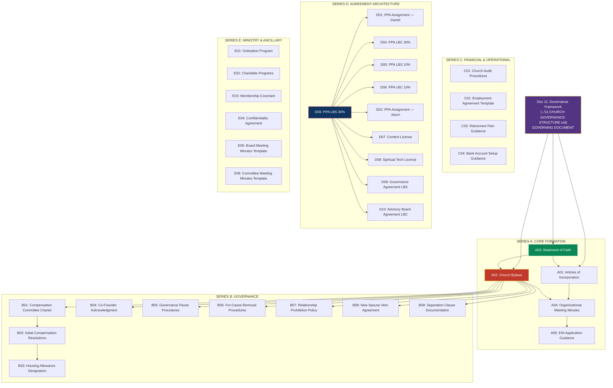

# Church of the Living Light — Document Suite Index

> **Status:** Draft Framework — all documents require counsel review before formation
> **Last Updated:** February 2026
> **Governing Framework:** [11-CHURCH-GOVERNANCE-STRUCTURE.md](../11-CHURCH-GOVERNANCE-STRUCTURE.md)
> **Entity:** Church of the Living Light — IRC 508(c)(1)(A) Automatic Tax-Exempt Church

---

## Purpose

This folder contains the complete formation, governance, financial, agreement, and ministry document suite for the Church of the Living Light. Every document in this suite is derived from the governing framework (Doc 11) and translates its provisions into attorney-ready language, operational procedures, and executable templates.

**Doc 11 remains the governing framework** and is cross-referenced by five or more root-level tax structure documents. This suite operationalizes Doc 11 — it does not replace it.

---

## Dependency Map

---

## Document Status Tracker

### Series A: Core Formation

| Doc ID | Title | Status | Counsel Assignment | Priority |
|--------|-------|--------|-------------------|----------|
| A01 | [Articles of Incorporation](./A01-ARTICLES-OF-INCORPORATION.md) | Draft Framework | Religious nonprofit attorney | Critical |
| A02 | [Church Bylaws](./A02-CHURCH-BYLAWS.md) | Draft Framework | Religious nonprofit attorney | Critical |
| A03 | [Statement of Faith](./A03-STATEMENT-OF-FAITH.md) | Draft Framework | Religious nonprofit attorney + Daniel | Critical |
| A04 | [Organizational Meeting Minutes](./A04-ORGANIZATIONAL-MEETING-MINUTES.md) | Draft Framework | Religious nonprofit attorney | Critical |
| A05 | [EIN Application Guidance](./A05-EIN-APPLICATION-GUIDANCE.md) | Draft Framework | Religious nonprofit attorney or CPA | High |

### Series B: Governance Framework

| Doc ID | Title | Status | Counsel Assignment | Priority |
|--------|-------|--------|-------------------|----------|
| B01 | [Compensation Committee Charter](./B01-COMPENSATION-COMMITTEE-CHARTER.md) | Draft Framework | Religious nonprofit attorney | Critical |
| B02 | [Initial Compensation Resolutions](./B02-INITIAL-COMPENSATION-RESOLUTIONS.md) | Draft Framework | Compensation Committee + attorney | Critical |
| B03 | [Housing Allowance Designation](./B03-HOUSING-ALLOWANCE-DESIGNATION.md) | Draft Framework | Compensation Committee + tax attorney | Critical |
| B04 | [Co-Founder Protections Acknowledgment](./B04-CO-FOUNDER-PROTECTIONS-ACKNOWLEDGMENT.md) | Draft Framework | Religious nonprofit attorney | Critical |
| B05 | [Governance Pause Procedures](./B05-GOVERNANCE-PAUSE-PROCEDURES.md) | Draft Framework | Religious nonprofit attorney | Critical |
| B06 | [For-Cause Removal Procedures](./B06-FOR-CAUSE-REMOVAL-PROCEDURES.md) | Draft Framework | Religious nonprofit attorney | Critical |
| B07 | [Relationship Prohibition Policy](./B07-RELATIONSHIP-PROHIBITION-POLICY.md) | Draft Framework | Religious nonprofit attorney | High |
| B08 | [New Spouse Veto Agreement](./B08-NEW-SPOUSE-VETO-AGREEMENT.md) | Draft Framework | Religious nonprofit attorney | High |
| B09 | [Separation Clause Documentation](./B09-SEPARATION-CLAUSE-DOCUMENTATION.md) | Draft Framework | Religious nonprofit attorney | Critical |

### Series C: Financial & Operational

| Doc ID | Title | Status | Counsel Assignment | Priority |
|--------|-------|--------|-------------------|----------|
| C01 | [Church Audit Procedures](./C01-CHURCH-AUDIT-PROCEDURES.md) | Draft Framework | CPA + religious nonprofit attorney | High |
| C02 | [Employment Agreement Template](./C02-EMPLOYMENT-AGREEMENT-TEMPLATE.md) | Draft Framework | Employment attorney | High |
| C03 | [Retirement Plan Guidance](./C03-RETIREMENT-PLAN-GUIDANCE.md) | Draft Framework | ERISA / church plan attorney | High |
| C04 | [Bank Account Setup Guidance](./C04-BANK-ACCOUNT-SETUP-GUIDANCE.md) | Draft Framework | Treasurer + attorney | High |

### Series D: Agreement Architecture

| Doc ID | Title | Status | Counsel Assignment | Priority |
|--------|-------|--------|-------------------|----------|
| D01 | [PPA Assignment — Daniel to Church](./D01-PPA-ASSIGNMENT-DANIEL-TO-CHURCH.md) | Draft Framework | US international tax attorney | Critical |
| D02 | [PPA Assignment — Jason to Church](./D02-PPA-ASSIGNMENT-JASON-TO-CHURCH.md) | Draft Framework | US international tax attorney | Critical (if Option C/D) |
| D03 | [PPA — LBS 30%](./D03-PPA-LBS-30-PERCENT.md) | Draft Framework | UAE commercial lawyer + US tax attorney | Critical |
| D04 | [PPA — LBC 30%](./D04-PPA-LBC-30-PERCENT.md) | Draft Framework | Cook Islands counsel + US tax attorney | Critical |
| D05 | [PPA — LBS 10%](./D05-PPA-LBS-10-PERCENT.md) | Draft Framework | UAE commercial lawyer + US tax attorney | Critical (if Option C/D) |
| D06 | [PPA — LBC 10%](./D06-PPA-LBC-10-PERCENT.md) | Draft Framework | Cook Islands counsel + US tax attorney | Critical (if Option C/D) |
| D07 | [Content License Agreement](./D07-CONTENT-LICENSE-AGREEMENT.md) | Draft Framework | IP attorney + US tax attorney | High |
| D08 | [Spiritual Tech License Agreement](./D08-SPIRITUAL-TECH-LICENSE-AGREEMENT.md) | Draft Framework | IP attorney + US tax attorney | High |
| D09 | [Governance Agreement — LBS Board](./D09-GOVERNANCE-AGREEMENT-LBS-BOARD.md) | Draft Framework | UAE commercial lawyer | High |
| D10 | [Advisory Board Agreement — LBC](./D10-ADVISORY-BOARD-AGREEMENT-LBC.md) | Draft Framework | Cook Islands counsel | High |

### Series E: Ministry & Ancillary

| Doc ID | Title | Status | Counsel Assignment | Priority |
|--------|-------|--------|-------------------|----------|
| E01 | [Ordination Program Curriculum](./E01-ORDINATION-PROGRAM-CURRICULUM.md) | Draft Framework | Religious nonprofit attorney | High |
| E02 | [Charitable Programs Documentation](./E02-CHARITABLE-PROGRAMS-DOCUMENTATION.md) | Draft Framework | Religious nonprofit attorney | High |
| E03 | [Church Membership Covenant](./E03-CHURCH-MEMBERSHIP-COVENANT.md) | Draft Framework | Religious nonprofit attorney | Medium |
| E04 | [Confidentiality Agreement — Council](./E04-CONFIDENTIALITY-AGREEMENT-COUNCIL.md) | Draft Framework | Religious nonprofit attorney | High |
| E05 | [Board Meeting Minutes Template](./E05-BOARD-MEETING-MINUTES-TEMPLATE.md) | Draft Framework | Secretary (Nancy Courchesne) | High |
| E06 | [Committee Meeting Minutes Template](./E06-COMMITTEE-MEETING-MINUTES-TEMPLATE.md) | Draft Framework | Secretary + Comp Committee Chair | High |

---

## Counsel Assignment Matrix

| Counsel Type | Documents | Engagement Priority |
|-------------|-----------|-------------------|
| **Religious nonprofit attorney** | A01, A02, A03, A04, B01, B04-B09, E01-E04 | Immediate — before formation |
| **US international tax attorney** | D01-D06, D07, D08 | Immediate — with PPA execution |
| **UAE commercial lawyer** | D03, D05, D09 | Before first distribution |
| **Cook Islands counsel** | D04, D06, D10 | Before first distribution |
| **Employment attorney** | C02 | Before first hire |
| **ERISA / church plan attorney** | C03 | Before retirement plan setup |
| **CPA / tax advisor** | A05, C01, C04 | Before first tax year |
| **Transfer pricing consultant** | D07, D08 (royalty rates) | Before license execution |

---

## Cross-References to Parent Documents

| Parent Document | Relationship to This Suite |
|----------------|---------------------------|
| [11-CHURCH-GOVERNANCE-STRUCTURE.md](../11-CHURCH-GOVERNANCE-STRUCTURE.md) | **Governing framework** — all documents derive from this |
| [01-MASTER-STRUCTURE.md](../01-MASTER-STRUCTURE.md) | Entity architecture context — church's place in the 8-entity structure |
| [02-LEGAL-DEFENSE.md](../02-LEGAL-DEFENSE.md) | Legal defense framework (Five Walls) — church as Wall 5 |
| [03-FOUNDER-GUIDE-US.md](../03-FOUNDER-GUIDE-US.md) | Daniel/Jason compensation model — Copeland model detail |
| [10-LB-PROFIT-PARTICIPATION-FRAMEWORK.md](../10-LB-PROFIT-PARTICIPATION-FRAMEWORK.md) | PPA mechanics — basis for D-series documents |

---

## Implementation Phases

| Phase | Documents | Status |
|-------|-----------|--------|
| **1 — Foundation** | 00-INDEX, A03, A01, A02, A05 | Complete |
| **2 — Governance** | B01-B09 | Complete |
| **3 — Agreement Architecture** | D01-D10 | Complete |
| **4 — Financial & Operational** | A04, C01-C04 | Complete |
| **5 — Ministry & Ancillary** | E01-E06 | Complete |

---

*Master index for the Church of the Living Light document suite. All documents are draft frameworks requiring counsel review. Not legal advice.*
