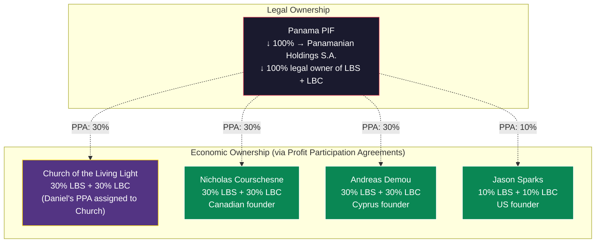
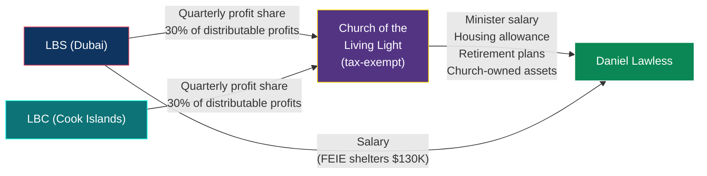
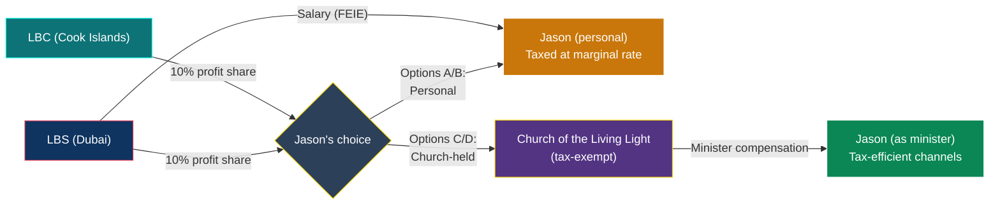
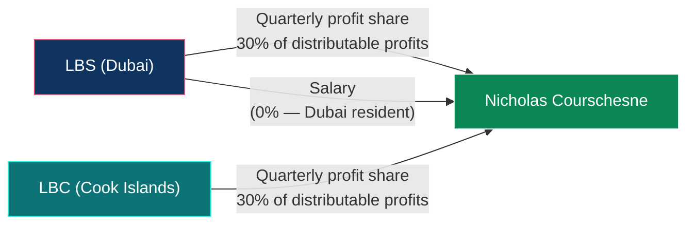
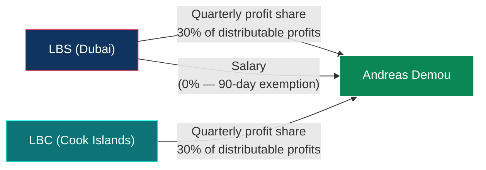
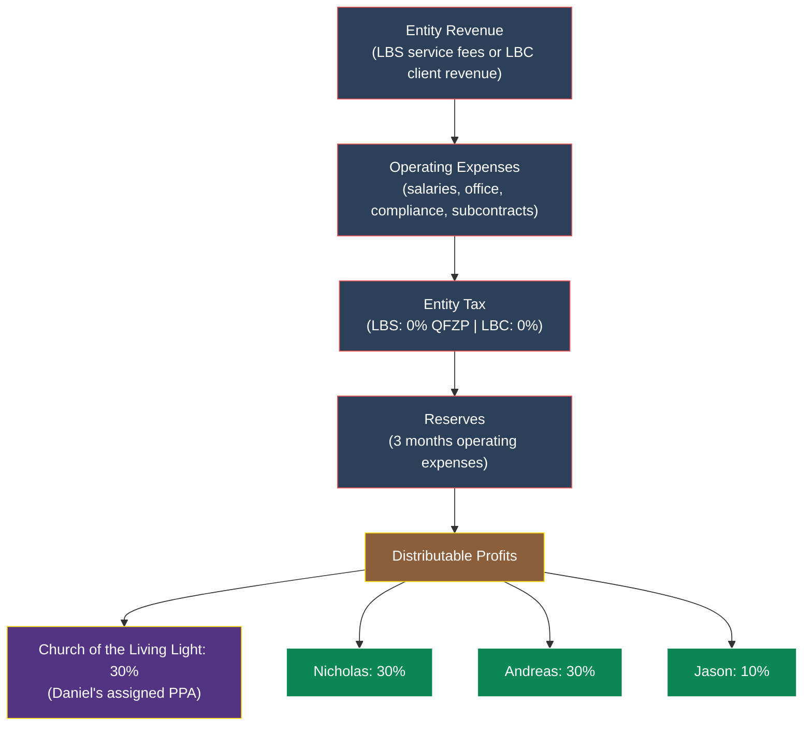

# Light Brands Profit Participation Framework

> **Status:** Draft — requires counsel review before any agreements are executed
> **Last Updated:** February 2026
> **Entities Covered:** Light Brands Studio FZ-LLC (Dubai) + Light Brands Consulting Ltd (Cook Islands IBC)

---

## 1. Summary

This document defines the phantom equity / profit participation structure for the four founders of Light Brands Studio (LBS) and Light Brands Consulting (LBC). The PIF retains ultimate ownership of both entities through Panamanian Holdings S.A. (which holds 100% legal ownership). The founders receive 100% of the economic benefit through contractual Profit Participation Agreements (PPAs) that mirror equity in every way that matters — distributions, exit proceeds, governance, anti-dilution, transfer rights — without triggering CFC/GILTI for the US founders.

---

## 2. The Founders

| Founder | LBS Share | LBC Share | PPA Holder | Jurisdiction | Tax Profile |
|---|---|---|---|---|---|
| **Daniel Lawless** | 30% | 30% | **Church of the Living Light** | US citizen, Dubai resident | PPA assigned to church (tax-exempt). All economics flow through church minister compensation: salary, housing (IRC 107, tax-free), retirement (403b/457b/457f, deferred), church-owned assets. ~2.5% effective. |
| **Nicholas Courschesne** | 30% | 30% | Nicholas (personal) | Canadian, Dubai resident (post-departure) | PIF beneficiary. 0% on distributions. No Canadian tax post-departure. |
| **Andreas Demou** | 30% | 30% | Andreas (personal) | Cyprus deemed domiciled | Salary at 0% (90-day exemption). PIF distributions at ~7.65% (5% SDC + GHS). |
| **Jason Sparks** | 10% | 10% | Jason (personal) OR Church | US citizen, Dubai resident | **Four options:** (A) PPAs personal, ~11.1% effective Y5; (B) PPAs + TE equity, ~12.8%; (C) PPAs to church (Copeland), ~3.3%; (D) TE equity + church PPAs, ~4.8%. See [03-FOUNDER-GUIDE-US.md](./03-FOUNDER-GUIDE-US.md) Part II. |
| **Total** | **100%** | **100%** | | | |

### The Copeland Model (Daniel Lawless)

Daniel's 30% PPA interest in both LBS and LBC is **irrevocably assigned to the Church of the Living Light**. The church — not Daniel — receives quarterly profit distributions. Daniel personally owns minimal assets; the church purchases and owns everything (parsonage, vehicles, technology, travel) and provides for Daniel as its ordained minister through tax-efficient compensation channels.

**Why this works:**
- The church is a 508(c)(1)(A) tax-exempt organization — PPA distributions are received tax-free
- Even if the IRS argued PPAs constitute "ownership" (they don't), the "owner" is a tax-exempt entity — CFC/GILTI has no tax consequence for an exempt entity
- PPA distributions are likely UBIT-exempt as investment/royalty-type income under IRC 512(b)(2) — counsel to confirm
- The church's total revenue (PPA distributions + content royalty from Holdings + spiritual tech royalty from CI IBC) supports board-approved minister compensation
- Kenneth Copeland Ministries has operated this model for 50+ years: church-owned $7M parsonage, private jets, survived Congressional investigation with zero penalties

**Bright lines:**
- PPA assignment must be irrevocable — Daniel cannot retain a right to reclaim the PPA
- Church Spiritual Council (independent board) controls how PPA revenue is used — Daniel does not control the board
- Minister compensation must be board-approved with comparable data (rebuttable presumption under 26 CFR 53.4958-6)
- Church-owned assets must have primary ministry use, documented
- Church must maintain substantial charitable activity proportional to its revenue — it cannot exist solely to benefit the founder

---

## 3. Why Phantom Equity (Not Real Equity)

| | Real Equity | Phantom Equity (PPA) |
|---|---|---|
| **Economic rights** | Pro-rata distributions | Identical — contractual pro-rata distributions |
| **Exit participation** | Pro-rata sale proceeds | Identical — contractual pro-rata of exit value |
| **Governance** | Shareholder voting | Equivalent — board seats + veto rights via governance agreement |
| **Anti-dilution** | Statutory shareholder protections | Contractual anti-dilution provisions |
| **Transfer / sale** | Share transfer | PPA interest transfer (with consent provisions) |
| **US founder CFC/GILTI** | YES — ~10.5-13.125% minimum tax on undistributed earnings | **NO** — taxed only when cash is received |
| **US founder Form 5471** | YES — annual filing, $10K penalty for non-filing | **NO** — no ownership = no reporting |
| **When US founders pay tax** | On entity earnings (whether distributed or not) | **Only when distributions are received** |

**Bottom line:** Phantom equity gives the same economics, same governance, same exit — without the US tax trap. The only difference is the legal form: a contractual right instead of a share certificate.

---

## 4. What the Profit Participation Agreement Covers

Each founder's PPA is a standalone agreement with the PIF and/or Panamanian Holdings S.A. (as legal owner of the entities) and the relevant entity. It must define:

### 4.1 Economic Rights (Mirror Equity)

| Right | Definition |
|---|---|
| **Profit share** | Founder receives X% of distributable profits, paid quarterly |
| **Distribution priority** | Same waterfall as equity: operating expenses → reserves → pro-rata distributions |
| **Exit participation** | On sale of entity or substantially all assets, founder receives X% of net proceeds |
| **Liquidation** | On wind-down, founder receives X% of net assets after creditors |
| **Accumulation account** | Undistributed profits accrue to founder's notional capital account (important for exit valuation) |

### 4.2 Governance Rights (Mirror Shareholder)

| Right | Definition |
|---|---|
| **Board seat** | Each 30% holder gets a board seat on LBS. LBC has nominee director (Cook Islands requirement) but PPA holders have equivalent governance via Advisory Board. |
| **Veto rights** | Major decisions require supermajority (75%) PPA holder approval: sale of entity, new debt >$X, change of business, new PPA issuance, related-party transactions |
| **Information rights** | Monthly financials, quarterly board pack, annual audit, access to books and records |
| **Consent rights** | PIF cannot sell, encumber, or transfer shares of LBS or LBC without PPA holder supermajority consent |

### 4.3 Protective Provisions (Mirror SHA)

| Provision | Definition |
|---|---|
| **Anti-dilution** | PIF cannot issue new PPAs or economic interests without existing holder consent (or pro-rata participation rights) |
| **Tag-along** | If PIF sells its shares, PPA holders can participate on same terms (effectively — PIF must distribute exit proceeds per PPAs before any PIF-level distribution) |
| **Drag-along** | If holders of 75%+ of PPAs approve a sale, all holders must participate |
| **Right of first refusal** | If a PPA holder wants to transfer their interest, other holders get ROFR |
| **Pre-emptive rights** | If new economic interests are created, existing holders can maintain their pro-rata share |
| **Key person provisions** | If a founder departs, vesting schedule determines what percentage of their PPA is retained vs. forfeited |

### 4.4 Vesting

| Parameter | Proposed Terms |
|---|---|
| **Vesting period** | 4 years |
| **Cliff** | 1 year (25% vests at 12 months) |
| **Monthly vesting** | Remaining 75% vests monthly over 36 months |
| **Acceleration** | Single-trigger on change of control (100% vests on entity sale) |
| **Good leaver** | Retains vested portion; unvested forfeited |
| **Bad leaver** | Forfeits all (vested + unvested) — repurchased at lower of cost or FMV |

### 4.5 Valuation

| Scenario | Valuation Method |
|---|---|
| **Annual valuation** | Independent third-party valuation or formula-based (revenue multiple agreed in PPA) |
| **Exit event** | Actual transaction price |
| **Buyback** | Formula-based or most recent independent valuation |
| **Dispute** | Each party appoints a valuator; if >15% apart, third valuator decides |

---

## 5. Tax Treatment by Founder

### Daniel Lawless (US, 30% — Church-Held PPA)

| Income Type | Tax Treatment | Rate |
|---|---|---|
| Studio salary (employment) | FEIE excludes first $130K; excess taxed as ordinary income | 0% on first $130K |
| PPA profit distributions (LBS + LBC) | **Received by church (tax-exempt), not Daniel personally** | **$0 to Daniel** |
| Church minister salary | Taxable ordinary income (SE opt-out via Form 4361) | Federal marginal rate |
| Church housing allowance (IRC 107) | **Tax-free.** No dollar cap. Covers parsonage, utilities, furnishings, maintenance. | **0%** |
| Church retirement (403b/457b/457f) | **Tax-deferred.** 457(f) is unlimited. | **0% (deferred)** |
| Church-owned assets | Parsonage, vehicle, tech, travel — ministry use documented. Not personal income. | **0%** |
| Exit proceeds (entity sale) | Church receives exit proceeds per PPA. Church compensates Daniel through approved channels. | Mixed — see founder guide |

**Critical:** Daniel does NOT own shares or PPAs. The church holds the PPAs. No CFC. No GILTI. No Form 5471. No Subpart F. PPA distributions never appear on Daniel's personal return — they are church revenue. Daniel is taxed only on minister salary and the portion of UAE salary exceeding FEIE.

### Jason Sparks (US, 10% — Options Assessment)

Jason has **four options** depending on his level of church involvement and desire for TE Holdings equity. Full analysis with year-by-year projections, diagrams, and comparison tables is in [03-FOUNDER-GUIDE-US.md Part II](./03-FOUNDER-GUIDE-US.md#part-ii--jason-sparks-us-founder-options-assessment).

**Summary of Options:**

| Option | Description | Y5 Effective Rate | Church Required? | Form 5471? |
|---|---|---|---|---|
| **A** | PPAs personal, no TE equity | ~11.1% | No | No |
| **B** | PPAs personal + ~20% TE equity | ~12.8% | No | Yes |
| **C** | PPAs assigned to church (full Copeland) | ~3.3% | Yes | No |
| **D** | Church PPAs + ~20% TE equity (hybrid) | ~4.8% | Yes | Yes |

**If Jason chooses Options C or D (church route):**
- Same Copeland model as Daniel — PPA irrevocably assigned to the Church of the Living Light
- Church compensates Jason as minister: salary, IRC 107 housing (tax-free), 403(b)/457 retirement (deferred), church-owned assets
- Jason's 10% PPA + Daniel's 30% PPA = church receives **40% of LBS + LBC distributable profits**
- Two ministers strengthen the church's legitimacy
- PPA distributions are UBIT-exempt under IRC 512(b)(2)
- CFC/GILTI eliminated (same analysis as Daniel — church is exempt entity)

**If Jason chooses Options A or B (no church):**
- PPA distributions taxed as ordinary income at federal marginal rate (24-37%)
- Still no CFC/GILTI on PPAs (contractual, not equity)
- Option B adds Form 5471 and PFIC risk for TE Holdings equity

### Nicholas Courschesne (Canadian, 30%)

| Income Type | Tax Treatment | Rate |
|---|---|---|
| Studio salary | 0% — UAE has no personal income tax; no Canadian tax post-departure | **0%** |
| PPA profit distributions (LBS + LBC) | 0% — Dubai resident, not Canadian tax resident, PIF distributions (if routed through PIF) also 0% | **0%** |
| Exit proceeds | 0% — same basis | **0%** |

**Note:** Nicholas is also a PIF beneficiary. His PPA distributions could flow through PIF or directly — counsel to advise on cleanest path. Either way: 0%.

### Andreas Demou (Cyprus, 30%)

| Income Type | Tax Treatment | Rate |
|---|---|---|
| Studio salary | 0% — 90-day overseas employment exemption (must spend 90+ days outside Cyprus working for non-Cyprus employer) | **0%** |
| PPA profit distributions | If classified as dividends/distributions: 5% SDC + 2.65% GHS = ~7.65%. If classified as service income: potentially different treatment — counsel to advise. | **~0-7.65%** |
| Exit proceeds | Capital gains on sale of PPA interest — 0% in Cyprus (no CGT on movable property except Cyprus real estate) | **0%** |

**Key question for counsel:** How Cyprus classifies PPA distributions — as dividend-equivalent (SDC applies) or as contractual service payment (different treatment). This determines whether Andreas pays ~0% or ~7.65% on distributions.

---

## 6. Agreements Checklist

### Tier 1: Core Agreements (Must Have Before Operations)

| # | Agreement | Parties | Purpose | Counsel |
|---|---|---|---|---|
| 1 | **LBS Profit Participation Agreement** | PIF + S.A. + LBS + each founder (4 separate PPAs or 1 master) | Defines each founder's economic rights in LBS: profit share %, distribution waterfall, exit participation, accumulation account | UAE commercial lawyer + US international tax attorney |
| 2 | **LBC Profit Participation Agreement** | PIF + S.A. + LBC + each founder (4 separate PPAs or 1 master) | Same as above for LBC | Cook Islands counsel + US international tax attorney |
| 3 | **LBS Governance Agreement** | PIF + all PPA holders | Board composition, voting rights, veto rights, information rights, consent rights for LBS | UAE commercial lawyer |
| 4 | **LBC Advisory Board Agreement** | PIF + all PPA holders | Equivalent governance for LBC (CI IBC uses nominee director — governance via advisory board) | Cook Islands counsel |
| 5 | **Vesting Schedule** (can be embedded in PPAs or standalone) | PIF + each founder | 4-year vesting, 1-year cliff, acceleration triggers, good/bad leaver provisions | UAE + US counsel |
| 6 | **PIF Private Regulations (Amendment)** | PIF Foundation Council | Amend PIF private regulations to acknowledge PPA obligations and ensure PIF distributes per PPAs, and S.A. corporate resolutions acknowledging PPA obligations | Panama counsel |
| 6b | **S.A. Incorporation Documents** | Panama counsel | Panamanian Holdings S.A. formation as PIF subsidiary. Articles of incorporation, board appointment, registered agent engagement. | Panama counsel |
| 6c | **PPA Assignment Agreement (Daniel → Church)** | Daniel + Church of the Living Light + PIF + S.A. | Irrevocable assignment of Daniel's 30% PPA interest in LBS and LBC to the church. Church becomes the PPA holder. Daniel retains no right to reclaim the PPA or direct distributions. Church Spiritual Council controls all PPA-related decisions. | US religious nonprofit attorney + US international tax attorney |
| 6d | **Church UBIT Analysis Memo** | Church + US tax counsel | Written opinion confirming PPA distributions received by the church are UBIT-exempt (investment income under IRC 512(b)(2), not income from unrelated trade or business) | US tax counsel |

### Tier 2: Protective Agreements (Must Have Before Material Revenue)

| # | Agreement | Parties | Purpose | Counsel |
|---|---|---|---|---|
| 7 | **Anti-Dilution & Pre-Emptive Rights Agreement** | PIF + all PPA holders | Protects founders from dilution; defines mechanics for new PPA issuance | UAE + US counsel |
| 8 | **Transfer Restriction Agreement** | All PPA holders | ROFR, tag-along, drag-along, permitted transfers | UAE + US counsel |
| 9 | **Valuation Methodology Agreement** | All PPA holders | How entities are valued for buybacks, exits, disputes | Independent valuator + counsel |
| 10 | **Key Person / Departure Agreement** | PIF + each founder | What happens if a founder leaves: vesting treatment, non-compete, transition | UAE labor lawyer + US counsel |
| 11 | **IP Assignment Confirmation** | Each founder + LBS | Confirms all IP created by founders in the course of LB work is assigned to appropriate entity (LBS → LBC or LBS → Holdings) | UAE + IP counsel |

### Tier 3: Tax-Specific Documentation (Must Have Before First Distribution)

| # | Agreement / Document | Purpose | Counsel |
|---|---|---|---|
| 12 | **US Tax Opinion Letter** | Written opinion that PPAs do not create "ownership" for CFC/GILTI/Form 5471 purposes | US international tax attorney |
| 13 | **409A Compliance Review** (for US founders) | Confirm PPA distribution timing doesn't trigger Section 409A deferred compensation penalties | US tax counsel |
| 14 | **Cyprus Tax Classification Memo** | Determine how Cyprus treats PPA distributions — dividend-equivalent vs. contractual income | Cyprus tax advisor |
| 15 | **Transfer Pricing Documentation** | If PPA distributions come from intercompany flows (LBS service fees, LBC revenue), TP study must support arm's length pricing | TP advisor |
| 16 | **Canadian Departure Confirmation** | Confirm Nicholas's departure date, NR73 filing, no Canadian tax exposure on PPA distributions | Canadian tax counsel |

### Tier 4: Operational Setup

| # | Action | Detail | Owner |
|---|---|---|---|
| 17 | **Distribution schedule** | Define quarterly distribution dates (e.g., 45 days after quarter-end) | Finance team |
| 18 | **Reserve policy** | Define minimum cash reserve before distributions (e.g., 3 months operating expenses) | Board / Advisory Board |
| 19 | **Distribution waterfall documentation** | Written procedure: revenue in → expenses → reserves → pro-rata PPA distributions | Finance team |
| 20 | **Bank account setup** | Ensure LBS and LBC each have distribution-capable bank accounts | Finance team |
| 21 | **Founder personal tax setup** | Each founder engages personal tax advisor in their jurisdiction to handle PPA income reporting | Each founder |

---

## 7. Distribution Waterfall

How money flows from entity revenue to founder pockets.

**Distribution mechanics:**
1. Entity earns revenue (LBS: dev service fees from Holdings + LB subcontract fees | LBC: external consulting + SaaS)
2. Entity pays operating expenses (salaries, office, compliance, subcontracts to each other)
3. Entity-level tax: $0 (both entities at 0%)
4. Retain agreed reserve amount
5. Remaining = distributable profits → paid to PPA holders pro-rata quarterly
6. Daniel's 30% flows to the Church of the Living Light (church-held PPA); Nicholas, Andreas, and Jason receive their shares directly
7. S.A. and PIF receive $0 economic benefit (S.A. holds legal title; PIF owns S.A. — all economics flow to PPA holders)

---

## 8. Exit Scenarios

| Scenario | How It Works | Tax Impact |
|---|---|---|
| **Sale of LBS** | PIF sells shares → net proceeds distributed to PPA holders per their % | US founders: ordinary income or capital gains (counsel to structure). Nicholas: 0%. Andreas: 0% (Cyprus no CGT on movable property). |
| **Sale of LBC** | PIF sells shares → same | Same as above |
| **Sale of both (package deal)** | Combined proceeds split per PPA % for each entity | Same |
| **Acqui-hire / IP sale** | Entity sells IP or key assets → proceeds treated as distribution | Per PPA waterfall |
| **IPO-equivalent** | PPAs convert to actual equity at IPO (conversion clause in PPA) | US founders would then hold real equity — CFC/GILTI applies post-conversion. Time this carefully. |
| **Founder buyout** | Remaining founders buy departing founder's PPA interest at agreed valuation | ROFR applies. Departing founder taxed on proceeds. |

---

## 9. Open Questions for Counsel

| # | Question | Who Answers | Priority |
|---|---|---|---|
| 1 | Do PPAs avoid CFC/GILTI classification under current IRS guidance? Need written opinion. | US international tax attorney | **Critical — must resolve before any PPA is signed** |
| 2 | Does Section 409A apply to PPA quarterly distributions? If so, how to structure elections? | US tax counsel | Critical |
| 3 | Can PPA distributions be structured as return on capital (capital gains) rather than ordinary income for US founders? | US tax counsel | High |
| 4 | How does Cyprus classify PPA distributions — dividend-equivalent or contractual income? | Cyprus tax advisor | High |
| 5 | Does the PIF need to formally "declare" distributions, or can PPAs create a direct obligation from entity to founder? | Panama counsel | High |
| 6 | Can LBS (Dubai FZ-LLC) legally enter into PPAs under UAE free zone regulations? Any regulatory approval needed? | UAE commercial lawyer | High |
| 7 | Can LBC (Cook Islands IBC) enter into PPAs? Any restrictions under CI IBC Act? | Cook Islands counsel | High |
| 8 | Should PPAs be governed by UAE law (LBS), Cook Islands law (LBC), or a neutral jurisdiction (e.g., English law)? | All counsel | Medium |
| 9 | If a PPA holder becomes a tax resident of a new country, does the PPA need to be restructured? | International tax advisor | Medium |
| 10 | Insurance: should the entities carry key-person insurance on the four founders? | Insurance broker | Medium |
| 11 | Should PPAs be with the PIF (ultimate owner) or the S.A. (direct legal owner of LBS and LBC)? If with S.A., does the PIF still need to be a party? | Panama counsel + UAE/CI counsel | High |
| 12 | Does irrevocable assignment of Daniel's PPA to the church create any adverse tax consequences at the moment of assignment (gift tax, deemed sale, constructive receipt)? | US international tax attorney | **Critical** |
| 13 | Are PPA distributions received by a 508(c)(1)(A) church UBIT-exempt under IRC 512(b)(2)? If not, what classification applies? | US tax counsel | **Critical** |
| 14 | Can the church hold PPA interests in foreign entities without creating CFC/GILTI exposure? (Church is tax-exempt — even if PPAs were treated as "ownership," there should be no tax consequence for an exempt entity.) | US international tax attorney | **Critical** |
| 15 | What is the maximum defensible total minister compensation package (salary + housing + retirement + church-owned assets) relative to church revenue? Is there a safe harbor ratio? | US religious nonprofit attorney | High |
| 16 | If the church receives PPA exit proceeds on an entity sale, can exit proceeds be distributed to Daniel through church compensation channels (retirement plans, housing allowance)? Or must they be retained as church assets? | US religious nonprofit attorney | High |

---

## 10. Implementation Checklist

### Phase 1: Legal Foundation (Weeks 1-4)

- [ ] Engage US international tax attorney — confirm PPAs avoid CFC/GILTI (Question 1)
- [ ] Engage UAE commercial lawyer — confirm LBS can issue PPAs (Question 6)
- [ ] Engage Cook Islands counsel — confirm LBC can issue PPAs (Question 7)
- [ ] Obtain US tax opinion letter on PPA classification
- [ ] Resolve 409A compliance questions for Daniel and Jason
- [ ] Resolve Cyprus classification question for Andreas

### Phase 2: Agreement Drafting (Weeks 3-8)

- [ ] Draft master PPA template (can be adapted per entity + founder)
- [ ] Draft LBS Governance Agreement (board composition, veto rights)
- [ ] Draft LBC Advisory Board Agreement
- [ ] Draft Vesting Schedule terms
- [ ] Draft Transfer Restriction Agreement (ROFR, tag/drag-along)
- [ ] Draft Valuation Methodology Agreement
- [ ] Amend PIF Private Regulations to acknowledge PPA obligations

### Phase 3: Execution (Weeks 6-10)

- [ ] All four founders review and negotiate PPAs
- [ ] Execute LBS PPAs (4 agreements — Daniel, Nicholas, Andreas, Jason)
- [ ] Execute LBC PPAs (4 agreements)
- [ ] Execute Governance Agreement (LBS)
- [ ] Execute Advisory Board Agreement (LBC)
- [ ] Execute Transfer Restriction Agreement
- [ ] PIF Foundation Council formally acknowledges PPA obligations

### Phase 4: Operational Setup (Weeks 8-12)

- [ ] Set up quarterly distribution calendar
- [ ] Define reserve policy (board approval)
- [ ] Document distribution waterfall procedure
- [ ] Each founder engages personal tax advisor
- [ ] Set up tracking for accumulation accounts (notional capital accounts)
- [ ] First distribution test run (even if nominal amount)

---

## 11. Cost Estimate

| Item | Estimated Cost |
|---|---|
| US tax opinion letter (CFC/GILTI avoidance) | $15,000-30,000 |
| UAE commercial lawyer (PPA drafting + governance) | $10,000-20,000 |
| Cook Islands counsel (PPA + LBC compliance) | $5,000-10,000 |
| Panama counsel (PIF regulation amendments) | $2,000-5,000 |
| Cyprus tax classification memo | $3,000-7,000 |
| Canadian departure confirmation (Nicholas) | $3,000-5,000 |
| 409A compliance review (Daniel + Jason) | $5,000-10,000 |
| Valuation methodology setup | $5,000-10,000 |
| Panama counsel (S.A. formation + PPA alignment) | $2,000-5,000 |
| **Total estimated legal cost** | **$50,000-102,000** |

---

## Cross-References

- **Master structure:** [01-MASTER-STRUCTURE.md](./01-MASTER-STRUCTURE.md)
- **Ecosystem architecture:** [07-ECOSYSTEM-ARCHITECTURE.md](./07-ECOSYSTEM-ARCHITECTURE.md)
- **US founder playbook — Daniel (Copeland model) + Jason (options assessment):** [03-FOUNDER-GUIDE-US.md](./03-FOUNDER-GUIDE-US.md)
- **Canadian founder playbook (Nicholas):** [04-FOUNDER-GUIDE-CANADA.md](./04-FOUNDER-GUIDE-CANADA.md)
- **Cyprus founder playbook (Andreas):** [05-FOUNDER-GUIDE-CYPRUS.md](./05-FOUNDER-GUIDE-CYPRUS.md)
- **Cook Islands IBC detail:** [08-COOK-ISLANDS-IBC-DETAIL.md](./08-COOK-ISLANDS-IBC-DETAIL.md)
- **Questions for counsel:** [06-COUNSEL-QUESTIONS.md](./06-COUNSEL-QUESTIONS.md)
- **Church governance & bylaws:** [11-CHURCH-GOVERNANCE-STRUCTURE.md](./11-CHURCH-GOVERNANCE-STRUCTURE.md)

---

*This document outlines a proposed Profit Participation Agreement framework. PPAs are contractual arrangements — not equity. The legal distinction is critical for US tax purposes. Nothing in this document should be executed without written confirmation from qualified US international tax counsel that the proposed structure achieves CFC/GILTI avoidance. The structure must be validated in all relevant jurisdictions (US, UAE, Cook Islands, Panama, Cyprus, Canada) before implementation.*
