# Dan's US Departure + Simplified Light Brands Structure

> **Status:** Strategic planning document — requires international tax counsel validation
> **Last Updated:** February 15, 2026
> **Scope:** Daniel Lawless exits US citizenship. Wife remains US citizen. Light Brands restructured as a four-entity structure: PIF → Panama Holdings → LBC (Cook Islands IBC) / LBS (Cyprus Studio).

---

## Table of Contents

**Part I — Leaving the US**
1. [Current Situation](#1-current-situation)
2. [Covered Expatriate Avoidance — The Window](#2-covered-expatriate-avoidance)
3. [Renunciation Timeline](#3-renunciation-timeline)
4. [Wife Stays: Her Obligations and Income](#4-wife-stays)
5. [The Marriage as Safety Net](#5-marriage-safety-net)
6. [Gifts and Transfers Post-Renunciation](#6-gifts-and-transfers)
7. [Divorce Protections](#7-divorce-protections)

**Part II — Simplified Light Brands Structure**
8. [Why the Current Structure Is Over-Engineered](#8-why-simplify)
9. [The New Architecture](#9-new-architecture)
10. [Remote Team Management](#10-remote-team)
11. [Banking and Payments](#11-banking)
12. [IP Ownership](#12-ip-ownership)
13. [How Dan Gets Paid](#13-dan-compensation)
14. [How Wife Gets Paid](#14-wife-compensation)
15. [Equity Structure](#15-equity-structure)
16. [Tax Summary — The Complete Picture](#16-tax-summary)
17. [Formation Roadmap](#17-formation-roadmap)
18. [Open Questions for Counsel](#18-open-questions)

---

# PART I — LEAVING THE US

## 1. Current Situation

| Factor | Detail |
|--------|--------|
| **Dan** | US citizen, planning to renounce |
| **Wife** | US citizen, planning to remain US citizen |
| **Net worth** | Under $2M (critical — see Section 2) |
| **Average annual tax (last 5 years)** | Under $190K (critical — see Section 2) |
| **Residence** | Currently abroad / planning abroad |
| **Income sources** | Light Brands entities — LBC (Cook Islands IBC, consulting) + LBS (Cyprus Studio, development) |
| **Church plans** | Will establish internationally, NOT as US 508(c)(1)(a) |
| **Team** | 100% remote, developers worldwide |

---

## 2. Covered Expatriate Avoidance — The Window {#2-covered-expatriate-avoidance}

This is the single most time-sensitive decision. You must renounce **before** your net worth crosses $2M.

### Covered Expatriate Decision Tree

### What Triggers "Covered Expatriate" Status

You become a covered expatriate if **any one** of these is true on the date of renunciation:

| Test | Threshold | Your Status |
|------|-----------|-------------|
| Net worth | > $2,000,000 | **Under — ACT NOW** |
| Average annual income tax (5 years) | > $190,000 (2026 inflation-adjusted) | **Under** |
| Failed to certify 5-year tax compliance | Failed to file all returns | **Must be compliant** |

### Why Covered Expatriate Status Is Catastrophic

If you are classified as a covered expatriate:

1. **Exit tax (mark-to-market):** IRS treats you as selling all worldwide assets the day before renunciation. Capital gains tax on unrealized gains (minus $866K exclusion).

2. **Permanent transfer tax on gifts to US persons:** Any gift or bequest FROM you TO any US citizen or resident (including your wife, children, future children) faces a **~40% transfer tax** on amounts exceeding $18K/year. **This never expires. Even if you regain citizenship.**

3. **Retirement account withholding:** 30% withholding on distributions from US retirement accounts.

### Why Avoiding It Matters for Your Wife

If you are NOT a covered expatriate:
- You can gift unlimited amounts to your wife with **zero tax consequences**
- You can fund her lifestyle, buy property together, transfer assets freely
- She reports gifts from a foreign person over $100K on Form 3520 (informational, not a tax)

If you ARE a covered expatriate:
- Every gift over $18K/year faces ~40% transfer tax
- A $100K gift costs ~$33K in tax
- This applies for **the rest of your life**

### The Action

| Step | Detail | Timeline |
|------|--------|----------|
| Confirm net worth is under $2M | Include all worldwide assets: real estate, investments, business interests, crypto, retirement accounts | **This week** |
| Confirm 5-year tax compliance | All returns filed for 2021-2025. No late penalties or unfiled returns | **This week** |
| Engage US expat tax attorney | Model the exact numbers. Confirm no hidden assets that inflate net worth | **Week 1** |
| Obtain second citizenship FIRST | Grenada ($235-265K, 4-6 months) — cannot be stateless | **Months 1-6** |
| Renounce BEFORE net worth crosses $2M | If LB entities appreciate rapidly, the window closes | **Within 12 months** |

**The math is simple:** If your 30% equity interest in Light Brands becomes worth $2M+ at the time of renunciation, you're a covered expatriate. If LB is still pre-revenue or early revenue, the fair market value of your shares is minimal. **Every month of revenue growth narrows the window.**

---

## 3. Renunciation Timeline {#3-renunciation-timeline}

### Prerequisites (All Must Be Complete)

- [ ] Second citizenship in hand (Grenada passport)
- [ ] 5 years of US tax returns filed and current
- [ ] Net worth confirmed under $2M
- [ ] Average annual tax confirmed under $190K
- [ ] Wife understands and agrees to the plan
- [ ] Expat tax attorney engaged and has signed off

### The Process

```mermaid
graph TD
    M0["MONTH 0<br/>Begin Grenada CBI ($235-265K)<br/>Paraguay residency ($8K)<br/>Engage expat tax attorney"]

    M1_6["MONTHS 1-6<br/>Grenada processing<br/>Continue LB operations<br/>Prepare documents"]

    M6_7["MONTH 6-7<br/>Receive Grenada passport<br/>🎯 SECOND CITIZENSHIP"]

    M7_8["MONTH 7-8<br/>Schedule embassy appointment"]

    M8_9["MONTH 8-9<br/>Attend appointment, take oath<br/>Pay $2,350, surrender passport"]

    M9_15["MONTH 9-15<br/>File final return + Form 8854<br/>Exit tax: $0 if under $2M<br/>Receive CLN"]

    DONE["YOU ARE NO LONGER A US CITIZEN<br/>$0 US tax obligations going forward"]

    M0 --> M1_6
    M1_6 --> M6_7
    M6_7 --> M7_8
    M7_8 --> M8_9
    M8_9 --> M9_15
    M9_15 --> DONE

    style M0 fill:#c9770a,stroke:#fff,color:#fff
    style M1_6 fill:#c9770a,stroke:#fff,color:#fff
    style M6_7 fill:#2d4059,stroke:#ea5455,color:#fff
    style M7_8 fill:#c9770a,stroke:#fff,color:#fff
    style M8_9 fill:#8b0000,stroke:#ff6347,color:#fff
    style M9_15 fill:#c9770a,stroke:#fff,color:#fff
    style DONE fill:#006400,stroke:#90ee90,color:#fff
```

### After Renunciation

| Obligation | Status |
|------------|--------|
| Future US tax returns | **None** |
| FBAR | **None** |
| FATCA | **None** |
| Form 5471 | **None** |
| Worldwide income reporting | **None** |
| US tax on foreign income | **$0** |
| US tax on business income | **$0** |

Your only US tax obligation going forward: 30% withholding on US-source income (dividends from US companies, rental income from US property, etc.). If you have no US-source income, you owe nothing.

---

## 4. Wife Stays: Her Obligations and Income {#4-wife-stays}

Your wife remains a US citizen. The US taxes her worldwide income. Here's how to minimize it.

### Her Tax Obligations (Ongoing, Every Year)

| Filing | Required? | Detail |
|--------|-----------|--------|
| Form 1040 | Yes | Annual US tax return |
| Form 2555 | Yes | FEIE claim ($130K exclusion on earned income) |
| FBAR (FinCEN 114) | Yes | Report foreign accounts > $10K aggregate |
| Form 8938 | Yes | Report foreign financial assets > $200K (overseas filer) |
| Form 3520 | If applicable | Report gifts from foreign persons (you) > $100K |
| Form 5471 | **Only if she owns 10%+ of a foreign corp** | See Section 14 |
| State tax return | Depends | If she maintains ties to a US state |

### FEIE Strategy (Foreign Earned Income Exclusion)

The FEIE excludes the first **$130,000** (2026) of earned income from federal tax if she:

1. Has a **tax home** in a foreign country (lives abroad), AND
2. Meets **either:**
   - **330-day test:** Present in a foreign country 330+ days in a 12-month period (can't spend more than 35 days in the US), OR
   - **Bona fide residence test:** Established genuine residence in a foreign country for a full calendar year

**Critical:** If she visits the US more than 35 days/year, the 330-day test fails. She'd need to qualify under the bona fide residence test instead (which is a facts-and-circumstances determination — more ambiguous).

### Her Income — Optimized

| Scenario | Salary | FEIE Exclusion | Taxable | Federal Tax | Effective Rate |
|----------|--------|---------------|---------|-------------|----------------|
| **Conservative** | $130,000 | $130,000 | $0 | **$0** | **0%** |
| **Moderate** | $175,000 | $130,000 | $45,000 | ~$5,600 | **3.2%** |
| **Aggressive** | $250,000 | $130,000 | $120,000 | ~$21,400 | **8.6%** |

**Recommendation:** Set her salary at or near $130K to achieve **zero federal income tax**. Fund the household from your 0%-taxed income instead.

### Foreign Tax Credit Alternative

If she lives in a country with income tax (not Costa Rica/Panama), she can potentially use Foreign Tax Credits instead of FEIE. However, since the recommended residence countries (Costa Rica, Panama) have territorial tax systems that don't tax foreign income, FEIE is the better option.

---

## 5. The Marriage as Safety Net {#5-marriage-safety-net}

### Why She Should Stay a US Citizen

Her US citizenship is your permanent, unconditional door back to the US:

| Benefit | Detail |
|---------|--------|
| **Spousal petition (I-130)** | She can petition for you as an "immediate relative" — no visa caps, no backlog, fastest family-based pathway |
| **Timeline to green card** | 12-18 months from filing |
| **Timeline to citizenship** | ~4.5-5.5 years from filing (3 years residency + naturalization) |
| **Cost** | ~$5,700-$11,700 total |
| **Available when?** | Anytime — 1 year from now, 10 years from now, or never |

### Why Staying Married Is Superior to Divorce/Remarry

| Factor | Stay Married | Divorce + Remarry |
|--------|-------------|-------------------|
| Immigration fraud risk | None | High — USCIS trained to spot pattern |
| Spousal petition available | Yes, anytime | Only after remarriage |
| USCIS scrutiny | Standard | Elevated |
| Criminal exposure | None | Potential federal charges |
| Timeline to green card | 12-18 months | 12-18 months AFTER remarriage + delays |
| Cost | ~$5-10K | $20-50K+ |

---

## 6. Gifts and Transfers Post-Renunciation {#6-gifts-and-transfers}

### If You Avoid Covered Expatriate Status (Net Worth < $2M)

| Transfer Type | Tax to You | Tax to Her | Reporting |
|---------------|-----------|------------|-----------|
| Cash gift to wife (any amount) | $0 | $0 (gifts are not income) | She files Form 3520 if > $100K from foreign person |
| Pay shared living expenses | $0 | $0 | None |
| Buy property together | $0 | $0 | Standard property reporting |
| Fund joint lifestyle | $0 | $0 | None |

**No limits. No transfer tax. Complete freedom.**

### If You Become a Covered Expatriate (Net Worth > $2M)

| Transfer Type | Tax | Impact |
|---------------|-----|--------|
| Gift to wife > $18K/year | ~40% transfer tax | $100K gift costs ~$33K in tax |
| Bequest (at death) | ~40% estate tax | Applies to entire estate left to US persons |
| Duration | **Permanent** | Never expires, even if you regain citizenship |

**This is why Section 2 is the most important section in this document.**

---

## 7. Divorce Protections {#7-divorce-protections}

### What's Divisible in Divorce (Per Marriage Agreement)

| Asset | Owner | Divisible? | Notes |
|-------|-------|-----------|-------|
| Joint personal property | Both | Yes | Standard marital property |
| Joint bank accounts | Both | Yes | Standard |
| Her salary/income | Her | N/A | Hers regardless |
| Your 30% equity in S.A. | Held by PIF | **Protected** | Three layers of separation — shares are not personally held |
| Panama PIF assets | PIF (independent legal person) | **Protected** | PIF is not your property. Panama does not recognize foreign judgments against PIFs |
| Panamanian Holdings S.A. shares | PIF owns Dan's 30% of S.A. | **Protected** | PIF layer protects |
| CI IBC (LBC) assets/revenue | 100% owned by S.A. | **Protected** | S.A. is protected by PIF chain |
| Cyprus Studio (LBS) assets/revenue | 100% owned by S.A. | **Protected** | Same — both operating entities wholly owned by S.A. |

### Asset Protection Layers (Visual)

### Key Protection: The PIF

The Panama PIF is an independent legal person under Law 25 of 1995. It has no "owner." Assets transferred to the PIF are legally separate from your personal estate. Panama:

- Does **not** recognize foreign divorce judgments against PIFs
- Requires creditors (including divorce claimants) to litigate in Panama under Panamanian law
- Protects beneficiary identities (private regulations)

**Your equity is protected by design.** Your 30% of the S.A. is held by the PIF. You don't personally hold any shares — the PIF holds them. The S.A. in turn owns 100% of both operating entities (LBC + LBS). This means your equity interest is not a personal asset subject to division. The PIF is an independent legal person under Panamanian law.

### Her Independent Income Stream

She has a contractor agreement with the CI IBC (LBC). This gives her income that is **independent of the marriage.** This protects her and gives her security regardless of the marriage status.

---

---

# PART II — SIMPLIFIED LIGHT BRANDS STRUCTURE

## 8. Why the Current Structure Is Over-Engineered {#8-why-simplify}

The current Light Brands architecture was designed around specific constraints that **no longer apply** once you renounce US citizenship:

| Current Constraint | Why It Existed | Status Post-Renunciation |
|-------------------|---------------|--------------------------|
| FEIE requirement (330 days abroad) | Shelter $130K of UAE salary from US tax | **Irrelevant** — you're not a US person |
| Dubai Golden Visa | Needed for FEIE bona fide residence | **Unnecessary for tax** — get residency wherever you want |
| Dubai Studio FZ-LLC (QFZP) | Employs team for substance + 0% QFZP tax | **Replaced by Cyprus Studio** — real substance with a Cyprus citizen director, real office, real employees. 15% tax on cost-plus margin only (~0.4% effective). |
| Shared service center model (Studio builds for both TE + LB) | DEMPE substance for TE Holdings IP + QFZP qualification | **LB doesn't need TE's structure** — Cyprus Studio provides LB's own substance layer independently |
| CFC/GILTI avoidance | US founder can't own foreign corporations | **Irrelevant** — you're not a US person |
| Form 5471 avoidance | $10K penalty for non-filing of foreign corp ownership | **Irrelevant** — no US filing obligations |
| Church-held equity | Sheltered income from US tax | **Irrelevant** — your income isn't US-taxable |

**Every piece of complexity in the current LB structure exists to navigate the US tax code.** Remove the US citizen, remove the complexity.

### What Dubai Costs vs. What It Provides (For LB Only)

| Dubai Studio (Current) | Cost/Effort |
|------------------------|-------------|
| DIC trade license | ~$11-16K setup + ~$8-12K/yr renewal |
| Office space (mandatory for FZ-LLC) | ~$12-24K/yr |
| Employment visas for team | ~$3-5K per person |
| QFZP annual audit | ~$5-10K/yr |
| QFZP compliance filing | ~$3-5K/yr |
| Annual bookkeeping | ~$5-10K/yr |
| **Total Dubai overhead** | **~$35-65K/yr + ~$15K setup** |

**Dubai is replaced by Cyprus Studio** — real substance (Cyprus citizen director, real office, real employees) at ~$30K/yr overhead plus ~0.4% effective tax rate. Better substance, lower cost, no QFZP compliance.

---

## 9. The New Architecture {#9-new-architecture}

### The Definitive Stack: PIF → Panama Holdings → LBC CI / LBS CY

### Four Entities. Clean Split.

| Entity | Jurisdiction | Tax | Purpose | Annual Cost |
|--------|-------------|-----|---------|-------------|
| **Fundación Light Brands (PIF)** | Panama | 0% | Ownership, asset protection, beneficiary distributions | ~$2-4K/yr |
| **Light Brands Holdings S.A.** | Panama | 0% (territorial) | Central holding company. All founders are shareholders. Owns 100% of LBC + LBS. | ~$2-4K/yr |
| **LBC — Light Brands AI Ltd** | Cook Islands | 0% (unconditional) | Client-facing: revenue, IP, client contracts, invoicing | ~$3-5K/yr |
| **LBS — Light Brands Studio Ltd** | Cyprus | 15% (on margin only) | Development delivery: office, employees, builds everything | ~$20-30K/yr |
| **Total** | | | | **~$27-43K/yr** |

**Compare to current structure:** PIF + S.A. + Dubai Studio + CI IBC = ~$45-80K/yr in entity maintenance alone.

**Savings: ~$18-37K/yr in overhead** — plus ironclad substance that Dubai Studio provided but at lower cost.

### Why Two Operating Entities (CI IBC + Cyprus Studio)

The CI IBC is a **principal entity** — it owns clients, IP, and risk. But a principal with zero employees, zero office, and zero substance faces real-world challenges: banking friction, PE claims from client countries, and enterprise client hesitancy.

The Cyprus Studio solves this. It's a **genuine development shop** with:
- A **Cyprus citizen director** (Andreas Demou) living and working in Cyprus
- A **real office** in Limassol or Nicosia
- **Real employees** on Cyprus payroll with social insurance
- A real development operation delivering real work

The CI IBC contracts all development to the Cyprus Studio under a **Master Development Services Agreement (MDSA)** at cost-plus 8-12%. The Studio pays 15% Cyprus tax on that margin only — resulting in an **effective tax rate of ~0.4% on total group revenue** at $3M.

This is the OECD-standard **principal/routine service provider** model. The most commonly used and most thoroughly documented transfer pricing arrangement in international business. See [16-CYPRUS-STUDIO-SUBSTANCE-LAYER.md](./16-CYPRUS-STUDIO-SUBSTANCE-LAYER.md) for complete detail.

---

## 10. Remote Team Management {#10-remote-team}

### Dual-Entity Team Model

The team is split across two entities by design:

| Entity | Team | Relationship | Why |
|--------|------|-------------|-----|
| **Cyprus Studio (LBS)** | Cyprus-based developers, Andreas | **Employees** on Cyprus payroll | Real employment = real substance. This is the whole point of the Cyprus entity. |
| **CI IBC (LBC)** | Dan, Wife, remote contractors worldwide | **Contractors** | No connection to Cyprus. Paid directly by CI IBC. |

### CI IBC Contractors

| Method | Best For | How It Works |
|--------|----------|-------------|
| **Direct contractor agreements** | Senior developers, specialists, long-term team | CI IBC signs contractor agreement directly. Contractor invoices monthly. CI IBC pays via bank transfer or Wise |
| **Deel / Remote (EOR)** | Team members in countries with strict labor laws (EU, Brazil, etc.) | Deel legally employs the person in their country. CI IBC pays Deel. Deel handles payroll, benefits, taxes, compliance. ~$500-700/month per person |
| **Deel / Remote (Contractor)** | Contractors who want simple payment processing | Deel manages contracts and payments. ~$49/month per person |

### Cyprus Studio Employees

Developers in Cyprus are **real employees** of Light Brands Studio Ltd with:
- Cyprus employment contracts
- Social insurance contributions (employer ~12%, employee ~8.3%)
- Payroll processed through Cyprus banking
- EU employment law protections

This is the substance that protects the entire structure. The Cyprus Studio has a real office, real employees, and a real director (Andreas Demou, Cyprus citizen) making real decisions on the ground.

### Permanent Establishment Risk — Mitigated by Cyprus

The main PE risk with remote contractors is largely **eliminated** by the Cyprus Studio:

| Strategy | Detail |
|----------|--------|
| **Cyprus Studio absorbs development substance** | All "real work" happens in Cyprus — client countries cannot argue it happened in their country |
| Use EOR (Deel/Remote) for high-risk countries | EOR is the legal employer — the CI IBC has no PE |
| Ensure contractors are genuinely independent | Multiple clients, own equipment, flexible schedule |
| CI IBC has no employees or office | It's a principal entity that contracts work to Cyprus |
| Board decisions via nominee director in Cook Islands | Governance not in any contractor's country |

### Recommended Team Structure

---

## 11. Banking and Payments {#11-banking}

### Account Structure

| Account | Bank | Purpose |
|---------|------|---------|
| **CI IBC (LBC) primary** | DBS / OCBC / Statrys (Singapore) | Client revenue collection, contractor payments |
| **Cyprus Studio (LBS)** | Bank of Cyprus / Hellenic Bank | Payroll, office costs, local operations. SEPA access. |
| **S.A. operational** | Banco General / Banistmo (Panama) | Receive dividends, operational flexibility |
| **PIF account** | Singapore or Panama | Distributions to beneficiaries |

### Payment Processing

| Method | Use Case |
|--------|----------|
| **Stripe** (connected to Singapore bank) | SaaS subscriptions, recurring billing, online sales |
| **Wise Business** | International contractor payments (best FX rates), multi-currency receiving |
| **Direct bank transfer** | Large consulting engagements, enterprise clients |
| **Deel** | Contractor and EOR payments (handles FX, compliance, tax docs) |

### Revenue Flow

```mermaid
graph TB
    CLIENT["CLIENT<br/>Pays invoice"]

    subgraph "0% Tax Layer"
        LBC_BANK["LBC — Light Brands AI Ltd<br/>(CI IBC) — Singapore bank<br/>0% tax<br/>Receives ALL client revenue"]
    end

    subgraph "Substance Layer (Cyprus)"
        LBS_BANK["LBS — Light Brands Studio<br/>(Cyprus) — Cyprus bank<br/>15% tax on margin only"]
        LBS_PAY["Cyprus payroll + office costs"]
        LBS_TAX["Cyprus tax: ~$12K on $3M rev"]
    end

    subgraph "Operating Expenses"
        DAN_FEE["Dan — director/contractor fee"]
        WIFE_FEE["Wife — contractor ($130K, FEIE)"]
        CONTRACTORS["Other contractors<br/>(via Wise or Deel)"]
        SAAS["SaaS/infra costs"]
    end

    subgraph "Distribution Chain"
        SA_DIST["S.A. receives 100%<br/>(sole shareholder, 0% WHT)"]
        DAN_DIST["Dan's 30% → PIF → Dan<br/>0% tax (territorial country)"]
        NICH_DIST["Nicholas 30% → direct<br/>(per residence)"]
        ANDREAS_DIST["Andreas 30% → direct<br/>(~7.65% Cyprus SDC+GESY)"]
        JASON_DIST["Jason 10% → direct<br/>(US tax)"]
    end

    CLIENT -->|"$$$"| LBC_BANK
    LBC_BANK -->|"Cost-plus 10%<br/>monthly"| LBS_BANK
    LBS_BANK --> LBS_PAY
    LBS_BANK --> LBS_TAX

    LBC_BANK --> DAN_FEE
    LBC_BANK --> WIFE_FEE
    LBC_BANK --> CONTRACTORS
    LBC_BANK --> SAAS

    LBC_BANK -->|"Retained profit →<br/>quarterly dividends"| SA_DIST

    SA_DIST --> DAN_DIST
    SA_DIST --> NICH_DIST
    SA_DIST --> ANDREAS_DIST
    SA_DIST --> JASON_DIST

    style CLIENT fill:#2d4059,stroke:#ea5455,color:#fff
    style LBC_BANK fill:#8b5e3c,stroke:#ffd700,color:#fff
    style LBS_BANK fill:#16213e,stroke:#0f3460,color:#fff
    style LBS_PAY fill:#16213e,stroke:#0f3460,color:#fff
    style LBS_TAX fill:#8b0000,stroke:#ff6347,color:#fff
    style SA_DIST fill:#2d2d44,stroke:#9370db,color:#fff
    style DAN_DIST fill:#006400,stroke:#90ee90,color:#fff
    style NICH_DIST fill:#006400,stroke:#90ee90,color:#fff
    style ANDREAS_DIST fill:#006400,stroke:#90ee90,color:#fff
    style JASON_DIST fill:#8b0000,stroke:#ff6347,color:#fff
```

**Total entity-level tax on $3M revenue: ~$12,000 (0.4%)**

---

## 12. IP Ownership {#12-ip-ownership}

### How IP Gets Created and Owned

**Two IP creation paths, one owner:**

| Source | IP Created | Mechanism | Owner |
|--------|-----------|-----------|-------|
| Cyprus Studio employees | Software, platforms, AI models | Work-for-hire under MDSA | **CI IBC** |
| CI IBC contractors | Methodology, strategy, tools | Contractor IP assignment clause | **CI IBC** |

**Key contract clauses:**

1. **MDSA (Cyprus Studio):** All deliverables and IP created by Studio automatically assigned to CI IBC upon creation
2. **Contractor agreements:** Work-for-hire / IP assignment — all work product belongs to LBC
3. **Pre-existing IP exclusion:** Contractors/Studio retain their own pre-existing tools (specifically enumerated)

**No separate IP entity needed.** The CI IBC owns all IP directly. The Cyprus Studio develops under contract — it never owns the IP it creates. This is standard for captive development centers worldwide.

---

## 13. How Dan Gets Paid {#13-dan-compensation}

Post-renunciation, Dan has three channels, all at 0%:

### Channel 1: Contractor/Director Fee from CI IBC (LBC)

| Detail | Value |
|--------|-------|
| What | Monthly fee for services as director / lead consultant |
| Amount | Flexible — set at whatever is needed |
| Tax to Dan | **$0** — foreign income in a territorial tax country |
| Reporting | None (not a US person) |

### Channel 2: Equity Dividends (30% of LB Profits)

| Detail | Value |
|--------|-------|
| What | 30% of Light Brands distributable profits, paid quarterly as dividends |
| Flow | CI IBC → S.A. (100%) → Dan's 30% of S.A. → PIF → Dan |
| Tax to Dan | **$0** — PIF distributes at 0% WHT, received in territorial country |
| Reporting | None |

### Channel 3: PIF Distributions (Retained Earnings)

| Detail | Value |
|--------|-------|
| What | Distributions from PIF's accumulated assets/investments |
| Amount | Unlimited — decided by Foundation Council |
| Tax to Dan | **$0** |

### Year-by-Year Projection (Dan)

| Channel | Y1 | Y3 | Y5 |
|---------|-----|-----|-----|
| Contractor/director fee | $120,000 | $180,000 | $250,000 |
| Equity dividends (30% LB profits) | ~$60,000 | ~$200,000 | ~$400,000+ |
| PIF distributions (retained) | As needed | As needed | As needed |
| **Total accessible income** | **$180,000+** | **$380,000+** | **$650,000+** |
| **Tax** | **$0** | **$0** | **$0** |
| **Effective rate** | **0%** | **0%** | **0%** |

---

## 14. How Wife Gets Paid {#14-wife-compensation}

She is a US citizen. The US taxes her worldwide income. Strategy: keep her earned income at or below the FEIE threshold.

### Recommended Structure

| Income Source | Amount | Tax Treatment |
|---------------|--------|---------------|
| **Contractor fee from CI IBC (LBC)** | $130,000/yr | Fully excluded by FEIE (Form 2555) |
| **Gifts from Dan (post-renunciation)** | Unlimited (if not covered expatriate) | Not income. Report on Form 3520 if > $100K |

### Her Tax at $130K Salary Only

| Filing | Amount |
|--------|--------|
| Gross income | $130,000 |
| FEIE exclusion | ($130,000) |
| Taxable income | **$0** |
| Federal tax | **$0** |
| State tax | **$0** (if no state ties) |

### Should She Own Equity in the CI IBC?

**No.** If she owns 10%+ of a foreign corporation, she must file Form 5471 annually ($10K penalty for non-filing). If she plus other US persons own >50%, it becomes a CFC with GILTI/Subpart F inclusions.

**Keep her as a contractor only.** No equity, no Form 5471, no CFC risk. She receives income through her contractor fee and gifts from Dan.

### Critical: Wife Must NOT Be a PIF Beneficiary

She is a US citizen. If she is named as a PIF beneficiary:
- The IRS may argue she has a beneficial interest in a foreign trust/entity
- Potential Form 3520-A reporting (foreign trust)
- Potential CFC attribution issues
- Complex, expensive compliance

**Keep her completely outside the ownership structure.** She gets money through: (1) her contractor fee and (2) gifts from Dan.

---

## 15. Equity Structure {#15-equity-structure}

### Real Equity — Not PPAs

Previous planning documents used PPAs (Profit Participation Agreements) — phantom equity designed to avoid triggering US CFC/GILTI/Form 5471 requirements while Dan was a US citizen. **With Dan renouncing US citizenship before formation, PPAs are unnecessary.** Real shares are simpler, enforceable under corporate law, and standard.

### Cap Table — Light Brands Holdings S.A.

All equity lives at the S.A. level. Both operating entities (LBC + LBS) are 100% owned by the S.A.

| S.A. Shareholder | Ownership | How Held |
|------------------|-----------|----------|
| **Fundación Light Brands (PIF)** — Dan's vehicle | **30%** | PIF is independent legal person (asset + divorce protection) |
| **Nicholas Courschesne** | **30%** | Direct |
| **Andreas Demou** | **30%** | Direct |
| **Jason Sparks** | **10%** | Direct |
| **Total** | **100%** | |

| Operating Entity | Ownership |
|------------------|-----------|
| **LBC — Light Brands AI Ltd (CI IBC)** | 100% owned by S.A. |
| **LBS — Light Brands Studio Ltd (Cyprus)** | 100% owned by S.A. |

### Dan's Equity: Protected by Design

| Layer | Protection |
|-------|-----------|
| Dan's 30% of S.A. held by PIF (not Dan personally) | Not a personal asset — not divisible in divorce |
| PIF is independent legal person under Panama Law 25 of 1995 | Has no "owner" — Dan is a beneficiary |
| S.A. owns 100% of both operating entities | All business value flows through S.A. |
| Panama does not recognize foreign divorce judgments against PIFs | Beneficiary interest is protected |

**The economics are identical to the old PPA model (0% tax either way), but the legal standing is stronger.** Real shares carry voting rights, shareholder protections, standard transfer mechanics, and clear valuation for any future exit.

### Wife: No Equity

Wife holds no shares in any entity. She is a contractor to CI IBC ($130K/year, FEIE-eligible). She receives additional income through gifts from Dan (unlimited if Dan avoids covered expatriate status). This keeps her entirely outside the ownership structure — no Form 5471, no CFC risk, no complications.

---

## 16. Tax Summary — The Complete Picture {#16-tax-summary}

### Tax Flow Visualization (at $3M Revenue)

### Entity-Level Tax (at $3M Revenue)

| Entity | Revenue/Income | Tax Rate | Tax Paid |
|--------|---------------|----------|----------|
| LBC — Light Brands Consulting (CI IBC) | All client revenue ($3M) | 0% | **$0** |
| LBS — Light Brands Studio (Cyprus) | Cost-plus margin ($80K at $3M rev) | 15% | **$12,000** |
| Light Brands Holdings S.A. | 100% of CI IBC dividends | 0% (territorial) | $0 |
| Fundación Light Brands (PIF) | Dan's 30% share of S.A. dividends | 0% | $0 |
| **Total entity-level tax** | | | **$12,000 (0.4%)** |

### Personal-Level Tax

| Person | Income | Tax | Rate |
|--------|--------|-----|------|
| **Dan** (Grenada citizen, territorial country) | $180K-$650K+ | $0 | **0%** |
| **Wife** (US citizen, lives abroad) | $130K salary | $0 | **0%** |

### Combined Household Tax (Year 5)

| Metric | Amount |
|--------|--------|
| Light Brands revenue | (depends on business) |
| Entity-level tax (Cyprus margin only) | **~$12-27K** |
| Dan's personal tax | **$0** |
| Wife's personal tax | **$0** |
| **Total tax on entire LB operation** | **~$12-27K (0.3-0.4%)** |
| **Entity maintenance overhead** | ~$27-43K/yr |

### Tax Projections at Scale

| Revenue | Cyprus Studio Costs | Margin (10%) | Cyprus Tax (15%) | CI IBC Tax | **Total Tax** | **Effective Rate** |
|---------|--------------------|--------------|--------------------|-----------|-------------|-------------------|
| $1M | $400K | $40K | $6,000 | $0 | **$6,000** | **0.6%** |
| $3M | $800K | $80K | $12,000 | $0 | **$12,000** | **0.4%** |
| $5M | $1.2M | $120K | $18,000 | $0 | **$18,000** | **0.36%** |
| $8M | $1.8M | $180K | $27,000 | $0 | **$27,000** | **0.34%** |

### Comparison: Before vs After

| | Current (US citizen, Dubai Studio) | New (Non-US, CI IBC + Cyprus Studio) |
|--|-------------------------------------|---------------------------------------|
| Entity count | 4 (PIF + S.A. + Dubai + CI IBC) | 4 (PIF + S.A. + CI IBC + Cyprus Studio) |
| Entity overhead | ~$45-80K/yr | ~$27-43K/yr |
| Entity-level tax | $0 | ~$12-27K (0.3-0.4%) |
| Dan's personal tax | ~$85K-$117K/yr (Y5) | $0 |
| Wife's personal tax | ~$0-$10K/yr | ~$0-$7.4K/yr |
| CFC/GILTI risk | Must be managed carefully | None |
| Form 5471 | Avoided through no-ownership | Not applicable |
| FEIE tracking (330 days) | Critical for both | Wife only |
| Substance | Dubai (expensive, complex) | Cyprus (cheaper, ironclad) |
| **Total annual cost (tax + overhead)** | **$130-200K+** | **$39-70K** |

---

## 17. Formation Roadmap {#17-formation-roadmap}

### Phase 0: Pre-Renunciation (Now)

| # | Action | Timeline | Priority |
|---|--------|----------|----------|
| 1 | Confirm net worth under $2M with expat tax attorney | **This week** | **CRITICAL** |
| 2 | Confirm 5-year tax compliance (2021-2025 returns filed) | **This week** | **CRITICAL** |
| 3 | Begin Grenada CBI application ($235-265K) | **Week 1** | **CRITICAL** |
| 4 | Begin Paraguay residency ($8K, parallel) | **Week 1-4** | High |
| 5 | Engage US expat tax attorney for exit modeling | **Week 1** | **CRITICAL** |

### Phase 1: Entity Formation (Months 1-3)

| # | Action | Timeline | Dependency |
|---|--------|----------|------------|
| 6 | Form Panama PIF (if not already formed) | Weeks 2-4 | Counsel engaged |
| 7 | Form Panamanian Holdings S.A. (if not already formed) | Weeks 2-4 | PIF formed |
| 8 | Form LBC — Light Brands AI Ltd (Cook Islands IBC) | Weeks 2-5 | S.A. formed |
| 9 | Form LBS — Light Brands Studio Ltd (Cyprus) | Weeks 3-6 | Cyprus counsel engaged |
| 10 | Open Singapore bank account for CI IBC | Weeks 4-6 | CI IBC incorporated |
| 11 | Open Cyprus bank account for Studio | Weeks 5-7 | Cyprus Studio incorporated |
| 12 | Open Panama bank account for S.A. | Weeks 4-6 | S.A. formed |
| 13 | Set up Stripe + Wise Business | Weeks 5-7 | Bank accounts open |
| 14 | Set up Deel/Remote account for contractors | Week 4 | CI IBC incorporated |
| 15 | Lease Cyprus office space (Limassol or Nicosia) | Weeks 5-8 | Cyprus Studio incorporated |
| 16 | Register Cyprus Studio for VAT, social insurance | Weeks 5-7 | TIN issued |

### Phase 2: Agreements (Months 2-4)

| # | Action | Timeline |
|---|--------|----------|
| 17 | Issue shares to all four founders per cap table in BOTH LBC + LBS (Doc 14/16) | Months 2-3 |
| 18 | Draft and execute Master Development Services Agreement (MDSA) — CI IBC ↔ Cyprus Studio | Month 2-3 |
| 19 | Draft contractor agreements (with IP assignment) | Month 2 |
| 20 | Wife's contractor agreement with CI IBC | Month 2 |
| 21 | Dan's director/contractor agreement with CI IBC | Month 2 |
| 22 | Andreas's employment/director contract with Cyprus Studio | Month 2 |
| 23 | Execute shareholder agreements for both entities (voting, transfer, tag/drag-along) | Month 3 |
| 24 | Prepare initial transfer pricing documentation (CI IBC ↔ Cyprus Studio) | Month 3-4 |
| 25 | Hire first Cyprus-based developers | Month 3-4 |

### Phase 3: Renunciation (Months 6-9)

| # | Action | Timeline |
|---|--------|----------|
| 19 | Receive Grenada passport | Month 6-7 |
| 20 | Schedule renunciation appointment | Month 7-8 |
| 21 | Attend appointment, take oath | Month 8-9 |
| 22 | File final US tax return + Form 8854 | Month 9-12 |
| 23 | Receive Certificate of Loss of Nationality | Month 12-15 |
| 24 | Become PIF beneficiary (now safe — not US person) | After CLN |

### Phase 4: Steady State (Month 9+)

| Activity | Frequency |
|----------|-----------|
| Client revenue → CI IBC (LBC) | Continuous |
| CI IBC pays Cyprus Studio (LBS) monthly (cost-plus) | Monthly |
| Cyprus Studio pays developer salaries (payroll) | Monthly |
| CI IBC pays contractors via Deel/Wise | Monthly |
| CI IBC → S.A. → PIF → Dan distributions | Quarterly |
| Wife files US tax return (1040 + 2555 + FBAR) | Annually |
| CI IBC annual return | Annually |
| Cyprus Studio audit + annual return | Annually |
| Cyprus Studio transfer pricing documentation update | Annually |
| Cyprus Studio corporate tax filing (15% on margin) | Annually |
| S.A. annual maintenance (franchise tax) | Annually |
| PIF annual registration ($400) | Annually |

---

## 18. Open Questions for Counsel {#18-open-questions}

### Critical (Before Formation)

1. **Wife and Form 5471:** Confirm that wife holding zero equity in any foreign entity means no Form 5471 obligation. She is contractor only.

2. **Covered expatriate net worth calculation:** Does Dan's 30% equity interest in LB (held via S.A./PIF) count toward the $2M threshold? If so, what is the FMV of a 30% stake in a pre-revenue / early-revenue company?

3. **PIF beneficiary and wife's US tax:** Confirm that Dan being a PIF beneficiary post-renunciation creates zero US tax exposure for wife (she is NOT a beneficiary).

4. **Gifts from covered vs. non-covered expatriate:** Confirm the exact mechanics of Form 3520 reporting for gifts from Dan (non-US person) to wife (US person). Any dollar limits?

5. **Cyprus Studio transfer pricing:** Confirm cost-plus 8-12% is defensible for a Cyprus captive software development center. Identify comparable transactions.

### Important (During Formation)

6. **S.A. as shareholder of Cyprus Ltd:** Confirm that a Panamanian S.A. (owned by PIF) can hold 30% of a Cyprus Private Company. Any KYC or regulatory issues?

7. **S.A. as shareholder of CI IBC:** Same confirmation for Cook Islands IBC shares. CI registered agent acceptance?

8. **Singapore banking for CI IBC:** Which banks currently accept CI IBCs with Panama PIF ultimate ownership? DBS, OCBC, Statrys?

9. **Wife's FEIE and contractor classification:** Does wife working as a contractor (not employee) of the CI IBC qualify for FEIE? FEIE requires "earned income" — contractor income qualifies if it's for services performed.

10. **Cyprus Studio VAT:** Should Studio register for VAT voluntarily from day one? B2B services to non-EU entity (CI IBC) should be 0% reverse charge — confirm.

11. **Jason as shareholder of Cyprus Studio:** Jason (US citizen) holding 10% of Cyprus Studio — any Form 5471 or CFC implications? Cyprus Studio has taxable income (15%) which may reduce GILTI impact.

12. **MDSA execution:** Does the CI IBC registered agent need to be involved in executing the Master Development Services Agreement with Cyprus Studio?

---

## Cross-References

- **Citizenship strategy:** [../CITIZENSHIP_STRATEGY.md](../CITIZENSHIP_STRATEGY.md)
- **Current master structure:** [01-MASTER-STRUCTURE.md](./01-MASTER-STRUCTURE.md)
- **Cook Islands IBC detail:** [08-COOK-ISLANDS-IBC-DETAIL.md](./08-COOK-ISLANDS-IBC-DETAIL.md)
- **LB Profit Participation Framework (SUPERSEDED):** [10-LB-PROFIT-PARTICIPATION-FRAMEWORK.md](./10-LB-PROFIT-PARTICIPATION-FRAMEWORK.md) — replaced by real equity in Doc 14/16
- **LB AI Corporate Setup (real equity):** [14-LIGHT-BRANDS-AI-CORPORATE-SETUP.md](./14-LIGHT-BRANDS-AI-CORPORATE-SETUP.md)
- **Cyprus Studio Substance Layer:** [16-CYPRUS-STUDIO-SUBSTANCE-LAYER.md](./16-CYPRUS-STUDIO-SUBSTANCE-LAYER.md)
- **US founder playbook (legacy):** [03-FOUNDER-GUIDE-US.md](../03-FOUNDER-GUIDE-US.md)

---

*This document describes a legal tax optimization strategy combining US citizenship renunciation, a four-entity structure (PIF → Panama Holdings → CI IBC + Cyprus Studio), and FEIE for the remaining US citizen spouse. The structure uses the OECD-standard principal/routine service provider model with cost-plus transfer pricing. All mechanisms cited are explicit provisions of the relevant tax codes. Implementation requires validation by qualified US expat tax counsel, Cook Islands registered agent, Panama PIF counsel, Cyprus corporate counsel, transfer pricing advisor, and immigration attorney. This is not legal or tax advice.*
