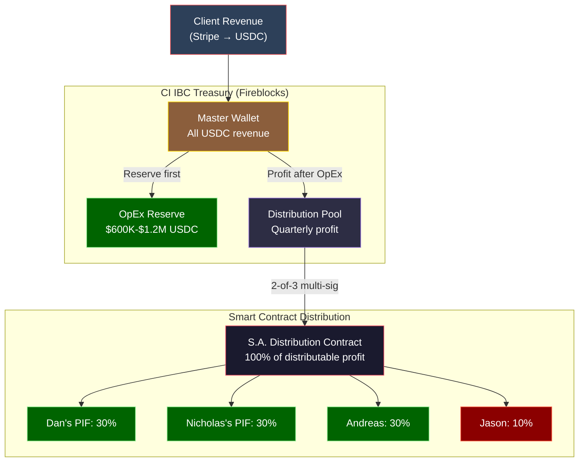

# Light Brands AI — Crypto-Native Treasury Architecture

> **Status:** Definitive architecture — requires crypto counsel and compliance validation
> **Last Updated:** February 15, 2026
> **Scope:** End-to-end crypto-native payment, treasury, and distribution architecture for Light Brands AI. Clients pay with cards; the business operates 100% in crypto from the moment of receipt.
> **Decision:** Light Brands AI is crypto-native from day one. All revenue settles as USDC. All internal flows are on-chain. Fiat touchpoints minimized to Cyprus payroll only.
> **Modifies:** [13-DAN-EXIT-US-AND-LB-SIMPLIFIED-STRUCTURE.md](./13-DAN-EXIT-US-AND-LB-SIMPLIFIED-STRUCTURE.md) (Banking/Revenue sections), [16-CYPRUS-STUDIO-SUBSTANCE-LAYER.md](./16-CYPRUS-STUDIO-SUBSTANCE-LAYER.md) (Banking section)

---

## Table of Contents

1. [Design Principle](#1-design-principle)
2. [Architecture Overview](#2-architecture-overview)
3. [Layer 1: Client-Facing Payments](#3-layer-1-client-payments)
4. [Layer 2: CI IBC Treasury](#4-layer-2-treasury)
5. [Layer 3: Operational Payments](#5-layer-3-operational)
6. [Layer 4: Smart Contract Distribution](#6-layer-4-distribution)
7. [Layer 5: Founder Wallets](#7-layer-5-founder-wallets)
8. [Fiat Off-Ramp Points](#8-fiat-off-ramps)
9. [Infrastructure Stack](#9-infrastructure-stack)
10. [Cost Analysis](#10-cost-analysis)
11. [Banking: Reduced but Not Eliminated](#11-banking)
12. [Accounting and Audit](#12-accounting)
13. [Compliance and AML/KYC](#13-compliance)
14. [Formation Roadmap](#14-formation-roadmap)
15. [Risk Analysis](#15-risk-analysis)
16. [Open Questions for Counsel](#16-open-questions)

---

## 1. Design Principle {#1-design-principle}

**The business always transacts in crypto.**

Clients experience a normal card checkout — Visa, Mastercard, Apple Pay, Google Pay. They never touch crypto. They never know.

From the moment Stripe processes the charge, Light Brands receives USDC. Every internal flow — contractor payments, intercompany transfers, profit distributions — happens on-chain. Fiat exists only at the edges: the client's card and Cyprus payroll.

### Why

| Reason | Detail |
|--------|--------|
| **Sovereignty** | No bank sits between the company's revenue and the founders' wallets. No freeze risk, no compliance delays, no intermediary judgment calls. |
| **Banking risk elimination** | CI IBCs face banking friction. Stripe → USDC bypasses this entirely. The Singapore bank becomes a backup channel, not a critical dependency. |
| **Speed** | USDC transfers settle in seconds. Wire transfers take 2-5 business days. |
| **Cost** | Stripe's USDC settlement fee is 1.5% — lower than standard card processing (2.9% + $0.30). Cross-border USDC transfers cost ~$0.01. |
| **Transparency** | Every transaction is on-chain, timestamped, and immutable. Audit trails are built into the infrastructure. |
| **Programmability** | Smart contracts automate distributions, enforce cap table splits, and execute governance decisions without human intermediaries. |

---

## 2. Architecture Overview {#2-architecture-overview}

### The Full Stack

```
LAYER 1: CLIENT-FACING (Normal card checkout)
══════════════════════════════════════════════

  Consulting clients     →  Stripe Invoice (card/ACH)
  SaaS subscriptions     →  Stripe Checkout (recurring)
  Enterprise contracts   →  Stripe Invoice or wire → Circle on-ramp

  ALL settle as USDC → CI IBC master wallet


LAYER 2: CI IBC TREASURY (100% USDC)
══════════════════════════════════════════════

  ┌─────────────────────────────────────────┐
  │  CI IBC Master Wallet (Fireblocks)      │
  │  Multi-sig: Dan + Nicholas + Andreas    │
  │                                         │
  │  All revenue arrives as USDC            │
  │  All payments leave as USDC             │
  │  Fiat conversion only at off-ramp       │
  └─────────────────────────────────────────┘


LAYER 3: OPERATIONAL PAYMENTS (USDC)
══════════════════════════════════════════════

  CI IBC wallet pays:
  ├── Cyprus Studio (monthly cost-plus, USDC)
  ├── Dan's contractor fee (monthly, USDC)
  ├── Wife's contractor fee (monthly, USDC)
  ├── Remote contractors (USDC batch transfer)
  ├── SaaS/infra (off-ramp or pay in USDC)
  └── Retained profit → Distribution pool


LAYER 4: SMART CONTRACT DISTRIBUTION (Quarterly)
══════════════════════════════════════════════

  Distribution Smart Contract
  ├── Triggered by 2-of-3 multi-sig
  ├── CI IBC profit → S.A. wallet (100%)
  │   └── S.A. distributes per cap table:
  │       ├── 30% → Dan's PIF wallet
  │       ├── 30% → Nicholas's PIF wallet
  │       ├── 30% → Andreas's wallet
  │       └── 10% → Jason's wallet
  │
  Instant. Trustless. Auditable.


LAYER 5: FOUNDER WALLETS (Self-custodied)
══════════════════════════════════════════════

  Each founder holds USDC in own wallet
  Off-ramp to local fiat ONLY when they choose

  Dan:      Hold USDC or off-ramp via Circle
  Nicholas: Hold USDC or off-ramp via Circle
  Andreas:  Off-ramp to Cyprus bank for living expenses
  Jason:    Off-ramp to US bank (US tax obligations)
```

### Fiat Touchpoints

| Touchpoint | Why It Exists | Can It Be Eliminated? |
|------------|--------------|:---------------------:|
| Client's credit card | Clients pay in fiat — that's their world | Not yet (crypto payments optional later) |
| Cyprus payroll | Cyprus employment law requires EUR bank payroll | No — legal requirement |
| Singapore bank (backup) | Enterprise clients who insist on wire transfer | Eventually, as crypto adoption grows |

**Everything else is on-chain.**

---

## 3. Layer 1: Client-Facing Payments {#3-layer-1-client-payments}

### Stripe Configuration

| Setting | Value |
|---------|-------|
| **Stripe account holder** | Light Brands Studio Ltd (Cyprus) or CI IBC if Stripe supports Cook Islands |
| **Settlement currency** | USDC |
| **Settlement destination** | External wallet (CI IBC Fireblocks wallet address) |
| **Settlement network** | Base (Coinbase L2) — lowest fees, fastest settlement |
| **Fee** | 1.5% flat per transaction |
| **Supported payment methods** | Visa, Mastercard, Amex, Apple Pay, Google Pay, ACH, SEPA |

### Why Cyprus Studio as Stripe Account Holder

Stripe requires the business to be incorporated in a supported country. If Cook Islands is not on Stripe's supported list, the Cyprus Studio (LBS) — an EU-incorporated company — serves as the Stripe-facing entity. This is consistent with the existing structure:

- Clients see "Light Brands" at checkout (the Studio operates under the Light Brands name)
- Revenue settles as USDC directly to the CI IBC's wallet (not the Studio's bank)
- The MDSA establishes the CI IBC as the principal entity — the Studio facilitates payment processing as part of its service delivery role
- Transfer pricing documentation covers this arrangement

### For Enterprise Clients (Wire Transfer)

Some enterprise clients will insist on paying via wire transfer to a bank account. For these:

| Method | Flow |
|--------|------|
| Wire → Singapore bank | Client wires USD → CI IBC Singapore bank → Circle on-ramp → USDC → CI IBC wallet |
| Wire → Circle directly | Client wires USD → Circle business account → USDC minted → CI IBC wallet |

Goal: minimize wire transfers over time as Stripe becomes the primary channel.

### Subscription / Recurring Billing

Stripe supports recurring USDC settlement for subscriptions. For SaaS products:

- Client enters card details once
- Stripe charges monthly/annually
- Each charge settles as USDC to the CI IBC wallet
- Stripe deploys on-chain smart contracts for subscription pulls (on Base network)

---

## 4. Layer 2: CI IBC Treasury {#4-layer-2-treasury}

### Wallet Architecture

| Wallet | Purpose | Custody | Signers |
|--------|---------|---------|---------|
| **CI IBC Master Wallet** | All revenue, all outflows | Fireblocks (institutional) | 2-of-3: Dan, Nicholas, Andreas |
| **CI IBC OpEx Reserve** | Operational reserve (12-24 months burn) | Fireblocks (separate vault) | Same signers |
| **CI IBC Distribution Pool** | Quarterly profit awaiting distribution | Fireblocks | Same signers |

### OpEx Reserve — The Safety Net (In USDC)

The CI IBC maintains a mandatory USDC reserve before any distributions:

| Parameter | Amount |
|-----------|--------|
| **Minimum reserve** | $600,000 USDC (12 months at $50K/mo burn) |
| **Target reserve** | $1,200,000 USDC (24 months) |
| **Held in** | USDC in Fireblocks vault (separate from operational wallet) |

The reserve policy is identical to the fiat version described in Doc 15. The only difference: it's held in USDC instead of a Singapore bank account.

### Treasury Management

| Function | Tool |
|----------|------|
| Wallet custody + multi-sig | Fireblocks |
| Crypto accounting + reporting | TRES Finance (acquired by Fireblocks, Jan 2026) |
| On/off-ramp (USDC ↔ USD) | Circle Mint API |
| Batch payments to contractors | Fireblocks Batched Transfers API |
| Real-time balance monitoring | Fireblocks dashboard + TRES |

---

## 5. Layer 3: Operational Payments {#5-layer-3-operational}

### Monthly Payment Schedule

| Payment | From | To | Method | Currency |
|---------|------|----|--------|----------|
| Cyprus Studio (cost-plus) | CI IBC wallet | LBS wallet | USDC transfer (Fireblocks) | USDC |
| Dan's contractor fee | CI IBC wallet | Dan's personal wallet | USDC transfer | USDC |
| Wife's contractor fee | CI IBC wallet | Wife's personal wallet | USDC transfer | USDC |
| Remote contractors | CI IBC wallet | Contractor wallets | Fireblocks batch transfer | USDC |
| SaaS/infrastructure | CI IBC wallet | Off-ramp → vendor, or pay in USDC | Circle off-ramp or direct | USDC or USD |

### Cyprus Studio Internal Flow

The Cyprus Studio receives USDC from the CI IBC. It must convert to EUR for payroll:

```
CI IBC wallet (USDC)
    │
    │  Monthly cost-plus transfer
    ▼
LBS wallet (Fireblocks, USDC)
    │
    ├──► Circle off-ramp → EUR → Cyprus bank
    │    └── Developer salaries (payroll)
    │    └── Office rent + utilities
    │    └── Social insurance contributions
    │
    └──► Retained margin (10%) stays in USDC
         └── Distributed to S.A. quarterly
```

The Studio holds USDC until it needs to off-ramp for specific EUR expenses. The 10% margin can remain in USDC and flow back to the S.A. as part of the quarterly distribution cycle.

### Contractor Payments

| Contractor Type | Payment Method | Detail |
|----------------|---------------|--------|
| **Crypto-accepting contractors** | Direct USDC from CI IBC wallet | Fireblocks batch transfer, monthly |
| **Fiat-only contractors** | USDC → off-ramp → Wise → contractor bank | Circle off-ramp to USD, then Wise for local currency |
| **Deel-managed contractors** | USDC → off-ramp → Deel funding | Deel handles local compliance and payment |

Over time, as more contractors accept USDC directly, the Wise/Deel off-ramp paths reduce. The goal is 100% USDC payment to all parties who will accept it.

---

## 6. Layer 4: Smart Contract Distribution {#6-layer-4-distribution}

### Distribution Contract Design

The quarterly profit distribution is governed by an on-chain smart contract:

```
┌─────────────────────────────────────────────────────┐
│  LIGHT BRANDS DISTRIBUTION CONTRACT                  │
│  Network: Base (Coinbase L2) or Ethereum             │
│                                                      │
│  TRIGGER: 2-of-3 multi-sig (Dan, Nicholas, Andreas)  │
│                                                      │
│  INPUT: USDC amount from CI IBC distribution pool    │
│                                                      │
│  LOGIC:                                              │
│  1. Verify OpEx reserve ≥ $600K USDC                 │
│  2. Calculate distributable amount                   │
│  3. Transfer 100% to S.A. wallet                     │
│  4. S.A. contract distributes per cap table:          │
│     ├── 30% → Dan's PIF wallet                       │
│     ├── 30% → Nicholas's PIF wallet                  │
│     ├── 30% → Andreas's wallet                       │
│     └── 10% → Jason's wallet                         │
│                                                      │
│  CONTROLS:                                           │
│  - Multi-sig: 2-of-3 founding directors required     │
│  - Time-lock: 48-hour delay between trigger + execute │
│  - Emergency pause: any signer can halt              │
│  - Cap table immutable unless 3-of-3 approve change  │
│                                                      │
│  AUDIT:                                              │
│  - Every distribution on-chain, timestamped          │
│  - Public verification of cap table compliance       │
│  - Immutable record for tax documentation            │
└─────────────────────────────────────────────────────┘
```

### Distribution Flow (Visual)



### Why a Smart Contract (vs. Manual Transfers)

| Manual Bank Wire | Smart Contract |
|-----------------|----------------|
| Board resolution → email to bank → 3-5 days | Multi-sig trigger → 48-hour time-lock → automatic execution |
| Bank can delay, question, or freeze | Contract executes exactly as programmed |
| Each wire costs $25-50 | Each on-chain transfer costs ~$0.01 |
| No transparency — founders trust bank processed correctly | On-chain — every founder can verify in real-time |
| Error-prone (wrong amounts, wrong accounts) | Mathematically enforced — 30/30/30/10 every time |

---

## 7. Layer 5: Founder Wallets {#7-layer-5-founder-wallets}

### Wallet Setup

| Founder | Wallet Type | Purpose |
|---------|------------|---------|
| **Dan's PIF** | Gnosis Safe (multi-sig) | Receives 30% distributions. PIF Foundation Council controls. |
| **Nicholas's PIF** | Gnosis Safe (multi-sig) | Receives 30% distributions. PIF Foundation Council controls. |
| **Andreas** | Gnosis Safe or hardware wallet | Receives 30% distributions directly. |
| **Jason** | Gnosis Safe or hardware wallet | Receives 10% distributions directly. |

### What Founders Do With USDC

| Founder | Likely Action | Tax Implication |
|---------|-------------|-----------------|
| **Dan** | Hold USDC. Off-ramp to fiat only as needed for living expenses. | 0% — territorial tax country, USDC is foreign-source |
| **Nicholas** | Hold or off-ramp per residence | Per residence tax rules |
| **Andreas** | Off-ramp EUR portion for Cyprus living; hold rest in USDC | ~7.65% SDC+GESY on dividends received |
| **Jason** | Must off-ramp for US tax payments; may hold remainder in USDC | US tax rates apply (~25-35%) |

---

## 8. Fiat Off-Ramp Points {#8-fiat-off-ramps}

### Mandatory Off-Ramps

| What | Why | Frequency | Method |
|------|-----|-----------|--------|
| Cyprus payroll | Employment law requires EUR bank payment | Monthly | LBS wallet → Circle → EUR → Cyprus bank → payroll |
| Cyprus office rent + utilities | Landlord/utilities accept EUR only | Monthly | Same off-ramp as payroll |
| Cyprus social insurance | Government requires EUR payment | Monthly | Same off-ramp |

### Optional Off-Ramps

| What | When | Method |
|------|------|--------|
| Fiat-only contractors | If contractor doesn't accept USDC | USDC → Circle → USD → Wise → contractor |
| Fiat-only SaaS vendors | If vendor doesn't accept USDC | USDC → Circle → card payment |
| Founder living expenses | When founder needs local currency | Founder wallet → Circle/exchange → local bank |
| Enterprise client wire (inbound) | Client insists on wire, not Stripe | Wire → Singapore bank → Circle → USDC → CI IBC wallet |

### Goal Over Time

```
Year 1:  ~70% on-chain, ~30% requires off-ramp
Year 2:  ~85% on-chain, ~15% requires off-ramp
Year 3+: ~95% on-chain, ~5% requires off-ramp (Cyprus payroll only)
```

As more contractors, vendors, and even Cyprus-based services accept USDC, the off-ramp percentage shrinks. The architecture is designed to minimize fiat from day one and eliminate it wherever possible over time.

---

## 9. Infrastructure Stack {#9-infrastructure-stack}

### Core Services

| Service | Role | Cost | Critical? |
|---------|------|------|:---------:|
| **Stripe** | Client-facing payment processing. Card → USDC settlement. | 1.5% per transaction | Yes |
| **Fireblocks** | Enterprise crypto custody, multi-sig wallets, batched transfers, treasury management | ~$1,000-2,000/mo | Yes |
| **Circle (Mint API + Business Account)** | USDC on/off-ramp. Fiat ↔ USDC conversion. | Per-transaction fees | Yes |
| **TRES Finance** (Fireblocks) | Crypto accounting, reporting, tax documentation | Included with Fireblocks (post-acquisition) | Yes |
| **Gnosis Safe / Safe{Wallet}** | Multi-sig wallets for PIF and founder wallets | Free | Yes |
| **Custom distribution smart contract** | Automated cap table distribution logic | One-time: $10,000-15,000 (build + audit) | Yes |

### Optional / Future Services

| Service | Role | Cost | When |
|---------|------|------|------|
| **BVNK** | Alternative payment gateway if Stripe doesn't support CI IBC directly | Per-transaction | If needed |
| **Papaya Global + Fireblocks** | Crypto-native contractor/payroll payments | Per-employee/contractor | When scaling |
| **Bitwave** | Advanced crypto tax compliance and reporting | ~$500/mo | At scale |

### Network Choice

| Network | Pros | Cons | Recommendation |
|---------|------|------|:--------------:|
| **Base (Coinbase L2)** | Lowest fees (~$0.001/tx), fast, Stripe native settlement | Newer, less battle-tested | **Primary** |
| **Ethereum (L1)** | Most secure, most liquid USDC | Higher fees (~$1-5/tx) | High-value distributions only |
| **Polygon** | Low fees, Stripe supports | Less institutional adoption | Backup |
| **Solana** | Extremely fast, Fireblocks integrated | Different ecosystem | Optional |

**Recommendation:** Use **Base** for day-to-day operations (Stripe settlement, contractor payments) and **Ethereum L1** for quarterly distributions and high-value transfers (maximum security).

---

## 10. Cost Analysis {#10-cost-analysis}

### Crypto Infrastructure Costs

| Item | Monthly | Annual |
|------|---------|--------|
| Fireblocks custody + treasury | $1,500 | $18,000 |
| TRES accounting (included with Fireblocks) | $0 | $0 |
| Circle on/off-ramp fees (estimate at $3M revenue) | ~$200 | ~$2,400 |
| Smart contract deployment + audit (one-time, amortized) | ~$400 | $5,000 (Year 1), $1,000/yr maintenance |
| Gnosis Safe wallets | $0 | $0 |
| **Total crypto infrastructure** | **~$2,100** | **~$25,400 (Y1), ~$21,400 (Y2+)** |

### Stripe Processing (vs. Traditional)

| | Traditional (2.9% + $0.30) | Crypto Settlement (1.5% flat) | Savings |
|--|---------------------------|-------------------------------|---------|
| On $1M revenue | $29,300 | $15,000 | **$14,300** |
| On $3M revenue | $87,300 | $45,000 | **$42,300** |
| On $5M revenue | $145,300 | $75,000 | **$70,300** |

### Traditional Banking Costs Eliminated or Reduced

| Item | Traditional Cost | Crypto-Native Cost | Savings |
|------|-----------------|-------------------|---------|
| International wire transfers (~20/mo) | $600-1,000/mo | ~$0.20/mo (USDC) | ~$7,200-12,000/yr |
| FX conversion (USD → EUR, etc.) | 0.5-2% per conversion | 0% (USDC is USD-pegged) | Significant at scale |
| Singapore bank fees | $200-500/yr | $200-500/yr (backup, reduced activity) | Minimal change |
| Multi-day settlement delays | Lost opportunity cost | Instant settlement | Hard to quantify |

### Net Cost Comparison (at $3M Revenue)

| | Traditional Stack | Crypto-Native Stack |
|--|-------------------|---------------------|
| Stripe/payment processing | $87,300 (2.9%) | $45,000 (1.5%) |
| Banking fees + wires | ~$12,000 | ~$2,000 (reduced) |
| Crypto infrastructure | $0 | $25,400 |
| FX conversion costs | ~$5,000 | ~$1,000 |
| **Total payment/treasury cost** | **~$104,300** | **~$73,400** |
| **Annual savings** | | **~$30,900** |

The crypto-native stack is **cheaper** than the traditional stack, primarily because Stripe's 1.5% USDC fee is dramatically lower than its 2.9% card fee, and USDC transfers eliminate wire fees and FX conversion costs.

---

## 11. Banking: Reduced but Not Eliminated {#11-banking}

### Remaining Bank Accounts

| Account | Bank | Purpose | Activity Level |
|---------|------|---------|:--------------:|
| **CI IBC** | DBS / OCBC / Statrys (Singapore) | Backup for enterprise wire transfers. KYC anchor. | Low |
| **Cyprus Studio (LBS)** | Bank of Cyprus / Hellenic Bank | EUR payroll, office costs, government payments | Medium |
| **S.A.** | Banco General (Panama) | Corporate maintenance, minimal activity | Very Low |
| **PIF** | Optional — may not need one | Distributions flow on-chain, not through bank | Minimal/None |

### What Changed

| Role | Before (Traditional) | After (Crypto-Native) |
|------|---------------------|----------------------|
| CI IBC Singapore bank | **Primary** — all revenue in, all payments out | **Backup** — enterprise wires only |
| Cyprus bank | **Primary** — all Studio operations | **Payroll only** — receives off-ramp from USDC |
| Panama bank | **Active** — dividends flow through | **Minimal** — corporate maintenance only |
| PIF bank | Needed for distributions | **Optional** — USDC distributions bypass banks |

### Banking Risk Profile

The biggest structural vulnerability for a Cook Islands IBC has always been banking. Banks are cautious about CI entities, and account closures can disrupt operations.

**In the traditional model:** A CI IBC bank closure is an existential threat. No bank = no revenue collection = no operations.

**In the crypto-native model:** A CI IBC bank closure is an inconvenience. Revenue still flows through Stripe → USDC. The Singapore bank is only needed for the minority of enterprise clients who wire. If the bank closes, operations continue uninterrupted while a new banking relationship is established.

---

## 12. Accounting and Audit {#12-accounting}

### Crypto Accounting Requirements

The Cyprus Studio must file audited annual accounts. The CI IBC may have reporting obligations depending on Cook Islands law. Both entities now handle USDC, which requires crypto-specific accounting.

| Requirement | Tool | Detail |
|-------------|------|--------|
| **Transaction recording** | TRES Finance (Fireblocks) | Automatic capture of all on-chain transactions. Wallet balances, inflows, outflows. |
| **Cost-basis tracking** | TRES / Bitwave | USDC is a stablecoin pegged 1:1 to USD. Cost basis is straightforward (no capital gains on USDC→USD conversion). |
| **Cyprus audit** | Cyprus auditor + TRES export | Auditor receives TRES reports showing all Studio inflows (from CI IBC) and outflows (payroll, expenses). On-chain records are immutable — stronger audit trail than bank statements. |
| **Transfer pricing documentation** | TP advisor + on-chain records | The cost-plus payments from CI IBC → Cyprus Studio are on-chain and timestamped. Transfer pricing documentation is enhanced by blockchain transparency. |
| **Tax filing** | Cyprus accountant | Standard Cyprus corporate tax filing. USDC revenue and expenses converted to EUR at daily rates. |

### USDC and Accounting Standards

USDC is a USD-pegged stablecoin. For accounting purposes:

- **USDC held = USD held** (1:1 peg, fully reserved, audited by Deloitte)
- No capital gains or losses on USDC ↔ USD conversion (the value doesn't fluctuate)
- USDC received as revenue = USD revenue at the moment of receipt
- USDC paid as expense = USD expense at the moment of payment

This is simpler than accounting for volatile cryptocurrencies (BTC, ETH). The only complexity is the on/off-ramp documentation when converting USDC → EUR for Cyprus payroll.

---

## 13. Compliance and AML/KYC {#13-compliance}

### Regulatory Framework

| Jurisdiction | Crypto Regulation | Impact on Light Brands |
|-------------|-------------------|----------------------|
| **Cook Islands** | No specific crypto legislation. IBCs have broad business powers. | CI IBC can hold and transact in USDC without special licensing. |
| **Cyprus** | EU MiCA framework (Markets in Crypto-Assets Regulation) applies from 2025. | Cyprus Studio is not a crypto service provider — it receives USDC as payment for services. MiCA licensing not required for holding/receiving crypto. |
| **Panama** | No comprehensive crypto legislation. Territorial tax — no tax on digital asset transactions. Bill 247 under discussion. | S.A. and PIF can hold USDC. Panama joined Crypto-Asset Reporting Framework (CARF) in 2025. |
| **Singapore** | MAS-regulated. Clear framework for digital payment tokens. | Singapore bank supports transfers to licensed exchanges. DBS operates DDEx. |

### AML/KYC Compliance

| Layer | Compliance Provider | KYC/AML |
|-------|-------------------|---------|
| Client payments | Stripe | Stripe handles all client KYC/AML. Card network compliance built in. |
| USDC on/off-ramp | Circle | Circle is a registered money transmitter. Full KYC on business accounts. |
| Custody + transfers | Fireblocks | Fireblocks includes AML/KYT (Know Your Transaction) screening via Chainalysis integration. |
| Contractor payments | Fireblocks + Deel | KYC on all contractors via standard onboarding. |

**Light Brands does not need a crypto license.** It is not operating as a VASP (Virtual Asset Service Provider). It is a consulting/software business that receives payment settlement in USDC and uses USDC for internal treasury operations. The licensed intermediaries (Stripe, Circle, Fireblocks) handle all regulated activities.

---

## 14. Formation Roadmap {#14-formation-roadmap}

### Crypto Infrastructure Setup (Parallel with Entity Formation)

| # | Step | Timeline | Dependency |
|---|------|----------|------------|
| 1 | Open Circle Business Account for CI IBC | Week 4-5 | CI IBC incorporated |
| 2 | Open Fireblocks enterprise account | Week 4-6 | CI IBC incorporated |
| 3 | Create CI IBC master wallet (Fireblocks, multi-sig) | Week 5-6 | Fireblocks account active |
| 4 | Create LBS wallet (Fireblocks) | Week 5-6 | Cyprus Studio incorporated + Fireblocks |
| 5 | Set up Stripe account (via Cyprus Studio or CI IBC) | Week 6-8 | At least one entity incorporated |
| 6 | Configure Stripe → USDC settlement to CI IBC wallet | Week 6-8 | Stripe + Fireblocks active |
| 7 | Set up Circle Mint API integration (on/off-ramp) | Week 6-8 | Circle account active |
| 8 | Create PIF wallets (Gnosis Safe, post-renunciation) | Post-renunciation | PIFs formed |
| 9 | Create founder personal wallets | Week 6 | None |
| 10 | Build + audit distribution smart contract | Weeks 8-16 | Wallets created, cap table finalized |
| 11 | Test with small distribution ($1,000) | Week 16 | Smart contract deployed |
| 12 | Go live: first client payment settles as USDC | Week 8-10 | Stripe + Fireblocks + Circle all active |

### Integration with Entity Formation Timeline

The crypto infrastructure setup runs **in parallel** with entity formation (Doc 15, Phase 2). By the time the CI IBC and Cyprus Studio are operational and agreements are signed, the crypto stack should be ready to receive the first client payment as USDC.

```
ENTITY FORMATION (Doc 15, Phase 2)     CRYPTO SETUP (This doc)
Weeks 2-4: Form PIFs, S.A.
Weeks 2-5: Form CI IBC                 Week 4-5: Circle + Fireblocks accounts
Weeks 3-6: Form Cyprus Studio          Week 5-6: Create wallets
Weeks 4-6: Open bank accounts          Week 6-8: Stripe → USDC settlement
Weeks 5-7: Payment infrastructure      Week 6-8: Circle API integration
                                        Weeks 8-16: Distribution smart contract

Week 8-10: FIRST CLIENT REVENUE        → Settles as USDC from day one
```

---

## 15. Risk Analysis {#15-risk-analysis}

| Risk | Probability | Impact | Mitigation |
|------|:----------:|:------:|------------|
| **USDC depeg event** | Very Low | High — temporary loss of value | Circle's USDC is fully reserved (1:1 USD backing, audited by Deloitte). Brief depegs have occurred (March 2023 SVB event) but recovered within days. Diversify reserve across USDC + USDT if concerned. |
| **Stripe drops USDC settlement** | Very Low | Medium — need alternative payment processor | BVNK, Coinbase Commerce, and other processors offer same functionality. Stripe's $1.1B acquisition of Bridge signals deep commitment to stablecoins. |
| **Fireblocks security breach** | Very Low | High — custody at risk | Fireblocks uses MPC (multi-party computation) — no single point of failure. $30M+ insurance policy. Used by BNY Mellon, MoneyGram, and other institutions. |
| **Regulatory change (Cyprus/Panama)** | Low | Medium — may require restructuring of crypto flows | EU MiCA is already live. Panama is moving toward regulation, not prohibition. Architecture uses licensed intermediaries for all regulated activities. |
| **Circle account closure** | Low | Medium — lose on/off-ramp | Alternative on-ramps: Coinbase Prime, Kraken Business, Bitstamp. Multiple on-ramp providers should be maintained. |
| **Smart contract vulnerability** | Low | High — loss of funds during distribution | Professional audit (Trail of Bits, OpenZeppelin) before deployment. Time-lock + emergency pause functions. Start with small distributions. |
| **Client refusal to pay via Stripe** | Low | Low — affects individual clients | Maintain Singapore bank for wire transfers. Off-ramp via Circle. Client doesn't know or care that settlement is USDC. |
| **Tax authority questions crypto flows** | Medium | Medium — audit risk | All flows documented on-chain (stronger than bank statements). TRES Finance provides audit-ready reports. Transfer pricing documentation includes crypto flow details. |

---

## 16. Open Questions for Counsel {#16-open-questions}

### For Crypto/Fintech Counsel

1. **Stripe account for CI IBC:** Can a Cook Islands IBC open a Stripe account directly? If not, confirm Cyprus Studio can serve as payment processor for the group.

2. **USDC as corporate treasury:** Any regulatory implications of a Cook Islands IBC holding its entire treasury in USDC rather than bank deposits?

3. **Smart contract distributions:** Are on-chain USDC transfers legally equivalent to wire transfers for the purposes of shareholder dividend distribution under Panamanian corporate law (S.A.) and Cook Islands corporate law (IBC)?

4. **PIF wallet as beneficiary asset:** Can a Panama PIF hold USDC in a self-custodied wallet? Any implications for PIF governance under Law 25 of 1995?

### For Cyprus Counsel

5. **USDC receipts for Cyprus Studio:** Does receiving payment in USDC (then off-ramping to EUR for payroll) create any complications for Cyprus corporate tax filing or audit?

6. **Transfer pricing documentation:** Does the CI IBC → Studio payment being in USDC (vs. bank wire) affect transfer pricing defensibility?

7. **VAT on USDC-denominated services:** Confirm B2B services from Cyprus Studio to CI IBC invoiced/paid in USDC are treated the same as USD for VAT purposes (0% reverse charge to non-EU entity).

### For Transfer Pricing Advisor

8. **On-chain audit trail:** Can on-chain USDC transfer records serve as supporting documentation for transfer pricing compliance? (They should be stronger than bank statements — immutable, timestamped, publicly verifiable.)

### For Tax Attorney

9. **USDC and covered expatriate net worth:** For Dan's net worth calculation on date of renunciation, USDC held in a wallet = USD. Confirm USDC holdings are treated as cash equivalents for the $2M threshold test.

10. **Wife's FEIE and USDC income:** Wife receives contractor fees in USDC. Confirm USDC income qualifies as "earned income" for FEIE purposes when she off-ramps to USD.

---

## Cross-References

- **Corporate architecture:** [14-LIGHT-BRANDS-AI-CORPORATE-SETUP.md](./14-LIGHT-BRANDS-AI-CORPORATE-SETUP.md)
- **Dan's US exit plan (updated banking/revenue sections):** [13-DAN-EXIT-US-AND-LB-SIMPLIFIED-STRUCTURE.md](./13-DAN-EXIT-US-AND-LB-SIMPLIFIED-STRUCTURE.md)
- **Dan's action plan (crypto setup steps):** [15-DAN-ACTION-PLAN.md](./15-DAN-ACTION-PLAN.md)
- **Cyprus Studio substance layer (updated banking):** [16-CYPRUS-STUDIO-SUBSTANCE-LAYER.md](./16-CYPRUS-STUDIO-SUBSTANCE-LAYER.md)
- **Cook Islands IBC detail:** [08-COOK-ISLANDS-IBC-DETAIL.md](./08-COOK-ISLANDS-IBC-DETAIL.md)
- **Citizenship strategy:** [../../CITIZENSHIP_STRATEGY.md](../../CITIZENSHIP_STRATEGY.md)

---

*This document specifies a crypto-native treasury architecture for Light Brands AI using Stripe USDC settlement, Fireblocks enterprise custody, Circle on/off-ramp services, and smart contract-based profit distributions. The architecture enables clients to pay with standard credit/debit cards while the business operates 100% in USDC from the moment of receipt. All regulated activities (payment processing, custody, on/off-ramp) are performed by licensed intermediaries (Stripe, Fireblocks, Circle). Light Brands does not require a VASP or crypto license. Implementation requires validation by crypto/fintech counsel, Cyprus corporate counsel, transfer pricing advisor, and Cook Islands registered agent. This is not legal, tax, or financial advice.*
