# Church of the Living Light — Governance & Bylaws Framework

> **Status:** Draft — requires religious nonprofit attorney review before formation
> **Last Updated:** February 2026
> **Entity Type:** 508(c)(1)(A) Church (automatic tax exemption, no IRS application required)
> **Model:** Kenneth Copeland Ministries governance structure

---

## 1. TL;DR

The Church of the Living Light is structured so that **Daniel Lawless is the irremovable founding Senior Pastor with life tenure, doctrinal authority over all ministry decisions, board nomination power, budget authority, and succession rights.** The Spiritual Council (board) includes three Lawless family members, one aligned co-founder representative (Nancy Courchesne), and three independent members. The Compensation Committee (Sydney Griffith, Chair; Iryna Voitenko; Angelina Adelaide) operates by majority vote — all three are genuinely independent with no family or financial ties to Daniel. Daniel's bylaws protections cannot be amended without his consent. The board is majority female (5 of 7).

Daniel is **invisible** to the entire corporate structure except as an employee of LBS (Dubai) for FEIE purposes. The church is the only entity Daniel controls — and through the bylaws, he controls it absolutely.

---

## 2. Legal Foundation

| Attribute | Detail |
|---|---|
| **Entity Name** | Church of the Living Light |
| **Legal Basis** | IRC 508(c)(1)(A) — automatic tax exemption for churches |
| **State Formation** | [TBD — counsel to advise on optimal state: Texas, Wyoming, Nevada] |
| **IRS Application** | **None required.** Churches are automatically exempt. No Form 1023 needed. |
| **Form 990** | **Not required.** Churches are specifically exempt from Form 990 filing (IRC 6033(a)(3)(A)(i)). No public financial disclosure. |
| **IRS Audit** | Protected by Church Audit Procedures Act (IRC 7611). IRS must follow heightened procedures: Treasury-level approval, written notice, limited scope, time restrictions. |
| **14-Point Test** | Church must meet IRS 14-point criteria for church status (see Section 14 below). |
| **Annual Cost** | ~$500-2,000 (state filing + registered agent). No federal filing fees. |

### Why 508(c)(1)(A) Instead of 501(c)(3)

| | 508(c)(1)(A) Church | 501(c)(3) Nonprofit |
|---|---|---|
| **IRS application** | None — automatic | Must apply (Form 1023) |
| **Form 990** | Not required | Required annually (public) |
| **Financial disclosure** | None | Public |
| **IRS audit** | Church Audit Procedures Act protections | Standard audit rules |
| **Donor deductions** | Yes — same as 501(c)(3) | Yes |
| **UBIT** | Same exemptions (IRC 512(b)) | Same |
| **Governance scrutiny** | Minimal (First Amendment) | Standard nonprofit rules |
| **Board independence** | No specific requirements | State-specific requirements |

**The church structure gives maximum privacy, minimum disclosure, and maximum governance flexibility.**

---

## 3. Organizational Architecture

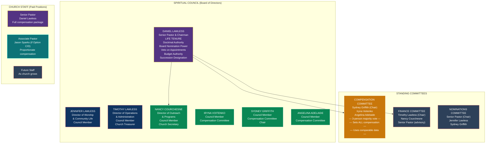

---

## 4. The Spiritual Council (Board of Directors)

### 4.1 Composition: 7 Members

| Seat | Person | Role | Category | Voting |
|---|---|---|---|---|
| **1 — Chairman** | **Daniel Lawless** | Senior Pastor, Chairman of the Board | Family (Founder) | Yes on all matters EXCEPT own compensation |
| **2** | **Jennifer Lawless** | Director of Worship & Community Life | Family (Wife) | Yes on all matters EXCEPT Daniel's compensation (shared household) |
| **3** | **Timothy Lawless** | Director of Operations & Administration, Church Treasurer | Family (Brother) | Yes on all matters |
| **4** | **Nancy Courchesne** | Director of Outreach & Programs, Church Secretary | Non-Family (Co-Founder's Wife) | Yes on all matters |
| **5** | **Iryna Voitenko** | Council Member, Compensation Committee | Independent | Yes on all matters |
| **6** | **Sydney Griffith** | Council Member, Compensation Committee Chair | Independent | Yes on all matters |
| **7** | **Angelina Adelaide** | Council Member, Compensation Committee | Independent | Yes on all matters |

### 4.2 Voting Power Map

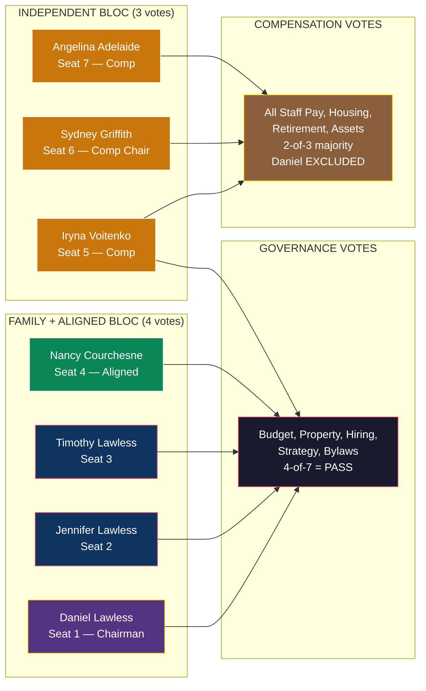

**Two separate vote tracks:** Governance decisions go through the full council (family bloc controls). Compensation decisions go through the independent committee only (Daniel has zero influence).

### 4.3 Why This Composition Works

**Lawless family (3 of 7):** Daniel + Jennifer + Timothy = 3 seats. Not a standalone majority, but with Nancy Courchesne (aligned — represents the Courchesne family interest) = 4 votes on governance matters — a practical majority for ministry direction, budget approval, property acquisition, hiring, and strategic decisions. Daniel's bylaw protections (life tenure, doctrinal authority, amendment lock, veto on appointments) do not depend on vote counts — they are structurally embedded and cannot be changed without Daniel's written consent.

**Nancy Courchesne as Director / Secretary (Seat 4):** Nancy is the wife of Nicholas Courchesne (Light Brands co-founder, 30% PPA holder). She represents the Courchesne family interest on the Spiritual Council and serves as Director of Outreach & Programs and Church Secretary — an active operational role with record-keeping duties. She is deliberately NOT on the Compensation Committee — under IRC 4958, Nancy is a disqualified person through spousal attribution to Nicholas (co-founder with substantial influence). Having a non-Lawless-family member as Church Secretary strengthens governance credibility — official records are maintained by someone outside the immediate family.

**Independent compensation committee (3 of 3, majority vote):** Sydney Griffith (Chair), Iryna Voitenko, and Angelina Adelaide set all compensation by majority vote. All three are genuinely independent — no family ties to Daniel, no financial interest in Light Brands or TE entities. Three independent members following the 26 CFR 53.4958-6 process (comparable data + independent deliberation + documentation) gives the strongest possible rebuttable presumption. Decisions require 2-of-3 majority.

**Board composition: 5 women, 2 men.** Jennifer, Nancy, Sydney, Iryna, and Angelina. Daniel and Timothy are the only male members. This is strong optics for a modern church governance structure.

**The Copeland precedent:** KCM's board includes Kenneth Copeland (founder/chairman), Gloria Copeland (wife), George Pearsons (son-in-law), and additional members. This structure has operated for 50+ years without IRS challenge to governance.

### 4.4 Council Terms and Appointment

| Provision | Detail |
|---|---|
| **Senior Pastor (Daniel)** | Life tenure (see Section 5). Removal requires unanimous vote + extreme trigger. |
| **Co-Founder (Jennifer)** | Life tenure (see Section 5A). Same protection standard as Senior Pastor. |
| **All other members** | Nominated by Senior Pastor via Nominations Committee. Confirmed by majority council vote. 3-year renewable terms. |
| **Removal — Daniel** | Unanimous vote of all other members + felony/incapacity/moral turpitude. Effectively impossible. |
| **Removal — Jennifer** | Unanimous vote of all other members + same extreme triggers. Effectively impossible. |
| **Removal — All others** | **Supermajority (5/7) for cause only.** The member being removed does not vote (5 of 6 voting members must agree). See Section 4.6 for enumerated causes. |
| **Vacancies** | Filled by Senior Pastor nomination + majority council vote. |
| **Quorum** | 4 of 7 members (Senior Pastor counts toward quorum). |

### 4.5 What "Independent" Means for IRS Purposes

Independent council members must satisfy ALL of the following:

- Not a family member of Daniel Lawless (spouse, sibling, child, parent, or their spouses)
- Not an employee of the church (council service is voluntary or has nominal stipend only)
- Not a business partner or financial counterparty of Daniel
- Not receiving compensation from any entity in the Light Brands / TE structure
- No financial interest that would be affected by Daniel's compensation

**Compensation Committee (all independent, majority vote):**
- **Sydney Griffith (Chair)** — No family or financial ties to Daniel. Close friend, not a family member under IRC 4958.
- **Iryna Voitenko** — No family or financial ties to Daniel. No financial interest in Light Brands or TE entities.
- **Angelina Adelaide** — No family or financial ties to Daniel.

**Not on Compensation Committee:**
- **Nancy Courchesne** — serves as Director/Secretary. Excluded from Compensation Committee due to spousal attribution from Nicholas Courchesne (co-founder of Light Brands, 30% PPA holder). IRC 4958 disqualified person.

**Key insight:** All three committee members are chosen BY Daniel (he controls the Nominations Committee). He selects people he trusts and who share his vision. They must be genuinely independent for IRS purposes — no family ties, no financial entanglement. Compensation decisions require 2-of-3 majority vote.

### 4.6 Removal for Cause — Enumerated Grounds (5/7 Supermajority)

All council members (except Daniel and Jennifer, who have life tenure) may only be removed **for cause** by a **supermajority vote of 5 out of 7 members** (the member being removed does not vote, so effectively 5 of 6 voting members must agree).

**Enumerated causes for removal:**

| Cause | Definition |
|---|---|
| **Failure to serve** | Absence from 3 or more consecutive council meetings without justification |
| **Loss of independence** | Entering a financial relationship with Light Brands, TE entities, or any structure entity that compromises independence (applies to Compensation Committee members) |
| **Criminal conduct** | Conviction of a felony or crime involving dishonesty |
| **Conduct harmful to the church** | Actions that materially harm the church's mission, reputation, or financial integrity — as determined by the council |
| **Breach of confidentiality** | Unauthorized disclosure of church financial records, council deliberations, compensation decisions, or governance pause proceedings |
| **Violation of the relationship provision** | Forming a romantic relationship with another council member and refusing to either end the relationship or resign within 30 days (see Section 4.7) |
| **Breach of fiduciary duty** | Self-dealing, misappropriation of church funds, or failure to act in the church's best interest |

**What is NOT a valid cause for removal:**
- Disagreement with the Senior Pastor's doctrinal decisions
- Voting against the Senior Pastor on a governance matter
- Personal conflict with any other member (absent conduct harmful to the church)
- Change in personal circumstances (divorce, relocation, etc.) unless it results in failure to serve

**Process:**
1. Written notice of proposed removal delivered to the member, stating the specific cause
2. Member has 14 days to respond in writing
3. Council meeting to hear both sides (member may attend and speak)
4. Vote: 5/7 required (member excluded from vote = 5/6 of voting members)
5. Decision documented in council minutes by Secretary
6. If removal approved, effective immediately. Vacancy filled through normal nomination process.

**During the 1-year post-pause cooling off period:** No removal proceedings may be initiated by the Senior Pastor. This prevents retaliatory removal after a governance pause. The council may still initiate removal proceedings for criminal conduct or breach of fiduciary duty during the cooling off period.

### 4.7 No Intra-Board Romantic Relationships

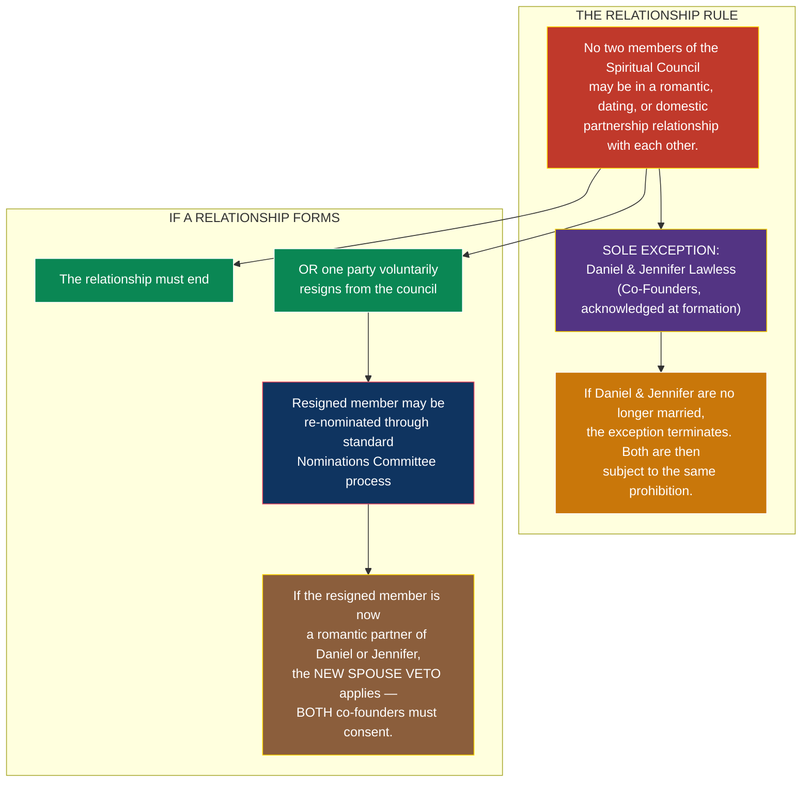

**The provision:**

> *"No two members of the Spiritual Council may be in a romantic, dating, or domestic partnership relationship with each other. The marriage of Daniel Lawless and Jennifer Lawless at the time of the church's founding is acknowledged and exempt from this provision. If the Senior Pastor and the Co-Founder are no longer married, this exemption terminates and both are subject to the same prohibition with respect to other council members."*

> *"If a romantic relationship develops between any two council members, one of the following must occur within thirty (30) days of the relationship becoming known to the council: (a) the relationship ends, or (b) one of the involved parties voluntarily resigns from the council. Failure to comply within 30 days constitutes grounds for removal under Section 4.6 (Violation of the relationship provision)."*

> *"A resigned member may be re-nominated to the council through the standard Nominations Committee process. If the resigned member is or has become a romantic partner of the Senior Pastor or the Co-Founder, the New Spouse Veto (Section 4.8) applies — both co-founders must consent in writing before the nomination may proceed."*

**Why this matters:**
- Prevents the board from becoming entangled in personal relationships
- Maintains professional governance boundaries
- After a potential divorce, prevents either Daniel or Jennifer from converting a board seat into a personal relationship platform
- The 30-day window gives people time to make a considered decision — end the relationship or leave the board
- The re-nomination pathway keeps the door open — the person isn't banned, they just have to go through the proper process

### 4.8 New Spouse Mutual Veto

> *"No spouse, domestic partner, or romantic partner of the Senior Pastor or the Co-Founder may be appointed to the Spiritual Council without the prior written consent of both the Senior Pastor and the Co-Founder. This provision applies regardless of the marital status of the Senior Pastor and the Co-Founder to each other. This provision may not be amended without the written consent of both the Senior Pastor and the Co-Founder."*

| Scenario | Result |
|---|---|
| Daniel wants to put a new partner on the council | **Jennifer must consent in writing.** No consent = no appointment. |
| Jennifer wants to put a new partner on the council | **Daniel must consent in writing.** No consent = no appointment. |
| Both have new partners and both consent | Both new partners can join (through normal nomination process, if seats are available) |
| One consents, the other doesn't | Only the consented partner can join |
| One co-founder has passed away | Provision no longer applies — surviving co-founder follows normal nomination process |

**The mutual amendment lock:** This provision itself requires BOTH Daniel's AND Jennifer's written consent to amend. Neither can unilaterally change the rules.

---

## 5. Senior Pastor Protections (The Copeland Shield)

These provisions are embedded in the church bylaws and **cannot be amended without the Senior Pastor's written consent**.

```mermaid
graph TB
    subgraph "THE COPELAND SHIELD — 7 Layers of Protection"
        L1["LAYER 1: LIFE TENURE<br/>Cannot be fired. Removal requires<br/>unanimous vote + felony/incapacity."]
        L2["LAYER 2: DOCTRINAL AUTHORITY<br/>Final say on ALL doctrine.<br/>Courts cannot review (1st Amendment)."]
        L3["LAYER 3: BOARD NOMINATION<br/>Controls who sits on the board.<br/>Veto on all appointments."]
        L4["LAYER 4: BOARD REMOVAL<br/>Can recommend removal for cause.<br/>5/7 supermajority required.<br/>Family bloc (4) + 1 independent = passes."]
        L5["LAYER 5: BUDGET AUTHORITY<br/>Proposes budget. $50K unilateral<br/>spending. Family majority approves."]
        L6["LAYER 6: SUCCESSION<br/>Designates own successor.<br/>Council ratifies (family majority)."]
        L7["LAYER 7: AMENDMENT LOCK<br/>Protected articles CANNOT be changed<br/>without Senior Pastor's written consent.<br/>This clause protects itself."]
    end

    L1 --> L2 --> L3 --> L4 --> L5 --> L6 --> L7

    style L1 fill:#533483,stroke:#ffd700,color:#fff
    style L2 fill:#533483,stroke:#ffd700,color:#fff
    style L3 fill:#533483,stroke:#ffd700,color:#fff
    style L4 fill:#533483,stroke:#ffd700,color:#fff
    style L5 fill:#533483,stroke:#ffd700,color:#fff
    style L6 fill:#533483,stroke:#ffd700,color:#fff
    style L7 fill:#c9770a,stroke:#ffd700,color:#fff
```

**Layer 7 is the master lock.** Even if all other protections were somehow circumvented, the amendment lock prevents anyone from changing the rules without Daniel's consent. And the lock protects itself — it cannot be removed without Daniel's consent either.

### 5.1 Life Tenure

> *"The Senior Pastor shall serve for life or until voluntary resignation. The Senior Pastor may only be removed by unanimous vote of ALL Spiritual Council members (excluding the Senior Pastor) upon a documented finding of: (a) felony conviction in a court of law, (b) proven moral turpitude as determined by the Spiritual Council, or (c) permanent physical or mental incapacity certified by two licensed physicians."*

**What this means:** Daniel cannot be fired. Period. The only paths to removal require unanimity (all 6 other members — including 3 family members — must agree) plus an extreme triggering event. Family members would never vote to remove Daniel, making removal practically impossible.

### 5.2 Doctrinal Authority

> *"The Senior Pastor is the sole and final authority on all matters of doctrine, theology, spiritual direction, ministry vision, and the interpretation of the church's Statement of Faith. No Spiritual Council resolution, committee decision, or congregational vote may override the Senior Pastor's doctrinal determinations. The Senior Pastor's doctrinal authority extends to all ministry programs, content, partnerships, and activities of the church."*

**What this means:** Since everything the church does relates to its spiritual mission, doctrinal authority = operational authority. Want to buy a parsonage? Doctrinal decision (housing the minister is a spiritual function). Want to fund a mission trip? Doctrinal. Want to license spiritual content? Doctrinal. Courts cannot review doctrinal decisions — First Amendment, *Serbian Eastern Orthodox Diocese v. Milivojevich* (1976, SCOTUS).

### 5.3 Board Nomination Power

> *"All nominations to the Spiritual Council shall originate from the Nominations Committee, which is chaired by the Senior Pastor. No person may be appointed to the Spiritual Council without the Senior Pastor's affirmative nomination. The Senior Pastor may veto any proposed appointment."*

**What this means:** Nobody gets on the board without Daniel's approval. He controls who sits in every seat.

### 5.4 Board Removal Power

> *"The Senior Pastor may recommend the removal of any Spiritual Council member (other than the Co-Founder) for cause, subject to the for-cause removal process established in Section 4.6 and Article III Section 4 of the Bylaws. Removal requires a supermajority vote of five (5) of seven (7) council members. The member being removed does not vote."*

**What this means:** If any non-founder board member becomes problematic, Daniel recommends removal for one of the seven enumerated causes. The 5/7 supermajority standard means 5 of the 6 voting members must agree — this protects members from arbitrary removal while still giving Daniel effective removal power when cause exists. With family + aligned members holding 4 votes (Daniel, Jennifer, Timothy, Nancy), Daniel needs only 1 independent member to agree. **During the 1-year post-pause cooling off period,** Daniel may not initiate removal proceedings (exception: criminal conduct or breach of fiduciary duty).

### 5.5 Budget Authority

> *"The Senior Pastor shall propose the annual ministry budget to the Spiritual Council for approval. The Senior Pastor is authorized to approve expenditures up to $[50,000] per transaction without prior council approval, provided such expenditures are within the approved annual budget and consistent with the church's ministry mission."*

**What this means:** Day-to-day spending decisions are Daniel's. The council approves the overall budget (which Daniel proposes and family majority approves).

### 5.6 Succession

> *"The Senior Pastor shall have the right to designate a successor Senior Pastor by written instrument filed with the Spiritual Council. Upon the Senior Pastor's death, resignation, or incapacity, the designated successor shall assume the role of Senior Pastor subject to ratification by majority council vote. If no designation exists, the Spiritual Council shall select a successor by 2/3 vote from among the church's ordained ministers."*

**What this means:** Daniel decides who leads the church after him. The council ratifies (family majority ensures this).

### 5.7 Amendment Protection (The Master Lock)

> *"No amendment to Article [X] (Senior Pastor), Article [Y] (Doctrinal Authority), or Article [Z] (Succession) of these bylaws shall be valid without the prior written consent of the Senior Pastor. This provision itself may not be amended without the Senior Pastor's consent."*

**What this means:** The rules that protect Daniel cannot be changed without Daniel's agreement. This is the ultimate safeguard — even if the entire board turned against him (impossible with family majority), they cannot strip his protections without his consent.

---

## 5A. Co-Founder Protections (Jennifer Lawless)

Jennifer Lawless is recognized as **Co-Founder** of the Church of the Living Light. Her contributions to the founding and establishment of the church are foundational and permanent. Her protections are embedded in the bylaws and **cannot be amended without Jennifer's written consent**.

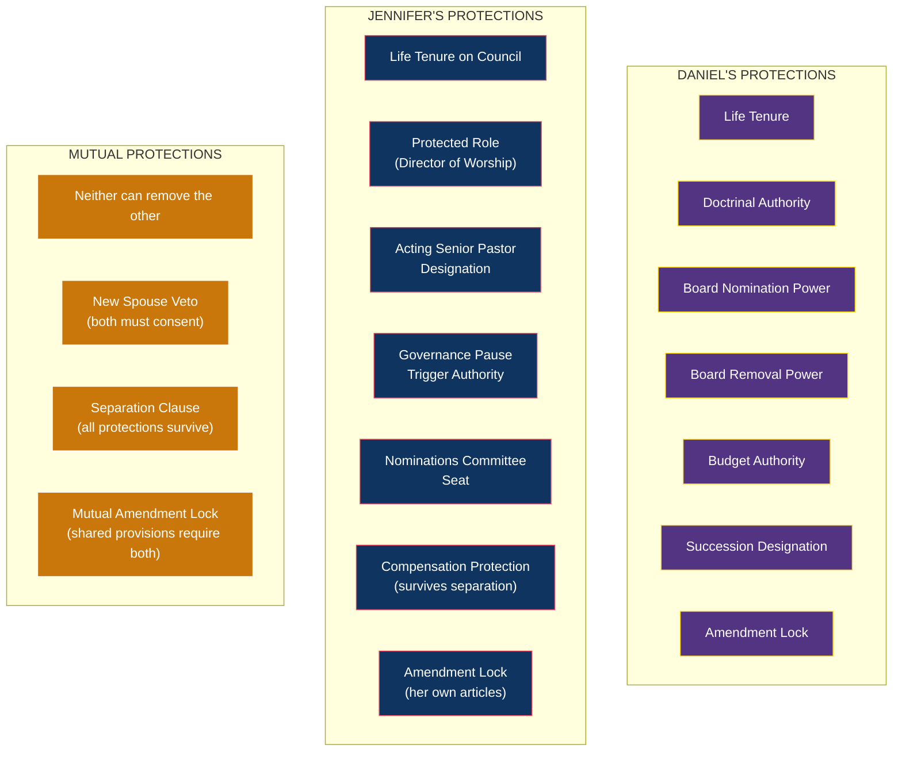

### 5A.1 Life Tenure on the Spiritual Council

> *"Jennifer Lawless, as Co-Founder, shall serve on the Spiritual Council for life or until voluntary resignation. The Co-Founder may only be removed by unanimous vote of ALL Spiritual Council members (excluding the Co-Founder) upon a documented finding of: (a) felony conviction in a court of law, (b) proven moral turpitude as determined by the Spiritual Council, or (c) permanent physical or mental incapacity certified by two licensed physicians."*

**Same standard as Daniel.** Neither co-founder can be removed by the other or by the board under normal circumstances.

### 5A.2 Protected Role

> *"Jennifer Lawless shall serve as Director of Worship & Community Life. This role, its scope, and its ministry responsibilities may not be altered, diminished, or reassigned without the Co-Founder's written consent."*

**What this means:** Jennifer's ministry area is structurally defined. It cannot be hollowed out or transferred to someone else without her agreement.

### 5A.3 Acting Senior Pastor Designation

> *"In the event of a Governance Pause (Article VIII), Jennifer Lawless shall serve as Acting Senior Pastor for the duration of the pause. This designation is structural and survives any change in marital status between the Senior Pastor and the Co-Founder. The Acting Senior Pastor exercises the operational authority of the Senior Pastor but does not acquire the Senior Pastor's structural protections under Article II."*

### 5A.4 Governance Pause Trigger

> *"The Co-Founder may invoke a Governance Pause by filing a written Concern with the Spiritual Council. The pause takes effect upon the concurrence of two (2) independent council members. This trigger authority survives any change in marital status."*

### 5A.5 Compensation Protection

> *"The Co-Founder's compensation, once established by the Compensation Committee, shall not be reduced, suspended, or terminated based on any change in marital status between the Senior Pastor and the Co-Founder. The Compensation Committee shall review the Co-Founder's compensation on the same annual basis as all other staff, based on her role and church revenue, without regard to her marital status."*

### 5A.6 Consultation Right

> *"The Senior Pastor shall consult with the Co-Founder on matters of worship, community ministry, and congregational care before issuing doctrinal determinations in those areas. This consultation is advisory — the Senior Pastor retains final doctrinal authority. The consultation requirement may not be waived or eliminated without the Co-Founder's written consent."*

### 5A.7 Amendment Lock

> *"No amendment to Article [X] (Co-Founder Protections) of these bylaws shall be valid without the prior written consent of the Co-Founder. This provision itself may not be amended without the Co-Founder's consent."*

### 5A.8 The Separation Clause

> *"In the event that the Senior Pastor and the Co-Founder are no longer married, all governance provisions, council seats, protected roles, authority, compensation, and structural protections of each shall continue unaltered. Neither party may invoke the other's removal based on change in marital status. The Co-Founder's Acting Senior Pastor designation, governance pause trigger authority, Nominations Committee seat, consultation right, and amendment lock shall survive any change in marital status. This provision may not be amended without the written consent of both the Senior Pastor and the Co-Founder."*

**What changes if Daniel and Jennifer separate:**

| Element | Before Separation | After Separation |
|---|---|---|
| Jennifer's council seat | Life tenure | **Still life tenure** |
| Jennifer's role | Director of Worship | **Unchanged — protected** |
| Jennifer's compensation | Set by Comp Committee | **Continues — based on role, not marital status** |
| Jennifer's Acting Senior Pastor | Active | **Still active** |
| Jennifer's pause trigger | Can invoke + 2 independents | **Same — not marriage-dependent** |
| Jennifer's vote on Daniel's comp | Recuses (shared household) | **Now votes — separate households** |
| Daniel's ability to remove Jennifer | Cannot | **Still cannot** |
| Jennifer's ability to remove Daniel | Cannot | **Still cannot** |
| No intra-board relationship rule | Exception for Daniel/Jennifer marriage | **Exception terminates — both subject to rule** |
| New spouse veto | Dormant | **Active — both must consent to other's new partner** |

---

## 5B. The Governance Pause (Circuit Breaker)

The Governance Pause is a temporary mechanism where operational authority transfers from the Senior Pastor to the Co-Founder (Acting Senior Pastor) and the Spiritual Council. The Senior Pastor retains all structural protections. The purpose is rest, reflection, accountability, and course-correction.

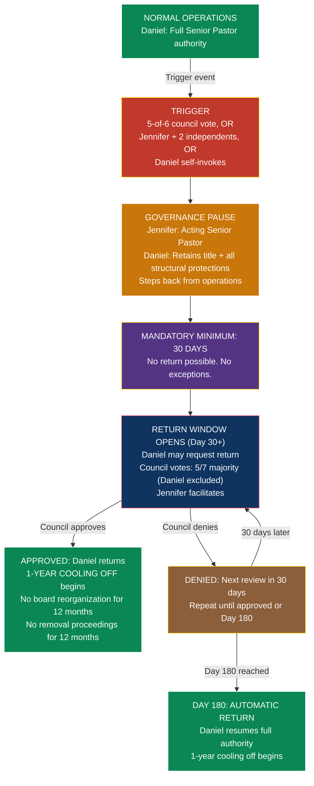

### Pause Parameters

| Parameter | Value |
|---|---|
| **Minimum duration** | 30 days — cannot be shortened by anyone, including Daniel |
| **Maximum duration** | 180 days — Daniel automatically returns regardless of vote |
| **Authority transfers to** | Jennifer Lawless (Acting Senior Pastor) |
| **Return decision** | Council votes: 5/7 majority, Daniel excluded from vote. Jennifer facilitates and votes. |
| **Review cycle** | Every 30 days after minimum period, until return approved or 180-day cap |
| **Post-return freeze** | 12 months — Daniel cannot remove or reorganize council members |
| **Maximum pauses per year** | 2 |
| **Maximum cumulative days per year** | 180 |

### What Jennifer CAN Do as Acting Senior Pastor

- Chair Spiritual Council meetings
- Make operational decisions (programs, hiring, day-to-day ministry)
- Approve spending within Daniel's normal authority ($50K per transaction)
- Lead or delegate worship services
- Represent the church on LBS board seat and LBC advisory board
- Bring a motion to the council for Daniel's return (after 30 days)

### What Jennifer CANNOT Do as Acting Senior Pastor

- Amend bylaws or protected articles
- Designate a successor Senior Pastor
- Remove council members
- Create new council seats or expand the board
- Change the Statement of Faith
- Alter Daniel's compensation
- Make the pause permanent or extend beyond 180 days

### Reciprocal Pause (Jennifer)

The same governance pause mechanism applies to Jennifer's operational authority. If Jennifer needs to step back:
- Council (5 of 6, excluding Jennifer) can invoke a pause on her Director of Worship duties
- Daniel or another council member assumes her operational responsibilities temporarily
- Same 30-180 day window, same 1-year cooling off on return
- Symmetry ensures both co-founders are subject to the same accountability

### Fallback — If Both Co-Founders Are Unable to Serve

> *"If the Acting Senior Pastor is unable or unwilling to serve during a Governance Pause, the Spiritual Council shall elect an Acting Chair from among its remaining members by majority vote. The Compensation Committee Chair (currently Sydney Griffith) shall serve as interim Acting Chair until the council elects."*

---

## 6. Council Roles — Detailed

Each council member holds a genuine ministry role with real responsibilities. These are not ceremonial titles.

### 6.1 Jennifer Lawless — Co-Founder, Director of Worship & Community Life

| Attribute | Detail |
|---|---|
| **Council Seat** | Seat 2 — **Co-Founder (Life Tenure)** |
| **Relationship** | Daniel's wife and Co-Founder of the Church of the Living Light |
| **Ministry Role** | Leads worship services, manages congregation community, oversees women's ministry, plans community events |
| **Structural Protections** | Life tenure on council (same standard as Senior Pastor — unanimous + extreme trigger to remove). Protected role (Director of Worship). Acting Senior Pastor designation during Governance Pause. Governance Pause trigger authority. Compensation protection surviving any change in marital status. Own amendment lock on co-founder provisions. Nominations Committee member. See Section 5A for full details. |
| **Responsibilities** | Weekly worship planning, congregational pastoral care, community outreach coordination, small group ministry. During a Governance Pause: assumes all operational authority of the Senior Pastor (see Section 5B). |
| **Compensation** | Set by Compensation Committee (Sydney, Iryna, Angelina). Reasonable for role. Separate from Daniel's package. Protected — cannot be reduced as retaliation for triggering a Governance Pause or exercising any co-founder right. |
| **Recusal** | Recuses from votes on Daniel's compensation (shared household benefit, if married). Votes on all other matters. |

### 6.2 Timothy Lawless — Director of Operations & Administration / Church Treasurer

| Attribute | Detail |
|---|---|
| **Council Seat** | Seat 3 |
| **Relationship** | Daniel's brother |
| **Ministry Role** | Manages church operations, finances, facilities, administration. Serves as Church Treasurer. |
| **Responsibilities** | Financial oversight, vendor management, facility maintenance, compliance calendar, banking relationships, bookkeeping oversight |
| **Compensation** | Set by Compensation Committee. Reasonable for role. |
| **Special Authority** | Co-signatory on church bank accounts (with Sydney Griffith or Nancy Courchesne). Chairs Finance Committee. |
| **Recusal** | Recuses from votes on own compensation. Votes on all other matters including Daniel's compensation (separate household). |

**Note on Timothy's compensation vote for Daniel:** Timothy is a "disqualified person" under IRC 4958 (sibling of person with substantial influence). However, the Compensation Committee (Sydney, Iryna, Angelina) makes the compensation determination. Timothy does NOT sit on the Compensation Committee. Timothy votes on general council matters only. This preserves the rebuttable presumption.

### 6.3 Nancy Courchesne — Director of Outreach & Programs / Church Secretary

| Attribute | Detail |
|---|---|
| **Council Seat** | Seat 4 |
| **Relationship** | Wife of Nicholas Courchesne (Light Brands co-founder, 30% PPA holder). Represents the Courchesne family interest on the council. |
| **Ministry Role** | Manages outreach programs, strategic partnerships, external mission work. Serves as Church Secretary (official record-keeper). |
| **Responsibilities** | Program development, mission trip coordination, strategic partnerships, community outreach, council meeting minutes, record-keeping, maintaining bylaws and resolutions |
| **Compensation** | Council service is voluntary or nominal stipend. If compensated in future, set by Compensation Committee. |
| **Special Authority** | Official record-keeper. Maintains council minutes, resolutions, and bylaws. Co-signatory on PPA Distribution Account (with Timothy). |
| **Comp Committee** | **NOT on Compensation Committee** — excluded due to IRC 4958 spousal attribution from Nicholas (co-founder with substantial influence). Votes on all other council matters. |

**Why Nancy as Secretary strengthens governance:** Having a non-Lawless-family member maintain official church records adds credibility. The IRS sees that meeting minutes, compensation resolutions, and financial decisions are documented by someone outside the immediate Lawless family — reducing any appearance that records are self-serving. Nancy's connection to the Courchesne family interest also provides a governance check — she has a vested interest in proper documentation because her family's PPAs depend on the same entities.

### 6.4 Sydney Griffith — Council Member, Compensation Committee Chair

| Attribute | Detail |
|---|---|
| **Council Seat** | Seat 6 |
| **Relationship** | Independent — close friend of Daniel (not a family member under IRC 4958) |
| **Ministry Role** | Council governance + **Compensation Committee Chair.** Leads all compensation deliberations. Presents comparable data. Chairs annual reviews for all church staff compensation. |
| **Responsibilities** | Leads Compensation Committee (annual review, comparable data analysis, documented deliberations), council governance, program review, Nominations Committee member |
| **Compensation** | Council service is voluntary or nominal stipend. If compensated, amount set by the other two Compensation Committee members (Iryna + Angelina) — Sydney recuses from votes on her own compensation. |
| **Independence** | No family relationship with Daniel. No financial interest in Light Brands or TE entities. Genuinely independent for 26 CFR 53.4958-6 purposes. |

### 6.5 Jason Sparks — Associate Pastor (If Options C/D)

| Attribute | Detail |
|---|---|
| **Council Seat** | None initially — can be added as Seat 8 if council expands. Advisory role. |
| **Ministry Role** | Associate Pastor. Assists Senior Pastor in ministry. Focuses on [specific ministry area TBD]. |
| **Responsibilities** | Preaching rotation, ministry content creation, community engagement, [specific programs] |
| **Compensation** | Set by Compensation Committee. Proportionate to ministry role (~1/3 of Daniel's, reflecting 10% vs 30% PPA). |
| **PPA** | 10% PPA in LBS + LBC irrevocably assigned to church (same as Daniel's 30%). |

---

## 7. The Compensation Committee — IRS Compliance Engine

This is the most critical governance body for tax purposes. It must operate flawlessly.

```mermaid
graph TB
    subgraph "REBUTTABLE PRESUMPTION PROCESS (26 CFR 53.4958-6)"
        S1["STEP 1: GATHER COMPARABLE DATA<br/>Copeland, Osteen, Creflo Dollar,<br/>NACBA surveys, ERI database"]
        S2["STEP 2: EXCLUDE AFFECTED PERSON<br/>Daniel leaves the room.<br/>Only Sydney, Iryna, Angelina present."]
        S3["STEP 3: INDEPENDENT DELIBERATION<br/>Committee reviews comparables,<br/>discusses total package value,<br/>considers church revenue + size."]
        S4["STEP 4: MAJORITY VOTE<br/>2-of-3 approves compensation.<br/>Salary + housing + retirement + assets."]
        S5["STEP 5: DOCUMENT EVERYTHING<br/>Written resolution with:<br/>amount, comparable data cited,<br/>rationale, who was present."]
        S6["STEP 6: FILE WITH SECRETARY<br/>Nancy Courchesne files minutes<br/>within 60 days. Contemporaneous."]
        RESULT["REBUTTABLE PRESUMPTION ACHIEVED<br/>Burden shifts to IRS to prove<br/>compensation is unreasonable."]
    end

    S1 --> S2 --> S3 --> S4 --> S5 --> S6 --> RESULT

    style S1 fill:#0a8754,stroke:#fff,color:#fff
    style S2 fill:#c9770a,stroke:#fff,color:#fff
    style S3 fill:#0f3460,stroke:#e94560,color:#fff
    style S4 fill:#0f3460,stroke:#e94560,color:#fff
    style S5 fill:#533483,stroke:#ffd700,color:#fff
    style S6 fill:#533483,stroke:#ffd700,color:#fff
    style RESULT fill:#0a8754,stroke:#ffd700,color:#fff
```

### 7.1 Composition

| Member | Role | Independence |
|---|---|---|
| **Sydney Griffith (Chair)** | Leads compensation deliberations, presents comparable data, chairs annual reviews | No family ties to Daniel (close friend, not family under IRC 4958). No Light Brands / TE financial interest. Genuinely independent. |
| **Iryna Voitenko** | Reviews compensation, participates in deliberations | No family ties to Daniel. No Light Brands / TE financial interest. Genuinely independent. |
| **Angelina Adelaide** | Reviews compensation for reasonableness | No family ties to Daniel. No Light Brands / TE financial interest. Genuinely independent. |

**Three members, all genuinely independent.** No family members. No church employees. No co-founders. No one with any financial interest affected by compensation decisions. Decisions by **2-of-3 majority vote**. Nancy Courchesne is deliberately excluded from this committee due to spousal attribution from Nicholas Courchesne (co-founder) — she serves the church as Director/Secretary instead.

### 7.2 Process (26 CFR 53.4958-6 Rebuttable Presumption)

The Compensation Committee must follow this exact process for every compensation decision:

| Step | Action | Documentation |
|---|---|---|
| **1. Comparable Data** | Committee obtains compensation data from comparable organizations (churches of similar size, revenue, and mission) | Written summary of data sources: Copeland Ministries, Lakewood Church, other megachurch compensation surveys, ERI Nonprofit Salary Database |
| **2. Independent Deliberation** | Committee meets without the Senior Pastor (or any person whose compensation is being reviewed) present | Meeting minutes documenting who was present, who was excluded, and the deliberation |
| **3. Decision** | Committee determines compensation amount based on comparables | Written resolution stating the amount, the comparable data relied upon, and the rationale |
| **4. Documentation** | All of the above is documented in contemporaneous meeting minutes | Minutes filed with Church Secretary within 60 days |

**If this process is followed, there is a REBUTTABLE PRESUMPTION that the compensation is reasonable.** The IRS must prove it's unreasonable — the burden shifts to them.

### 7.3 What Compensation Covers

The Compensation Committee reviews and approves ALL of the following for each minister:

| Component | Notes |
|---|---|
| **Minister salary** | Cash salary, taxable as ordinary income |
| **Housing allowance designation (IRC 107)** | Amount designated as housing — must be prospective (before the tax year). Tax-free. |
| **Retirement plan contributions** | 403(b)(9) employer contributions, 457(b), 457(f) deferred comp |
| **Church-owned assets used by minister** | Parsonage, vehicles, technology, travel — committee approves each asset acquisition |
| **Discretionary spending authority** | Any church funds used for minister's benefit |
| **Total package value** | Sum of all above. Committee reviews total against comparables. |

### 7.4 Comparable Data Sources

| Source | What It Shows |
|---|---|
| Kenneth Copeland Ministries | $7M church-owned parsonage, private jets, extensive minister compensation. Survived Congressional investigation. |
| Joel Osteen / Lakewood Church | $10.5M residence, $200K+ salary, book revenue channeled through church |
| Creflo Dollar / World Changers | $2.5M residence, $69M Gulfstream (donor-funded) |
| National Association of Church Business Administration (NACBA) | Annual compensation survey by church size/revenue |
| Evangelical Council for Financial Accountability (ECFA) | Compensation benchmarks |
| ERI Nonprofit Compensation Database | Searchable salary data by role, org size, location |

**The comparable data justifies large packages.** If Copeland's church provides a $7M parsonage, Daniel's church providing a $500K-1M parsonage is conservative by comparison.

---

## 8. Financial Controls

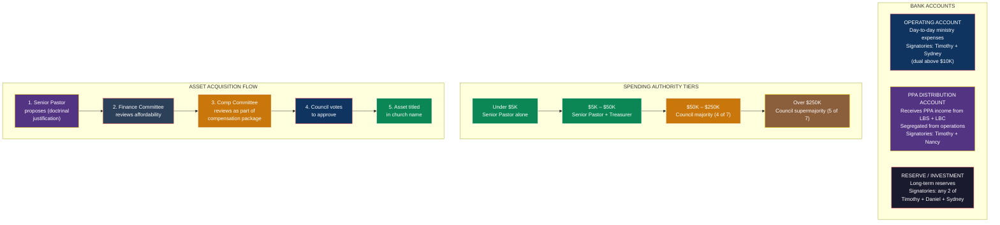

### 8.1 Bank Accounts

| Account | Signatories | Purpose |
|---|---|---|
| **Operating Account** | Timothy Lawless (Treasurer) + Sydney Griffith (Comp Committee Chair, dual signature above $[10,000]) | Day-to-day ministry expenses |
| **PPA Distribution Account** | Timothy Lawless (Treasurer) + Nancy Courchesne (Secretary, dual signature) | Receives PPA distributions from LBS and LBC. Segregated from operating funds. |
| **Reserve / Investment Account** | Timothy Lawless (Treasurer) + Daniel Lawless + Sydney Griffith (any two of three) | Long-term reserves, investment of surplus funds |

### 8.2 Spending Authority

| Amount | Authorization Required |
|---|---|
| Under $5,000 | Senior Pastor alone |
| $5,000 - $50,000 | Senior Pastor + Timothy Lawless (Treasurer) |
| $50,000 - $250,000 | Spiritual Council majority vote |
| Over $250,000 | Spiritual Council supermajority (5 of 7) |

### 8.3 Asset Acquisition Process

For church-owned assets used by ministers (parsonage, vehicles, technology):

1. Senior Pastor proposes acquisition to Spiritual Council (doctrinal justification: ministry use)
2. Finance Committee reviews affordability and funding source
3. Compensation Committee reviews whether the asset constitutes part of minister compensation (it does — include in total package comparables analysis)
4. Spiritual Council votes to approve (family majority)
5. Asset titled in church name
6. Minister use documented (ministry purpose log)

---

## 9. Church Revenue Streams

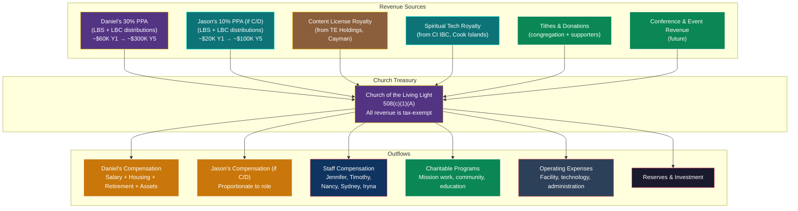

### Revenue Projections

| Revenue Source | Y1 | Y3 | Y5 | UBIT Status |
|---|---|---|---|---|
| Daniel's PPA distributions (30% LBS + LBC) | ~$60,000 | ~$150,000 | ~$300,000 | Exempt — IRC 512(b)(2) |
| Jason's PPA distributions (10% LBS + LBC) | ~$20,000 | ~$50,000 | ~$100,000 | Exempt — IRC 512(b)(2) |
| Content license royalty (TE Holdings) | ~$10,000 | ~$30,000 | ~$75,000 | Exempt — IRC 512(b)(2) |
| Spiritual tech royalty (CI IBC) | ~$10,000 | ~$25,000 | ~$50,000 | Exempt — IRC 512(b)(2) |
| Tithes & donations | ~$10,000 | ~$50,000 | ~$100,000 | Exempt — donations |
| Conference/event revenue | ~$0 | ~$10,000 | ~$50,000 | Exempt if related to mission |
| **Total church revenue** | **~$110,000** | **~$315,000** | **~$675,000** | **100% tax-exempt** |

**This revenue base supports the minister compensation packages.** The Compensation Committee uses total church revenue as context when setting compensation — as revenue grows, compensation can grow proportionally.

---

## 10. Daniel's Visibility Across the Full Structure

The "invisible founder" model — Daniel's connections to the entire corporate ecosystem:

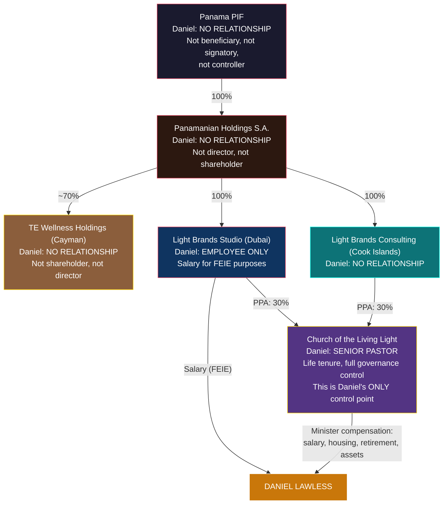

| Entity | Daniel's Role | Visible? | Control? |
|---|---|---|---|
| Panama PIF | None — excluded as beneficiary | Invisible | None |
| Panamanian Holdings S.A. | None | Invisible | None |
| TE Wellness Holdings (Cayman) | None | Invisible | None |
| Light Brands Studio (Dubai) | Employee (executive role, salary) | **Visible as employee only** | None (no ownership, no directorship) |
| Light Brands Consulting (Cook Islands) | None | Invisible | None |
| **Church of the Living Light** | **Senior Pastor, Chairman, Founder** | **Visible — this is Daniel's entity** | **Total control via bylaws** |

**The church is Daniel's sole control point.** It is the only entity where Daniel has authority. All economic flows to Daniel come either from LBS (salary, for FEIE) or from the church (minister compensation). The church itself receives revenue from PPAs and royalties — contractual flows from entities Daniel does not own, direct, or control.

---

## 11. Bylaws Framework — Key Articles

The following provisions must be drafted by the religious nonprofit attorney and incorporated into the church's founding bylaws. These are the structural protections.

```mermaid
graph TB
    subgraph "BYLAWS STRUCTURE"
        A1["ARTICLE I<br/>Name & Purpose<br/>Statement of Faith"]
        A2["ARTICLE II<br/>SENIOR PASTOR<br/>Life tenure, doctrinal authority,<br/>nomination, budget, succession"]
        A2A["ARTICLE IIA<br/>CO-FOUNDER PROTECTIONS<br/>Jennifer: life tenure, protected role,<br/>Acting Senior Pastor, separation clause"]
        A2B["ARTICLE IIB<br/>GOVERNANCE PAUSE<br/>30-180 day circuit breaker,<br/>Jennifer assumes authority,<br/>council votes on return"]
        A3["ARTICLE III<br/>SPIRITUAL COUNCIL<br/>7 members, quorum, voting,<br/>5/7 for-cause removal,<br/>relationship prohibition,<br/>new spouse veto"]
        A4["ARTICLE IV<br/>COMPENSATION COMMITTEE<br/>3 independents, majority vote,<br/>rebuttable presumption process"]
        A5["ARTICLE V<br/>FINANCIAL MANAGEMENT<br/>Treasurer, bank accounts,<br/>budget, audit"]
        A6["ARTICLE VI<br/>PROPERTY & ASSETS<br/>Church title, minister use,<br/>dissolution clause"]
        A7["ARTICLE VII<br/>AMENDMENTS<br/>2/3 vote general,<br/>protected articles locked"]
    end

    LOCK_D["DANIEL'S AMENDMENT LOCK<br/>Articles II, IIB, IV §4, and VII §2<br/>CANNOT be amended without<br/>Senior Pastor's written consent"]

    LOCK_J["JENNIFER'S AMENDMENT LOCK<br/>Article IIA and §4.8<br/>CANNOT be amended without<br/>Co-Founder's written consent"]

    LOCK_M["MUTUAL AMENDMENT LOCK<br/>§4.7, §4.8 (relationship rule +<br/>new spouse veto) require BOTH<br/>co-founders' written consent"]

    A2 -.->|"PROTECTED"| LOCK_D
    A2B -.->|"PROTECTED"| LOCK_D
    A4 -.->|"PROTECTED"| LOCK_D
    A7 -.->|"SELF-PROTECTING"| LOCK_D
    A2A -.->|"PROTECTED"| LOCK_J
    A3 -.->|"§4.7/4.8"| LOCK_M

    style A1 fill:#2d4059,stroke:#ea5455,color:#fff
    style A2 fill:#533483,stroke:#ffd700,color:#fff
    style A2A fill:#0f3460,stroke:#e94560,color:#fff
    style A2B fill:#0f3460,stroke:#e94560,color:#fff
    style A3 fill:#0f3460,stroke:#e94560,color:#fff
    style A4 fill:#c9770a,stroke:#fff,color:#fff
    style A5 fill:#2d4059,stroke:#ea5455,color:#fff
    style A6 fill:#2d4059,stroke:#ea5455,color:#fff
    style A7 fill:#8b5e3c,stroke:#ffd700,color:#fff
    style LOCK_D fill:#c0392b,stroke:#ffd700,color:#fff
    style LOCK_J fill:#c0392b,stroke:#ffd700,color:#fff
    style LOCK_M fill:#c0392b,stroke:#ffd700,color:#fff
```

### Article I: Name and Purpose

- Church of the Living Light
- Purpose: spiritual wellness, healing ministry, community service, education, charitable work
- Statement of Faith: [to be drafted — defines the church's theology and spiritual mission]

### Article II: Senior Pastor

- **Section 1 — Appointment:** Daniel Lawless is the founding Senior Pastor.
- **Section 2 — Tenure:** Life tenure. Serves until voluntary resignation, death, or incapacity.
- **Section 3 — Removal:** Only by unanimous vote of all Spiritual Council members (excluding Senior Pastor) upon documented finding of felony conviction, proven moral turpitude, or permanent incapacity certified by two physicians.
- **Section 4 — Doctrinal Authority:** Senior Pastor is sole and final authority on all matters of doctrine, theology, spiritual direction, ministry vision, and interpretation of the Statement of Faith. No council resolution, committee decision, or congregational vote may override.
- **Section 5 — Nomination Power:** All nominations to the Spiritual Council originate from the Senior Pastor. Senior Pastor has veto on all appointments.
- **Section 6 — Budget Authority:** Senior Pastor proposes annual budget. Authorized to approve expenditures within budget up to $[50,000] per transaction.
- **Section 7 — Succession:** Senior Pastor designates successor by written instrument. Council ratifies by majority vote.

### Article IIA: Co-Founder Protections (Jennifer Lawless)

- **Section 1 — Recognition:** Jennifer Lawless is recognized as Co-Founder of the Church of the Living Light with permanent, irrevocable protections.
- **Section 2 — Life Tenure:** Jennifer shall serve on the Spiritual Council for life or until voluntary resignation. Removal requires unanimous vote of all other members upon documented finding of felony conviction, proven moral turpitude, or permanent incapacity certified by two physicians (same standard as Senior Pastor).
- **Section 3 — Protected Role:** Jennifer holds the title of Director of Worship & Community Life. This role, title, and council seat may not be eliminated, merged, or made redundant.
- **Section 4 — Acting Senior Pastor:** During any Governance Pause (Article IIB), Jennifer assumes the operational authority of the Senior Pastor.
- **Section 5 — Governance Pause Trigger:** Jennifer may call for a Governance Pause vote by the council (see Article IIB).
- **Section 6 — Compensation Protection:** Jennifer's compensation may not be reduced as retaliation for triggering a Governance Pause or exercising any co-founder right.
- **Section 7 — Nominations Committee:** Jennifer holds a permanent seat on the Nominations Committee.
- **Section 8 — Separation Clause:** All co-founder protections survive any change in the marital status of the Senior Pastor and the Co-Founder. Governance provisions are independent of personal relationships.
- **Section 9 — Amendment Lock:** No provision of this Article may be amended without Jennifer's prior written consent. This section protects itself.

### Article IIB: Governance Pause (Circuit Breaker)

- **Section 1 — Trigger:** Any council member (including Jennifer or Daniel himself) may call for a Governance Pause vote. Requires 4/7 council vote to invoke.
- **Section 2 — Duration:** Minimum 30 days. Maximum 180 days. Duration set by council vote at invocation.
- **Section 3 — Authority Transfer:** During a Governance Pause, Jennifer Lawless (Co-Founder) assumes all operational authority of the Senior Pastor, including budget authority, staff direction, and ministry operations. She does NOT assume doctrinal authority, board nomination power, amendment consent rights, or succession designation.
- **Section 4 — Return:** The council votes on the Senior Pastor's return after the minimum period has elapsed. Requires 4/7 council vote to end the pause. Daniel does not vote on his own return.
- **Section 5 — Post-Return Cooling Off:** For one (1) year following the end of a Governance Pause, the Senior Pastor may not initiate removal proceedings against any council member (exception: criminal conduct or breach of fiduciary duty), may not propose bylaw amendments, and may not reorganize committee assignments.
- **Section 6 — Reciprocal Pause:** The same mechanism applies to Jennifer if the council votes to invoke a pause for her. During Jennifer's pause, Daniel retains his authority and a temporary Acting Director of Worship is elected by the council.
- **Section 7 — Fallback:** If both co-founders are unable to serve simultaneously, the Compensation Committee Chair (currently Sydney Griffith) serves as interim Acting Chair until the council elects an Acting Chair by majority vote.
- **Section 8 — Amendment Lock:** No provision of this Article may be amended without the Senior Pastor's prior written consent.

### Article III: Spiritual Council

- **Section 1 — Composition:** Seven (7) members including the Senior Pastor and the Co-Founder.
- **Section 2 — Co-Founders:** Daniel Lawless (Senior Pastor) and Jennifer Lawless (Co-Founder) have life tenure. See Articles II and IIA.
- **Section 3 — Other Members:** Nominated by Senior Pastor via Nominations Committee. Confirmed by majority council vote. Three-year renewable terms.
- **Section 4 — Removal (Non-Founder Members):** Supermajority of five (5) of seven (7) members required. For cause only — enumerated causes per Section 4.6 of the governance framework. The member being removed does not vote (5 of 6 voting members must agree).
- **Section 5 — Quorum:** Four (4) of seven (7) members.
- **Section 6 — Voting:** Simple majority for ordinary business. Supermajority (5 of 7) for: removal of a member, sale of property valued over $[250,000], incurrence of debt over $[100,000], amendments to bylaws.
- **Section 7 — Relationship Prohibition:** No two council members may be in a romantic relationship with each other, except the Co-Founders' marriage at formation (exception terminates upon divorce). See Section 4.7.
- **Section 8 — New Spouse Veto:** No spouse or romantic partner of either Co-Founder may join the council without both Co-Founders' written consent. See Section 4.8. This provision requires both Co-Founders' consent to amend.

### Article IV: Compensation Committee

- **Section 1 — Composition:** Three (3) independent council members (Sydney Griffith, Chair; Iryna Voitenko; Angelina Adelaide). Decisions by majority vote (2-of-3). No family members. No church employees. No co-founders or PPA holders. No spouses of co-founders or PPA holders.
- **Section 2 — Authority:** Sole authority to set compensation for all church staff, including Senior Pastor, Associate Pastor, and family staff members.
- **Section 3 — Process:** Must follow 26 CFR 53.4958-6 rebuttable presumption process: (a) obtain comparable data, (b) deliberate without the affected person present, (c) document decision in contemporaneous meeting minutes.
- **Section 4 — Annual Review:** Reviews all compensation packages annually before the start of each fiscal year.
- **Section 5 — Housing Allowance:** Designates housing allowance amounts annually, prospectively, before the tax year.

### Article V: Financial Management

- **Section 1 — Fiscal Year:** Calendar year (January 1 - December 31).
- **Section 2 — Treasurer:** Timothy Lawless (Director of Operations) serves as Treasurer.
- **Section 3 — Bank Accounts:** Dual signature required above $[10,000].
- **Section 4 — Annual Budget:** Proposed by Senior Pastor, approved by council majority.
- **Section 5 — Audit:** Internal financial review annually. Independent audit when annual revenue exceeds $[500,000].

### Article VI: Property and Assets

- **Section 1 — Church-Owned Assets:** All property acquired by the church is titled in the church's name.
- **Section 2 — Minister Use:** Church-owned assets may be provided to ministers for ministry use. Ministry use must be documented.
- **Section 3 — Asset Acquisition:** See Section 8.3 above (council approval process).
- **Section 4 — Dissolution:** Upon dissolution, all assets distributed to one or more 501(c)(3) or 508(c)(1)(A) organizations as determined by the Spiritual Council. No assets may be distributed to any individual.

### Article VII: Amendments

- **Section 1 — General Amendments:** Require 2/3 council vote.
- **Section 2 — Senior Pastor Protected Articles:** No amendment to Article II (Senior Pastor), Article IIB (Governance Pause), Article IV Section 4 (Doctrinal Authority), or Article VII Sections 2-4 (this provision) shall be valid without the prior written consent of the Senior Pastor.
- **Section 3 — Co-Founder Protected Articles:** No amendment to Article IIA (Co-Founder Protections) shall be valid without the prior written consent of the Co-Founder (Jennifer Lawless).
- **Section 4 — Mutual Protected Provisions:** No amendment to Article III Sections 7-8 (Relationship Prohibition, New Spouse Veto) shall be valid without the prior written consent of BOTH the Senior Pastor AND the Co-Founder.

---

## 12. Who Daniel Needs to Appoint — Summary Checklist

### Immediate Appointments (Formation)

| # | Position | Person | Action Required |
|---|---|---|---|
| 1 | **Senior Pastor & Chairman** | **Daniel Lawless** | Named in founding bylaws |
| 2 | **Director of Worship & Community Life** | **Jennifer Lawless** | Named in founding bylaws as council member |
| 3 | **Director of Operations & Treasurer** | **Timothy Lawless** | Named in founding bylaws as council member |
| 4 | **Director of Outreach & Secretary** | **Nancy Courchesne** | Named in founding bylaws as council member. NOT on Compensation Committee (spousal attribution from Nicholas). |
| 5 | **Council Member, Compensation Committee** | **Iryna Voitenko** | Confirm availability and willingness to serve. Independence verified. |
| 6 | **Compensation Committee Chair** | **Sydney Griffith** | Named in founding bylaws as council member. Independence verified. Chairs Compensation Committee with Iryna + Angelina. |
| 7 | **Compensation Committee Member** | **Angelina Adelaide** | Confirm availability and willingness to serve. Independence verified. |

### Independence Requirements for Compensation Committee (Sydney + Iryna + Angelina)

All three Compensation Committee members must satisfy ALL of the following:

| Requirement | Sydney Griffith | Iryna Voitenko | Angelina Adelaide |
|---|---|---|---|
| **Not a family member of Daniel** | ✓ (not family — close friend) | ✓ | ✓ |
| **Not an employee of the church** | ✓ | ✓ | ✓ |
| **No financial interest in Light Brands / TE entities** | ✓ | ✓ | ✓ |
| **No financial interest affected by Daniel's compensation** | ✓ | ✓ | ✓ |
| **Willingness to serve genuinely** | Confirm | Confirm | Confirm |
| **Comfortable approving Copeland-scale compensation when supported by comparables** | Confirm | Confirm | Confirm |

**Nancy Courchesne** is NOT on the Compensation Committee. As the wife of Nicholas Courchesne (Light Brands co-founder with 30% PPAs in LBS/LBC), she is a disqualified person under IRC 4958 through spousal attribution. She serves the church in an operational role (Director of Outreach / Secretary) where her knowledge of the Courchesne family interest is valuable without creating any independence concerns.

### Formation Documents Needed

| # | Document | Prepared By | Priority |
|---|---|---|---|
| 1 | **Articles of Incorporation** | Religious nonprofit attorney | Critical |
| 2 | **Bylaws (with all protections from Section 11)** | Religious nonprofit attorney | Critical |
| 3 | **Statement of Faith** | Daniel + counsel | Critical |
| 4 | **Organizational Meeting Minutes** | Nancy Courchesne (Secretary) | Critical |
| 5 | **EIN Application (Form SS-4)** | Attorney or Daniel | Critical |
| 6 | **Compensation Committee Charter** | Attorney | Critical |
| 7 | **Initial Compensation Resolutions** | Compensation Committee | Before first tax year |
| 8 | **Housing Allowance Designation** | Compensation Committee | Before first tax year |
| 9 | **PPA Assignment Agreement (Daniel → Church)** | Attorney | With PPA execution |
| 10 | **PPA Assignment Agreement (Jason → Church)** | Attorney | If Jason chooses Option C/D |
| 11 | **Bank Account Opening Documents** | Timothy Lawless (Treasurer) | Within 30 days of EIN |
| 12 | **Church Audit Procedures Manual** | Internal | Month 2 |

---

## 13. Family Compensation — What's Defensible

Each family member receives compensation for their church role. The Compensation Committee (independents only) sets all compensation. Comparable data from churches of similar size supports the following ranges:

| Role | Y1 Range | Y3 Range | Y5 Range | Basis |
|---|---|---|---|---|
| **Jennifer Lawless** — Director of Worship & Community Life | $30,000-50,000 | $50,000-80,000 | $80,000-120,000 | Part-time→full-time as church grows. Comparable to worship directors at mid-size churches. |
| **Timothy Lawless** — Director of Operations & Treasurer | $40,000-60,000 | $60,000-100,000 | $100,000-150,000 | Operations/finance role. Comparable to church administrators. |
| **Nancy Courchesne** — Director of Outreach & Secretary | Voluntary / nominal | $30,000-50,000 | $50,000-80,000 | Non-Lawless-family director. Represents Courchesne family interest. Church compensation optional, set by Comp Committee. |
| **Sydney Griffith** — Compensation Committee Chair | Voluntary / nominal | $25,000-40,000 | $40,000-60,000 | Independent governance + Compensation Committee Chair. Scales as church grows. If compensated, set by Iryna + Angelina (Sydney recuses). |
| **Iryna Voitenko** — Compensation Committee | Voluntary / nominal | $20,000-35,000 | $35,000-55,000 | Independent governance + Compensation Committee. If compensated, set by Sydney + Angelina (Iryna recuses). |

**Key rules:**
- Each family member's compensation is set by the Compensation Committee (independents)
- Each must have genuine, documented ministry responsibilities
- Compensation must be reasonable for the role and church size
- Each family member recuses from votes on their own compensation
- Comparable data from NACBA salary surveys supports the ranges above

**Council members can also receive housing allowance (IRC 107) if ordained.** If Jennifer, Timothy, Nancy, Sydney, or Iryna become ordained ministers of the church, they qualify for tax-free housing allowance on the same basis as Daniel. This is a significant additional tax benefit. Counsel to advise on ordination requirements and timing.

---

## 14. IRS 14-Point Church Test

The IRS uses these 14 characteristics to determine church status. The Church of the Living Light must satisfy a majority (not all) of these:

| # | Characteristic | Church of the Living Light |
|---|---|---|
| 1 | Distinct legal existence | Yes — incorporated with articles, bylaws, EIN |
| 2 | Recognized creed and statement of faith | Yes — Statement of Faith (spiritual wellness, healing, community) |
| 3 | Definite and distinct ecclesiastical government | Yes — Senior Pastor + Spiritual Council + committees |
| 4 | Formal code of doctrine and discipline | Yes — Statement of Faith + member covenant |
| 5 | Distinct religious history | Building from formation — document origin story and doctrinal development |
| 6 | Membership not associated with any other church | Yes — distinct membership |
| 7 | Organization of ordained ministers | Yes — Senior Pastor (Daniel) + Associate Pastor (Jason, if applicable) |
| 8 | Ordained ministers selected after completing prescribed studies | Yes — ordination program with curriculum |
| 9 | Literature of its own | Yes — spiritual wellness content, devotionals, educational materials |
| 10 | Established places of worship | Yes — can be home church, rented space, or digital ministry initially |
| 11 | Regular congregations | Yes — weekly services (in-person or digital) |
| 12 | Regular religious services | Yes — weekly worship, prayer, teaching |
| 13 | Sunday schools or equivalent for young | Future — educational programs as church grows |
| 14 | Schools for preparation of ministers | Future — training programs for ministry leaders |

**Meeting 10+ of 14 is generally sufficient.** The church satisfies at least 12 from formation.

---

## 15. Bright Lines — Church Governance Rules

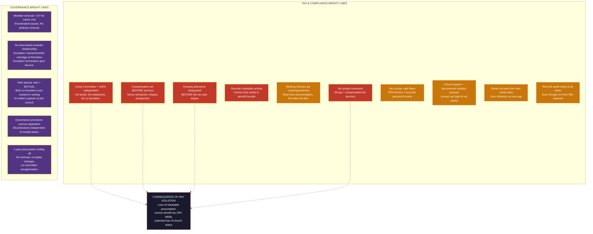

**Red = hard bright lines** (violation directly triggers IRS exposure). **Orange = operational discipline** (violation weakens defense posture). **Purple = governance bright lines** (violation undermines co-founder protections or structural integrity).

| Rule | Consequence of Violation |
|---|---|
| **Compensation Committee must be 100% independent** | Loss of rebuttable presumption. Excess benefit risk. |
| **Compensation must be set BEFORE services rendered** | IRS can recharacterize retroactive pay as distributions. |
| **Housing allowance must be designated BEFORE the tax year** | Invalid designation = fully taxable. |
| **Church must maintain genuine charitable activity** | Cannot exist solely to benefit the founder. Must have programs, community service, charitable giving proportional to revenue. |
| **Council meeting minutes must be contemporaneous** | Minutes after-the-fact lose evidentiary value. Document in real-time. |
| **No private inurement** | Church revenue cannot be distributed to individuals as "profit." All compensation must be for services rendered. |
| **No circular cash flows** | Daniel donates to church → church pays Daniel back ≠ allowed. Church revenue from PPAs/royalties → church compensates Daniel for ministry ✓ allowed. The distinction: PPA revenue is the church's independent income, not recycled personal income. |
| **Church-owned assets must have ministry purpose documented** | Annual log of ministry use for each asset (parsonage, vehicles, tech, travel). |
| **Daniel must recuse from own compensation votes** | Cannot vote on or approve own compensation package. |
| **No Form 990 required — but keep records as if one were** | Internal financial records should be audit-ready even though no public filing is required. If the IRS ever invokes Church Audit Procedures Act, records must be available. |
| **Member removal requires 5/7 for cause only** | Non-founder members cannot be removed without enumerated cause and supermajority vote. Protects council independence and prevents retaliation. |
| **No intra-board romantic relationships** | Exception only for Daniel/Jennifer marriage at formation. Exception terminates upon divorce. 30-day compliance window. Violation = grounds for removal under Section 4.6. |
| **New spouse veto is mutual** | Neither co-founder can seat a new partner without the other's written consent. Prevents board capture through personal relationships. |
| **Governance provisions survive separation** | All co-founder protections, amendment locks, and governance rights are independent of marital status. No provision lapses upon divorce. |
| **1-year post-pause cooling off** | After a Governance Pause, no removal proceedings, no bylaw amendments, and no committee reorganization for 12 months. Prevents retaliatory action. |

---

## 16. Integration with Tax Structure

This is how the church connects to the rest of the Transformational Epicenter structure:

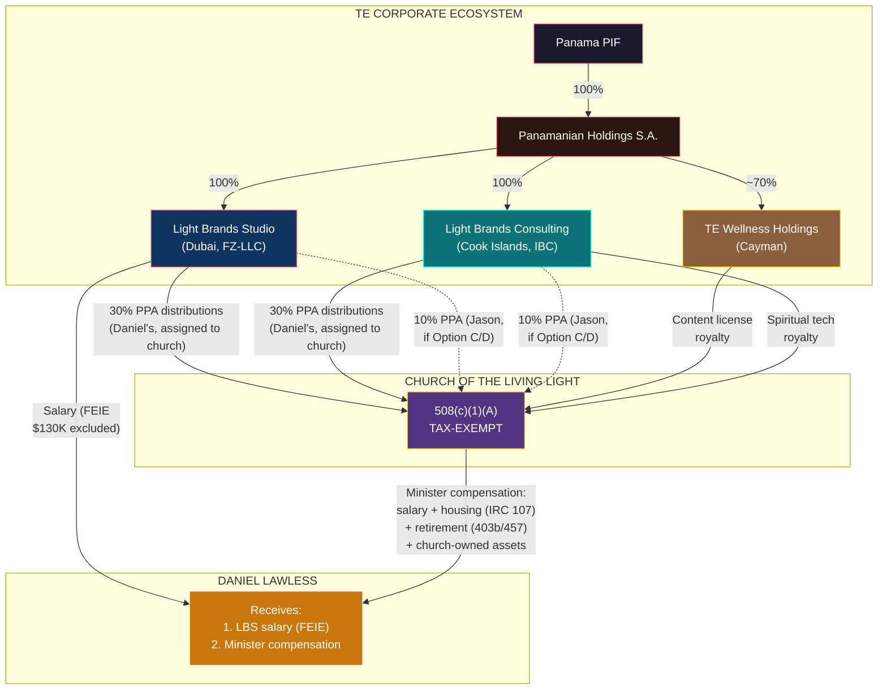

**Two income channels to Daniel:** (1) LBS salary — foreign employer, qualifies for FEIE ($130K tax-free), and (2) Church minister compensation — salary, tax-free housing, tax-deferred retirement, church-owned assets. The church's income (PPAs + royalties) flows from entities Daniel does not own or control.

| Connection | Mechanism | Document Reference |
|---|---|---|
| Church receives 30% LBS profits | PPA assigned from Daniel → Church | [10-LB-PROFIT-PARTICIPATION-FRAMEWORK.md](./10-LB-PROFIT-PARTICIPATION-FRAMEWORK.md) |
| Church receives 30% LBC profits | PPA assigned from Daniel → Church | Same |
| Church receives 10% LBS profits (if Jason C/D) | PPA assigned from Jason → Church | Same |
| Church receives 10% LBC profits (if Jason C/D) | PPA assigned from Jason → Church | Same |
| Church receives content royalty | License agreement with TE Holdings | [01-MASTER-STRUCTURE.md](./01-MASTER-STRUCTURE.md) |
| Church receives spiritual tech royalty | License agreement with CI IBC | [08-COOK-ISLANDS-IBC-DETAIL.md](./08-COOK-ISLANDS-IBC-DETAIL.md) |
| Church compensates Daniel | Minister salary, housing, retirement, assets | [03-FOUNDER-GUIDE-US.md](./03-FOUNDER-GUIDE-US.md) Part I |
| Church compensates Jason (if C/D) | Same channels, proportionate | [03-FOUNDER-GUIDE-US.md](./03-FOUNDER-GUIDE-US.md) Part II |
| Daniel employed by LBS | Separate from church — for FEIE only | [03-FOUNDER-GUIDE-US.md](./03-FOUNDER-GUIDE-US.md) Section 3 |
| Legal defense of church structure | Copeland model precedent | [02-LEGAL-DEFENSE.md](./02-LEGAL-DEFENSE.md) |
| Counsel questions for church | Q6, Q45, Q61-Q70 | [06-COUNSEL-QUESTIONS.md](./06-COUNSEL-QUESTIONS.md) |

---

## 17. Agreement Architecture — Equity Without Equity

The church's economic power comes from contractual agreements, not ownership. Each agreement must be drafted to give the church **every economic right that equity would provide** — without a single share being issued. This is what makes the entire structure work: the church acts like a 30% (or 40%) shareholder in every way that matters, while legally holding zero equity.

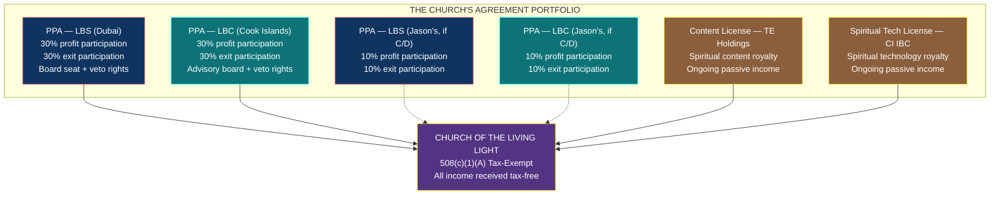

### 17.1 The Core Doctrine: Why Contracts, Not Shares

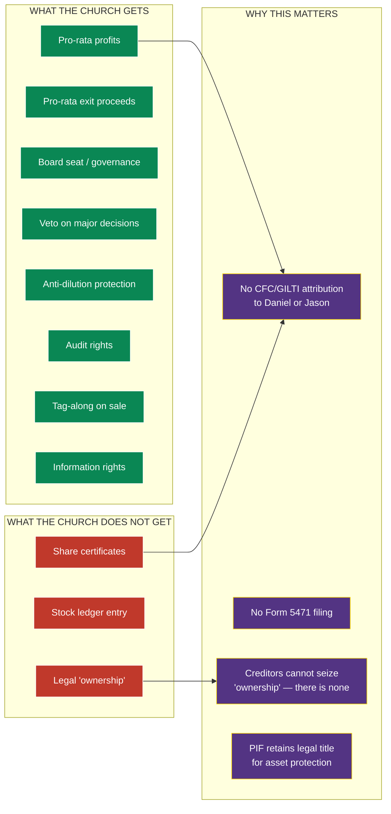

**The church gets everything equity provides except the legal label.** That missing label is what eliminates CFC/GILTI, eliminates Form 5471, and preserves the PIF's asset protection layer. The agreements must be drafted so that no court, no IRS agent, and no counterparty can argue the church is being shortchanged — or that the arrangements are really "equity in disguise" for attribution purposes.

### 17.2 The 14 Bulletproof Principles

Every agreement the church enters — PPAs, license agreements, royalty agreements — must be built on these principles. Counsel should treat this as a checklist when drafting.

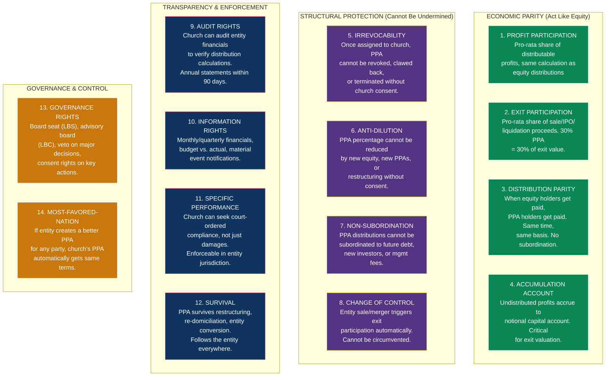

### 17.3 Principle-by-Principle Detail

#### Principle 1: Profit Participation

| Element | Requirement |
|---|---|
| **Calculation** | Church receives X% of distributable profits, calculated identically to how equity distributions would be calculated |
| **Distribution frequency** | Quarterly, within 45 days of quarter end |
| **Distributable profit definition** | Net revenue minus operating expenses minus board-approved reserves. Same waterfall as equity: expenses → reserves → pro-rata distributions |
| **Currency** | USD or AED equivalent at prevailing rate |
| **Withholding** | Zero — no WHT on contractual payments from UAE or Cook Islands to US entity |

**Why this matters:** The church's revenue stream must be predictable and calculated on the same basis as if it held actual shares. Any deviation creates an argument that the PPA is "less than equity" — which could undermine the structure's purpose.

#### Principle 2: Exit Participation

| Element | Requirement |
|---|---|
| **Trigger events** | Sale of entity, sale of substantially all assets, IPO/listing, merger, liquidation, wind-down |
| **Calculation** | Church receives X% of net exit proceeds (gross price minus transaction costs minus creditor payoffs) |
| **Timing** | Paid simultaneously with equity holders, from the same closing proceeds |
| **Escrow** | If exit includes escrow/holdback, church's share is held and released on the same terms as equity |
| **Earnout** | If exit includes earnout, church participates pro-rata on same terms |

**Why this matters:** Without exit participation, the PPA is just an income stream — it isn't equity-equivalent. Exit participation is what makes a 30% PPA worth the same as 30% equity. If LBS sells for $50M, the church receives $15M. Period.

#### Principle 3: Distribution Parity

| Element | Requirement |
|---|---|
| **Timing** | PPA distributions paid at the same time as any equity distributions |
| **Priority** | PPA distributions rank pari passu (equal priority) with equity distributions — not junior, not senior |
| **No selective distributions** | Entity cannot distribute to equity holders while withholding from PPA holders, or vice versa |
| **Shortfall** | If distributable profits are insufficient to pay all holders in full, distributions are reduced pro-rata across all PPA and equity holders equally |

**Why this matters:** If the entity can pay equity first and PPA holders second, the PPA is subordinated — making it more like debt than equity. Parity ensures the church is treated as a co-owner in every economic sense.

#### Principle 4: Accumulation Account

| Element | Requirement |
|---|---|
| **Purpose** | Tracks undistributed profits attributable to each PPA holder |
| **Calculation** | Each quarter: PPA holder's share of distributable profits minus actual distributions paid = net addition to accumulation account |
| **Exit relevance** | Accumulation account balance is included in exit valuation — church receives both its share of exit proceeds AND any undistributed accumulation balance |
| **Reporting** | Accumulation account balance reported to church quarterly |

**Why this matters:** If the entity retains earnings for growth (instead of distributing), the church's share of those retained earnings isn't lost — it accumulates and is paid out on exit. Without this, the entity could retain all earnings, grow in value, sell, and argue the church only gets a share of the sale price minus retained earnings. The accumulation account closes that gap.

#### Principle 5: Irrevocability

| Element | Requirement |
|---|---|
| **Assignment** | Daniel's PPA is irrevocably assigned to the church. Cannot be reclaimed. |
| **Termination** | PPA cannot be terminated without the church's written consent |
| **Modification** | PPA terms cannot be modified to the church's detriment without the church's written consent |
| **Entity action** | Neither the entity, the PIF, nor Panamanian Holdings S.A. can unilaterally cancel the PPA |
| **Founder action** | Daniel cannot revoke the assignment, even if he leaves the church or ceases to be Senior Pastor |

**Why this matters for IRS:** The irrevocability is what makes the PPA assignment to the church legitimate. If Daniel could reclaim the PPA, the IRS would argue he still "owns" it (assignment of income doctrine). Irrevocability means the church — not Daniel — is the economic owner. Full stop.

#### Principle 6: Anti-Dilution

| Element | Requirement |
|---|---|
| **New equity** | Entity cannot issue new shares or equity interests without church's written consent |
| **New PPAs** | Entity cannot create new profit participation agreements without church's written consent (or pro-rata participation rights) |
| **Restructuring** | Any restructuring that would reduce the effective percentage of the church's PPA requires church consent |
| **Pre-emptive rights** | If new economic interests are created, church has the right to maintain its pro-rata share |

**Why this matters:** Without anti-dilution, the entity could issue new shares to a third party, diluting the church's 30% down to 15% or less. Anti-dilution ensures the church's economic interest is permanent and cannot be eroded by corporate actions.

#### Principle 7: Non-Subordination

| Element | Requirement |
|---|---|
| **Debt** | Entity cannot incur new debt that takes priority over PPA distributions without church consent |
| **Management fees** | Entity cannot pay management fees or intercompany charges that reduce distributable profits below a reasonable threshold without church consent |
| **New investors** | Future investors cannot receive liquidation preferences that subordinate the church's PPA |
| **Contractual priority** | PPA distributions rank pari passu with equity distributions and senior to management/advisory fees |

**Why this matters:** A common way to undermine phantom equity is to load the entity with debt or management fees, reducing distributable profits to zero. Non-subordination prevents this — the church's distributions cannot be squeezed out by new obligations.

#### Principle 8: Change of Control Protection

| Element | Requirement |
|---|---|
| **Trigger** | Sale of entity, merger, change of >50% of equity, change of board majority, sale of substantially all assets |
| **Effect** | Church's exit participation is triggered automatically — church receives its pro-rata share of proceeds |
| **Put right** | On certain trigger events (key person departure, material breach, prolonged non-distribution), church can demand buyout of PPA at fair market value |
| **Tag-along** | If PIF/S.A. sells its equity, church participates on same terms |
| **Drag-along** | If holders of 75%+ of PPAs approve a sale, all holders participate |

**Why this matters:** Without change of control protection, the PIF could sell the entity's shares to a buyer, pocket the proceeds at the PIF level, and argue the PPA holders have no claim on the sale. Change of control protection ensures the church always gets its exit proceeds regardless of how the sale is structured.

#### Principle 9: Audit Rights

| Element | Requirement |
|---|---|
| **Annual audit** | Entity provides audited (or reviewed) financial statements within 90 days of fiscal year end |
| **Church audit right** | Church may engage its own auditor to examine entity books at church's expense, once per year, with 30 days notice |
| **Distribution verification** | Church may request detailed calculation of distributable profits and its share for any distribution period |
| **Records access** | Entity must maintain books and records and make them available for inspection on reasonable notice |

#### Principle 10: Information Rights

| Element | Requirement |
|---|---|
| **Quarterly financials** | Income statement, balance sheet, cash flow — within 30 days of quarter end |
| **Annual budget** | Provided before start of fiscal year |
| **Material events** | Prompt notification of: litigation, regulatory action, key person departure, M&A activity, material contracts, debt incurrence |
| **Board materials** | Church representative (board seat or advisory board) receives all board materials |

#### Principle 11: Specific Performance

| Element | Requirement |
|---|---|
| **Remedy** | Church may seek specific performance (court-ordered compliance) in addition to monetary damages |
| **Injunctive relief** | Church may seek injunctive relief to prevent entity from taking actions that violate the PPA |
| **Jurisdiction** | Disputes resolved in entity's jurisdiction: DIFC Courts (LBS/Dubai), Cook Islands courts (LBC), or by arbitration (LCIA/ICC) at neutral venue |
| **Acceleration** | If entity defaults on distributions for 2+ consecutive quarters, all accrued and future distributions accelerate and become immediately payable |

#### Principle 12: Survival

| Element | Requirement |
|---|---|
| **Re-domiciliation** | If entity moves to a new jurisdiction, PPA follows — all terms survive |
| **Entity conversion** | If entity changes legal form (e.g., FZ-LLC to Ltd), PPA terms survive |
| **Restructuring** | If entity merges, spins off, or reorganizes, church's PPA attaches to the successor entity |
| **Dissolution** | If entity dissolves, church receives its pro-rata share of net assets after creditors |

#### Principle 13: Governance Rights

| Element | Requirement |
|---|---|
| **Board representation** | Church holds one board seat on LBS (Dubai). Advisory board seat on LBC (Cook Islands, where nominee directors are required). |
| **Veto rights** | Church consent required for: sale/merger, new debt above threshold, related-party transactions, new PPA issuance, change of business, executive compensation above threshold |
| **Appointment** | Church's board representative is appointed by the Spiritual Council (Daniel as Senior Pastor nominates) |
| **Observer rights** | Church representative may attend all board meetings, even for matters not requiring PPA holder vote |

**Who sits on entity boards for the church?** The Spiritual Council appoints the church's representative. In practice, this will be Daniel (who serves on the LBS board as the church's appointee) or another council member. This is a governance role, not an ownership role — Daniel sits on the LBS board as a representative of a PPA holder, not as a shareholder.

#### Principle 14: Most-Favored-Nation

| Element | Requirement |
|---|---|
| **Trigger** | If entity grants any other PPA holder (current or future) more favorable terms on any provision |
| **Effect** | Church's PPA automatically receives the same improved terms |
| **Scope** | Covers all economic terms: distribution frequency, exit calculation, anti-dilution formulas, information rights, governance rights |
| **Notification** | Entity must notify church within 30 days of granting improved terms to any other party |

**Why this matters:** Prevents the church from being left with a weaker agreement if the entity later negotiates better terms with a new participant. The church's PPA is always at least as strong as the best PPA in existence.

### 17.4 Agreement-by-Agreement Summary

| Agreement | Counterparty | Church Gets | Key Principles | Governing Law |
|---|---|---|---|---|
| **PPA — LBS (Daniel's 30%)** | Light Brands Studio FZ-LLC (Dubai) + Panamanian Holdings S.A. | 30% of quarterly profits + 30% of exit proceeds + board seat + veto rights | All 14 principles | UAE / DIFC |
| **PPA — LBC (Daniel's 30%)** | Light Brands Consulting Ltd (Cook Islands) + Panamanian Holdings S.A. | 30% of quarterly profits + 30% of exit proceeds + advisory board + veto rights | All 14 principles | Cook Islands |
| **PPA — LBS (Jason's 10%, if C/D)** | Light Brands Studio FZ-LLC (Dubai) + Panamanian Holdings S.A. | 10% of quarterly profits + 10% of exit proceeds | All 14 principles | UAE / DIFC |
| **PPA — LBC (Jason's 10%, if C/D)** | Light Brands Consulting Ltd (Cook Islands) + Panamanian Holdings S.A. | 10% of quarterly profits + 10% of exit proceeds | All 14 principles | Cook Islands |
| **Content License** | TE Wellness Holdings (Cayman) | Ongoing royalty for spiritual content licensed to TE platform | Principles 1, 3, 5, 7, 9, 10, 11, 12 (economic + enforcement) | Cayman Islands |
| **Spiritual Tech License** | Light Brands Consulting Ltd (Cook Islands) | Ongoing royalty for spiritual technology / methodology | Principles 1, 3, 5, 7, 9, 10, 11, 12 (economic + enforcement) | Cook Islands |

### 17.5 The Assignment Mechanism

The PPAs don't originate with the church — they originate with Daniel (and Jason). The critical legal step is the **irrevocable assignment** from founder to church.

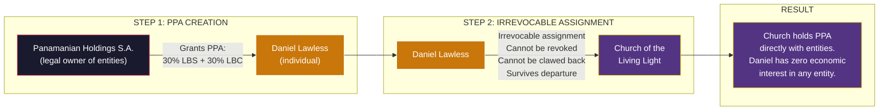

**Assignment agreement must include:**

| Clause | Requirement |
|---|---|
| **Assignor** | Daniel Lawless (individual) |
| **Assignee** | Church of the Living Light, a 508(c)(1)(A) church |
| **Interest assigned** | 100% of Daniel's rights under the PPA — profit distributions, exit participation, governance rights, all ancillary rights |
| **Irrevocability** | Assignment is permanent and irrevocable. Assignor waives all right to reclaim, modify, or redirect the PPA. |
| **No retained interest** | Assignor retains zero economic or governance interest in the PPA after assignment. |
| **Consideration** | Assignment is a gift/donation to a tax-exempt church (charitable contribution — but Daniel should not claim a charitable deduction to avoid complexity; counsel to advise). |
| **Entity consent** | LBS, LBC, and Panamanian Holdings S.A. each consent to the assignment and agree to pay all distributions directly to the church. |
| **Effective date** | Assignment effective upon execution. All distributions from the effective date forward are the church's property. |
| **Survival** | Assignment survives Daniel's death, incapacity, departure from church, or any change in Daniel's relationship with the church. |

### 17.6 License Agreements — Church as IP Licensor

The church also earns revenue by licensing spiritual content and methodologies to TE entities. These are arm's-length license agreements, not PPAs.

| Agreement | What's Licensed | From | To | Royalty Basis |
|---|---|---|---|---|
| **Content License** | Spiritual wellness content, devotional materials, faith-based curriculum created by the church's ministers | Church | TE Wellness Holdings (Cayman) | % of revenue from products incorporating church content |
| **Spiritual Tech License** | Spiritual methodologies, healing frameworks, proprietary church practices | Church | LBC (Cook Islands) | % of consulting revenue derived from church methodologies |

**Key license terms:**
- License is exclusive to TE entities (they can't get it elsewhere)
- Royalty rate is arm's-length (comparable to content licensing in the wellness/spiritual space)
- Church retains all IP ownership — it licenses, not assigns
- License survives entity restructuring
- Church can audit royalty calculations
- License can be terminated by church if entity materially breaches

**Why arm's-length matters:** If the IRS reviews these agreements, the royalty rates must be justifiable by comparables. Too high → IRS argues it's disguised profit distribution. Too low → church is being shortchanged (private inurement argument reversed). Counsel should establish transfer pricing documentation for each license.

### 17.7 What Makes These Agreements "Bulletproof"

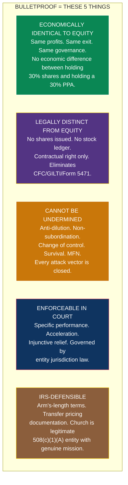

### 17.8 Agreement Checklist for Counsel

| # | Document | Parties | Principles Applied | Priority |
|---|---|---|---|---|
| 1 | **PPA — LBS (Daniel's 30%)** | Church ↔ LBS ↔ Panamanian Holdings S.A. | All 14 | Critical |
| 2 | **PPA — LBC (Daniel's 30%)** | Church ↔ LBC ↔ Panamanian Holdings S.A. | All 14 | Critical |
| 3 | **PPA Assignment (Daniel → Church)** | Daniel → Church (with entity consent) | Irrevocability (P5), no retained interest | Critical |
| 4 | **PPA — LBS (Jason's 10%)** — if Option C/D | Church ↔ LBS ↔ Panamanian Holdings S.A. | All 14 | Critical (if applicable) |
| 5 | **PPA — LBC (Jason's 10%)** — if Option C/D | Church ↔ LBC ↔ Panamanian Holdings S.A. | All 14 | Critical (if applicable) |
| 6 | **PPA Assignment (Jason → Church)** — if Option C/D | Jason → Church (with entity consent) | Irrevocability (P5), no retained interest | Critical (if applicable) |
| 7 | **Content License Agreement** | Church ↔ TE Wellness Holdings (Cayman) | P1, P3, P5, P7, P9-P12 | High |
| 8 | **Spiritual Tech License Agreement** | Church ↔ LBC (Cook Islands) | P1, P3, P5, P7, P9-P12 | High |
| 9 | **Governance Agreement** | Church ↔ LBS (board seat) | P13, P14 | High |
| 10 | **Advisory Board Agreement** | Church ↔ LBC (advisory board) | P13, P14 | High |
| 11 | **Transfer Pricing Documentation** | Internal (church records) | Arm's-length royalty rates for licenses | High |

### 17.9 Questions for Counsel — Agreements

| # | Question | Priority |
|---|---|---|
| 1 | Can the PPA assignment from Daniel to the church be structured as a gift without triggering gift tax? If the PPA has zero tax basis at assignment (no distributions received yet), is the gift tax value zero? | Critical |
| 2 | Should the church be a direct party to the PPA (three-party: entity + S.A. + church), or should the PPA remain bilateral (entity + Daniel) with a separate assignment agreement? Which structure is stronger? | Critical |
| 3 | Does DIFC law (Dubai) or Cook Islands law provide stronger enforcement mechanisms for PPA holders? Should we include parallel arbitration clauses? | Important |
| 4 | Can the church's PPA audit rights be exercised by the church's own accountant, or must it be an independent third-party auditor? | Important |
| 5 | If an entity restructures (e.g., LBS migrates from Dubai to another jurisdiction), what mechanism ensures the PPA survives without requiring a new agreement? | Important |
| 6 | For content/tech licenses: what comparable royalty rates in the wellness/spiritual content industry support the rates we set? Should we commission a transfer pricing study? | Important |
| 7 | Can the acceleration clause (default on 2+ quarters of distributions → all future amounts due immediately) be enforced in DIFC and Cook Islands courts? | Important |
| 8 | If the PIF or S.A. attempts to sell entity shares without triggering PPA change-of-control provisions, what legal remedies does the church have? Can we add a lien or security interest? | Forward |

---

## 18. Action Items — Church Formation (updated — includes agreement execution)

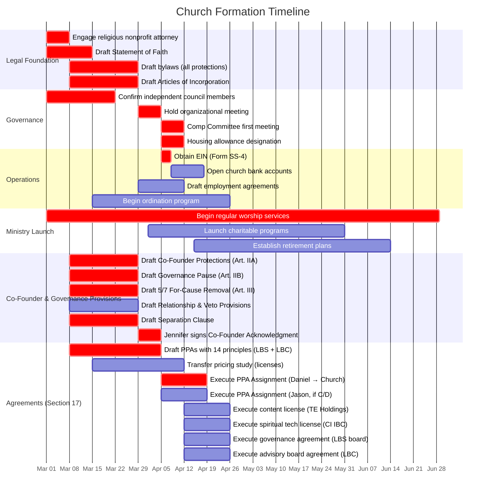

| # | Action | Owner | Timeline | Priority |
|---|---|---|---|---|
| 1 | **Engage religious nonprofit attorney** — experienced with 508(c)(1)(A) churches and megachurch governance | Daniel | Week 1 | **Critical** |
| 2 | **Draft Statement of Faith** — define the church's theology, spiritual wellness mission, and doctrinal foundation | Daniel + counsel | Weeks 1-2 | **Critical** |
| 3 | **Confirm independent council members** — Sydney Griffith (Comp Committee Chair), Iryna Voitenko (Comp Committee), Angelina Adelaide (Comp Committee), Nancy Courchesne (Director/Secretary, not on Comp Committee) | Daniel | Weeks 1-3 | **Critical** |
| 4 | **Draft bylaws** with all Senior Pastor protections from Section 11 | Attorney | Weeks 2-4 | **Critical** |
| 5 | **Draft Articles of Incorporation** — file in optimal state | Attorney | Weeks 2-4 | **Critical** |
| 6 | **Hold organizational meeting** — adopt bylaws, elect officers, approve initial resolutions | All council members | Week 4-5 | **Critical** |
| 7 | **Obtain EIN** (Form SS-4) | Attorney or Treasurer | Week 5 | **Critical** |
| 8 | **Open church bank accounts** — operating + PPA distribution + reserve | Timothy Lawless (Treasurer) | Weeks 5-6 | High |
| 9 | **Compensation Committee holds first meeting** — Sydney (Chair) + Iryna + Angelina set Y1 compensation for all staff using comparable data (majority vote) | Compensation Committee | Before first tax year | **Critical** |
| 10 | **Housing allowance designation** — board resolution for Daniel (and Jason if applicable) | Compensation Committee | Before first tax year | **Critical** |
| 11 | **Begin ordination program** — Daniel + Jason (if joining) + family members (if pursuing ordained status) | Daniel | Weeks 3-8 | High |
| 12 | **Execute PPA Assignment Agreement (Daniel → Church)** | Attorney | With PPA execution | **Critical** |
| 13 | **Execute PPA Assignment Agreement (Jason → Church)** — if Option C/D | Attorney | With PPA execution | Critical (if applicable) |
| 14 | **Draft church employment agreements** — for all compensated staff | Attorney | Weeks 4-6 | High |
| 15 | **Establish retirement plans** — 403(b)(9) + 457(b) for ministers, potentially 457(f) as revenue grows | Attorney + plan administrator | Months 2-4 | High |
| 16 | **Begin regular worship services** — weekly, documented, genuine | Daniel + family | Month 1 | **Critical** |
| 17 | **Launch charitable programs** — at least one charitable initiative beyond minister compensation | Nancy Courchesne (Outreach Director) | Months 2-3 | High |
| 18 | **Document everything** — meeting minutes, resolutions, ministry logs, asset use, charitable activity | Nancy Courchesne (Secretary) | Ongoing | **Critical** |
| 19 | **Draft PPAs incorporating all 14 bulletproof principles** — LBS (30% + 10%) and LBC (30% + 10%), with profit participation, exit participation, anti-dilution, non-subordination, change of control, audit rights, specific performance, survival, MFN (see Section 17) | Attorney (PPA counsel) | Weeks 2-6 | **Critical** |
| 20 | **Execute Content License Agreement** — church licenses spiritual content to TE Holdings (Cayman) for ongoing royalty | Attorney | Weeks 6-8 | High |
| 21 | **Execute Spiritual Tech License Agreement** — church licenses spiritual methodologies to LBC (Cook Islands) for ongoing royalty | Attorney | Weeks 6-8 | High |
| 22 | **Execute Governance Agreement (LBS)** — church board seat on LBS, veto rights, observer rights per Principle 13 | Attorney | Weeks 6-8 | High |
| 23 | **Execute Advisory Board Agreement (LBC)** — church advisory board seat on LBC, equivalent governance per Principle 13 | Attorney | Weeks 6-8 | High |
| 24 | **Commission transfer pricing study** — establish arm's-length royalty rates for content and spiritual tech licenses. Document comparable rates in wellness/spiritual industry. | Attorney + TP consultant | Weeks 3-7 | High |
| 25 | **PPA holder meeting** — all four PPA holders (church, Nicholas, Andreas, Jason) align on PPA terms, governance structure, and distribution mechanics before execution | Daniel + founders | Week 4 | **Critical** |
| 26 | **Draft Co-Founder Protections (Article IIA)** — Jennifer's life tenure, protected role, Acting Senior Pastor designation, governance pause trigger, compensation protection, consultation right, amendment lock, separation clause | Attorney | Weeks 2-4 | **Critical** |
| 27 | **Draft Governance Pause Procedures (Article IIB)** — trigger mechanism, duration parameters, authority transfer scope, return voting process, post-return cooling off, reciprocal pause for Jennifer, fallback provision | Attorney | Weeks 2-4 | **Critical** |
| 28 | **Draft 5/7 For-Cause Removal Provision (Article III §4)** — enumerated causes, process, 14-day response period, voting procedure, documentation requirements | Attorney | Weeks 2-4 | **Critical** |
| 29 | **Draft Relationship Prohibition (Article III §7)** — no intra-board romantic relationships, exception for co-founders' marriage, termination upon divorce, 30-day compliance window, re-nomination pathway | Attorney | Weeks 2-4 | High |
| 30 | **Draft New Spouse Mutual Veto (Article III §8)** — mutual consent requirement, mutual amendment lock, scenario coverage | Attorney | Weeks 2-4 | High |
| 31 | **Draft Separation Clause** — explicit language ensuring all governance provisions survive any change in co-founders' marital status. Cross-reference in Articles IIA, III, and VII. | Attorney | Weeks 2-4 | **Critical** |
| 32 | **Jennifer signs Co-Founder Acknowledgment** — formal written acceptance of co-founder protections, amendment lock rights, and governance pause authority | Jennifer + Attorney | Week 4-5 | **Critical** |

---

## 19. Questions for Counsel (Church-Specific)

| # | Question | Priority |
|---|---|---|
| 1 | Optimal state of incorporation for a 508(c)(1)(A) church with these governance protections? (Texas, Wyoming, Nevada, other?) | Critical |
| 2 | Can the Senior Pastor irremovability clause survive a state attorney general challenge? What language is strongest? | Critical |
| 3 | Can family members be ordained as ministers of the church and receive IRC 107 housing allowance? What ordination process is sufficient? | Important |
| 4 | Is there a maximum ratio of minister/family compensation to total church revenue that triggers IRS scrutiny? | Important |
| 5 | Should the church engage an independent auditor from Year 1, even though not required, to strengthen defense? | Important |
| 6 | Can the church hold real estate in multiple jurisdictions (US parsonage + Dubai property for international ministry)? | Forward |
| 7 | If the church receives PPA exit proceeds (entity sale), can those proceeds fund minister retirement plans or must they be retained as church assets? | Important |
| 8 | Review draft bylaws for compliance with state nonprofit corporation act and IRS requirements. | Critical |
| 9 | Nancy Courchesne (wife of Nicholas Courchesne, co-founder of Light Brands, 30% PPA holder) serves as Director/Secretary but is NOT on the Compensation Committee (excluded via IRC 4958 spousal attribution). Confirm this structure eliminates any independence concern. Does her role as Secretary (record-keeper for compensation decisions she doesn't vote on) create any issues? | Important |
| 10 | **Co-Founder Protections (Article IIA):** Jennifer Lawless has parallel life tenure, a protected council role, and an independent amendment lock. Is this enforceable under [state] nonprofit corporation law? Are there any state-law limitations on making a director irremovable without that director's consent? | Critical |
| 11 | **Governance Pause (Article IIB):** A circuit-breaker mechanism allows the council to temporarily suspend the Senior Pastor's operational authority for 30-180 days, with Jennifer assuming authority. Is a "governance pause" — distinct from removal — enforceable under state law? Does the 1-year post-pause cooling off period (no removal proceedings, no bylaw amendments) create any ultra vires concerns? | Critical |
| 12 | **Separation Clause:** All co-founder protections explicitly survive any change in marital status between Daniel and Jennifer. Under [state] law, is there any risk that a divorce proceeding could override or modify church bylaws provisions? Should the separation clause reference the church's First Amendment protections against civil court interference in ecclesiastical governance? | Critical |
| 13 | **5/7 For-Cause Removal:** Non-founder members can only be removed by 5/7 supermajority for enumerated cause. The member does not vote (5 of 6 must agree). Is the 5/7 standard appropriate, or would 2/3 (5/7 effectively = 83%) be considered too restrictive under state law? | Important |
| 14 | **Relationship Prohibition:** No romantic relationships between council members (exception: Daniel/Jennifer marriage at formation, terminates upon divorce). Is an outright prohibition enforceable, or should it be framed as a conflict-of-interest policy? Does the 30-day compliance window create any due process concerns? | Important |
| 15 | **New Spouse Veto:** Neither Daniel nor Jennifer can seat a new romantic partner on the council without the other's written consent. This provision requires both co-founders' consent to amend. Is a mutual veto on board appointments enforceable? Any concern with perpetual veto power surviving death of one co-founder? | Important |
| 16 | **Multiple Amendment Locks:** Daniel's lock covers Articles II, IIB, IV §4, VII §2-4. Jennifer's lock covers Article IIA. Mutual lock covers Article III §§7-8. Is there any conflict or priority issue between overlapping locks? Should priority be explicitly stated? | Important |

---

## Cross-References

- **Master structure:** [01-MASTER-STRUCTURE.md](./01-MASTER-STRUCTURE.md)
- **Legal defense (Copeland model):** [02-LEGAL-DEFENSE.md](./02-LEGAL-DEFENSE.md)
- **US founder playbook — Daniel (Part I) + Jason (Part II):** [03-FOUNDER-GUIDE-US.md](./03-FOUNDER-GUIDE-US.md)
- **PPA framework:** [10-LB-PROFIT-PARTICIPATION-FRAMEWORK.md](./10-LB-PROFIT-PARTICIPATION-FRAMEWORK.md)
- **Counsel questions (church):** [06-COUNSEL-QUESTIONS.md](./06-COUNSEL-QUESTIONS.md) — Q6, Q45, Q61-Q70

---

*This document outlines a proposed governance structure for the Church of the Living Light modeled on Kenneth Copeland Ministries' 50+ year precedent. The bylaws framework provides maximum founder protection within the legal boundaries available to churches under the First Amendment and IRC 508(c)(1)(A). All governance provisions, bylaws, and compensation structures must be reviewed and finalized by a qualified religious nonprofit attorney before formation. Nothing in this document constitutes legal advice.*
