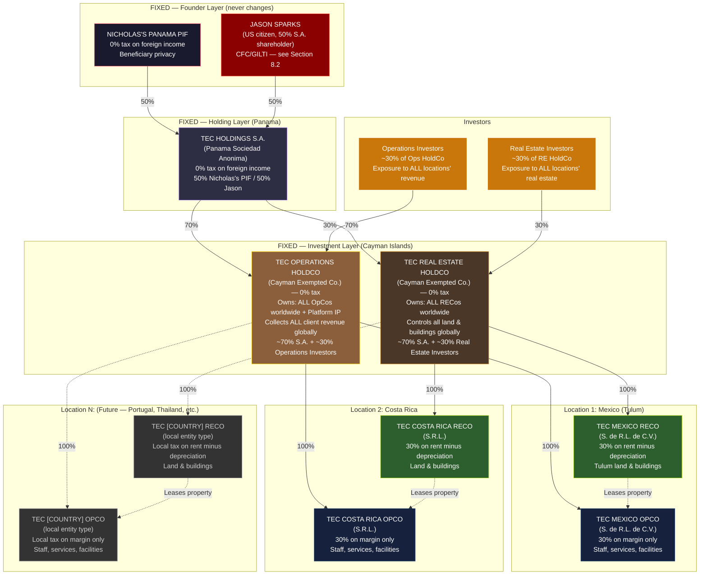
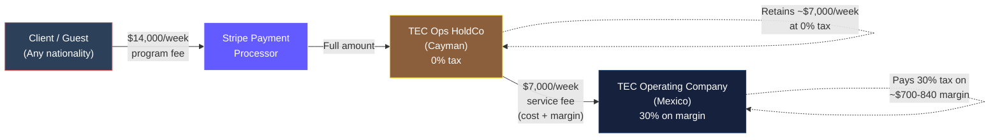
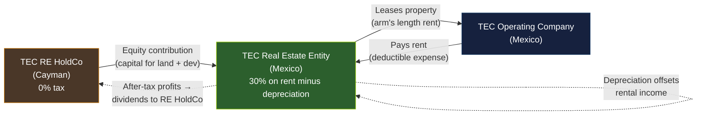
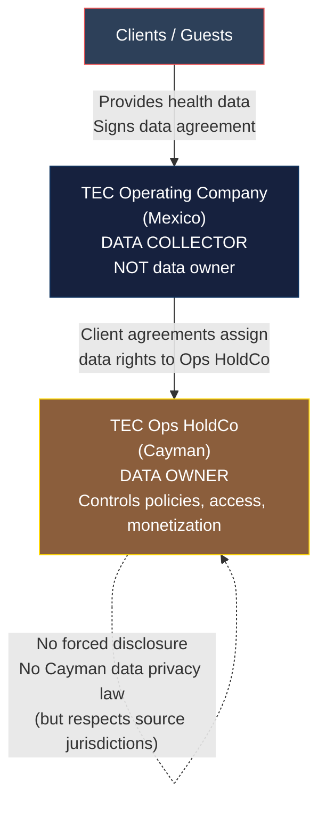
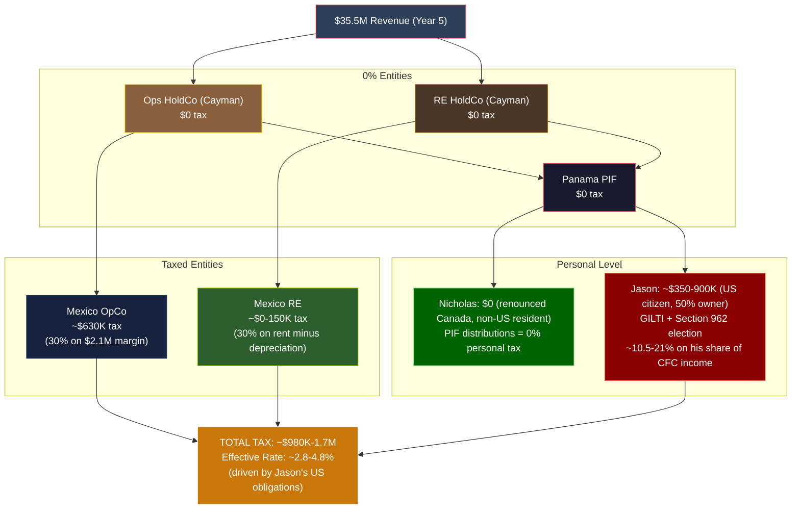

# Transformational Epicenter: Standalone Tax & Legal Structure

> **Status:** Strategic Architecture — Requires Multi-Jurisdictional Counsel Validation
> **Last Updated:** February 2026
> **Founders:** Jason Sparks (50%, US citizen) + Nicholas Courschesne (50%, renouncing Canada)
> **Structure:** Nicholas's PIF + Jason → Panama Holdings S.A. → Dual Cayman HoldCos → Mexico OpCo + RECo
> **Fundraise Target:** $10M-$30M

---

## Executive Summary

This document presents a comprehensive legal, tax, and corporate structuring strategy for **Transformational Epicenter (TEC)** as a **standalone entity**, completely separate from Light Brands AI Ltd and Light Brands Studio Ltd.

**The Company:** High-end health, medical, wellness, bio-optimization, and real estate-integrated destination operating primarily in Mexico (Tulum/Quintana Roo), serving international clients with:
- Medical and wellness services
- Retreat experiences
- Technology platform and app
- Real estate ownership and development
- Sensitive health and biometric data collection

**The Founders:** Jason Sparks (50%, US citizen) and Nicholas Courschesne (50%, renouncing Canadian citizenship). Two founders, equal ownership, $10-30M fundraise target.

**The Structure:** Nicholas's Panama PIF + Jason → Panama Holdings S.A. → Two Cayman Islands HoldCos (Operations + Real Estate) → Mexican Operating Company + Mexican Real Estate Entity

**Tax Efficiency:** ~2.0-3.5% combined global tax rate on $35M+ revenue at scale (higher than a non-US-owner structure due to Jason's US tax obligations — see Section 8.2)

**Key Optimization:** Revenue collected in 0% jurisdiction (Cayman), minimal profit retained in 30% jurisdiction (Mexico), maximum asset protection via multiple jurisdictional layers, separate investor pools for operations vs. real estate. Jason's US tax managed via Section 962 election to minimize GILTI impact.

**Critical Tax Constraint:** Jason (US citizen, 50% owner) triggers CFC/GILTI rules on TEC's foreign income. This is managed — not avoided — through Section 962 elections, active business exemptions, and careful structuring. See Section 8.2 for full analysis.

---

## Table of Contents

1. [Recommended Entity Architecture](#1-recommended-entity-architecture)
2. [Panama PIF + Dual Cayman Structure Analysis](#2-panama-pif--dual-cayman-structure-analysis)
3. [Revenue Flow Strategy](#3-revenue-flow-strategy)
4. [Transfer Pricing Analysis](#4-transfer-pricing-analysis)
5. [Real Estate Strategy](#5-real-estate-strategy)
6. [IP & Data Protection Structure](#6-ip--data-protection-structure)
7. [Tax Optimization Strategy](#7-tax-optimization-strategy)
8. [Founders & Investors Strategy](#8-founders--investors-strategy)
9. [Risk Analysis](#9-risk-analysis)
10. [Conservative vs. Aggressive Models](#10-conservative-vs-aggressive-models)
11. [Final Recommendation](#11-final-recommendation)
12. [Implementation Roadmap](#12-implementation-roadmap)

---

## 1. Recommended Entity Architecture

### 1.1 Scalable Multi-Location Architecture

The structure is designed to scale globally. The **top 4 entities never change** — only the bottom (local OpCos + RECos) grows per location.



**The scaling rule:** Adding a new location = 2 new local entities. The Cayman layer, Panama layer, and founder layer are **fixed forever**.

### 1.2 Entity Summary Table

#### Fixed Entities (4 — never changes regardless of locations)

| Entity | Jurisdiction | Role | Tax Rate | Ownership |
|--------|-------------|------|----------|-----------|
| **Nicholas's PIF** | Panama | Asset protection, beneficiary privacy | 0% | No owner (independent legal person) |
| **TEC Holdings S.A.** | Panama | Central governance, SHA | 0% on foreign income | 50% Nicholas's PIF + 50% Jason |
| **TEC Operations HoldCo** | Cayman Islands | Collects ALL client revenue globally, owns platform IP, controls ALL OpCos | 0% (unconditional, 20-year guarantee) | 70% S.A. + 30% Ops Investors |
| **TEC Real Estate HoldCo** | Cayman Islands | Owns ALL real estate assets globally, controls ALL RECos | 0% (unconditional, 20-year guarantee) | 70% S.A. + 30% RE Investors |

#### Per-Location Entities (2 per location)

| Entity | Jurisdiction | Role | Tax Rate | Ownership |
|--------|-------------|------|----------|-----------|
| **TEC Mexico OpCo** | Mexico (Tulum) | On-ground services, local staff, facilities | 30% on 8-12% margin | 100% Ops HoldCo |
| **TEC Mexico RECo** | Mexico (Tulum) | Land, buildings, development in Tulum | 30% on rent minus depreciation | 100% RE HoldCo |
| **TEC Costa Rica OpCo** | Costa Rica | On-ground services, local staff, facilities | 30% on 8-12% margin | 100% Ops HoldCo |
| **TEC Costa Rica RECo** | Costa Rica | Land, buildings, development | 30% on rent minus depreciation | 100% RE HoldCo |
| **TEC [Location N] OpCo** | *Any country* | On-ground services, local staff, facilities | *Local rate on margin* | 100% Ops HoldCo |
| **TEC [Location N] RECo** | *Any country* | Land, buildings, development | *Local rate on rent minus depreciation* | 100% RE HoldCo |

**Entity count formula:** 4 fixed + (2 × number of locations)

| Locations | Total Entities | Example |
|-----------|---------------|---------|
| 1 (Mexico only) | 6 | Launch configuration |
| 2 (Mexico + Costa Rica) | 8 | First expansion |
| 3 | 10 | |
| 5 | 14 | |
| 10 | 24 | Global scale |

### 1.3 Why TWO Cayman HoldCos (Not One)

This is the critical structural question, especially at scale with multiple locations. Here's why:

#### The Single HoldCo Alternative

```
S.A. → ONE Cayman HoldCo → Mexico OpCo + Mexico RECo + Costa Rica OpCo + Costa Rica RECo + ...
```

**Seems simpler. Why NOT do this?**

#### 1 vs 2 Cayman HoldCos: Multi-Location Comparison

| Aspect | 1 HoldCo (Simpler) | 2 HoldCos (Recommended) |
|--------|---------------------|------------------------|
| **Investor experience** | Every investor gets forced exposure to BOTH operations revenue AND real estate across ALL locations. A VC wanting platform/tech exposure must also accept Tulum land risk. | Ops investors get pure operations exposure (revenue, IP, platform) across all locations. RE investors get pure real estate exposure (land, buildings, appreciation) across all locations. **Clean separation.** |
| **Fundraising** | Single cap table. Must price operations AND real estate together. Hard to value. | Two cap tables. Operations valued on revenue multiples (SaaS-like). Real estate valued on NAV + development pipeline. **Different investors, different thesis, different terms.** |
| **Exit flexibility** | To sell the operations business, must also sell or restructure all real estate. To sell real estate, must also restructure operations. Pre-exit restructuring costs $100K+ in legal fees and months of delay. | Sell Ops HoldCo (ALL locations' operations, platform, IP) to a strategic acquirer (e.g., Marriott, Six Senses) while KEEPING all real estate. Or sell RE HoldCo (entire global real estate portfolio) to a REIT while keeping the operations business. **Clean independent exits from day one.** |
| **Risk isolation** | Guest injury lawsuit in Mexico can reach Costa Rica real estate assets. Environmental liability on Tulum land can freeze operating cash flow in Costa Rica. All locations' risks are pooled. | Guest injury claim hits Mexico OpCo → contained under Ops HoldCo. Cannot reach ANY real estate in ANY location. Environmental claim on Tulum land hits Mexico RECo → contained under RE HoldCo. Cannot reach ANY operating cash flow. **Global risk isolation.** |
| **Adding Location N** | 2 new local entities under 1 HoldCo. Simple, but investors get involuntary exposure to new location risk. | 2 new local entities — 1 under Ops HoldCo, 1 under RE HoldCo. Investors automatically get exposure to new location in their chosen asset class. **Scales naturally.** |
| **Annual cost** | ~$16-27K (1 Cayman entity) | ~$32-54K (2 Cayman entities) |
| **Cost difference** | — | **+$16-27K/year** |

#### Why the Cost Difference Is Irrelevant

At $10-30M fundraise scale:
- $16-27K/year additional = **0.05-0.3% of capital raised**
- The FIRST time you need to sell operations independently from real estate (or vice versa), the restructuring cost to separate them AFTER the fact would be **$100-500K in legal fees + 3-6 months delay**
- The FIRST time a VC says "I want operations exposure only, not real estate risk" and you can say "invest in Ops HoldCo" instead of losing the deal = **worth millions**

**Verdict: 2 HoldCos. The cost is trivial. The optionality is enormous. At scale with multiple locations, the separation becomes MORE valuable, not less.**

### 1.4 How Adding a New Location Works

When TEC expands to a new country, the process is:

```
WHAT CHANGES:
├── Form [Country] OpCo (local entity, 100% owned by Ops HoldCo)
├── Form [Country] RECo (local entity, 100% owned by RE HoldCo)
├── Execute service delivery agreement (Ops HoldCo ↔ new OpCo)
├── Execute lease agreement (new RECo ↔ new OpCo)
└── Commission transfer pricing study for new jurisdiction

WHAT DOES NOT CHANGE:
├── Nicholas's PIF — unchanged
├── TEC Holdings S.A. — unchanged
├── TEC Operations HoldCo — unchanged (just adds another subsidiary)
├── TEC Real Estate HoldCo — unchanged (just adds another subsidiary)
├── Investor agreements — unchanged (investors automatically get exposure to new location)
└── Cayman compliance — unchanged (same 2 entities, same annual filings)
```

**Per-location setup cost:** ~$10-30K (local counsel + entity formation + TP study)
**Per-location ongoing cost:** ~$15-30K/year (local accounting, tax filings, TP updates)

#### Costa Rica: Concrete Example

| Detail | Costa Rica |
|--------|-----------|
| **Entity types** | S.R.L. (Sociedad de Responsabilidad Limitada) for both OpCo and RECo |
| **Corporate tax** | 30% on net income (same as Mexico) |
| **Foreign ownership** | No restrictions — 100% foreign ownership allowed (unlike Mexico's restricted zone) |
| **Real estate** | No fideicomiso required. RECo can hold title directly. |
| **Tax on margin (OpCo)** | 30% on 8-12% cost-plus margin (same model as Mexico) |
| **Depreciation (RECo)** | Buildings: ~2-5% annual depending on type. Offsets rental income. |
| **Transfer pricing** | Costa Rica follows OECD guidelines. Annual TP study required for intercompany transactions. |
| **WHT on dividends to Cayman** | 15% withholding tax on dividends from CR entities to Cayman HoldCos (higher than Mexico's 0% CUFIN dividends — **factor into modeling**) |
| **Setup cost** | ~$8-15K (local counsel + formation) |
| **Ongoing cost** | ~$12-20K/year (accounting, tax filings, TP study) |

**Costa Rica advantage over Mexico:** No restricted zone, no fideicomiso, simpler foreign ownership. Strong wellness tourism market (already established Blue Zone destination — Nicoya Peninsula).

**Costa Rica disadvantage vs Mexico:** 15% dividend WHT to Cayman (Mexico can distribute via CUFIN at 0%). This means ~15% tax leakage on profits extracted from Costa Rica, making the effective rate higher than Mexico for the same margin structure.

### 1.5 Why NOT Per-Location HoldCos

A more complex alternative would be per-location Cayman HoldCos:

```
S.A. → Mexico Ops HoldCo (Cayman) → Mexico OpCo
S.A. → Mexico RE HoldCo (Cayman) → Mexico RECo
S.A. → Costa Rica Ops HoldCo (Cayman) → Costa Rica OpCo
S.A. → Costa Rica RE HoldCo (Cayman) → Costa Rica RECo
... (2 Cayman entities per location = 2N Cayman entities)
```

**This is over-engineered because:**
- Each additional Cayman entity costs ~$16-27K/year in compliance
- 5 locations = 10 Cayman entities = $160-270K/year in Cayman compliance alone
- No additional tax benefit (all 0% anyway)
- Per-location exit flexibility is rarely needed — you'd sell the entire portfolio or nothing
- Investor separation is already achieved with 2 umbrella HoldCos

**The only scenario where per-location HoldCos make sense:** If you want to bring in a location-specific investor (e.g., a Costa Rica-only RE investor who doesn't want Mexico exposure). In that case, you can always restructure LATER — create a sub-holdco when needed, not preemptively.

**Bottom line:** 2 umbrella HoldCos (one for all ops, one for all RE) is the sweet spot between simplicity and scalability. It handles 1 location or 20 locations with the same Cayman structure.

---

## 2. Panama PIF + Dual Cayman Structure Analysis

### 2.1 Strategic Question: Is This Optimal or Over-Engineered?

**Answer: Optimal for this specific business. Here's why:**

#### Benefits of Panama PIF Layer

| Benefit | Impact |
|---------|--------|
| **Beneficiary privacy** | PIF beneficiaries are NOT publicly disclosed. No registry. Critical for high-net-worth founders and data-sensitive business. |
| **Asset protection** | PIF is an independent legal person. Creditors must breach Panamanian law (which strongly protects foundations) before reaching any operating entity equity. |
| **0% on foreign income** | Panama taxes only Panamanian-source income. All TEC revenue is international → 0%. |
| **Flexible distributions** | PIF can distribute to beneficiaries at any time, any amount, without "dividend" classification issues. |
| **No forced disclosure** | Unlike US LLCs or Canadian corps, PIF has no public beneficial ownership registry. |

**Note:** The PIF applies to **Nicholas only**. Jason (US citizen) holds his 50% of the S.A. directly — a PIF would not reduce Jason's US tax burden (IRS looks through foreign structures for US citizens). Jason's ownership is visible in the S.A. share register.

#### Benefits of Panama S.A. (Holdings Layer)

| Benefit | Impact |
|---------|--------|
| **Single governance** | One shareholders' agreement between Nicholas's PIF and Jason. One voting body for all major decisions. |
| **Clean ownership** | S.A. owns 70% of both Cayman HoldCos — investors negotiate with S.A. (one counterparty), not individual founders. |
| **0% on foreign income** | Panama S.A. taxes only Panamanian-source income. TEC revenue is international → 0%. |
| **Deadlock resolution** | 50/50 ownership requires a deadlock mechanism (buy-sell, arbitration, or mediator). S.A. SHA handles this cleanly. |

#### Benefits of Dual Cayman HoldCos (Umbrella Model)

| Benefit | Impact |
|---------|--------|
| **Investor separation** | Operations investors get exposure to ALL locations' revenue stream. Real estate investors get exposure to ALL locations' land and development. Different risk profiles, different economics. Dual HoldCos allow clean separation at global scale. |
| **Exit flexibility** | Can sell Ops HoldCo (ALL locations' operations, platform, IP, client relationships) to strategic acquirer while retaining ALL real estate. Or sell RE HoldCo (entire global RE portfolio) to REIT/developer while continuing operations everywhere. |
| **Global risk isolation** | Guest injury claim in Mexico cannot reach Costa Rica real estate. Environmental liability in Costa Rica cannot reach Mexico operating cash flow. Each location's risks are isolated within its asset class. |
| **Scalability** | Adding a new location = 2 local entities under existing HoldCos. No new Cayman entities, no shareholder restructuring, no investor renegotiation. See Section 1.4. |
| **0% unconditional** | Cayman has NEVER had corporate tax. 20-year Tax Undertaking Certificate guarantees this. No substance requirements for holding companies. |
| **VC-standard** | Cayman Exempted Companies are the global standard for institutional VC. Sequoia, a16z, Tiger Global all use this structure. Investors will recognize it immediately. |

#### Alternative Considered: Single Cayman HoldCo

See **Section 1.3** for the comprehensive 1 vs 2 HoldCo comparison, including multi-location scaling analysis.

**Short answer:** 2 HoldCos costs ~$16-27K/year more. The investor separation, exit flexibility, and global risk isolation are worth orders of magnitude more. At scale with N locations, the 2 umbrella HoldCos become MORE valuable — each new location's ops automatically pools under Ops HoldCo, each new location's real estate automatically pools under RE HoldCo. Investors get diversified exposure without structural changes.

### 2.2 S.A. Ownership & Cayman HoldCo Percentages

**Founder ownership (at S.A. level):**

| S.A. Shareholder | Ownership | Holding Vehicle |
|-----------------|-----------|-----------------|
| **Nicholas Courschesne** | 50% | Via Nicholas's Panama PIF |
| **Jason Sparks** | 50% | Direct (US citizen — PIF would not provide US tax benefit) |

**S.A. ownership of Cayman HoldCos (recommended 70/30 split):**

| Scenario | S.A. % | Ops Investor % | RE Investor % | Rationale |
|----------|--------|----------------|---------------|-----------|
| **Recommended** | 70% / 70% | 30% | 30% | Founders retain control of both entities via S.A. Clean 70/30 split for each investor class. Simple governance. |
| Alternative A | 80% / 80% | 20% | 20% | Founders retain more equity but investors may push back on dilution for same check size. |
| Alternative B | 60% / 60% | 40% | 40% | Higher dilution; founders risk losing control if investors coordinate. |

**Jason's effective ownership chain:** Jason (50% S.A.) → S.A. (70% each HoldCo) = **35% indirect ownership** of each Cayman HoldCo. This triggers CFC/GILTI — see Section 8.2 for full analysis and mitigation.

**Nicholas's PIF:** Protects Nicholas's 50% S.A. stake with beneficiary privacy and Panamanian asset protection. Critical for post-renunciation security — no public registry of PIF beneficiaries.

---

## 3. Revenue Flow Strategy

### 3.1 The Core Revenue Model



### 3.2 Revenue Flow Breakdown

#### Step 1: Client Pays Ops HoldCo (Cayman)

- **Who pays:** Any client (US, Canadian, European, international)
- **Amount:** $14,000/week for standard program (example)
- **Payment method:** Credit card via Stripe, wire transfer, or cryptocurrency
- **Recipient:** TEC Operations HoldCo (Cayman) — this entity holds the Stripe merchant account and client contracts
- **Tax on receipt:** 0% (Cayman has no corporate income tax)

#### Step 2: Ops HoldCo Pays Mexico OpCo Service Fee

- **Who pays:** TEC Operations HoldCo (Cayman)
- **Who receives:** TEC Operating Company (Mexico)
- **Amount:** $7,000/week (example — 50% of client fee)
- **Pricing basis:** Cost-plus methodology
  - Mexico OpCo's actual costs: ~$6,160-6,300/week (salaries, food, supplies, facilities)
  - Markup: 8-12% (arm's length service margin)
  - Total service fee: ~$7,000/week

- **Tax treatment:**
  - **In Mexico:** OpCo receives $7,000, incurs $6,300 in costs, earns ~$700 margin. Tax = 30% of $700 = $210 per client per week.
  - **In Cayman:** Ops HoldCo pays $7,000 (deductible expense if Cayman had corporate tax, but it doesn't, so this is simply a cash outflow). Retains ~$7,000 per client per week at 0% tax.

#### Step 3: Real Estate Lease Flow



- **RE HoldCo (Cayman)** capitalizes the Mexican RE entity via equity contribution
- **Mexico RE Entity** acquires land, develops villas/facilities, holds title
- **Mexico RE Entity** leases developed property to Mexico OpCo at arm's length market rent
- **Mexico OpCo** deducts rent as operating expense (included in the $6,300 cost base that flows into the $7,000 service fee calculation)
- **Mexico RE Entity** pays 30% tax on rental income MINUS building depreciation (5% annual on buildings, 0% on land)
- **After-tax profits** distributed to RE HoldCo (Cayman) as dividends from CUFIN (0% additional Mexican tax, 0% Cayman receipt tax)

### 3.3 Annual Revenue Flow (Year 5 Example)

| Metric | Amount | Tax | Net |
|--------|--------|-----|-----|
| **Total client revenue** | $35,461,000 | | |
| **Flows to:** Ops HoldCo (Cayman) | $35,461,000 | 0% | $35,461,000 |
| **Ops HoldCo pays:** Mexico OpCo service fee | ($17,500,000) | | |
| **Mexico OpCo margin:** ~12% | ~$2,100,000 | 30% | (~$630,000 tax) |
| **Ops HoldCo retains (EBITDA ~43-61%)** | ~$17,961,000 | 0% | $17,961,000 |
| **Real estate rental income** (Mexico RE) | ~$2,500,000 | | |
| **Minus depreciation** (5% on $50M buildings) | ($2,500,000) | | |
| **Mexico RE taxable income** | ~$0 | 0% | $0 (early years) |

**Total Mexican tax (Year 5):** ~$630,000
**Total revenue:** $35,461,000
**Effective tax rate:** ~1.8%

---

## 4. Transfer Pricing Analysis

### 4.1 The Critical Question: Is $7K Service Fee Defensible?

**YES — if properly structured and documented. Here's how:**

#### Legal Basis: Platform-as-Principal Model

The structure operates under the **"Platform-as-Principal" model**, which is widely used by multinational hospitality, technology, and service companies (Airbnb, Booking.com, Marriott, etc.):

| Element | TEC Structure |
|---------|---------------|
| **Who owns the client relationship?** | Ops HoldCo (Cayman) — signs client contracts, holds client data, owns brand/platform |
| **Who delivers the service?** | Mexico OpCo — provides on-ground hospitality, medical services, facilitation |
| **Economic substance** | Ops HoldCo bears platform risk (marketing, client acquisition, technology, IP development). Mexico OpCo is a fulfillment service provider. |
| **Transfer pricing method** | Cost-Plus Method — Mexico OpCo receives its fully loaded costs PLUS an 8-12% service margin (arm's length for low-risk service providers) |

**Comparable companies using this model:**
- **Marriott:** Marriott International (US HoldCo) owns the brand and reservations system. Local hotel operating companies (in Mexico, Europe, Asia) provide hospitality services under management agreements for cost-plus fees.
- **Booking.com:** Booking Holdings (Cayman) collects all customer payments. Local entities provide support services for cost-plus margins.
- **Hilton:** Hilton Worldwide Holdings owns IP and reservations. Local OpCos operate hotels under franchise/management agreements.

**Transfer pricing justification:**
- Mexico OpCo is a **"limited-risk distributor"** or **"routine service provider"**
- It does NOT own IP, client relationships, or brand
- It does NOT bear platform risk, technology risk, or marketing risk
- It receives stable cost-plus compensation regardless of whether Ops HoldCo is profitable
- OECD Guidelines (Chapter II) explicitly recognize cost-plus as appropriate for routine service providers

### 4.2 BEPS Risk Analysis

**BEPS (Base Erosion and Profit Shifting)** is the OECD's anti-avoidance framework. Mexico is an OECD member and has implemented BEPS measures. Here's how the structure complies:

| BEPS Action | TEC Compliance |
|-------------|----------------|
| **Action 5: Harmful Tax Practices** | Cayman is NOT on the EU blacklist or OECD harmful regimes list. 0% rate is sovereign law, not a "patent box" or special regime. |
| **Action 8-10: Transfer Pricing** | Annual TP studies benchmark the service fee using OECD-approved methods (cost-plus). Comparable data from hospitality service providers. |
| **Action 13: CbC Reporting** | TEC group revenue ($35M) is below the €750M threshold for Country-by-Country Reporting. Not required. |
| **Economic Substance** | Ops HoldCo (Cayman) performs genuine functions: platform ownership, client contracts, Stripe merchant account, IP ownership, strategic decisions. Mexico OpCo has employees, facilities, and local substance. |

### 4.3 Permanent Establishment Risk

**Risk:** If Ops HoldCo (Cayman) creates a "permanent establishment" in Mexico, Mexican tax authorities could tax Ops HoldCo's profits as if they were earned in Mexico.

**Mitigation:**

| PE Trigger | TEC Structure Avoids This How? |
|------------|-------------------------------|
| **Fixed place of business** | Ops HoldCo has NO office, NO employees, NO physical presence in Mexico. Mexico OpCo is a SEPARATE legal entity (not a branch). |
| **Dependent agent** | Mexico OpCo operates under its own legal authority. It does NOT have authority to bind Ops HoldCo in client contracts. Ops HoldCo signs contracts directly (via Cayman registered office). |
| **Management and control** | Ops HoldCo's directors meet outside Mexico (Cayman, Dubai, or remotely). Strategic decisions made outside Mexico. |

**Case law support:** The OECD Model Tax Convention (Article 5) and Mexican domestic law (LISR Article 2) define PE narrowly. A subsidiary performing services under an arm's length service agreement does NOT create PE for the parent (OECD Commentary para 41.1).

### 4.4 Transfer Pricing Documentation Requirements (Mexico)

Mexico's SAT (tax authority) requires **annual transfer pricing studies** for all related-party transactions:

| Document | Requirement | Frequency |
|----------|-------------|-----------|
| **Informativa de Operaciones con Partes Relacionadas** | Disclosure of all related-party transactions (service fees, royalties, leases) | Annual (due with tax return) |
| **Transfer Pricing Study** | Functional analysis, comparables database, benchmarking study, pricing methodology | Annual (prepared but filed only upon request) |
| **Advance Pricing Agreement (Optional)** | Pre-approval from SAT for specific TP methodologies | Multi-year (3-5 years) |

**Estimated annual TP documentation cost:** $15,000-30,000 (for service fee + lease agreements)

**Benchmark sources:**
- Royalty<stat>, BvD Amadeus, S&P Capital IQ — databases of service provider margins in hospitality and healthcare
- Mexican hospitality management companies (RCD Hotels, Grupo Posadas)
- International wellness operators (Six Senses, Aman, Banyan Tree — most use similar structures)

### 4.5 Conservative Service Fee Range

Based on OECD guidelines and hospitality/wellness industry benchmarks:

| Mexico OpCo Margin | Defensibility | Comparable Industries |
|--------------------|---------------|----------------------|
| **8-10%** | Highly conservative | Hotel operational services, call center support, contract manufacturing |
| **10-12%** | Industry standard | Healthcare service providers, wellness facility operators |
| **12-15%** | Moderate | Specialized medical services, luxury hospitality |
| **15%+** | Aggressive (requires strong justification) | Requires significant IP contribution or unique risk profile |

**Recommendation:** Start at 10%, benchmark annually, increase to 12% if comparables support it.

---

## 5. Real Estate Strategy

### 5.1 Why Separate Real Estate from Operations?

| Reason | Impact |
|--------|--------|
| **Asset protection** | Guest injury lawsuit against OpCo cannot reach land and buildings held by separate entity |
| **Tax efficiency** | Building depreciation (5% annual) offsets rental income in the RE entity, reducing total Mexico tax |
| **Investor separation** | Operations investors want platform/revenue exposure. Real estate investors want land appreciation and development returns. Different risk profiles. |
| **Exit flexibility** | Can sell RE assets to REIT/developer while continuing operations under lease. Or sell operations to strategic acquirer while retaining valuable Tulum real estate. |
| **Depreciation recapture benefit** | On eventual sale, inflation-adjusted cost basis + capitalized development costs minimize capital gains tax (see Section 5.6) |

### 5.2 Real Estate Entity Ownership Options

#### Option A: Mexico RE Entity Owned by RE HoldCo (Cayman) — RECOMMENDED

```
TEC RE HoldCo (Cayman, 0%)
  └── 100% TEC Real Estate Entity (Mexico, 30% on rent minus depreciation)
        └── Owns land and buildings in Tulum
```

**Advantages:**
- Clean investor separation (RE investors buy equity in RE HoldCo only)
- 0% tax on distributions from Mexico RE → RE HoldCo
- RE HoldCo can raise dedicated real estate capital without diluting Ops HoldCo
- Standard international RE holding structure

**Disadvantages:**
- Requires second Cayman entity (+$16-27K annual cost)
- Transfer pricing study required for intercompany lease (Mexico RE → Mexico OpCo)

#### Option B: Mexico RE Entity Owned by Ops HoldCo (Cayman)

```
TEC Ops HoldCo (Cayman, 0%)
  └── 100% TEC Operating Company (Mexico)
  └── 100% TEC Real Estate Entity (Mexico)
```

**Advantages:**
- One fewer entity (simpler structure)
- No need for separate real estate investors

**Disadvantages:**
- Operations investors get involuntary exposure to real estate
- Cannot raise dedicated real estate capital
- Exit flexibility limited (must sell both ops and RE together, or restructure pre-exit)
- Risk concentration (ops liability and RE liability under same parent)

**Verdict:** Option A (dual Cayman HoldCos) is optimal if you anticipate:
- Raising $10M+ in real estate development capital
- Potential future sale of operations OR real estate independently
- Institutional real estate investors (who expect dedicated RE vehicles)

### 5.3 Acquisition Strategy

#### Land Acquisition in Mexico's Restricted Zone

Tulum is within Mexico's **restricted zone** (50km from coast). Foreign ownership rules:

| Use Case | Ownership Method | Requirements |
|----------|------------------|--------------|
| **Commercial use** (healing center, hospitality) | Mexican company with foreign shareholders can own directly | SRE permit + Article 10-A compliance |
| **Residential use** (personal homes, condos for sale) | MUST use fideicomiso (bank trust) | 50-year renewable trust, Mexican bank as trustee |
| **Mixed use** (healing center + residential villas) | Likely requires fideicomiso for residential portions | Legal counsel determination |

**Recommended structure if fideicomiso required:**

```
TEC RE HoldCo (Cayman)
  └── 100% TEC Real Estate Entity (Mexico)
        └── Beneficiary of Fideicomiso
              └── Mexican Bank (BBVA, Banamex, Santander) holds legal title as trustee
```

- **Annual fideicomiso cost:** $1,000-3,000
- **Tax treatment:** Transparent — rental income and depreciation flow through to RE entity as beneficiary

### 5.4 Development Strategy

#### Capital Requirements

| Phase | Cost Range | Timeline |
|-------|------------|----------|
| **Land acquisition** | $2-8M | Year 1 |
| **Phase 1 development** (healing center facility, 10-15 initial villas) | $8-20M | Years 1-2 |
| **Phase 2 development** (additional 15-20 villas, amenities) | $10-25M | Years 3-4 |
| **Phase 3 development** (luxury expansion, full buildout) | $15-30M | Years 5-7 |
| **Infrastructure** (roads, utilities, water, waste) | $5-12M | Ongoing |
| **Total estimated** | **$40-95M** | Over 7 years |

#### Financing Options

| Method | Structure | Tax Impact |
|--------|-----------|------------|
| **Equity from RE HoldCo** (RECOMMENDED) | RE HoldCo (Cayman) contributes capital to Mexico RE entity | No interest payments = no REFIPRE risk. Clean profit extraction via dividends. Every dollar of equity contribution becomes cost basis (reduces future capital gains tax). |
| **Debt from RE HoldCo** | RE HoldCo lends to Mexico RE entity | Interest payments could trigger REFIPRE (Cayman <22.5% effective rate = 40% WHT + non-deductible). Thin capitalization rules apply (3:1 debt-to-equity). Complex. |
| **Third-party debt** | Mexican bank or international lender | Interest deductible. No REFIPRE. But requires personal guarantees, higher cost, adds external creditors. |

**Recommendation:** Equity capitalization from RE HoldCo for first $40-60M. If project scales beyond $100M, consider third-party debt for incremental funding.

### 5.5 Lease Structure (Mexico RE → Mexico OpCo)

| Lease Term | Detail |
|------------|--------|
| **Lessor** | TEC Real Estate Entity (Mexico) |
| **Lessee** | TEC Operating Company (Mexico) |
| **Property** | All developed real estate — healing center facility, villas, common areas |
| **Rental rate** | Arm's length market rent, benchmarked against comparable Tulum hospitality properties |
| **Term** | 10-year initial term with CPI adjustments and renewal options |
| **Maintenance** | OpCo responsible for day-to-day property management (included in OpCo's cost base → passed to Ops HoldCo in service fee) |
| **Capital improvements** | RE entity responsible (capitalized, added to depreciable basis) |
| **IVA** | 16% IVA charged on rent; OpCo claims input credit (net zero impact) |

**Transfer pricing:** Annual TP study comparing rental rate to similar commercial properties in Riviera Maya.

### 5.6 Disposition & Exit Strategy

#### Tax on Real Estate Sale

When RE entity eventually sells property:

| Element | Treatment |
|---------|-----------|
| **Capital gains tax** | 30% on net gain (sale price minus adjusted cost basis) |
| **Cost basis includes** | Land acquisition + all capitalized development costs + inflation adjustment (actualizacion) |
| **Depreciation impact** | Cumulative building depreciation reduces basis, but inflation adjustment often exceeds this |
| **PTU (profit sharing)** | 10% of gain must be distributed to employees — BUT RE entity has ZERO employees (by design), eliminating this |

#### Cost Basis Maximization Strategy

**Every dollar of development cost capitalized on the RE entity's books reduces future capital gains tax by 30 cents.**

Example: $50M development cost capitalized over 5 years
- Sale price (Year 7): $100M
- Original cost basis: $50M
- Inflation adjustment (+25% over 7 years): +$12.5M
- Cumulative depreciation (5% x 7 years on buildings): -$17.5M
- **Adjusted cost basis: $45M**
- **Taxable gain: $55M**
- **Tax at 30%: $16.5M**

**If costs had been routed offshore and only $10M sat on Mexican books:**
- Adjusted cost basis: $5M (after depreciation and inflation)
- Taxable gain: $95M
- Tax at 30%: $28.5M
- **Cost basis strategy saved $12M**

**Therefore:** RE HoldCo should pay for ALL development services (architecture, engineering, technology, project management) and have Mexico RE entity capitalize these costs on its books.

---

## 6. IP & Data Protection Structure

### 6.1 Intellectual Property Ownership

TEC generates three categories of IP:

| IP Asset | Owner | Rationale |
|----------|-------|-----------|
| **Platform IP** (app, AI agents, algorithms, booking system) | Ops HoldCo (Cayman) | Core technology enabling client acquisition and service delivery. Owned by revenue-collecting entity. |
| **Medical Protocols & Content** (treatment protocols, wellness programs, spiritual teachings) | Ops HoldCo (Cayman) | Proprietary methodologies. Central to brand value. |
| **Brand & Trademarks** (TEC name, logo, visual identity) | Ops HoldCo (Cayman) | Brand value accrues to revenue-collecting entity. |

**Why Cayman (not Mexico, not Panama, not Cook Islands)?**

| Jurisdiction | Tax on IP Licensing | Forced Disclosure | Legal System | Verdict |
|--------------|---------------------|-------------------|--------------|---------|
| **Cayman** | 0% (unconditional) | No (private registers) | English common law, stable | **Selected** |
| Mexico | 30% on royalty income | Public corporate records | Civil law, variable enforcement | No — high tax |
| Panama | 0% on foreign-source | No | Civil law, foundation law strong but corporate less developed | Possible but Cayman more VC-standard |
| Cook Islands | 0% on international income | No | Common law, strong asset protection | Excellent for asset protection but less VC-familiar than Cayman |

**IP Creation:** If TEC employs developers or contracts with external developers, all employment/contractor agreements must include **"work-for-hire"** clauses assigning IP to Ops HoldCo upon creation.

### 6.2 Health Data Protection

TEC collects extraordinarily sensitive data:

| Data Type | Examples | Regulatory Framework |
|-----------|----------|---------------------|
| **Biomarker data** | Blood panels, metabolic markers, inflammation markers | HIPAA (if US clients), Mexican health privacy laws |
| **Brain mapping** | qEEG, neurofeedback data, brain activity patterns | Research ethics boards, HIPAA/Mexican equivalents |
| **Epigenetic testing** | DNA methylation, gene expression data | HIPAA, Canadian PIPEDA, GDPR-level sensitivity |
| **DNA-related data** | Genomic data (where legally permitted) | HIPAA genetic information provisions, Mexican bioethics law |
| **Longitudinal health records** | Multi-visit data, long-term outcomes | HIPAA, Mexican NOM-004-SSA3-2012 |

#### Data Governance Structure



**Key principles:**

1. **Data collection happens in Mexico OpCo** — necessary for operational delivery
2. **Data ownership vests in Ops HoldCo (Cayman)** — client data agreements explicitly assign data rights
3. **Cayman has no forced-disclosure regime** — unlike US (where government can subpoena corporate data), Cayman does not compel data disclosure except in criminal investigations with Cayman nexus
4. **Compliance at point of collection** — Mexico OpCo complies with Mexican health privacy laws (NOM-004-SSA3-2012), HIPAA (for US clients), PIPEDA (for Canadian clients)
5. **PIF layer protects ultimate ownership** — even if Cayman entity is identified, ownership traces to PIF (beneficiaries private)

### 6.3 Data Monetization Strategy

Over time, anonymized and aggregated data becomes extraordinarily valuable:

| Data Asset | Potential Monetization | Structure |
|------------|----------------------|-----------|
| **Anonymized longitudinal datasets** | Licensing to research institutions, pharma companies | Ops HoldCo licenses data at 0% tax |
| **AI-derived insights** | Wellness recommendations, predictive models | Ops HoldCo owns models, licenses to third parties |
| **Benchmarking data** | Aggregate wellness outcomes for insurance, employers | Subscription model through Ops HoldCo |

**Tax efficiency:** All data monetization revenue flows to Ops HoldCo (Cayman, 0%). No Mexican tax authority has claim on licensing revenue for data collected from international clients and stored offshore.

---

## 7. Tax Optimization Strategy

### 7.1 Tax Efficiency at Each Layer



### 7.2 Tax Comparison: TEC Structure vs. Alternatives

| Structure | Year 5 Tax | Rate |
|-----------|-----------|------|
| **TEC Structure (recommended)** | ~$723-863K | ~2.0-2.4% |
| All-Mexico structure (single Mexican entity) | ~$10.6M | 30% |
| Delaware C-Corp + Mexico subsidiary | ~$7.9M | 22% (21% US + 30% Mexico on margin) |
| Single Cayman HoldCo + Mexico OpCo (no RE separation) | ~$1.2M | 3.4% (higher Mexico tax due to no depreciation offset) |

**Tax saved vs. all-Mexico structure:** ~$9.9M annually at Year 5 scale

### 7.3 Mechanisms Making This Legal

| Mechanism | How It Works | Legal Basis |
|-----------|--------------|-------------|
| **Cayman 0% rate** | Cayman Islands has never imposed corporate income tax. Sovereign law. | Cayman Islands Tax Concessions Act, 20-year Tax Undertaking Certificate |
| **Panama PIF 0% on foreign income** | Panama taxes only Panamanian-source income. TEC revenue is international. | Panama Law 25 of 1995 (Private Interest Foundations), territorial taxation |
| **Mexico cost-plus limitation** | Mexico taxes only the margin earned by Mexico OpCo (8-12%), not the full revenue. | OECD Transfer Pricing Guidelines, Mexican LISR Articles on related-party transactions |
| **Building depreciation** | Mexican tax law allows 5% annual depreciation on commercial buildings, offsetting rental income. | LISR Article 34 |
| **Platform-as-Principal model** | Ops HoldCo (Cayman) owns client relationships, bears platform risk, collects revenue. Mexico OpCo is routine service provider. | OECD BEPS Actions 8-10, DEMPE analysis (Development, Enhancement, Maintenance, Protection, Exploitation of IP) |

**Every mechanism is an explicit provision of the relevant jurisdiction's tax code.**

---

## 8. Founders & Investors Strategy

### 8.1 Founder Residency & Tax Optimization

| Founder | Ownership | Residency | Tax Strategy | Personal Effective Rate |
|---------|-----------|-----------|--------------|-------------------------|
| **Nicholas Courschesne** | 50% (via PIF → S.A.) | Renouncing Canada, establishing non-US residency (Costa Rica, Panama, or Dubai) | 0% personal income tax in chosen jurisdiction. PIF distributions tax-free. Depart Canada BEFORE seed round to minimize departure tax. | **0%** |
| **Jason Sparks** | 50% (direct → S.A.) | US citizen (worldwide taxation regardless of residency) | CFC/GILTI applies — Jason taxed on his share of Cayman HoldCo income whether or not distributed. Section 962 election reduces effective rate. See Section 8.2. | **~10.5-21% on his share** |

**Key asymmetry:** Nicholas can achieve 0% personal tax through PIF + non-US residency. Jason, as a US citizen, faces worldwide taxation on his 50% share of CFC income. This asymmetry is inherent to US citizenship — it cannot be structured away, only managed.

### 8.2 Jason (US Citizen, 50% Owner): CFC/GILTI Analysis

> **This is the single most critical tax section in this document.** Jason's US citizenship as a 50% owner fundamentally shapes the structure's tax profile.

#### Why CFC Is Triggered

A **Controlled Foreign Corporation (CFC)** is any foreign corporation where **US shareholders** (each owning >10%) collectively own >50%.

| Entity in Chain | Jason's Ownership | CFC Status |
|----------------|-------------------|------------|
| **TEC Holdings S.A.** (Panama) | 50% direct | **CFC** — Jason owns >10%, and >50% is US-owned |
| **TEC Operations HoldCo** (Cayman) | 35% indirect (50% of S.A.'s 70%) | **CFC** — Jason constructively owns >10% via S.A. attribution rules (IRC §958) |
| **TEC Real Estate HoldCo** (Cayman) | 35% indirect | **CFC** — same attribution |
| **TEC Operating Company** (Mexico) | 35% indirect (via S.A. → Ops HoldCo) | **CFC** — indirect ownership via chain |
| **TEC Real Estate Entity** (Mexico) | 35% indirect (via S.A. → RE HoldCo) | **CFC** — indirect ownership via chain |

**Result:** Every entity in the TEC structure (except Nicholas's PIF) is a CFC because Jason owns >10% and US persons own >50% of the chain.

#### What CFC Means for Jason

Jason is taxed CURRENTLY (each year, whether or not distributions are made) on:

| Income Category | Definition | Tax Treatment |
|----------------|------------|---------------|
| **Subpart F Income** (IRC §951) | Passive income: interest, dividends, rents, royalties, capital gains from related parties | Taxed at ordinary income rates (up to 37%) |
| **GILTI** (IRC §951A) | Global Intangible Low-Taxed Income: essentially ALL active business income of CFCs minus a 10% return on tangible assets (QBAI) | Taxed with 50% deduction → effective 10.5-13.125% (individual rate varies — see Section 962 below) |

**Critical distinction:** Ops HoldCo revenue from clients is ACTIVE income (not Subpart F). This means it falls under **GILTI**, not Subpart F — and GILTI has favorable treatment.

#### GILTI Calculation (Year 5 Example)

| Line Item | Amount | Notes |
|-----------|--------|-------|
| **Total CFC income (Ops HoldCo + RE HoldCo)** | ~$17,961,000 | Cayman entities' net income |
| **Jason's pro-rata share (35%)** | ~$6,286,000 | 50% of S.A.'s 70% |
| **Minus: 10% of QBAI (tangible assets)** | (~$500,000) | 10% of Mexico OpCo + RE entity tangible depreciable assets attributable to Jason's share |
| **Jason's GILTI inclusion** | ~$5,786,000 | Amount included in Jason's US taxable income |

#### Section 962 Election — The Key Mitigation

**Without Section 962:** Jason pays individual tax rates on GILTI (up to 37%), with only a partial deduction. Effective rate: ~18.5-21%.

**With Section 962 election:** Jason elects to be taxed as if he were a domestic C-corporation for purposes of CFC income. This unlocks:

| Benefit | Impact |
|---------|--------|
| **50% GILTI deduction** (IRC §250) | Reduces GILTI inclusion by 50% |
| **Foreign tax credit for Mexico taxes** | Mexico OpCo's 30% tax on margin is creditable against Jason's US GILTI liability |
| **Corporate rate of 21%** | Applied to reduced GILTI amount |
| **Effective rate** | ~10.5% on GILTI (before foreign tax credits) |

**Section 962 calculation (Year 5):**

| Step | Amount |
|------|--------|
| Jason's GILTI inclusion | $5,786,000 |
| 50% GILTI deduction | ($2,893,000) |
| Taxable GILTI | $2,893,000 |
| Tax at 21% corporate rate | $607,530 |
| Foreign tax credit (Jason's share of Mexico tax) | (~$220,500) |
| **Net US tax on GILTI** | **~$387,030** |
| **Effective rate on Jason's share** | **~6.7%** |

**Important caveat:** When Jason later receives actual distributions from the S.A. (dividends), there may be additional US tax on the difference between the distribution and previously taxed GILTI amounts. This is the "Section 962 haircut" — distributions may be taxed at dividend rates (up to 23.8%) minus credit for the 21% already paid. Net additional tax is modest but nonzero. US international tax counsel must model this.

#### Form 5471 Filing Requirement

Jason MUST file **Form 5471** (Information Return of U.S. Persons With Respect to Certain Foreign Corporations) annually for:
- TEC Holdings S.A. (direct >10% ownership)
- TEC Operations HoldCo (indirect >10% ownership)
- TEC Real Estate HoldCo (indirect >10% ownership)

**Penalties for non-filing:** $10,000 per form per year, plus potential criminal penalties. This is non-negotiable compliance.

#### FBAR and Form 8938

Jason must also file:
- **FBAR (FinCEN 114):** If any foreign accounts exceed $10,000 aggregate at any point during the year
- **Form 8938 (FATCA):** If foreign financial assets exceed $200,000 (end of year) or $300,000 (at any time)
- **Form 8865:** If S.A. is treated as a partnership (unlikely given S.A. structure, but counsel must confirm)

#### PFIC (Passive Foreign Investment Company) Risk

| Entity | PFIC Risk | Analysis |
|--------|-----------|----------|
| **Ops HoldCo** | LOW | Income is ACTIVE (client service revenue). >75% of income from active business operations. Not a PFIC. |
| **RE HoldCo** | MEDIUM | Rental income may be treated as passive. However, if RE entity has employees managing property, income may be recharacterized as active. **Counsel must analyze.** |
| **S.A.** | LOW | S.A. is a holding company — look-through rules apply to underlying CFC income. Already taxed under CFC/GILTI rules, so PFIC overlap is avoided (CFC takes priority). |

#### Impact on Investor Structure (CFC Aggregation)

**Critical risk:** If US investors also buy into Cayman HoldCos, their ownership aggregates with Jason's for CFC purposes.

| Scenario | Jason's Indirect % | US Investor % | Total US % | CFC? |
|----------|-------------------|---------------|------------|------|
| No US investors | 35% | 0% | 35% | YES (Jason >10% alone, but need >50% collective) — **Actually NO if only 35%** |
| Wait — correction | | | | |

**Let's be precise about CFC thresholds:**

A foreign corporation is a CFC if **US shareholders** (each owning ≥10%) own **>50%** in aggregate.

- Jason owns 35% of each Cayman HoldCo (indirect via S.A.)
- 35% < 50% → **CFC is NOT triggered at the HoldCo level from Jason alone**
- BUT: S.A. is 50% Jason → S.A. IS a CFC (Jason owns >50%)
- Through S.A., CFC rules attribute S.A.'s income (including HoldCo income) to Jason

**The nuance:** Even though Jason doesn't own >50% of the Cayman HoldCos directly, the **S.A. IS a CFC** (50% US ownership), and CFC income rolls up through the chain. Jason is taxed on his pro-rata share of ALL CFC income in the chain.

**If US investors buy into Cayman HoldCos:**
- Each US investor owning ≥10% becomes a "US shareholder"
- If US investors collectively + Jason's indirect 35% exceed 50% → HoldCos become CFCs independently
- This means US investors ALSO face GILTI on their share
- **Recommendation:** Cap US investor participation at <15% per HoldCo, OR structure investor shares as preferred (non-voting) to avoid "US shareholder" attribution

#### Summary: Jason's Annual US Tax Obligation

| Jason's Tax Component | Amount (Year 5) | Rate |
|-----------------------|-----------------|------|
| GILTI (Section 962 election) | ~$387,000 | ~6.7% on his $5.8M share |
| Form 5471 compliance cost | ~$15,000-25,000 | N/A |
| Salary (if taking salary) + FEIE | Minimal (FEIE covers ~$130K) | 0-24% on excess |
| **Total Jason US tax** | **~$400-450K** | **~6.9-7.8% on his share** |

**Compared to all-US structure:** Jason would pay ~37% on $5.8M = ~$2.1M. TEC structure saves Jason ~$1.7M annually at Year 5 scale.

### 8.3 Investor Structure

#### Operations Investors

- **Vehicle:** TEC Operations HoldCo (Cayman Exempted Company)
- **Equity structure:** Series Seed Preferred shares, ~30% post-money (S.A. retains ~70%)
- **Investment amount:** $4-10M (example)
- **Rights:** Liquidation preference (1x non-participating), anti-dilution (broad-based weighted average), board observer seat, pro-rata rights
- **Tax treatment:** 0% entity-level tax. Non-US investors taxed only on dividends/capital gains at personal rate. **US investors: see CFC warning below.**

#### Real Estate Investors

- **Vehicle:** TEC Real Estate HoldCo (Cayman Exempted Company)
- **Equity structure:** Series Seed Preferred shares, ~30% post-money (S.A. retains ~70%)
- **Investment amount:** $10-30M (for land acquisition + development)
- **Rights:** Liquidation preference, anti-dilution, board representation (if large enough), information rights
- **Tax treatment:** 0% entity-level tax. Non-US investors receive dividends from Mexico RE → RE HoldCo (0% additional tax) → investor (taxed at personal rate). **US investors: see CFC warning below.**

#### US Investor CFC Warning

Jason's indirect 35% ownership of each Cayman HoldCo means that **any additional US investor owning ≥10%** creates CFC risk at the HoldCo level:

| US Investor Stake | Combined US % (Jason 35% + investor) | CFC at HoldCo Level? |
|-------------------|--------------------------------------|---------------------|
| <10% per investor | N/A (below 10% threshold, not a "US shareholder") | No additional CFC impact |
| 10-14% | 45-49% | Not yet (below 50%) |
| ≥16% | ≥51% | **YES — HoldCo becomes CFC independently** |
| Multiple US investors totaling ≥16% (each ≥10%) | ≥51% | **YES** |

**Recommendation for US investors:**
- Structure investor shares as **non-voting preferred** (may avoid "US shareholder" classification under IRC §958 if combined voting power <10%)
- **Cap any single US investor at <10%** of each HoldCo to avoid "US shareholder" status
- Prioritize **non-US investors** (Middle East family offices, European funds, Asian capital) for >10% stakes
- If US VCs insist on large stakes, consider a **blocker corporation** (US C-corp that invests) — investor pays 21% US corporate tax but avoids GILTI complexity

#### Investor Diversification

| Investor Type | Preferred Investment | CFC Consideration | Rationale |
|---------------|---------------------|-------------------|-----------|
| **Non-US VC / Growth Equity** | Ops HoldCo | No CFC issue | High-growth revenue model, platform scalability, data value |
| **US VC / Growth Equity** | Ops HoldCo (via blocker or <10%) | Must be structured carefully | Same thesis but CFC-aware structuring needed |
| **Non-US REIT / Real Estate Fund** | RE HoldCo | No CFC issue | Tulum land appreciation, development upside, rental yield |
| **Family Office (non-US)** | Both | No CFC issue | Diversification, different risk/return profiles |
| **Family Office (US)** | Both (via blockers) | Blocker recommended | Same thesis, US tax management via blocker entity |

**Target fundraise: $10-30M.** Given CFC constraints, prioritize international investor capital for large check sizes. US investors can participate via blocker structures or small (<10%) stakes.

---

## 9. Risk Analysis

### 9.1 Transfer Pricing Challenge

| Risk | Severity | Mitigation |
|------|----------|------------|
| **SAT (Mexican tax authority) challenges service fee as too low** | MEDIUM | Annual TP studies benchmarked against hospitality/wellness service providers. Comparable data from Marriott, Hilton, Six Senses operating models. Cost-plus 8-12% is conservative for routine service providers. |
| **BEPS scrutiny — OECD claims artificial profit shifting** | MEDIUM | Platform-as-Principal model is widely used and recognized. Ops HoldCo has genuine economic substance (owns IP, client relationships, bears platform risk). Mexico OpCo is a limited-risk service provider. |
| **Changes to Mexican TP rules** | LOW | Mexico follows OECD guidelines. Sudden rule changes are rare and typically grandfathered. Structure uses industry-standard methodology. |

**Best defense:** Maintain meticulous contemporaneous documentation. Annual TP studies prepared BEFORE filing tax returns, not reactively during audit.

### 9.2 Permanent Establishment Risk

| Risk | Severity | Mitigation |
|------|----------|------------|
| **Mexican tax authorities claim Ops HoldCo has PE in Mexico** | LOW | Ops HoldCo has NO office, employees, or directors in Mexico. Mexico OpCo is a separate legal entity (not a branch). All strategic decisions made outside Mexico. Founders do not reside in Mexico (Nicholas TBD, Jason US-based or abroad). |
| **Technology platform servers located in Mexico** | LOW | Use cloud hosting (AWS, Google Cloud) with servers outside Mexico. No physical server presence in Mexico. |

### 9.3 Cayman Economic Substance Risk

| Risk | Severity | Mitigation |
|------|----------|------------|
| **Cayman Economic Substance Act requires local substance for IP holding companies** | LOW | Ops HoldCo and RE HoldCo are standard holding companies (own equity in subsidiaries, collect revenue from clients). Cayman's ESA rules for "intellectual property business" target high-risk IP structures (acquiring IP from related parties and licensing to related parties). Ops HoldCo licenses IP to clients (unrelated third parties). Zero local substance required. Annual Economic Substance Notification confirms this. |

### 9.4 REFIPRE (Mexico Anti-Avoidance)

| Risk | Severity | Mitigation |
|------|----------|------------|
| **Mexico OpCo payments to Cayman trigger REFIPRE (40% WHT)** | ELIMINATED | Ops HoldCo is the PARENT of Mexico OpCo. Service fees flow FROM Cayman TO Mexico (capital/funding), not from Mexico to Cayman. Revenue flows INTO Cayman from clients (not out of Mexico to a tax haven). Mexico OpCo pays service fee TO Ops HoldCo — but this is a standard parent-subsidiary arrangement, NOT a REFIPRE-triggering payment to a preferential regime for services rendered by the parent to the subsidiary. |

**Note:** If the structure were inverted (Mexico OpCo contracting services FROM Cayman and paying Cayman), REFIPRE would apply. The Platform-as-Principal model avoids this.

### 9.5 Jason's CFC/GILTI Tax Exposure

| Risk | Severity | Mitigation |
|------|----------|------------|
| **Jason's GILTI inclusion is higher than projected** | MEDIUM | Section 962 election with proper Mexico foreign tax credit documentation. Annual GILTI calculations by US international tax counsel. Conservative estimates already built into projections. |
| **Section 962 election challenged or modified by IRS** | LOW | Section 962 is statutory (IRC §962). Well-established election. But IRS could issue new guidance narrowing its application — unlikely but monitor. |
| **CFC income recharacterized as Subpart F (passive) instead of GILTI (active)** | MEDIUM | Ensure Ops HoldCo's income is demonstrably ACTIVE (client service contracts, not passive licensing or investment income). RE HoldCo rental income requires careful analysis — may need active real estate management to avoid passive characterization. |
| **US investors trigger independent CFC at HoldCo level** | MEDIUM | Cap US investor ownership per HoldCo to avoid >50% aggregate US ownership. Use non-voting preferred shares for US investors. Prioritize non-US investors for large check sizes. |
| **Form 5471 non-compliance penalties** | HIGH (if non-compliant) | Jason MUST file Form 5471 for S.A. + both Cayman HoldCos annually. Budget $15-25K for US international tax compliance. |

**Critical: Jason's CFC/GILTI exposure is a MANAGED cost, not an avoidable one.** The structure minimizes his rate (~6.7% effective via Section 962) vs. the alternative (~37% if fully US-based). But it requires annual compliance, counsel engagement, and careful investor structuring.

### 9.6 Regulatory Risk Summary

| Jurisdiction | Regulatory Risk | Enforcement Likelihood | Mitigation |
|--------------|----------------|----------------------|------------|
| **Mexico** | Transfer pricing audit, REFIPRE challenges, PE claims | MEDIUM (Mexico is increasingly aggressive on TP) | Annual TP studies, conservative service fee margins, no Mexico-to-Cayman service payments, genuine Mexican substance (employees, facility) |
| **Cayman** | Economic substance reporting, beneficial ownership disclosure | LOW (compliance-focused, not enforcement-heavy) | Annual ES notifications, maintain registered office, file beneficial ownership with competent authority (not public) |
| **Panama** | PIF governance, anti-money laundering | LOW (Panama protects foundations; AML focused on banks) | Independent Foundation Council, clear beneficiary designation, AML-compliant banking |
| **US (IRS)** | CFC/GILTI compliance, Form 5471 filings, Section 962 election validity | HIGH (Jason is 50% owner of CFC chain — IRS will scrutinize) | Annual GILTI calculations by US international tax counsel, Section 962 election filed timely, Form 5471 for all 3 CFCs, proper foreign tax credit documentation |
| **Canada (CRA)** | Departure tax on Nicholas's emigration/renunciation | TIME-SENSITIVE | Nicholas must depart/renounce BEFORE seed round closes (pre-revenue = minimal deemed disposition of PIF/S.A. shares) |

---

## 10. Conservative vs. Aggressive Models

### 10.1 Conservative Model

| Element | Conservative Approach | Tax Impact |
|---------|----------------------|------------|
| **Service fee margin** | 8-10% (Mexico OpCo) | Higher Mexico tax (~$840K vs. $630K at 12%) but lower audit risk |
| **Real estate lease** | Market rent at 75th percentile (conservative high rent) | Higher Mexico RE tax but easier to defend |
| **Development costs** | Capitalize only hard costs on Mexico RE books | Lower cost basis, higher future capital gains tax |
| **Founder residency** | Nicholas outside Mexico/US (0% personal). Jason files all CFC/GILTI forms conservatively. | Clear PE avoidance, full US compliance |
| **IP ownership** | Ops HoldCo owns platform IP; consider separate IP HoldCo in different jurisdiction | Additional complexity, potentially lower risk |

**Total effective tax rate (conservative):** ~3.5-4.8% (including Jason's GILTI)

**Advantages:** Easier to defend, lower audit risk, VC-acceptable, full US compliance
**Disadvantages:** Pays more tax (~$400-600K more annually at scale)

### 10.2 Aggressive Model

| Element | Aggressive Approach | Tax Impact |
|---------|---------------------|------------|
| **Service fee margin** | 12-15% (Mexico OpCo) | Lower Mexico tax but higher audit risk |
| **Real estate lease** | Market rent at 25th percentile (aggressive low rent) | Lower Mexico RE tax but TP audit risk |
| **Development costs** | Capitalize hard costs + soft costs + intercompany service fees on Mexico RE books | Maximum cost basis, minimum future capital gains tax |
| **IP licensing** | Ops HoldCo licenses IP to Mexico OpCo (royalty income to Cayman, deduction for Mexico OpCo) | Could further reduce Mexico tax but triggers REFIPRE concerns |
| **Founder residency** | Founders split time between Mexico and base. Jason aggressively claims QBAI deductions. | Operational convenience but PE risk increases, IRS scrutiny risk |

**Total effective tax rate (aggressive):** ~2.0-2.8% (including optimized Jason GILTI)

**Advantages:** Maximum tax efficiency (~$400-600K less tax annually)
**Disadvantages:** Higher audit risk, potential REFIPRE triggers, IRS challenge on GILTI optimization, reputation risk

### 10.3 Recommended Model (Balanced)

| Element | Balanced Approach | Tax Impact |
|---------|------------------|------------|
| **Service fee margin** | 10-12% (Mexico OpCo) | Industry-standard margin, defensible with TP study |
| **Real estate lease** | Market rent at 50th percentile (median) | Fair market value, strong comparables |
| **Development costs** | Capitalize hard costs + legitimate soft costs (architecture, engineering, legal, permits) + genuine intercompany development services | Strong cost basis without artificial inflation |
| **No IP licensing to Mexico** | Mexico OpCo uses platform under service arrangement (no separate royalty) | Avoids REFIPRE, simplifies structure |
| **Founder residency** | Nicholas in non-US, non-Mexico jurisdiction (>183 days). Jason files conservatively with §962 election. Short Mexico visits (<30 days/year per founder). | Clear tax residency, minimal PE risk, full US compliance |

**Total effective tax rate (balanced):** ~2.8-3.5% (including Jason's GILTI via §962)

**This is the recommended model** — balances tax efficiency, legal defensibility, investor acceptability, full US compliance for Jason, and operational practicality.

---

## 11. Final Recommendation

### 11.1 Optimal Structure

**Scalable architecture: 4 fixed entities + 2 per location (3+ jurisdictions: Panama, Cayman, Mexico, Costa Rica, ...)**

**Fixed layer (never changes):**
1. **Nicholas's Panama PIF** — Asset protection, beneficiary privacy for Nicholas (50% founder)
2. **TEC Holdings S.A. (Panama)** — Central governance, SHA, 50% Nicholas's PIF + 50% Jason, owns 70% of both Cayman HoldCos
3. **TEC Operations HoldCo (Cayman)** — Collects ALL client revenue globally, owns platform IP, investable vehicle for operations investors, umbrella for ALL OpCos
4. **TEC Real Estate HoldCo (Cayman)** — Owns ALL real estate globally, investable vehicle for real estate investors, umbrella for ALL RECos

**Per-location layer (2 per location):**
5. **TEC Mexico OpCo** — Delivers services in Tulum, employs local staff, 30% on 8-12% margin
6. **TEC Mexico RECo** — Acquires/develops Tulum property, leases to OpCo, 30% on rent minus depreciation
7. **TEC Costa Rica OpCo** — Delivers services at CR location, employs local staff, 30% on 8-12% margin
8. **TEC Costa Rica RECo** — Acquires/develops CR property, leases to OpCo, 30% on rent minus depreciation
9-N. **TEC [Country] OpCo + RECo** — Same pattern, any jurisdiction worldwide

### 11.2 Revenue Flow Model: VIABLE

**Clients pay Cayman $14K/week → Cayman pays Mexico $7K/week service fee**

✅ **Legally viable** under Platform-as-Principal model
✅ **Transfer pricing defensible** with 8-12% margin for Mexico OpCo
✅ **BEPS compliant** — Ops HoldCo has genuine economic substance (IP, client relationships, platform risk)
✅ **PE risk minimal** — Ops HoldCo has no physical presence in Mexico
✅ **REFIPRE avoided** — Revenue flows INTO Cayman from clients, not out of Mexico to Cayman

**Requirements:**
- Annual TP study benchmarking service fee ($15-30K/year cost)
- Contemporaneous documentation of Ops HoldCo's functions (DEMPE analysis)
- Genuine economic substance in Cayman (board meetings, client contracts, Stripe merchant account)

### 11.3 Real Estate Strategy: DUAL CAYMAN HOLDCOS (UMBRELLA MODEL)

**Why 2 Cayman HoldCos as global umbrellas?** (See Section 1.3 for full analysis)

✅ **Global investor separation** — Ops investors get ALL locations' revenue/platform exposure; RE investors get ALL locations' land appreciation
✅ **Global exit flexibility** — Sell entire operations business (all locations) OR entire RE portfolio (all locations) independently
✅ **Cross-location risk isolation** — Mexico guest liability cannot reach Costa Rica real estate; environmental liability in one country cannot freeze operations in another
✅ **Scales without structural changes** — New location = 2 local entities under existing HoldCos. No new Cayman entities needed.
✅ **Depreciation optimization** — Building depreciation in each country's RECo offsets rental income, reducing local tax

**Cost:** $16-27K/year for second Cayman entity (fixed — doesn't increase with locations)
**Benefit:** Ability to raise $10-30M in dedicated real estate capital across ALL locations + exit flexibility worth millions

### 11.4 IP & Data Protection: CAYMAN OPS HOLDCO

✅ **IP ownership:** Ops HoldCo (Cayman) owns platform IP, medical protocols, brand
✅ **Data governance:** Ops HoldCo controls data policies, access, monetization
✅ **Data collection:** Mexico OpCo collects data operationally; client agreements assign rights to Ops HoldCo
✅ **Privacy protection:** Cayman has no forced-disclosure regime; Nicholas's PIF + S.A. intermediary layers add beneficiary privacy

### 11.5 Founders & Investors: MANAGED WITHIN CONSTRAINTS

✅ **Nicholas (50%):** PIF → S.A. → 0% personal tax (renounced Canada, non-US resident)
⚠️ **Jason (50%, US citizen):** Direct → S.A. → ~6.7% effective via Section 962 election on GILTI. This is the structure's primary tax cost at the personal level, but saves ~$1.7M/year vs. all-US structure.
✅ **Operations investors:** Buy ~30% of Ops HoldCo (Cayman) — VC-standard vehicle
✅ **Real estate investors:** Buy ~30% of RE HoldCo (Cayman) — clean RE exposure
⚠️ **US investor concentration:** Must be managed — cap individual US investors at <10% per HoldCo to avoid compounding CFC exposure. Prioritize non-US capital for large check sizes.

### 11.6 Tax Efficiency: ~2.8-3.5% TOTAL RATE

| Level | Tax Paid (Year 5) | Rate |
|-------|-------------------|------|
| **Mexico OpCo** (30% on $2.1M margin) | ~$630K | 1.8% of $35M revenue |
| **Mexico RE** (30% on rent minus depreciation) | ~$0-150K | Minimal (depreciation offset) |
| **Ops HoldCo (Cayman)** | $0 | 0% |
| **RE HoldCo (Cayman)** | $0 | 0% |
| **Panama S.A.** | $0 | 0% (foreign-source) |
| **Nicholas's PIF** | $0 | 0% |
| **Nicholas (personal)** | $0 | 0% (non-US resident, PIF distributions) |
| **Jason (personal — GILTI via §962)** | ~$387-450K | ~6.7-7.8% on his ~$5.8M share |
| **TOTAL** | **~$1.0-1.2M** | **~2.8-3.5%** |

**Compared to:**
- All-Mexico: 30% = $10.6M tax
- Delaware C-Corp + Mexico: ~22% = $7.8M tax
- Single Cayman (no RE separation): ~3.4% = $1.2M tax
- Same structure WITHOUT US founder: ~1.8% = ~$630K tax

**Tax saved annually (vs. all-Mexico):** ~$9.4M at Year 5 scale
**Tax saved annually (vs. Delaware + Mexico):** ~$6.6M at Year 5 scale
**Cost of Jason's US citizenship (vs. non-US founder):** ~$387-450K/year at Year 5 scale

### 11.7 Conservative vs. Aggressive: BALANCED MODEL RECOMMENDED

**Balanced approach:**
- 10-12% service fee margin (Mexico OpCo)
- Market rent at 50th percentile (Mexico RE → OpCo lease)
- Capitalize hard costs + legitimate soft costs + genuine intercompany services
- Nicholas resides in non-US, non-Mexico jurisdiction (>183 days)
- Jason files all US CFC/GILTI returns conservatively with Section 962 election
- No IP licensing to Mexico (avoids REFIPRE complexity)
- Cap US investors at <10% per HoldCo; prioritize non-US capital

**Effective rate:** ~2.8-3.5% (including Jason's GILTI)
**Audit risk:** Low-Medium (Mexico), Medium (US/IRS for Jason)
**Investor acceptability:** High (Cayman Exempted Co. is VC-standard)

---

## 12. Implementation Roadmap

### Phase 1: Legal Counsel Engagement (Months 1-2)

| Counsel | Jurisdiction | Scope | Estimated Cost |
|---------|-------------|-------|----------------|
| **Panama counsel** | Panama | Nicholas's PIF formation + TEC Holdings S.A. formation, shareholders' agreement, asset protection analysis | $10,000-20,000 |
| **Cayman counsel** | Cayman Islands | Dual HoldCo formation, SHA drafting, Tax Undertakings, investor share classes | $15,000-25,000 |
| **Mexican counsel** | Mexico (Tulum) | Dual entity formation (OpCo + RE), restricted zone analysis, fideicomiso if needed | $10,000-20,000 |
| **Costa Rica counsel** | Costa Rica | Dual entity formation (OpCo + RE S.R.L.s), real estate ownership, medical licensing | $8,000-15,000 |
| **US international tax attorney** | US | Jason's CFC/GILTI analysis, Section 962 strategy, Form 5471 planning, investor CFC structuring, blocker entity design, multi-location QBAI modeling | $15,000-25,000 |
| **Canadian tax counsel** | Canada | Nicholas's departure tax calculation, emigration strategy, renunciation planning | $5,000-10,000 |
| **Transfer pricing specialist** | International | TP study framework for Mexico + Costa Rica, benchmarking methodology per jurisdiction | $18,000-35,000 |

**Total Phase 1 cost:** $81,000-150,000

### Phase 2: Entity Formation (Months 2-4)

| Step | Timeline | Dependencies |
|------|----------|--------------|
| Form Nicholas's Panama PIF | 2-3 weeks | Panama counsel engaged |
| Form TEC Holdings S.A. (Panama) | 2-3 weeks | Panama counsel engaged, PIF formed |
| Issue S.A. shares: 50% to Nicholas's PIF, 50% to Jason | 1 week | S.A. formed, PIF formed |
| Form TEC Ops HoldCo (Cayman) | 1-2 weeks | Cayman counsel engaged |
| Form TEC RE HoldCo (Cayman) | 1-2 weeks | Cayman counsel engaged |
| S.A. subscribes for 70% of each Cayman HoldCo | 1 week | S.A. + both HoldCos formed |
| Obtain Tax Undertaking Certificates (both Cayman entities) | 1-2 weeks | Cayman entities formed |
| Form TEC Mexico OpCo (S. de R.L. de C.V.) | 4-6 weeks | Mexican counsel engaged, restricted zone resolved |
| Form TEC Mexico RECo (S. de R.L. de C.V.) | 4-8 weeks | Mexican counsel engaged, restricted zone resolved, fideicomiso determination |
| Establish fideicomiso (if required for Mexico) | 4-6 weeks | SRE permit obtained |
| Form TEC Costa Rica OpCo (S.R.L.) | 3-4 weeks | CR counsel engaged |
| Form TEC Costa Rica RECo (S.R.L.) | 3-4 weeks | CR counsel engaged |

**Total Phase 2 cost:** $38,000-65,000

### Phase 3: Capitalization & Agreements (Months 4-6)

| Step | Timeline | Dependencies |
|------|----------|--------------|
| S.A. capitalizes both Cayman HoldCos (70% equity) | 1 week | All entities formed |
| Operations investors invest in Ops HoldCo (30% equity) | Per investor timeline | Cayman Ops HoldCo formed, SHA executed |
| Real estate investors invest in RE HoldCo (30% equity) | Per investor timeline | Cayman RE HoldCo formed, SHA executed |
| Ops HoldCo contributes equity to Mexico OpCo | 1-2 weeks | Both entities formed |
| Ops HoldCo contributes equity to Costa Rica OpCo | 1-2 weeks | Both entities formed |
| RE HoldCo contributes equity to Mexico RECo | 1-2 weeks | Both entities formed |
| RE HoldCo contributes equity to Costa Rica RECo | 1-2 weeks | Both entities formed |
| Execute Service Delivery Agreement (Ops HoldCo ↔ Mexico OpCo) | 2-3 weeks | TP study framework complete |
| Execute Service Delivery Agreement (Ops HoldCo ↔ Costa Rica OpCo) | 2-3 weeks | TP study framework complete |
| Execute Lease Agreement (Mexico RECo ↔ Mexico OpCo) | 2-3 weeks | TP study framework complete, property acquired |
| Execute Lease Agreement (Costa Rica RECo ↔ Costa Rica OpCo) | 2-3 weeks | TP study framework complete, property acquired |
| Set up Stripe merchant account (Ops HoldCo) | 2-3 weeks | Cayman Ops HoldCo bank account open |
| Mexico RECo acquires Tulum land | 4-12 weeks | Capitalized, due diligence complete, fideicomiso if needed |
| Costa Rica RECo acquires land | 4-12 weeks | Capitalized, due diligence complete |

**Total Phase 3 cost:** Investor capital + $15,000-30,000 (agreements, banking, 2 locations)

### Phase 4: Operations & Compliance (Ongoing)

| Activity | Frequency | Estimated Annual Cost |
|----------|-----------|---------------------|
| **Transfer pricing studies** (service fee + lease) | Annual | $15,000-30,000 |
| **Cayman compliance** (2 entities: registered office, annual fees, audits) | Annual | $32,000-54,000 |
| **Panama PIF maintenance** (tax, agent fee) | Annual | $1,000-2,000 |
| **Panama S.A. maintenance** (registered agent, annual fee) | Annual | $2,000-4,000 |
| **Mexico compliance** (2 entities: accounting, tax filings, comisario) | Annual | $20,000-40,000 |
| **Costa Rica compliance** (2 entities: accounting, tax filings, reports) | Annual | $12,000-20,000 |
| **Jason's US tax compliance** (Form 5471 x3, GILTI calc, §962 election, FBAR, Form 8938) | Annual | $15,000-25,000 |
| **Nicholas's tax filings** (depends on residency jurisdiction) | Annual | $2,000-5,000 |
| **Legal counsel (general)** | As needed | $15,000-30,000 |
| **Per additional future location** | Annual | ~$15,000-30,000 each |

**Total ongoing cost (Year 1, 2 locations):** ~$114,000-210,000

**Context:** At $10.7M Year 1 revenue (Mexico only), ongoing compliance is ~1.1-2.0% of revenue. At $35.5M Year 5 revenue (multi-location), ongoing compliance is ~0.3-0.6% of revenue.

**Tax saved vs. all-Mexico structure (Year 1):** ~$3.2M
**Tax saved vs. all-Mexico structure (Year 5):** ~$9.8M

**ROI on structure:** Positive from day one.

### Phase 5: Milestones

| Milestone | Target Date | Key Outcome |
|-----------|-------------|-------------|
| **Core structure formed** | Month 4 | PIF, S.A., 2 Cayman HoldCos, 4 local entities (2 Mexico + 2 Costa Rica) |
| **First client payment received** | Month 6 | Revenue flows to Ops HoldCo (Cayman) at 0% |
| **First service fee paid to Mexico OpCo** | Month 6 | Platform-as-Principal model activated |
| **Mexico land acquisition complete** | Month 6-12 | Mexico RECo owns Tulum property |
| **First TP study filed** | Month 12 | Transfer pricing documentation complete (Mexico) |
| **Year 1 tax filings** | Month 13 | All entities file first annual returns |
| **Jason's first Form 5471 + GILTI filing** | Month 16 (April 15) | US tax return with Section 962 election, Form 5471 x3, GILTI calculation |
| **Nicholas's Canada departure finalized** | Month 3-6 | Final Canadian return filed, NR73 submitted, residency certificate obtained |
| **Costa Rica expansion** | Month 12-18 | Form CR OpCo + CR RECo under existing HoldCos. Execute service + lease agreements. Commission CR TP study. |
| **Location N expansion** | As needed | 2 new local entities per location. Same HoldCo layer, same process. ~$10-30K setup per location. |

---

## Appendix A: Jurisdiction Comparison Matrix

| Jurisdiction | Corporate Tax | Substance Required | VC Familiarity | FATF Standing | Setup Cost | Annual Cost | Why/Why Not |
|--------------|---------------|-------------------|----------------|---------------|------------|-------------|-------------|
| **Cayman Islands** | 0% unconditional | NO (for holding companies) | Industry standard | Clean | $8-14K | $16-27K per entity | **SELECTED — VC standard, zero tax, zero substance** |
| **Panama (PIF)** | 0% on foreign income | Foundation Council (minimal) | Moderate | Improving | $2-4K | $1-2K | **SELECTED — Asset protection, beneficiary privacy** |
| **Mexico** | 30% | YES (employees, office, operations) | Standard | OECD member | $3-6K | $10-20K per entity | **SELECTED — Location 1 (Tulum). 0% WHT on CUFIN dividends to Cayman.** |
| **Costa Rica** | 30% | YES (employees, office, operations) | Standard | FATF compliant | $4-8K | $12-20K per entity | **SELECTED — Location 2. No restricted zone. 15% dividend WHT to Cayman (higher leakage than Mexico).** |
| Dubai (QFZP) | 0% on qualifying B2B | YES (office, employees, substance) | Growing | Clean | $11-16K | $50-80K | Not needed for TEC — no operational presence, but could serve as founder residency |
| Singapore | 0-17% (conditional) | YES (real presence) | High (Asia VC) | Excellent | $8-15K | $20-40K | Higher tax, substance burden |
| Cook Islands (IBC) | 0% on international income | Minimal (registered agent) | Low (asset protection niche) | Adequate | $4-7K | $3-5K | Strong asset protection but less VC-familiar than Cayman |
| Delaware (C-Corp) | 21% federal + state | YES | Highest (US VC) | N/A (US) | $2-5K | $5-10K | **21% federal tax disqualifying** |
| BVI | 0% | Increasing | Moderate | EU watchlist risk | $5-10K | $8-15K | EU blacklist risk, less VC-standard than Cayman |

---

## Appendix B: Annual Compliance Checklist

### Nicholas's Panama PIF
- [ ] Pay annual tax ($250 USD)
- [ ] Pay registered agent fee ($750-1,500)
- [ ] Foundation Council meeting (at least annually)
- [ ] Review private regulations and beneficiaries

### TEC Holdings S.A. (Panama)
- [ ] Pay annual registered agent fee ($1,500-3,000)
- [ ] Pay annual franchise tax
- [ ] Board/shareholder meeting (at least annually)
- [ ] Maintain share register (50% Nicholas's PIF / 50% Jason)

### TEC Ops HoldCo (Cayman)
- [ ] Pay government annual fee ($3,000-5,000)
- [ ] Pay registered office fee ($2,500-4,000)
- [ ] File Economic Substance Notification
- [ ] Audit financial statements (investor requirement) ($5,000-10,000)
- [ ] Board meetings (document decisions)
- [ ] Renew Tax Undertaking Certificate (if approaching 20-year expiry)

### TEC RE HoldCo (Cayman)
- [ ] Pay government annual fee ($3,000-5,000)
- [ ] Pay registered office fee ($2,500-4,000)
- [ ] File Economic Substance Notification
- [ ] Audit financial statements (if investor requires) ($5,000-10,000)
- [ ] Board meetings

### TEC Operating Company (Mexico)
- [ ] Monthly provisional tax payments (ISR + IVA)
- [ ] Annual tax return (declaracion anual)
- [ ] Informativa de Operaciones con Partes Relacionadas (TP disclosure)
- [ ] Transfer pricing study update (service fee benchmarking) ($8,000-15,000)
- [ ] Comisario audit (statutory auditor) ($1,000-2,000)
- [ ] Electronic bookkeeping (contabilidad electronica) filed monthly with SAT
- [ ] Labor compliance (IMSS, Infonavit, employment records)

### TEC Real Estate Entity (Mexico)
- [ ] Monthly provisional tax payments (ISR + IVA on rent)
- [ ] Annual tax return
- [ ] Informativa de Operaciones con Partes Relacionadas (lease TP disclosure)
- [ ] Transfer pricing study update (lease benchmarking) ($7,000-15,000)
- [ ] CUFIN balance tracking (for tax-efficient dividend distributions)
- [ ] Comisario audit ($1,000-2,000)
- [ ] Property tax (predial) payments
- [ ] Fideicomiso renewal (if applicable, every 50 years)

### TEC Costa Rica OpCo (S.R.L.)
- [ ] Monthly provisional tax payments
- [ ] Annual corporate tax return (Declaracion del Impuesto sobre la Renta)
- [ ] Transfer pricing study update (service fee benchmarking) ($8,000-15,000)
- [ ] CCSS (social security) employer contributions
- [ ] Annual report to Registro Nacional
- [ ] IVA (13%) filings

### TEC Costa Rica RECo (S.R.L.)
- [ ] Monthly provisional tax payments
- [ ] Annual corporate tax return
- [ ] Transfer pricing study update (lease benchmarking) ($7,000-15,000)
- [ ] Property tax (impuesto sobre bienes inmuebles) payments
- [ ] Annual report to Registro Nacional
- [ ] Track dividend WHT (15%) on distributions to RE HoldCo

### Per New Location (Template)
- [ ] Form local OpCo (100% owned by Ops HoldCo)
- [ ] Form local RECo (100% owned by RE HoldCo)
- [ ] Execute service delivery agreement (Ops HoldCo ↔ new OpCo)
- [ ] Execute lease agreement (new RECo ↔ new OpCo)
- [ ] Commission local TP study
- [ ] Ongoing: local tax filings, accounting, TP updates

### Jason Sparks (US Citizen, 50% Owner)
- [ ] File Form 1040 (US individual return)
- [ ] File Form 5471 for TEC Holdings S.A. (Panama)
- [ ] File Form 5471 for TEC Operations HoldCo (Cayman)
- [ ] File Form 5471 for TEC Real Estate HoldCo (Cayman)
- [ ] Calculate GILTI inclusion and make Section 962 election
- [ ] Claim foreign tax credits for Mexico + Costa Rica + other location taxes paid by CFCs
- [ ] File Form 2555 (FEIE) if taking salary and residing outside US
- [ ] File FBAR (FinCEN 114) for all foreign accounts >$10K aggregate
- [ ] File Form 8938 (FATCA) if foreign assets >$200K (end of year) or $300K (at any time)
- [ ] Make quarterly estimated tax payments on projected GILTI inclusion

### Nicholas Courschesne (Renouncing Canada, 50% Owner via PIF)
- [ ] File final Canadian tax return (year of departure) — departure tax on deemed disposition
- [ ] File NR73 (determination of residency status) with CRA
- [ ] Obtain residency certificate from new jurisdiction (Costa Rica, Panama, or Dubai)
- [ ] File tax return in new residency jurisdiction (if required)
- [ ] Confirm PIF distributions are not taxable in residency jurisdiction

### Transfer Pricing (All Intercompany Transactions)
- [ ] Update TP study for Ops HoldCo ↔ Mexico OpCo service fee
- [ ] Update TP study for Mexico RE ↔ Mexico OpCo lease
- [ ] Update economic analysis (DEMPE, functional analysis, risk allocation)
- [ ] Update comparables database (hospitality, wellness, RE benchmarks)

---

## Appendix C: Questions for Counsel

### For Cayman Counsel
1. Confirm that dual Cayman HoldCos (Ops + RE) are exempt from Economic Substance Act requirements for holding IP and collecting revenue from clients.
2. Draft Shareholder Agreements for both HoldCos — S.A. holds 70% common shares, investor terms include standard VC provisions (liquidation preference, anti-dilution, board composition, drag-along/tag-along).
3. **US investor share class design:** Can non-voting preferred shares for US investors avoid "US shareholder" classification under IRC §958 (relevant to CFC aggregation with Jason's indirect 35%)?
4. Confirm that 20-year Tax Undertaking Certificates guarantee 0% tax even if Cayman introduces corporate tax in the future.
5. Advise on director/officer requirements — can directors be non-Cayman residents?
6. **Beneficial ownership:** Confirm that S.A. (not individual founders) is reported as beneficial owner. What triggers look-through to Jason/Nicholas?

### For Panama Counsel
1. **PIF formation:** Form Nicholas's PIF with beneficiary = Nicholas Courschesne. Confirm 0% tax on foreign-source income when PIF owns equity in Panama S.A.
2. **S.A. formation:** Form TEC Holdings S.A. Issue shares: 50% to Nicholas's PIF, 50% to Jason Sparks (US citizen, direct holding). Draft shareholders' agreement with 50/50 governance and deadlock resolution.
3. **S.A. → Cayman ownership:** Confirm S.A. can hold 70% equity in two Cayman Exempted Companies without Panama tax implications.
4. Confirm that PIF Foundation Council can include non-Panamanian members.
5. Advise on annual reporting requirements for both PIF and S.A.
6. **Jason's direct holding:** Are there any Panama implications of a US citizen holding 50% of a Panama S.A. directly (without PIF)?

### For Mexican Counsel
1. **Restricted zone analysis:** Can TEC Real Estate Entity (Mexican company with foreign shareholders) own land directly in Tulum for COMMERCIAL hospitality use under Article 10-A, or is fideicomiso required?
2. If fideicomiso is required, structure recommendation: Mexican bank as trustee, RE entity as beneficiary.
3. Confirm that intercompany lease (Mexico RE → Mexico OpCo) is standard and defensible with arm's length TP study.
4. Confirm that RE entity with ZERO employees is exempt from PTU (10% profit sharing) on capital gains upon property sale.
5. Advise on development cost capitalization — what soft costs (architecture, engineering, project management fees paid to Cayman entities) can be capitalized on Mexican RE entity books?

### For Costa Rica Counsel
1. **Entity formation:** Form TEC Costa Rica OpCo (S.R.L.) and TEC Costa Rica RECo (S.R.L.), both 100% foreign-owned by Cayman HoldCos. Confirm no restrictions on 100% foreign ownership for commercial hospitality real estate.
2. **Real estate ownership:** Confirm RECo can hold title directly (no fideicomiso equivalent required in Costa Rica).
3. **Transfer pricing:** Costa Rica follows OECD TP guidelines. Confirm that cost-plus 8-12% service fee (Ops HoldCo ↔ CR OpCo) and intercompany lease (CR RECo ↔ CR OpCo) are defensible.
4. **Dividend withholding tax:** Confirm 15% WHT on dividends from CR entities to Cayman HoldCos. Is there a reduced rate available via any mechanism?
5. **Labor law:** Employment requirements, social security (CCSS) obligations, and termination rules for local wellness/medical staff.
6. **Medical licensing:** Requirements for operating a wellness/health facility in Costa Rica. Medical director requirements, licensing from Colegio de Medicos, COFEPRIS equivalent.

### For US International Tax Attorney (CRITICAL — Jason's Structure)
1. **CFC confirmation:** Jason owns 50% of Panama S.A. which owns 70% of two Cayman HoldCos. Confirm CFC status of S.A. and both HoldCos. Map the full attribution chain under IRC §958.
2. **GILTI calculation:** Model Jason's GILTI inclusion at Year 1 ($10.7M revenue) and Year 5 ($35.5M revenue across multiple locations). What is QBAI (tangible asset base) across Mexico + Costa Rica + future entities? More locations = more tangible assets = higher QBAI = lower GILTI (this is favorable).
3. **Section 962 election:** Confirm Section 962 is available for Jason. Model the effective rate: 21% corporate rate on 50%-reduced GILTI, minus foreign tax credits for Mexico + Costa Rica taxes. What is the net additional tax on actual distributions (the "Section 962 haircut")? Does adding high-tax jurisdictions (30% Mexico, 30% Costa Rica) improve the foreign tax credit position?
4. **Subpart F vs. GILTI:** Confirm that Ops HoldCo client revenue is ACTIVE (GILTI, not Subpart F). Analyze RE HoldCo rental income — is it passive (Subpart F) or active?
5. **Form 5471:** Jason must file for S.A., Ops HoldCo, and RE HoldCo. Confirm categories (2, 4, or 5) and information requirements.
6. **Investor CFC aggregation:** If US investors buy into Cayman HoldCos, at what threshold does CFC trigger independently at the HoldCo level? Can non-voting preferred shares avoid "US shareholder" classification?
7. **Blocker entity:** If large US VCs want >10% of a HoldCo, design a blocker structure (US C-corp investing in Cayman HoldCo) that limits CFC exposure to other investors.
8. **PFIC risk:** Is RE HoldCo at risk of PFIC classification due to rental income? How to mitigate?
9. **FEIE:** If Jason takes salary from Ops HoldCo while residing outside the US, confirm FEIE covers the first ~$130K.
10. **Estimated tax payments:** What quarterly estimated payments should Jason make on projected GILTI inclusion?

### For Transfer Pricing Specialist
1. Benchmark study: What is the defensible arm's length margin for Mexico OpCo as a limited-risk service provider in hospitality/wellness? 8-12% range acceptable?
2. Comparables: Identify comparable companies (Marriott, Hilton, Six Senses, Banyan Tree) using Platform-as-Principal model with cost-plus service fees to Mexican operating companies.
3. DEMPE analysis: Document that Ops HoldCo performs Development, Enhancement, Maintenance, Protection, and Exploitation of IP (not Mexico OpCo).
4. Real estate lease: Benchmark arm's length rental rates for commercial hospitality properties in Riviera Maya / Tulum.

### For Canadian Tax Counsel (Nicholas's Renunciation)
1. **Departure tax:** Calculate departure tax for Nicholas emigrating from Canada — what is the deemed disposition value of his S.A. shares (held via PIF) pre-seed round? If PIF was formed BEFORE acquiring S.A. shares, is departure tax avoided?
2. **Timing:** Must Nicholas depart Canada BEFORE the seed round closes to avoid high deemed disposition?
3. **Renunciation vs. emigration:** Nicholas is renouncing Canadian citizenship entirely (not just emigrating). What are the tax implications of full renunciation vs. maintaining citizenship with non-resident status?
4. **PIF distributions:** Confirm that PIF distributions are not taxable in Canada if Nicholas is a non-resident and non-citizen. Are there any trailing Canadian tax obligations?
5. **NR73 filing:** Advise on NR73 filing and CRA determination process for residency severance.
6. **New residency:** Nicholas may establish residency in Costa Rica, Panama, or Dubai. Which is most favorable for receiving PIF distributions?

---

*This document presents a comprehensive strategic architecture for Transformational Epicenter as a standalone entity, completely separate from Light Brands. All tax treatments described are based on current law in each jurisdiction. Jason Sparks' CFC/GILTI analysis is based on IRC §§951, 951A, 958, 962, and 250 as of February 2026 — US tax law changes could significantly alter these projections. Implementation requires validation by qualified legal and tax counsel in Panama, Cayman Islands, Mexico, United States, and Canada. This is NOT legal or tax advice — it is a strategic framework for counsel review.*

*Prepared February 2026 — Jason Sparks (50%) + Nicholas Courschesne (50%)*
