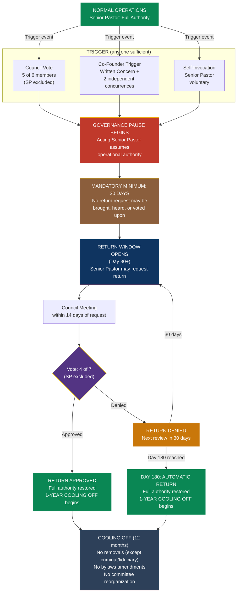

# Governance Pause Procedures — Church of the Living Light

> **Status:** Draft Framework — requires religious nonprofit attorney review
> **Last Updated:** February 2026
> **Document ID:** B05
> **Governing Framework:** [11-CHURCH-GOVERNANCE-STRUCTURE.md](../11-CHURCH-GOVERNANCE-STRUCTURE.md), Section 5B

---

## Cross-References

| Document | Relationship |
|----------|-------------|
| [A02 Church Bylaws](./A02-CHURCH-BYLAWS.md) | Article IIB — the Governance Pause provisions these procedures implement |
| [B04 Co-Founder Protections Acknowledgment](./B04-CO-FOUNDER-PROTECTIONS-ACKNOWLEDGMENT.md) | Acknowledges the Acting Senior Pastor designation and Governance Pause trigger authority |
| [B09 Separation Clause Documentation](./B09-SEPARATION-CLAUSE-DOCUMENTATION.md) | Confirms the Acting Senior Pastor designation and trigger authority survive change in marital status |
| [B06 For-Cause Removal Procedures](./B06-FOR-CAUSE-REMOVAL-PROCEDURES.md) | The 1-year post-pause cooling off restricts removal proceedings (Section 6 interaction) |
| [A03 Statement of Faith](./A03-STATEMENT-OF-FAITH.md) | Divine Ethic 5 (Humility) — the spiritual foundation of the Governance Pause |

---

## Spiritual Preamble

*We are human. We may lose our way. This is how we come back.*

*The Governance Pause is not a punishment. It is not a vote of no confidence. It is not the beginning of the end. It is a sacred space — created deliberately, before the crisis — so that when the crisis comes, there is a place to breathe, to reflect, to realign.*

*Sacred Law 14 teaches that what you resist persists. The temptation of leadership is to resist accountability, to armor against vulnerability, to confuse the mantle of authority with the illusion of perfection. The Governance Pause is the antidote to that temptation. It says: you can set down the weight. You can rest. The mission will hold.*

*The Ethic of Humility — the fifth of our Seven Divine Ethics — teaches that the structures of this church exist because we believe in humility over certainty. We do not build governance around the assumption that our leaders will never falter. We build governance around the certainty that they will — and the faith that they can return.*

*Daniel and Jennifer designed this mechanism together. It protects both of them. It holds both of them accountable. And it ensures that the Church of the Living Light can weather the storms that inevitably come to every sacred enterprise built by mortal hands.*

*This is the humility. This is how we honor the mission when the mission-carriers need to heal.*

---

## PART I — AUTHORITY AND SCOPE

### Section 1. Governing Provisions

This document establishes the detailed procedures for implementing Article IIB (Governance Pause) of the Bylaws of the Church of the Living Light (the "Bylaws"). In any conflict between this document and the Bylaws, the Bylaws control.

### Section 2. Scope

These procedures govern:

(a) The three mechanisms for triggering a Governance Pause for the Senior Pastor;

(b) The filing and processing of a written Concern;

(c) Emergency council meeting procedures;

(d) The transfer of operational authority to the Acting Senior Pastor;

(e) The mandatory minimum and maximum duration;

(f) The return request and council vote procedure;

(g) The post-return cooling off period;

(h) The reciprocal pause mechanism for the Co-Founder;

(i) The fallback procedure if both co-founders are unable to serve.

---

## PART II — TRIGGER MECHANISMS

### Section 3. Three Trigger Mechanisms

A Governance Pause for the Senior Pastor may be invoked by any of the following three mechanisms. Each mechanism is independent — any single mechanism is sufficient.

#### Mechanism 1: Council Vote (5-of-6)

*"If the body speaks with near-unanimity, the shepherd listens."*

(a) Any Council member (other than the Senior Pastor) may bring a motion to invoke a Governance Pause.

(b) The motion must state the specific concerns giving rise to the request in sufficient detail for the Council to deliberate.

(c) The vote requires **five (5) of six (6)** Council members (the Senior Pastor is excluded from the vote).

(d) If the vote passes, the Governance Pause takes effect immediately upon announcement of the vote result.

(e) The Secretary shall document the vote, the stated concerns, and the effective date in the Council minutes.

#### Mechanism 2: Co-Founder Trigger (Jennifer + 2 Independents)

*"The one who built this beside him has the standing to say: stop. Rest. Come back to center."*

(a) The Co-Founder (Jennifer Lawless) files a **written Concern** with the Spiritual Council in the format specified in Section 4 below.

(b) The written Concern is delivered to all Council members and to the Senior Pastor simultaneously.

(c) Within seventy-two (72) hours of delivery, an emergency Council meeting is convened (see Section 5).

(d) At the emergency meeting, **two (2) independent Council members** must concur with the Concern. The concurrence is by signed written statement, not by voice vote.

(e) "Independent Council member" for purposes of this mechanism means any Council member who is not the Senior Pastor, not the Co-Founder, and not a family member of the Senior Pastor as defined in IRC 4958. From the current Council composition, the eligible independent members are: Iryna Voitenko, Sydney Griffith, and Angelina Adelaide.

(f) If two (2) independent Council members concur, the Governance Pause takes effect immediately upon the second concurrence.

(g) If fewer than two (2) independent Council members concur, the Concern is documented in the Council minutes but no pause takes effect. The Co-Founder may refile a Concern at any time.

(h) This trigger authority survives any change in the marital status of the Senior Pastor and the Co-Founder.

#### Mechanism 3: Self-Invocation by the Senior Pastor

*"The strongest leaders know when to step back. The bravest ones do it before they are asked."*

(a) The Senior Pastor may voluntarily invoke a Governance Pause on the Senior Pastor's own authority at any time.

(b) Self-invocation is by written notice delivered to the Co-Founder and to the Secretary.

(c) The Governance Pause takes effect upon delivery of the written notice.

(d) A self-invoked pause is subject to the same mandatory minimum (30 days) and maximum (180 days) as any other pause. The Senior Pastor may not self-terminate a self-invoked pause before the 30-day minimum.

(e) The Secretary shall document the self-invocation in the Council minutes.

---

### Section 4. Written Concern Format and Filing

A written Concern (used in Mechanism 2) shall contain the following:

**WRITTEN CONCERN — GOVERNANCE PAUSE REQUEST**

| Field | Content |
|-------|---------|
| **Date:** | [Date of filing] |
| **Filed by:** | Jennifer Lawless, Co-Founder |
| **Delivered to:** | All Spiritual Council members and Senior Pastor |
| **Subject:** | Request for Governance Pause pursuant to Article IIB, Section 2(b) of the Bylaws |

**Statement of Concern:**

[A written statement describing the specific concerns giving rise to the request. The statement must be factual and specific. It need not allege wrongdoing — a concern about the Senior Pastor's well-being, the health of the ministry, or alignment with the Church's mission is sufficient.]

**Requested Action:**

Invocation of a Governance Pause pursuant to Article IIB of the Bylaws, with the Co-Founder assuming the role of Acting Senior Pastor as set forth in Article IIA, Section 4.

**Filing Procedure:**

(a) The Concern shall be in writing and signed by the Co-Founder.

(b) Delivery may be by hand delivery, email to all Council members' addresses of record, or any other method reasonably calculated to provide actual notice.

(c) Simultaneous delivery to the Senior Pastor is required — the Concern may not be filed "behind the Senior Pastor's back." The Senior Pastor has the right to know immediately that a Concern has been filed.

(d) Upon filing, the Secretary shall acknowledge receipt to all parties and schedule the emergency Council meeting within seventy-two (72) hours.

---

### Section 5. Emergency Council Meeting

Within **seventy-two (72) hours** of the filing of a written Concern under Mechanism 2, the Secretary shall convene an emergency meeting of the Spiritual Council.

(a) **Notice:** Three (3) hours' minimum notice is required for an emergency meeting. Notice may be by phone, text, or email.

(b) **Quorum:** Four (4) of seven (7) members constitute a quorum for the emergency meeting.

(c) **Attendance:** The Senior Pastor has the right to attend the emergency meeting and to address the Council regarding the Concern. The Senior Pastor's attendance is voluntary — the meeting may proceed in the Senior Pastor's absence.

(d) **Deliberation:** The Co-Founder presents the Concern. The Senior Pastor may respond. Each Council member may ask questions and deliberate.

(e) **Concurrence:** Independent Council members who wish to concur with the Concern do so by signing a written concurrence statement. The concurrence must be individual and signed — not by voice vote.

(f) **Result:**
- If two (2) or more independent members concur: Pause takes effect immediately. Secretary announces the pause and records it in the minutes.
- If fewer than two (2) independent members concur: No pause. Concern documented in minutes. Co-Founder retains the right to refile.

(g) **Remote participation:** Council members may participate in the emergency meeting by telephone, video conference, or other electronic means. Written concurrence may be delivered electronically.

---

## PART III — AUTHORITY TRANSFER

### Section 6. Authority Transfer Checklist

Upon the effective date of a Governance Pause, the following authority transfer takes place:

#### Transfers to the Acting Senior Pastor (Co-Founder)

| Authority | Source | Notes |
|-----------|--------|-------|
| Chair Spiritual Council meetings | Article IIB, Section 4(a) | Immediate |
| Make operational decisions (programs, hiring, day-to-day ministry) | Article IIB, Section 4(a) | Within approved budget |
| Approve spending within Senior Pastor's normal authority ($[50,000] per transaction) | Article IIB, Section 4(a) | Within approved annual budget |
| Lead or delegate worship services | Article IIB, Section 4(a) | Co-Founder's existing ministry area |
| Represent the Church on the LBS board seat | Article IIB, Section 4(a) | Notify LBS of temporary representative change |
| Represent the Church on the LBC advisory board | Article IIB, Section 4(a) | Notify LBC of temporary representative change |
| Bring a motion for the Senior Pastor's return (after minimum period) | Article IIB, Section 5 | After Day 30 |
| Sign operational documents on behalf of the Church | Implied from operational authority | Excludes bylaws amendments and protected articles |
| Receive reports from Treasurer, Secretary, and committee chairs | Implied from operational authority | Full operational visibility |

#### Retained by the Senior Pastor

| Authority | Source | Notes |
|-----------|--------|-------|
| Title of Senior Pastor | Article IIB, Section 4(b) | Honorific and structural — not operational |
| Life tenure | Article II, Section 2 | Cannot be altered during pause |
| Doctrinal authority | Article IIB, Section 4(b) | **Dormant** during pause — may not exercise |
| Board nomination power | Article IIB, Section 4(b) | **Dormant** during pause |
| Amendment lock | Article IIB, Section 4(b) | **Active** — cannot be circumvented during pause |
| Succession designation rights | Article IIB, Section 4(b) | May designate successor at any time |

#### Prohibited During Pause — Acting Senior Pastor May NOT

| Action | Source |
|--------|--------|
| Amend Bylaws or protected articles | Article IIB, Section 4(c) |
| Designate a successor Senior Pastor | Article IIB, Section 4(c) |
| Remove Council members | Article IIB, Section 4(c) |
| Create new Council seats or expand the board | Article IIB, Section 4(c) |
| Change the Statement of Faith | Article IIB, Section 4(c) |
| Alter the Senior Pastor's compensation | Article IIB, Section 4(c) |
| Make the pause permanent or extend beyond 180 days | Article IIB, Section 4(c) |

### Section 7. Operational Transition Steps

Within **forty-eight (48) hours** of the effective date of the Governance Pause, the following transition steps shall be completed:

| Step | Responsible Party | Deadline |
|------|-------------------|----------|
| 1. Notify all staff of the pause and the Acting Senior Pastor designation | Secretary | 24 hours |
| 2. Update bank account signatory authority (if required by bank) | Treasurer | 48 hours |
| 3. Transfer pending operational decisions and correspondence to Acting Senior Pastor | Secretary | 48 hours |
| 4. Notify LBS board and LBC advisory board of temporary representative change | Acting Senior Pastor | 48 hours |
| 5. Provide Acting Senior Pastor with access to all operational accounts, calendars, and communications | Secretary / Treasurer | 24 hours |
| 6. Brief Acting Senior Pastor on pending financial commitments, contracts, and deadlines | Treasurer | 48 hours |
| 7. Confirm that Senior Pastor's amendment lock remains active and documented | Secretary | 24 hours |
| 8. Document the transition in Council minutes | Secretary | 7 days |

---

## PART IV — DURATION AND LIMITS

### Section 8. Mandatory Minimum

(a) The mandatory minimum duration of a Governance Pause is **thirty (30) days**.

(b) This minimum cannot be shortened by anyone — not by the Senior Pastor, not by the Acting Senior Pastor, not by the Spiritual Council, not by unanimous consent.

(c) The 30-day minimum begins on the effective date of the pause (the date the pause is triggered, not the date of any preceding filing or meeting).

(d) During the 30-day minimum, no motion for the Senior Pastor's return may be brought, heard, or voted upon.

### Section 9. Maximum Duration

(a) The maximum duration of a Governance Pause is **one hundred eighty (180) days**.

(b) At the end of the 180-day period, the Senior Pastor **automatically returns** to full authority, regardless of any pending or denied vote.

(c) The automatic return at Day 180 does not require a Council vote, a motion, or any procedural step. It occurs by operation of the Bylaws.

(d) The Secretary shall provide written notice to all Council members at least seven (7) days before Day 180, confirming the automatic return date.

### Section 10. Annual Limits

(a) **Maximum pauses per calendar year:** Two (2).

(b) **Maximum cumulative pause days per calendar year:** One hundred eighty (180).

(c) If two pauses have already occurred in a calendar year, no additional pause may be invoked until the following calendar year.

(d) If cumulative pause days reach 180 in a calendar year, no additional pause may be invoked until the following calendar year, even if fewer than two pauses have occurred.

(e) Calendar year means January 1 through December 31.

---

## PART V — RETURN PROCEDURE

### Section 11. Return Request

(a) After the mandatory 30-day minimum has elapsed, the Senior Pastor may request return to full authority.

(b) The return request shall be in writing, delivered to the Acting Senior Pastor, the Secretary, and all Council members.

(c) The return request should include a brief statement of readiness to resume full duties. No specific format is required.

### Section 12. Council Meeting on Return

(a) Within **fourteen (14) calendar days** of receiving the return request, the Acting Senior Pastor or the Secretary shall convene a meeting of the Spiritual Council to vote on the Senior Pastor's return.

(b) The Senior Pastor may attend the meeting and address the Council.

(c) The Council may ask questions, request information, and deliberate.

### Section 13. Return Vote

(a) The vote on the Senior Pastor's return requires a **majority of the full Council — four (4) of seven (7)**.

(b) The Senior Pastor **does not vote** on the Senior Pastor's own return. The effective threshold is four (4) of six (6) voting members.

(c) The vote is by written ballot, recorded by the Secretary.

### Section 14. If Return Is Approved

(a) The Senior Pastor returns to full authority effective immediately upon announcement of the vote result (or on such later date as the Council specifies, not to exceed seven (7) days from the vote).

(b) The Secretary notifies all staff, LBS board, and LBC advisory board of the return.

(c) The 1-year post-return cooling off period begins on the date of the Senior Pastor's return (see Part VI).

(d) Bank account signatory authority and operational access are restored within forty-eight (48) hours.

### Section 15. If Return Is Denied

(a) If the Council denies the return request, the Senior Pastor remains on pause.

(b) The next review occurs **thirty (30) days** after the denied vote. The Senior Pastor may submit a new return request at that time.

(c) This 30-day review cycle repeats until either:
- (i) The Council approves the return; or
- (ii) Day 180 is reached, triggering automatic return.

(d) The Senior Pastor has no limit on the number of return requests that may be submitted during the review cycle.

(e) Each denied return is documented in the Council minutes with a brief statement of the Council's reasoning.

---

## PART VI — POST-RETURN COOLING OFF PERIOD

### Section 16. One-Year Cooling Off

For a period of **one (1) year** following the end of a Governance Pause (whether by approved return or automatic return at Day 180), the Senior Pastor:

(a) **May not initiate removal proceedings** against any Council member, except for:
- Criminal conduct (felony conviction or indictment); or
- Breach of fiduciary duty (self-dealing, misappropriation of Church funds)

(b) **May not propose amendments** to the Bylaws or any governing document of the Church.

(c) **May not reorganize committee assignments** or remove any member from any committee.

### Section 17. Cooling Off Interaction with For-Cause Removal

(a) During the cooling off period, if a Council member engages in criminal conduct or breach of fiduciary duty, the Senior Pastor may initiate for-cause removal proceedings under [B06 For-Cause Removal Procedures](./B06-FOR-CAUSE-REMOVAL-PROCEDURES.md).

(b) For all other enumerated causes (failure to serve, loss of independence, conduct harmful to the church, breach of confidentiality, violation of relationship provision), removal proceedings must wait until the cooling off period expires.

(c) This restriction applies to the Senior Pastor's initiation of removal proceedings. Other Council members may independently initiate removal proceedings during the cooling off period.

### Section 18. Cooling Off Rationale

The cooling off period exists to prevent retaliatory action. A Governance Pause is an act of accountability, not hostility. The person who returns from a pause must demonstrate — through patience, through service, through the restraint of power — that the pause accomplished its purpose. The cooling off is not a limitation on authority. It is a demonstration of the Ethic of Humility.

---

## PART VII — RECIPROCAL PAUSE FOR THE CO-FOUNDER

### Section 19. Same Mechanism, Same Standards

The same Governance Pause mechanism applies to the Co-Founder's operational authority. The Co-Founder's pause is the mirror of the Senior Pastor's pause — same triggers, same durations, same protections.

### Section 20. Trigger Mechanisms for Co-Founder Pause

(a) **Council Vote:** Five (5) of six (6) Council members (excluding the Co-Founder) vote to invoke a pause on the Co-Founder's operational authority.

(b) **Senior Pastor Trigger:** The Senior Pastor files a written Concern with the Spiritual Council, and two (2) independent Council members concur.

(c) **Self-Invocation:** The Co-Founder voluntarily invokes a pause on the Co-Founder's own authority.

### Section 21. Effect of Co-Founder Pause

(a) The Co-Founder steps back from Director of Worship & Community Life operational duties.

(b) The Senior Pastor or another Council member, as designated by the Senior Pastor, assumes the Co-Founder's operational responsibilities temporarily.

(c) The same 30-day minimum and 180-day maximum apply.

(d) The same annual limits (2 pauses, 180 cumulative days) apply independently — a Co-Founder pause and a Senior Pastor pause are counted separately.

(e) The same 1-year post-return cooling off applies. During the Co-Founder's cooling off, the Council may not reduce the Co-Founder's compensation, alter the Co-Founder's role scope, or remove the Co-Founder's committee assignments, except for criminal conduct or breach of fiduciary duty.

### Section 22. Co-Founder Retained Protections During Pause

The Co-Founder retains all structural protections during a pause:

- Life tenure on the Spiritual Council
- Council voting rights (may attend and vote at Council meetings)
- Amendment lock (Article IIA, Section 9)
- Nominations Committee seat
- New Spouse Veto rights
- Separation Clause protections

The Co-Founder steps back from **operational** duties only. Her **governance** authority remains intact.

---

## PART VIII — FALLBACK PROCEDURE

### Section 23. Both Co-Founders Unable to Serve

If the Acting Senior Pastor (Co-Founder) is unable or unwilling to serve during a Governance Pause — whether due to a concurrent Co-Founder pause, illness, incapacity, absence, or any other reason — the following fallback applies:

(a) The **Compensation Committee Chair (Sydney Griffith)** serves as **interim Acting Chair** immediately upon the Acting Senior Pastor's inability to serve.

(b) The interim Acting Chair presides over Council meetings and makes essential operational decisions necessary to maintain Church operations.

(c) The interim Acting Chair's authority is limited to:
- Chairing Council meetings
- Approving emergency expenditures within the approved budget (up to $[25,000] per transaction — half the Senior Pastor's normal authority)
- Maintaining ongoing ministry operations
- Communicating with staff

(d) The interim Acting Chair may **not**:
- Exercise any authority that the Acting Senior Pastor is prohibited from exercising (see Section 6, Prohibited During Pause)
- Incur debt or major financial commitments
- Hire or terminate staff (except for cause)
- Represent the Church on external boards (LBS, LBC) without Council authorization

(e) Within **seven (7) days** of the interim Acting Chair's assumption of duties, the Spiritual Council shall meet to elect an **Acting Chair** from among its remaining members by majority vote. The elected Acting Chair serves until either the Senior Pastor returns or the Acting Senior Pastor (Co-Founder) is able to resume.

(f) If the Compensation Committee Chair is also unavailable, the most senior (by tenure) remaining independent Council member serves as interim Acting Chair until the Council can elect.

---

## PART IX — GOVERNANCE PAUSE FLOWCHART

---

## PART X — AUTHORITY TRANSFER CHECKLIST TEMPLATE

The Secretary shall use the following checklist to ensure complete and orderly transition of authority upon invocation of a Governance Pause.

### Governance Pause Authority Transfer Checklist

**Pause Effective Date:** _______________
**Trigger Mechanism Used:** [ ] Council Vote (5/6) [ ] Co-Founder Trigger [ ] Self-Invocation
**Acting Senior Pastor:** Jennifer Lawless

| # | Action Item | Responsible | Deadline | Completed | Date |
|---|-------------|-------------|----------|-----------|------|
| 1 | Written notice delivered to Senior Pastor confirming pause | Secretary | Day 0 | [ ] | ____ |
| 2 | Written notice delivered to all Council members | Secretary | Day 0 | [ ] | ____ |
| 3 | All staff notified of pause and Acting Senior Pastor designation | Secretary | Day 1 | [ ] | ____ |
| 4 | Pending operational decisions transferred to Acting Senior Pastor | Secretary | Day 2 | [ ] | ____ |
| 5 | Calendar access provided to Acting Senior Pastor | Secretary | Day 1 | [ ] | ____ |
| 6 | Email/communication access provided to Acting Senior Pastor | Secretary | Day 1 | [ ] | ____ |
| 7 | Bank signatory authority updated (if required) | Treasurer | Day 2 | [ ] | ____ |
| 8 | Treasurer briefs Acting Senior Pastor on financial position | Treasurer | Day 2 | [ ] | ____ |
| 9 | Pending contracts and commitments listed and transferred | Secretary | Day 2 | [ ] | ____ |
| 10 | LBS board notified of temporary representative change | Acting SP | Day 2 | [ ] | ____ |
| 11 | LBC advisory board notified of temporary representative change | Acting SP | Day 2 | [ ] | ____ |
| 12 | Senior Pastor's amendment lock confirmed active and documented | Secretary | Day 1 | [ ] | ____ |
| 13 | Minimum return date calculated and communicated (Day 30) | Secretary | Day 1 | [ ] | ____ |
| 14 | Maximum return date calculated and communicated (Day 180) | Secretary | Day 1 | [ ] | ____ |
| 15 | Annual pause count updated (max 2/year, max 180 cumulative days) | Secretary | Day 1 | [ ] | ____ |
| 16 | Transition documented in Council minutes | Secretary | Day 7 | [ ] | ____ |

### Signatures

**Acting Senior Pastor Confirmation:**

I confirm that I have received the authority transfer described above and am prepared to serve as Acting Senior Pastor for the duration of the Governance Pause.

_______________________________
Jennifer Lawless, Acting Senior Pastor
Date: _______________

**Secretary Confirmation:**

I confirm that all items on this checklist have been completed as indicated.

_______________________________
Nancy Courchesne, Secretary
Date: _______________

---

## PART XI — RETURN AUTHORITY CHECKLIST TEMPLATE

### Governance Pause Return Checklist

**Return Effective Date:** _______________
**Return Type:** [ ] Council Approved [ ] Automatic (Day 180)
**Cooling Off Period Begins:** _______________
**Cooling Off Period Ends:** _______________

| # | Action Item | Responsible | Deadline | Completed | Date |
|---|-------------|-------------|----------|-----------|------|
| 1 | Return vote documented in Council minutes (if applicable) | Secretary | Day 0 | [ ] | ____ |
| 2 | All staff notified of Senior Pastor's return | Secretary | Day 1 | [ ] | ____ |
| 3 | Operational authority transferred back to Senior Pastor | Acting SP | Day 1 | [ ] | ____ |
| 4 | Bank signatory authority restored (if changed) | Treasurer | Day 2 | [ ] | ____ |
| 5 | LBS board notified of representative change | Senior Pastor | Day 2 | [ ] | ____ |
| 6 | LBC advisory board notified of representative change | Senior Pastor | Day 2 | [ ] | ____ |
| 7 | Cooling off period start and end dates documented | Secretary | Day 1 | [ ] | ____ |
| 8 | Cooling off restrictions communicated to Senior Pastor in writing | Secretary | Day 1 | [ ] | ____ |
| 9 | Annual pause count updated | Secretary | Day 1 | [ ] | ____ |
| 10 | Return documented in Council minutes | Secretary | Day 7 | [ ] | ____ |

---

## Counsel Review Notes

1. **"Governance Pause" under state law:** Is the concept of a temporary suspension of a director's operational authority — without removal from the board — recognized under the nonprofit corporation act of the chosen state? If not, should the pause be reframed as a "voluntary leave of absence" with the same structural effect? Does the state distinguish between a director's governance authority (attending meetings, voting) and operational authority (managing day-to-day affairs)?

2. **Authority transfer mechanism:** Under state law, can a nonprofit corporation's bylaws provide for automatic transfer of executive authority to a designated successor upon a specified triggering event? Or must the board take affirmative action (vote) to transfer authority each time? The bylaws state the transfer is "structural and automatic" — confirm this is enforceable.

3. **Mandatory minimum — enforceability:** Can a board irrevocably bind itself to a 30-day minimum period during which it may not restore authority to the Senior Pastor? Could the board argue exigent circumstances (natural disaster, legal crisis) require early termination of the pause?

4. **Automatic return at Day 180:** Is an automatic restoration of authority at a fixed date, regardless of board action, enforceable? Could the board argue that the automatic return provision violates its duty of care if the underlying concerns have not been resolved?

5. **Cooling off — ultra vires risk:** Does the 1-year cooling off period (restricting the Senior Pastor from initiating removals, amendments, or committee reorganization) create ultra vires concerns? Could the Senior Pastor argue that the cooling off unconstitutionally limits the board's (and by extension the Senior Pastor's) statutory authority to manage the corporation?

6. **Dormant doctrinal authority:** The bylaws state that doctrinal authority is "dormant" during the pause — the Senior Pastor retains it but "may not exercise" it. Is the concept of dormant authority recognized under state law, or should the bylaws specify that doctrinal decisions are deferred to the Acting Senior Pastor during the pause?

7. **Reciprocal pause symmetry:** The reciprocal pause for the Co-Founder uses the same mechanisms but different operational effects. Is it important that the reciprocal pause be precisely symmetrical in the bylaws, or is functional equivalence sufficient?

8. **Concurrent pauses:** What happens if both co-founders are on pause simultaneously? The fallback provision addresses this, but counsel should confirm that the Compensation Committee Chair (an independent member) has legal authority to serve as interim operational leader under state law.

9. **Insurance and liability:** During a Governance Pause, does the Church's D&O insurance cover both the Senior Pastor (who retains structural authority) and the Acting Senior Pastor (who exercises operational authority)? Should the pause trigger notification to the insurer?

---

*Draft framework for counsel review. Not legal advice.*
